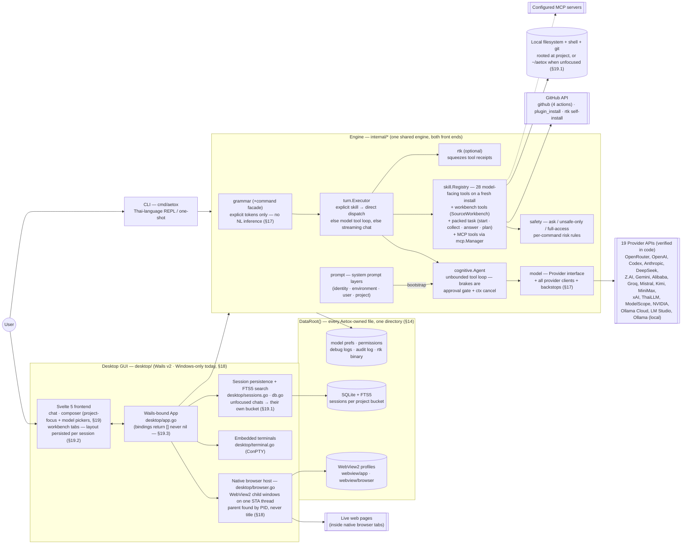
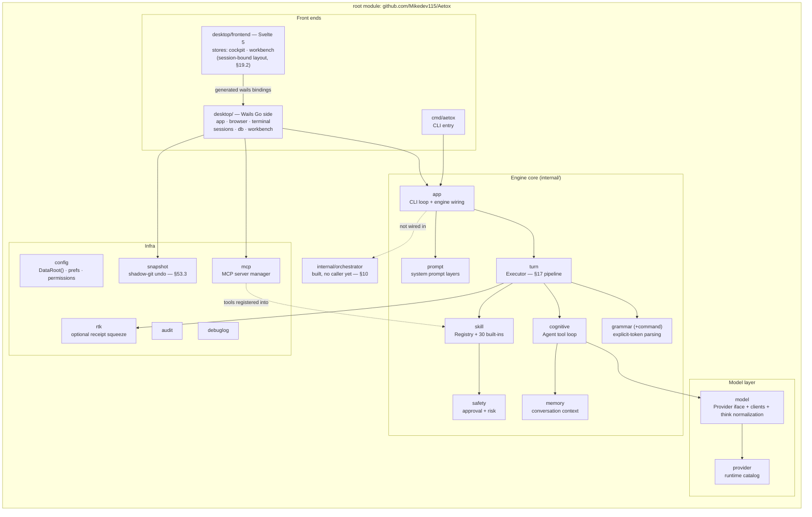
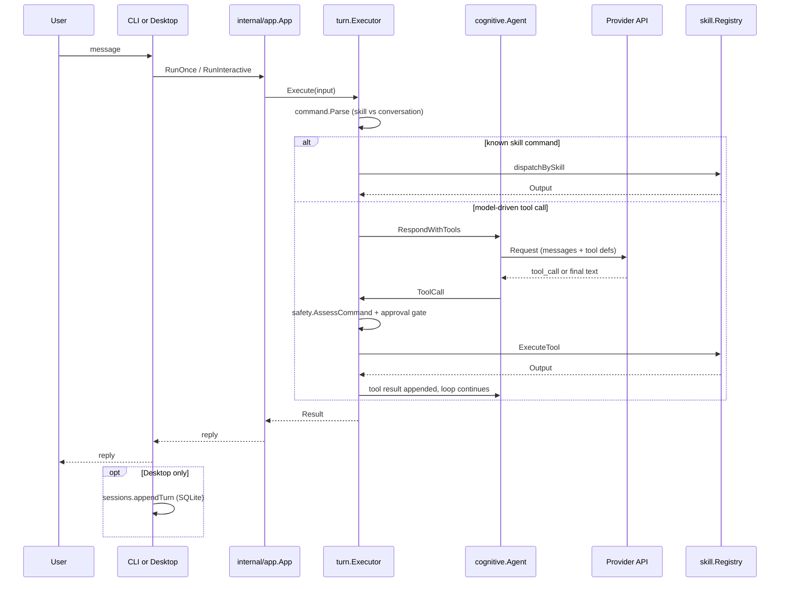

> **Pass level:** Full Mode
> **Trigger:** whole-project documentation requested at root; 3+ interacting modules (root/`internal`, `engine`, `providers`, `cli`, `desktop`), local persistence (SQLite), 11+ external provider integrations, remote code execution path (`plugin_install`).
> **Scope:** entire repository (`e:\Aetox\Aetox`), last updated 2026-07-24.
> **Evidence:** file tree, `go.work`/`go.mod`×4, `README.md`, `AETOX.md`, `docs/adr/0001`, `docs/adr/0002`, `docs/architecture/module-split-2026-07-21.md`, `docs/architecture/browser-security-2026-07-21.md`, `TEST-REPORT.md`, `MCP-SUPPORT-PLAN.md`, and direct reads of `cmd/aetox/main.go`, `internal/app/app.go`, `internal/cognitive/agent.go`, `internal/turn/executor.go`, `internal/skill/{skill,dispatcher,github_tools}.go`, `internal/safety/safety.go`, `internal/config/config.go`, `desktop/{app,browser,terminal,db,sessions,workbench}.go` and their `_test.go` files, `desktop/frontend/src/{App.svelte,style.css,lib/workbench/*}`.
> **Skipped:** Svelte component internals, provider-by-provider implementation detail (`internal/model/*.go` bodies), test file contents (existence noted, not read line-by-line).
> **Status labels used below:** `Direct` = confirmed by reading the file. `Inferred` = derived from evidence but not line-verified. `Proposed` = design intent, not yet built — never presented as existing.

This document is an evidence-first architecture map, distinct from [README.md](README.md) and `AETOX.md`, which are product vision/pitch documents and mix shipped state with roadmap in the same tables. Where they conflict with the code, this document follows the code.

---

## Document Map — this file is the hub

**Owner's law (2026-07-24): this is the master architecture document. Every separate architecture doc must be referenced here — a new doc gets its row in this table (and, if it records a decision, a numbered Decision section) in the same commit that creates it.**

| Doc | What it is |
|---|---|
| **This file** | Evidence-first whole-system map + the one-line index of the Decision log. Start here; everything below is a spoke. |
| [COMPANY.md](COMPANY.md) | **The canonical product picture (2026-08-05, owner's language): one face, five buttons, the office and its chairs, the dispatch star, the lines that are never crossed.** §83–§84 are its engineering record; on product-shape questions COMPANY.md wins, on implementation questions this file wins. |
| [docs/DOOR-ASSISTANT.md](docs/DOOR-ASSISTANT.md) · [docs/DOOR-CODE.md](docs/DOOR-CODE.md) | **Direction documents, one per door (2026-08-05), owner-written and meant to grow long.** Every room carries three fields: **ทิศทาง** (what it should become — the owner's), **วันนี้มีอะไร** (the shipped state, kept true to the code), **ช่องว่าง** (the distance between them). COMPANY.md holds the shape the whole company must keep; these hold the detail of each half. A direction that settles here graduates upward into COMPANY.md or into a numbered Decision. A third file, `docs/SETTINGS.md`, is reserved for the same treatment of the settings surface and does not exist yet. |
| [docs/DECISIONS.md](docs/DECISIONS.md) | **The full numbered Decision log (§10–§84), moved out of this file verbatim on 2026-08-05 with numbering untouched.** Code comments cite "ARCHITECTURE.md §NN" in hundreds of places — those numbers are permanent addresses and resolve there. Append-only; new decisions continue the numbering in that file, and each gets its row in the index below. |
| [README.md](README.md) | The product as a stranger meets it. Mixes shipped state with roadmap; this file wins on conflicts. |
| [docs/architecture/module-split-2026-07-21.md](docs/architecture/module-split-2026-07-21.md) | Why an `engine/`/`providers/`/`cli/` split was proposed and the migration plan (§4). ⚠️ The scaffold directories it describes were deleted in §28 — the rationale stands, the on-disk structure is gone. |
| [docs/architecture/browser-security-2026-07-21.md](docs/architecture/browser-security-2026-07-21.md) | Browser tab `postMessage` bridge — threat model, 3-check defense, residual risk (§6.6). |
| [docs/architecture/desktop-app-2026-07-22.md](docs/architecture/desktop-app-2026-07-22.md) | Layer-5 deep dive: every `desktop/` Go file + workbench frontend, read in full. |
| [docs/architecture/model-control-layer-2026-07-22.md](docs/architecture/model-control-layer-2026-07-22.md) | Layer-2 deep dive (`turn`/`cognitive`/`skill`/`safety`). ⚠️ Executor sections superseded by §17 — the doc says so itself. |
| [docs/architecture/tesseract-ocr-bundling-2026-07-22.md](docs/architecture/tesseract-ocr-bundling-2026-07-22.md) | How `image_ocr`'s Tesseract dependency reaches the user's machine per OS. |
| [docs/architecture/native-browser-embedding-2026-07-24.md](docs/architecture/native-browser-embedding-2026-07-24.md) | Native browser embedding: architecture, 7-entry failure catalog, macOS/Linux port blueprint (§18). |
| [docs/architecture/desk-file-panes-2026-08-06.md](docs/architecture/desk-file-panes-2026-08-06.md) | **The desk's reference table: what the `+` menu's four entries are for, and which pane draws which file** (§87). The menu lists *sources* that start from empty, never file types — a new file type earns a row in the routing table and nothing else. Also records where each size ceiling lives and why, and which formats are deliberately left to the program that already opens them. **§6 is written ahead of its code** (owner's rule: anything arriving on the desk is written here first) and specs the agent's own reach onto the desk — `desk_open`/`desk_list`, and the redaction §81 requires of the latter. |
| [docs/architecture/foreign-coding-clis-2026-07-27.md](docs/architecture/foreign-coding-clis-2026-07-27.md) | Why Claude Code / Codex / OpenCode may be consultants but never the provider seam; the deferred `claude-cli` profile plan (§46). |
| [docs/architecture/computer-use-2026-09-07.md](docs/architecture/computer-use-2026-09-07.md) | **Direction document, written ahead of its code, whose first row is now built (§9, §239)** — reaching apps Aetox did not start — the user's own Chrome/Edge, and any window through Windows UI Automation — plus the **การใช้คอมพิวเตอร์** register in Settings. Names the three layers a rival's one settings list hides (permission · installable mechanism · status), maps each onto what already exists here (`mode`/`safety`, `connect.Status`, `capability`), and fixes the rows, the gates and the six lines the reach never crosses. §5 is the plan and the record in one table: a row without a working hand behind it is not added. |
| [docs/adr/0001-native-tool-calling-foundation.md](docs/adr/0001-native-tool-calling-foundation.md) | ADR, Accepted 2026-06-07 — native tool calling as the agentic foundation. |
| [docs/adr/0002-directional-cognition-engine.md](docs/adr/0002-directional-cognition-engine.md) | ADR, Proposed 2026-07-10 — long-term multi-AI orchestration vision (ensemble/routing/consensus). |
| `AETOX.md` · `Aetox Desktop.md` · `MCP-SUPPORT-PLAN.md` · `SETTINGS-PARITY-PLAN.md` · `WINDMILL-AUTOMATION.md` | **Deleted from the working tree 2026-08-05 (owner's call), having already been unpublished since 2026-07-29.** Early pitch drafts and pre-implementation survey notes: everything they settled was restated here (and, for identity, in COMPANY.md), which is the copy that counts. Older sections below still cite them as the evidence trail they were; the first four are recoverable from git history, the Windmill note was never tracked. |
| [PLATFORM-SUPPORT.md](PLATFORM-SUPPORT.md) | What runs where **and the live port plan** — phases, per-phase blockers, and what each one has actually been measured to do. Was a record only; §48 made it the work. |
| [third_party/go-webview2/AETOX-PATCH.md](third_party/go-webview2/AETOX-PATCH.md) | Why go-webview2 is vendored+patched: stop a single browser tab's WebView2 error from `os.Exit`-crashing the whole app (§26). |
| [TEST-REPORT.md](TEST-REPORT.md) | The seams that **cannot** be tested and why, plus the conventions new tests follow. Read it for those, never for a count — the count is what `go test ./...` says, and the one written there went seven times stale before anyone noticed. CI that runs it all: [.github/workflows/ci.yml](.github/workflows/ci.yml) (§28). |
| [BENCHMARK.md](BENCHMARK.md) · [bench.ps1](bench.ps1) | Measured comparison against 13 installed rivals (disk/startup/RAM/soak) — the fairness rules, the raw results, and which numbers are **not** clean enough to publish. Every figure quoted in README.md or the landing page ([aetox-landing](https://github.com/Mikedev115/aetox-landing)) must trace back to a passing row here. |
| [TOKEN-AUDIT.md](TOKEN-AUDIT.md) · [cmd/tokenaudit](cmd/tokenaudit/main.go) | **What the spend bought nothing** — the audit over telemetry this repo already records, and the tool that runs it. Names the practice (instrumentation is the recording; this is the reading), explains its four sections, and pins the 2026-08-20 baseline so a later run has something to be compared against: 10.1% of all tool output bytes are byte-identical repeats inside one session, delegates keep 39.9% of tool output out of the chat, and one model carried 80% of every fresh input token ever spent from 34% of the calls. Deliberately **not** a second cost total — pricing is the usage page's ([desktop/usage.go](desktop/usage.go)), and two answers to one question is the debt this file exists to refuse. |
| [LICENSE](LICENSE) · [NOTICE](NOTICE) · [THIRD-PARTY-NOTICES.md](THIRD-PARTY-NOTICES.md) | **Proprietary, source-available since v1.3.0 (§148)** — free to use and read, not to modify, redistribute or rebrand. MIT up to v0.7.1 (§28), Apache-2.0 v0.8.0–v1.2.4 (§60); those releases keep those terms permanently. `NOTICE` reserves the "Aetox" name and logo. Third-party components are all permissive (MIT/BSD/Apache/OFL) — no GPL or AGPL in the tree. |
| ~~docs/competitor-research.md~~ | **Deleted 2026-08-25.** A capability matrix against five other tools, last researched 2026-07-17. Its competitor columns had gone stale (it still claimed none of them could drive a browser) and re-verifying five products is not work this repo can keep current, so it was publishing claims about other people that nobody here could stand behind. |
| ~~docs/architecture-review-aetox-cli.md~~ | **Deleted 2026-08-07.** A CLI-only current-state review from 2026-06-09 that predated `desktop/`, session persistence, the browser tab and `internal/orchestrator` — it had carried a SUPERSEDED banner since 2026-07-22 and nothing pointed at it for anything but history, which git already keeps. |
| Tier-1 module READMEs | `internal/{app,turn,skill,model,grammar,prompt,rtk,subagent}/README.md`, `cmd/aetox/README.md`, `desktop/README.md` — hub-and-spoke rule per §12: meaningful change to a module updates its README in the same commit. [internal/subagent/README.md](internal/subagent/README.md) is also the **sub-agent profile file-format reference** (§44). |

---

## Reader's Map — the "5 layers" mental model vs. actual code

A working mental model used for planning this project splits responsibility into 5 layers: **model management**, **model-control (skills/MCP)**, **orchestrator (multi-agent)**, **UI/CLI front ends**, and **desktop app**. This section states plainly how much of that is real, separate code today, so the mental model isn't mistaken for the module boundaries in §4.

| Layer | What exists today | Where |
|---|---|---|
| 1. Model management | Real behavior, but **not its own module** — lives inside `internal/model` (interface + 5 wire-format clients serving all 18 catalog providers + factory/bootstrap) and `internal/provider` (catalog), both part of the same flat root module. `providers/` (scaffold, §4) is where this is *meant* to move — zero code there yet. |
| 2. Model-control (skill dispatch, tool-calling loop) | Real, but **three cooperating packages, not one**: `internal/skill` (Registry/Dispatcher/30 built-ins), `internal/cognitive` (Agent), `internal/turn` (Executor) — see the flow in §5. MCP is real too, in its own package `internal/mcp` (§55). |
| 3. Orchestrator (multi-agent) | **Scaffold only.** `internal/orchestrator` exists (§10) but nothing calls it — both front ends still construct exactly one `cognitive.Agent` each. |
| 4. UI/CLI front ends | Real. Two front ends — `cmd/aetox` (CLI) and `desktop/` (GUI) — both driving the same engine through `internal/app`. |
| 5. Desktop app (browser/terminal/extension surface) | Real, and the most independently-developed layer as of this session: session persistence (SQLite), native browser tab (WebView2), embedded terminal (ConPTY) — see §4.2, `TEST-REPORT.md` Module 5, and `docs/architecture/browser-security-2026-07-21.md`. |

**Answering "is it 5 clean modules now": no.** Only layer 5 (`desktop/`) is a genuinely separate Go package boundary from the rest. Layers 1–3 are conceptual groupings *within* the same flat `internal/` module (15 packages) — there is no compiler-enforced boundary stopping "layer 1" code from reaching into "layer 2" today. Treat the 5-layer split as a **planning/reading aid**, not as enforced architecture, until the `engine/providers/cli` migration (§4) actually happens.

---

## 1. Synthesis (read this first)

- **Two systems currently share the root Go module without a boundary.** `cmd/aetox` (CLI) and `desktop/` (Wails GUI) both import `internal/app`, but the GUI only uses ~2 of that package's ~35 exported methods (`NewApp`, `RunOnce`) — the rest is CLI terminal presentation (banner, status bar, spinner, Thai-language approval prompts). See [§6.1](#61-internalapp-mixes-orchestration-with-cli-terminal-presentation). `Medium`, `Direct`.
- **`internal/model` imports `internal/provider`**, so the abstraction (Provider interface, Message types) depends on the implementation catalog — already identified by the project's own [module-split proposal](docs/architecture/module-split-2026-07-21.md). Confirmed still true by direct import scan. `Medium`, `Direct`. This was the stated reason `engine/`, `providers/`, `cli/` existed as scaffolds; the coupling outlived them.
- ~~**The 3-module split (`engine/`, `providers/`, `cli/`) is an empty scaffold** — `go.mod` files only, zero source~~ — **deleted 2026-07-25 (§28)** along with `go.work`/`go.work.sum`. Four days of empty directories only obscured where the running code lives: `internal/` and `cmd/`. The migration rationale is preserved in the module-split doc; re-scaffold when migration actually starts.
- ~~`Registry.Register()` silently overwrites on name collision, and there is no built-in-vs-user-added distinction~~ — **fixed 2026-07-21**, see §6.4 below. `Register` now takes a `Source` and rejects collisions instead of overwriting.
- ~~`SearchSessions` (Desktop session search) doesn't work at all — silently returns nothing on every call~~ — **fixed 2026-07-22**, see §6.7 below. Root cause was narrower than first recorded: `snippet()` combined with `GROUP BY` in one query (not the whole query shape). Fixed with a `MATERIALIZED` CTE, single query, no two-step needed.
- **Browser tab Z-order, `postMessage` origin/replay forgery, and two frontend resize/layout bugs — all fixed 2026-07-21/22.** See §6.6 and §6.8 below.
- ~~`README.md`/`AETOX.md` advertise Anthropic support that doesn't exist in the actual provider catalog~~ — **fixed 2026-07-22**, see §6.9 below. `internal/model/anthropic.go` now implements a real client against Anthropic's Messages API (`/v1/messages`, `x-api-key`/`anthropic-version` headers, content-block request/response shape — not OpenAI-compatible, so it's its own file, not a reuse of `openai_compatible.go`), registered in the catalog and wired into the desktop provider picker (`desktop/app.go`'s `desktopProviders`). `zai` is still undocumented in both docs — that half of §6.9 is still open.

**Primary recommendation:** ~~apply the `SearchSessions` fix (§6.7)~~ — applied 2026-07-22, suite green. Next: the `Registry` Source gap (§6.4, closed) unblocks deciding what `plugin_install`'s loader (§6.5) or an MCP client should set as `Source` — `SourceExternal` alone doesn't yet distinguish them. Independently, `zai` (Z.AI/GLM) is fully implemented but still absent from `README.md`/`AETOX.md`'s provider tables — same category of doc-drift as the now-fixed Anthropic gap, worth a follow-up pass.

---

## 2. System Overview (confirmed)

Aetox is a single-user, local-first AI coding/personal-assistant agent with two front ends sharing one Go engine:

- **CLI** (`cmd/aetox`) — interactive REPL or one-shot invocation, Thai-language terminal UI.
- **Desktop** (`desktop/`) — Wails v2 + Svelte 5 GUI with chat, a tabbed workbench (Review/Terminal/Files/Browser), persistent SQLite-backed sessions, and an agent-controlled native browser (WebView2).

Both front ends drive the same tool-calling agent loop: user message → `cognitive.Agent` → provider API (model-driven tool calls) → `turn.Executor` dispatches to one of the 27 model-facing built-in skills → result folded back into the conversation.

No backend server, no cloud database, no multi-tenant concerns — everything runs on the user's machine against third-party model provider APIs.

---

## 3. System Boundary

- **Confirmed external dependencies:** 13 named provider HTTP APIs (14 catalog entries, counting the built-in `aetox` fallback), verified against the actual catalog map in `internal/provider/catalog.go` (not README's list — see §6.9, they differ), GitHub REST API (`internal/skill/github_tools.go`), local shell (`internal/skill/shell.go`), local filesystem, SQLite (confirmed `modernc.org/sqlite`, `Direct` — `desktop/db.go:17`), Windows WebView2 (`desktop/browser.go`, Win32 syscalls — Windows-only, `Direct`).
- **Not observed:** no outbound telemetry/analytics code found in `internal/` or `desktop/` during inspection (`Inferred`, `Verify first: Yes` — not exhaustively grepped for every HTTP client call).

---

## 4. Module Map

`rootmod` is the whole picture — one module, no workspace. The `engine/`/`providers/`/`cli/` scaffold that used to sit beside it was deleted in §28; the split it was meant to become is still [proposed](docs/architecture/module-split-2026-07-21.md), just no longer half-present on disk.

### 4.1 `internal/` packages (root module, `Direct`)

Per-module docs (hub-and-spoke, §12): Tier-1 modules carry a `README.md` in their own folder — linked in the **Docs** column. Front-end modules: [cmd/aetox/README.md](cmd/aetox/README.md), [desktop/README.md](desktop/README.md) (§4.2).

| Package | Files | Role | Docs |
|---|---|---|---|
| `app` | 4 | CLI interactive loop + orchestration wiring (`NewApp`, `RunOnce`, `RunInteractive`, banner/status bar, approval-mode picker). Shared with desktop only via `NewApp`/`RunOnce` — see [§6.1](#61-internalapp-mixes-orchestration-with-cli-terminal-presentation). | [README](internal/app/README.md) |
| `cognitive` | 2 | `Agent` — builds provider requests, runs the (unbounded, §11 "related cleanup") tool-call loop, streams responses. | [model-control deep dive](docs/architecture/model-control-layer-2026-07-22.md) |
| `turn` | 3 | `Executor` — turn pipeline (§17): explicit skill command → direct dispatch, else model-driven tool loop, else streaming chat; approval gate on every tool path. No NL intent inference — that layer was deleted 2026-07-23. | [README](internal/turn/README.md) |
| `skill` | 43 | `Registry`/`Dispatcher` + the built-in tools, registered in [defaults.go](internal/skill/defaults.go). The 20 this package offers the model on a fresh install: `read`/`search`/`change`/`git`/`shell`/`codebase`/`rename`/`sheet_write`/`doc_write`/`media_read`/`pdf_read`/`web_fetch`/`web_search`/`github`/`pr`/`plugin_install`/`skills_list`/`skill_view`/`time`/`calc`, plus `n8n` and `windmill` once an engine is connected; the other 8 of the 28 in the block come from `desktop/` (`browser`, `desk`, `desk_terminal`, `ask_user`, `memory`, `session_search`, `task`, `todo_write`). **Seven of those are packed** (§99, [packed.go](internal/skill/packed.go) and the `*_pack.go` files beside it): `shell` is `run`/`output`/`kill`/`list`, `github` is `search`/`repo_summary`/`list_files`/`read_file`, `pr` is `list`/`read`/`checks`/`create`/`comment`, and 2026-08-29 added four more — `search` (`list`/`glob`/`grep`), `change` (`write`/`edit`/`append`/`batch`/`delete`), `codebase` (`errors`/`symbol`/`map`) and `media_read` (`image`/`video`/`audio`) — with the two engines carrying their five calls each, `n8n` as `list`/`read`/`create`/`update`/`activate` and `windmill` as `workspaces`/`list`/`read`/`create`/`update`. That is what took the block from 37 entries to 27 (~7,800 → 7,009 tokens) with nothing removed; `pr` and `rename` landed after and brought it to 28 / ~7,527. The rule the packs are drawn by: **a pack may not straddle a line a gate already draws** — `search` reads only, `change` writes only, which is why `rename` is not inside `codebase` and `pdf_read` is not inside `media_read`. `read` is deliberately unpacked: it says what a file SAYS rather than where it is, and it is the most-called tool in the log. Two more packs live in `desktop/` because they need a window: `browser` (nine actions) and, since 2026-08-20, `desk` — `open`/`list`/`close`, the surface itself. The old per-action names (`shell_output`, `desk_close`, `n8n_workflow_activate`, `windmill_workspace_list`, …) are still the permission keys and still what `internal/safety` and the approval prompt judge a call by. The other 3 (`echo`/`fs`/`help`) are CLI-only and never sent to the model, and `notebook_edit` is a fourth kind: compiled in and **deliberately not registered** since 2026-08-19 (owner's call — 317 tokens on every request of every desk carrying the files group, against zero calls in `tool_runs`). Its file stays because `read` renders an `.ipynb` through the same code, so notebooks are readable and read-only; re-registering it in [defaults.go](internal/skill/defaults.go) is the whole of switching it back on. | [README](internal/skill/README.md) |
| `model` | 18 | `Provider` interface, `Message`/`Request`/`Response` types, factory, bootstrap, and **5 wire-format client implementations** (anthropic, openai_compatible, responses, ollama, noop) serving all 18 catalog providers, in the same package. Imports `internal/provider` (see [§6.2](#62-modelprovider-imports-providers-catalog)). | [README](internal/model/README.md) |
| `provider` | 2 | Provider runtime catalog (names, capabilities) — separate from `model`'s own `provider_catalog.go`, which is a second source for similar data (`Inferred`, `Verify first: Yes` — not diffed line-by-line). | — |
| `safety` | 2 | 3-tier approval (`ask`/`unsafe-only`/`full-access`), per-command risk assessment (`AssessCommand`, git/fs-specific rules). `PermissionRule.Default` separates a rule the app generated from one the user wrote: an app default yields to the approval mode the user picked, a user's rule outranks it. | [model-control deep dive](docs/architecture/model-control-layer-2026-07-22.md) |
| `command` | 3 | Input intent parsing facade — thin aliases delegating to `grammar` (the real implementation). | see `grammar` |
| `config` | 2 | Config loading, `.env`, model-preference persistence (JSON on disk). Owns `DataRoot()` — the single directory every Aetox-owned file lives under, see [§14](#14-decision--unified-data-root-2026-07-23-cleaning-up-where-aetox-writes-its-own-data). Also owns two layouts other packages need and must not re-derive: `AgentHome`/`AgentDefinitionPath`/`AgentMemoryPath` (one agent is one folder) and `credentials.json`, split out of the preference file so settings stay quotable while secrets get their own handling. `MCPServersForDesk`/`MCPServersForAgent` answer who carries a server from its own `for:` list. | — |
| `atrest` | 0 | Wraps a secret for storage — DPAPI on Windows, passthrough elsewhere. Its own leaf package because `config` and `oauth` both hold credentials and `config` already imports `oauth`. | — |
| `think` | 2 | Thinking-level normalization per provider. | — |
| `plan` | 2 | Execution planning (conversation vs. skill classification, per ADR 0001). | — |
| `memory` | 1 | Context/conversation memory. | — |
| `mode` | 2 | Session modes (§83/§84) — one desk per kind of work. Bundled `modes/*.md` (assistant · coding · specialized) shadowed by `<DataRoot>/modes/*.md`; `categories:`/`tools:`/`deny:` select built-ins, `chairs:` names tools **or whole categories** kept **in the room for the desk's agents but off the desk itself** (the office says `files, shell, deliverables`, which is assistant parity minus the developer group — §212), default-closed `mcp:` attaches servers, default-closed `dispatch:` names the desks this one may hand a job to, the body is the direction prompt. `Carries` is the one place a registered tool is judged (MCP by server, skills always kept); `CarriesForChair` is the same question asked on behalf of a chair, and is the only reader of `chairs:` — an ordinary delegate gets the plain ceiling. `Office` is the desk chairs sit at. Not an identity (§44.0) and not a permission tier. | §83, §84 |
| `audit` | 2 | Execution audit log. | — |
| `debuglog` | 1 | Debug logging, and the process's one secret registry: `Redact` records a value, `Scrub` removes it. Three sinks use it — the debug log, the shell audit log, and `tool_runs` in the database — so a key registered once cannot reach any file that outlives the session. | — |
| `grammar` | 2 | Input classification rules engine (Kind/Intent/slash parsing) behind the `command` facade. | [README](internal/grammar/README.md) |
| `orchestrator` | 2 | Multi-`cognitive.Agent` lifecycle tracker (`Spawn`/`Get`/`Stop`/`List`). Built this session, **not called by `cmd/aetox` or `desktop/app.go` yet** — see [§10](#10-decision--agent-orchestrator-layer-proposed-approved-2026-07-21) for scope and naming rationale. | §10 |
| `prompt` | 2 | System prompt assembly (identity/environment/user-global/project layers) — both front ends call it, replacing two near-duplicate `buildSystemPrompt` copies. Built 2026-07-22, see [§11](#11-decision--promptcontext-layer-proposed-being-settled-section-by-section-2026-07-22). | [README](internal/prompt/README.md) |
| `snapshot` | 1 | Shadow-git undo: a per-project git repository under `DataRoot()` with its work tree pointed at the real project, so a snapshot costs one `write-tree` and the user's own repository never notices. Bound into `desktop/app.go`; **no UI button yet** — see [§53.3](#533-undo--internalsnapshot). | §53.3 |
| `rtk` | 4 | Optional bridge to the owner's `rtk` CLI — shrinks tool-call output before it's wrapped into the model's receipt (`turn.modelToolReceipt`). v1: `git`+`shell` only. Auto-installs itself once from GitHub if missing (`install.go`), no NSIS changes. Built 2026-07-22, see [§13](#13-decision--rtk-integration-proposed-being-settled-section-by-section-2026-07-22). | [README](internal/rtk/README.md) |

### 4.2 `desktop/` (root module, `Direct`)

Module doc: [desktop/README.md](desktop/README.md) (replaced the Wails template boilerplate 2026-07-22).

| File | Role |
|---|---|
| `app.go` (665 lines) | Wails-bound `App` struct — the GUI's own type, distinct from `internal/app.App`. Owns `bootstrapFromConfig` (wires `internal/app.App` + `cognitive.Agent` + extra skills), provider/model switching, project tree/file read-write for the Files pane. |
| `sessions.go` | Per-project session persistence: `ListSessions`, `SearchSessions` (FTS5 — fixed 2026-07-22, see §6.7 below), `LoadSession`, transcript ↔ `model.Message` conversion. |
| `db.go` (77 lines) | SQLite connection + schema. `App.dbDir` overrides the default `<UserConfigDir>/aetox` directory (empty = production default) — a test seam added this session, not a behavior change. |
| `browser.go` (~470 lines) | Native WebView2 tab host via raw Win32 syscalls (`wndClassExW`, message loop) — Windows-specific, no build-tag isolation observed (`Inferred`, `Verify first: Yes`). Z-order and `postMessage`-forgery issues fixed this session — see §6.6 below and `docs/architecture/browser-security-2026-07-21.md`. |
| `workbench.go` · `browser_tool.go` · `workbench_desk.go` | One `browser` tool with nine actions — `open`, `read`, `click`, `type`, `wait`, `back`, `capture`, `tabs`, `dialog` — and one `desk` tool with three (`open`, `list`, `close`, §99 · 2026-08-20), both implemented as `skill.Tool`; the agent drives the browser itself, distinct from the user-facing `BrowserOpen`/`BrowserNavigate` etc. in `browser.go`. `read` tags interactive elements with `data-aetox-ref` (see `textScript`, `browser.go`) so `click`/`type` can target one by number — same ref-based pattern as Playwright MCP's accessibility tree and browser-use's element index. Packed on 2026-08-10 (§99): four tools describing one object cost four tool-block entries in every request that carried them, and every new browser capability cost another. The `desk` pack followed the same rule and drew the line the rule implies: `desk_terminal` stays a tool of its own, because the pack is the *surface* and a terminal is a thing that lives on it — the same reason the browser is not part of the desk. That keeps every action in `desk` inside one category and inside วางแผน's allow-list, which is what a desk gate and a stance need, since neither can cut inside a pack. The old `browser_open`/`browser_read`/`browser_click`/`browser_type` names live on as the **per-action permission keys** — `categories:` and a profile's `tools:` (which no bundled agent writes any more, §212) still speak them, so a profile naming only some gets only those actions and the tool's description advertises only those. Its vocabulary is declared in `internal/skill/packed.go` beside the other packs, and the narrowing arrives from `subagent.FilterRegistry` like theirs — the file's original private profile-reading gate was retired when the mechanism generalized (§99). The agent browses in ONE tab: `open` navigates the tab it already has (`agentBrowserTabID`) rather than minting `web-agent-N` per call, which is what makes the four actions one flow. This is the pattern `MCP-SUPPORT-PLAN.md` recommends reusing for an MCP adapter. |
| `terminal.go` | Embedded shell session lifecycle (`TerminalStart`/`Write`/`Resize`/`Close`), independent of `internal/skill/shell.go` (that one is the agent's `shell` tool; this is the user-facing terminal pane). |
| `main.go` (39 lines) | Wails bootstrap. |

Test files added this session (`Direct`, all passing except the one noted bug): `app_test.go`, `browser_test.go`, `db_test.go`, `sessions_test.go`, `terminal_test.go` — per-file coverage detail in `TEST-REPORT.md` Module 5. `TerminalStart`/`TerminalClose`/`browser.go`'s Win32 window plumbing remain **not** unit-testable (documented there): `wailsruntime.EventsEmit` calls `log.Fatalf`/`os.Exit(1)` when the context isn't a real Wails-bound one, which a test never has.

`desktop/frontend/src/lib/`: `stores/` (Svelte 5 runes: `cockpit.svelte.ts`, `workbench.svelte.ts`), `services/cockpit.ts` (Go binding wrappers), `workbench/*.svelte` (Review/Files/Browser panes). Not read in detail — structure only (`Direct` for existence, `Inferred` for internal behavior), except `App.svelte` (resize-handle logic, read in full — see §6.8) and `workbench/Workbench.svelte`/`style.css` (address-bar + blank-state layout, read in full — see §6.8).

---

## 5. Primary Workflow — one chat turn

Desktop-specific additions confirmed in `desktop/app.go`/`sessions.go`: every turn is persisted via `appendTurn` after `SendMessage` returns; sessions are keyed per project root (`projectKey`); full-text search is FTS5-backed.

---

## 6. Debt Register

### 6.1 `internal/app` mixes orchestration with CLI terminal presentation

- **Evidence:** `internal/app/app.go` exports `NewApp`, `RunOnce`, `RunInteractive`, `PrintBanner`, `printStatusBar`, `printPromptLine`, `pickApprovalMode` (Thai-language console prompts), `showHelp`, `showSkillPalette` — all in one package/type. `desktop/app.go:275-289` (`SendMessage`) calls only `a.chat.RunOnce`; no desktop code path reaches `RunInteractive`, `PrintBanner`, or the approval-mode console picker.
- **Impact:** the GUI binary compiles and links terminal-rendering code it never calls. Any change to CLI presentation (banner, status bar, Thai approval prompts) risks breaking desktop's build even though desktop doesn't use those methods. The project's own [module-split plan](docs/architecture/module-split-2026-07-21.md) intends to move this whole package to `engine/app/` labeled "shared by CLI + desktop" — migrating as-is carries the same mixing forward.
- **Severity:** `Medium` (taxes the planned migration; doesn't break anything today).
- **Confidence:** `Direct`.
- **Direction (proposed, needs approval):** split `internal/app` into an orchestration piece (`NewApp`, `RunOnce`, turn-executor wiring — genuinely shared) and a CLI-presentation piece (banner, status bar, interactive loop, approval picker) before or during the `engine/` migration, so `engine/app/` doesn't inherit terminal-only code.

### 6.2 `model` imports `provider` — abstraction depends on implementation

- **Evidence:** `internal/model/factory.go`, `provider_catalog.go`, `thinking_capabilities.go` import `internal/provider`. Documented and accepted as the reason for the 3-module split in [module-split-2026-07-21.md:8-16](docs/architecture/module-split-2026-07-21.md).
- **Impact:** any consumer of `model.Provider`/`model.Message` transitively pulls in the full provider catalog; can't depend on the interface alone.
- **Severity:** `Medium`.
- **Confidence:** `Direct`.
- **Direction:** already proposed (`engine/model` interface-only, `providers/` for implementations) — no new recommendation, just confirming the existing plan matches the evidence. The empty scaffold that used to stand in for it is gone (§28); the plan is a plan again, not a half-built directory.

### 6.3 Two provider catalogs

- **Evidence:** `internal/model/provider_catalog.go` and `internal/provider/catalog.go` both exist; not diffed for exact overlap.
- **Impact:** unclear without deeper read — possibly one is the canonical list and the other is a thin re-export, or they've drifted.
- **Severity:** `Low`–`Medium` (`Unverified` which).
- **Confidence:** `Inferred`, `Verify first: Yes`.
- **Direction:** none proposed — needs verification first, listed as an open question (§7).

### 6.4 Skill registry has no core/user-added boundary — FIXED 2026-07-21

- **Original evidence:** `internal/skill/skill.go:44` `Registry.Register()` overwrote on key collision with no warning. `internal/skill/defaults.go` registered all 17 built-ins and `plugin_install` into the same flat map. Documented in detail in `MCP-SUPPORT-PLAN.md:37-51`.
- **Impact (was):** couldn't gate trust levels differently (built-in vs. third-party MCP/plugin tool), couldn't show "core" vs. "installed" separately in the Settings UI, and a user-installed skill could silently shadow a built-in tool by name.
- **Severity:** was `High` (blocked safe MCP support).
- **Fix applied:** [internal/skill/skill.go](internal/skill/skill.go) — added `Source` type (`SourceBuiltin`/`SourceExternal`), `Registry` now stores `{skill, source}` pairs and exposes `SourceOf(name)`. `Register(skill, source)` returns an error instead of silently overwriting on name collision.
  - [internal/skill/defaults.go](internal/skill/defaults.go) — all 12 built-ins register with `SourceBuiltin`; a collision among built-ins now panics at startup (programmer error, not a runtime condition).
  - [desktop/app.go](desktop/app.go) `bootstrapFromConfig` — `extraSkills` (the `workbenchTools`: `browser` and the rest) register with `SourceExternal`; a collision is logged via `debuglog.Msg` and the skill is skipped rather than silently overwriting a built-in.
  - Tests: [internal/skill/skill_test.go](internal/skill/skill_test.go) (`TestRegisterTracksSource`, `TestRegisterRefusesCollision`).
- **Still open:** `SourceExternal` is one bucket for everything non-built-in — MCP and `plugin_install`-loaded skills don't yet have their own distinct source values, and nothing consumes `SourceOf` yet (no per-source permission gating, no Settings UI grouping). Add `SourceMCP`/`SourcePlugin` when those integrations are actually built, not before.
- **Confidence:** `Direct` — `go build ./...` and `go test ./internal/skill/...` pass.

### 6.5 `plugin_install` downloads files but nothing loads them back

- **Evidence:** `internal/skill/github_tools.go` implements `plugin_install` fully (fetches manifest, path-traversal-checked, writes to `~/.agents/skills/<name>/`) but `internal/skill/defaults.go` only registers compiled-in Go skills — no bootstrap-time scan of the install directory. Confirmed by direct read of `validatePluginManifest`/`normalizeManifestRelativePath` (traversal guards present) and by `MCP-SUPPORT-PLAN.md:17-23`.
- **Impact:** "installing a plugin" via this tool currently has no observable effect after download completes.
- **Severity:** `Medium` (feature is inert, not unsafe — path traversal is guarded and manifest type is restricted to `"skill-bundle"`).
- **Confidence:** `Direct`.
- **Direction:** proposed in `MCP-SUPPORT-PLAN.md` — write a loader that scans the install directory at `bootstrapFromConfig` time; decide execution model for downloaded (non-compiled) skills first.

### 6.6 Browser tab Z-order + `postMessage` forgery — FIXED 2026-07-21/22

- **Evidence (Z-order):** `desktop/browser.go`'s tab window used only `MoveWindow`/`ShowWindow` — neither changes Z order. Two independent WebView2 controllers in one top-level window each composite via DirectComposition; without an explicit Z-order call the tab's pixels could render behind the app's own webview — confirmed live (page navigated successfully, per-page title updated, but the tab area stayed solid black, the app's own background color).
- **Evidence (`postMessage` forgery):** `onMessage` trusted a page's `postMessage({__aetox:...})` envelope with no check that the page was the one it claimed to be, or that a `"text"` response corresponded to a specific `BrowserGetText` call. `args.GetSource()` (real origin, page can't forge) was available on `ICoreWebView2WebMessageReceivedEventArgs` but unused.
- **Impact:** Z-order bug made the entire browser tab feature appear non-functional (page loads, nothing visible). The `postMessage` gap allowed a malicious page to (a) claim an arbitrary `url` in a `"meta"` message — address-bar spoofing, a phishing enabler — and (b) inject fabricated `"text"` content into the agent's `BrowserGetText` read path — a prompt-injection vector distinct from the page's own real (untrusted) DOM content.
- **Severity:** was `High` for the `postMessage` gap (security), `Medium` for Z-order (functionality, not security).
- **Fix applied:** `procSetWindowPos` + `HWND_TOP` on tab creation/resize/show ([browser.go](desktop/browser.go)). `onMessage` now requires `sameOrigin(source, m.URL)` for `"meta"`, and a matching per-request nonce (`textToken`, minted by `BrowserGetText`, `crypto/rand`) for `"text"`. Full threat model and residual risk in [docs/architecture/browser-security-2026-07-21.md](docs/architecture/browser-security-2026-07-21.md).
- **Confidence:** `Direct` — 12 new tests in `browser_test.go`, `go build`/`go vet` clean.

### 6.7 `SearchSessions` returned nothing, ever — FIXED 2026-07-22

- **Evidence:** `desktop/sessions.go`'s `SearchSessions` joined `messages_fts` (FTS5) with `messages`/`sessions` in one query and called `snippet(messages_fts, ...)` in the same statement. That shape returns SQL error `"unable to use function snippet in the requested context"` from `modernc.org/sqlite` every time — and `SearchSessions` swallows the error (`if err != nil { return out }`), so the function always silently returned zero results instead of surfacing a failure. That silent swallow is why the bug was invisible outside the failing test.
- **Root cause (narrowed from the original record):** not the whole join shape — specifically `snippet()` + `GROUP BY` in one statement. Probing each variant against `modernc.org/sqlite v1.54.0` showed the same query passes with either `snippet()` or `GROUP BY` removed, and a plain subquery doesn't help (the planner flattens it back into the failing shape).
- **Fix applied:** `snippet()` moved into a `WITH f AS MATERIALIZED (...)` CTE, which the planner may not flatten; the outer query keeps the joins, `GROUP BY s.id` dedupe, and ordering. Single query — the originally proposed two-step rewrite wasn't needed.
- **Confidence:** `Direct` — [`TestSearchSessionsFindsMatch`](desktop/sessions_test.go) now passes (it verified both a hit and a miss), full `desktop` suite green.

### 6.8 Frontend layout bugs — FIXED 2026-07-22

Three distinct issues surfaced while verifying the Z-order fix (§6.6) visually, all in `desktop/frontend/src/`:

- **Blank-state text clipped instead of wrapping** — [style.css](desktop/frontend/src/style.css) `.insp-blank-title`/`.insp-blank-sub` sat in a `align-items:center` flex column with no `max-width`, so they sized to their own text's natural width instead of the pane's — at a narrow pane width the text overflowed and was hard-clipped by the ancestor's `overflow:hidden` instead of wrapping. **Fixed:** added `max-width:100%` + `text-align:center` + container padding.
- **Resize drag could get stuck and grow a panel forever** — dragging the sidebar/inspector resize handle across the native WebView2 browser window (§6.6) let the OS deliver the drag-ending `pointerup` to that separate native window instead of the DOM, so the drag state never cleared and any later mouse movement kept growing the panel. **Fixed:** `setPointerCapture` on the handle at drag start ([App.svelte](desktop/frontend/src/App.svelte)), with `pointercancel`/`blur` as backstops.
- **Panel width had no maximum at all** — `clampSize` was `Math.max(min, px)`, deliberately unbounded per a prior code comment ("neither side panel can squeeze [main] into the overlap bug from before"). Confirmed by the user that unbounded dragging itself is undesirable (pushes chat content off-screen, `.app`'s `overflow-x:auto` masking it as a horizontal scrollbar rather than a visible error). **Fixed:** max is now computed at drag time as `window.innerWidth − (other panel's current width) − 360 (main's own grid floor) − 12 (two 6px handles)` — keeps main's floor guarantee intact (the thing the original unbounded design was protecting) while capping runaway growth.
- **Confidence:** `Direct` — `svelte-check`: 0 errors after each change; visually confirmed against the user's screenshots for the first and third.

### 6.9 README.md/AETOX.md advertised Anthropic support that didn't exist; still omit a real provider (Z.AI) that does

- **Status: Anthropic half fixed 2026-07-22.** `internal/provider/catalog.go` now registers `anthropic` (aliases `anthropic`/`claude`, `ANTHROPIC_API_KEY`) and `internal/model/anthropic.go` implements a real client against Anthropic's Messages API — its own file, not a reuse of `openai_compatible.go`, since Anthropic's wire format differs on every axis that matters (`system` is a top-level field not a message, `x-api-key`/`anthropic-version` headers instead of `Authorization: Bearer`, content-block request/response shape instead of a flat string, different SSE event types for streaming). Wired through the existing `Provider`/`StreamingProvider`/`ReasoningProvider` interfaces via `internal/model/factory.go`, so `BootstrapProvider`'s fallback-to-noop path (still described below) no longer triggers for `--model-provider anthropic`. The desktop GUI's provider picker (`desktop/app.go`'s `desktopProviders` allowlist) was updated in the same pass — the engine catalog alone wasn't enough to surface it in the Settings dropdown.
- **What's still open:** `zai` (Z.AI / GLM) is fully registered and implemented but is **still not mentioned anywhere** in `README.md` or `AETOX.md`. Same category of issue as the Anthropic gap was — a real provider missing from user-facing docs — just not yet addressed.
- **`BootstrapProvider`'s silent fallback — no longer silent in the desktop app, 2026-07-28.** The fallback itself stays: `internal/model/bootstrap.go` still catches any `NewProvider` error and swaps in the `noop` stub, because a window that goes dead on a bad provider is worse than one that keeps answering. What changed is that the reason now reaches the user. Reported as "LM Studio can't connect": with its server off, `ResolveDefaultModel` correctly returns `""` (local runtimes carry no catalog fallback model on purpose), `NewOpenAICompatibleProvider` returns `ErrMissingModel`, the bootstrap falls back — and every `Switch*` method in `desktop/app.go` checked only `a.chat == nil`, which a successful fallback never trips. The picker showed `lmstudio / —` with no error while Aetox's own provider answered. Three fixes, one per layer: `clarifyBootstrapError` replaces the misleading "model name is required" with the endpoint that went unanswered (an empty model on a provider with no catalog fallback means the server is down, not that the user forgot to type a name); `bootstrapFromConfig` returns its error, `applyConfig` stores it as `App.modelErr`, and one `modelSwitchResult` helper replaces the six copies of the old guard; `ModelInfo.Warning` carries it to the composer's model menu and the Settings provider panel. The CLI half of this (`--model-provider` typo'd into a silent noop session) is unchanged and still worth a look.
- **Base URL was read-only, so a non-default endpoint was unreachable — fixed 2026-07-28.** Found while confirming the above: LM Studio's server port is user-configurable (`~/.lmstudio/.internal/http-server-config.json`), and Settings displayed the catalog default in a read-only field with no way to override it. `ModelPreference.ModelBaseURL` did exist but held one slot for whatever provider was active, so switching away reset it and the custom URL was gone. Now `ModelPreference.ModelBaseURLs` is keyed per provider (same shape as `ModelAPIKeys`), `resolveBaseURLForProvider` is the single answer to "where do we dial this provider" that discovery, the connection test, and every switch share, and `App.SetProviderBaseURL` persists it — validated as an http/https URL at the boundary, empty clears the override. The legacy single slot is still read for old preference files.
- **A thinking model's whole answer was dropped on the OpenAI-compatible path — fixed 2026-07-28.** Found only by running the live test the two fixes above deserved and had not had (`desktop/live_provider_test.go`, `AETOX_LIVE=1`): against a real keyless local server, `TestProviderConnection` failed with "response has empty text" on a server that had answered HTTP 200 with a valid completion. `Message.ReasoningContent` is tagged `reasoning_content` — DeepSeek's spelling — but Ollama's OpenAI-compatible endpoint and llama.cpp (LM Studio's runtime) send plain `reasoning`, so every reasoning token was discarded and a reply that was all reasoning read as empty. `openAIMessage.reasoningText()` now reads whichever field arrived, in both `Complete` and `StreamComplete`. This is the same bug `ollamaMessage.reasoning` already fixed for the native Ollama client in `internal/model/ollama.go` — fixed there, never carried across to the shared OpenAI-compatible client, and no unit test caught it because every fixture used DeepSeek's spelling.
- **The warning was a snapshot and got stuck — fixed 2026-07-28.** Reported one screenshot later: the red banner still claiming "start its server" while the model list directly beneath it had just been discovered from that exact endpoint. It was not lying about the engine — the bootstrap that failed while the server was down is still the one running, on the aetox fallback — but nothing ever re-tried, so recovery required the user to re-select the provider by hand. `App.RetryActiveProvider` re-bootstraps only when `modelErr != nil` (and re-resolves the model name, which a failed local bootstrap leaves empty), called from both places the banner is visible: Settings' `selectProvider` and the composer's `refreshProviderDerived`, each gated on a successful model discovery — the list loading IS the proof the endpoint answers. Clearing the banner without re-bootstrapping would have been the actual lie.
- **Confidence:** `Direct` — Anthropic fix verified by `go build ./...`, `go vet ./...`, and `go test ./internal/...` all passing, plus a direct read of the new client, factory wiring, and catalog entry.

### 6.10 Permission per-tool (pattern-based) + skill auto-discovery — FIXED 2026-07-22

- **Original gap:** per `MCP-SUPPORT-PLAN.md` and the architecture reference note kept off this repo, Aetox only had a 3-tier `ApprovalMode` (ask/unsafe-only/full-access) with no per-tool pattern override, and no scan of `~/.agents/skills/`/`~/.claude/skills/` for externally authored skills — two of the four gaps opencode's own comparison doc named.
- **Fix applied — permissions:** [internal/safety/safety.go](internal/safety/safety.go) adds `PermissionConfig`/`PermissionRule` (`Tool`+`Pattern` glob match, `Action` allow/ask/deny, last-match-wins — opencode's own semantics). `turn.Executor.resolveApproval` (new, [internal/turn/executor.go](internal/turn/executor.go)) checks it before falling back to `ApprovalMode`/`ShouldPrompt`, replacing the `if safety.ShouldPrompt(...)` gate at all 3 call sites that used to call it directly. A matched `deny`/`allow` rule skips the prompt entirely (including under `full-access`, where `ask` now still forces a prompt). Persisted via `config.LoadPermissions`/`SavePermissions` (`~/.config/aetox/permissions.json`, same shape as `model-preference.json`) and threaded through `internal/app.Options.Permissions` into all 4 `turn.NewExecutor` call sites, and wired at both bootstrap points (`cmd/aetox/main.go`, `desktop/app.go`'s `bootstrapFromConfig`).
- **Fix applied — auto-discovery:** [internal/skill/discovery.go](internal/skill/discovery.go) adds `DiscoverSkills`/`RegisterDiscovered`, scanning `~/.agents/skills/` then `~/.claude/skills/` (`DefaultDiscoveryPaths`, opencode's own scan order) for `<dir>/*/SKILL.md`, parsing `name`/`description` frontmatter + a markdown body into a `markdownSkill` (`skill.Tool` — invoking it just returns the body as tool output, the model follows the instructions itself, same shape as opencode/Claude Code skills). Registered as `SourceExternal`; a name collision with a built-in is reported and skipped, not fatal (mirrors the existing `extraSkills` collision handling). Wired into both `cmd/aetox/main.go` and `desktop/app.go`'s bootstrap.
- **Still open:** `plugin_install`'s downloaded bundles ([internal/skill/github_tools.go](internal/skill/github_tools.go), §6.5) are only picked back up by the new discovery scan if the bundle happens to contain a `SKILL.md` — the manifest format doesn't guarantee one, so §6.5's loader gap is only partially closed by this. No Settings UI exists yet to edit `permissions.json` rules (JSON-only for now). MCP itself is still not built — see `MCP-SUPPORT-PLAN.md`, which this closes 2 of the 4 originally-named gaps for (auto-discovery, permission pattern); MCP client and plugin hook system remain.
- **Confidence:** `Direct` — `go build ./...`/`go vet ./...` clean in both modules, new tests in `internal/safety/safety_test.go`, `internal/turn/executor_test.go`, `internal/config/config_test.go`, `internal/skill/discovery_test.go` all pass; full suite otherwise unchanged (`desktop`'s pre-existing `TestSearchSessionsFindsMatch` failure, §6.7, is unrelated and still open).

---

## 7. Open Questions

- Are `internal/model/provider_catalog.go` and `internal/provider/catalog.go` duplicates, or does one wrap the other? (§6.3) — affects how cleanly `providers/` can absorb both during migration.
- Is `desktop/browser.go`'s direct Win32 syscall usage guarded by a build tag for non-Windows, or is desktop Windows-only by design? Not confirmed either way.
- ~~`go.work.sum`: commit it or gitignore it?~~ — moot since §28 deleted the workspace; there is one module and no `go.work`.

## 8. Risks

- ~~**Migration drift risk:** `engine/providers/cli` scaffolds exist with zero code~~ — removed at the source (§28): the scaffolds are deleted, so there is no stale dependency graph left to drift. The `internal/model` → `internal/provider` coupling that motivated the split is still open (§6.3).
- **MCP readiness risk:** per `MCP-SUPPORT-PLAN.md`, adding an MCP client before resolving §6.4 (registry core/user-added split) means third-party tool code would run under the same 3-tier safety model designed for trusted, self-written built-ins.

## 9. AI Agent Notes

- **Documentation discipline (owner-set, 2026-07-22):** this repo's architecture documentation follows the `senior-architect-agent` skill's discipline — evidence-first (`Direct`/`Inferred`/`Proposed`, `Verify first: Yes`), describe-then-judge findings (evidence + impact + severity + confidence, never bare style opinions), and numbered Decision sections for new design before implementation. This was a deliberate choice, not a retrofit: §§2–10 of this file already matched the skill's Full Mode template set (overview/boundary/module-map/workflow/debt-register/open-questions/risks/agent-notes/decision-record) before the skill was ever invoked — confirmed 2026-07-22. Module-level `README.md` files (§12) are the skill's "file responsibility map," kept plain/descriptive rather than evidence-tagged line-by-line — tagging is for claims under dispute (debt, risk, inferred behavior), not for code the writer read directly.
- **Documentation rule (owner-set, 2026-07-22):** docs live with their module, not as loose root files. A change that meaningfully alters a Tier-1 module (§12) updates that module's `README.md` in the same commit; if it changes the architecture picture, update the relevant ARCHITECTURE.md section too. New design discussions become numbered `Decision` sections in [docs/DECISIONS.md](docs/DECISIONS.md) (§10/§11/§12 style — the log moved there 2026-08-05, numbering continues unbroken) before implementation — do not create new standalone `.md` files at the repo root.
- Start reading at `cmd/aetox/main.go` (CLI) or `desktop/app.go:bootstrapFromConfig` (Desktop) — both converge on the same `internal/app.NewApp` + `cognitive.Agent` + `turn.Executor` wiring. Each Tier-1 module's `README.md` (§4 Docs column) is the fast map of its seams.
- **One Go module, no workspace** (since §28). All running code is `internal/`, `cmd/aetox` and `desktop/`. If you ever re-introduce a `go.work`, it must list every module whose directory tree you run workspace-aware commands (`go mod tidy`, `wails dev`) from, *including* the root module — Go activates workspace mode for any subdirectory under a `go.work` ancestor regardless of intent, and forgetting this is what broke `wails dev` in 2026-07-21.
- For skill/tool changes, `internal/skill/dispatcher.go` and `skill.go`'s `Tool` interface are the seam — already MCP-shaped per `MCP-SUPPORT-PLAN.md`.
- Per-module test status (what's covered, what's structurally untestable and why) lives in `TEST-REPORT.md`, organized by the same 5-layer reading grouped above — don't re-derive it from scratch, read it first.
- `desktop/browser.go`'s `postMessage` security model (threat model, the 3-layer defense, residual risk) is documented separately in `docs/architecture/browser-security-2026-07-21.md` — read it before touching `onMessage`/`metaScript`/`textScript`.
- Two deep-dive docs expand the layers with the most independent complexity — read them before making non-trivial changes in either: `docs/architecture/model-control-layer-2026-07-22.md` (layer 2: `skill`+`cognitive`+`turn`, the exact 4-phase turn pipeline, the safety-gate chokepoint, where MCP plugs in) and `docs/architecture/desktop-app-2026-07-22.md` (layer 5: `desktop/`, the Svelte↔native-window bridge, known issues).
- `internal/skill/image_ocr.go` shells out to a `tesseract` binary the user doesn't install manually — on Windows it's silently downloaded and installed by the NSIS installer itself (checksummed, install-time, not vendored in git); on macOS/Linux (no packaging pipeline exists for either yet) `image_ocr.go` itself does a lightweight runtime fallback instead (auto `brew install` on macOS, a copy-paste `apt`/`dnf`/`pacman` hint on Linux). Full mechanism + pinned-version bump instructions: `docs/architecture/tesseract-ocr-bundling-2026-07-22.md`.

---

## The Decision Log — one line per decision, full text in docs/DECISIONS.md

The numbered log (§10–§84) lives, verbatim and with numbering untouched, in
[docs/DECISIONS.md](docs/DECISIONS.md). Every "ARCHITECTURE.md §NN" citation in
code comments and docs resolves there — the numbers are permanent addresses,
which is why the log moved as one block and nothing was ever renumbered. New
decisions are appended there and indexed here in the same commit.

**Start with what defines the product today:** §83–§84 (modes and the company —
product picture in [COMPANY.md](COMPANY.md)) · §82 (the learning floor) · §44
(sub-agents) · §67 (store versioning) · §19 (workspace model) · §14 (data root).

| § | Decision |
|---|---|
| §10 | Agent Orchestrator Layer (Proposed, approved 2026-07-21) |
| §11 | Prompt/Context Layer (Proposed, being settled section-by-section, 2026-07-22) |
| §12 | Per-Module Documentation, Hub-and-Spoke (Proposed 2026-07-22) |
| §13 | RTK Integration (Proposed, being settled section-by-section, 2026-07-22) |
| §14 | Unified Data Root (2026-07-23) — cleaning up where Aetox writes its own data |
| §15 | Coding Loop Tools: `edit` + `grep` (2026-07-23) |
| §16 | Dead-Code Sweep (2026-07-23) |
| §17 | Kill the Regex Intent Layer (Proposed 2026-07-23) |
| §18 | Browser Embedding: Never Find Your Own Window by Title (2026-07-24) |
| §19 | Desktop: No-Project-Focus Default, Session-Bound Workbench, Non-Nil Binding Contract (2026-07-24) |
| §20 | Tool-Loop Hardening, Context Truth, Summarizing Compaction (2026-07-24) |
| §21 | Research Tool Suite: web_search, web_fetch, GitHub read, images end-to-end (2026-07-24) |
| §22 | Capability Extension: video_ocr + computer, and the empty-reply nudge (2026-07-24, `computer` removed 2026-07-25) |
| §23 | Windows Distribution: GitHub Releases → winget → Scoop; npm rejected (2026-07-24) |
| §24 | Settings Parity Roadmap + Process-Tree Lifetime via Job Object (2026-07-24) |
| §25 | Subagents: the `task` tool (Proposed 2026-07-24, awaiting owner approval) |
| §26 | Browser Tab Errors Must Never Crash the App (2026-07-24) |
| §27 | Engine Parity Batch + Interactive UI Tools (2026-07-25) |
| §28 | External Review Response: Sandbox, Process and Read-Path Hardening (2026-07-25) |
| §29 | Windows First, Recorded Not Pursued; and the Sibling-Bug Sweep (2026-07-25) |
| §30 | The CLI Is Not a Product: Unship and Unadvertise, Keep the Code (2026-07-25) |
| §31 | `audio_transcribe`: the Last Sense, and Why the Model File Is Not Bundled (2026-07-25) |
| §32 | Assets: What a Tool Needs on Disk, Chosen and Fetched by the User (Proposed 2026-07-25) |
| §33 | `internal/stt`: One Language for Every Speech Engine (2026-07-25) |
| §34 | A nil Go Slice Is a Frontend Crash: Fix It at the Boundary (2026-07-25) |
| §35 | Prompt Presets: Ship the Examples, Not an Empty Folder (2026-07-25) |
| §36 | Composer Palette: `+` and `/`, Split by What Enter Does (2026-07-25) |
| §37 | Preset Gallery: Cards, Covers, and Editable Where the Reference Sites Are Not (2026-07-25) |
| §38 | `+` Is Attach, `/` Is Prompts, Ctrl+K Is Everything Else (2026-07-25) |
| §39 | The Guide Lives in the Locale Files, Not in the Engine (2026-07-25) |
| §40 | The Locale Reaches Exactly One Provider (2026-07-25) |
| §41 | Every Built-in Model Speaks the User's Language, and an Instant Answer Scrolls to Its Top (2026-07-25) |
| §42 | The Guide Stops Being a Second Path (2026-07-25) |
| §43 | A Fresh Install Shows Its Model Name (2026-07-25) |
| §44 | Sub-agents: the `task` Tool and Its Profiles (2026-07-26) |
| §45 | System Tests Run on Aetox's Own Model (2026-07-26) |
| §46 | Foreign Coding CLIs Are Consultants, Never the Engine (Deferred 2026-07-27) |
| §47 | Typing While Aetox Works Goes Into the Turn, Not a Queue (2026-07-27) |
| §48 | §29 Reversed: the Linux/macOS Port Is Now the Work, Desktop First (2026-07-27) |
| §49 | The Agent Can Finally Run What It Writes: `shell` and `git` Reach the Model (2026-07-28) |
| §50 | Four Parameters the Standard Tools Have and Ours Did Not (2026-07-28) |
| §51 | Models With Eyes Get the Picture; OCR Becomes the Fallback It Was Always Meant to Be (2026-07-28) |
| §52 | The Sweep Behind §50: One Real Defect and Four Dead Ends (2026-07-28) |
| §53 | The Three That Were Designs, Not Parameters (2026-07-28) |
| §54 | Clearing the Rest of the Parity List (2026-07-28) |
| §55 | MCP Resources, `symbol`, and Two Things Deliberately Not Built (2026-07-28) |
| §56 | Vision Proven Against Real Providers, Not Just Against Its Own Schema (2026-07-28) |
| §57 | Hooks Are a Shell Command, Not a Plugin Runtime; and Undo Gets a Button (2026-07-28) |
| §58 | v0.7.0, and What the Numbers Say After a Day of Building (2026-07-28) |
| §59 | The Loop Works Out Loud: Narration and Thinking Interleaved into the Timeline (2026-07-28) |
| §60 | MIT → Apache-2.0, and the Brand Is Carved Out of the Licence (2026-07-28) |
| §61 | Sign In With the Plan You Already Pay For (2026-07-29) |
| §62 | The Two Wire Formats §61 Deferred, and What Only a Live Call Could Tell Us (2026-07-29) |
| §63 | The Claude Contract, As the Server Actually Enforces It (2026-07-29) |
| §64 | The Restricted Sign-Ins Come Back Out (v0.8.1, 2026-07-31) |
| §65 | Qwen's Sign-In Goes Too (v0.8.1, 2026-08-01) |
| §66 | Code Assist Goes; One Sign-In Left (v0.8.1, 2026-08-01) |
| §67 | The Store Learns to Version Itself, and Starts Recording the Work (v0.8.2, 2026-08-01) |
| §68 | The Settings Surface Gets a Design System, and Three Pages Get Their Bugs Back (v0.8.2, 2026-08-01) |
| §69 | ChatGPT Comes Back, and the Rule Behind §64 Is Narrowed (2026-08-01) |
| §70 | The Warning Comes Off Too, and `Risk` Starts Meaning Evidence (2026-08-01) |
| §71 | Context Gets Cheaper Four Ways, and the Store Gets Its First Reader (2026-08-02) |
| §72 | The Chat Learns Two Gestures: Run This, and Do That Later (2026-08-02) |
| §73 | Aetox Learns Its Own Version, and Asks Whoever Installed It to Upgrade It (2026-08-02) |
| §74 | A Turn Is a Sequence, Not a String (2026-08-03) |
| §75 | The Agent Learns to Hand Back a File Excel Opens (2026-08-03) |
| §76 | The Workbench Loses the Review Panel, and Gains a Way Out to the Real Program (2026-08-03) |
| §77 | The Deck Writer, and Why It Ignores the Format's Own Layout System (2026-08-04) |
| §78 | The Document Writer Closes the Set (2026-08-04) |
| §79 | A Workbook Gets a Grid; a Deck and a Document Do Not (2026-08-04) |
| §80 | The Workbench Is a Desk, So Things Can Be Put Down On It (2026-08-04) |
| §81 | The Desk Is the Default Destination, and a New Tab Shows Where the Agent Has Been (2026-08-04) |
| §82 | The Floor Under Learning: a Score, a Place to Write, a Door, and a Scope (2026-08-04) |
| §83 | Three Modes: One Assistant, Three Desks (2026-08-05) |
| §84 | The Company: Five Buttons, One Face, a Star With One Center (2026-08-05) |
| §85 | Chairs Are Full Agents: Direct Chat in the Office (2026-08-05) |
| §86 | One Company, Two Doors: Aetox ผู้ช่วย and Aetox โค้ด (2026-08-05) |
| §87 | Files Travel as Addresses, and the Desk's Menu Does Not Grow (2026-08-06) |
| §88 | A Drawing Is Confined to Its Own Box (2026-08-06) |
| §89 | A Number Is Worked Out, Not Recalled (2026-08-07) |
| §90 | A Project Is a Folder of Conversations, Not a Fence (2026-08-07) |
| §91 | An Agent Is a Colleague With a Job, Not a Tool With a Name (2026-08-08) |
| §92 | The Code Door Is a Focus, Not a Fence; and the Automation Room Borrows Somebody Else's Clock (2026-08-09) |
| §93 | A Prompt Layer That Names a Tool Must Be Able to Ask Whether the Tool Is Here (2026-08-09) |
| §94 | A Desk Owns Its Own Team, and a Team's Ceiling Is Its Desk's (2026-08-09) |
| §96 | Do Not Ask the Model to Match What It Cannot See, and Do Not Answer a Failure With "Look Again" (2026-08-09) |
| §97 | A Second Engine Is Another Dialect, Not Another Agent; and a Server May Be Taken in Part (2026-08-10) |
| §99 | Packing: One Name in the Tool Block, Several Rights Inside It (2026-08-10) |
| §101 | A Cache That Outlives What It Describes Will Lie; Ask the Thing Itself (2026-08-12) |
| §102 | A Feedback Loop Cannot Be Deduplicated Away; Cut the Path, Not the Repeats (2026-08-12) |
| §103 | A Step That Cannot Mistranslate Is a Step That Does Not Run (2026-08-12) |
| §104 | Three Kinds of Bad News, Three Different Doors (2026-08-13) |
| §105 | Work Given to Somebody Else Does Not End When the Sentence Does (2026-08-13) |
| §106 | What Is on the Desk and How the Turn Runs Are Two Axes; โหมด Belongs to the One That Switches (2026-08-14) — *design, recorded before the build* |
| §107 | An Update Nobody Is Told About Is an Update Nobody Gets (2026-08-14) |
| §108 | A Provider Row Must Not Promise What the Endpoint Never Sends (2026-08-14) |
| §109 | 1.0.0 Is the Windows Release, and the Bar Moved Rather Than Was Met (2026-08-15) |
| §110 | A Sub-Agent's Loop Cap Is Removed, and Its Clock Is Told the Truth (2026-08-15) |
| §111 | The Windows Shell Is PowerShell, Because the Shell Is Chosen for the Model (2026-08-15) |
| §112 | An Answer That Is Still Arriving Has to Look Like It, and Be Updated Rather Than Rebuilt (2026-08-15) |
| §113 | A Window Is Named by the Length It States, Not by the Slot It Arrived In (2026-08-16) |
| §114 | An Agent Is Told What Is True, Not What to Do About It (2026-08-16) |
| §115 | A Proposal Is Decided Where It Was Made (2026-08-16) |
| §116 | Learning Crosses Projects; Deciding Does Not (2026-08-16) |
| §117 | A Window Opens Inside the Screen It Was Given, Not the One It Assumed (2026-08-16) |
| §118 | Mathematics Is Drawn, Because It Was Never Prose (2026-08-16) |
| §119 | The User Points, and What Travels Is the Element (2026-08-16) |
| §120 | A Run Button Is Offered Because the Machine Can, Not Because the Renderer Remembers (2026-08-16) |
| §121 | An Answer the User Typed Over Is Still an Answer (2026-08-16) |
| §122 | A Popover Is Measured Against the Pane It Opens In, Not the Screen (2026-08-17) |
| §123 | A Command Line Is Read by One Shell, and `--` Was a Second One (2026-08-17) |
| §124 | A Screen Nobody Who Builds This Can See Will Rot, and It Did (2026-08-17) · standing rules in [DESIGN.md](DESIGN.md) |
| §125 | Two Languages Written as a Number, Not as a List (2026-08-17) |
| §126 | A Search That Never Happened Is Not an Empty Result (2026-08-17) |
| §141 | A Rule Suppressed Twenty Times Was Never Chosen (2026-08-18) · lint config in [.golangci.yml](.golangci.yml) |
| §144 | The Way Back Cannot Be One Button Nobody Found (2026-08-19) · amends §134.2 |
| §145 | A Specialist Walled Off From The Work Its Own Brief Describes (2026-08-19) · widens `chairs:` in [specialized.md](internal/mode/modes/specialized.md), not `tools:` (§84) |
| §146 | A Tool Nobody Called, Priced On Every Request (2026-08-19) · `notebook_edit` compiled in, not registered — [defaults.go](internal/skill/defaults.go) |
| §147 | A List of What Is Installed Is Not a Room (2026-08-19) · workbench Tools pane removed; Settings keeps the lists |
| §148 | Free to Use, Free to Read, Not Free to Take (2026-08-19) · Apache-2.0 → proprietary source-available at v1.3.0; supersedes §60 |
| §149 | The Model Kept Making PowerPoint, Because Nothing Had Told It Otherwise (2026-08-20) · `slides_write` retired; a deck is HTML and export is a separate step (the `deck_export` tool it named was itself removed at §153) |
| §150 | The Core Had a Cursor Where It Should Have Had a Map (2026-08-20) · `App.sessionID` gone; one `conversation` per chat ([conversation.go](desktop/conversation.go)), every `agent:*` event stamped with its session |
| §151 | A Colleague May Use Hands, Not Other Colleagues (2026-08-20) · a chair chat carries `task` narrowed to helpers ([store.go](internal/subagent/store.go)); the second denial lifted by AttendedRegistry, after `ask_user` |
| §152 | A Room With Nothing Left In It (2026-08-20) · the `deck` agent is removed — five ship, not six |
| §153 | The Deck Never Needed the Tool (2026-08-20) · `deck_export` removed, export stays a button; the removed agent's craft becomes a bundled skill, shipped 2026-08-20 as [skills/aetox-slides](internal/skill/skills/aetox-slides/SKILL.md) |
| §155 | The Dials Were the App's, and the App Had Stopped Being One Conversation (2026-08-20) · provider/model/wire/think/approval move onto the conversation; `App.cfg` becomes the template a new chat is born from |
| §156 | Two Rows In, Three Rows Out, and Six Pointing At Nothing (2026-08-20) · xAI + ThaiLLM added, Perplexity/Together/Cohere removed, six stale model ids repointed; `TestLiveEveryConfiguredProvider` is the check |
| §157 | Right Place, Wrong Lifetime; and the Last Three Things Held for Everybody (2026-08-20) · migration v17 puts a chat's dials on the session row; undo, the workbench mirror and task chips go per conversation |
| §158 | The Team Gets Its Own Door, and It Is the First One You Do Not Talk To (2026-08-20) · `Aetox ทีม` (โรงงาน) is a third door holding ห้องทำงาน and nothing else; the roster stays at the storefront as เอเจนเฉพาะทาง (§158.9) · ห้องทำงาน/ขั้น/รอบ enter the vocabulary · §158.10 (2026-08-22): the door was drawn in `NAV` but never registered in `RESTORABLE_VIEWS`, so a door's home is now what `isOverlayView` asks about, ห้องทำงาน renders in the layout instead of over it, and one test holds the two registers together · §158.11: the door is `offered: false` — built, routed and tested, off the menu until ห้องทำงาน is real, announced in the v1.5.0 release notes rather than the README (which says what the app *is*, not what is coming) |
| §159 | Three Rows for Someone With No Card Yet (2026-08-20) · `modelscope`, `nvidia` and `ollama-cloud` added — the free-and-cheap end of the picker. None is a variant of a row already present: ModelScope is the hub's free tier, not paid DashScope; Ollama Cloud is an account and a token, not the local server; both sort by the rule that keeps `codex` off `openai`. All three carry `QuotaNone` and `Reasoning: false`, each measured rather than assumed — no endpoint sends an `x-ratelimit-*` header, and NVIDIA's thinking is three mechanisms (gpt-oss `reasoning_effort`, Nemotron 3.5 `chat_template_kwargs.enable_thinking`, Nemotron Super by system prompt) of which two cannot be expressed here. No curated context windows, because the only numbers available are checkpoint figures — the source that put 32,768 on a ThaiLLM deployment serving 16,384 |
| §160 | A Published Model List Is a Shelf, Not a Promise (2026-08-20) · none of the three rows writes a `FallbackModel`, since all three serve `/v1/models` to anyone — but the list is not what the account may invoke, and NVIDIA's first turn on a fresh key answered `404 Function '…': Not found for account '…'` on `01-ai/yi-large`, which discovery had sorted to the front. `usableFirst` ([provider_catalog.go](internal/model/provider_catalog.go)) now floats catalog-vouched tool-callers ahead of the rest and removes nothing, because that table describes 43 of NVIDIA's 103 ids and was measured wrong about 43 more. `ResolveDefaultModel` reads the first entry, so the order is what a first request runs against |
| §161 | The Counts Were a Claim (2026-08-21) · `edit`/`write`/`edits`/`notebook_edit` carry git-style hunks out with the result; the โค้ด desk folds them under the row that made them, and no other desk draws them |
| §162 | The Account Is Ours, and the Doors Are Only Doors (2026-08-22) · [internal/account](internal/account) signs in to Aetox’s own id server through GitHub or Google, writing its own `account.json` rather than a row in `oauth.json` — two questions, two stores. Borrows `oauth.Loopback`/`oauth.NewPKCE` for the RFC 8252 shape. Only the server saying the grant is dead clears a session; offline never does. Refresh is single-flight, because the server revokes the whole family on a replayed refresh token. Signing in gates nothing, and the page says so. **Ships closed** — `DefaultBaseURL` is empty until a server is deployed, and closed means the page is absent rather than disabled (§162.5) |
| §163 | A Brake You Cannot Reach Is Not a Brake (2026-08-22) · §105 let a delegate outlive its turn and the composer's Stop only draws while a turn is live, so the ordinary path left up to four uncapped sub-agents looping with no button anywhere that could reach them. `Delegations.Stop(id)`/`StopRun` narrow the same cancel; the buttons live on the tray card, which is on screen exactly while the work is unclaimed. `Stopped` is a state apart from failed and auto-collect skips it, because sending the model to report on work somebody just ended spends another turn and invites a restart. And the spend is finally said out loud while it is being spent: `spend` takes the whole `model.Usage` so each delegate shows read/written, and `usage:round` carries every round to a meter beside the context ring, which measured how full the window was and never what the turn cost |
| §164 | The Engine Had Already Written It Down (2026-08-22) · pressing Stop wiped what the turn had done, and none of it was lost — `runTurn` builds the agent message above the error branch and `appendFailedTurn` stores it, so the stopped turn had all sixteen of its parts in the database. Wails discards a return value when the error is non-nil, so the window rebuilt the bubble from `streamingText`, which holds one round and which the engine erases at the end of every round ending in a tool call, i.e. exactly when Stop is pressed. `turnEndedBubble` now reads the stored row back through `restoreTranscript`, guarded on the question rather than on position, with the live snapshot demoted to filler for what the store cannot carry |
| §165 | The Forecast and the Bill Belong in One Panel (2026-08-22) · the owner moved §163's spend readout off the composer bar and into the context panel, and the screenshot that asked for it also caught the bug: the bar said 45.3k while the panel behind it said nothing had been spent, because `turnSpend` lived on `cockpit` and nothing cleared it when the chat changed. It is part of `ParkedTurn` now, carried by `parkLive`/`restoreLive` and zeroed by `clearLive`, with `emptyTurnSpend()` replacing the literal at all four reset sites. The panel gained cache hit/miss (only where the provider accounts for one) and money, computed in Go by `priceRound` so the catalog and the subscription-is-not-a-meter rule stay on one side; unpriced rounds are counted, and money is hidden entirely while that count is non-zero. §165.4: the four metric labels are the stats page's own keys rather than copies of its words, so a figure can be carried between the two screens and checked |
| §167 | Three Ways to Lose a Turn to One Dropped Socket (2026-08-22) · DeepSeek cut the socket three seconds into a turn and the whole thing died on one attempt: `retryTransport` counts a reset connection as retryable but wraps `RoundTrip`, which has already returned by the time a response BODY is being read — so the shape this failure usually takes was the one shape the retry could not see. `askAgainAfterDrop` ([agent.go](internal/cognitive/agent.go)) moves it up to where a replay is possible (the failed round is not in the context and `discardPreview` has taken back what streamed), two attempts, `i--`, and `ctx.Err()` from inside the pause so Stop still reads as Stop; `respondFromContext` shares it. §167.2: a delegation card spun forever because `cardState` trusted a `run` row the register had never heard of — the event that would close it is exactly what a dead turn never sends — now drawn as ended, with `bgw.noResult` rather than a ✗ that blames the delegate. §167.3: `"deepseek"` sat in `textOnlyMarkers` on the note "no vision model in the family as of 2026-07" and beat the word `vision` in `deepseek-v4-flash-vision-exp`, so a sighted model was called blind and the owner's screenshot went to `image_ocr`; the list is now role markers only, and a family name must never be added. §167.4: the raw Go error no longer reaches the screen — the engine labels a spent-out reconnect (`model.DroppedConnectionMarker`) and `endingFor` words it, because Windows says "wsarecv" where Linux says "connection reset by peer" and only Go knows the failure by type; the two duplicate copies of `endingFor` were merged into one on the way. §167.5: asked what it could do in คู่คิด the assistant answered "ไฟล์ เชลล์ desk_open" beside a panel labelled เทอร์มินัล/เบราว์เซอร์/ไฟล์/สไลด์, because with no tool definitions sent the desk manifest body is the whole inventory and it named exactly one tool id. The id is out of both bodies (`TestNoDeskManifestSpellsAToolIdInItsBody` keeps it out) and `workbench()` now describes the panes as surfaces, read off a new `Desk.Holds` — the desk's own AllowsTool, which `withStance` deliberately does not narrow, because "what is this desk for" does not stop being true when the user turns a dial |
| §168 | One Key, Nine Bills Avoided (2026-08-23) · `opencode` and `opencode-go` added, and they are the first rows that are a *gateway* rather than a lab: one account reaching Anthropic, OpenAI, Google, xAI, DeepSeek, Z.ai, MiniMax, Moonshot and Alibaba through a single endpoint, which is a different reason to exist than every row §159 added — not a cheaper model, but one bill instead of nine. Both are `RuntimeOpenAICompatible` and cost nothing but a struct literal each; the catalog really is the single source of truth here, and a grep for per-provider special-casing outside it found none. Measured from this machine rather than read off the docs: `/zen/v1/models` serves 64 ids and `/zen/go/v1/models` 29, both 200 with no token, and both `/chat/completions` 401 without one — so the picker fills from the endpoint and neither row needs a `FallbackModel`. Two rows and not one, on the `ollama`/`ollama-cloud` rule: different base URL, different bill, and no Claude in the Go list, so picking the wrong row is picking a model that does not exist. §168.1: the error envelope is Anthropic's (`{"type":"error","error":{...}}`) served as `text/plain` on an endpoint that is OpenAI's in every other respect — recorded in the row because a bad key surfacing as a blank reason is the symptom that mismatch would produce. §168.2: `Reasoning` is false on both, and it is unfinished business rather than a settled no. models.dev marks 88 of 93 ids as reasoning models, so a dial exists; what a key-less probe cannot answer is *which* — the branch chain in [openai_compatible.go](internal/model/openai_compatible.go) sends a different field for six providers and guessing wrong 400s the turn before a token is generated. `usesPlainReasoningEffort` already invites the next provider to join it; one real turn settles it. §168.3: `QuotaNone` on both, measured (no `x-ratelimit-*` on the 401), and on `opencode-go` that is the row where it costs something — the plan documents $12/5h, $30/week and $60/month and no header states any of them, so Aetox cannot warn before the ceiling. §168.4: the brand mark is opencode's own favicon scaled 512 -> 24 by 0.046875, not the icon set the rest of [providerMarks.ts](desktop/frontend/src/lib/providerMarks.ts) came from, which has never heard of it. §168.5: the first real turn died on `400 [invalid_request_error] invalid temperature: only 1 is allowed for this model` — Aetox puts 0.2 on every call and a growing set of models accept exactly one value. The `openai` row already handled its own case by provider name and that cannot be extended to a gateway, where the rule is per MODEL across nine vendors' release schedules. So it is read off what the server said: `temperatureRefused` (a 400 naming the temperature) drops the field and replays once, which is safe on both paths because the refusal lands before the first SSE frame. `omitempty` leaves the model on its own default — the value it just called the only one allowed — and a `sync.Map` remembers the model so the extra round trip is paid once per run, not once per turn. Deliberately not persisted: a provider that widens what it accepts should not wait for a file to be cleared. §168.6: the credit readout was asked for and only half of it can exist. Probed by status rather than guessed — every wallet-side path (`/zen/v1/key|usage|balance|credits|me|account|subscription|limits|quota`) answers 404, so `BalanceWebOnly` on `opencode` is not a placeholder, it is the measured answer. `/zen/go/v1/usage` answers 401 with `application/json`, which is the one endpoint that exists; and its response shape was taken from the route that builds it (packages/console/app/src/routes/zen/go/v1/usage.ts in opencode's own public repo) rather than from one captured call — no credential store is readable from a test process here, and a parser written against a guessed sample is the debt this file exists to refuse. `formatUsage` emits `{status, percent, resetsAt}` for rolling/weekly/monthly; percent is the share USED and Quota stores what is LEFT, so it is flipped on the way in, and `status: "rate-limited"` is what clears `Sufficient`. The same repo settles the wallet question for good: routes/zen/v1 holds only chat, messages, models and responses, so `opencode` has no balance to read and BalanceWebOnly is the final answer, not a stub. §168.7: `Balance.Quota *Quota` became `Quotas []Quota`. One field that meant "the window" for OpenRouter and would have meant "the first of three" here is two questions wearing one name, and `QuotaSource.Fetched()` now names the real split — most sources are overheard on turns that were happening anyway, two are an endpoint that must be asked, and FetchBalance's money-only gate was what kept the Go plan's windows off its card. The card's stamp forked with it: "from the last turn" is true of a header dialect and a lie about a fetch, which a fresh subscription reads before it has taken a single turn. §168.8: the thinking dial, settled by reading the gateway rather than by guessing a field. `parseOpenAiVariant` (routes/zen/util/variant.ts) reads `reasoningEffort ?? reasoning_effort ?? reasoning.effort`, so both rows join `usesPlainReasoningEffort` — which that function's own comment invited the next provider to do instead of growing a fourth branch. The gateway does nothing else with the value: handler.ts hands it to `logger.metric` and forwards the body untouched, so whether an effort is honoured is the upstream model's business and the question is per MODEL. Answered from the fetched catalog, not a list: `ModelFacts.Reasoning` is one new field off models.dev, which marks 88 of opencode's 93 and all 28 of Go's — the alternative is the shape `openrouter` still carries, nine companies' release schedules transcribed here by hand. §168.9: the same table also flags `temperature: false` on 1,454 models including gpt-5.6-luna, the one §168.5 was written for, so `dropTemperature` now asks it before the first attempt and the replay became a safety net rather than a toll. Stored as `NoTemperature` in the negative because 475 of the 7,248 models omit the field and a plain bool would read every absence as a refusal, stripping a setting those models accept. Measured refusal still outranks the table, which is the nvidia lesson (43 of 100 ids wrong) applied rather than restated. §168.10: `isKnownOpenRouterReasoningModel` deleted, and the owner was right to call it debt before anyone measured it. A prefix list (everything under openai/, deepseek/, qwen/, google/gemini-, plus anthropic/claude-3.7 and anthropic/claude-sonnet-4) checked against the catalog on 2026-08-23 was wrong for 171 of the 360 models OpenRouter serves: 129 that reason and were offered no picker at all — claude-opus-5, claude-sonnet-5, claude-fable-5 among them, because the list stopped at sonnet-4 — and 42 that do not reason and were offered levels that go nowhere. It also carried a dead case, `google/gemini-2.5` sitting below `google/gemini-` which had already returned. The answer now comes from models.dev per model (`reasoning_options` gives a toggle and the effort rungs; the ladder none<minimal<low<medium<high<xhigh<max covers every value it states across all 7,248 models, which is why no per-provider translation is needed) and the aliases are derived by nearest-rung folding instead of ten hand-written maps. What stayed ours is `ThinkingRuntimeReasoningObject`: which field carries the setting is a fact about their API, not about any model. One existing test changed and its diff is the finding — `TestResolveThinkingCapabilities_KnownPrefixesResolveToSupported` required `openrouter/openai/gpt-4o` to have a dial while the openai row two lines above it excluded gpt-4o saying "gpt-4o has no effort knob": one table, one question, two answers. §168.11: the same sweep was attempted across all ten providers and BACKED OUT. It broke 20 tests, and reading them one by one showed several were not fixture noise but deliberate measured decisions (DeepSeek's off switch, gpt-5.1 defaulting to none, Groq's per-model include_reasoning) — rewriting them to match new code would be editing the specification to match the implementation. The nine single-vendor rows also age far slower than a reseller's, so they move one at a time or not at all. §168.12: `visionModelMarkers` closed, same debt and the same fix. The owner handed a screenshot to qwen3.7-plus and it went to image_ocr, because vision was decided by matching substrings of a model id and no substring of "qwen3.7-plus" was ever going to be in that list — a company names its models before this file hears about them. Measured 2026-08-23 it called 13 of opencode-go's 28 models blind when they can see, 18 of 93 on opencode and 99 of 360 on openrouter. The galling part is that it was never missing data: `distill` already parsed `modalities` and read only its Output half, so `ImageIn` is one line beside `TextOut`. Order in ResolveVision is the whole design — role markers first (an embedder that takes images is still not a chat model), then the catalog wherever it knows the pair, then the name markers, which stay because models.dev describes what providers serve and not what somebody pulled onto their own GPU: llava and moondream have nothing else to be recognised by. Catalog ABOVE markers, not beside: a name containing "vision" on a model that cannot take an image part is §167.3 in reverse, and believing the name sends an image to a backend that will 400 or silently drop it. With no catalog the behaviour is exactly what shipped before, and unlike the thinking dial that is safe — the fallback is image_ocr, which works everywhere and costs only the layout. §168.13: image GENERATION surveyed and deliberately not built. models.dev states it (`modalities.output` carries image on 176 models) but only 32 are reachable from any row Aetox has, all of them specialist image models — flux, gemini-*-image, qwen-image — and opencode, opencode-go and anthropic serve none. Nothing in the engine consumes an image-out flag, so storing one would be dead data. The larger unclaimed field is `modalities.input: pdf` (103 models on openrouter, 35 on opencode, 19 on gemini), which is document_capabilities.go's question — that file is not this debt: it is provider-gated to codex on purpose, with a written rule that each provider joins only once its file part is verified against the real backend. §168.14: the owner pushed back on the whole stance — Aetox should not be narrowing what a model can do — and a read of how opencode handles it says he is right about the shape. They ingest all 21 models.dev fields into one `model.capabilities` record carrying MODALITY LISTS (`{tools, input[], output[]}`), while Aetox answers the same question from four functions in four files, each with its own fallback philosophy, and answers tool calling at the provider level where it cannot see the model at all. `SupportsToolCalling` was `return true` on the client that serves fourteen rows; tool_support.go had already written the cost down ("claims tool support for every row it serves, so a model that turns out not to have it has nothing else to catch it") and the measurement is 117 models being handed tool definitions that cannot use them: 69 of OpenRouter's 360, 39 of NVIDIA's 102, 9 of Groq's 15. Now narrowed per model, and ONLY narrowed — an id the catalog has never described keeps the provider's answer, because wrongly withholding tools turns a coding agent into a chat window. It does not replace IsToolBlockRejection, which still catches the model the catalog was wrong about. Left standing and worth more than either fix: capability is used only to RESTRICT, never to ENABLE. A model that reads PDF natively (103 on openrouter, 35 on opencode, 19 on gemini) still goes through pdf_read; the same is true of video_ocr and audio_transcribe. There is no native path above the tool fallback, which is the real answer to "we accept the provider's endpoint and then use it badly". §168.15: the owner asked for a STANDARD instead of a fifth patch, and studying the two agents that manage many providers settled the shape. opencode ingests all 21 models.dev fields into one `capabilities` record carrying modality LISTS; Hermes carries models.dev AND a 140 KB hand-written `model_metadata.py`, which is what this repo becomes if the tables keep growing. Their provider layer is the half we already had right: `runtime_provider.py` maps (provider, model) to one of exactly three api_modes, the same three Aetox has. So `ModelCapabilities{Tools, Input[], Output[], Thinking}` now answers once what four files answered four ways, `ModelFacts` carries `Input`/`Output` lists instead of `ImageIn`/`TextOut` booleans (pdf, audio and video are already in the table at 1,608 / 591 / 1,007 models, so a boolean each was a promise to write three more resolvers), and the precedence — role marker, then catalog, then provider fallback — is stated in one place instead of rediscovered in each. Enforced, not intended: capabilities_source_test.go reads these files as source and fails on any model id, with `visionModelMarkers` the single allowed exception (a locally pulled model is served by nobody and no catalog describes it) and a one-way debt register naming the nine thinking resolvers still unmigrated — delete a name and raise the counter, or the test fails. §168.16: the native path, which is the half that was missing. Capability was only ever used to RESTRICT; a model that reads a pdf itself still got 220 lines of extracted text. `documentRuntimes` is now keyed by WIRE DIALECT rather than by provider name (`{"codex": true}` was a list that had to be edited per provider, which is what adding a provider is supposed to stop requiring), Anthropic sends a `document` block before the text from its own API reference and the OpenAI-compatible client a `file` part from the AI SDK's chat converter. The blocker that file wrote against itself — "an unverified wire shape here is a 400 on a turn that works fine today" — is answered by `documentPartRefused`: a gateway that will not take the part costs one extra call and drops the user back on pdf_read, gated on documents having actually been sent so an unrelated 400 cannot buy a second request. §168.17: the standard applied to the rest of the capability system. `capability_matrix_test.go` walks 163 captured provider/model rows and asserts PROPERTIES rather than values — every door agrees with the catalog, no row resolves to nothing, tools narrow but never widen, documents need both an endpoint and a model, every offered depth reaches the wire — because a test pinning "qwen3.7-plus sees images" goes stale the day that model does. It caught a real bug on its first run: the fixture was keyed by the Aetox provider name and `modelsDevProvider` maps gemini to google and qwen to alibaba, so every row of two providers silently missed. `wire_shape_test.go` holds a real HTTP server up to each of the four dialects and reads the JSON sent, because a struct tag typo or a missing omitempty looks fine from inside and is a 400 outside. §168.18: eight of the ten thinking resolvers migrated to `resolveFromCatalog` + a `thinkingProfile` of API-facts. Two stayed, and their reasons are the interesting part: OpenAI's defaults differ per model (gpt-5.1 is none, gpt-5.2 is medium) and models.dev states rungs but never a default; Gemini states a token budget no runtime here can spend. Both are on the register in capabilities_source_test.go. Three measured facts were preserved rather than flattened — DeepSeek folds medium onto high (`aliasOverrides`), Anthropic can always omit the parameter (`alwaysHasOff`), and Kimi states a toggle its endpoint has no field to carry (`ignoresToggle`, the case that proves a catalog toggle is a fact about the MODEL and not about the wire). §168.19: the guard was rewritten twice after being caught weaker than advertised. It matched a regex over string literals and missed kimi-k3, grok-4, minimax-m3 and deepseek-; keyed on variable names (`HasPrefix(modelID`) it walked straight past the same rule written with any other variable. It now matches the CALL plus a literal, exempting the package's own vocabulary, and three smuggling attempts were run against it to prove it bites. §168.20: asking each vendor's own /v1/models for capabilities was designed and NOT built. Measured first: opencode, nvidia and modelscope all return exactly {created, id, object, owned_by} — the endpoint is already the authority on WHICH models exist (the picker has always been filled from it) and says nothing about what they can do. Anthropic alone publishes a capabilities field, its catalog rows are already correct, and the owner's instruction was to watch the scope — so it stays a note with a trigger: build it when a second vendor publishes capabilities, or when the catalog is measured wrong about one that does. §168.21: the owner ran `go test ./...` and found two red in cmd/aetox that this session had not been running — it had been sweeping ./internal/... and ./desktop/ and calling that the module. The failure was not a test gap. Capabilities now resolve from the fetched catalog, and NEITHER ENTRY POINT INSTALLED ONE: the desktop installed it as a side effect of its usage panel (`modelCatalog()`, lazy, called from the pricing path) and the CLI never installed one at all. So `aetox --model deepseek-v4-flash` reported no thinking level for a model with three, and in the desktop the picker existed or did not depending on which screen had been opened first. `model.InstallCachedCatalog` is now the first thing both entry points do — one function rather than four lines twice, because two entry points spelling one startup step differently is how they drift — and it is silent, cache-only and networkless, because a first run is not a failure and startup must not wait on models.dev. Pinned by catalog_install_test.go, which asserts both halves: no catalog means no dial, and installing the cache brings it back |
| §169 | A Silence Is Not an Answer, and a Cut Sentence Is Not a Finished One (2026-08-23) · a turn that had run 350 seconds and collected eighteen tool results died on `opencode-go response has empty text` — round seven came back in 1.4s with a stream carrying no frame at all, and the provider layer stated that as a plain `fmt.Errorf` the tool loop had no case for. Two failures in one sentence: it had no identity, so nothing could react to it, and it said nothing about itself, so a gateway that shed a request and a model that chose to say nothing read identically. `model.ErrEmptyCompletion` + `IsEmptyCompletion` give it one; every runtime now states it through `errEmptyCompletion` (ollama and the Responses API each had their own wording, which a retry keyed on identity would have silently missed); and the message carries `finish_reason` and the stream frame count, so the next one of these is a fact rather than a mystery. `askAgainAfterEmpty` ([agent.go](internal/cognitive/agent.go)) replays the round twice on the §167 bookkeeping — the failed round is not in the context, `discardPreview` has taken back what streamed, `i--`, and `ctx.Err()` from inside the pause so Stop still reads as Stop — then changes the question by spending the turn's one `emptyReplyNudge` rather than asking a fourth time, and only then ends red, with everything the turn did still in context for the ลองใหม่ button to build on. Two budgets and not one, because a dying socket must not spend the silence's attempts. The tool-less route gained it too, which revived `recoverEmptyReply`: that nudge reads an empty `Response.Text` and every provider states the same condition as an error instead, so it had been unreachable code guarding a live failure. `endingFor` words it for the user (`cockpit.emptyAnswer`), keyed on the sentinel's own text rather than on a description of it. §169.2: the other way a long turn gets cut. `finish_reason: "length"` with no tool calls was handed over as the reply, so an answer that ran out of output tokens reached the user stopped mid-word with nothing anywhere asking for the rest (owner: *"โมเดลทำงานนานเกินจนระบบตัดอ่ะ ... รับไว้แล้วส่งไปใหม่ไม่ให้มันขาดตอน"*). It is now carried on up to three times, the pieces joined with nothing between them because the limit cuts mid-token, and the preview deliberately NOT discarded — the continuation appends to what is on screen, so one answer is watched being written instead of vanishing and restarting. That is the one retry in this loop that does not replace what it took back. History holds each piece once while the bubble holds the whole (`recorded` vs `content`), and the buffer is cleared the moment it is consumed: a turn does not end at its first answer, and the first draft of this glued the previous half onto the front of the next one. §169.3: the same log caught a third silence, and this one was the tool layer's. A model asked for three searches and wrote the last two into one object — `{"query":"Kimi K3 ... pricing","query":"Mistral Large 3 ... pricing"}` — which is valid JSON, so `encoding/json` kept the last and dropped the first with nothing said: Mistral ran, Kimi never did, and the answer went on listing Kimi as outstanding. `ParseToolArguments` now refuses it (`DuplicateArgumentError`, top level only — a repeat inside a value is the document's business, not the tool's) and `executeToolCallWithOutcome` words it from the actual cause, because telling the model about the output token limit would send it to fix a size that was never the problem |
| §184 | A Desk Is a Memory Architecture, Not a Memory Destination (2026-08-25) · the owner drew the line — ผู้ช่วย shares memory across every session, โค้ด binds it to the project — and the store agreed before anything moved: 11 `memory` calls ever, 7 with no `where` at all, `this-desk` chosen zero times and `memory/modes/` never created. The desk now declares its architecture in its manifest (`memory:` frontmatter, `mode.MemoryRule`) and that rule is the default destination of an unqualified line: assistant → `MEMORY.md`, coding → the focused project's file. `this-desk` removed from the tool; `everywhere`/`this-project` remain, offered only when a project is focused, with the desk's silence named in the description. The mode scope's READ side deliberately stayed — a hand-written `modes/<desk>.md` still folds into that desk's prompt. §169→§184 index gap is pre-existing: §170–§183 live in [docs/DECISIONS.md](docs/DECISIONS.md) without rows here |
| §185 | A Dial Is Not Allowed to Swap the Brain Mid-Sentence (2026-08-25) · a reported model-switch bug that the owner could not reproduce, because he switched between turns: idle switching is sound, mid-turn switching had no guard at any layer while SetStance and the workspace rebuild both already refused for the written-down reason. The model menu's four engine dials refused mid-turn (`errTurnBusyModel`); every other applyConfig door parks its config on the conversation and endTurn applies it, the workspace pattern generalized. **Amended by §232**: the dials park like everything else now — what this decision measured about a mid-turn rebuild is why the queue lands at the turn boundary rather than immediately. Full record in [docs/DECISIONS.md](docs/DECISIONS.md) §185 |
| §186 | A File No Session Can Reach Must Say So Where the User Looks (2026-08-25) · a project memory file is keyed by the folder's path, so a moved folder strands its file silently; the settings page now marks orphans (detected against the store's own root_path rows via learned.ProjectScope, no second key parser) and offers the two exits — move into a known project, or delete via `learned.Forget`, project scopes only. Full record in [docs/DECISIONS.md](docs/DECISIONS.md) §186 |
| §187 | A Desk Belongs to One Conversation (2026-08-25) · `desk_open`'s event carried no session, so a background chat's file landed on whichever desk was on screen and the on-screen autosave persisted the stray. The event names its session; the store routes live vs saved-desk; `mine` survives the snapshot. The browser half closed 2026-09-01 after it bit (a background chat's page drew, fronted itself, and was snapshotted onto the desk on screen): browser's three doors (open, tabs select, capture's raise) stamp their conversation, and a background page parks — its native window alive on a hidden shadow rack (`workbench.foreign`, the agent needs the window to keep browsing; a capture of a hidden view says it may be stale), its chip on its own session's saved desk by id, re-adopted whole on switch. The terminal half stays recorded open. §187.3: one door each side — Go `deskEvent` (sole `workbench:*` emitter, gate-tested) and the window's `routeDeskEvent` (every kind declares its background policy in one switch) — so a future desk surface answers "whose desk" by construction. Full record in [docs/DECISIONS.md](docs/DECISIONS.md) §187 |
| §188 | A Cap the Model Must Know Before It Starts Writing Rides in Every Request (2026-08-25) · the 300-line write cap moved from once-per-session Guidance into the tool description, paid for by tightening the same description to hold the 141-token ratchet. Full record in [docs/DECISIONS.md](docs/DECISIONS.md) §188 |
| §189 | A Tool Killed by the User's Own Stop Failed at Nothing (2026-08-25) · one Stop killed three parallel web_fetch calls and the problems page raised the user's own brake as a reportable defect. `ErrorFromCancel` joins the error-origin kinds, checked first (a Stop outranks every mark), `errors.Is` + suffix fallback for tools that flatten ctx.Err(); deadlines deliberately stay unmarked. Full record in [docs/DECISIONS.md](docs/DECISIONS.md) §189 |
| §190 | The Version Belongs Where the App Says What It Is (2026-08-26) · the update machinery had been complete since §107 and had one door most people never open, so the app's own version was a fact it knew and never said. The profile menu gained a version row that checks, offers, downloads and restarts in place; `selfUpdate.svelte` took over the *question* as well as the two acts, making About a pure view and killing the third private copy before it existed; a failed check stops wiping a found one; `updater.current` gets one writer; and the card now fires only for news nobody asked for (`updateAnnounced`), so an offer the user requested is answered where they requested it. Full record in [docs/DECISIONS.md](docs/DECISIONS.md) §190 |
| §191 | A Native Surface Has One Hand On It, and a Dev Frontend Is Not It (2026-08-26) · the owner's browser pane kept collapsing to ~390px over the chat column: a second frontend connected through `wails dev` (Claude's own verification tab) was receiving the `open-browser` broadcast, mounting its own BrowserPane, and regluing the ONE native window to its geometry — default inspector width, to the pixel. `hostWebview.ts` now gates every native-surface call (browser open/bounds/zoom/visible, PTY resize) on the bridge object only the app's real webview has (`chrome.webview` / `webkit.messageHandlers`); outside frontends become spectators that render, say where the page really is, and steer nothing. Production is unaffected — there the bridge IS the only way to call Go. Full record in [docs/DECISIONS.md](docs/DECISIONS.md) §191 |
| §192 | The Cheap Mode Has to Be the Default (2026-08-27) · the owner asked why a large project fills the quota so fast, and this machine's `tool_runs` answered it: `grep` returned full match content on 189 of 210 calls at 3,801 bytes each, because `content` was the DEFAULT — while the schema line saying the path list "costs a fraction of the tokens" was read and not taken 90% of the time. A description is read once and a default is obeyed every time. `show` now defaults to `files_with_matches` (Claude Code's shape) with `content` fully intact and one divergence: asking for `context` selects content rather than being ignored, because a file list plus a green tick is a silent-success failure. On `read`, 27 of 461 calls (5.9%) carried half of every byte it has ever returned, so `readMaxBytes` went 256KB -> 64KB (paged, not hidden — the resume offset is pinned by test) and `readMaxLineLen` (2,000 chars) bounds the generated line a line cap cannot: one 110-line request had cost 57,437 bytes. All judgment moved into `Guidance()` under the §99 standard — `grep` 392 -> 326 tokens, ratchet tightened. Not acted on: repeat reads are 5.6%, while `gpt-5.6-luna` alone carries 13.3M fresh input tokens at 47.2% cache. And `symbol`, built for exactly this problem in §55, has been called zero times ever — which is the argument against adding a sixth tool. Full record in [docs/DECISIONS.md](docs/DECISIONS.md) §192 |
| §193 | The Instruction Existed and Was Filed Behind the Wrong Gate (2026-08-27) · §192 bounded what a whole-file read COSTS and not how often one happens, so the ordering was measured: for every `read`, what ran before it. 237 followed another `read` against 37 that followed a `grep` — 58% of reading is browsing, not aiming, and 277 of 461 reads passed no `limit` at all. The cause was one gate. `fileEditing()` has said "do not read a large file end to end" since 2026-08-09 and is gated on `edit`/`write`, and the comment above that gate names the case it breaks in its own words: วางแผน keeps every reading tool and drops the writing ones. The one instruction about how to look at a codebase was withheld from the stance that only looks. Split into `findingThings(desk)` (gated on `grep`, ungated by write) and `fileEditing(desk)` (unchanged gate, search half removed as a duplicate), +500 B of a 16,000 B budget. Two supporting corrections: `maxGrepContext` 20 -> 50 (115 of 210 greps already asked for context; 20 lines cannot hold a function, and the output line cap was always the real bound), and `shellRunGuidance` stopped saying "prefer read/grep/glob/list" for files without qualification — `shell` as a ranged reader costs 3,018 B/call against `read`'s 8,491, so it was the cheaper reader made second choice by its own guidance. No tool was added. Full record in [docs/DECISIONS.md](docs/DECISIONS.md) §193 |
| §194 | A Native Window Outlived the Pane That Was Steering It (2026-08-27) · the owner screenshotted a loaded page stuck over the chat with nothing able to reach it. Seam between two correct decisions: `BrowserPane.onDestroy` rightly stopped closing anything on 2026-08-25 (an unmount cannot say who asked), and `restoreWorkbench` had been relying on exactly that to clean up its browser tabs on every session switch — stated in a comment that thereby became false, while terminals right beside it were closed by name. A native WebView2 window composites above the app, so the orphan sat over the chat at its last bounds with no pane alive to hide it. The frontend also had no honest call to make: `closedByApp` ("a sweep, a teardown") existed but only `BrowserClose`, hardcoded to `closedByUser`, was bound. Fixed in three parts — new `BrowserCloseForTeardown` binding carrying `closedByApp` (agent hears "gone", not "shut"), `restoreWorkbench` closing browsers beside its terminals, and `onDestroy` now HIDING (never closing) as the net under every other unmount. Tests verified red with either half reverted. Not §191 returning: no second frontend involved. Full record in [docs/DECISIONS.md](docs/DECISIONS.md) §194 |
| §195 | Stop Listing the Reasons a Pane Is Not on Screen, and Measure It (2026-08-27) · §194 fixed a real orphan and was still the wrong door. The owner's repro: a page open in the workbench, then walk to แชทผู้ช่วย. Both doors have `home: 'chat'` so `activeView` never changes and `isOverlayView` rightly says false; the strip empties, `inspectorCollapsed = workbench.tabs.length === 0` fires, and `.app.inspector-collapsed .inspector { display:none }` removes the pane's box while it stays MOUNTED, active, and in a non-overlay room. Every term of `visible` was satisfied and the native window kept compositing over the chat. Root cause is the shape of `visible`, not any term in it: a hand-written list of REASONS, wrong four times, each fix adding one more, each break made by someone who never knew the file existed. Replaced by one measured fact — `IntersectionObserver` on the pane host, because what removes a pane is almost always an ANCESTOR and an element with no box cannot intersect anything, which the file's own ResizeObserver can never see. `onScreen` starts true and is only written by the callback (showing a page that should hide beats hiding one that should show). The test caught a bug in the fix: reading `onScreen` inside the callback made the effect depend on the value it writes, so going off screen re-ran it, re-observed, and was told on screen — `untrack` is load-bearing, and a real browser's async first callback would have hidden this rather than the window. Full record in [docs/DECISIONS.md](docs/DECISIONS.md) §195 |
| §196 | The Longest Wait in the Product Had Nothing Moving on It (2026-08-27) · people read the thinking row as a hang, and it was: `liveStatus` blanks the moment reasoning starts (right, it would duplicate the toggle below it and stop being true), and `.typing-status` is the only thing on that bubble that moves. Everything needed already existed unjoined - a running tool row has ticked `12s` for months, the finished bubble says "thought for 34s", `now` ticks while awaitingReply, `thinkClocks` holds the start. A number not a pulse (a pulse says the process is alive, a clock says whether the wait is still worth it, and this repo removed three bouncing dots on purpose). `liveThinkSecs` shares `turnArtifacts` arithmetic by construction so the live row lands on the number that replaces it. Full record in [docs/DECISIONS.md](docs/DECISIONS.md) §196 |
| §197 | An Element Cannot Both Size Itself to Its Content and Be the Window Onto It (2026-08-27) · a 7-column table in the file preview lost its last column off the right edge with nothing to scroll. `.markdown-body table` had `display:block; width:max-content; max-width:100%; overflow-x:auto` and a comment claiming that lets a wide table scroll instead of squeeze. Measured in a browser against the real reading column it does the opposite: max-width clamps the used width and the table lays out INSIDE the clamp, so scrollWidth equals clientWidth. A/B on the same content in an 860px column: shipped rule 860/860 no scroll, wrapper 860/1994 scrolls. The table was really 1,994px and was being squeezed the whole time. Two elements are required and CSS cannot add the second, so `confine()` in markdown.ts wraps every table in `.table-scroll` (re-wrap guarded, a preview re-renders per keystroke). jsdom cannot re-measure layout, so the test pins the structural half; verified red first. The lesson is the comment: asserting a behaviour is not testing it, and this one was wrong from the day it shipped. Full record in [docs/DECISIONS.md](docs/DECISIONS.md) §197 |
| §198 | A Summary That Disagrees With Its Own Detail Is Not a Summary (2026-08-27) · the collapsed tool row now carries its duration (`ใช้ 2 เครื่องมือ · 8 วินาที`), reusing `chat.runSeconds` so no locale gained a string. The decision underneath it: SUM of the rows' own seconds, not wall clock across them. Tools run in parallel here (`parallelCalls`), so the two differ genuinely - three 2s reads sent together are 6s of work and 2s of waiting - and wall clock is arguably what a waiting person cares about. It is still wrong, because this label sits on a control whose whole promise is what is behind it: open the panel, add the `· 2s` on each row, and the total has to be the number on the button that opened them. A figure that does not reconcile reads as a bug, not as a different unit. §196's rule one row over, pinned the same way (the test opens the panel and adds). Failures stay next to the count with time last (people open that panel because something failed, not because it was slow); nothing under a second is reported at all. Full record in [docs/DECISIONS.md](docs/DECISIONS.md) §198 |
| §199 | A Room That Can Only Add Is a Room That Fills Up (2026-08-27) · the โปรเจกต์ page could create a project and not remove one: "หน้าโปรเจคไม่มีปุ่มลบโปรเจคครับผม". The gap came from reading §84's "the folder is the truth" one step too far - true about what the app RECORDS, silent about what the user can REACH. `DeleteSpace` is `os.RemoveAll` behind the same `spacePath` gate as every other space binding. Already-gone is a success (a stale card must not error about a project nobody can see), and the chats do NOT go with it - `resolvedSpace` already turns an unresolvable name into "outside every project", so conversations stay in the history and just leave the room. Goes through `ConfirmDialog` rather than the context rows' arm-then-click, because a removed file can be re-added from its original and a removed project takes the whole context folder; the dialog states all three facts (copies gone, chats stay, originals untouched). The door sits on the project's own page beside เปิดโฟลเดอร์, never on the gallery card - a gallery is scanned and clicked fast. Full record in [docs/DECISIONS.md](docs/DECISIONS.md) §199 |
| §200 | The Answer Was Already on the Disk, Two Lines to the Right (2026-08-28) · the Alibaba card offered ONE model. Not Alibaba's fault: Model Studio issues a key per region with a host per region, the owner's key and base URL disagreed, live discovery got a 401, and `ListModelsForProvider` fell straight onto `FallbackModel` - one hand-written name per provider. model-catalog.json on the same disk described 54 models for that provider, and the price column two lines right was already reading it. Chain is now live → catalog → static name, via `ModelCatalog.ModelsFor`. Not a probe (published ids, not entitlements; stays strictly below live discovery; the type-your-own field remains), not a ranking (alphabetical - choosing stays `DefaultFor`'s job), and not a second filter (both share one `chatCandidates` pool, so a picker cannot offer the `qwen3-asr-flash` the default rule refuses). Static name folded in, never replaced. Does NOT fix the 401. Full record in [docs/DECISIONS.md](docs/DECISIONS.md) §200 |
| §201 | A Word Is Not a Command, and Only a Slash Can Say Which It Is (2026-08-28) · the owner typed "Aetox มันรองรับครับ แต่คุณคือ เอเจนใน Aetox..." and got 36,999 characters of the aetox SKILL.md back, headed "executed (done). command: aetox". Not one character reached the model: `grammar.Parse` rule 3 matched the FIRST WORD of any line against the registered skill names, so a sentence about the product this repo is named after became a command with the rest as its arguments. This is exactly the keyword guessing §17 says does not exist - the executor's own comment saying so sat three lines above the branch doing it. Rule 3 now requires the slash: `/read foo.txt` is a command, `read foo.txt` is a sentence and goes to the model. Costs, stated: one model round-trip for bare CLI verbs, and `/shell` is a meta command so the shell SKILL lost its typed form (pinned in a test). The palette already inserted `/name `, which is the tell that the slash was always the real door. The raw-output fallback that printed the document is NOT fixed here. Full record in [docs/DECISIONS.md](docs/DECISIONS.md) §201 |
| §202 | A Tool That Answers Correctly and Leaves Out the One Fact (2026-08-28) · 83 tool calls on one opening slide, `edit` → `browser open` → `capture` → look → `edit`, with no error anywhere in the log. Four separate answers were each correct and each missing the fact that would have ended the round: three of thirteen captures were byte-for-byte identical to the one before them and nothing said so (a tab now remembers its last capture and reports an identical one as identical, hashing the PNG bytes so a false "nothing changed" stays impossible); `newTab` minted a second tab on the same page and the agent spent a fifth call closing it; every round photographed the on-screen tab while an export renders in a window of its own at 1280x720, so a capture now says which renderer it is NOT; and no browser answer named its tab, stamped once at `browserSkill.run` rather than in eleven places. Does not add a ceiling — §163 stands, Stop is the bound; what changes is that a round which learned nothing now says so. Full record in [docs/DECISIONS.md](docs/DECISIONS.md) §202 |
| §203 | A Price With No Provenance Is a Claim (2026-08-28) · "ราคามันปลอม" - the picker showed deepseek-v4-flash at $0.14/$0.28. Aetox invented nothing: `PriceModels` copies models.dev by exact key and that catalog says exactly that. DeepSeek's own page the same day: $0.22/$0.66 off-peak, $0.44/$1.32 peak, cache hits $0.007; v4-pro $0.66/$1.98 to $1.32/$3.96 against our $0.435/$0.87. Not one cell agrees, and no single pair could be right anyway - the rate doubles at peak and a cache hit is 31× cheaper than a miss, while `ModelPrice` holds one pair. So the fix is the sentence around the number, not the number: `ModelPriceSource` returns the catalog's host and fetch date, and both pickers carry one line under the priced rows. Silent with no catalog, silent when nothing could be priced, host not URL, date in the viewer's own locale (Buddhist year for Thai). STILL OPEN: the catalog is wrong, so the usage page under-reports DeepSeek spend 2-4×; an upstream report and a narrow vendor-verified override were offered, not taken. Full record in [docs/DECISIONS.md](docs/DECISIONS.md) §203 |
| §204 | A Picture the Budget Could Not See (2026-08-29) · 108 tool calls, 59 of them the browser. The cost was not the 22 photographs, it was the 620: a tool's image is delivered as a follow-up user message (an image block inside `tool_result` works on Anthropic and neither other wire format) and that message stays, so capture N rides in every request after it — roughly 800,000 image tokens for 22 distinct pictures. Nothing stopped it because `totalChars` summed `len(message.Content)`: a 130 KB screenshot was measured as its 45-character caption, so every safeguard in the file was working correctly on a number wrong by four orders of magnitude. The skill rule that produced the loop was two days old and had REVERSED its predecessor; it is removed rather than tuned, because every defect that run found was in the source and the case for the capture was what it could catch, never what it had. Documents stay uncounted on purpose. Full record in [docs/DECISIONS.md](docs/DECISIONS.md) §204 |
| §205 | A Ban Is Not a Requirement (2026-08-29) · a deck ended on a step — seven slides, no synthesis, no close — and the skill had only ever banned bad endings, never required one. A short deck gets no exemption, which is the clause most likely to be argued with and is the right proportion rather than a problem with it: the shorter the deck, the more of it the ending is. Full record in [docs/DECISIONS.md](docs/DECISIONS.md) §205 |
| §206 | Descriptions Were Never the Missing Part (2026-08-29) · `aetox-design-system` has described twenty-five slide layouts since 24 ส.ค. — content zones, visual weight, what to use each for — and gave the composition one CSV column holding one line. A description is not a template; the slide templates became a skill of their own. Full record in [docs/DECISIONS.md](docs/DECISIONS.md) §206 |
| §207 | The .ico Knew Nine Sizes and the Store Package Shipped One (2026-08-29) · installed build and Store build side by side on one taskbar, and only the Store one had a frayed icon. icon.ico carries nine hand-drawn frames (16-256) so Windows resamples nothing; the MSIX shipped ONE 44x44 PNG and Windows rescaled it to 24, 30, 32, 36, 40, 48 by fractional factors through a one-pixel outline. Adding assets alone would have fixed nothing: MSIX resolves `targetsize-*` / `_altform-unplated` / `scale-*` through resources.pri, and the workflow ran makeappx but never makepri, so Windows was reading the literal manifest path. Both halves shipped: make-logos.ps1 now sources each output from the nearest-larger frame and BLITS where the size matches exactly (61 files), priconfig.xml is committed without autoResourcePackage (which would split the index and leave a single .msix holding scale-100 only), and release.yml runs makepri, refuses a split index, then opens the .msix as a zip to check the assets are in. Traps: makepri reads an element name inside an XML comment as an element; an empty packaging node warns every run. Checks live in Go, not only in the tag-time workflow; red-first showed 348/576 pixels differ when targetsize-24 is a rescale. Full record in [docs/DECISIONS.md](docs/DECISIONS.md) §207 |
| §208 | The Same Hole, Four Times Wider (2026-08-29) · six skills describe web and UI work across sixty-six files, and counted on 29 ส.ค. **not one was markup** — every file was prose, a CSV or a licence. Same finding as §206 at four times the width, fixed the same way: real templates ship as their own skill, and the design skills point at them instead of describing them. Full record in [docs/DECISIONS.md](docs/DECISIONS.md) §208 |
| §209 | A Turn Is Read The Way It Happened (2026-08-29) · *"เหลือไว้แสดงแค่คำตอบสุดท้าย"*. The engine had been right since §59 and migration v4 has stored the sequence; the window threw the shape away twice. `stepsFromParts` called the last text part "the answer" and demoted every earlier one to a folded `note` row with no markdown, and live it kept only the LATEST note, so everything said before it left the screen. Both clocks were summed, which is the complaint itself: a turn that thought for 41+96+84+54 seconds in four separate stretches arrived as one "275 วินาที" over one "36 เครื่องมือ", which says the model did one enormous thing instead of nine, fourteen, eight and five. No new data — this is the stopping of an addition. Full record in [docs/DECISIONS.md](docs/DECISIONS.md) §209 |
| §212 | Every Agent Is Kitted Like the Assistant, and Differs by What It Knows (2026-08-31) · the seven bundled `tools:` lines were a hand-copy of the ceiling above them and are gone; `chairs:` now names categories (`files, shell, deliverables`) so the office room stops growing one tool at a time; the desk surface (`desk`, `desk_terminal`) joins forcedDenials and comes back through `AttendedRegistry` when a human is attached; `browser` deliberately stays, because §127.1 already gave the agent its own tab. Found on the way: the video agent has never held `video_new`/`video_check`/`video_render` — deliverables were outside the ceiling and its gate test read the profile, never the desk. Full record in [docs/DECISIONS.md](docs/DECISIONS.md) §212 |
| §213 | The Words a Worker Reads Were Written for Somebody Else (2026-08-31) · agent memory was wired end to end and had never once been used — 557 agent tool calls, zero `memory`, no MEMORY.md on disk — because every holder read a description about *the user*, which a worker never speaks to. `MemoryTool` now branches on who holds it. Same fault one layer up: the seven agent bodies were tool manuals (26 backticked tool names → 3), paid for on every round and already stale. The rule is one sentence at a time — would this be equally true in the tool's own description? Full record in [docs/DECISIONS.md](docs/DECISIONS.md) §213 |
| §214 | Reachable, Documented, Instructed, and Unread (2026-08-31) · before moving craft prose into agents' `skills/`, measured whether skills get opened: automation 0 of 50 jobs, github 0 of 22, doc 1 of 27 — each instructed by its own prompt to open one. `skills_list` is a call the model must make blind, so it does not. `subagent.skillsIndex` folds names and one-line descriptions into the prompt (bodies stay behind `skill_view`); empty for a worker with none, so the common case is byte-identical. The move itself was then dropped: what remains in the bodies is every-job craft, and the one-kind-of-job craft was already in skills. Full record in [docs/DECISIONS.md](docs/DECISIONS.md) §214 |
| §215 | `internal/tts` and the Voice Page: the Mic, ฟัง, and Vendors as Data (2026-09-01) · speech grew its second half. `internal/tts` mirrors `internal/stt`'s shape exactly — catalog, Descriptor, one Engine interface — so a vendor is a data row plus a file on either side, and the two pickers on ตั้งค่า > เสียง render from the catalogs and never change. The Windows engine had to learn a fact worth writing down: Windows keeps voices in TWO registries that cannot see each other, and System.Speech in powershell.exe 5.1 saw 2 voices and no Thai while `SpObjectTokenCategory` pointed at `Speech_OneCore` saw all 6 including Pattara — measured on the owner's machine before a line of the engine was written. Policy stayed out of the package: which voice matches the UI language is `desktop/voice.go`'s judgement, because that is where the locale lives. The speech-model picker moved off `audio_transcribe`'s tool row (its 2026-07 home, right while that tool was speech's only user) to the voice page, because the composer's mic made it two users; the tool row keeps a door, not a copy. Vendors at ship: whisper.cpp + faster-whisper (STT), Windows SAPI + Piper (TTS) — all local; §31 still holds for recordings, and a cloud TTS row is a decision not yet made, not an omission. Full record in [docs/DECISIONS.md](docs/DECISIONS.md) §215 |
| §216 | The Voice Catalogs Open to the Cloud, by Name (2026-09-01) · the owner's same-day answer to §215's open question, then widened by his follow-up ("มันมีมากกว่านี้ไหมที่เรามีอยู่แล้ว"): fifteen vendors total — STT whisper.cpp/faster-whisper/OpenAI/Groq/Mistral-Voxtral/Gemini/ElevenLabs-Scribe, TTS Windows/Piper/Edge/gTTS/OpenAI/Groq-PlayAI/Gemini/ElevenLabs — zero UI changes, which is what the catalog shape was for. A vendor that differs only in field spellings is a spec entry on the shared engine, not an engine; the Gemini engines skip the base-URL override on purpose (the provider row may point at the OpenAI-compatible chat endpoint, and these are native-API calls). Named-model rosters followed the owner's same-night check ("ทำไมไม่มีให้เลือกโมเดล"): `Descriptor.Models` (first = default), picks persist per side and clear on a vendor switch, the picker draws only at 2+ entries, and gpt-4o-transcribe's refusal of verbose_json is handled where the dialect lives. §31 amended, not repealed: local stays the default, recordings leave only when the user picks a cloud row whose Label says "คลาวด์" and whose Install text says what goes out; Aetox still never sends audio on its own judgement. Keys ride `config.ProviderAPIKey` (the models page's store), base URLs ride the per-provider override — one OpenAI row covers every compatible local server, and Ollama/LM Studio the day they serve audio. Found live: pip fills `%APPDATA%\Python\*\Scripts` without putting it on PATH; Edge listed 322 voices (2 Thai) and spoke Thai MP3 through the real engine. Full record in [docs/DECISIONS.md](docs/DECISIONS.md) §216 |
| §219 | Closing the App Is a Stop, and It Gets Written Down (2026-09-03) · the owner: "เวลาโปรแกรมดับ … แทนที่จะถูกหยุดอย่างถูกวิธี ดันหายไปเลย". Every other ending of a turn was written (Stop, quota, dropped connection); the window's X was not — `OnShutdown` runs after the window is gone and never touched the turns, so the goroutine died mid-tool-call and the chat reopened as a question with nothing under it. Two roads, one row: `OnBeforeClose` (`desktop/shutdown.go`) presses Stop on every conversation's turn and delegate and holds the window, 5 s at most, until each turn has written its ending; and `closeInterruptedTurns` at the next startup closes every question the last run left waiting (crash, kill, grace over) with the row `appendFailedTurn` would have written. Both carry the marker `aetox: app closed mid-turn` — in front of the cancel when the close had time, alone when it did not — which the window words as "the app was closed" and draws as stopped, not failed, the §189 distinction for the same reason. Full record in [docs/DECISIONS.md](docs/DECISIONS.md) §219 |
| §225 | The Preference File Has One Door, and Nobody Rebuilds It From Scratch (2026-09-05) · the owner: "บั๊คโพไวเดอร์ตอนแรกเพิ่มไว้แล้วสักพักหาย" — the composer's picker back to one provider. The file on disk held only the fields the desktop keeps in memory; `enabled_providers`, the per-provider models and the user's name were gone, because the CLI's startup save rebuilt the file from a fresh five-field struct on every launch, and every desktop writer fell back to an empty struct whenever a read failed. `config.UpdateModelPreference` is the one door now: load, mutate, save under one lock, never over a file that could not be read; every writer in the desktop, the CLI and the shell choice goes through it. Full record in [docs/DECISIONS.md](docs/DECISIONS.md) §225 |
| §227 | A Tab Whose Engine Has Gone Gets a New Engine, Not a Funeral (2026-09-06) · the owner: "แก้ปัญหานี้ให้หายขาดด้วย" over a black browser pane. The browser process behind `web-agent-1` exited at 01:47 while the tab stayed registered; WebView2 answers every call on a closed webview with `ERROR_INVALID_STATE`, `ProcessFailedCallback` had never been set, and the refusal was filed as a bad call rather than a dead engine — fifteen "the browser engine refused" answers in twenty minutes. `tabCallbacks.onEngineGone` now fires from `ProcessFailed` and from the closed-webview HRESULTs; `browserHost.revive` destroys the dead view and creates a new one under the same id and `*browserTab`, on the last page at the last rect, completing any wait in progress; two revives a minute, then the tab is closed as `closedByApp` and the agent told. `win32Tab.destroy` now `Close`s the controller (go-webview2 fifth patch). Full record in [docs/DECISIONS.md](docs/DECISIONS.md) §227 |
| §229 | Who the User Is Is Not a Note About the Machine, and It Goes Everywhere (2026-09-06) · *"จำว่าผู้ใช้เป็นใครอะไรมาจากไหน … ดู hermes เป็นแบบอย่าง"*. The store had already answered it: of 16 `memory` proposals ever made here, the 7 about the **user** were approved 4 times and the 8 about the **machine** **zero** — one description offering one bar to a reviewer holding two. `USER.md` (`learned.UserScope`) is now its own file beside `MEMORY.md`, with its own 2 KB ceiling — a quarter of every other scope — and `about: user|machine` is **required with no default**: §184 put `where`'s default on the desk because the desk knows, and nothing but the model knows whether a sentence is about the person or the computer. `about: user` overrules the desk's architecture and `where` both. The owner then widened the read side past §184.5 (*"ผมว่า USER.md ไปทุกที่เลยดีกว่า"*) — every desk, every chair, every worker — so the boundary moved from *who reads it* to *how big it may be*; the write side did not move, a delegate's schema is never offered `about`. Two sentences added that the file's own rejections had earned: write a fact not an instruction to yourself, and how-to belongs in the skill. Steps 2 (recurring requests) and 3 (a per-session review) are designed, not built. Full record in [docs/DECISIONS.md](docs/DECISIONS.md) §229 · design in [docs/architecture/user-profile-and-habits-2026-09-06.md](docs/architecture/user-profile-and-habits-2026-09-06.md) |
| §231 | A Batch Stops When the Page Moves Under It (2026-09-07) · the owner asked for a better browser loop the morning after `steps` shipped, which is the finding rather than a misremembering: the paragraph saying *when* to batch was keyed to `steps` itself, so it reached only a model that already batched. §226 diagnosed the same trap for `wait` and hung its trigger on `read`. Two parts: the batch now stops when the page moves out from under a step that aims by ref or x,y — a stale aim does not fail, it lands on a real element of the wrong page and reports success — with `open` and `tabs select` known as navigations and everything else caught by the URL the settle already fetched; `find` goes on, resolving against the page it lands on. And `open` and `click` each carry one sentence saying the moves you can name travel with this call. Not detected: a page that changes without changing its URL. Full record in [docs/DECISIONS.md](docs/DECISIONS.md) §231 |
| §232 | A Dial Moved Mid-Turn Is a Decision, Not a Mistake (2026-09-07) · §185.1's refusal on the four model dials was protecting nothing — the waiting room it kept people out of (`conv.pendingCfg`) had existed in that same decision, and every other door had parked there since. The dials park now: `dialBase` builds on the queued config so two dials in one turn are two decisions, `ModelInfo.Pending` travels only when a dial actually differs, `CancelPendingModel` takes the decision back and un-files the provider memo, and `endTurn` emits `model:switched` because a queued switch landing is the one engine change no click precedes. `preflightQueued` proves the next endpoint with a 1-token completion while the old model answers — never for `runsWeightsLocally` runtimes, where proving means loading into the VRAM the current turn occupies. §232.1, inside the hour: a switch that keeps its endpoint is not pinged at all, and a ping that runs out of clock sets no verdict (§189's line) — a check that fires on the healthy path is not a check. Full record in [docs/DECISIONS.md](docs/DECISIONS.md) §232 |
| §233 | A Stretch of Work Folds When Its Last Call Comes Back (2026-09-07) · four rules in one day, each a real fix for the one before it: fold per row (a half-second skill was on screen for one frame), fold nothing until the turn ends (the ending became one big disappearance), fold when the next sentence arrives (a round late — a model can think for a minute between its last result and its next word), and finally fold when the stretch goes quiet, which is what the owner had been describing throughout. `working` is the only question `phaseBlock` asks; the header is a line while anything is out and a control once nothing is; `landing` hands the fold the state and the height it was handed, because the rows going in and coming out are drawn by different elements. `settle` is a second transition beside `fold` — twice the duration, `cubicInOut` because `cubicOut` on an outro hangs then drops, an opacity that falls with the height, and the container's own gap unwound with it. A delegation folds at none of these moments. Full record in [docs/DECISIONS.md](docs/DECISIONS.md) §233 |
| §234 | Per-Chat State Is Decided at the Switch (2026-09-08) · the owner found Tab typing another conversation's answer into the composer, and it was the third of its kind after the desk file tab (§187) and the undo chip. All three were per-chat state on `cockpit`, all three were fixed in `arriveAt()`, and all three were missed the same way: the ARRIVING event was already guarded on `sessionId`, so the reviewer's eye found a check and stopped — but state also arrives by already being there, put on the store while the chat was on screen, and a guard on the way in cannot see a switch. A missing decision has no line to read. Four answers per field (nothing · drop and re-read · parkLive · a map of its own), with the trap that `parkLive` is gated on `awaitingReply` and a prepared wording exists precisely BECAUSE the turn ended — so it gets `preparedParked`, and parked rather than dropped because nothing can hand it back. The line held against the composer: what the user typed follows the user, what one chat asked belongs to that chat. What stops a fourth is not the comment but `cockpitBelongsToAChat.test.ts`, which reads the store's keys at runtime and fails until all 50 are classified — it checks that a decision was MADE, never that it was right. Full record in [docs/DECISIONS.md](docs/DECISIONS.md) §234 |
| §235 | A Plan Is a Document the Assistant Keeps, Not a Message It Retypes (2026-09-08) · the owner reported that วางแผน asks nothing and rewrites the plan every time. `cmd/tokenaudit` gained PLAN REWRITES and put a number on it — 70% of every byte of plan ever written on this machine was written over a plan that already existed, 34,036 against 14,281 of first drafts, one conversation writing its plan four times. It never asked for four reasons at once and none of them was a missing tool (`ask_user` was always in planKeeps): the fourth heading gave questions a place to be FILED rather than asked, the closing sentence forbade them from the loudest position in the prompt, the direction demanded a plan every turn with no branch for not knowing enough, and `clarify()` opens with "when asked to create something". It rewrote because a plan had no identity — prose in a message, no id, no version, no numbered step, so "change step 3" had no step 3. Migration v20 gives it a row keyed by session, and `plan` is the first pack whose per-action cut is the point rather than a cost: `read` only looks and reaches every stance, so ลงมือ stops re-deriving the plan out of the transcript; `write`/`amend` belong to วางแผน. The receipt is deliberately not the plan — handing it back is writing it once and paying twice. §106.12's split held under pressure: the direction nearly named a desktop-only tool, and `planCard(desk)` branches on carrying it instead, so the fence stays right for a surface that draws cards without one. Every error path returned a blank receipt until `tool_coverage_test.go` reported a blank failure for the same reason. New heading "How you will know it worked" — also the one part §106.10 said มุ่งเป้า could not be built without, which is why มุ่งเป้า is วางแผน's acting leg and not a fourth stance. Full record in [docs/DECISIONS.md](docs/DECISIONS.md) §235 |
| §236 | มุ่งเป้า Is วางแผน's Acting Leg, and Its Checker Is Mechanical (2026-09-08) · the owner reopened §106.10, which he had declined a month earlier, and it is not the build that was declined: three of the four parts that decision called non-optional had been built since (the stored plan pins the goal, "How you will know it worked" is the checkable finish, `MaxToolCalls` is the ceiling). Not a fourth stance — the dial subtracts and this adds — and not a new loop either: the tool loop already keeps a turn alive when an INTERJECTION arrives, so `OnGoalCheck` is that same branch with a different author, asked once per attempt to finish rather than once per round, which is where §106.10's "cost that multiplies" went. The checker is MECHANICAL first: every step is a row with a state, and a run is not finished while one is unmarked, so the model cannot talk past it — which is why steps are structured rather than parsed out of the "What to change" prose, since reading a markdown list to see if step 3 is done is a judgement, the one thing the checker must not be. Gate two hands back the plan's own finish condition, once, because a gate that fires repeatedly on prose argues. `failed` settles a step as fully as `done` — an impossible step is a finding. `plan_step` is withheld from วางแผน: marking a step done asserts work happened. The UI is the plan card itself — one button that pins the goal by being ON the document, steps ticking in place, no narration, because narration is re-sent every round and so costs quadratically in a long run, and มุ่งเป้า is the only mode built for long runs. Full record in [docs/DECISIONS.md](docs/DECISIONS.md) §236 |
| §234 | A Gateway Asked Who Was Calling, and Aetox Had No Answer (2026-09-07) · switching one chat to `opencode-go` killed its very first request — `400 [MissingSessionID] Request is missing x-opencode-session and cannot be routed efficiently` — with no model reached and no token spent, in a session whose previous eleven turns on `deepseek` had been fine. Their docs (opencode.ai/docs/go/#where-can-i-use-it) ask a client for two things and Aetox was sending neither: a stable id per conversation so the gateway can route it and reuse the prompt cache, and a user agent that names the client rather than its HTTP library. Both are now a fact in one place instead of a branch — `Spec.SessionHeader` sits beside `BaseURL` in [catalog.go](internal/provider/catalog.go) because it is the same kind of fact, part of what the endpoint accepts; and `identityTransport` in [httpclient.go](internal/model/httpclient.go) stamps `Aetox/<version>` on every model request from all four runtimes, which they all build in `newModelHTTPClient` — the standard library's `Go-http-client/1.1` is exactly the anonymity being objected to. §234.1: the id is minted per PROVIDER INSTANCE and is random, and both halves are the design rather than shortcuts. The engine is already built per conversation and rebuilt when that chat's model changes ([conversation.go](desktop/conversation.go)), so this struct's lifetime IS the conversation the gateway is asking about: nothing has to be threaded down from the session store, two chats open at once cannot share an id, and a window whose session row is not named yet — `id` is `""` until its first turn — still gets a stable one, which is the case a store lookup would have got wrong on the first request of every new chat. Random rather than the stored session id because the header is a routing and cache hint: it should identify the conversation to the gateway without also handing a third party a key into Aetox's own database. §234.2: measured rather than read off the docs, and the ORDER is the finding — with a nonsense model id the same key answers `401 ModelError` and never mentions the header, so the gate sits behind model validation and the free probe never reaches it. Against `glm-5.3-flash` the raw request reproduces the 400 exactly and the client with the header returns nil. §234.3: sent on the `opencode` row as well, where it is documented for nothing. Same host handing the body to the same handler (§168), a header an endpoint does not read costs nothing, and the alternative is learning that this row gained the same gate by having somebody's turn die on it. §234.4: pinned by [session_header_test.go](internal/model/session_header_test.go) against a real server rather than on the struct, for the reason `wire_shape_test.go` states — a header set on the wrong object looks fine from inside. It asserts the three things the gateway actually asked for: present, unchanged between turns, and different between two engines |
| §235 | A Picture Between Two Results Is a Turn Thrown Away (2026-09-07) · a turn that had run 187 seconds and driven a browser through eleven rounds died on `deepseek request failed with status 400: messages.52: tool_use ids were found without tool_result blocks immediately after`, and the cause was ours. A tool's picture cannot ride inside a tool_result — Anthropic allows an image block there, the OpenAI-compatible APIs do not, and Ollama has no tool_result shape at all — so [agent.go](internal/cognitive/agent.go) carries it as an ordinary follow-up user message, one path instead of three. Added beside its own call it split the group: a round of `browser capture` then `browser console` reached the wire as `tool_result A → [the picture] → tool_result B`, and Anthropic requires every tool_result answering an assistant turn to sit at the FRONT of the reply. The comment there said it works on all three dialects and it did — for as long as a round had one call in it. §235.1: the hold is scoped to the RESPONSE, not to the parallel group, and that distinction is the fix rather than a detail. The ids that must be answered together are the ones in one assistant message, while `parallelGroup` is free to split that message into several batches — a per-group flush would have looked right, passed a two-parallel-call test, and still broken the exact `capture`-then-`console` round that started this, because those two do not run together. `flushPictures` is called at all three exits (the loop's end, the Stop path, the doom-loop stop) so a turn that ends early still keeps what it saw and still leaves valid history behind. §235.2: fixed in the dialect as well, which is a different claim than fixing the producer. `toolResultsFirst` ([anthropic.go](internal/model/anthropic.go)) hoists a user turn's tool_result blocks to the front, stably, and returns an already-ordered turn untouched so nothing that works today changes shape. The rule is Anthropic's, this is the layer that knows it, and the next path that ever produces the broken shape costs a reordering rather than a turn. §235.3: the regression test asserts the ORDER the model was handed on the following round (`result:capture, result:console, picture`) and was run against the unfixed file first, where it reproduces the transcript from the log exactly — a test for an ordering bug that has never been seen failing is a test of nothing. Affects every `RuntimeAnthropic` row: `deepseek`, whose DEFAULT endpoint is `api.deepseek.com/anthropic/v1`, and `anthropic` itself |
| §236 | The Day's Own Work Was Audited, and the Prompt Was Announcing a Shelf Nobody Could Install (2026-09-08) · §235's tree was read back against itself and eight things were wrong, two of them shippable. **The prompt lied about the machine.** AGENT.md said "Twenty skills sit beside the library… `hyperframes` is the one to open first" as a fact, and `config.AgentInstalledSkillsPath` has four readers and no writer: no `Manifest()` row, no installer, no button, and a CI job that has never run. Every current build therefore told the agent to open a skill that `skills_list` does not show — the same defect class as the `seconds` parameter the day before it, a prompt asserting what the machine does not provide, and the sentence naming one skill to open first was also the "Start here" prescription that had just been deleted from SKILL.md, re-created one file over. Rewritten to send the agent to `skills_list` and to say plainly that the shelf is absent when it is. **§236.1: `videoStillCanvas` survived on document order, and a mis-fire was silent.** The 240px floor was supposed to tell a page frame from a button; the shelf already carries a 1440x828 hero, a 260x900 sidebar, two 320x320 tiles and a 600x600 that all clear it, and all twenty-five measured correctly only because the canvas rule happens to be written first in every file. A hero is exactly as wide as its page, so comparing widths would not have caught it either — what separates them is that the canvas IS the document, and swept on 8 ก.ย., twenty-four of twenty-five carry exactly one `body` rule and it is the canvas in every one. Selector first, then the scene's own `<meta name="viewport">` width, then first-over-240 for `explainer-diagram-poster`, which has neither. The failure is no longer silent either: `videoEnsureCompositionRoot` returns three answers rather than two, because "I framed it" and "I could not" were both `false, nil`, and an unframed project renders 1080x1920, crops, and comes back from `check` with an empty report that reads like a pass. **§236.2: the lock was never CSS — it was us.** `video render` forwarded four of the engine's ~40 options. `--resolution` delivers any scene at 4K (3840x2160, 2160x3840, 2160x2160) by raising Chrome's capture density with the markup untouched, so every clip this office has produced was 1080p because nobody could ask for anything else; `--format` carries alpha in mov/webm, RGBA frames for After Effects in png-sequence, and gif; `--variables` renders one composition with different words and is upstream's own answer to the complaint that started §235's day; `fps` was typed `integer` in our schema against an engine that documents `24000/1001` for 23.976, which is a ceiling this office built and the engine had not. All five forwarded. Not forwarded, and named as such: `--crf`, `--video-bitrate`, `--gpu`, `--workers`, and everything under cloud/lambda/cloudrun. Measured against the four aspect ratios in general use (16:9, 9:16, 1:1, 4:5): the shelf covers three and has no 4:5 scene, and no preset can make one — written into SKILL.md as a gap rather than papered over. **§236.3: four smaller ones, each a sentence.** `videoRootDuration` took the first element with `data-composition-id` and `data-duration`, which is a sub-composition in `grain-texture-hero` (2.5s) and `structured-grid` (1.86s) and was right only because the placeholder patcher had already run — an undocumented ordering dependency, now filtered on `data-composition-src`; `video new` printed `videoStillFallbackSeconds` while writing `videoDefaultSeconds`, two lengths for one file in one report; `lengthNote` rode only the success path, so the caller who passed `seconds` and got a failure never learned it was ignored; and a library that would not open was reported as "ไม่มีฉากชื่อ … ในคลัง", which is the failure that function's own comment warns against. The `hyperframes-skills` job also refuses a tag it has already published, because `Compress-Archive` is not deterministic and `only: all` is the default dropdown choice — a routine re-run would have replaced the asset behind a pinned SHA256 and broken the download on every machine. Nine tests, all written against the 7 ก.ย. tree first |
| §237 | A Gallery That Filters Nothing Counts Somebody Else's Source as Its Own Work (2026-09-08) · the ผลงาน page was reading every file under `output/` and calling all of it produced work, with two chips — files and video — written back when the pile was screenshots. Counted on the owner's disk the day v1.5.19 was cut: 55 sessions, 8,567 files, **8,269 of them one session** that held its two real deliverables beside a full checkout of this repository, 6,508 of those under `third_party/`. Every other session put together holds 300. It did not even arrive as one wrong card — grouping keys on the folder path, so one source tree became hundreds of decks named after directories of somebody else's source, past the `maxArtifacts` cap. §237.1: [internal/deck](internal/deck/deck.go) had already met this exact incident and its comment records it — the slides room listing a copied repo's HTML and rendering it as decks — and answered by asking whether a file is a whole document. The gallery cannot use that answer because the flood is not HTML, so it asks one level up: is this directory a checkout somebody dropped here. **The `.git` test is the rule that catches the real case and a name list is not**, because the folder was called `Aetox` and no list would have carried that name; the names that are listed (`node_modules`, `third_party`, `__pycache__`) are the machinery of other people's tools, which is a different question and answers it separately. No size or depth rule: a real deliverable can be large and deeply nested, and hiding work for being big is the mistake `sweepSession`'s own comment warns against one line above. §237.2: two chips became seven, and the kind is decided in the engine rather than by a regex over the filename — a deck, a video scene and an exported page are all `.html` and `index.html` is a plausible name for all three, so the half an extension cannot answer forces the read, and once the hard half comes from the engine a second opinion in the window is only something waiting to disagree. `deck.Whole` + `deck.Count`, the same pair `readDeckRow` requires, because two rooms disagreeing about what a deck is would shelve a file under สไลด์ that the slides room refuses to open. Chips are drawn only for the shelves that have something on them, the rule the range picker already follows by binding to `served`. §237.3: nothing is deleted — the files stay on disk, the page stops calling them work. Six tests written from the shape of the disk that produced the complaint
| §238 | Moving Machines Is a 2 MB File (Proposed, not built, 2026-09-08) · the owner asked whether Aetox's data could be parked on Supabase for the case of changing computers, then narrowed it himself to chat, ผลงาน, Aetox's memory and the user's own data, with a tick per part and code sent to GitHub instead. Measured before designing: the data root is 4.4 GB and almost none of it wants to travel — `models`, `tools`, `webview`, `snapshots` are re-downloadable or facts about this machine — and `dbstat` says the 47 MB database is 24.7 MB of `tool_runs_fts` and 1.6 MB of `messages_fts`, both derived data that FTS5 rebuilds in one statement, against 8.3 MB of actual `messages` in 718 rows. **The box the owner described weighs ~8.5 MB, near 2 MB compressed**, which changes what the feature is: at that size it is a file, and a file needs no account, no key, no dependency and no new party — a USB stick, a synced folder, or a commit into the private repo the code is already being sent to. That is also what keeps README.th.md's opening line (ข้อมูลไม่ออกจากเครื่อง) true, where an upload button would have made it false. ผลงาน needs no tick at all: `outputDir` is resolved against the PROJECT root, so a project that is a git remote has been moving its artifacts for free all along — what Aetox owes the user is the sentence nobody says, that a non-repository project's work will not travel. Ticking is what decides the format: a checkbox list cannot ship `aetox.db`, so the box is a per-part export reassembled on arrival — export.go widened from one chat to the whole house. Three facts for whoever builds it: a plain copy of the database is a corrupt copy (5 MB of WAL; `VACUUM INTO` or a real connection), the keys cannot cross as bytes because DPAPI binds them to this Windows account so they must be unsealed and re-sealed under the box's passphrase (and only travel on an explicit tick — owner's call), and both FTS tables must be rebuilt on import or search silently returns nothing. Supabase deferred, not rejected: plain REST, cheap to add because the box exists. Full record in [docs/DECISIONS.md](docs/DECISIONS.md) §238 |
| §239 | The Reach Comes Back as a Tree, Not as a Screenshot (2026-09-09) · Aetox drives programs it did not start, through Windows UI Automation rather than through screenshots and synthesized keystrokes — the implementation of steps 1-3 of the direction doc, whose §5 row 1 goes `Proposed` to `Direct`. Codex and Claude Desktop were both studied first: their off-by-default switch, their per-app approval, their one-session-at-a-time lock and their connector → shell → browser → screen ordering are all here. Their session-scoped grants are not — a yes becomes a rule in `permissions.json` and a row in Settings that can be taken back, because [workspace.go:186](desktop/workspace.go) settled that argument for folders and an expiring grant is an allow-once with a longer fuse. Their coordinate aiming is not either: 19 providers, and most of those models cannot point at a pixel, so the reach numbers accessibility elements the way `browser_read` numbers a page. What separates this from the tool §22 deleted is a vocabulary of failure — every reach error resolves to the one sentence that changes what to do next, held there by a test, and it caught a wrong one on its first day. The release gate runs on the installed exe, because dev mode is what hid the failure both previous times. |
| §243 | A 500 Is Not a Bill, and the Endpoint Decides Which Server Failed (2026-09-11) · the owner sent a screenshot of a turn that ended on `opencode request failed with status 500: Internal server error` with *"ทำไมหรอครับอันนี้ปกติหรือ ไม่มีเงินครับ"* — a sentence with nobody's side named in it, filled in with the likeliest story, which for an AI product is money. The status was already retryable, so the failure being reported had survived two extra attempts, and the message was the bug rather than the status: checked against the service the same day, `GET /zen/v1/models` answered 200 and a POST answered 401 with the gateway's own JSON, so the model list and the edge were up and only the inference path failed. `providerDownStatus` (500/502/503/504/529) is now the one list of "their servers failed", `retryableStatus` is defined as `429` or that list so retrying and naming cannot drift, and `providerDownError` says what happened while clearing key, plan and credits. The body keeps the last word (`outOfCredits` first, because a host fronting its billing check with a 5xx must not be told its credits are fine) and so does the endpoint: `isLoopbackEndpoint` gives lmstudio and a llama-server a sentence of their own, since there the 5xx is a process dying and "switch provider" aims away from the thing to fix. Anthropic's 529 leaves the rate-limit branch that was printing "…is rate limiting this key (429)" — a status that never arrived. `ollama.go` deliberately untouched. Every httptest case listens on 127.0.0.1, so the existing ones exercise the LOCAL wording, which is written down where the next reader will hit it. Full record in [docs/DECISIONS.md](docs/DECISIONS.md) §243 |
| §244 | The Working Tree Nobody Has to Ask For, While It Is the One on Screen (2026-09-11) · *"หน้านี้ ผมอยากให้มันแสดงแบบเรียลไทม์ไม่ใช่ต้องมาคอยกดรีเองบ่อยๆครับ"* over the Git room, which could notice a change three ways — mount, a turn ending, the button — and none of them was an editor, a formatter, a build, or git run in the terminal tab beside it. Now `active` (the same expression Workbench hides the slot with, passed down rather than re-derived) starts a 2 s re-read and losing it stops one, with an immediate read on becoming the tab in front and one anyway for a restored desk sitting behind it, because the tab strip's count is owed an answer either way. Measured before choosing the interval: `status --porcelain` 189 ms, `diff --numstat HEAD` 193 ms, `rev-parse --show-prefix` 163 ms on this repository — half a second per read, spent on three process spawns on Windows rather than one heavy query — so about a quarter of the time while the pane is in front and nothing at all otherwise. Three bounds: one read at a time (a big tree outlasts a tick, and two in flight can let the older tree land last), none while a commit or a split analysis is in flight, none while the window is hidden. The guard is not inside `refresh`, so the button is never swallowed. `PRPane`, shaped after this room, keeps its manual button: a pull request is someone else's server and a poll there is a network call per tick. Rejected: a watcher, which is a new dependency, per-project registration and three new states for a list. Both new tests verified red first. Full record in [docs/DECISIONS.md](docs/DECISIONS.md) §244 |

---

## Validation

1. **Claim traceability:** every claim above cites a file or an existing project doc; the two `Unverified`/`Inferred, Verify first: Yes` items are marked as such, not stated as fact.
2. **Scope alignment:** scope matches intake (whole-repo documentation at root); no expansion.
3. **Handoff readiness:** open questions (§7) and safe next actions (§6 "Direction" fields, all marked proposed/pending approval) are included.

**Artifact budget note:** this is a single consolidated file rather than the full multi-template package (overview/boundary/module-map/debt-register as separate files), because the request specified one location ("ที่ root") and the repo already has `docs/architecture/module-split-2026-07-21.md` and two ADRs covering deeper detail on the migration and cognition-engine designs — this file indexes and cross-links them instead of duplicating.
