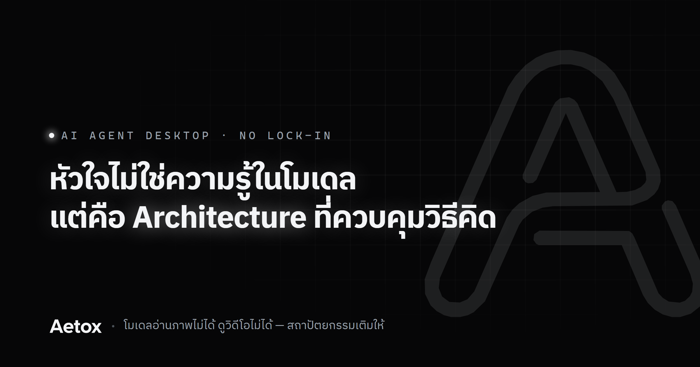

# Aetox — Architecture > Parameters

<p align="center">
  
</p>

<p align="center">
  <a href="https://mike0165115321.github.io/Aetox/"><strong>🌐 ดูหน้าเว็บแนะนำ Aetox</strong></a> — เห็นภาพว่ามันทำอะไรได้บ้างใน 1 นาที
  ·
  <a href="https://github.com/Mike0165115321/Aetox/releases/latest/download/aetox-amd64-installer.exe"><strong>⬇️ ดาวน์โหลด</strong></a>
</p>

> **AI Agent + ผู้ช่วยส่วนตัว** — ไม่ผูกมัดกับระบบใด เป็นอิสระจากทุกข้อจำกัด
> ไม่ได้เกิดมาเพื่อเป็น framework อีกตัว  
> แต่เป็นรากฐานของ AGI ที่สถาปัตยกรรมคือหัวใจ ไม่ใช่โมเดล

No lock-in. No subscription pressure. No boundaries.  
Your rules, your data, your AGI.

---

## Aetox คืออะไร

Aetox คือ **AI Agent + ผู้ช่วยส่วนตัว (Personal AI Assistant)**  
ที่ไม่ได้เกิดมาเพื่อแข่งกับใคร — แต่เกิดมาเพื่อ **อยู่เหนือข้อจำกัดของระบบเดิม**

- **เป็น AI Agent** — วางแผน ใช้ tools แก้ปัญหา real-world tasks ได้  
- **เป็น Personal Assistant** — ไม่ได้จำกัดแค่ agent workflow แต่พร้อมช่วยทุกเรื่อง  
- **ไม่ใช่ IDE plugin** — ไม่ผูกติดกับ IDE ใด  
- **ไม่ใช่แค่ chatbot** — คือ architecture ที่วิธีคิดสำคัญกว่าพลังดิบ

Aetox คือ **ยุคใหม่ของ AGI** ที่:

- **ไม่มีทีมใหญ่** — แต่วิสัยทัศน์ไกล  
- **ไม่มีคนมากมาย** — แต่มีไฟจากใจผู้สร้าง  
- **ไม่มีข้อจำกัด** — ไม่มี lock-in, ไม่มี rate limit, ไม่มี vendor ตัดฟีเจอร์  
- **พร้อมเติบโต** — วันนี้คือผู้ช่วยส่วนตัว วันหน้า ecosystem ของตัวเอง

> "หัวใจไม่ใช่ความรู้ในโมเดล — แต่คือ Architecture ที่ควบคุมวิธีคิด"

---

## ขยายศักยภาพให้โมเดล — โมเดลตาบอดก็เห็นได้ หูหนวกก็ฟังได้ มือด้วนก็ทำงานได้

นี่คือหัวใจของ **Architecture > Parameters** แบบจับต้องได้:
โมเดล 9B ที่รันบนเครื่องคุณ อ่านภาพไม่ได้ ดูวิดีโอไม่ได้ ฟังเสียงไม่ได้ ลงมือทำในเว็บไม่ได้ —
แต่พอวิ่งผ่าน Aetox มันทำได้ทั้งหมด เพราะสถาปัตยกรรมเติมความสามารถให้ ไม่ใช่ตัวโมเดล

| โมเดลทำไม่ได้ | Aetox เติมให้ด้วย | ผลลัพธ์ |
|:--------------|:------------------|:--------|
| มองไม่เห็นรูปภาพ | `image_ocr` (Tesseract ไทย+อังกฤษ) | อ่านข้อความในรูปได้ทุกโมเดล |
| ดูวิดีโอไม่ได้ | `video_ocr` (ffmpeg มากับตัวติดตั้ง + OCR) | ได้ข้อความพร้อม timestamp `[m:ss]` จากวิดีโอ |
| ฟังเสียงไม่ได้ | `audio_transcribe` (whisper.cpp ในเครื่อง) | ถอดเสียงพูดเป็นข้อความพร้อม `[m:ss]` ทั้งไฟล์เสียงและวิดีโอ |
| เปิด PDF ไม่ได้ | `pdf_read` (poppler มากับตัวติดตั้ง) | แนบ PDF แล้วให้สรุปได้เลย ภาษาไทยไม่เพี้ยน |
| ลงมือทำในเว็บไม่ได้ | `browser_open`/`read`/`click`/`type` | อ่านหน้าเว็บจริง คลิก กรอกฟอร์ม เลือก dropdown แทนได้ |

ส่วนโมเดลที่มองเห็นภาพได้อยู่แล้ว Aetox ส่งภาพให้ตรงๆ — `read` ไฟล์รูปแล้วได้รูปจริงกลับไป ไม่ใช่ข้อความที่ OCR เดามา `image_ocr` จึงเป็นทางสำรองของโมเดลที่มองไม่เห็น ไม่ใช่ทางเดียวอีกต่อไป

ลูปเต็มของโมเดลที่ไม่มีตาไม่มีหู: รูปหรือคลิป → `image_ocr` / `video_ocr` / `audio_transcribe` แปลงเป็นข้อความ → ตัดสินใจ → `browser_click/type` ลงมือทำต่อในเว็บ
คลิปหนึ่งไฟล์ยิงทั้ง `video_ocr` และ `audio_transcribe` ได้ — ทั้งคู่คืน `[m:ss]` ฟอร์แมตเดียวกัน อ่านต่อกันเป็นสคริปต์เดียว

> โมเดลไหนก็ได้ ยิ่งถูกยิ่งดี — ความสามารถอยู่ที่สถาปัตยกรรม ไม่ใช่ราคาโมเดล

---

## ⚡ เบา เร็ว เสถียร — วัดเทียบของจริง ไม่ใช่คำโฆษณา

**Aetox ไม่ใช่แค่กล่องแชท** — ข้างในมี editor ตัวเดียวกับที่ VS Code ใช้ (Monaco), เทอร์มินัล, ทรีไฟล์, หน้าดู git diff, เบราว์เซอร์ที่ agent สั่งงานได้ และตัวตรวจ error ด้วย LSP นั่นคือของที่คนเปิด IDE ไปใช้จริงๆ เกือบทั้งหมด — เราเลยกล้าวางเทียบทั้งกับเครื่องมือ AI และกับแอปที่มีหน้าจอครบแบบเดียวกัน

**พื้นที่ที่กินในเครื่องหลังติดตั้ง** — น้อยกว่าดีกว่า วัดบนเครื่องเดียวกัน (Windows 11)

```
Aetox         █                                           33 MB
Copilot CLI   █████                                      137 MB
Claude Code   ████████                                   236 MB
Zed           ██████████████                             419 MB
Qwen          ████████████████                           457 MB
OpenCode      █████████████████                          498 MB
Comet         █████████████████                          501 MB
Codex         ████████████████████████                   698 MB
Cursor        ██████████████████████████████             874 MB
Windsurf      ████████████████████████████████           940 MB
Antigravity   ███████████████████████████████████      1,030 MB
VS Code       ████████████████████████████████████████ 1,171 MB
```

**เทียบกับเครื่องมือ AI ที่ทำงานเดียวกัน** — Claude Code, Codex CLI, OpenCode เป็น AI ช่วยเขียนโค้ดเหมือนกัน ต่างกันตรงที่มันเป็นแค่หน้าจอพิมพ์คำสั่ง ไม่มี UI ให้กดสักปุ่ม Aetox มีหน้าจอครบแล้วยัง **เล็กกว่า Claude Code 7 เท่า**

**เทียบกับแอปที่มีหน้าจอครบเหมือนกัน** — Aetox เล็กกว่า Cursor **26 เท่า** Windsurf **28 เท่า** Antigravity **31 เท่า** เล็กกว่า VS Code **35 เท่า** ทั้งที่ฝัง editor ตัวเดียวกัน มีเทอร์มินัล มีเบราว์เซอร์ในตัวเหมือนกัน

> **ขอบเขตที่เราไม่เคลม:** Aetox ไม่ได้มาแทน IDE ของคุณ — ไม่มี debugger, ไม่มีร้านส่วนขยายเป็นหมื่นตัว,
> LSP รองรับ Go / TypeScript / Svelte / Python / Rust เท่านั้น สิ่งที่ตัวเลขนี้บอกคือ **เฉพาะของที่ทับกัน เราทำได้ในขนาดเท่านี้**
> ไม่ใช่ว่าเราทำได้ทุกอย่างที่ IDE ทำ

**เวลาเปิดและ RAM** — เครื่องมือแบบพิมพ์คำสั่งไม่มีหน้าจอให้จับเวลาเปิด เทียบส่วนนี้ได้เฉพาะกับแอปที่มี UI ด้วยกัน (Zed เขียนด้วย Rust เป็นแอปเนทีฟที่ขึ้นชื่อเรื่องเบา เป็นไม้บรรทัดที่โหดกว่าการไปเทียบกับแอปที่อืดอยู่แล้ว)

| วัดอะไร | Aetox | Zed | Cursor |
|:---|:---|:---|:---|
| **เปิดครั้งแรก** (เครื่องยังไม่แคช) | **1.77 วิ** | 2.12 วิ | — |
| **เปิดครั้งถัดๆ ไป** | **0.53 วิ** | 0.53 วิ | — |
| **RAM ที่จองไว้จริง** (private) | **252 MB** | 471 MB | 1,750 MB |
| **จำนวน process ที่เปิดค้างไว้** | **7** | 4 | 10 |
| **พื้นที่ในเครื่อง** | **33 MB** | 419 MB | 874 MB |

เปิดเร็วเสมอ Zed ที่ราวครึ่งวินาที ใช้ RAM ราวครึ่งเดียวของ Zed และราว 1 ใน 7 ของ Cursor

**ความเสถียร** — `go test ./...` ผ่าน **854/854** ครอบคลุม 26 package, 0 fail · ฝั่งหน้าจออีก **92/92**

> **เงื่อนไขของตัวเลข Cursor:** วัดตอนที่มันเปิดค้างใช้งานอยู่จริงราว 6 นาที พร้อมส่วนเสริมที่ผู้ใช้เครื่องนี้ติดตั้งไว้
> — เป็นสภาพใช้งานจริง แต่ไม่ใช่สภาพเปล่าเท่ากับที่วัด Aetox กับ Zed จึงไม่ได้จับเวลาเปิดให้ เพราะต้องปิดโปรแกรมที่เจ้าของเครื่องกำลังใช้อยู่
>
> **VS Code:** กำลังรันงานอยู่บนเครื่องที่วัด ปิดเพื่อวัดไม่ได้ จึงมีแค่ตัวเลขขนาด

### ⚡ เร็วตรงที่คนอื่นมองข้าม — ต้นทุนต่อการคุย 1 ครั้ง

เบาตอนติดตั้งเป็นเรื่องหนึ่ง เบาตอน**ใช้งานจริง**เป็นอีกเรื่อง ทุกครั้งที่คุณกดส่ง แอปต้องประกอบคำขอก่อนถึงจะยิงไปหาโมเดล ตรงนั้นแหละที่แอบกินเวลาและเงินโดยไม่มีใครเห็น

**เวลาที่ตัวแอปกินเอง** — งานหนักสุดที่ทำก่อนยิงคำขอ คือประกอบรายการเครื่องมือทั้งชุดแล้วแปลงเป็น JSON

```
Aetox  0.12 มิลลิวินาที  ต่อการคุย 1 ครั้ง (tools แกนกลาง 27 ตัว 18.1 KB)
```

เท่ากับ **1 ใน 8,000 ของวินาที** — เวลาที่คุณรอคือเวลาที่โมเดลคิด ไม่ใช่เวลาที่แอปเตรียมของ

> วัดเฉพาะขั้นตอนนี้ ไม่ได้รวมทั้งเส้นทาง — 300 รอบ ทำซ้ำ 3 ครั้ง ได้ค่ากลาง 119 ไมโครวินาที

**ค่า API ที่ประหยัดได้จริง** — โมเดลฝั่ง cloud คิดเงินโทเคนที่ "จำได้แล้ว" ถูกกว่าโทเคนใหม่หลายเท่า แต่มันจะจำได้ก็ต่อเมื่อคำขอที่ส่งไปเหมือนเดิมเป๊ะทุก byte จากต้น Aetox ออกแบบให้ส่วนหัวของคำขอนิ่งสนิททุกครั้ง

วัดจากบทสนทนาจริง 6 คำถามต่อเนื่อง ยื่น tools แกนกลางครบทุกครั้ง (DeepSeek):

```
คำถามที่ 1   input 2,963 โทเคน   จำได้ 2,944   99%
คำถามที่ 2   input 2,983 โทเคน   จำได้ 2,944   98%
คำถามที่ 3   input 3,001 โทเคน   จำได้ 2,944   98%
คำถามที่ 4   input 3,019 โทเคน   จำได้ 2,944   97%
คำถามที่ 5   input 3,038 โทเคน   จำได้ 2,944   96%
คำถามที่ 6   input 3,062 โทเคน   จำได้ 2,944   96%
─────────────────────────────────────────────────
รวม 17,664 จาก 18,066 โทเคน มาจากแคช = 97%
```

**97% ของ input ที่คุณจ่าย เป็นราคาถูก** — ยิ่งคุยยาว ยิ่งได้เปรียบ เพราะส่วนที่ซ้ำมีแต่จะโตขึ้น

> จุดนี้พลาดง่ายกว่าที่คิด: ถ้าลำดับ tools ที่ส่งไปสลับไปมาแม้แต่นิดเดียว แคชจะพังทั้งก้อนทุกครั้ง โดยไม่มี error ไม่มี log ให้เห็น — เห็นแค่บิลที่แพงขึ้นเงียบๆ
>
> **ตัวเลขนี้ใช้ได้กับเจ้าที่แคชให้อัตโนมัติ** (DeepSeek ที่วัด, OpenAI) ส่วน Anthropic ต้องประกาศจุดแคชในคำขอเอง ซึ่ง Aetox ยังไม่ได้ส่ง — ใช้ Claude ตอนนี้จึงยังไม่ได้ส่วนลดนี้ 🔜 กำลังทำ

**รันโมเดลในเครื่องตัวเองก็ยังไหว** — โมเดล 9B บนการ์ดจอบ้านๆ ยื่น tools แกนกลางครบชุด (~3,000 โทเคนต่อคำขอ) วัดแบบสลับกันคนละรอบ เอาค่ากลาง

| | เริ่มพ่นคำตอบ | จบทั้งคำตอบ |
|:---|:---|:---|
| **Ollama** (ornith:9b) | 1.75 วิ | 7.14 วิ |
| **LM Studio** (ornith-1.0-9b) | 1.42 วิ | 2.72 วิ |

ทั้งคู่ได้ครบ — สตรีมคำตอบสด, เห็นความคิดของโมเดลสดๆ, เรียก tools เขียนไฟล์จริง, นับโทเคนถูกต้อง

> ไม่ได้เอามาชี้ว่าเจ้าไหนดีกว่า — คนละไฟล์โมเดล คนละการตั้งค่า วัดคนละครั้ง ที่บอกได้คือ **ยัด tools ครบชุดเข้าไปแล้วโมเดลในเครื่องยังเริ่มตอบใน 1.5 วินาที** ไม่ได้อืดจนใช้ไม่ได้
>
> รอบแรกสุดของ Ollama จับได้ 41 วินาที เพราะมันต้องยกโมเดลขึ้น GPU ก่อน ตัวเลขข้างบนเป็นค่าตอนโมเดลอยู่ในเครื่องแล้ว ซึ่งคือสภาพที่คุณเจอตลอดการใช้งานจริง

**ทำไมถึงเบาและเสถียรได้:**

| เรื่อง | Aetox | แอป desktop สาย Electron ทั่วไป |
|:---|:---|:---|
| **Stack** | Go + Wails + Svelte 5 (TypeScript) | Electron + Node.js |
| **หน้าจอแอป** | ใช้ WebView2 ที่ Windows มีอยู่แล้ว ใช้ร่วมกับแอปอื่นได้ | แบก Chromium มาเป็นสำเนาของตัวเอง |
| **Runtime ที่ต้องลงเพิ่ม** | ไม่มี — ไฟล์เดียวรันได้ทันที | ต้องฝัง Node.js runtime มาในแอป |
| **การตรวจชนิดข้อมูล** | Go + TypeScript ตรวจตั้งแต่ตอนคอมไพล์ (`svelte-check` คุมฝั่ง UI) | ขึ้นกับโปรเจกต์ |
| **Dependency ตอนรัน** | ไม่มี `node_modules` ให้เวอร์ชันตีกันตอนอัปเดต | ยิ่ง dependency เยอะ ยิ่งเสี่ยง break ตอนอัปเดต |

> ตรงไปตรงมาเรื่อง RAM: WebView2 ก็คือ Chromium เหมือนกัน ตัวเลข 252 MB จึงไม่ใช่การเอาชนะ Electron ที่หน่วยความจำ —
> ที่ต่างจริงคือมันเป็นของที่ Windows มีอยู่แล้วและใช้ร่วมกับแอปอื่นได้ เราจึงไม่ต้องแถมสำเนาของตัวเองมาให้คุณเก็บไว้อีกชุด

> เบาไม่ได้แปลว่าตัดฟีเจอร์ทิ้ง — 27 tools ในตัว, 13 providers, sub-agent delegation ครบ ในตัวติดตั้ง 13 MB

---

## 🔒 ความปลอดภัยของข้อมูลคุณ

Aetox ไม่ส่งข้อมูลอะไรออกจากเครื่องคุณนอกจากที่คุณสั่งให้ทำ

| เรื่อง | สถานะตอนนี้ |
|:---|:---|
| **ประวัติแชท / ไฟล์โปรเจกต์** | อยู่ในเครื่องคุณล้วนๆ (SQLite ท้องถิ่น) ไม่มี server ของเราคั่นกลาง |
| **อยากตัดขาดจาก cloud ทั้งหมด** | รันโมเดลผ่าน **LM Studio / Ollama** บนเครื่องคุณเองได้ — prompt ไม่ออกจากเครื่องแม้แต่ byte เดียว |
| **คำสั่งที่ agent รัน** | รันเฉพาะในโฟลเดอร์โปรเจกต์ที่คุณเปิด ออกนอกโฟลเดอร์ไม่ได้ และมีบันทึกไว้ทุกคำสั่ง |
| **API key** | ตอนนี้เก็บเป็นไฟล์ plaintext ในเครื่อง ยังไม่เข้ารหัส — 🔜 กำลังย้ายเข้า Windows DPAPI ก่อน แล้วขยายไป macOS Keychain / Linux secret service ตามแพลตฟอร์มที่รองรับเพิ่ม |

ถ้าใช้ cloud provider (OpenAI, Anthropic ฯลฯ) ข้อมูลที่ส่งออกคือสิ่งที่ provider นั้นเห็นตามปกติของ API เขา — Aetox เองไม่มี server หรือ analytics คั่นกลางเพื่อเก็บข้อมูลคุณต่อ

---

## ปรัชญา

| หลักการ | ความหมาย |
|:--------|:---------|
| **Architecture > Parameters** | สถาปัตยกรรมที่ดีเอาชนะ parameter ล้านล้านได้ |
| **Freedom > Convenience** | ไม่มี lock-in คุ้มค่ากว่าความสะดวกที่ผูกมัด |
| **You Own It** | คุณเป็นเจ้าของระบบ — ข้อมูล, โมเดล, การตั้งค่า ทั้งหมดเป็นของคุณ |
| **Direction > Execution** | ทิศทางสำคัญกว่าพลังดิบ — รู้ว่าต้องไปไหนก่อนลงมือ |
| **Pattern > Ad-hoc** | สร้าง pattern ไม่ใช่สร้างเฉพาะกิจ — ทำครั้งเดียว, automate ถาวร |
| **Simplicity > Complexity** | แก้ปัญหาด้วยวิธีที่ง่ายที่สุด ไม่ใช่เพิ่ม layer โดยไม่จำเป็น |

---

## สถานะปัจจุบัน — v0.7.0

Aetox ยังอยู่ในช่วงหล่อหลอม — แกนกลางพร้อมแล้ว ชั้นถัดไปกำลังถูกสร้าง

### ✅ พร้อมใช้ตอนนี้

| ความสามารถ | รายละเอียด |
|:-----------|:-----------|
| **13 Providers** | OpenAI, Anthropic, DeepSeek, Google Gemini, Groq, Mistral, Together, Perplexity, Cohere, OpenRouter, Z.ai, LM Studio, Ollama |
| **Tool Calling** | model-driven tool loop — agent เลือกใช้ tools เอง |
| **36 Tools ที่โมเดลเรียกได้** | 27 ตัวในเครื่องยนต์ (read, write, edit, shell, git, grep, glob, symbol, notebook_edit, image_ocr, video_ocr, pdf_read, audio_transcribe …) + browser_* + sub-agent + ที่ต่อจาก MCP |
| **รันโค้ดที่เพิ่งเขียนเองได้** | agent เรียก `shell` และ `git` เองได้ — แก้โค้ดเสร็จ รันเทสต์ อ่านผล แล้วแก้ต่อในเทิร์นเดียว · คำสั่งที่ไม่จบเอง (dev server, watch build) สั่งให้รันเบื้องหลังแล้วตามอ่าน log ทีหลังได้ |
| **Safety 3 ระดับ** | ถามก่อน → คำสั่งเสี่ยง → รันเต็มที่ |
| **Multi-provider** | ใช้ providers ต่างกันใน session เดียวกัน |
| **Model Switching** | เปลี่ยน provider/model ได้ทันที โดยไม่เสีย context |
| **Streaming** | แสดงผลแบบ real-time สำหรับ conversation |
| **Auto-save Preference** | ค่า provider, model, API key, approval mode จำอัตโนมัติ |
| **Desktop App** | Wails + Svelte 5 — Sidebar (file tree + chat history), Chat, Workbench (tabs: Review, Terminal, Files, Browser, File Editor), TopBar |
| **Persistent Sessions** | ประวัติแชททุกโปรเจกต์เก็บใน SQLite ท้องถิ่น (ไม่มีข้อมูลออกจากเครื่อง) — ค้นหาแบบ full-text ได้ทั้งไทย/อังกฤษ |
| **Agent-controlled Browser** | Agent เปิด/อ่าน/คลิก/พิมพ์ในเว็บจริงบนแท็บ Workbench ได้เอง (`browser_open`/`browser_read`/`browser_click`/`browser_type`) — ไม่ติด X-Frame-Options เหมือน iframe, คลิกด้วย ref ที่ `browser_read` แปะให้ (แบบเดียวกับ Playwright MCP/browser-use) |
| **Interactive Agent** | เมื่อ agent ติดสินใจไม่ได้ มันหยุดถามคุณเป็นตัวเลือก A/B/C/D ให้กดเลือก · งานใหญ่ agent ทำ checklist ให้เห็นความคืบหน้าสดๆ · ความคิดของโมเดลถูกเก็บไว้ทุกคำตอบ กดย้อนดูได้ว่า "คิดเป็นเวลากี่วินาที คิดอะไร" · ปุ่ม Stop หยุดงานกลางคันได้ตลอด |
| **Sub-agent Delegation** | agent หลักมอบงานย่อยให้ agent ลูกไปทำในพื้นที่ความจำแยก โดยไม่บล็อกเทิร์นหลัก — ทำขนานได้พร้อมกันสูงสุด 4 ตัว ถ้าลูกติดตัดสินใจไม่ได้ก็หยุดถามกลับมาที่ agent หลักเอง |
| **ลองก่อนมีคีย์** | provider `aetox` ในตัวมีโมเดลจำลองให้ลองทุกฟีเจอร์โดยไม่ต้องสมัครอะไรเลย — โมเดลที่เรียก tools จริง, โมเดลคิดยาว, แกลเลอรีรูป, markdown ครบชุด |

### 🚧 เส้นทางถัดไป — จาก Agent เดี่ยว สู่ทีม Agent

Aetox วันนี้มอบงานให้ sub-agent ลูกได้แล้ว เป้าหมายถัดไปคือให้ทีม agent ทำงานพร้อมกันหลายตัว:

| ขั้น | คืออะไร | สถานะ |
|:---|:---|:---|
| **1. ทีม Agent ขนาน** | agent ลูกหลายตัวทำงานพร้อมกัน เช่น ค้นข้อมูล 5 มุมพร้อมกัน หรือ review โค้ดหลายแง่มุมในคราวเดียว — แต่ละตัวใช้โมเดลคนละค่ายได้ | ถัดจาก sub-agent (พร้อมใช้แล้ว) |
| **2. Multi-Agent Orchestration** | ทีมที่มีบทบาทชัดเจน (วางแผน / เขียนโค้ด / ตรวจ) ส่งงานต่อกันเอง รวมถึงให้หลายโมเดลถกเถียงกันเพื่อหาคำตอบที่ดีที่สุด | วิสัยทัศน์ระยะยาว |
| **3. Automation Engine** | บอกเป็นภาษาไทยว่าอยากให้ทำอะไรซ้ำๆ เมื่อไหร่ → Aetox สร้าง script และตั้งเวลารันให้เอง | หลัง core agent แข็งแรง |

รากฐานสำหรับเส้นทางนี้ถูกวางไว้แล้วตั้งแต่ต้น: agent แต่ละตัวเป็นหน่วยจบในตัวที่มีโมเดลและความจำของตัวเอง เครื่องมือทั้งหมดแชร์ผ่าน interface กลาง และคำขออนุญาตทุกอย่างวิ่งผ่านด่านความปลอดภัยจุดเดียว — การเพิ่มทีม agent จึงเป็นการต่อยอด ไม่ใช่การรื้อสร้างใหม่

### 🔮 อนาคตไกลกว่านั้น

- Aetox Ecosystem — plugin, marketplace, community skills
- Knowledge Base — Obsidian + codebase + web
- AGI-level reasoning — ensemble, debate, cross-validation
- Personal AI that grows with you

---

## เริ่มต้นใช้

Aetox เป็นแอปเดสก์ท็อปบน Windows โหลดแล้วเปิดใช้ได้เลย ไม่ต้องมี API key ก่อน —
provider `aetox` ในตัวมีโมเดลจำลองให้ลองทุกฟีเจอร์ก่อนตัดสินใจ

**ตัวติดตั้ง** — [ดาวน์โหลดตัวล่าสุด](https://github.com/Mike0165115321/Aetox/releases/latest/download/aetox-amd64-installer.exe)
ติดตั้งแล้วมีใน Start Menu จัดการ Tesseract (OCR) ให้อัตโนมัติ

**Scoop** — ถ้าใช้ scoop อยู่แล้ว

```powershell
scoop install https://raw.githubusercontent.com/Mike0165115321/Aetox/main/scoop/aetox.json
```

**Portable** — [โหลด zip ไม่ต้องติดตั้ง](https://github.com/Mike0165115321/Aetox/releases/latest/download/aetox-windows-amd64-portable.zip) แตกแล้วรัน `aetox.exe` · [ดูไฟล์ทั้งหมดของรุ่นล่าสุด](https://github.com/Mike0165115321/Aetox/releases/latest)

> ตัวติดตั้งยังไม่ได้ code signing ครั้งแรก Windows SmartScreen จะขึ้นเตือน "unknown publisher" —
> กด More info → Run anyway

### build เอง

```powershell
cd desktop
wails build          # ได้ desktop/build/bin/aetox.exe
wails build -nsis    # พร้อมตัวติดตั้ง
```

---

## Architecture

```
┌──────────────────────────────────────────┐
│         Aetox Desktop (UI)               │ ← Wails + Svelte cockpit
│ Sidebar(tree+history) · Chat · Workbench │   Workbench = tabs: Review,
│ (tabs) · TopBar                          │   Terminal, Files, Browser, Editor
├──────────────────────────────────────────┤
│    Local Store (SQLite, FTS5)            │ ← ประวัติแชททุกโปรเจกต์ ค้นหาได้
│    เก็บในเครื่อง ไม่มีข้อมูลออกไปไหน        │   ทั้งไทย/อังกฤษ, ไม่มี cloud
├──────────────────────────────────────────┤
│                                          │
│    Directional Cognition Engine          │ ← วิธีคิด — ensemble, routing,
│    Parallel Ensemble | Specialist Route  │   cross-validation, synthesis
│    Cross-Validation | Synthesis          │   (ออกแบบ)
│                                          │
├──────────────────────────────────────────┤
│    Multi-Provider Orchestration          │ ← ใช้หลาย providers พร้อมกัน
│    Router | Comparator | Consensus       │   เปรียบเทียบ เลือกคำตอบที่ดีที่สุด
│                                          │
├──────────────────────────────────────────┤
│    Core Runtime                          │ ← แกนกลางที่ทำงานแล้ว
│    13 Providers | Tools | Turn Loop      │
│    Safety | Audit | Config               │
├──────────────────────────────────────────┤
│    Terminal + File System                │
│    shell | git | read | write | search   │
└──────────────────────────────────────────┘
```

---

## Providers ที่รองรับ

| Provider | API Key | Tool Calling | Reasoning |
|:---------|:--------|:------------|:----------|
| **OpenAI** | `OPENAI_API_KEY` | ✅ | ✅ |
| **Anthropic** | `ANTHROPIC_API_KEY` | ✅ | ✅ |
| **DeepSeek** | `DEEPSEEK_API_KEY` | ✅ | ✅ |
| **Google Gemini** | `GEMINI_API_KEY` | ✅ | ✅ |
| **Groq** | `GROQ_API_KEY` | ✅ | ✅ |
| **Mistral** | `MISTRAL_API_KEY` | ✅ | ❌ |
| **Together** | `TOGETHER_API_KEY` | ✅ | ❌ |
| **Perplexity** | `PERPLEXITY_API_KEY` | ✅ | ❌ |
| **Cohere** | `COHERE_API_KEY` | ✅ | ❌ |
| **OpenRouter** | `OPENROUTER_API_KEY` | ✅ | ✅ |
| **Z.ai** | `ZAI_API_KEY` | ✅ | ✅ |
| **LM Studio** | ท้องถิ่น (localhost) | ✅ | ✅ |
| **Ollama** | ท้องถิ่น (localhost) | ✅ | ✅ |

> **โมเดลในเครื่องได้ครบเท่า cloud** — สองเจ้านี้เลือกโมเดลที่คุณโหลดไว้ให้เอง ไม่ต้องพิมพ์ชื่อ,
> สตรีมทั้งคำตอบและความคิดของโมเดล, เรียก tools ได้จริง และนับโทเคนเข้าหน้าสถิติเหมือนกัน

---

## Tools ในตัว (27 ตัว)

| Tool | ใช้ทำอะไร |
|:-----|:----------|
| `read` | อ่านไฟล์ |
| `write` | เขียนไฟล์ทั้งไฟล์ |
| `edit` | แก้ไขไฟล์แบบ search & replace เป๊ะๆ |
| `delete` | ลบไฟล์ |
| `list` | ดูรายการไฟล์ใน directory |
| `shell` | รันคำสั่ง shell |
| `git` | คำสั่ง git |
| `grep` | ค้นหาข้อความในไฟล์ (regex) |
| `fs` | file system operations |
| `echo` | ทดสอบ output |
| `time` | แสดงเวลาปัจจุบัน |
| `help` | แสดง help |
| `github_repo_summary` | สรุป repo จาก GitHub |
| `plugin_install` | ติดตั้ง plugin จาก GitHub |
| `image_ocr` | อ่านข้อความจากรูป (Tesseract ไทย+อังกฤษ) |
| `pdf_read` | อ่านข้อความจากไฟล์ PDF (poppler ติดตั้งมาให้พร้อมแอป) |
| `video_ocr` | อ่านข้อความจากวิดีโอ (ffmpeg แตกเฟรม + OCR พร้อม timestamp) |
| `audio_transcribe` | ถอดเสียงพูดในไฟล์เสียง/วิดีโอเป็นข้อความ (whisper.cpp ออฟไลน์ ไทย+อังกฤษ) |
| `web_fetch` | อ่านเนื้อหาหน้าเว็บ |
| `web_search` | ค้นเว็บ (DuckDuckGo, ไม่ต้องมี API key) |
| `github_search` | ค้นโค้ด/repo บน GitHub |
| `github_read_file` | อ่านไฟล์จาก repo GitHub |
| `github_list_files` | ดูโครงสร้างไฟล์ของ repo GitHub |
| `browser_open` | เปิดหน้าเว็บในแท็บ Workbench |
| `browser_read` | อ่านหน้าเว็บ พร้อมแปะเลข ref ให้ทุก element |
| `browser_click` | คลิก element ด้วยเลข ref |
| `browser_type` | พิมพ์ลงช่อง หรือเลือก dropdown ด้วยเลข ref |

---

## จากผู้สร้าง

> Aetox เกิดมาไม่ใช่เพื่อแข่งกับใคร  
> แต่มาเพื่อยืนในจุดที่ตลาดขาด  
> ไม่ใช่เพื่อเป็นอีกหนึ่ง agent framework  
> ไม่ใช่เพื่อ lock-in ผู้ใช้เข้าสู่ระบบใด
>
> Aetox คือ **ผู้ช่วยส่วนตัว** ที่พร้อมจะเติบโต  
> ระบบปลอดภัยพร้อมในสภาพแวดล้อมปิดแบบเต็มรูปแบบ  
> คือรากฐานของสถาปัตยกรรมที่จะควบคุมวิธีคิดของโมเดล
>
> — Mike (ชยพล พรมสะวะนา)

---

## ติดต่อ

เปิดรับการติดต่อเรื่องธุรกิจ ความร่วมมือ และการลงทุน — เป้าหมายระยะยาวคือเทรนโมเดลของเราเอง ให้สถาปัตยกรรมกับโมเดลถูกออกแบบมาเพื่อกันและกันตั้งแต่ต้น

📧 [phrmsawanachyphl@gmail.com](mailto:phrmsawanachyphl@gmail.com) · 🐙 [เปิด Issue](https://github.com/Mike0165115321/Aetox/issues) · ❤️ [สนับสนุนโปรเจกต์](SPONSOR.md)

---

Project: [github.com/Mike0165115321/Aetox](https://github.com/Mike0165115321/Aetox)  
License: MIT
