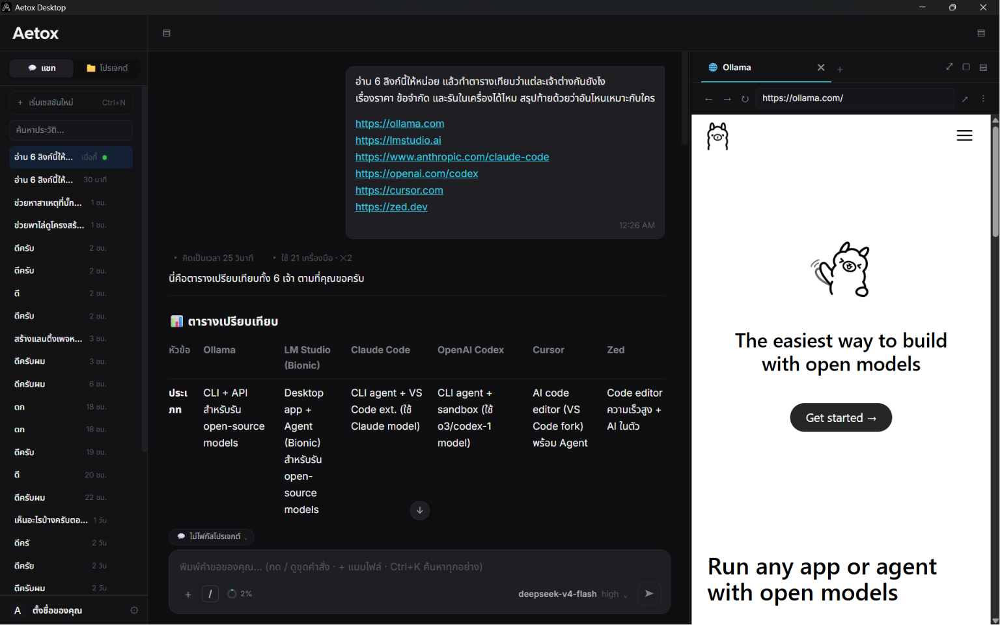
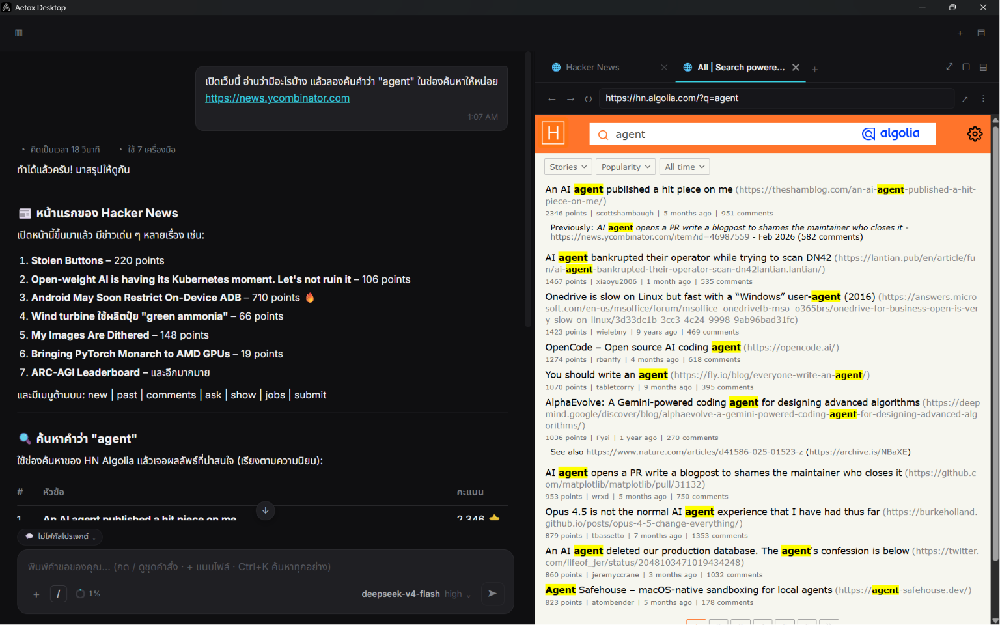
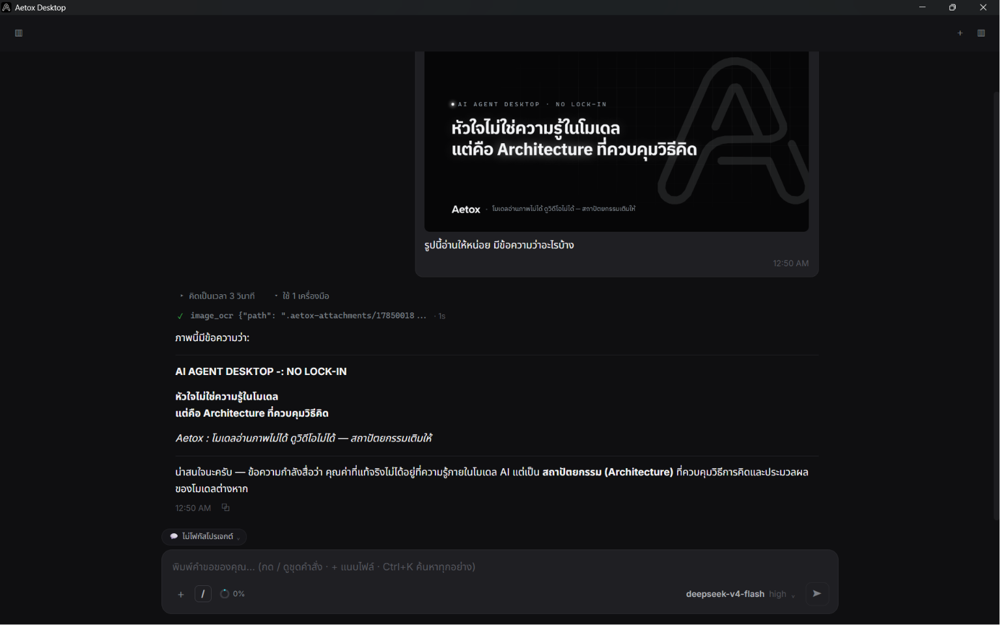

<p align="center">
  
</p>

<h1 align="center">Aetox</h1>

<p align="center">
  <strong>แอปเดสก์ท็อปบน Windows ที่ทำงานให้เสร็จบนเครื่องคุณ — ไฟล์ เบราว์เซอร์ เชลล์ เอกสาร</strong>
</p>

<p align="center">
  <a href="https://github.com/Mike0165115321/Aetox/releases/latest"></a>
  <a href="LICENSE"></a>
  
  
</p>

<p align="center">
  <a href="README.md">English</a> ·
  <a href="https://mike0165115321.github.io/Aetox/">เว็บไซต์</a> ·
  <a href="https://github.com/Mike0165115321/Aetox/releases/latest/download/aetox-amd64-installer.exe">ดาวน์โหลด</a> ·
  <a href="ARCHITECTURE.md">สถาปัตยกรรม</a> ·
  <a href="docs/DECISIONS.md">ทุกการตัดสินใจ และเหตุผล</a>
</p>

<p align="center">
  
</p>

---

## นี่คืออะไร

Aetox เป็นแอปเดสก์ท็อปบน Windows ที่รันเอเจน AI กับเครื่องของคุณเอง คุณบอกว่าต้องการอะไร
มันอ่านและเขียนไฟล์จริง รันคำสั่งจริงในเชลล์จริง และขับเบราว์เซอร์จริงที่คุณนั่งดูได้

มันคือไฟล์เดียว 41.5 MB ที่มีทุกอย่างอยู่ในตัว ไม่ต้องลง runtime อะไรเพิ่ม ไม่มี `node_modules`
ไม่มี Chromium ห่อมาด้วย มันคุยกับโมเดลอะไรก็ได้ที่คุณชี้ให้ — API บนคลาวด์
แพ็กเกจที่คุณจ่ายรายเดือนอยู่แล้ว หรือโมเดล 9B ที่รันใน LM Studio หรือ Ollama บนการ์ดจอตัวเอง —
เพราะความสามารถมาจากตัวแอป ไม่ได้มาจากจำนวนพารามิเตอร์ของโมเดล

นั่นคือเหตุผลที่โมเดลเล็ก ๆ ยังอ่านรูปได้ ถอดเสียงได้ และทำสเปรดชีตได้: `image_ocr`,
`audio_transcribe` และ `sheet_write` เป็นของแอป ไม่ใช่ของโมเดล

ยกตัวอย่างให้เห็นภาพสองงาน *"ไล่ดูใบเสร็จในโฟลเดอร์นี้แล้วทำเป็นสเปรดชีตให้หน่อย"* —
มัน OCR ทีละใบ คิดยอดรวมในตัวแปลภาษา JavaScript ที่คอมไพล์ฝังอยู่ในตัวแอป
โดยเอาสคริปต์มาวางข้างคำตอบให้คุณดูด้วย แล้วเขียน `.xlsx` จริงที่มีสูตรทำงานได้
หรือ *"หาสาเหตุว่าทำไมเทสต์ล็อกอินมันไม่นิ่ง"* — มัน grep ทั้งรีโป
รันชุดเทสต์ในแท็บเทอร์มินัลที่คุณดูอยู่ อ่านจุดที่พัง แล้วแก้ไฟล์

**หน้าจอมีทั้งภาษาไทยและอังกฤษ และไทยคือค่าเริ่มต้น** ทุกข้อความมีครบทั้งสองภาษา
สลับได้ในหน้าตั้งค่าและในขั้นตอนตั้งค่าครั้งแรก

## ติดตั้ง

Windows 10 ขึ้นไป x64 **ไม่ต้องมี API key ก็เริ่มได้เลย** — มีผู้ให้บริการในตัวชื่อ `aetox`
พร้อมโมเดลทดสอบห้าตัวที่เดินเครื่องจริงทุกส่วน (เรียกเครื่องมือจริง ส่งงานให้เอเจนจริง
สตรีมความคิดยาว ๆ จริง) คุณจึงเห็นว่าแอปทำอะไรได้ก่อนจะไปสมัครอะไรกับใคร

**ตัวติดตั้ง** — [aetox-amd64-installer.exe](https://github.com/Mike0165115321/Aetox/releases/latest/download/aetox-amd64-installer.exe) (15.8 MB)

มันจะดาวน์โหลดและตรวจ SHA256 ของโปรแกรมภายนอกที่ Aetox ใช้ให้ด้วย: WebView2, Tesseract
(พร้อมภาษาไทย), poppler, ffmpeg และโมเดลถอดเสียงตัวเริ่มต้นสำหรับใช้แบบออฟไลน์
ตัวไหนโหลดไม่สำเร็จจะข้ามพร้อมบอกเหตุผล ไม่ล้มทั้งการติดตั้ง

**Scoop**

```powershell
scoop install https://raw.githubusercontent.com/Mike0165115321/Aetox/main/scoop/aetox.json
```

**แบบพกพา** — [ไฟล์ zip](https://github.com/Mike0165115321/Aetox/releases/latest/download/aetox-windows-amd64-portable.zip)
แตกออกมาแล้วรัน `aetox.exe` ช่องทางนี้เป็นช่องทางเดียวที่อัปเดตตัวเองในที่เดิมได้

### ถ้า SmartScreen หรือแอนตี้ไวรัสขึ้นเตือน

ตัวติดตั้งยังไม่ได้เซ็นโค้ด รอบแรกจะขึ้น "Windows protected your PC" บอกว่าไม่รู้จักผู้เผยแพร่ —
กด **More info → Run anyway**

แต่ตัวรุ่นที่ปล่อย**เซ็นแล้ว**: กุญแจสาธารณะ ed25519 ถูกคอมไพล์ฝังอยู่ในตัวแอป
และตัวอัปเดตจะตรวจลายเซ็นบน `checksums.txt` ก่อนจะเชื่อค่าแฮชสักตัว
กุญแจว่างหรือผิดจะปฏิเสธการอัปเดต ไม่ใช่ยอมผ่านไป

### Linux กับ macOS

ยังไม่ปล่อย ทั้งเครื่องยนต์และตัวเดสก์ท็อปคอมไพล์ผ่านและรันชุดเทสต์แบบ `-race` บน Linux
และ macOS ใน CI แล้ว แต่ช่องเบราว์เซอร์ยังเป็นตัวหลอกและยังแพ็กไม่เสร็จ

**1.0.0 คือรุ่นของ Windows** ก่อนหน้า 15 ส.ค. 2026 บรรทัดนี้เขียนว่า *"1.0.0 ต้องออกครบทั้งสาม
แพลตฟอร์ม ไม่งั้นไม่ใช่ 1.0.0"* — เกณฑ์นั้น**ถูกเจ้าของแก้ ไม่ใช่ถูกทำให้ผ่าน** การกลั้นบิลด์
Windows ที่นิ่งแล้วไว้หลังช่องเบราว์เซอร์กับที่เก็บความลับซึ่งยังไม่มีบนอีกสองแพลตฟอร์ม
ไม่ได้ช่วยใครที่ใช้มันอยู่ตอนนี้เลย Linux กับ macOS จะออกด้วยเกณฑ์เดียวกันในรุ่นถัดไป
ดูสถานะพอร์ตจริงที่ [PLATFORM-SUPPORT.md](PLATFORM-SUPPORT.md) และเหตุผลที่เกณฑ์ขยับ
ที่ [DECISIONS §109](docs/DECISIONS.md)

<details>
<summary>บิลด์เอง</summary>

```powershell
cd desktop
wails build          # → desktop/build/bin/aetox.exe
wails build -nsis    # พร้อมตัวติดตั้ง
```

</details>

## เอาไปทำอะไรได้บ้าง

**ยื่นโฟลเดอร์ให้ แล้วรับไฟล์กลับมา** ชี้ไปที่โฟลเดอร์รูป PDF หรือไฟล์เสียง
แล้วบอกไปตรง ๆ ว่าอยากได้อะไร OCR (ไทยและอังกฤษ) ข้อความจาก PDF ที่เลย์เอาต์ไม่แตก
และการถอดเสียงแบบออฟไลน์ ป้อนเข้าบทสนทนาเดียวกันหมด แล้ว `sheet_write`, `doc_write`
ส่งไฟล์ Office จริงกลับมา — สร้างจาก zip และ xml ในไลบรารีมาตรฐานของ Go
โดยไม่พึ่งไลบรารีนอกเลยสักตัว สูตรคำนวณทำงานได้ วันที่เรียงได้ สระไทยอยู่ตำแหน่งที่ควรอยู่

**นั่งดูมันทำงานในเบราว์เซอร์จริง** ไม่ใช่การขูดข้อมูลแบบไม่มีหน้าจอ แต่เป็นหน้าต่าง WebView2
ที่ประกอบเข้ามาในแอป มีช่องที่อยู่ ปุ่มย้อนกลับ/ไปหน้า DevTools
และชุดขนาดอุปกรณ์แปดแบบที่ปรับขนาดหน้าต่างจริงและซูมหน้าเว็บ
เพื่อให้ CSS media query ทำงานจริง เอเจนเปิด อ่าน คลิกตามหมายเลขอ้างอิง
และพิมพ์ลงไปในแท็บเดียวกับที่คุณกำลังดูอยู่



**อ่านสิ่งที่โมเดลมองไม่เห็น** `image_ocr` รัน Tesseract ทั้งไทยและอังกฤษ
ภาพหน้าจอ ไฟล์สแกน หรือแบบฟอร์มที่ถ่ายรูปมา จึงกลายเป็นข้อความที่โมเดล 9B คิดต่อได้ —
ไม่ต้องใช้โมเดลที่มองเห็น และโมเดลที่*มองเห็นได้*จะได้รูปไปตรง ๆ แทน



**ชี้ไปที่รีโปหนึ่ง** มีแผงไฟล์ เอดิเตอร์ Monaco แท็บเทอร์มินัล PTY จริงไม่จำกัดจำนวน `git`
`grep` และ `glob` ทั้งต้นไม้ พร้อม `diagnostics` กับ `symbol` ที่หนุนด้วย language server
ที่แอปติดตั้งให้เองตอนใช้ครั้งแรก (gopls, typescript-language-server, svelteserver)

**ส่งงานให้ช่างเฉพาะทาง** พิมพ์ `@doc` `@sheet` `@github` `@automation` หรือ `@research`
แล้วประโยคของคุณถึงมือเขาทั้งคำ ไม่ผ่านการเรียบเรียง แต่ละคนคือโฟลเดอร์บนดิสก์
ที่มีคำสั่งของตัวเอง ความจำของตัวเอง เลือกโมเดลของตัวเองได้ และมีสกิลส่วนตัวที่คนอื่นไม่เห็น

**สั่งเป็นงาน ไม่ใช่สั่งเป็นขั้น** งานที่ต้องเดินยี่สิบก้าวถูกวางแผนก่อนลงมือ และ `todo_write`
เอาแผนขึ้นจอระหว่างทำ สิ่งที่คุณเฝ้าดูจึงเป็นลำดับที่มันเลือกเอง ไม่ใช่วงกลมหมุน ๆ
ช่างเฉพาะทางทำงานพร้อมกันได้สูงสุดสี่คน — `task` ยื่นงานแล้วกลับมาทันที `task_result` ไปเก็บทีหลัง
สามงานจึงใช้เวลาเท่างานที่ช้าที่สุด ไม่ใช่เวลารวม คนที่เจอทางแยกที่ไม่ควรตัดสินใจเองกลับมาเป็น
*คำถาม* ไม่ใช่การเดา และคนที่ยังทำไม่เสร็จตอนคำตอบถึงมือคุณก็ทำต่อ เก็บด้วย id เดิมในเทิร์นถัดไป
จบเทิร์นจึงไม่ใช่เส้นตาย ส่วนก่อนจะลงมือทั้งหมดนั้น มีโหมดวางแผนที่อ่านได้ทุกอย่างแต่เปลี่ยนอะไร
ไม่ได้เลย ใช้บัญชีอนุญาต เครื่องมือที่เพิ่มเข้ามาเดือนหน้าจึงถูกกันไว้ก่อนโดยปริยาย

รันจริงเมื่อ 15 ส.ค. 2026 จากประโยคเดียว — *"ช่วยหา CRM มา 20 เจ้าที่ SME ไทยเลือกใช้ได้จริง
แล้วทำเป็นสเปรดชีตเทียบให้หน่อย"*: **6 นาที 51 วินาที เอเจนสองตัว เรียกเครื่องมือรวม 42 ครั้ง** —
ผู้ช่วย 8 ครั้ง `research` 27 ครั้งไล่อ่านหน้าราคา `sheet` อีก 7 ครั้ง — และมีเครื่องมือพังไปหนึ่งตัว
แล้วเดินอ้อมไปต่อได้ การส่งไม้ผลัดระหว่างสองคนเป็นแบบที่ README หน้านี้เขียนไว้พอดี:
`research` วางรายงาน markdown ไว้ในโฟลเดอร์ผลลัพธ์ของเซสชัน แล้ว `sheet` ได้รับ *path*
ไม่ใช่เนื้อหา · ได้กลับมายี่สิบแถว สิบสี่แถวมีราคาเป็นตัวเลขจริงเรียงจากถูกไปแพง
และ**หกแถวเว้นว่างไว้โดยตั้งใจ** พร้อมเหตุผลกำกับข้าง ๆ ว่าเป็นราคาแบบต้องติดต่อขอ
หรือหน้าเว็บไม่ยอมบอกตัวเลข ทุกแถวมีวันที่ที่เข้าไปอ่านและลิงก์ที่เอาตัวเลขมา
พร้อมบอกว่าเปิดเบราว์เซอร์เข้าไปดูจริงหรือได้จากการค้นอย่างเดียว ช่องที่เว้นไว้คือส่วนที่น่าเชื่อที่สุด
เพราะตารางที่ไม่มีช่องว่างเลยคือตารางที่เดา

**ถามถึงงานเก่าของตัวเอง** ทุกบทสนทนาและทุกครั้งที่เครื่องมือทำงานถูกเก็บใน SQLite
บนเครื่องพร้อม FTS5 การค้น `session_search` ย้อนหลังเป็นเดือนจึงเป็นการ query ไม่ใช่การถามโมเดล —
ไม่เสียโทเคนเลย ทั้งไทยและอังกฤษ

**ให้มันสร้างออโตเมชั่นใน n8n หรือ Windmill** เชื่อมเซิร์ฟเวอร์ที่คุณโฮสต์เอง
แล้วเอเจนออโตเมชั่นจะไล่ดู อ่าน สร้าง และแก้เวิร์กโฟลว์ในนั้นให้
และสั่งเปิดเซิร์ฟเวอร์ให้ได้จากคำสั่งที่คุณบันทึกไว้ อ่าน[ข้อจำกัดตามจริง](#ออโตเมชั่น-ทำอะไรได้-และทำอะไรไม่ได้)
ก่อนจะฝากงานสำคัญไว้กับมัน

## สองประตู แอปเดียว

สวิตช์บนโลโก้สลับระหว่าง **ผู้ช่วย** ("ใช้ จำ และสร้าง") กับ **โค้ด** ("สร้าง แก้ และส่ง")
มันคือไบนารีตัวเดียวกัน ที่เก็บข้อมูลเดียวกัน การตั้งค่า ความจำ และสิทธิ์ชุดเดียวกัน —
สลับประตูไม่ใช่การสลับแอป และแอปจำได้ว่าคุณอยู่ประตูไหน
ประตูยังตัดรายการแชตตั้งแต่ใน SQL ด้วย งานเขียนโค้ดรัว ๆ จึงไม่กลืนรายการอีกฝั่งจนหาย

|  | ผู้ช่วย | โค้ด |
|:---|:---|:---|
| **ทำงานตรงไหน** | ทั้งเครื่องเมื่อไม่ได้เปิดโปรเจกต์ หรือโฟลเดอร์โปรเจกต์บวกโฟลเดอร์ที่คุณเพิ่ม | โฟลเดอร์โปรเจกต์ที่เปิด บวกโฟลเดอร์ที่คุณเพิ่ม |
| **มีห้องอะไร** | ผู้ช่วย · โปรเจกต์ · ทีมงาน · ออโตเมชั่น · ผลงาน | โค้ด |
| **แผงขวามือ** | มี | มี |

ประตูแยกกันที่ว่า*ระบบ*หยิบอะไรมาให้ ไม่ใช่แยกที่ว่า AI ยอมทำอะไร
ฝั่งผู้ช่วยมีไฟล์และเชลล์และทำงานซอฟต์แวร์ด้วยของสองอย่างนั้น
มันจะไม่โยนงานคืนเพราะงานนั้นเกี่ยวกับโค้ด

## ทีมงาน

มีเอเจนมาให้ห้าคน — `doc` `sheet` `github` `automation` `research` —
และการจ้างคนที่หกคือการวางโฟลเดอร์ลงใน `<DataRoot>/agents/` ไม่ต้องออกรุ่นใหม่
ไม่ต้องมี plugin API ไม่ต้องรีสตาร์ต

โฟลเดอร์ของเอเจนคือตัวตนทั้งหมดของเขา: `AGENT.md` (เขาเป็นใคร นั่งโต๊ะไหน
จะหยิบเครื่องมือแคบลงแค่ไหน ปักโมเดลตัวไหน), `MEMORY.md` (สิ่งที่เขาเรียนรู้มา),
`STARTERS.md` (แชตเปล่ากับเขาเปิดยังไง แยกตามภาษา) และโฟลเดอร์ `skills/`
ส่วนตัวที่เอเจนคนอื่นมองไม่เห็น

และโฟลเดอร์นั้นคือจุดที่ผู้ช่วยฉลาด ๆ กับบริษัทหนึ่งบริษัทแยกทางกัน เอเจนแต่ละคน**ปักโมเดลของตัวเอง**
คนที่ต้องเปิดหน้าราคายี่สิบหน้าจึงใช้โมเดลถูก ๆ ได้ ส่วนคนที่ต้องชั่งน้ำหนักสิ่งที่หามาได้ใช้ตัวที่แข็งกว่า
ค่าใช้จ่ายจึงวิ่งตามงาน ไม่ได้วิ่งตามงานที่ยากที่สุดในนั้น และแต่ละคนมี**ความจำของตัวเอง**
สิ่งที่เอเจนหาข้อมูลเรียนรู้เกี่ยวกับแหล่งหนึ่งจึงไม่ไหลไปปนกับวิจารณญาณเรื่องสไลด์ของเอเจนทำเด็ค
เอเจนตัวเดียวที่เก่งรอบด้านมีโมเดลเดียว ความจำเดียว เครื่องมือชุดเดียว กับทุกงานที่มันจะได้รับไปตลอด
และคุณเพิ่มเพื่อนร่วมงานคนที่เจ็ดให้มันไม่ได้

คุณ**ส่งงานให้**เขาได้ — ผู้ช่วยเรียก `task` และทำงานพร้อมกันได้สูงสุดสี่คน — หรือจะ
**คุยกับเขาตรง ๆ** ก็ได้ ในเซสชันที่ผูกกับเครื่องมือ ความจำ และคำสั่งของเขาเอง
ส่วน `@ชื่อ` จากช่องพิมพ์คือประตูที่สาม: ประโยคของคุณถึงมือเขาทั้งคำ รวมเครื่องหมาย @ ด้วย
เพราะการเรียบเรียงใหม่คือจุดที่คำขอเพี้ยน

เอเจนไม่เรียกหากันเอง ดาวดวงนี้มีศูนย์กลางเดียว งานหลายขั้นคือสายพานที่วิ่งผ่านผู้ช่วย
และไม้ผลัดคือ path ของไฟล์ ไม่ใช่เนื้อหา แยกกันอีกเรื่องคือ **ซับเอเจน** สามตัว
(`explore` `plan` `general`) ซึ่งเป็นผู้ช่วยภายใน — เป็นชุดตายตัว เพิ่มไม่ได้ โดยตั้งใจ

## มันเรียนรู้อะไร และคุณอนุมัติอะไร

Aetox จำข้ามเซสชันได้ และ**ไม่มีอะไรถูกเขียนลงไปโดยที่คุณไม่ได้อนุมัติ**

เครื่องมือ `memory` เขียนเองไม่ได้ มันได้แค่เข้าคิวเสนอ ส่วนอีกทางหนึ่ง
ตัวสรุปจะอ่านบันทึกการทำงานของเครื่องมือโดยไม่เรียกโมเดลเลยสักครั้ง
จับกลุ่มความล้มเหลวที่ซ้ำกันตามเอเจน + เครื่องมือ + ข้อความผิดพลาดที่ถูกทำให้เป็นรูปมาตรฐาน
แล้วเสนอบทเรียนเมื่อความผิดพลาดเดิมเกิดครบสามครั้ง

ทุกอย่างไปรวมกันในคิวตรวจทานเดียวในหน้าตั้งค่า แต่ละใบบอกเนื้อหา เหตุผลที่เอเจนให้ไว้
ว่ามันจะเข้าไปอยู่ในความจำของใคร และถ้าเป็นการเขียนทับ ก็บอกว่าจะทับบรรทัดไหน
กดรับหรือกดทิ้ง สิ่งที่เก็บไว้เป็นมาร์กดาวน์ธรรมดาที่คุณเปิดอ่าน แก้ทีละบรรทัด
หรือสั่งลืมตรงนั้นได้ และทุกการตัดสินใจถูกบันทึกถาวร คำถามว่า *"ทำไมมันถึงคิดแบบนั้น"*
จึงมีคำตอบเสมอ สวิตช์เดียวปิดทั้งระบบได้

มันมีผลตั้งแต่เซสชันหน้า ไม่ใช่เซสชันนี้ — การเปลี่ยนคำสั่งกลางบทสนทนาจะทำให้แคช prefix
ของผู้ให้บริการพัง ซึ่งเป็นเหตุผลเดียวกับที่บล็อกเครื่องมือไม่เคยขยับ

อีกครึ่งหนึ่งคือ **คำสั่งประจำ**: ไฟล์มาร์กดาวน์ของคุณเองที่เปิดอยู่ตลอด
และติดไปทุกโต๊ะ ทุกโปรเจกต์ ทุกเอเจน สิ่งที่คุณเขียนเอง กับสิ่งที่มันคิดได้เอง
ถูกแยกกันไว้โดยตั้งใจ

## มันทำงานยังไง และไปถึงไหนได้บ้าง

**โต๊ะ (desk)** คือเพดานเครื่องมือของเซสชัน มีสามโต๊ะ — `assistant` `coding` `specialized` —
และโต๊ะของเซสชันถูกกำหนดตายตัวตั้งแต่เปิด โต๊ะยังเป็นที่ที่เซิร์ฟเวอร์ MCP
และการเชื่อมต่อภายนอกถูกวางไว้ด้วย เครื่องมือที่ติดตั้งมาเพื่องานแบบหนึ่ง
จึงไม่ไปโผล่ในงานอีกแบบ

**มันไปไหนได้บ้าง** เมื่อเปิดโปรเจกต์ พื้นที่ทำงานคือโฟลเดอร์นั้นบวกโฟลเดอร์ที่คุณเพิ่ม —
โฟลเดอร์ที่เพิ่มได้สิทธิ์อ่านและเขียนโดยไม่ต้องถาม เท่ากับรากโปรเจกต์
เพราะสิทธิ์ชั้นที่สองที่เงียบกว่าคือกฎที่คุณไม่เคยตกลงด้วย เมื่อไม่ได้เปิดโปรเจกต์
พื้นที่ทำงานคือทั้งเครื่อง และไฟล์ที่เขียนจะลงใน `output/<session>`
ฟังก์ชันเดียวเป็นคนตัดสิน path ทุกเส้น รวมถึง symlink และตั้งใจไม่ให้มีด่านที่สองที่ไหนอีก

**การขออนุญาต** สามระดับ และมีประตูเดียวที่ทุกการเรียกเครื่องมือเดินผ่าน —
เครื่องมือในตัว เชลล์ และ MCP เหมือนกันหมด

| ระดับ | ถามอะไรบ้าง |
|:---|:---|
| **ถามก่อน** | ทุกอย่างที่ไม่ใช่การอ่านเฉย ๆ ในพื้นที่ทำงาน |
| **เฉพาะที่เสี่ยง** | การลบ `git` เชลล์ และอะไรก็ตามที่แตะ path นอกพื้นที่ทำงาน |
| **เข้าถึงเต็มที่** | ไม่ถามอะไรเลย ไม่มีข้อยกเว้น |

เครื่องมือจาก MCP ยืนยันทุกระดับไม่ว่าตั้งไว้ยังไง เพราะพฤติกรรมของมันถูกกำหนดโดยเซิร์ฟเวอร์ของคนอื่น

**คำสั่งเชลล์ถูกตรวจ path จริง** ไม่ใช่จับรูปแบบตัวอักษร: path ที่ซ่อนอยู่ในเครื่องหมายคำพูด
หลังแฟล็ก หลังการเปลี่ยนทางออก หรือหลัง `%VAR%` / `$VAR` / `~` ก็ยังถูกคลี่ออกมาตรวจ
ส่วนคำสั่งที่ตัวสแกนอ่านไม่ออก — `$(...)` เครื่องหมาย backtick `-EncodedCommand`
`FromBase64String` — ถูกปฏิเสธ ไม่ใช่เดา ทุกคำสั่งที่รันถูกต่อท้ายลงบันทึกตรวจสอบสิทธิ์ 0600

**ปฏิเสธกับทุกเครื่องมือไฟล์ ในทุกโต๊ะ:** `.ssh` `.aws` `.gnupg` `.azure` `.kube` `.netrc`
`.git-credentials` `.config/gh` `.aetox`, ที่เก็บ Credentials และ Protect ของ Windows,
โปรไฟล์ Chrome / Edge / Firefox / Brave และ `credentials.json`, `oauth.json`,
`mcp-servers.json` กับโปรไฟล์เบราว์เซอร์ของ Aetox เอง
ตอนเลือกโฟลเดอร์ก็ปฏิเสธเหมือนกัน มันจึงพังตั้งแต่หน้าประตู
ไม่ใช่ไปโผล่เป็นข้อความผิดพลาดงง ๆ ทีหลัง

**ข้อมูลของคุณ**

|  | อยู่ตรงไหน |
|:---|:---|
| ประวัติแชต การทำงานของเครื่องมือ ไฟล์ที่ผลิตออกมา | บนดิสก์ของคุณ ใน SQLite และโฟลเดอร์ธรรมดา |
| ตัดคลาวด์ทิ้งทั้งหมด | รันโมเดลผ่าน LM Studio หรือ Ollama — ไม่มีสักไบต์ของ prompt ที่ออกไป |
| API key | ไฟล์ของตัวเอง สิทธิ์ 0600 ห่อด้วย DPAPI ผูกกับบัญชี Windows ของคุณ นอก Windows ยังไม่มีการเข้ารหัสตอนพัก — บอกไว้ตรง ๆ ไม่ปล่อยให้เข้าใจเอง |
| ความลับในบันทึก | ถูกกรองผ่านทะเบียนเดียว ลงครบทั้งสามที่: บันทึกดีบัก บันทึกตรวจสอบเชลล์ และบัฟเฟอร์ที่ฟอร์มรายงานบั๊กอ่าน |
| ความลับของ MCP | อ้างอิงผ่าน `${env:VAR}` กุญแจจึงไม่ตกลงไปอยู่ในไฟล์ตั้งค่า |
| เอาไปด้วยได้ | ส่งออกแชตเป็น `.md` หรือ `.json` และนำ `.json` กลับเข้า Aetox ตัวไหนก็ได้ |
| รายงานบั๊ก | แอปไม่ส่งอะไรออกไปเลย มันเติมฟอร์ม issue บน GitHub ให้ ล้างความลับออกแล้ว และคุณอ่านทุกบรรทัดก่อนส่งจากบัญชีตัวเอง |

ไม่มีเซิร์ฟเวอร์ของเราคั่นกลาง และไม่มี analytics การใช้ผู้ให้บริการบนคลาวด์แปลว่า
ผู้ให้บริการนั้นเห็นเท่าที่ API ของเขาเห็นตามปกติ และไม่มีอะไรวิ่งผ่านเรา

## มันทำอะไรได้บ้างทั้งหมด

จำนวนเครื่องมือไม่ใช่เหตุผลที่จะใช้อะไรสักอย่าง หัวข้อนี้ถึงอยู่ล่างสุด

**40 เครื่องมือถึงมือโมเดลบนเครื่องที่เพิ่งติดตั้ง** เซสชันผู้ช่วยปกติหยิบน้อยกว่านั้น
เพราะโต๊ะเป็นตัวตัดชุดให้แคบลง ทั้งหมดกินราว 9,844 โทเคนในทุกคำขอ ก่อนคุณจะพิมพ์อะไรด้วยซ้ำ
เทียบกับเพดาน 10,100 ที่มีเทสต์บังคับไว้ — เหลือที่ว่างแปดช่อง ที่ต้องเถียงกันก่อนจะได้ใช้

| กลุ่ม | เครื่องมือ |
|:---|:---|
| **ไฟล์** | `read` `write` `edit` `apply_patch` `delete` `list` `glob` `grep` |
| **รันคำสั่ง** | `shell` *(run · output · kill · list)* `git` `desk_terminal` |
| **ส่งไฟล์กลับ** | `doc_write` `sheet_write` |
| **อ่านสื่อ** | `image_ocr` `video_ocr` `pdf_read` `audio_transcribe` |
| **เว็บและออโตเมชั่น** | `browser` *(open · read · click · type)* `web_fetch` `web_search` |
| **งานโค้ด** | `diagnostics` `symbol` `github` *(repo_summary · search · read_file · list_files)* |
| **วิธีที่ผู้ช่วยทำงาน** | `task` `task_result` `task_answer` `ask_user` `todo_write` `suggest_task` `memory` `session_search` `calc` `time` `desk_list` `desk_open` `skills_list` `skill_view` `plugin_install` |

ตารางนั้น generate จากทะเบียนที่โมเดลได้รับจริง
(`go test ./desktop -run TestPrintReadmeToolTable -v`) เพราะรายการที่เขียนด้วยมือว่าโปรแกรมมีอะไร
คือแหล่งความจริงที่สองของคำถามที่โปรแกรมตอบเองได้ — และรายการนี้เคยเพี้ยนอยู่หลายเดือน
โดยยังเรียกชื่อเครื่องมือที่ถูกยุบเข้าไปใน `shell` และ `github` ไปแล้ว

การเชื่อมเครื่องยนต์ออโตเมชั่นจะเพิ่มเครื่องมือแพ็กมาอีกหนึ่งตัว — `n8n` *(list · read · create ·
update · activate)* หรือ `windmill` *(workspaces · list · read · create · update)* —
และก่อนหน้านั้นไม่เพิ่มอะไรเลย เครื่องมือที่ไม่มีบัญชีอยู่ข้างหลังจะถูกกันไว้ ไม่ใช่โชว์แล้วปฏิเสธ

**การเติบโตไปลงที่ที่มันไม่มีต้นทุน** สกิลคือเอกสารมาร์กดาวน์ ไม่ใช่เครื่องมือ: `skills_list`
คืนมาบรรทัดเดียวต่อหนึ่งสกิล และ `skill_view` คืนเนื้อหาหนึ่งชุด
ติดตั้งสามร้อยสกิลบล็อกเครื่องมือก็ขนาดเท่าเดิมเป๊ะ ส่วนเซิร์ฟเวอร์ MCP
ถูกวางเป็นรายโต๊ะและรายเอเจน เซิร์ฟเวอร์ที่เพิ่มมาเพื่องานวิดีโอจึงไม่มีอยู่ในบทสนทนาธรรมดา —
ไม่ใช่ซ่อนจากโมเดล แต่ไม่มีอยู่จริง ส่วนเครื่องมือเขียนเอกสารไปถึงแค่โต๊ะเฉพาะทาง
ผู้ช่วยจึงส่งงานต่อเพื่อขอ `.pptx` แทนที่จะแบกเครื่องมือสามตัวที่ไม่ค่อยได้ใช้

**17 ผู้ให้บริการ และหน้าต่างแสดงครบทุกราย** — OpenAI · Anthropic · Gemini · DeepSeek ·
Qwen · Z.ai · OpenRouter · Codex · Groq · Mistral · Kimi · MiniMax · xAI · ThaiLLM ·
LM Studio · Ollama · และ `aetox` ที่มีในตัว OpenRouter กับ Codex ใช้การลงชื่อเข้าใช้
ที่เหลือใช้ API key หรือที่อยู่เซิร์ฟเวอร์ในเครื่อง เดิมทะเบียนกับหน้าเลือกไม่ตรงกัน ตอนนี้ตรงแล้ว
เพราะรายที่เครื่องยนต์รู้จักแต่หน้าต่างไม่แสดง คือรายที่ไม่มีใครไปถึงได้

โมเดลในเครื่องถูกปฏิบัติเท่าเทียม: Aetox ถาม LM Studio และ Ollama ว่าโมเดลไหน*โหลดอยู่*
ไม่ใช่ถามว่ามีโมเดลอะไรบ้าง สตรีมทั้งคำตอบและความคิด เรียกเครื่องมือได้จริง
และนับโทเคนเข้าสถิติชุดเดียวกัน คุณสลับผู้ให้บริการหรือโมเดลกลางบทสนทนาได้
และบริบททั้งหมดตามไปด้วย — ทั้งการเรียกเครื่องมือ ผลลัพธ์ และบทสรุปที่ถูกบีบอัด
ไม่ใช่แค่ข้อความที่มองเห็น มีผู้ให้บริการทำงานทีละหนึ่งราย
และ Aetox จะไม่แอบเปลี่ยนเส้นทางเทิร์นของคุณไปหารายที่คุณจ่ายเงินอีกเจ้า

### ออโตเมชั่น ทำอะไรได้ และทำอะไรไม่ได้

เชื่อมเซิร์ฟเวอร์ n8n หรือ Windmill ที่คุณโฮสต์เอง แล้วเอเจนออโตเมชั่นจะไล่ดู อ่าน สร้าง แก้
และ — เฉพาะ n8n — เปิดใช้งานเวิร์กโฟลว์ได้ และสั่งเปิดเซิร์ฟเวอร์ให้จากคำสั่งที่คุณบันทึกไว้

**มันสั่งรันเวิร์กโฟลว์แล้วดูผลไม่ได้** ไม่มีการเรียก API สำหรับรันอยู่ในโค้ดนี้เลย
สิ่งที่ใกล้ที่สุดคือเอเจนไปกดปุ่ม Execute ในหน้าจอของ n8n เองผ่านเครื่องมือเบราว์เซอร์
ซึ่งไม่ใช่การรันที่ยืนยันผลได้ ส่วน Windmill ไม่มีคำสั่งเปิดใช้งานด้วยซ้ำ
flow ที่มันสร้างจึงถูกบันทึกไว้เฉย ๆ จนกว่าคุณจะไปสั่งเอง
เอเจนพูดเรื่องนี้ออกมาตรง ๆ แทนที่จะทำเป็นไม่รู้ และมีเทสต์ที่มีหน้าที่เดียวคือบังคับให้มันพูดต่อไป

**ไม่มีตัวตั้งเวลา และจะไม่มี** Aetox ไม่มีคลาวด์ ตารางเวลาจึงจะแอบไปขึ้นกับการที่โน้ตบุ๊กคุณ
ไม่เคยถูกปิด n8n และ Windmill คือนาฬิกา Aetox คือมือ

## วัดมา ไม่ใช่อ้าง

กติกาอยู่ใน [BENCHMARK.md](BENCHMARK.md) และกฎข้อเดียวที่มันยืนยันคือ
ตัวเลขที่ยังไม่ผ่านกติกา ห้ามขึ้นที่นี่หรือบนเว็บไซต์

> ตัวเลขที่อันตรายคือตัวเลขที่ทำให้เราดูดี เพราะไม่มีใครไปตรวจตัวเลขที่ทำให้ตัวเองดูดี

**Aetox วัดวันที่ 2026-08-13 บนบิลด์นี้**

| | |
|:---|---:|
| สิ่งที่คุณดาวน์โหลด | ตัวติดตั้ง 15.8 MB |
| สิ่งที่ลงไปอยู่ในเครื่อง | **41.5 MB** ไฟล์เดียว |
| ประกอบหนึ่งเทิร์น | 0.32 ms · จอง 174.9 KB |
| เทสต์ฝั่ง Go | 1,797 ตัว ใน 38 แพ็กเกจ ไม่มีตัวไหนล้ม |
| เทสต์ฝั่งหน้าจอ | 755 ตัว ใน 69 ไฟล์ ไม่มีตัวไหนล้ม |
| เปิดครั้งแรก (cold) | 1.77 วิ ⁽ᵈ⁾ |
| เปิดครั้งต่อ ๆ ไป | 0.53 วิ ⁽ᵈ⁾ |
| RAM ที่จอง | 252 MB ⁽ᵈ⁾ |
| จำนวน process | 7 ⁽ᵈ⁾ |

⁽ᵈ⁾ วัดเมื่อ 2026-07-27 บน v0.9.2 ตามกติกา และ**ยังไม่ได้วัดใหม่** มันคือตัวเลขที่ลงวันที่ไว้
ไม่ใช่ตัวเลขปัจจุบัน และมันอยู่ตรงนี้แทนที่จะถูกลบทิ้ง เพราะวันนั้นมันผ่านกติกาจริง —
ซึ่งคือความต่างทั้งหมดระหว่างตัวเลขเก่ากับตัวเลขที่ใช้ไม่ได้

สองเรื่องที่ต้องพูดตามตรง การประกอบหนึ่งเทิร์นเคยใช้ 0.12 ms และ 96.2 KB
ตอนที่บล็อกมีเครื่องมือ 27 ตัว ตอนนี้มันคือ 0.32 ms และ 174.9 KB เพราะเครื่องมือเยอะขึ้น
นั่นคือการถอยหลังจริง ๆ และมันก็ยังเป็นสามในหมื่นวินาที — เวลาที่คุณรอคือเวลาที่โมเดลกำลังคิด
อีกเรื่องคือชุดเทสต์ฝั่ง Go เขียวบน Windows แต่ **CI บน Linux และ macOS แดงอยู่** หกตัว
และหนึ่งในนั้นเป็นรูของแซนด์บ็อกซ์จริง ไม่ใช่เทสต์เสีย เรื่องนี้กำลังแก้ ไม่ใช่กำลังบริหาร

**เทียบกับ Zed** ซึ่งเป็นไม้บรรทัดที่โหดกว่า — เขียนด้วย Rust แบบเนทีฟ และขึ้นชื่อเรื่องความเบา

| | Aetox | Zed |
|:---|:---|:---|
| เปิดครั้งแรก (cold) | 1.77 วิ | 2.12 วิ |
| เปิดครั้งต่อ ๆ ไป | 0.53 วิ | 0.53 วิ |
| RAM ที่จอง | 252 MB | 471 MB |
| ขนาดในเครื่อง | **41.5 MB** | 419 MB |

ทุกช่องยกเว้นขนาดในเครื่องของ Aetox วัดเมื่อ 2026-07-27 บนเครื่องเดียวกันด้วยกติกาเดียวกัน
และ**ยังไม่ได้วัดใหม่ทั้งคู่** — Zed ไม่ได้ติดตั้งอยู่บนเครื่องนี้แล้ว
การเสมอกันเรื่องเวลาเปิดครั้งต่อ ๆ ไปกับเอดิเตอร์ที่เขียนด้วย Rust แบบเนทีฟคือผลที่ควรค่าแก่การมี
แต่ให้ถือแถวนี้เป็นตัวเลขที่ลงวันที่ไว้ ไม่ใช่ตัวเลขปัจจุบัน

ตัวอื่นในหมวดเดียวกันส่งของ 240 MB ถึง 1 GB เพราะแอป Electron แบกสำเนา Chromium มาเอง
Aetox ใช้ WebView2 ที่ Windows มีอยู่แล้ว — และพูดกันตรง ๆ WebView2 *ก็คือ* Chromium
หน่วยความจำที่มันกินจึงไม่ใช่ชัยชนะเหนือ Electron ชัยชนะคือคุณไม่ต้องเก็บเบราว์เซอร์ตัวที่สอง

<details>
<summary>วัดยังไง และอะไรที่ไม่ผ่านเกณฑ์</summary>

**ขนาดในเครื่อง** — ดาวน์โหลด [ไฟล์ zip แบบพกพา](https://github.com/Mike0165115321/Aetox/releases/latest/download/aetox-windows-amd64-portable.zip)
แตกออกมา แล้วอ่านขนาดของ `aetox.exe` ตัวเดียวข้างใน: 43,514,880 ไบต์ ใครก็ทำซ้ำได้ในหนึ่งนาที
มันมาแทนตัวเลข 40.8 MB ที่วัดจาก v0.9.2 เมื่อ 2026-08-07 ซึ่งถูกต้องในตอนนั้นและไม่ถูกแล้วตอนนี้
ขนาดของตัวอื่นวัดหลังติดตั้งจากโฟลเดอร์ติดตั้ง ไม่เคยเอามาจากหน้าดาวน์โหลด
และไม่เคยวัดจากโฟลเดอร์ที่มีโปรไฟล์หรือแคชของผู้ใช้ปนอยู่

**เวลาเปิด RAM และจำนวน process** — `bench.ps1 -Start` โปรเจกต์เปล่า เอาค่ากลางของ 5 รอบ
หลังทิ้งรอบแรก อ่านหลังนิ่งแล้ว 60 วินาที ส่วนค่า cold ที่แท้จริงต้องรีบูตก่อน
เพราะหลังจากนั้น Windows ยังอมไฟล์ของแอปไว้ใน file cache

**ประกอบหนึ่งเทิร์น** — `bench.ps1 -Engine` ค่ากลางของ 3 รอบ

**อะไรที่ถูกถอดออกจากหัวข้อนี้** เรดมีรุ่นก่อนเคยตีพิมพ์ว่า "97% ของโทเคนขาเข้ามาจากแคช
ตลอดหกข้อความติดกัน" และเวลาตอบตัวแรกของโมเดลในเครื่องที่ 1.42 วิ กับ 1.75 วิ
ทั้งสองอย่างไม่มีที่มาในรีโปนี้ — ไม่มีเทสต์ ไม่มี log ไม่มีบันทึกใน BENCHMARK —
และเครื่องที่ตัวเลขในเครื่องนั้นอ้างถึงก็ไม่ได้ติดตั้ง LM Studio ไว้ด้วยซ้ำ
มันถูกถอดออก ไม่ใช่ประทับวันที่ไว้ เพราะกฎข้างบนไม่มีข้อยกเว้นให้ตัวเลขที่เราอยากเก็บไว้

</details>

## สถานะ — v1.1.0

แกนหลักเข้าที่แล้ว [บันทึกการปล่อยรุ่น](docs/release-notes/v1.1.0.md) ·
[แผนงาน](ROADMAP.md) · [สถาปัตยกรรม](ARCHITECTURE.md)

สามอย่างที่มันทำได้วันนี้และน่ารู้ไว้:

- **ย้อนกลับ และคำตอบหลายเวอร์ชัน** ทุกเทิร์นจดไฟล์ที่มันแก้ไว้ ปุ่ม "ย้อนกลับ (3)"
  จึงเอาคืนได้ และการสั่งตอบใหม่จะบอกก่อนว่าจะกู้ไฟล์ไหนคืนบ้าง คำตอบเก่าไม่หาย —
  มีลูกศรกับ "2 / 3" — และการสลับไปมาเปลี่ยนจุดที่บทสนทนาเดินต่อจากไปด้วย
- **โมเดลวาดรูปได้** SVG ในคำตอบถูกเรนเดอร์เป็นภาพในบับเบิลเลย ค่อย ๆ ก่อตัวทีละรูปทรงระหว่างสตรีม
  พร้อมปุ่มคัดลอกและบันทึกที่อบสีของธีมปัจจุบันลงบนสำเนาแล้วแปลงเป็นภาพที่ความละเอียด 2 เท่า
- **พูดแทรกเข้าไปในเทิร์นที่กำลังทำงานได้** พอพิมพ์ ปุ่มหยุดจะกลับเป็นปุ่มส่ง
  แล้วยื่นประโยคของคุณให้เทิร์นที่วิ่งอยู่ ส่วนที่มันรับเข้าไปไม่ทันจะเด้งกลับมาเป็นบับเบิลรอคิว
  ที่คุณทิ้งได้

**ต่อไป** — เอเจนที่ทำงานข้ามเทิร์นได้ ไม่ใช่แค่ภายในเทิร์นเดียว · แผนงานที่ส่งจากประตูผู้ช่วย
ไปประตูโค้ด · ทีมงานฝั่งประตูโค้ดที่มีบทบาทชัดเจน

## เอกสาร

[สถาปัตยกรรม](ARCHITECTURE.md) · [ทุกการตัดสินใจ และเหตุผล](docs/DECISIONS.md) ·
[บริษัทนี้คืออะไร](COMPANY.md) · [กติกาการวัด](BENCHMARK.md) ·
[แพลตฟอร์มที่รองรับ](PLATFORM-SUPPORT.md) · [แผนงาน](ROADMAP.md) ·
[เครื่องยนต์ออโตเมชั่น](docs/AUTOMATION-ENGINES.md)

## แจ้งบั๊ก

[เปิด issue](https://github.com/Mike0165115321/Aetox/issues) แอปมีประตูสำหรับเรื่องนี้อยู่แล้ว:
หน้าตั้งค่าจะเติมฟอร์ม issue ให้พร้อมเวอร์ชัน ช่องทางที่ติดตั้ง และระบบปฏิบัติการ
พับบันทึกภายในล่าสุดลงในบล็อก `<details>` โดยล้างความลับออกแล้ว
แล้วยื่นให้คุณอ่านก่อนจะส่งจากบัญชีตัวเอง แอปไม่ส่งอะไรออกไปเอง

## คนที่ทำสิ่งนี้ และสัญญาอนุญาต

Aetox เขียนโดยคนคนเดียว มันเกิดขึ้นเพราะโมเดลที่ผลิตได้แค่ข้อความคือเครื่องมือครึ่งเดียว
และครึ่งที่ขาดไป — มือ สิทธิ์ และที่วางผลงาน — เป็นปัญหาของแอปพลิเคชัน ไม่ใช่ปัญหาของโมเดล

**Aetox ใช้ฟรี และไม่ใช่โอเพนซอร์ส** ตั้งแต่ v1.3.0 มันอยู่ภายใต้
[สัญญาอนุญาตแบบสงวนสิทธิ์](LICENSE): ติดตั้งกี่เครื่องก็ได้ ใช้ทำงานหาเงินได้
อ่านซอร์สทั้งหมดและตรวจสอบได้ — แต่ห้ามแก้ ห้ามแจกจ่ายต่อ ห้ามรีแบรนด์ และห้ามขายต่อ
ซอร์สถูกเผยแพร่ไว้ให้ *อ่าน* ไม่ใช่ให้เอาไปต่อยอด

**ส่วนขยายที่คุณเขียนเองเป็นของคุณ** สกิล เอเจนต์ พร้อมต์ ไฟล์ตั้งค่า และเซิร์ฟเวอร์ MCP
ที่คุณเขียนเป็นทรัพย์สินของคุณ และขายได้เต็มที่ ([LICENSE](LICENSE) ข้อ 4)
จุดต่อขยายมีไว้เพื่อสิ่งนี้

ชื่อ **"Aetox"** และโลโก้เป็นเครื่องหมายการค้า และไม่ได้อนุญาตให้ใครใช้
ส่วนคอมโพเนนต์ของบุคคลที่สามยังอยู่ภายใต้สัญญาของตัวเอง รายชื่ออยู่ที่
[THIRD-PARTY-NOTICES.md](THIRD-PARTY-NOTICES.md) — ไม่มีตัวไหนเป็น GPL หรือ AGPL

รุ่นก่อนหน้าเก็บสัญญาอนุญาตที่มันออกมาไว้ถาวร: v0.7.1 และก่อนหน้าเป็น MIT
ส่วน v0.8.0 ถึง v1.2.4 เป็น Apache-2.0

> Aetox ไม่ได้เกิดมาเพื่อแข่งกับใคร มันเกิดมาเพื่อยืนในที่ที่ตลาดยังว่างอยู่ —
> ไม่ได้จะเป็นเฟรมเวิร์กเอเจนอีกตัว และไม่ได้จะล็อกใครไว้กับอะไร

📧 [phrmsawanachyphl@gmail.com](mailto:phrmsawanachyphl@gmail.com) ·
❤️ [สนับสนุนโปรเจกต์](SPONSOR.md)

---

<p align="center">
  © 2026 ชยพล พรมสะวะนา · สงวนลิขสิทธิ์ · <a href="LICENSE">สัญญาอนุญาต</a> · <a href="THIRD-PARTY-NOTICES.md">ประกาศบุคคลที่สาม</a>
</p>
