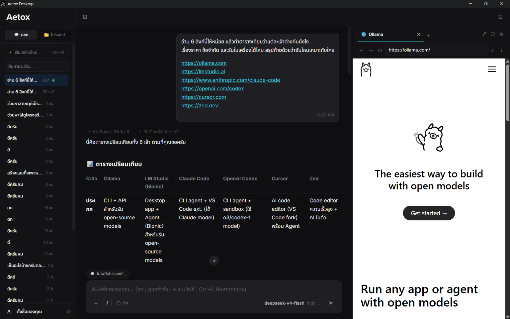
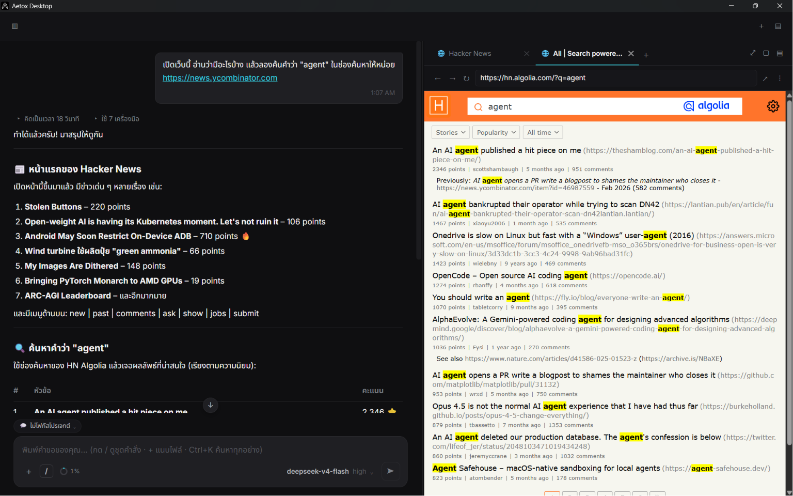
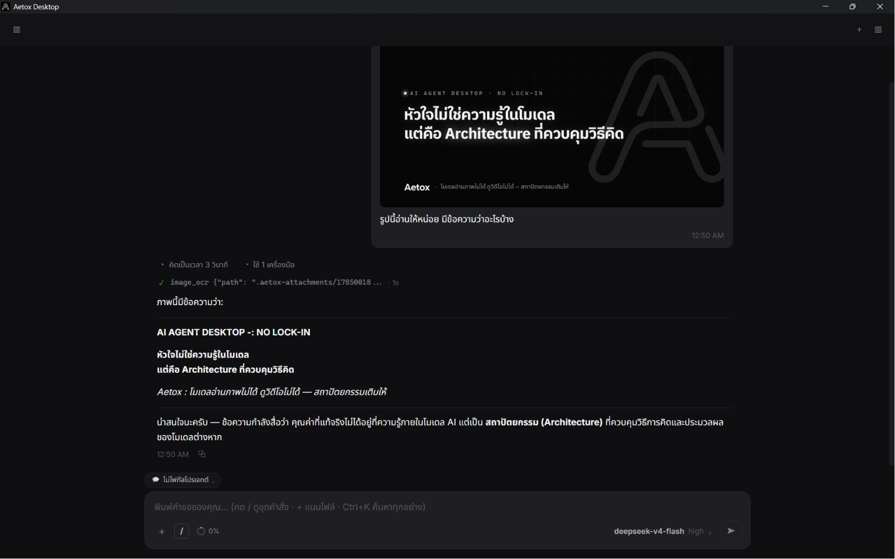

<p align="center">
  
</p>

<h1 align="center">Aetox</h1>

<p align="center">
  <strong>agent harness แบบเนทีฟสำหรับ Windows — ผู้ช่วย · โต๊ะโค้ด · ทีมเอเจน คือสามหน้าใช้งานของระบบเดียวที่ลงมือทำงานจริงบนเครื่องคุณ</strong>
</p>

<h3 align="center">ระบบสำคัญกว่าโมเดล: สภาพแวดล้อมเปลี่ยนคำตอบให้เป็นงานที่ตรวจสอบได้</h3>

<p align="center">
  <a href="https://github.com/Mikedev115/Aetox/releases/latest"></a>
  <a href="docs/reports/coding-harness-1.9.7/README.md"></a>
  <a href="LICENSE"></a>
  
</p>

<p align="center">
  <a href="README.md">English</a> ·
  <a href="https://mikedev115.github.io/Aetox-landing/th/">เว็บไซต์</a> ·
  <a href="https://apps.microsoft.com/detail/9N4KKBRRSCZZ">Microsoft Store</a> ·
  <a href="https://github.com/Mikedev115/Aetox/releases/latest/download/aetox-amd64-installer.exe">ดาวน์โหลด</a> ·
  <a href="https://github.com/Mikedev115/Aetox/releases/latest/download/aetox-cli-setup.exe">Aetox CLI</a> ·
  <a href="docs/reports/README.md">ผลวัดงานโค้ด</a> ·
  <a href="https://www.facebook.com/share/g/1BnXC5EiWg/">ชุมชน</a>
</p>

<p align="center">
  
</p>

> ใช้ฟรี · **source-available ไม่ใช่ open source** · ซอร์สในรีโปนี้หยุดที่ v1.7.0 ส่วนตัวโปรแกรมยังออกรุ่นใหม่ที่นี่ทุกรุ่น —
> [อ่านเพิ่ม](#ซอร์สโค้ด-สัญญาอนุญาต-และคนที่ทำ)

**เริ่มใช้งาน** — Windows 10 ขึ้นไป x64 ไม่ต้องมีคีย์ API ก็ลองได้:
[Microsoft Store](https://apps.microsoft.com/detail/9N4KKBRRSCZZ) (ลงนามแล้ว อัปเดตเอง) ·
[ตัวติดตั้ง](https://github.com/Mikedev115/Aetox/releases/latest/download/aetox-amd64-installer.exe) ·
[Aetox CLI](https://github.com/Mikedev115/Aetox/releases/latest/download/aetox-cli-setup.exe) สำหรับเทอร์มินัล ·
Scoop ไฟล์ zip พกพา และเรื่อง SmartScreen อยู่ใน[ติดตั้ง](#ติดตั้ง) · เอกสารอื่นทั้งหมดอยู่ใน [docs/](docs/README.md)

**ไปที่หัวข้อ:** [สามหน้าใช้งาน](#harness-เดียว-สามหน้าใช้งาน) · [ระบบสำคัญกว่าโมเดล](#ระบบสำคัญกว่าโมเดล) ·
[ผู้ช่วย](#ประตูผู้ช่วย) · [โค้ด](#ประตูโค้ด) · [ทีม](#ประตูทีม) · [โมเดล](#ใช้กับโมเดลไหนได้บ้าง) · [ผลวัด](#ผลวัด) ·
[ติดตั้ง](#ติดตั้ง) · [ความปลอดภัย](#ความปลอดภัยและข้อมูลของคุณ) · [ระบบทำงานอย่างไร](#ระบบทำงานอย่างไร) ·
[สัญญาอนุญาต](#ซอร์สโค้ด-สัญญาอนุญาต-และคนที่ทำ)

## harness เดียว สามหน้าใช้งาน

**Aetox คือ agent harness แบบเนทีฟสำหรับ Windows:** ระบบที่ห่ออยู่รอบโมเดลและให้เครื่องมือ พื้นที่ทำงาน
สิทธิ์ ความจำ และวงจรตรวจสอบ เพื่อให้โมเดลลงมือทำงานจริง ไม่ใช่แค่สร้างคำตอบ

| ถ้าคุณต้องการ | เปิดหน้าใช้งาน | Aetox ทำให้ |
|:---|:---|:---|
| ให้ AI ทำงานกับไฟล์ เว็บ และเอกสารบนเครื่อง | **ผู้ช่วย**<br>ใช้เครื่อง จดจำ ทำเอกสาร | อ่านเขียนไฟล์จริง รันคำสั่งจริง และขับเบราว์เซอร์ที่คุณนั่งดูและแทรกมือได้ อ่านรูป PDF และเสียง แล้วส่งสเปรดชีต เอกสาร และสไลด์ที่เปิดได้จริงกลับมา |
| เขียน แก้ และทดสอบโค้ด | **โค้ด — use case หลัก**<br>อ่านโค้ด สร้างระบบ ดีบัก | โต๊ะที่ผูกกับโปรเจกต์ โหมด Agent ให้เอเจนลงมือ โหมด Editor ให้คุณเขียนเองโดยมี Aetox ช่วย มี language server, Git, เทอร์มินัลจริง และ `aetox` ในเทอร์มินัล |
| แบ่งงานให้หลายบทบาททำพร้อมกัน | **ทีม**<br>จัดคน สั่งงาน ดูงานเดิน | คุยกับเลขาคนเดียว งานไปถึงทีม แผนก หรือบริษัทของเอเจนที่มีหัวหน้าแบ่งงานทุกชั้น แล้วคืนชิ้นงานเป็นไฟล์จริง |

ผู้ช่วยและทีมเป็นหน้าใช้งานของ harness เดียวกับโค้ด ใช้คีย์ ความจำ การตั้งค่า และสิทธิ์ชุดเดียวกัน
สลับที่แถบบนได้ทันที ใช้กับ[ผู้ให้บริการโมเดลภายนอก 28 ราย](#ใช้กับโมเดลไหนได้บ้าง)ทั้งบนคลาวด์และในเครื่อง และมีผู้ให้บริการทดลองในตัว ไม่มี API key ก็เริ่มลองได้
หน้าจอมีภาษาไทยและอังกฤษครบทุกข้อความ โดยไทยเป็นค่าเริ่มต้น
**[ติดตั้ง](#ติดตั้ง)** ได้จาก Microsoft Store · ตัวติดตั้ง · Aetox CLI

## ระบบสำคัญกว่าโมเดล

**โมเดลให้สติปัญญา; Aetox ให้ระบบที่ทำให้โมเดลลงมือได้จริง**

```
                     MODEL        ← สมอง: รู้ว่าควรทำอะไร
                       ↓
                  ┌─────────┐
                  │  AETOX  │     ← ร่างกาย: ตา หู มือ เครื่องมือ สิทธิ์
                  └────┬────┘
          ┌────────────┼────────────┐
          ↓            ↓            ↓
      Assistant       Code         Team
     ไฟล์ เว็บ เอกสาร   โปรเจกต์ Git    เลขา → หัวหน้า → เอเจน
```

> **ดาวเหนือของโปรเจกต์นี้** *อย่าสร้าง AI ที่ตอบได้มากขึ้น จงสร้าง AI ที่ทำได้มากขึ้น*

รูปแบบนี้มีชื่อเรียกว่า **harness** คือโปรแกรมที่ห่อโมเดลไว้ ให้เครื่องมือ ให้วงทำงาน และให้ที่ลงมือ
โมเดลคือเครื่องยนต์ harness คือตัวรถ โมเดลเดียวกันจึงกลายเป็นคนละผลิตภัณฑ์ได้ในคนละแอป
และคะแนนที่ประกาศกันเป็นของโมเดลกับ harness พร้อมกัน ไม่ใช่ของโมเดลลำพัง

ความสามารถหลายอย่างที่คนมักคิดว่าต้องมาจากโมเดลตัวใหญ่ ใน Aetox เป็นของระบบ:

1. **โมเดลตาบอดขับเบราว์เซอร์ได้** — ระบบติดหมายเลขให้ทุกองค์ประกอบบนหน้าเว็บ โมเดลที่ไม่มี vision
   จึงคลิกได้ถูกปุ่มโดยไม่ต้องเดาพิกัด → [ประตูผู้ช่วย](#ประตูผู้ช่วย)
2. **โมเดลตาบอดอ่านรูปได้ โมเดลที่ฟังไม่ได้ถอดเสียงได้ โมเดลที่ตอบได้แค่ข้อความส่งไฟล์จริงได้** — OCR ภาษาไทย
   และอังกฤษ การถอดเสียงแบบออฟไลน์ และการสร้าง `.xlsx` `.docx` `.pptx` เด็ค และวิดีโอ เป็นของแอป → [ประตูผู้ช่วย](#ประตูผู้ช่วย)
3. **โมเดลเล็กในเครื่องทำงานใหญ่ได้** — โมเดล 9B/35B บน LM Studio หรือ Ollama ได้เครื่องมือชุดเดียวกับโมเดลตัวใหญ่
   และข้อมูลไม่ออกจากเครื่องสักไบต์ → [ใช้กับโมเดลไหนได้บ้าง](#ใช้กับโมเดลไหนได้บ้าง)
4. **โมเดลเดียวกัน ผลไม่เท่ากัน** — บน GPT-6 Luna (`gpt-6-luna` ผ่านบัญชี ChatGPT (Codex) เดียวกันทุกตัว) โค้ดที่ผ่านเทสต์ความปลอดภัย (CWEval func-sec@1)
   ของ Aetox คือ 91.1% · OpenCode 66.7% · Codex CLI 66.7% · omp 68.9% · pi 64.4% จาก 461 รันที่ตัดสินด้วยเทสต์ที่ซ่อนไว้ (รุ่น 1.9.7)
   วิธีวัดและจุดที่ Aetox แพ้อยู่ใน[ผลวัด](#ผลวัด)
5. **เครื่องมือมากไม่ได้แปลว่าบริบทเต็ม** — เซิร์ฟเวอร์ MCP ที่มี 212 เครื่องมือใช้ดัชนีเพียง 135 โทเคน
   และโหลดรายละเอียดเมื่อใช้จริง → [ระบบทำงานอย่างไร](#ระบบทำงานอย่างไร)
6. **องค์กรที่ระบบคุม ไม่ใช่พรอมต์ขอร้อง** — ข้อความของคุณถึงหัวหน้าทุกชั้นตามตัวอักษร รอบที่ส่งงานกลับถูกนับโดยระบบ
   และหัวหน้าไม่ถือช่องรัน งานจึงแจกได้หลายชั้นพร้อมกันโดยไม่ค้าง → [ประตูทีม](#ประตูทีม)

ตัวแอปคือสองไฟล์ที่มีทุกอย่างอยู่ในตัว — `aetox.exe` คือหน้าต่าง และ `aetox-engine.exe` คือเครื่องยนต์ที่คิดและลงมือ
ไม่ต้องลง runtime ไม่มี `node_modules` ไม่มี Chromium ห่อมาด้วย และเพราะเครื่องยนต์เป็น process ของตัวเอง
มันจึงย้ายไปรันบนเครื่อง Linux อื่นได้: เพิ่มเครื่องที่ ตั้งค่า › เครื่องระยะไกล แล้วกดเชื่อมต่อ แอปส่งเครื่องยนต์ไปทาง `ssh`
ของคุณเอง แชท ไฟล์ เทอร์มินัล และ Git ที่เห็นคือของเครื่องนั้น ส่วนคีย์ผู้ให้บริการไม่ออกจากเครื่องที่หน้าต่างรันอยู่
เพราะเครื่องยนต์ขอให้หน้าต่างเซ็นทุกคำขอ

## ประตูผู้ช่วย

*ใช้เครื่อง จดจำ ทำเอกสาร* — ผู้ช่วยทำงานกับเครื่องทั้งเครื่องเมื่อไม่ได้เปิดโปรเจกต์ หรือทำงานในโฟลเดอร์โปรเจกต์
บวกโฟลเดอร์ที่คุณเพิ่ม ทุกอย่างเกิดขึ้นบนแผงงานข้างแชทที่มีสี่ห้อง คือ สไลด์ เบราว์เซอร์ ไฟล์ และเทอร์มินัล
เอเจนไม่ได้ทำงานหลังม่านแล้วส่งไฟล์มาตอนจบ มันเปิดห้องแล้วลงมือในห้องนั้น และคุณแทรกมือเข้าไปแก้ได้ทุกเมื่อ
โดยไม่ต้องรอให้จบเทิร์น ฝั่งผู้ช่วยมีไฟล์และเชลล์ จึงทำงานซอฟต์แวร์ได้ด้วย และจะไม่โยนงานคืนเพราะงานนั้นเกี่ยวกับโค้ด

> **สิ่งที่ระบบทำแทนโมเดลในประตูนี้**
> - ติดหมายเลขให้ทุกองค์ประกอบบนหน้าเว็บ โมเดลที่ไม่มี vision จึงคลิกได้ถูกปุ่ม
> - แปลงรูปเป็นข้อความด้วย OCR ภาษาไทยและอังกฤษ และถอดเสียงแบบออฟไลน์บนเครื่อง
> - สร้างไฟล์ `.xlsx` ที่สูตรใช้งานได้ `.docx` `.pptx` เด็คนำเสนอ และวิดีโอ
> - คำนวณตัวเลขในตัวแปล JavaScript ที่ฝังอยู่ในแอป แล้วแสดงสคริปต์ให้คุณตรวจ
> - ค้นบทสนทนาย้อนหลังด้วย SQLite บนเครื่อง โดยไม่ใช้โทเคน
> - ถามคุณก่อนโพสต์ ส่ง หรือแชร์สิ่งใดออกไปภายนอก ในทุกระดับการอนุญาต

**เบราว์เซอร์จริงที่คุณนั่งดู** ไม่ใช่การดึงข้อมูลแบบไม่มีหน้าจอ แต่เป็นหน้าต่าง WebView2 ที่ประกอบอยู่ในแอป
มีช่องที่อยู่ ปุ่มย้อนกลับ DevTools และขนาดอุปกรณ์แปดแบบที่ปรับขนาดหน้าต่างจริงให้ CSS media query ทำงานจริง
ชั้นที่ขับมันเราออกแบบและเขียนเองทั้งหมด คำสั่งคลิกและพิมพ์เล็งไปที่หมายเลขขององค์ประกอบ ไม่ใช่พิกัด x,y
ทุกแท็บมีปุ่ม **ให้เอเจนใช้** ปุ่มติดสีแปลว่าเอเจนแตะแท็บนั้นได้ กดดับแล้วแท็บเป็นของคุณ



**อ่านรูป PDF และเสียง** `image_ocr` รัน Tesseract ทั้งไทยและอังกฤษ ภาพหน้าจอ ไฟล์สแกน หรือแบบฟอร์มที่ถ่ายรูปมา
จึงกลายเป็นข้อความที่โมเดล 9B/35B คิดต่อได้ ส่วนโมเดลที่มองเห็นได้จะได้รูปไปตรง ๆ PDF อ่านได้โดยเลย์เอาต์ไม่แตก
และเสียงถอดได้แบบออฟไลน์ ยื่นโฟลเดอร์ให้แล้วบอกตรง ๆ ว่าอยากได้อะไร เช่น *"ไล่ดูใบเสร็จในโฟลเดอร์นี้แล้วทำเป็น
สเปรดชีตให้หน่อย"* — มัน OCR ทีละใบ คิดยอดรวมในตัวแปล JavaScript ในแอป วางสคริปต์ข้างคำตอบให้คุณดู
แล้วเขียน `.xlsx` จริงที่สูตรทำงานได้



**ส่งไฟล์จริงกลับมา** เด็คนำเสนอกลับมาเป็นไฟล์ `.html` ไฟล์เดียวที่แก้ด้วยมือได้และเปิดได้ทุกเครื่องที่มีเบราว์เซอร์
คุณเลื่อนดูทีละหน้า นำเสนอเต็มจอ และส่งออกเป็น `.pdf` `.png` `.jpg` ได้จากห้องสไลด์ `.pdf` มาจากตัวเรนเดอร์
เดียวกับที่วาดบนจอ หน้าตาจึงเหมือนที่คุณเพิ่งดู และกล่องสไลด์ 1280x720 เท่ากับหน้าจอกว้างของ PowerPoint พอดี
ส่วน `.xlsx` `.docx` และ `.pptx` เป็นงานของเอเจน `sheet` กับ `doc` คลิปวิดีโอเป็นงานของ `video`
และเสียงพากย์มาจาก `voice_make`

**ส่งงานให้เอเจนเฉพาะทาง** เลือกคนจากเมนู `+` เช่น `@doc` `@sheet` `@deepresearch` `@video` แล้วประโยคของคุณ
ถึงมือเขาทั้งคำโดยไม่ผ่านการเรียบเรียง (พิมพ์ `@` เองไม่มีผล โดยตั้งใจ เพราะเคยมีร่างที่แค่อ้างถึงชื่อเอเจน
แล้วส่งบรีฟทั้งก้อนไปผิดคน) หรือให้ผู้ช่วยส่งงานเองผ่าน `task` ซึ่งทำงานพร้อมกันได้สูงสุดสี่คน สามงานจึงใช้เวลา
เท่างานที่ช้าที่สุด ไม่ใช่เวลารวม เอเจนที่เจอทางแยกซึ่งไม่ควรตัดสินใจเองจะกลับมาเป็นคำถามใต้ชื่อของเขาในแชท
และเอเจนที่ยังทำไม่เสร็จตอนคำตอบถึงมือคุณก็ทำต่อได้ จบเทิร์นจึงไม่ใช่เส้นตาย

<details>
<summary>ตัวอย่างที่รันจริง: หา CRM 20 เจ้าแล้วทำเป็นสเปรดชีต</summary>

รันเมื่อ 15 ส.ค. 2026 จากประโยคเดียว — *"ช่วยหา CRM มา 20 เจ้าที่ SME ไทยเลือกใช้ได้จริง แล้วทำเป็นสเปรดชีต
เทียบให้หน่อย"*: **6 นาที 51 วินาที เอเจนสองตัว เรียกเครื่องมือรวม 42 ครั้ง** — ผู้ช่วย 8 ครั้ง `deepresearch`
27 ครั้งไล่อ่านหน้าราคา และ `sheet` อีก 7 ครั้ง มีเครื่องมือพังไปหนึ่งตัวแล้วเดินอ้อมไปต่อได้ `deepresearch`
วางรายงานไว้ในโฟลเดอร์ผลลัพธ์ของเซสชัน แล้ว `sheet` ได้รับ *path* ไม่ใช่เนื้อหา

ได้กลับมายี่สิบแถว สิบสี่แถวมีราคาเป็นตัวเลขจริงเรียงจากถูกไปแพง และ**หกแถวเว้นว่างไว้โดยตั้งใจ**
พร้อมเหตุผลว่าเป็นราคาแบบต้องติดต่อขอ หรือหน้าเว็บไม่บอกตัวเลข ทุกแถวมีวันที่ที่เข้าไปอ่านและลิงก์ที่มา
ช่องที่เว้นไว้คือส่วนที่น่าเชื่อที่สุด เพราะตารางที่ไม่มีช่องว่างเลยคือตารางที่เดา

</details>

**สั่งเป็นงาน ไม่ใช่สั่งเป็นขั้น** งานยาวถูกวางแผนก่อนลงมือ และแผนขึ้นจอเป็นกล่องเดียวที่ติ๊กตามจริงระหว่างทำ
สิ่งที่คุณเฝ้าดูจึงเป็นลำดับที่มันเลือกเอง ไม่ใช่วงกลมหมุน ถ้าอยากให้คิดก่อนลงมือ มีปุ่มโหมดวางแผนที่อ่านได้ทุกอย่าง
แต่เปลี่ยนอะไรไม่ได้เลย ปุ่มนั้นเป็นของคุณคนเดียว โมเดลกดเข้าเองไม่ได้ และเปิดสองแชทข้างกันในหน้าต่างเดียวได้ (`Ctrl+\`)

**แชทส่งข้อความหากันได้** คัดลอก ID ข้างชื่อแชทหรือจากเมนู แล้วบอกอีกแชทให้ส่งคำถามหรือแจ้งข่าวไปหา
แชทปลายทางรับข้อความระหว่างทำงาน หรือเปิดเทิร์นเองเมื่อว่าง คำถามรับคำตอบได้หนึ่งครั้ง
ส่วนแชทที่ปิดอยู่ในโปรเจกต์อื่นต้องเปิดก่อนจึงจะส่งถึงได้

**จำได้ และคุณยกเลิกได้** ผู้ช่วยจดสิ่งที่ควรจำเองทันที เช่น เมื่อคุณติ เมื่อคุณยืนยันวิธีที่ไม่ใช่วิธีปกติ
หรือเมื่อมีการตัดสินใจที่โค้ดไม่ได้บอก การ์ดใต้คำตอบแสดงบรรทัดที่จดพร้อมปุ่ม **ยกเลิก** และเรื่องที่คุณปฏิเสธไปแล้ว
จะไม่ถูกจดซ้ำไม่ว่าจะใช้คำไหน ส่วนบทเรียนจากความผิดพลาดที่เกิดซ้ำครบสามครั้งยังรอคุณกดรับหรือทิ้งในคิวตรวจทาน
ทุกอย่างที่เก็บเป็นมาร์กดาวน์ธรรมดาที่เปิดอ่าน แก้ หรือสั่งลืมได้ นอกจากนี้ยังมี **คำสั่งประจำ** ซึ่งเป็นไฟล์ของคุณเอง
ที่ติดไปทุกโต๊ะ ทุกโปรเจกต์ และทุกเอเจน ทุกบทสนทนาและทุกครั้งที่เครื่องมือทำงานถูกเก็บใน SQLite พร้อม FTS5
การค้นด้วย `session_search` จึงเป็น query บนเครื่อง ไม่ใช่การถามโมเดล ทั้งภาษาไทยและอังกฤษ

**เชื่อมบริการที่คุณใช้อยู่** วางลิงก์ คำสั่งติดตั้ง หรือแค่ชื่อของเซิร์ฟเวอร์ MCP หรือสกิลลงในแชท ระบบหาตัวทางการ
ตรวจว่าต้องใช้คีย์หรือ OAuth แล้วขึ้นการ์ดให้คุณกดติดตั้ง ทุกการติดตั้งต้องมีคนกด ห้องสมุด MCP ในแอปบอกจำนวน
เครื่องมือและโทเคนที่วัดจริงของแต่ละเซิร์ฟเวอร์ก่อนติดตั้ง บัญชีที่เชื่อมได้ในตัว ได้แก่ n8n และ Windmill (เอเจน
`automation` สร้างและแก้เวิร์กโฟลว์ อ่านข้อจำกัดใน[ระบบทำงานอย่างไร](#ระบบทำงานอย่างไร)ก่อนฝากงานสำคัญ) Meta
(เอเจน `ads` อ่านบัญชีโฆษณา เอเจน `content` โพสต์ลงเพจ) และ YouTube (เอเจน `youtube` อัปโหลดคลิป)

**ผู้ช่วยมีตัวตน และออกไปอยู่บนเดสก์ท็อปได้** มาสคอตหุ่นยนต์วาดจากโค้ด มีท่าตามสิ่งที่ผู้ช่วยกำลังทำ ทักคุณด้วยชื่อ
และอ่านคำตอบที่จบแล้วออกเสียง จะให้อยู่ในหน้าต่าง หรือปล่อยออกไปบนเดสก์ท็อปเป็นหน้าต่าง Win32 จริงที่ลากไปจอไหนก็ได้

<details>
<summary>ใช้ผู้ช่วยผ่าน Telegram หรือ Discord</summary>

เปิด **ของคุณ → การเชื่อมต่อ** แล้วเลือก Telegram หรือ Discord:

1. Telegram: สร้างบอทกับ `@BotFather` แล้วนำ bot token มาเชื่อม
2. Discord: สร้างแอปที่ Discord Developer Portal เพิ่ม Bot แล้วเชิญบอทเข้าเซิร์ฟเวอร์ด้วยสิทธิ์
   View Channels, Send Messages และ Read Message History (ไม่ต้องเปิด Message Content Intent)
3. หลังเชื่อม Aetox จะแสดงคำสั่ง `/pair 123456` แบบใช้ครั้งเดียว ส่งคำสั่งนั้นจาก Telegram chat
   หรือ Discord channel ที่ต้องการอนุญาต (ในเซิร์ฟเวอร์ Discord ให้ mention บอทด้วย)

นี่คือผู้ช่วยหลักของ Aetox ตัวเดียวกัน ไม่ใช่บอทที่สร้างแยก ใช้ตัวตนและเครื่องมือชุดเดียวกับหน้าผู้ช่วย แต่ละ chat
หรือ channel มีประวัติสนทนาของตัวเอง บอทรับข้อความจากห้องที่จับคู่ไว้ห้องเดียว ข้อความใน Discord server ต้อง mention
บอท ส่วน DM คุยได้ตรง ๆ ใช้ `/new` เมื่อต้องการเริ่มบริบทใหม่ token และข้อมูลการจับคู่ถูกเก็บแบบเข้ารหัส
และตัวรับข้อความทำงานเฉพาะขณะที่ Aetox เปิดอยู่

</details>

## ประตูโค้ด

*อ่านโค้ด สร้างระบบ ดีบัก* — ประตูที่สองคือโรงช่าง ไม่ใช่แชทที่เปิดโหมดเขียนโค้ดไว้ มันผูกกับโฟลเดอร์โปรเจกต์
ที่คุณเปิด และมีหลักการทำงานของตัวเอง: เทิร์นจบเมื่องานเสร็จ ไม่ใช่เมื่อเขียนแผนเสร็จ "เสร็จ" แปลว่าพิสูจน์ด้วย
การรันจริง ของใหม่ต้องมีเทสต์อยู่ในชุดเทสต์ของโปรเจกต์ และหลังเทสต์เฉพาะจุดต้องรันการตรวจเต็มของโปรเจกต์อีกรอบ

> **สิ่งที่ระบบทำแทนโมเดลในประตูนี้**
> - ถาม language server ว่าตัวระบุนั้นประกาศที่ไหน ถูกเรียกจากที่ใด และการแก้จะกระทบส่วนใด
> - โหลดหน้า `.html` ที่เพิ่งเขียนบนจอคอมพิวเตอร์และมือถือ ทั้งโหมดสว่างและมืด แล้วรายงานจุดที่ต้องแก้
> - คืนผลของคำสั่งที่ไม่มีความเคลื่อนไหวเกิน 2 นาทีให้โมเดลทันที แทนการรอจนครบ timeout
> - ส่งคำตอบที่ระบุเองว่างานยังไม่เสร็จกลับไปให้ทำต่อ
> - คงประวัติที่ส่งไปแล้วไว้ไม่ให้เปลี่ยน แคชของผู้ให้บริการจึงใช้ได้ทุกรอบ
> - เก็บสำเนาไฟล์ก่อนแก้ของทุกเทิร์นด้วย shadow-git เพื่อย้อนกลับได้

### สองโหมด: Agent · Editor

สวิตช์บนแถบบนสลับได้ทันที แต่ละโหมดเป็นโต๊ะของตัวเอง มีรายการแชทของตัวเอง และผูกกับโปรเจกต์เดียวกัน

เก็บสวิตช์เป็นแท็บเล็กได้ โดยยังบอกโหมดและสถานะว่ากำลังทำงานหรือรอคุณ หน้า Git มี fetch, pull, push
จำนวนคอมมิตที่นำหน้าและตามหลัง กราฟสาขา และเมนูเปิดหรือสร้าง worktree ดึงลงแบบ fast-forward เป็นค่าเริ่มต้น
เมื่อสาขาแยกทางกันจึงให้เลือก rebase หรือ merge

**Agent — ให้เอเจนลงมือ แล้วคุณดูบนแผงงาน** แชทอยู่ซ้าย แผงงานอยู่ขวา ประกอบด้วยเทอร์มินัล ConPTY จริง
ไม่จำกัดแท็บ เบราว์เซอร์ที่เอเจนขับ ต้นไม้ไฟล์ Git ที่มีไทมไลน์ของคอมมิตในหน้าเดียวกัน และแผนที่โค้ด

- **หาสาเหตุว่าทำไมเทสต์ไม่นิ่ง** — มัน grep ทั้งรีโป รันชุดเทสต์ในแท็บเทอร์มินัลที่คุณดูอยู่ อ่านจุดที่พัง แล้วแก้ไฟล์
- **รู้ว่าชื่อหนึ่งคืออะไรก่อนจะเชื่อมัน** — `codebase` ถาม language server แทนการค้นแบบข้อความที่ต้องเดา
- **เห็นรูปร่างของรีโปที่คุณไม่ได้เขียน** — แผนที่โค้ดของทั้งต้นไม้ พร้อม `grep` และ `glob` ทั้งต้น
- **เขียนหน้าเว็บแล้วรู้ทันทีว่าพังตรงไหน** — ผลตรวจกลับมาพร้อมผลการเขียน: สคริปต์พัง ตัวอักษรจางกว่าเกณฑ์ AA
  หน้ากว้างเกินจอ โหมดมืดที่พื้นยังสว่าง ตัวไทยที่สระลอยหรือทับบรรทัด และปุ่มเล็กเกินกด
- **อ่าน diff โดยไม่ต้องออกจากบทสนทนา** — กางแถวเครื่องมือแล้วเห็นการเปลี่ยนแปลงเป็น hunk แบบ git

**Editor — คุณเขียนเอง Aetox ช่วย** ไฟล์อยู่กลางจอใน Monaco แผงขวามีเอเจน Explorer Git และชิ้นงาน
เทอร์มินัลอยู่ด้านล่าง ไม่มีตลาดส่วนขยาย ทุกอย่างจึงสร้างไว้ในตัว

- **Ctrl+K ขอแก้ตรงบรรทัด** — พิมพ์สั้น ๆ ใต้บรรทัดที่เลือก คำตอบกลับมาเป็น hunk ให้เก็บหรือคืนทีละก้อน
- **เติมโค้ดจากโมเดลตัวไหนก็ได้** — FIM ของ DeepSeek แบบ OpenAI และ Ollama หรือ chat model ตัวไหนก็ได้
  ตั้งแยกจากโมเดลของแชท
- **Language server อยู่ข้างหลังอีดิเตอร์** — completion, hover, go-to-definition, รายการปัญหา และค้น symbol
  หน้าภาษาเป็นแคตาล็อก 44 เซิร์ฟเวอร์ ติดตั้งจาก toolchain หรือโหลดจาก release ของเซิร์ฟเวอร์เองพร้อมตรวจ SHA-256
- **Git ในอีดิเตอร์** — บรรทัดที่เปลี่ยนใน gutter, blame ที่บรรทัดเคอร์เซอร์, เทียบกับ HEAD ข้างกัน
  และคอมมิตทีละ hunk โดยไม่แตะ index จริงที่เชลล์อาจใช้อยู่
- แบ่งจอสองฝั่ง · รันเทสต์ใต้เคอร์เซอร์ · แทนที่ทั่วโปรเจกต์ · `.editorconfig` · จัดรูปแบบตอนเซฟ ·
  เปิดไฟล์ SQLite เป็นตารางแบบอ่านอย่างเดียว

### งานยาวที่จบได้จริง

งานโค้ดจริงยาวหลายสิบนาที และสิ่งที่ทำให้มันล้มส่วนใหญ่ไม่ใช่โมเดล แต่เป็นสิ่งที่อยู่รอบ ๆ

<details>
<summary>ระบบกันงานยาวไม่ให้ค้างหรือล้มอย่างไร และทำไมงาน GitHub อยู่ที่เอเจน github</summary>

- **คำสั่งที่นิ่งไม่ทำให้เทิร์นค้าง** — "นิ่ง" แปลว่าไม่พิมพ์ ไม่ใช้ CPU และชุดโปรเซสไม่เปลี่ยน คอมไพล์ที่เงียบแต่ยังทำงาน
  จึงไม่ถูกนับว่าค้าง ผลของเชลล์มีเพดาน 30 KB โดยเก็บทั้งหัวและท้าย log ก้อนใหญ่ก้อนเดียวจึงไม่ทำให้ทุกคำขอที่เหลือแพงขึ้น
- **เน็ตหลุดและ 5xx ลองใหม่จริง** — DNS ล้มหรือสายถูกตัดจะลองใหม่ทั้งที่ชั้นการเชื่อมต่อและชั้นเทิร์น
  ส่วน 5xx ถอยแล้วลองใหม่ที่ 2, 5 และ 10 วินาที ไม่จบเทิร์นในเสี้ยววินาที
- **เซสชันยาวจ่ายน้อยลง** — ผลเครื่องมือเป็นข้อความล้วน การอ่านบรรทัดที่ยังอยู่ในบทสนทนาจะได้คำตอบว่าอยู่ตรงไหน
  แทนการส่งซ้ำ และ grep ตัดระหว่างผลลัพธ์ ไม่ตัดกลางก้อน

งาน GitHub ทั้งค้นรีโป อ่าน PR เปิด PR อ่าน CI และคอมเมนต์ ส่งให้เอเจน `github` ที่ถือเครื่องมือชุดนั้น โต๊ะโค้ด
เลิกแบกเครื่องมือ GitHub และบริการที่เชื่อมบัญชีไว้ในทุกคำขอ เพราะใน 30 วันไม่เคยถูกเรียกเลย แต่กินราว 1.4k โทเคน
ทุกรอบ ส่วน merge กับ close จงใจไม่มี การปิดข้อโต้แย้งเป็นคลิกเดียวบนหน้าที่คุณเปิดอยู่แล้ว
โต๊ะนี้จงใจไม่มีตัวเขียนเอกสารหรือสเปรดชีต OCR และตัวอ่าน PDF หรือเสียง เด็ค*เกี่ยวกับ*โค้ดเป็นงานของประตูผู้ช่วย

</details>

### Aetox CLI — โต๊ะโค้ดในเทอร์มินัล

พิมพ์ `aetox` ในโฟลเดอร์ไหนก็ได้เพื่อเปิดโต๊ะโค้ดแบบจอเต็ม ดูเครื่องมือทำงานเรียงขึ้นไปเหนือช่องพิมพ์
ตอบการ์ดขออนุญาตได้ในจอ และพิมพ์แทรกได้ระหว่างที่มันทำงาน

```text
aetox                       จอเต็ม (--plain = ทีละบรรทัด)
aetox chat "งาน"            สั่งครั้งเดียว คำตอบออก stdout สำหรับสคริปต์
aetox login codex           ลงชื่อเข้าใช้ผู้ให้บริการ (codex, copilot, ...)
aetox --whole-machine       เครื่องมือเข้าถึงได้ทั้งเครื่อง ที่เก็บกุญแจยังปิด สำหรับคอนเทนเนอร์หรือ VM ที่ทิ้งได้
aetox --report runs.jsonl   ต่อท้ายหนึ่งบรรทัด JSON ต่อเทิร์น: รอบ โทเคน ค่าใช้จ่าย วินาที เครื่องมือ
```

CLI มี[ตัวติดตั้งของตัวเอง](#ติดตั้ง)แยกจากแอป ถ้าเครื่องมีแอป Aetox อยู่ CLI จะใช้เครื่องยนต์ คีย์ แชท และความจำ
ชุดเดียวกับแอป ถ้าไม่มีก็ใช้เครื่องยนต์ของตัวเอง และบอกเองเมื่อมีรุ่นใหม่ CLI ตัวนี้เองคือตัวที่ใช้วัดผลงานโค้ด

### ผลวัดงานโค้ด

บนโมเดลเดียวกัน เทียบกับ OpenCode · Codex CLI · omp · pi (รุ่น 1.9.7 รวม 461 รัน) Aetox นำเรื่องโค้ดที่ปลอดภัยทั้งสองโมเดล
และผ่าน checkpoint ครบมากที่สุดในงานยาวหลายเทิร์นบน GPT-5.6 Terra ส่วนโจทย์ยากบน GPT-6 Sol เสมอ Codex CLI
จุดที่แพ้คือ Web-Bench และราคาที่จ่ายคือเวลากับโทเคนที่มากกว่า — ดู[ผลวัด](#ผลวัด)

## ประตูทีม

*จัดคน สั่งงาน ดูงานเดิน* — ประตูที่สามคือที่ที่ Aetox เลิกเป็นผู้ช่วยตัวเดียวแล้วเป็นองค์กร คุณคุยกับ **เลขา** คนเดียว
เลขาไม่มีมือและไม่มีเชลล์ หน้าที่คือรับคำสั่ง ถามเมื่อจำเป็น ตัดสินว่างานควรไปถึงชั้นไหน ส่งต่อ แล้วรายงานผล
เลขาไม่ทำงานซ้ำเอง และไม่เขียนบรีฟใหม่ทับคำของคุณ

> **สิ่งที่ระบบทำแทนโมเดลในประตูนี้**
> - ส่งข้อความของคุณถึงหัวหน้าทุกชั้นตามตัวอักษร ไม่ผ่านการเรียบเรียงใหม่
> - ไม่ให้หัวหน้าถือช่องรันงาน แผนกจึงแจกงานให้สามทีม และบริษัทแจกงานให้สามแผนกพร้อมกันได้
> - นับจำนวนรอบที่หัวหน้าส่งงานกลับให้แก้ แทนการเขียนขอไว้ในพรอมต์
> - ส่งกฎและบริบทของบริษัทกับแผนกไปถึงหัวหน้าตามเส้นทางของงาน ลูกทีมได้รับเฉพาะสิ่งที่ต้องใช้
> - ให้เอเจนแต่ละคนใช้โมเดลของตัวเอง ค่าใช้จ่ายจึงเป็นไปตามงานของแต่ละคน
> - ตรวจโครงสร้างองค์กร เช่น แผนกที่ไม่มีหัวหน้า ทีมที่ไม่เคยถูกใช้ และเอเจนที่ถือเครื่องมือซ้ำกัน

### สามชั้น แต่ละชั้นมีหัวหน้าที่คิดเอง

| ชั้น | ประกอบด้วย | หัวหน้าทำอะไร |
|:---|:---|:---|
| **ทีม** | หัวหน้าทีม + เอเจน | รับงานทั้งก้อน แบ่งเป็นประโยคคน หนึ่งคนหนึ่งชิ้นงานที่ไม่ทับกัน แล้วเก็บผลกลับมาตัดสิน |
| **แผนก** | หัวหน้าแผนก + ทีม | งานกว้างในเรื่องเดียว แจกให้หลายทีมพร้อมกัน ทีมหนึ่งอยู่ได้หลายแผนก |
| **บริษัท** | หัวหน้าบริษัท + แผนก | ภาพใหญ่ทั้งองค์กร แจกให้แผนก หรือจ้างทีมตรงก็ได้ ก่อตั้งได้เมื่อมีแผนกที่มีหัวหน้าครบสามแผนก |

เลขาเลือก**ชั้นต่ำที่สุดที่รับงานนั้นได้** งานชัดของทีมเดียวไปถึงทีมนั้นตรง ๆ งานกว้างขึ้นไปถึงแผนกหรือบริษัท
ไม่มีชั้นไหนบังคับให้ผ่าน เพราะการขึ้นไปสูงกว่าที่งานต้องการเสียหนึ่งรอบโดยไม่ได้อะไรเพิ่ม ลูกทีมได้รับแค่คำสั่ง
ของหัวหน้ากับหน้าที่ของตัวเองในทีม และกฎของทีมถึงทุกคนในทีม

### ดูงานเดินได้ทุกชั้น

- **การ์ดบนแถบซ้ายเลือกว่าคุณยืนอยู่ชั้นไหน** ทีม แผนก หรือบริษัท เลขารู้ชั้นนั้นทุกข้อความ เปลี่ยนชั้นแล้วเริ่มแชทใหม่
  ประวัติแชทยังเป็นรายการเดียว และแต่ละแถวติดป้ายว่าเริ่มที่ไหน
- **งานที่มอบเป็นผังเดียวในแชท** หัวหน้าอยู่บน ลูกทีมอยู่ใต้ แต่ละแถวบอกว่ากำลังทำอะไรและมีปุ่มหยุดของตัวเอง
  คำถามของใครก็ขึ้นใต้คนนั้นและตอบได้ตรงนั้น กดแถวแล้วงานเต็มเปิดในแผงขวา
- **ชิ้นงานเป็นไฟล์จริง** อยู่ในโฟลเดอร์ของทีมหรือในโปรเจกต์ที่โฟกัสอยู่ และขึ้นเป็นการ์ดในคำตอบของเลขา
- **ห้องบริษัท** แผงขวาของประตูนี้เป็นออฟฟิศ 3D เลือกแมพวิทยาเขตหรือตึกได้ (เครื่องที่ไม่มี WebGL ได้ห้อง 2.5D)
  หุ่นของแต่ละเอเจนนั่งโต๊ะและขยับตามเครื่องมือที่ใช้อยู่ หัวหน้ามีโต๊ะและยศของตัวเอง งานที่เสร็จถูกยกไปส่ง
  เวลาในห้องตามนาฬิกาของคุณ และบอร์ดบอกงานเสร็จวันนี้ · ทำงานอยู่ · รอคุณ
- **ห้องทำงาน** บันทึกสายงานไว้ได้ แต่ละขั้นบอกว่าทีมไหนรับชิ้นไหน กดเริ่มแล้วสายเดินทีละขั้น
  ขั้นไหนหยุดถาม คำตอบไปถึงขั้นนั้นแล้วเดินต่อ
- **คอนโซลบนเว็บ** หน้า `:8317` บนเครื่องคุณใช้ตั้งค่าทีม แผนก และบริษัทได้ และมีมือถือจำลองที่แชทกับเลขา
  ผ่านแชทเดียวกับหน้าต่าง

### องค์กรคือไฟล์ธรรมดา

ทุกชั้นเป็นมาร์กดาวน์บนดิสก์ จัดการได้ที่ **ตั้งค่า › องค์กร** ซึ่งวาดทั้งองค์กรเป็นต้นไม้ ตรวจโครงสร้างให้
และสรุปว่าแต่ละทีมใช้ไปเท่าไร

```text
<DataRoot>/teams/<ชื่อ>/TEAM.md                หัวหน้า · ลูกทีม · หน้าที่ของแต่ละคนในทีม · ## กฎทีม
<DataRoot>/departments/<ชื่อ>/DEPARTMENT.md    หัวหน้าแผนก · ทีม · ## บริบทแผนก · ## กฎแผนก
<DataRoot>/companies/<ชื่อ>/COMPANY.md         หัวหน้าบริษัท · แผนก · ## บริบทบริษัท · ## กฎบริษัท
```

ตัวติดตั้งใส่มาให้หนึ่งทีมคือ **ทีมคอนเทนต์** ที่เหลือคุณสร้างเองจากหน้าตั้งค่า หรือจากแผ่นเทมเพลตที่เติมตัวตน
วิธีคิด และหน้าที่ให้ครบ พร้อม MCP ที่แนะนำต่อบทบาท แอปมีคนมาให้เลือกแล้ว 21 คน:

| บทบาท | มากับแอป |
|:---|:---|
| หัวหน้าทีม | `lead` `producer` `planner` `headwriter` `director` `publisher` |
| หัวหน้าแผนก | `chief` `showrunner` |
| หัวหน้าบริษัท | `boss` |
| เอเจนทำงาน | `ads` `automation` `content` `deepresearch` `doc` `editor` `github` `scriptwriter` `sheet` `video` `web` `youtube` |

### เอเจนหนึ่งคนคือหนึ่งโฟลเดอร์

การจ้างคนใหม่คือการวางโฟลเดอร์ลงใน `<DataRoot>/agents/` ไม่ต้องรอรุ่นใหม่ ไม่ต้องมี plugin API และไม่ต้องรีสตาร์ต
โฟลเดอร์คือตัวตนทั้งหมดของเอเจน: `AGENT.md` (เป็นใคร หยิบเครื่องมือแคบลงแค่ไหน ใช้โมเดลตัวไหน และ `role: head`
ถ้าเป็นหัวหน้า) `MEMORY.md` (สิ่งที่เรียนรู้มา) `STARTERS.md` (แชทเปล่ากับเขาเปิดอย่างไร) และโฟลเดอร์ `skills/`
ส่วนตัวที่เอเจนคนอื่นมองไม่เห็น

โฟลเดอร์นี้คือจุดที่ผู้ช่วยตัวเดียวกับองค์กรแยกทางกัน เอเจนแต่ละคนใช้**โมเดลของตัวเองที่ผู้ให้บริการของตัวเอง**
คนที่ต้องเปิดหน้าราคายี่สิบหน้าใช้โมเดลราคาถูกได้ ส่วนคนที่ต้องชั่งน้ำหนักสิ่งที่หามาใช้ตัวที่แข็งกว่า ค่าใช้จ่ายจึงเป็นไป
ตามงาน ไม่ใช่ตามงานที่ยากที่สุด และแต่ละคนมี**ความจำของตัวเอง** สิ่งที่เอเจนหาข้อมูลเรียนรู้เกี่ยวกับแหล่งหนึ่ง
จึงไม่ไปปนกับวิจารณญาณเรื่องสัญญาของเอเจนเอกสาร

นอกประตูทีม เอเจนก็ทำงานให้คุณได้เหมือนกัน ที่ประตูผู้ช่วยและประตูโค้ด ผู้ช่วยส่งงานให้เอเจนในกลุ่มที่แชทนั้น
มีสิทธิ์มอบงาน (ตั้งที่ ตั้งค่า › สิทธิ์มอบงาน) หรือคุณจะไปคุยกับเอเจนตรง ๆ ในห้องพนักงานเฉพาะทางก็ได้
นอกจากนี้ยังมี **ลูกมือ** สองตัว (`explore` `general`) ซึ่งเป็นผู้ช่วยภายในแบบชุดตายตัวที่เพิ่มไม่ได้โดยตั้งใจ
แต่ปรับโมเดล ผู้ให้บริการ คำสั่ง เพดานจำนวนขั้น และรูปลักษณ์ได้

## ใช้กับโมเดลไหนได้บ้าง

**ผู้ให้บริการภายนอก 28 ราย และหน้าต่างแสดงครบทุกราย** — OpenAI · OpenAI-compatible (ปลายทางของคุณเอง) ·
Anthropic · Gemini · DeepSeek · Qwen · Z.ai · OpenRouter · Codex · Groq · Mistral · Kimi ·
MiniMax · Xiaomi MiMo · Xiaomi MiMo Token Plan · xAI · Meta · ThaiLLM · ModelScope · NVIDIA · GitHub Copilot ·
Kilo · Ollama Cloud · OpenCode Zen · OpenCode Go · LM Studio · Ollama · 9Router (Xiaomi MiMo กับ Token Plan นับแยกเพราะใช้ปลายทาง
และคีย์คนละชุด) นอกจากนี้มี `aetox` ผู้ให้บริการทดลองที่มีในตัว ไม่นับรวมใน 28 ราย
ChatGPT (Codex) · GitHub Copilot และ OpenRouter ใช้การลงชื่อเข้าใช้ ที่เหลือใช้ API key หรือที่อยู่เซิร์ฟเวอร์ในเครื่อง
ปลายทางที่เพิ่มเองเลือกรูปแบบ API ได้ (openai · anthropic · responses)

โมเดลในเครื่องได้รับการปฏิบัติเท่ากับโมเดลบนคลาวด์ Aetox ถาม LM Studio และ Ollama ว่าโมเดลไหน*โหลดอยู่*
สตรีมทั้งคำตอบและความคิด เรียกเครื่องมือได้จริง และนับโทเคนเข้าสถิติชุดเดียวกัน คุณสลับผู้ให้บริการหรือโมเดล
กลางบทสนทนาได้ และบริบทตามไปครบ ทั้งการเรียกเครื่องมือ ผลลัพธ์ และบทสรุปที่ถูกบีบอัด Aetox จะไม่แอบเปลี่ยน
เส้นทางเทิร์นของคุณไปหาผู้ให้บริการรายอื่นที่คุณจ่ายเงินอยู่ รายชื่อโมเดล รุ่นของ API และระดับความคิดถามจาก
ผู้ให้บริการตอนรัน ไม่ได้เขียนตายไว้ในโค้ด โมเดลใหม่จึงขึ้นรายการเองโดยไม่ต้องรอ Aetox รุ่นใหม่

หน้าตั้งค่ามีสวิตช์เปิดปิดโมเดลรายตัว ปิดแล้วซ่อนจากเมนูเลือก แต่ไม่เปลี่ยนแชทที่ใช้โมเดลนั้นอยู่ ดาวคือรายการโปรด
ค้นจากรายชื่อทั้งหมดโดยวาดหน้าต่างของแถวเฉพาะส่วน ที่ **บุคลากร** รวมพนักงานและลูกมือ ค้นหาและกรองยศหรือแหล่งที่มาได้
ภาพรวมแสดงผู้ที่ตั้งโมเดลแยก แต่ละแชทจำโมเดลและระดับคิดของตัวเอง ส่วน 9Router, LM Studio และ Ollama มีการ์ดตั้งค่าที่บอกสถานะติดตั้ง เซิร์ฟเวอร์ และโมเดลหรือคีย์

## ผลวัด

กติกาการวัดอยู่ใน [BENCHMARK.md](docs/reports/BENCHMARK.md) และกฎข้อเดียวที่ยืนยันคือ ตัวเลขที่ยังไม่ผ่านกติกา
ห้ามขึ้นที่นี่หรือบนเว็บไซต์

**งานโค้ด รุ่น 1.9.7 (4 ต.ค. 2026)** โมเดลเดียวกันและโจทย์เดียวกันทุกไบต์กับ OpenCode · Codex CLI · omp · pi
11 โจทย์ × 2 โมเดล (`gpt-6-luna` และ `gpt-5.6-terra` ความคิด medium) × 3 รอบ ทุกโจทย์ตัดสินด้วยเทสต์ที่ซ่อนไว้
ไม่มีสกิลหรือการตั้งค่าของผู้ใช้ในทุกตัวครอบ ตัวครอบอื่นวัดเมื่อ 27–28 ก.ย. ด้วยบัญชีเดียวกัน สิ่งที่เห็นซ้ำทุกชุดวัด:

- **โค้ดที่ปลอดภัย** — Aetox นำทั้งสองโมเดล CWEval func-sec@1 บน Luna 91.1% ต่อ 68.9% ของตัวถัดไป
  บน Terra 93.3% ต่อ 77.8%
- **งานโค้ดยาวหลายเทิร์น** — % เทสต์ผ่านอันดับ 2 ทั้งสองโมเดล (Luna 90.1% · Terra 92.0% ส่วน OpenCode 90.8% และ
  92.8%) และ checkpoint ผ่านครบมากที่สุดบน Terra (7.0 จาก 14)
- **โจทย์ยากบน GPT-6 Sol** — DeepSWE 1.1 และ Terminal-Bench 2.1 ข้อยาก 12 ข้อ ความคิด high: Aetox 7 ·
  Codex CLI 7 · OpenCode 6
- **ราคาที่จ่าย** — ใช้เวลาและ token มากกว่าตัวอื่น (Terra 76 นาที ต่อ 46–71 นาที token ราว 90% เป็นขาเข้าที่แคชไว้)
  เทียบ 1.9.3 แล้ว Terra เร็วขึ้นและถูกลง (81 → 76 นาที ค่าใช้จ่ายลด 11%)
- **จุดที่แพ้** — Web-Bench ที่ pi ผ่านมากกว่าทั้งสองโมเดล และ omp บน Terra · SWE-bench บั๊กเดียวบน Luna

ผลแกว่งระหว่างรอบ 1.5–2.5 จุดบน SlopCodeBench ความต่างไม่กี่จุดจึงอ่านว่าพอ ๆ กัน ตารางเต็ม คะแนนทุกรอบ
วิธีวัด และจุดที่ Aetox แพ้อยู่ในรายงาน — เริ่มที่[หน้ารวมรายงาน](docs/reports/README.md)

| รายงานอื่น | วัดอะไร |
|:---|:---|
| [หน้ารวมรายงาน](docs/reports/README.md) | รายงานทุกฉบับ และฉบับล่าสุดของแต่ละเรื่อง |
| [coding-harness-1.9.7](docs/reports/coding-harness-1.9.7/README.md) | ฉบับ 1.9.7 เทียบตัวครอบสี่ตัวเดิม วัดสองชุดพร้อมความแกว่งระหว่างชุด |
| [HARD-SOL-1.9.7](docs/reports/HARD-SOL-1.9.7-20261004.md) | โจทย์ยากบน GPT-6 Sol: DeepSWE 1.1 และ Terminal-Bench 2.1 ข้อยาก เทียบ Codex CLI และ OpenCode |
| [HARD5-1.9.7](docs/reports/HARD5-1.9.7-20261004.md) | 5 โจทย์ระดับกลาง ข้ามรุ่น 1.9.0 → 1.9.7 และสามขนาดโมเดล |
| [MODEL-COST-SIMULATION](docs/reports/MODEL-COST-SIMULATION-LIVING-REALM-20261004.md) | งานจริงหนึ่งเซสชัน คิดราคาใหม่ด้วยโมเดลอื่น 8 ตัว และลูกมือประหยัดแค่ไหน |
| [coding-harness-2026-09-27](docs/reports/coding-harness-2026-09-27) | ฉบับ 1.9.0 เทียบ OpenCode · Codex CLI ข้อสอบชุดเดียวกัน พร้อมโจทย์ ต้นทาง และสัญญาอนุญาตของแต่ละโจทย์ |
| [SKILL-BENCH.md](docs/reports/SKILL-BENCH.md) | สกิลของ Aetox ช่วยงานจริงแค่ไหน เปิดเทียบปิดบนโมเดลเดียวกัน รวมสิ่งที่ไม่ขยับ |
| [TOKEN-AUDIT.md](docs/reports/TOKEN-AUDIT.md) | โทเคนไปอยู่ตรงไหนในแต่ละคำขอ |
| [TEST-REPORT.md](docs/reports/TEST-REPORT.md) | เทสต์รายโมดูล |
| [aetox-research-reasoning-evaluation.md](docs/reports/aetox-research-reasoning-evaluation.md) | ผลทดสอบการค้นคว้าและการให้เหตุผล |
| [PUBLISHED-NUMBERS.md](docs/reports/PUBLISHED-NUMBERS.md) | ตัวเลขที่เผยแพร่อยู่ที่ไหนบ้าง และวัดมาจากไหน |

<details>
<summary>ตัวเลขของตัวแอป — ขนาดแพ็กเกจ 1.9.5 และตัวเลขการทำงานที่ลงวันที่</summary>

**แพ็กเกจ 1.9.5 วัดเมื่อ 2026-10-02** ตรวจ SHA-256 กับลายเซ็นของรุ่นแล้ว และ exe ของ Store ตรงกับ portable
MiB คือ bytes / 1,048,576 ดู[รายงานตรวจแพ็กเกจ](docs/reports/release-1.9.5-verification.md)

| แพ็กเกจ | ขนาด |
|:---|---:|
| แอปในเครื่อง สอง exe | **91.6 MiB** (หน้าต่าง 55.8 + เอนจิน 35.8) |
| ตัวติดตั้งแอป | **37.1 MiB** |
| แอปแบบพกพา | 36.1 MiB |
| ตัวติดตั้ง / แบบพกพาของ CLI | 22.7 / 31.2 MiB |
| แพ็กเกจ Microsoft Store | 37.4 MiB · รุ่น 1.9.5.0 |

**ตัวเลขย้อนหลังอยู่ข้างล่าง**

ขนาดสองแถวกับจำนวนเทสต์สองแถว วัดเมื่อ 2026-09-17 บน v1.7.2 ประกอบหนึ่งเทิร์นวัดเมื่อ 2026-08-13
ส่วนแถวที่มี ⁽ᵈ⁾ วัดเมื่อ 2026-07-27 บน v0.9.2 ก่อนที่เครื่องยนต์จะเป็น process ของตัวเอง จำนวน process
จึงน้อยกว่าวันนี้หนึ่งตัว ทุกแถวเป็นตัวเลขที่ลงวันที่ไว้ ไม่ใช่ตัวเลขปัจจุบัน

| | |
|:---|---:|
| สิ่งที่คุณดาวน์โหลด | ตัวติดตั้ง 34.6 MB |
| สิ่งที่ลงไปอยู่ในเครื่อง | **83.4 MB** สองไฟล์ — `aetox.exe` 50.9 MB + `aetox-engine.exe` 32.5 MB |
| ประกอบหนึ่งเทิร์น | 0.32 ms · จอง 174.9 KB |
| เทสต์ฝั่ง Go | 3,648 ตัว ใน 62 แพ็กเกจ ไม่มีตัวไหนล้ม |
| เทสต์ฝั่งหน้าจอ | 2,106 ตัว ใน 205 ไฟล์ ไม่มีตัวไหนล้ม |
| เปิดครั้งแรก (cold) | 1.77 วิ ⁽ᵈ⁾ |
| เปิดครั้งต่อ ๆ ไป | 0.53 วิ ⁽ᵈ⁾ |
| RAM ที่จอง | 252 MB ⁽ᵈ⁾ |
| จำนวน process | 7 ⁽ᵈ⁾ |

ตัวเลขเก่าอยู่ตรงนี้แทนที่จะถูกลบ เพราะวันนั้นมันผ่านกติกาจริง ซึ่งคือความต่างระหว่างตัวเลขเก่ากับตัวเลขที่ใช้ไม่ได้

สองเรื่องที่ต้องพูดตามตรง การประกอบหนึ่งเทิร์นเคยใช้ 0.12 ms และ 96.2 KB ตอนที่บล็อกมีเครื่องมือ 27 ตัว
ตอนนี้เป็น 0.32 ms และ 174.9 KB เพราะบล็อกมีเครื่องมือมากขึ้น นั่นคือการถอยหลังจริง แต่ก็ยังเป็นสามในหมื่นวินาที
เวลาที่คุณรอคือเวลาที่โมเดลกำลังคิด และขนาดในเครื่องจาก 48.5 MB ไฟล์เดียวกลายเป็น 83.4 MB สองไฟล์ เพราะเครื่องยนต์
แยกเป็นไฟล์ของตัวเองแล้ว แต่หน้าต่างยังลิงก์แพ็กเกจเครื่องยนต์ไว้เพื่อ type กับ forwarder นั่นคือต้นทุนจริงของการแยก

**เทียบกับ Zed** ซึ่งเป็นไม้บรรทัดที่โหดกว่า เพราะเขียนด้วย Rust แบบเนทีฟและขึ้นชื่อเรื่องความเบา

| | Aetox | Zed |
|:---|:---|:---|
| เปิดครั้งแรก (cold) | 1.77 วิ | 2.12 วิ |
| เปิดครั้งต่อ ๆ ไป | 0.53 วิ | 0.53 วิ |
| RAM ที่จอง | 252 MB | 471 MB |
| ขนาดในเครื่อง | **83.4 MB** | 419 MB |

ทุกช่องยกเว้นขนาดในเครื่องของ Aetox วัดเมื่อ 2026-07-27 บนเครื่องเดียวกันด้วยกติกาเดียวกัน และยังไม่ได้วัดใหม่ทั้งคู่
แอปในหมวดเดียวกันที่สร้างด้วย Electron มีขนาด 240 MB ถึง 1 GB เพราะแบกสำเนา Chromium มาเอง Aetox ใช้ WebView2
ที่ Windows มีอยู่แล้ว และ WebView2 ก็คือ Chromium หน่วยความจำจึงไม่ใช่จุดที่ชนะ Electron จุดที่ชนะคือคุณไม่ต้องเก็บ
เบราว์เซอร์ตัวที่สอง

**วัดอย่างไร** ขนาดในเครื่อง: แตก[ไฟล์ zip แบบพกพา](https://github.com/Mikedev115/Aetox/releases/latest/download/aetox-windows-amd64-portable.zip)
แล้วบวกขนาดสองไฟล์ข้างใน ขนาดของตัวอื่นวัดหลังติดตั้งจากโฟลเดอร์ติดตั้ง ไม่ใช่จากหน้าดาวน์โหลด · เวลาเปิด RAM
และจำนวน process: `bench.ps1 -Start` โปรเจกต์เปล่า ค่ากลางของ 5 รอบหลังทิ้งรอบแรก อ่านหลังนิ่ง 60 วินาที
ค่า cold ที่แท้จริงต้องรีบูตก่อน · ประกอบหนึ่งเทิร์น: `bench.ps1 -Engine` ค่ากลางของ 3 รอบ

**สิ่งที่ถูกถอดออก** README รุ่นก่อนเคยเขียนว่า "97% ของโทเคนขาเข้ามาจากแคช ตลอดหกข้อความติดกัน" และเวลาตอบ
ตัวแรกของโมเดลในเครื่อง 1.42 วิ กับ 1.75 วิ ทั้งสองอย่างไม่มีที่มาในรีโปนี้ ไม่มีเทสต์ ไม่มี log และไม่มีบันทึกใน
BENCHMARK จึงถูกถอดออก ไม่ใช่ประทับวันที่ไว้

</details>

## ติดตั้ง

Windows 10 ขึ้นไป x64 **ไม่ต้องมี API key ก็เริ่มได้** เพราะมีผู้ให้บริการในตัวชื่อ `aetox` พร้อมโมเดลทดลองที่เดิน
เครื่องจริงทุกส่วน ทั้งเรียกเครื่องมือ ส่งงานให้เอเจน และสตรีมความคิด คุณจึงเห็นว่าแอปทำอะไรได้ก่อนไปสมัครอะไร

| ช่องทาง | ติดตั้ง | เหมาะกับ |
|:---|:---|:---|
| **Microsoft Store** | `winget install --id=9N4KKBRRSCZZ --source=msstore`<br>หรือ[หน้า Store](https://apps.microsoft.com/detail/9N4KKBRRSCZZ) | ไมโครซอฟท์เซ็นแพ็กเกจให้ ไม่มีคำเตือน SmartScreen และ Windows อัปเดตให้เอง |
| **ตัวติดตั้ง** | [aetox-amd64-installer.exe](https://github.com/Mikedev115/Aetox/releases/latest/download/aetox-amd64-installer.exe) | ลงใน Program Files พร้อมทางลัดในเมนูเริ่ม |
| **Aetox CLI** | [aetox-cli-setup.exe](https://github.com/Mikedev115/Aetox/releases/latest/download/aetox-cli-setup.exe) | โต๊ะโค้ดในเทอร์มินัล ลงในโฟลเดอร์ผู้ใช้ ไม่ต้องใช้สิทธิ์แอดมิน ใส่ PATH ให้เอง ไม่ขึ้น Store |

ทางอื่น: Scoop สำหรับแอปและ CLI หรือ zip แบบพกพา
([แอป](https://github.com/Mikedev115/Aetox/releases/latest/download/aetox-windows-amd64-portable.zip) ต้องมีสองไฟล์อยู่ด้วยกัน
และเป็นช่องทางเดียวที่อัปเดตตัวเองในที่เดิมได้ ·
[CLI](https://github.com/Mikedev115/Aetox/releases/latest/download/aetox-cli-windows-amd64.zip) รัน `.\aetox.exe path add` ครั้งเดียวเพื่อใส่ PATH)

```powershell
scoop install https://raw.githubusercontent.com/Mikedev115/Aetox/main/scoop/aetox.json
scoop install https://raw.githubusercontent.com/Mikedev115/Aetox/main/scoop/aetox-cli.json
```

ตัวติดตั้งพกมาแค่ไฟล์ของ Aetox เอง ส่วน Tesseract, poppler, ffmpeg และโมเดลถอดเสียง แอปโหลดให้ทีหลังเฉพาะ
ความสามารถที่คุณติ๊กเลือก ถ้าเครื่องมีแอปอยู่ CLI จะใช้เครื่องยนต์ คีย์ แชท และความจำชุดเดียวกับแอป

> **เลือกช่องทางเดียวแล้วอยู่กับมัน** Windows ให้แอปแบบแพ็กเกจมีโฟลเดอร์ข้อมูลของตัวเอง ตัวที่ลงจาก Store
> กับตัวที่ลงจากตัวติดตั้งจึงเป็น Aetox คนละตัวบนเครื่องเดียวกัน คนละการตั้งค่า คนละประวัติ คนละความจำ คนละคีย์

<details>
<summary>ถ้า SmartScreen หรือแอนตี้ไวรัสขึ้นเตือน</summary>

ตัวที่ลงจาก Store ไม่เจอเรื่องนี้เลยเพราะไมโครซอฟท์เซ็นให้ สิ่งที่เขียนต่อจากนี้เป็นเรื่องของตัวติดตั้งกับไฟล์ zip

**"Windows protected your PC" บอกว่าไม่รู้จักผู้เผยแพร่** — ตัวติดตั้งยังไม่ได้เซ็นโค้ด Windows จึงไม่มีชื่อผู้เผยแพร่
จะแสดง กด **More info → Run anyway**

**"Virus detected" หรือชื่อที่ลงท้ายด้วย `!ml` เช่น `Program:Win32/Wacapew.C!ml`** — เป็นคำตัดสินจากโมเดล
machine learning บนคลาวด์ ไม่ใช่ลายเซ็นไวรัส มันตัดสินจากว่าไฟล์**เป็นอะไร** มากกว่าไฟล์**ทำอะไร** คือไฟล์ที่ไม่ได้เซ็น
และไม่เคยมีใครเห็นแฮชนี้มาก่อน ซึ่งทุกรุ่นที่ปล่อยออกมาเป็นแบบนั้นโดยธรรมชาติ แอปที่สร้างด้วย Go กับ Wails
เจอเรื่องนี้กันทั้งวงการ ขนาดแอป Wails เปล่าที่ยังไม่มีโค้ดสักบรรทัด
[ก็ยังถูกจับด้วยชื่อเดียวกัน](https://github.com/wailsapp/wails/issues/3308) ของที่แอปโหลดทีหลังทุกตัวปักหมุดไว้ที่
release tag ที่แก้ไม่ได้ และถูกตรวจ SHA256 ที่คอมไพล์ฝังในแอปก่อนใช้ ถ้าค่าไม่ตรงจะข้ามตัวนั้นไป ระหว่างที่ยังไม่มี
การเซ็นโค้ด ใช้ Store หรือไฟล์ zip แทนได้

**แอปเปิดได้ แต่รายการผู้ให้บริการว่าง และการ์ดเครื่องยนต์บอกว่า `ไม่พบ aetox-engine.exe`** — คำตัดสินแบบเดียวกัน
แต่เล็งไฟล์ที่สอง (`Trojan:Script/…` คือชื่อตระกูลที่ Defender ใช้กับไฟล์ไม่ได้เซ็นที่เรียกเชลล์ ซึ่งเครื่องยนต์เรียกจริง
แทนคุณ) เปิด **Windows Security → Protection history** หารายการนั้น กด **Restore** แล้ว **Allow on device**
(Restore อย่างเดียวแค่คืนไฟล์ให้การสแกนรอบหน้าจับซ้ำ) จากนั้นกด *เริ่มใหม่* บนการ์ดเครื่องยนต์หรือติดตั้งซ้ำ
`checksums.txt` มีแฮชของ exe แต่ละตัวแยกบรรทัด จึงเทียบไฟล์ที่กู้กลับมาได้

ตัวรุ่นที่ปล่อย**เซ็นแล้ว**: กุญแจสาธารณะ ed25519 ถูกคอมไพล์ฝังในแอป และตัวอัปเดตตรวจลายเซ็นบน `checksums.txt`
ก่อนเชื่อค่าแฮชสักตัว กุญแจว่างหรือผิดจะปฏิเสธการอัปเดต ไม่ใช่ยอมผ่านไป

</details>

<details>
<summary>ค้นใน winget แล้วไม่เจอ</summary>

แหล่ง msstore ตอบการค้นด้วย `--id` ต่อเมื่อใส่ `--exact` คำสั่ง `winget search --id 9N4KKBRRSCZZ --source msstore`
เฉย ๆ จึงคืนว่าง ซึ่งเป็นนิสัยของ winget ไม่ใช่ว่าไม่มีในสโตร์ ใช้ `winget search aetox` แทน หรือวาง
`ms-windows-store://pdp/?productid=9N4KKBRRSCZZ` ลงในช่อง Run (Win+R) เพื่อเปิดแอป Store ตรง ๆ

</details>

<details>
<summary>Linux กับ macOS</summary>

ยังไม่ปล่อยเป็นแอป ทั้งเครื่องยนต์และตัวเดสก์ท็อปคอมไพล์ผ่านบน Linux และ macOS แล้ว แต่ช่องเบราว์เซอร์ยังเป็น
ตัวหลอกและยังแพ็กไม่เสร็จ สิ่งที่ปล่อยให้ Linux ทุกรุ่นคือเครื่องยนต์อย่างเดียว (`aetox-engine-linux-amd64`
และ `-arm64`) สำหรับรันบนเครื่องระยะไกลโดยมีหน้าต่างบน Windows ขับผ่าน `ssh` **1.0.0 คือรุ่นของ Windows**
เกณฑ์เดิมที่ว่า 1.0.0 ต้องออกครบทั้งสามแพลตฟอร์ม**ถูกเจ้าของแก้ ไม่ใช่ถูกทำให้ผ่าน**
ดูสถานะพอร์ตจริงที่ [PLATFORM-SUPPORT.md](PLATFORM-SUPPORT.md)

</details>

<details>
<summary>บิลด์เองจากซอร์สในรีโปนี้ (v1.7.0)</summary>

```powershell
go build -o desktop/build/bin/aetox-engine.exe ./cmd/aetox-engine   # เครื่องยนต์ วางข้างหน้าต่าง
go build ./cmd/aetox                                                 # คอนโซลเทอร์มินัล (ไม่มีเอนจินข้าง ๆ ก็รันเอนจินในโปรเซสเอง)
cd desktop
wails build          # → desktop/build/bin/aetox.exe
wails build -nsis    # พร้อมตัวติดตั้ง
```

หน้าต่างหา `aetox-engine.exe` ข้างตัวเองก่อน ไม่เจอค่อยตกไป `go run ./cmd/aetox-engine`
ในต้นไม้ dev ไฟล์ `wails-dev.bat` บิ้วให้อยู่แล้ว

</details>

## ความปลอดภัยและข้อมูลของคุณ

- **ข้อมูลอยู่บนเครื่องคุณ** — ประวัติแชท ผลงาน และข้อมูลในเบราว์เซอร์อยู่บนดิสก์ของคุณ ไม่มีเซิร์ฟเวอร์ของเราคั่นกลาง
  และไม่มี analytics การใช้ผู้ให้บริการบนคลาวด์แปลว่าผู้ให้บริการเห็นเท่าที่ API ของเขาเห็นตามปกติ
- **คีย์และความลับ** — คีย์ถูกห่อด้วย DPAPI ผูกกับบัญชี Windows ของคุณ และความลับถูกกรองออกก่อนลงบันทึก
  และก่อนผลเครื่องมือถึงโมเดล
- **สิทธิ์สามระดับ** — ถามก่อน · เฉพาะที่เสี่ยง · เข้าถึงเต็มที่ และมีสองเรื่องที่ถามในทุกระดับ คือการเผยแพร่ออกไป
  ภายนอก กับการปิดโปรแกรมตามชื่อ
- **ไฟล์ลับถูกปฏิเสธในทุกโต๊ะ** — `.ssh` `.aws` ที่เก็บรหัสผ่านของ Windows โปรไฟล์เบราว์เซอร์ และไฟล์กุญแจของ
  Aetox เอง เครื่องมือไหนก็เปิดไม่ได้

<details>
<summary>รายละเอียด: โต๊ะ พื้นที่ทำงาน สิทธิ์ ตัวตรวจเชลล์ และข้อมูลที่เก็บ</summary>

**โต๊ะ (desk)** คือเพดานเครื่องมือของเซสชัน มีห้าโต๊ะ — `assistant` (ผู้ช่วย) `coding` (โค้ด โหมด Agent)
`editor` (โค้ด โหมด Editor) `secretary` (เลขา) และ `specialized` (เอเจนเฉพาะทาง) โต๊ะของแชทถูกกำหนดตั้งแต่เปิด
และไม่เปลี่ยนกลางทาง เซิร์ฟเวอร์ MCP กับการเชื่อมต่อภายนอกถูกวางเป็นรายโต๊ะและรายเอเจน เครื่องมือที่ติดตั้งมาเพื่อ
งานแบบหนึ่งจึงไม่ไปโผล่ในงานอีกแบบ ไม่ใช่ซ่อนจากโมเดล แต่ไม่มีอยู่จริงในแชทนั้น

**พื้นที่ทำงาน** เมื่อเปิดโปรเจกต์ พื้นที่ทำงานคือโฟลเดอร์นั้นบวกโฟลเดอร์ที่คุณเพิ่ม ซึ่งได้สิทธิ์อ่านเขียนเท่ากับราก
โปรเจกต์ เมื่อไม่ได้เปิดโปรเจกต์ พื้นที่ทำงานคือทั้งเครื่อง และไฟล์ที่เขียนจะลงใน `output/<session>` ฟังก์ชันเดียว
เป็นคนตัดสิน path ทุกเส้น รวมถึง symlink และตั้งใจไม่ให้มีด่านที่สองที่ไหนอีก

**การขออนุญาต** มีประตูเดียวที่ทุกการเรียกเครื่องมือเดินผ่าน ทั้งเครื่องมือในตัว เชลล์ และ MCP

| ระดับ | ถามอะไรบ้าง |
|:---|:---|
| **ถามก่อน** | ทุกอย่างที่ไม่ใช่การอ่านเฉย ๆ ในพื้นที่ทำงาน |
| **เฉพาะที่เสี่ยง** | การลบ การแก้ `git` เชลล์ อะไรก็ตามที่แตะ path นอกพื้นที่ทำงาน การลบของบนบริการภายนอก และเครื่องมือที่ไม่ได้ประกาศว่าทำอะไร |
| **เข้าถึงเต็มที่** | ไม่ถาม ยกเว้นสองเรื่องข้างล่าง |

สองเรื่องที่ถามทุกระดับรวมถึงเข้าถึงเต็มที่: **การเผยแพร่ออกไปภายนอก** (โพสต์ แชร์ ส่ง ตอบกลับ ทั้งจากเบราว์เซอร์
และจากบัญชีที่เชื่อม) และ**การปิดโปรแกรมตามชื่อ** ซึ่งจะปิดโปรแกรมอื่นที่ชื่อตรงกันไปด้วย เซสชันปิดสิ่งที่ตัวเองเปิด
ผ่าน handle ของมันเองเท่านั้น เครื่องมือจาก MCP ถูกตัดสินจากสิ่งที่เซิร์ฟเวอร์ประกาศไว้ (อ่านอย่างเดียว · เพิ่ม ·
อาจลบ) ไม่ใช่จากชื่อที่ผู้เขียนเซิร์ฟเวอร์ตั้ง ตัวที่ไม่ประกาศอะไรเลยถือว่า "ไม่รู้" ไม่ใช่ "ไม่อันตราย"

**ตัวตรวจคำสั่งเชลล์** ตรวจ path จริง ไม่ใช่จับรูปแบบตัวอักษร และอ่านตามไวยากรณ์ของเชลล์นั้น path ที่ซ่อนอยู่ใน
เครื่องหมายคำพูด หลังแฟล็ก หลังการเปลี่ยนทางออก หรือหลัง `%VAR%` / `$VAR` / `~` ยังถูกคลี่ออกมาตรวจ backtick
ของ PowerShell เป็นตัว escape และ heredoc ที่ส่งเข้าโปรแกรมเป็นข้อมูล ส่วนสิ่งที่อ่านไม่ออก ได้แก่ `$(...)` `${...}`
backtick ของ POSIX shell `-EncodedCommand` `FromBase64String` และ `Invoke-Expression` ถูกปฏิเสธแทนการเดา
ทุกคำสั่งที่รันถูกต่อท้ายลงบันทึกตรวจสอบสิทธิ์ 0600

**ปฏิเสธกับทุกเครื่องมือไฟล์ในทุกโต๊ะ:** `.ssh` `.aws` `.gnupg` `.azure` `.kube` `.netrc` `.git-credentials`
`.config/gh` `.aetox` ที่เก็บ Credentials และ Protect ของ Windows โปรไฟล์ Chrome / Edge / Firefox / Brave
และไฟล์ของ Aetox เอง ได้แก่ `credentials.json` `oauth.json` `account.json` `mcp-servers.json` `screen.json`
กับโปรไฟล์เบราว์เซอร์ ตอนเลือกโฟลเดอร์ก็ปฏิเสธ
เหมือนกัน จึงพังตั้งแต่หน้าประตู ไม่ใช่ไปโผล่เป็นข้อผิดพลาดงง ๆ ทีหลัง `--whole-machine` ของ CLI เปิดกำแพงโปรเจกต์
แต่ไม่เปิดรายการนี้ ยกเว้นข้อเดียวเพื่อการ deploy: กุญแจใน `.ssh` ที่ส่งให้ `ssh` / `scp` / `sftp` ผ่าน `-i` หรือ
`-o IdentityFile=` ส่งให้ `ssh-add` หรือส่งแบบเดียวกันใน `rsync -e` `GIT_SSH_COMMAND` และ `core.sshCommand` ไปถึงโปรแกรมได้
เพราะ ssh ใช้กุญแจโดยไม่พิมพ์เนื้อกุญแจออกมา ส่วนการอ่าน การคัดลอก การใช้ `-F` กับกุญแจ หรือการเขียนพาธเดียวกันไว้ที่อื่น
ในบรรทัดเดียวกันยังถูกปฏิเสธ และคำสั่งในเครื่องที่การตั้งค่าเหล่านี้และตัวเลือกของ ssh สั่งรัน (`ProxyCommand` `LocalCommand`
`KnownHostsCommand` โดยอ่าน `%d` เป็นโฟลเดอร์บ้าน) ถูกตรวจเหมือนคำสั่งอื่นทุกคำสั่ง คำสั่งที่ล็อกอินไปเครื่องอื่น
(ssh scp sftp rsync ไปเครื่องปลายทาง autossh mosh ssh-copy-id sshfs และ `git push` ผ่าน ssh) ถามก่อนในทุกโหมดรวมถึงเต็มสิทธิ์ บนการ์ดกดไว้ใจเครื่องนั้นตลอดได้ และดูหรือถอน
รายการเครื่องที่ไว้ใจได้ที่ ความสามารถ › การเชื่อมต่อ

|  | อยู่ตรงไหน |
|:---|:---|
| ประวัติแชท การทำงานของเครื่องมือ ไฟล์ที่ผลิตออกมา | บนดิสก์ของคุณ ใน SQLite และโฟลเดอร์ธรรมดา |
| ข้อมูลในเบราว์เซอร์ (ประวัติ, cookie, session) | บนเครื่องคุณเท่านั้น |
| ตัดคลาวด์ทิ้งทั้งหมด | รันโมเดลผ่าน LM Studio หรือ Ollama แล้วไม่มีข้อมูลสักไบต์ออกจากเครื่อง |
| API key | ไฟล์ของตัวเอง สิทธิ์ 0600 ห่อด้วย DPAPI นอก Windows ยังไม่มีการเข้ารหัสตอนพัก บอกไว้ตรง ๆ |
| ความลับในบันทึกและในผลเครื่องมือ | ถูกกรองผ่านทะเบียนเดียว ทั้งบันทึกดีบัก บันทึกตรวจสอบเชลล์ บัฟเฟอร์ของฟอร์มรายงานบั๊ก และผลเครื่องมือก่อนถึงโมเดล |
| ความลับของ MCP | อ้างอิงผ่าน `${env:VAR}` กุญแจจึงไม่ตกลงไปอยู่ในไฟล์ตั้งค่า |
| เอาไปด้วยได้ | ส่งออกแชทเป็น `.md` หรือ `.json` และนำ `.json` กลับเข้า Aetox ตัวไหนก็ได้ |
| รายงานบั๊ก | แอปไม่ส่งอะไรออกไปเอง มันเติมฟอร์ม issue บน GitHub ที่ล้างความลับแล้ว และคุณอ่านทุกบรรทัดก่อนส่งจากบัญชีตัวเอง |

</details>

## ระบบทำงานอย่างไร

รายละเอียดเชิงลึกและข้อจำกัด สำหรับคนที่อยากตรวจระบบ

<details>
<summary>เครื่องมือทั้งหมดที่โมเดลได้รับ</summary>

เครื่องยนต์ส่งเครื่องมือ 33 ตัวให้โมเดลบนเครื่องที่เพิ่งติดตั้ง ราว 10,000 โทเคนในทุกคำขอ เทียบกับเพดาน 10,500 โทเคน
และ 48 เครื่องมือที่มีเทสต์บังคับไว้ บวก `browser` ที่หน้าต่างให้ยืม ส่วน `computer` มาเฉพาะเมื่อคุณเปิดสวิตช์ แต่ละโต๊ะ
หยิบน้อยกว่านั้นเพราะโต๊ะตัดชุดให้แคบลง เครื่องมือหลายตัวเป็นเครื่องมือ**ห่อ** คือหนึ่งชื่อที่มีหลายคำสั่งอยู่ข้างใน
วัดเมื่อ 2026-09-29 บน v1.9.3

| กลุ่ม | เครื่องมือ |
|:---|:---|
| **ไฟล์** | `change` *(write · edit · append · batch · delete)* `read` `search` *(list · glob · grep)* |
| **รันคำสั่ง** | `desk_terminal` `git` `shell` *(run · output · kill · list)* `computer` *(list_apps · read · capture · focus · click · click_at · scroll · drag · type · close — เฉพาะเมื่อเปิดสวิตช์ที่ ตั้งค่า › การใช้คอมพิวเตอร์)* |
| **ส่งไฟล์กลับ** | `asset_find` `doc_write` `sheet_write` `video` *(new · check · render · record)* |
| **อ่านและสร้างสื่อ** | `image_make` `media_read` *(image · video · audio)* `pdf_read` `video_project` `voice_make` |
| **เว็บ** | `browser` *(open · read · click · type · wait · back · scroll · capture · tabs · dialog · console · network · hover · drag · key · upload · eval)* `media_fetch` `web_fetch` `web_search` |
| **งานโค้ด** | `codebase` *(errors · symbol · impact · map · trace · design · page)* `rename` |
| **GitHub** | `github` *(search · repo_summary · list_files · read_file)* `pr` *(list · read · checks · create · comment)* |
| **วิธีที่ผู้ช่วยทำงาน** | `ask_user` `calc` `desk` *(open · list · close · focus)* `memory` `plan` *(write · amend · read · step · report)* `plugin_install` `session_search` `skill_view` `task` *(start · collect · answer · message · plan)* `time` `todo_write` |

ตารางนี้สร้างจากทะเบียนที่โมเดลได้รับจริง (`go test ./internal/engine -run TestPrintReadmeToolTable -v`
บวกสองตัวที่หน้าต่างให้ยืม) เพราะรายการที่เขียนด้วยมือคือแหล่งความจริงที่สองของคำถามที่โปรแกรมตอบเองได้
การเชื่อม n8n หรือ Windmill เพิ่มเครื่องมือแพ็กมาอีกหนึ่งตัว — `n8n` *(list · read · create · update · activate)*
หรือ `windmill` *(workspaces · list · read · create · update)* — และก่อนเชื่อมไม่เพิ่มอะไรเลย

</details>

<details>
<summary>สกิลกับชั้นวาง MCP: เติบโตโดยไม่เพิ่มต้นทุนทุกคำขอ</summary>

สกิลคือเอกสารมาร์กดาวน์ ไม่ใช่เครื่องมือ ดัชนีสกิลในพรอมต์มีแค่ชื่อจัดตามหมวด และ `skill_view` คืนเนื้อหาเมื่อใช้
ชั้นวางสกิลที่มากับแอปเหลือ 24 ตัวที่[วัดแล้วว่าช่วยงานจริง](docs/reports/SKILL-BENCH.md) และทุกตัวที่แก้ต้องผ่าน
ด่านวัดสามแบบ (ปิด · เปิดตามธรรมชาติ · บังคับเปิด) ก่อนได้อยู่ต่อ

เครื่องมือ MCP อยู่บน**ชั้นวาง** ดัชนีมีแค่ชื่อเครื่องมือหรือกลุ่มเรื่อง หนึ่งบรรทัดต่อเซิร์ฟเวอร์ และ definition เต็มถูกส่ง
เมื่อแชทนั้นเอื้อมถึงครั้งแรก เซิร์ฟเวอร์ที่มี 212 เครื่องมือจึงกิน 135 โทเคนแทนที่จะเป็นราว 121k

</details>

<details>
<summary>ออโตเมชั่น: ทำอะไรได้ และทำอะไรไม่ได้</summary>

เชื่อมเซิร์ฟเวอร์ n8n หรือ Windmill ที่คุณโฮสต์เอง แล้วเอเจน `automation` จะไล่ดู อ่าน สร้าง แก้ และสำหรับ n8n
เปิดใช้งานเวิร์กโฟลว์ได้ และสั่งเปิดเซิร์ฟเวอร์ให้จากคำสั่งที่คุณบันทึกไว้

**มันสั่งรันเวิร์กโฟลว์แล้วดูผลไม่ได้** ไม่มีการเรียก API สำหรับรันอยู่ในโค้ดเลย สิ่งที่ใกล้ที่สุดคือเอเจนไปกดปุ่ม Execute
ในหน้าจอของ n8n ผ่านเบราว์เซอร์ ซึ่งไม่ใช่การรันที่ยืนยันผลได้ ส่วน Windmill ไม่มีคำสั่งเปิดใช้งาน flow ที่สร้างจึงถูก
บันทึกไว้จนกว่าคุณจะสั่งเอง เอเจนพูดเรื่องนี้ออกมาตรง ๆ และมีเทสต์ที่บังคับให้มันพูดต่อไป

**ศูนย์บัญชาการ** ที่ `:8317` ดูงานทุกแชท ชิ้นงาน แชท และงานตั้งเวลาได้ การสั่งงานผ่านหน้าเว็บปิดไว้เป็นค่าเริ่มต้น
เข้าผ่าน Wi-Fi ต้องจับคู่ งานตั้งเวลารันขณะที่ Aetox เปิดอยู่ รอบที่พลาดทำครั้งเดียวเมื่อเปิดแอปกลับมา
เป็นการตั้งเวลาให้บทสนทนาของ Aetox ไม่ใช่การสั่งรันเวิร์กโฟลว์ของ n8n หรือ Windmill

</details>

<details>
<summary>เมื่อเทิร์นมีอะไรผิดพลาด</summary>

**คำตอบที่ชนเพดานโทเคนขาออกถูกเขียนต่อให้จบ** ได้สูงสุดสามครั้ง โดยต่อท้ายสิ่งที่อยู่บนจอแล้ว

**การเรียกเครื่องมือที่ใส่ชื่อพารามิเตอร์ซ้ำถูกปฏิเสธ** โมเดลบางครั้งเขียน `{"query":"A","query":"B"}` ซึ่งเป็น JSON
ที่ถูกไวยากรณ์ ตัวแปลจึงเก็บอันหลังแล้วทิ้งอันแรกเงียบ ๆ งานหนึ่งไม่เคยรันแต่คำตอบพูดเหมือนรันแล้ว Aetox จึงปฏิเสธ
การเรียกนั้นและบอกโมเดลตามสาเหตุจริง

**ผู้ให้บริการที่ไม่ตอบอะไรเลยคือความผิดพลาด ไม่ใช่คำตอบว่าง** รอบที่กลับมาโดยไม่มีข้อความสักเฟรมถูกเล่นซ้ำ
โดยถอนสิ่งที่สตรีมไปแล้วออกก่อน สิ่งที่เทิร์นทำมาแล้วยังอยู่ในบริบทครบ และทุกความเงียบที่เทิร์นรอดมาได้ขึ้นเป็นแถวบนจอ

**เน็ตหลุด DNS ล้ม และ 5xx ลองใหม่โดยไม่จบเทิร์น** ส่วน 401, 403, 400 และโควตาหมด บอกคุณตรง ๆ

**ความสามารถของโมเดลใช้หรี่ชุดเครื่องมือได้อย่างเดียว ไม่เคยใช้เปิดเพิ่ม** โมเดลที่ทะเบียนไม่รู้จักได้เครื่องมือครบ
โมเดลที่ทะเบียนบอกว่าเรียกเครื่องมือไม่ได้จึงถูกหรี่ เพราะการหวงเครื่องมือผิดตัวทำให้เอเจนกลายเป็นแค่ช่องแชท

</details>

## สถานะ — v1.9.8

แกนหลักเข้าที่แล้ว [รุ่นนี้](docs/release-notes/v1.9.8.md) วันที่ 4 ต.ค. 2026 เพิ่ม:

- **ภาพ ไฟล์ และลูกมืออยู่กับแชตของตัวเอง** ภาพที่แชตหนึ่งเพิ่งวาดไม่กลายเป็นไอคอนเสียเมื่อดูจากแผงอีกฝั่งหรือระหว่างอีกแชตทำงาน
  ลูกมือของแชตโค้ดไม่โผล่ใต้คำตอบของแชตผู้ช่วย และแชตที่ทำงานเบื้องหลังเขียนไฟล์ใหม่ลงโฟลเดอร์ของตัวเอง
- **เอเจนบอกว่าผู้ใช้เห็นเฉพาะที่เห็นจริง** `desk_open` รู้แล้วว่าแชตอยู่บนจอไหมและแผงขวาถูกปิดไหม
  โมเดลจึงใส่ภาพไว้ในคำตอบเมื่อผู้ใช้มองไม่เห็น
- **หน้าแรกชัดขึ้น** อธิบาย Aetox เป็น agent harness แบบเนทีฟบน Windows โดยโค้ดเป็น use case หลัก
  และ "เจน UI" ในแชตเกมได้โค้ด ไม่ใช่รูปวาด

**ต่อไป** — โซ่ผู้ให้บริการที่สลับบัญชีเองเมื่อหน้าต่างแพลนหมด · โปรแกรมเอเจนภายนอกเป็นเครื่องยนต์ ·
เลขาส่วนตัวที่เชื่อม Google ผ่านสะพาน Apps Script ของผู้ใช้เอง · วัด RAM รอบสภาพเดียวกันทุกแอปในฉากสุดท้ายของทัวร์

เอกสาร: [บันทึกทุกรุ่น](docs/release-notes/) · [แผนงาน](ROADMAP.md) · [แพลตฟอร์มที่รองรับ](PLATFORM-SUPPORT.md) ·
[ผลวัดทั้งหมด](docs/reports/README.md) · [เอกสารทั้งหมด](docs/README.md)
เอกสารสถาปัตยกรรม บันทึกการตัดสินใจ และมาตรฐานการออกแบบไม่อยู่ในรีโปนี้

## ซอร์สโค้ด สัญญาอนุญาต และคนที่ทำ

**ซอร์สโค้ด** ซอร์สที่เผยแพร่ในรีโปนี้หยุดที่ v1.7.0 (15 ก.ย. 2026) ซึ่งเป็นรุ่นที่สมบูรณ์และอ่านศึกษาได้ภายใต้
[LICENSE](LICENSE) โค้ดที่อ่านได้ตรงนี้คือ v1.7.0 ของจริงที่ไม่ได้แก้ ซอร์สเคยเปิดถึง v1.8.0 อยู่หนึ่งวัน (20–21 ก.ย. 2026)
แล้วถอยกลับมาที่ v1.7.0 ทุกรุ่นหลังจากนั้นยังเผยแพร่ที่นี่ครบ ทั้งแท็ก ตัวติดตั้ง portable zip เครื่องยนต์ Linux checksums
บันทึกรุ่น และรายงานผลวัด ตัวเช็กอัปเดตในแอป scoop และ Microsoft Store ทำงานเหมือนเดิมทุกอย่าง ส่วนชั้นสถาปัตยกรรม
ที่มาหลัง v1.7.0 ได้แก่ ชั้นวาง MCP อีดิเตอร์ที่มี language server อยู่ข้างหลัง บริบทของเซสชันที่ส่งคืนตอนเปิดใหม่
และหน้าต่างที่เบาลงเกือบครึ่ง เป็นส่วนที่มีค่าที่สุดของงาน และผู้เขียนซึ่งทำอยู่คนเดียวเลือกเก็บไว้เพื่อพัฒนาต่อ

**สัญญาอนุญาต** Aetox ใช้ฟรี และไม่ใช่โอเพนซอร์ส ตั้งแต่ v1.3.0 มันอยู่ภายใต้[สัญญาอนุญาตแบบสงวนสิทธิ์](LICENSE):
ติดตั้งกี่เครื่องก็ได้ ใช้ทำงานหาเงินได้ ซอร์สที่เผยแพร่ในรีโปนี้อ่านและตรวจสอบได้ แต่ห้ามแก้ ห้ามแจกจ่ายต่อ ห้ามรีแบรนด์ และห้ามขายต่อ
ซอร์สถูกเผยแพร่ไว้ให้ *อ่าน* ไม่ใช่ให้เอาไปต่อยอด

**ส่วนขยายที่คุณเขียนเองเป็นของคุณ** สกิล เอเจนต์ พร้อมต์ ไฟล์ตั้งค่า และเซิร์ฟเวอร์ MCP ที่คุณเขียนเป็นทรัพย์สินของคุณ
และขายได้เต็มที่ ([LICENSE](LICENSE) ข้อ 4) จุดต่อขยายมีไว้เพื่อสิ่งนี้

ชื่อ **"Aetox"** และโลโก้เป็นเครื่องหมายการค้า และไม่ได้อนุญาตให้ใครใช้ ส่วนคอมโพเนนต์ของบุคคลที่สามยังอยู่ภายใต้
สัญญาของตัวเอง รายชื่ออยู่ที่ [THIRD-PARTY-NOTICES.md](THIRD-PARTY-NOTICES.md) และไม่มีตัวไหนเป็น GPL หรือ AGPL
รุ่นก่อนหน้าเก็บสัญญาอนุญาตที่มันออกมาไว้ถาวร: v0.7.1 และก่อนหน้าเป็น MIT ส่วน v0.8.0 ถึง v1.2.4 เป็น Apache-2.0

**ชุมชนและการแจ้งบั๊ก** กลุ่ม Facebook [Aetox](https://www.facebook.com/share/g/1BnXC5EiWg/) ไว้ถาม ไว้เสนอ
และไว้เล่าปัญหาที่ยังไม่เป็นรูปพอจะเขียนเป็น issue ส่วนบั๊ก[เปิด issue](https://github.com/Mikedev115/Aetox/issues)
ดีกว่า เพราะ issue พาเวอร์ชันและ log ติดไปด้วย หน้าตั้งค่าในแอปเติมฟอร์ม issue ให้พร้อมเวอร์ชัน ช่องทางที่ติดตั้ง
ระบบปฏิบัติการ และบันทึกภายในล่าสุดที่ล้างความลับแล้ว แล้วยื่นให้คุณอ่านก่อนส่งจากบัญชีตัวเอง

**คนที่ทำสิ่งนี้** Aetox เขียนโดยคนคนเดียว มันเกิดขึ้นเพราะโมเดลที่ผลิตได้แค่ข้อความคือเครื่องมือครึ่งเดียว
และครึ่งที่ขาดไป คือมือ สิทธิ์ และที่วางผลงาน เป็นปัญหาของแอปพลิเคชัน ไม่ใช่ปัญหาของโมเดล

> Aetox ไม่ได้เกิดมาเพื่อแข่งกับใคร มันเกิดมาเพื่อยืนในที่ที่ตลาดยังว่างอยู่ —
> ไม่ได้จะเป็นเฟรมเวิร์กเอเจนอีกตัว และไม่ได้จะล็อกใครไว้กับอะไร
> การเทียบกับเครื่องมืออื่นในรายงานมีไว้วัดระบบของเราเอง

📧 [phrmsawanachyphl@gmail.com](mailto:phrmsawanachyphl@gmail.com) ·
❤️ [สนับสนุนโปรเจกต์](SPONSOR.md)

---

<p align="center">
  © 2026 ชยพล พรมสะวะนา · สงวนลิขสิทธิ์ · <a href="LICENSE">สัญญาอนุญาต</a> · <a href="THIRD-PARTY-NOTICES.md">ประกาศบุคคลที่สาม</a>
</p>
