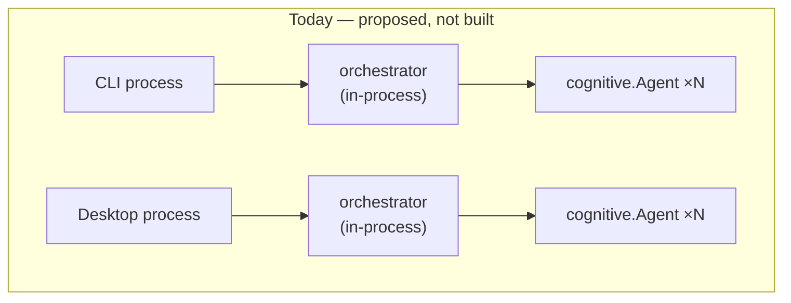

# Aetox — The Decision Log (§10–§84)

> Moved verbatim from [ARCHITECTURE.md](../ARCHITECTURE.md) on 2026-08-05 to keep the hub readable. **The section numbers are permanent addresses** — code comments cite "ARCHITECTURE.md §NN" in hundreds of places, so nothing here is ever renumbered, shipped sections are never edited (append an amendment instead), and new decisions continue the numbering at the bottom of this file, each also getting its one-line row in the hub's index.
>
> The hub ([ARCHITECTURE.md](../ARCHITECTURE.md)) keeps the system maps and the index; the product picture is [COMPANY.md](../COMPANY.md). Internal "§NN" references throughout resolve within this file.

## 10. Decision — Agent Orchestrator Layer (Proposed, approved 2026-07-21)

Discussed with the project owner: CLI, Desktop, and future UI front ends currently each embed the engine as a Go library in their own process (§2, §4) — there is no gateway process and no shared live agent/session state across front ends. The owner asked whether a background layer for multi-agent orchestration should exist, and whether front ends should share one running agent.

**Decision:** keep the embedded-library model (no new standalone gateway process — rejected as premature; no front end today needs to observe another front end's live session). Add a new orchestrator responsible for multi-agent lifecycle, built so it can be wrapped by local RPC later without a rewrite if that need becomes concrete.



- **What it is:** a new package, [internal/orchestrator/orchestrator.go](../internal/orchestrator/orchestrator.go) (moves to `engine/orchestrator` once the module split migrates), that spawns/tracks/stops multiple `cognitive.Agent` instances per process via `Spawn`/`Get`/`Stop`/`List`, replacing the current one-`Agent`-per-front-end model. Distinct from `internal/app` (§6.1), which wires exactly one agent today. Not yet wired into `cmd/aetox` or `desktop/app.go` — those still construct a single `cognitive.Agent` directly via `bootstrapFromConfig`.
- **Interface constraint (the point of the decision):** operates on agent **IDs and a serializable `Info` snapshot** (`ID`, `Model`, `CreatedAt`), not Go closures or channels owned by a specific front end — so a future local-RPC wrapper (front end as thin client, Desktop or a dedicated process as host) can sit on top without redesigning the orchestrator itself.
- **Explicitly deferred, not built:** any IPC/RPC transport, any "Desktop as host for CLI" wiring, any shared-state protocol, and wiring into the existing front ends. Build only when a front end has a concrete requirement to observe or drive another front end's session, or to run more than one agent concurrently.
- **Status:** `Direct` (package exists, `go test ./internal/orchestrator/...` passes) but **unused** — no caller yet. Not to be confused with existing `internal/cognitive.Agent` (single-agent, already built and wired) or the roadmap "MAIN + sub-agent" description in `AETOX.md`, which this scaffolds toward but does not yet implement (no sub-agent spawning logic, no profile/tool-filtering, no MAIN-vs-sub-agent role distinction).

**Naming — settled, don't rename without checking this first:**

| Rejected name | Why it was rejected |
|---|---|
| `gateway` | Implies a network/process boundary (something external connects *into*) — there is none yet (§10 decision explicitly defers IPC/RPC). If a local-RPC layer is ever built in front of this package, `gateway` belongs to *that* layer, not to the in-process tracker. |
| `router` | Already claimed in `README.md`'s architecture diagram — "Multi-Provider Orchestration: **Router** \| Comparator \| Consensus" means routing a request to which *provider/model*, an unrelated concept. Reusing it for agent lifecycle tracking would collide with that already-planned component. |

`orchestrator` was kept because (a) it doesn't collide with any name already used in `README.md`/`AETOX.md`, and (b) `AETOX.md`'s own "Multi-Agent Layer" description ("MAIN → spawn sub-agent") already implies exactly this responsibility — lifecycle, not routing or transport.

---

## 11. Decision — Prompt/Context Layer (Proposed, being settled section-by-section, 2026-07-22)

Discussed with the project owner, who asked whether it is time to build the layer that manages system prompts and per-project context files (`AETOX.md`), and requested the design be settled here in ARCHITECTURE.md piece-by-piece rather than approved wholesale. Findings that motivated it (all `Direct`):

- The system prompt is a hardcoded string duplicated in **three places**: `cmd/aetox/main.go:buildSystemPrompt`, `desktop/app.go:buildSystemPrompt` (95% identical, one sentence differs), and a fallback in `internal/cognitive/agent.go:NewAgent`.
- **The desktop `GovernanceLoaded` badge lies.** `desktop/app.go:projectStatus` only `os.Stat`s `Aetox.md` — no code anywhere reads its contents into the prompt. A user who writes rules in `Aetox.md` sees "loaded ✓" while the model never sees a byte of it. The CLI ignores the file entirely.
- There is no user-level (cross-project) instruction file at all.
- Adjacent parts that are **fine and out of scope**: model management (`config.ModelPreference`, already centralized, CLI/desktop share one preference file) and conversation memory/truncation (`internal/memory.Context`).

**Where it sits:** one new engine-side package, `internal/prompt` (moves to `engine/prompt` when the §4 module split migrates). Both front ends call it from their existing bootstrap paths (`cmd/aetox/main.go`, `desktop/app.go:bootstrapFromConfig`), deleting both `buildSystemPrompt` copies. In the 5-layer reader's map this feeds layer 2 (what the model sees) but is a leaf package — no new dependencies, no new process, no front-end code beyond the call site.

**Assembly order (settled 2026-07-22):** four layers concatenated, most-specific last, because models weight later context higher on conflict — so project rules beat personal rules:

| # | Layer | Source | Notes |
|---|---|---|---|
| 1 | Identity | hardcoded in Go, `surface` param (`"cli"`/`"desktop"`) | the only per-surface difference today is one sentence |
| 2 | Environment | sandbox root (+ existing don't-leak-path rule) | |
| 3 | User global | every `*.md` file in `<UserConfigDir>/aetox/identity/` | new capability; cross-project personal rules — a directory, not one file, see 2026-07-23 addendum below |
| 4 | Project | `<root>/AETOX.md`, fallback `<root>/AGENTS.md` | wins on conflict |

Missing files are skipped silently; per-file size cap (~16KB) to keep the prompt bounded. Content format is free markdown — no schema, the model reads it as-is.

**Project file naming (settled 2026-07-22):** `AETOX.md` uppercase — matches this repo's own root file. Falls back to `AGENTS.md` because the ecosystem is converging on it (OpenCode, Codex, Gemini CLI), so any repo that already has one works with Aetox without creating a new file. The desktop badge should switch from stat-ing the file to reporting what the prompt layer actually loaded, making it honest.

**Reload timing (settled 2026-07-22, owner: "ตอนรีสตาร์ท หรือตอนเริ่ม ... หลายๆที่ทำก็แบบนั้น"):** **Option A, bootstrap-only.** The file is read where the agent is created — app start, project switch, model/provider switch. Editing `AETOX.md` mid-session has no effect until one of those happens. Matches convention elsewhere; zero new mechanism (no context-reset seam, no per-turn stat cost). An upgrade path to per-turn mtime-checking (previously sketched as "Option B") is still possible later without an API change, if it's ever needed — not built now (YAGNI).

**Explicitly deferred, not part of this layer:** per-turn dynamic context (git status / open files injected every turn, OpenCode-style), and sub-agent profile files (`.aetox/agents/*.md`) — the latter waits until the orchestrator (§10) has a real caller; per the source-reading note on agents, a profile is just model override + prompt override + permission ruleset (+ `steps`), so it can be layered on top of this package later without redesign.

**Related cleanup (done 2026-07-22):** the tool loop is now unbounded engine-wide (OpenCode-style; brakes = approval layer + ctx cancel — CLI Ctrl+C, desktop Stop button → `App.CancelTurn`). The CLI's leftover `defaultAgentMaxToolCalls = 16` was removed — it was only applied at startup and silently lost on `/model` switch anyway. Details: `docs/architecture/model-control-layer-2026-07-22.md` §3.

**Status:** `Approved & done 2026-07-22.` [internal/prompt](../internal/prompt/README.md) built and wired into both front ends: both copies of `buildSystemPrompt` (`cmd/aetox/main.go`, `desktop/app.go`) deleted, both now call `prompt.Build`/`prompt.BuildWithReport`. `desktop/app.go`'s `projectStatus` no longer stats a hardcoded `Aetox.md` — it calls `prompt.ProjectContextFile`, so the `GovernanceLoaded` badge now reports the same file the prompt layer actually loaded (the "badge lies" gap this section opened with is closed). New: `config.UserGlobalContextPath()` (same `<UserConfigDir>/aetox/*` pattern as `PreferencePath`/`PermissionsPath`). Tests: `internal/prompt/prompt_test.go` (layering, fallback priority, size cap). **Incidental fix while wiring the CLI call site:** the CLI's leftover `defaultAgentMaxToolCalls = 16` (only applied at startup, silently lost on `/model` switch) was removed in the same pass as the "related cleanup" note above — see `docs/architecture/model-control-layer-2026-07-22.md` §3.

**Addendum 2026-07-23 — user global layer became a directory, not one file (owner: "ตัวตน เอไอ หมายถึง พวกไฟล์ root ที่ติดตัว เอไอ ไปตลอดอ่ะ ไฟล์ context.md ไฟล์ สกิล ไฟล์ พวกนี้อ่ะ").** The single `AETOX.md` blob from row 3 above didn't match the owner's mental model — they picture the "AI Identity" layer as a small set of always-attached root files (`context.md`, a skills note, etc.), not one text box. Changed: `config.IdentityDir()` (`<UserConfigDir>/aetox/identity/`) replaces `UserGlobalContextPath` as the layer 3 source; `prompt.BuildWithReport` now folds in every `*.md` file found there (sorted by filename, same per-file 16KB cap), each as its own `Personal instructions — <name>` block, most-specific-last ordering unaffected since this whole layer still sits before the project layer. `Loaded.UserGlobalPath` (single string) became `Loaded.UserGlobalPaths` (`[]string`) — not consumed by any caller outside `internal/prompt` yet, so this was a safe rename. `desktop/app.go` gained `ListIdentityFiles`/`ReadIdentityFile`/`SaveIdentityFile`/`DeleteIdentityFile` (replacing the short-lived single-file `ReadGlobalInstructions`/`SaveGlobalInstructions` pair from the same day), with a one-time migration: the old `AETOX.md` at `DataRoot` is moved into `identity/context.md` the first time the identity directory is touched. `UserGlobalContextPath` itself is kept only as that migration's source path, not for new code. Desktop sidebar's "ตัวตน AI" section is now a small file list (open/create/delete) over a single-file editor — see `desktop/frontend/src/lib/identity.svelte.ts`.

**Addendum 2026-07-24 — identity-layer conventions (settled in discussion with owner):**

- **Suggested identity files (convention, not schema):** `identity.md` (who the AI is), `thinking.md` (thinking discipline), `context.md` (about the user), `skills.md` (always-on notes). Surfaced as one-click templates in the desktop sidebar (`identityTemplates` in `identity.svelte.ts`) shown for any not-yet-created name. The engine still treats every `*.md` in the identity dir identically — **zero magic filenames**; the differentiation is UI nudge only.
- **`thinking.md` is discipline, not steps — and goes to every model.** Owner initially proposed skipping it for models without native reasoning; inverted after discussion: non-reasoning models benefit *most* from prose thinking discipline (that's what CoT prompting is), while step-by-step "think like this" instructions are what provider guidance (DeepSeek R1, OpenAI o-series) warns can degrade native-reasoning models. So the template is values-style (evidence-first, don't guess, say when unsure), safe for all models. Upgrade path if a specific model measurably degrades: per-file frontmatter condition (e.g. `when: reasoning|no-reasoning`), declared in the file — never hardcoded filenames in Go.
- **Guiding rule for what goes where:** habit/style → prompt (identity file); hard prohibition → code (`internal/safety` permission layer, prose can't enforce); thinking *effort* → `think.Level` (already a real API knob via `model.ReasoningConfig`, not prose).
- **Project fallback chain extended:** `AETOX.md` → `AGENTS.md` → `CLAUDE.md` (Claude Code compat — same drop-in motivation as `AGENTS.md`, mirrors OpenCode reading Claude Code's files).
- **Agent profile files (`agents/*.md`) remain deferred** per this section's original deferral — owner confirmed they are a separate topic and will never be merged into `AETOX.md`; format to be settled when `internal/orchestrator` (§10) gets a real caller.

---

## 12. Decision — Per-Module Documentation, Hub-and-Spoke (Proposed 2026-07-22)

Owner proposal: each module owns its documentation inside its own folder (complex modules first), ARCHITECTURE.md stays the central overview/hub, and every module doc links back here (and the hub's §4 module map links out). This section is the survey of how many modules that actually means, so it can be approved with real numbers instead of "น่าจะเยอะ".

**Survey (2026-07-22, non-test LOC):** 19 modules total — 17 `internal/` packages + `desktop/` + `cmd/aetox`. Tiered by what documentation they actually warrant:

| Tier | Rule | Modules (LOC) | Action |
|---|---|---|---|
| **1 — complex, gets a `README.md` in its folder** | >1000 LOC or many files or a real subsystem | `internal/model` (3852, 10 files), `internal/skill` (3391, 18 files), `internal/turn` (3367), `desktop/` (3345 Go + Svelte frontend), `internal/app` (1440), `internal/grammar` (1032 — **single file, zero docs today**), `cmd/aetox` (1010) | **7 READMEs to write.** `desktop/README.md` exists but is Wails template boilerplate — replace, don't append. |
| **2 — medium, hub row + package doc comment** | 300–800 LOC, already covered elsewhere or too simple for a file | `internal/provider` (771), `internal/mcp` (681), `internal/config` (606), `internal/cognitive` (517 — already covered by `docs/architecture/model-control-layer-2026-07-22.md` + ADR 0002), `internal/safety` (481 — same doc), `internal/command` (298) | No new files until one grows. |
| **3 — small, doc comment at top of file only** | <300 LOC, single concern | `internal/audit` (283), `internal/memory` (194), `internal/think` (166), `internal/orchestrator` (131 — §10 covers the design), `internal/plan` (106), `internal/debuglog` (100) | Nothing to do beyond existing comments. |

**Conventions (proposed):**

- A module `README.md` answers: what this package is, its key seams (the 2–3 types/functions everything else hangs off), links to its dated deep-dive docs, and one link back to `ARCHITECTURE.md` — a map, not a novel. Aim under ~80 lines each.
- **Dated deep-dive docs stay where they are** (`docs/architecture/*-2026-*.md`, `docs/adr/`) — they are session records/history, not living module docs. Module READMEs link to them; nothing gets moved, so existing links and git history stay intact.
- The hub embeds the index: §4's module map gains a **Docs** column linking each Tier-1 README (done when the READMEs land, not before — no dead links).
- New rule going forward: a change that meaningfully alters a Tier-1 module updates that module's README in the same commit.

**Suggested write order (follows active work, not size):** `internal/app` + `cmd/aetox` + `desktop/` first (the prompt layer §11 touches exactly these three), then `internal/turn`/`internal/skill`/`internal/model`, `internal/grammar` last.

**Addendum (2026-07-22):** `internal/prompt` was added after this survey (§11). By LOC alone (~110 lines) it would be Tier 3 (doc comment only), but it got a README anyway — a new module that implements an approved Decision section earns one regardless of size, so the design doesn't only live in ARCHITECTURE.md. Tier boundaries above are for *existing, undocumented* modules; a freshly-built module tied to a Decision section is a standing exception, not a tier-4.

**Status:** `Approved & done 2026-07-22.` All 7 Tier-1 READMEs written ([internal/app](../internal/app/README.md), [cmd/aetox](../cmd/aetox/README.md), [internal/turn](../internal/turn/README.md), [internal/skill](../internal/skill/README.md), [internal/model](../internal/model/README.md), [internal/grammar](../internal/grammar/README.md), [desktop](../desktop/README.md) — boilerplate replaced); §4 map carries the Docs column; the update-docs-with-changes rule is recorded in §9. The 5-layer reader's map stays as the top-level reading aid — module READMEs are the finer breakdown beneath it.

---

## 13. Decision — RTK Integration (Proposed, being settled section-by-section, 2026-07-22)

Owner asked to integrate `rtk` (Rust Token Killer — the owner's own CLI output-filtering tool, already used as a Claude Code hook) into Aetox itself. This section also closes a documentation gap the owner flagged in the same conversation: the model-call path (what exactly gets sent to/from the provider each turn) was explained in chat but never written down — closing it here because RTK's insertion point *is* that exact seam.

### 13.1 The call path this plugs into (closes the doc gap)

**Moved to its permanent home:** [docs/architecture/model-control-layer-2026-07-22.md §6](../docs/architecture/model-control-layer-2026-07-22.md) ("The exact call path — what a 'call' to the provider actually contains") — full diagram, `model.Request` field breakdown, and why `memory.Context.enforceLimits` is the only *other* token-budget mechanism. §7 of that same doc explains, with evidence, why the RTK hook is **not** inside `Agent.buildRequest` (a question re-raised and settled in this same 2026-07-22 session): by the time `buildRequest` runs, tool output is already a flat, un-typed message string — the tool name/args needed to pick an `rtk pipe -f <filter>` only exist earlier, at `modelToolReceipt`. A second hook at `buildRequest` would be redundant (re-filtering already-filtered text) and risk corrupting already-correct content by guessing wrong.

### 13.2 What RTK is (evidence from direct inspection, not the owner's description alone)

- Installed at `~/.cargo/bin/rtk`, v0.34.3 — a real, already-installed Rust binary, not vendored into this repo. `Direct`.
- Its own description: "a high-performance CLI proxy designed to filter and summarize system outputs before they reach your LLM context." Subcommands overlap directly with existing Aetox skills: `rtk git {status,diff,log,show}` ↔ `internal/skill/git.go`, `rtk grep` ↔ a grep-style tool, `rtk read --level {minimal,aggressive}` ↔ `internal/skill/read.go`, `rtk ls`/`rtk tree`/`rtk find` ↔ `internal/skill/list.go`/`fs.go`.
- Demonstrated on this repo (`Direct`, ran live): `rtk git status` on a clean tree returned `clean — nothing to commit` (one line) instead of porcelain output.
- Demonstrated risk (`Direct`, ran live): `rtk read internal/prompt/prompt.go --level minimal` **silently dropped every doc comment**, including the package comment and the one on `type Surface`. For a tool whose output the agent might use to *edit* a file afterward, or whose commentary explains a non-obvious constraint, this is a correctness risk, not just a cosmetic change.
- Today has no library/API mode found in `--help` output — integration means shelling out to the `rtk` binary per call, same as Aetox's skills already shell out to `git`/native commands.
- No hook currently installed for this machine's `rtk` (`rtk config` reports "No hook installed"); Aetox integrating it would be independent of whatever Claude Code hook setup exists on this machine.

### 13.3 Corrected design — the actual hook point (found only after tracing the real data path)

The owner's own framing ("สอดตอนที่ระบบสร้าง call ก่อนส่งให้ provider" — insert where the system builds the call, before sending to the provider) pointed at `internal/cognitive/agent.go`'s tool-loop as the first guess. Tracing the actual data (`Direct`, not assumed) showed that's the wrong seam: by the time `cognitive.Agent.RespondWithTools` has a tool's output, it's *already* the JSON-wrapped receipt string from `turn.executeToolCallWithOutcome` → `modelToolReceipt` (`internal/turn/executor.go:661`), which bundles `{"tool", "status", "output", "stderr", ...}`. Piping a JSON envelope through `rtk pipe -f git-status` would just fail to parse. **The real seam is one line earlier, inside `modelToolReceipt` itself** — where `result := output.RawOutput` is still a plain string, before it's wrapped into JSON and before the existing secret-redaction pass (`sanitizeAndTrimOutput`, `internal/turn/result.go:158` — redacts api key/token/password patterns, enforces `summaryLimit`).

Also discovered live (`rtk pipe -f <bogus-name>` lists its own valid filters in the error): `rtk pipe -f <filter>` needs a **named, format-aware filter** — `cargo-test, pytest, go-test, go-build, tsc, vitest, grep, rg, find, fd, git-log, git-diff, git-status, log, mypy, ruff-check, ruff-format, prettier` — it is not a blind text compactor. This confirms the §13.4 read.go concern independently: there is no filter name for "arbitrary file content," so file reads were never a fit for this mechanism at all (they'd need the separate `rtk read --level` mechanism, not attempted here).

### 13.4 Settled design

- **Hook location:** `internal/turn/executor.go:modelToolReceipt`, immediately after `result` is computed from `output.RawOutput`/`output.Content`, **before** `sanitizeAndTrimOutput` — so RTK sees genuine unredacted command output (needed to match its filter formats) but the existing secret-redaction/length-cap safety net still runs unconditionally afterward on whatever comes out, RTK-filtered or not.
- **New package:** [internal/rtk](../internal/rtk/README.md) — `Available()` (cached `exec.LookPath` check), `FilterForTool(name, args)` (tool → filter-name mapping), `Filter(filter, content)` (runs `rtk pipe -f <filter>`, 5s timeout, any failure returns the original content untouched).
- **Optional, never required.** No installer bundling (unlike tesseract's precedent in `docs/architecture/tesseract-ocr-bundling-2026-07-22.md`) — a token-cost optimization doesn't earn download-on-first-use the way an OCR capability did.
- **Approval untouched.** `safety.AssessCommand`/`turn.resolveApproval` see the real command (`git status`) always — RTK only touches the result string, after execution, never what's presented for approval.
- **v1 scope, decided from evidence rather than re-asked:** `git` (status→`git-status`, diff/show→`git-diff`, log→`git-log`) and `shell`. `read.go` excluded (§13.3's mechanism mismatch, plus the demonstrated comment-stripping risk). Every other tool (`write`/`delete`/`list`/`fs`/`echo`/`time`/`help`/`input`/`output`/`github_repo_summary`/`plugin_install`/`image_ocr`) has no mapping and passes through exactly as before.
- **Failure behavior:** any error (missing binary, unknown filter, subprocess failure, empty output) falls back to the original content silently — never surfaced as a tool error, since RTK is strictly an optimization layer, not a capability.

**Status:** `Approved & done 2026-07-22`, refined `2026-07-23` (below). Full repo `go build`/`go vet`/`go test ./...` green throughout. List/fs and a wider filter set are natural v2 candidates once v1 usage confirms real savings — not built now (YAGNI).

### 13.5 Refinement (2026-07-23) — `shell` switched from a guessed prefix-list to `Rewrite`, matching rtk's own OpenCode plugin

Owner's own instruction: check how OpenCode's actual RTK integration is configured before expanding ours, and "เอาแค่คำสั่งที่จำเป็น...อย่ายัดทุกอย่างเข้า" (take only what's necessary, don't stuff everything in). Ran `rtk init -g --opencode --dry-run -v` (`Direct`, live) — it previews the exact plugin rtk would install for OpenCode:

```ts
export const RtkOpenCodePlugin: Plugin = async ({ $ }) => {
  // ...checks `which rtk`...
  return {
    "tool.execute.before": async (input, output) => {
      // ...only for tool === "bash"/"shell"...
      const result = await $`rtk rewrite ${command}`.quiet().nothrow()
      // ...substitutes args.command with the rewritten result if different...
    },
  }
}
```

The real plugin is a **single hook, single delegated call** (`rtk rewrite`) — no hand-maintained command-to-filter table at all. Aetox's v1 `shell` case (a hardcoded `strings.Contains`/`HasPrefix` guess-list: `go test`, `go build`, `grep`, `rg`, `find`, `fd`) was strictly inferior: incomplete (misses anything not on the list, e.g. `cat`→`rtk read`, confirmed live), and would silently drift out of date as rtk's own registry grows.

**Change made:** `shell.go` now calls `rtk.Rewrite(commandLine)` directly (after approval, before `exec.Command`) — if rtk has an equivalent, Aetox runs *that* instead of the original command line; same underlying side effects (rtk actually runs the real command), just captured pre-compacted. `FilterForTool`'s `shell` case was deleted entirely (dead code once `Rewrite` covers it — keeping both would have double-processed shell output). `git` was deliberately **left unchanged** — it already parses its exact subcommand (`internal/skill/git.go`'s `allowedGitReadActions`), so reconstructing a command string just to ask `Rewrite` would be strictly more roundabout than the existing direct name→filter mapping; not "everything," only where it actually simplifies something.

**Bug found and fixed during this change:** `rtk rewrite`'s own `--help` claims "exits 0 and prints the rewritten command if supported" — a live check showed a *successful* rewrite (`git status` → `rtk git status`) exiting **3**, not 0. `internal/rtk.Rewrite` originally used `exec.Cmd.Output()` (which errors on any non-zero exit, discarding stdout) and so treated every successful call as a failure. Fixed by capturing stdout unconditionally and judging success by content, not exit code — same resilient pattern `Filter` already used correctly. Caught by `TestRewriteRealBinary`, a live integration test against the real installed binary (same pattern as `TestFilterRealBinary`) — this is exactly the kind of gap a mocked test would have missed.

Updated: [internal/rtk/README.md](../internal/rtk/README.md) (seam table split by which mechanism each tool uses and why), `rtk_test.go` (shell prefix-list tests replaced with `Rewrite` tests, including the live one that caught the exit-code bug). No change needed to `internal/turn/executor.go` beyond what §13.4 already describes — `FilterForTool` shrinking to git-only doesn't change its call site.

**Test coverage gap closed (2026-07-23):** `internal/rtk`'s own 9 tests cover the package's logic in isolation, but neither integration seam had a direct test — added two: `internal/turn/rtk_hook_test.go` (`modelToolReceipt` calling into `rtk.FilterForTool`/`Filter` for real, plus a regression check that an unmapped tool like `read` passes through byte-for-byte unfiltered) and a new case in `internal/skill/shell_test.go` (`shellSkill.Execute` actually substitutes the rtk-rewritten command — asserted by the *output shape* difference: rtk's compact `git status` reads `clean — nothing to commit`, plain git's doesn't, so passing proves substitution happened, not just that `Rewrite()` works standalone — and confirms the recorded `Command` field stays the original, never the rtk one). All three tests skip gracefully when `rtk` isn't installed, same pattern as `internal/rtk`'s own live tests. Full repo `go build`/`go vet`/`go test ./...` green.

### 13.6 Runtime auto-install (2026-07-23) — RTK downloads itself once if missing, no installer changes

Owner's direction: Aetox is meant to become a program other people download and run, so should `rtk` be part of the installer? Asked, then explicitly chose **runtime fallback instead of touching the NSIS installer** — see the three options put to the owner (installer bundling / runtime fallback / defer) and the choice made.

**Evidence gathered before building anything (`Direct`, all live):**
- `rtk` on this machine was installed via `cargo install --git https://github.com/rtk-ai/rtk` — a real, specific, identifiable public repo, not the owner's private/undisclosed tool.
- `gh api repos/rtk-ai/rtk` confirms: public, **72,590 stars**, license **Apache 2.0**, not archived — permissively redistributable, no licensing blocker for bundling or auto-downloading it.
- Its latest release (`v0.43.0`) publishes a portable, checksummed asset per platform: `rtk-x86_64-pc-windows-msvc.zip`, `rtk-{x86_64,aarch64}-apple-darwin.tar.gz`, `rtk-x86_64-unknown-linux-musl.tar.gz`, `rtk-aarch64-unknown-linux-gnu.tar.gz` — each with a `sha256:` digest **published directly in the GitHub release API response** (no separately-computed/pinned hash needed, unlike the Tesseract installer's case where the digest field was `null`).
- Downloaded and inspected both archive shapes directly: the Windows zip contains a single bare `rtk.exe` at its root (no subfolder); the Linux tar.gz contains a single bare `rtk` file, already executable. Both confirmed by actually unzipping/untarring them, not assumed from convention.

**Design, mirroring the Tesseract precedent's judgment (`docs/architecture/tesseract-ocr-bundling-2026-07-22.md` §3 — macOS's Homebrew auto-install, "no elevation needed, so one automatic attempt is safe") but applicable on every OS here** since rtk ships a portable archive with no installer wizard to script around, unlike Tesseract's Windows story which needed a real install-time hook:

- New file [internal/rtk/install.go](../internal/rtk/install.go): `resolve()` (package-private, `sync.Once`-cached) tries, in order: (1) PATH, (2) a previously-downloaded copy at `<UserConfigDir>/aetox/bin/rtk[.exe]`, (3) one download-verify-extract attempt from the GitHub release matching `GOOS`/`GOARCH`. `Available()` now calls this instead of a bare `exec.LookPath`; `Rewrite`/`Filter` invoke the resolved path instead of a literal `"rtk"` string, so a downloaded-but-not-on-PATH binary actually gets used.
- Any failure at any step (offline, unsupported OS/arch, checksum mismatch, GitHub rate-limited) leaves `Available()` returning `false` — identical fallback behavior to rtk never having been installed at all. This is strictly additive to §13's original "optional, never required" principle, not a change to it.
- **Explicitly not done:** no change to `project.nsi`/the NSIS installer. This is the owner's deliberate scope boundary for this round — an install-time mechanism remains a live option later if the runtime fallback proves insufficient (e.g. if GitHub API rate-limiting or offline-install scenarios turn out to matter in practice), same "revisit later if needed" posture the Tesseract doc already takes for macOS/Linux packaging.

**Testing:** `internal/rtk/install_test.go` — fast, deterministic, no-network tests for the pure logic (`assetNameFor` across all 5 supported platforms + one unsupported, `parseSha256Digest`, zip/tar.gz extraction against synthetic in-memory archives) plus light real-network checks against the actual GitHub API using the small `checksums.txt` asset (838 bytes) rather than the multi-MB platform binaries, so the routine `go test ./...` sweep stays fast and skips cleanly if offline. One additional test, `TestTryAutoInstallEndToEnd`, actually downloads the full real binary, extracts it, and runs `--version` to confirm the pieces compose correctly end to end — gated behind `AETOX_TEST_RTK_E2E=1` (skipped by default) since a full multi-MB download on every test run would be disproportionate; run manually once during this work and confirmed passing.

**Status:** `Approved & done 2026-07-23.` Full repo `go build`/`go vet`/`go test ./...` green (including the gated end-to-end check, run manually and passing).

---

## 14. Decision — Unified Data Root (2026-07-23) — cleaning up where Aetox writes its own data

Owner, continuing straight from §13.6: "ทำระบบของเราให้คลีนเลยไม่ไปสร้างเครสมั่วๆ อีกได้ไหมครับ... ข้อมูลใน WebView เราจะฝังในระบบของเราเลยดีสุดปลอดภัยสุดครับ" — make the system clean, stop scattering files, and WebView2 data specifically should be embedded in Aetox's own design rather than left to an external library's default. Also raised as a general principle: things Aetox designs itself and doesn't need to share with other tools should live inside Aetox's own structure, not wherever an OS/library convention happens to put them.

### 14.1 Evidence — re-surveyed every OS-directory resolution point (`Direct`, re-grepped after §13's rtk work)

| Location found | Consistent with the others? |
|---|---|
| `internal/config`'s 5 path functions (preferences, permissions, MCP servers, `.env`, `AETOX.md`) | ✅ all `<UserConfigDir>/aetox/*`, but each one duplicated the same 6-line OS-fallback block inline |
| `desktop/db.go` (session SQLite) | ✅ same folder, but its own separate copy of the same fallback logic |
| `internal/rtk/install.go` (downloaded `rtk` binary, built in §13.6) | ✅ already correct, reused `UserGlobalContextPath`'s directory |
| `internal/audit/audit.go` (shell command audit log) | ❌ used `os.UserHomeDir()` + `.aetox` — a **second, different "Aetox home"** (`~/.aetox`) that had nothing to do with the `%AppData%\aetox` folder everything else uses. Flagged in an earlier session pass, left pending owner approval — approved and fixed in this pass. |
| `desktop/main.go`/`browser.go` (WebView2 profiles) | ❌ left empty by default → Wails/go-webview2's own silent convention (`%AppData%\<exe-name>`), which is *why* `aetox-desktop.exe`, `aetox-desktop-dev.exe`, and `aetox-browser` were three unrelated folder names for what's conceptually one thing — not a location Aetox itself ever decided on |
| `internal/skill/discovery.go` + `github_tools.go` (`~/.agents/skills`, `~/.claude/skills`) | **Deliberately not unified** — see §14.3 |

### 14.2 Design — one function, everything else derives from it

`config.DataRoot()` (new, `internal/config/config.go`): resolves an `AETOX_DATA_ROOT` env var override first, else `<UserConfigDir>/aetox` (the production default, unchanged). Every one of the ✅ and ❌ rows above except the intentional exception now calls this one function instead of repeating the OS-fallback dance or inventing its own convention:

- `PreferencePath`/`PermissionsPath`/`MCPServersPath`/`EnvFilePath`/`UserGlobalContextPath` — refactored onto `DataRoot()`, deleting 5 copies of identical fallback logic (`LegacyPreferencePath` deliberately left untouched — it represents a fixed historical location for one-time migration, not a place to redirect).
- `desktop/db.go` — same, keeping its existing `dbDir` test-seam override (a *different*, test-only mechanism from `AETOX_DATA_ROOT`, both still work together).
- `internal/rtk/install.go`'s `privateBinaryPath` — simplified to call `DataRoot()` directly instead of borrowing another function's directory.
- `internal/audit/audit.go` — **fixed**: `ShellAuditLogPath` now uses `DataRoot()`, closing the `~/.aetox` vs `%AppData%\aetox` inconsistency flagged earlier.
- `desktop/main.go`'s `webviewUserDataDir` — **now always** returns `<DataRoot()>/webview/<name>`, explicitly, every time (empty return is only a last-resort fallback if `DataRoot()` itself errors) — never Wails'/go-webview2's silent exe-name-based default again, for dev *or* production. `browser.go` already called this same helper, so it picked up the fix automatically.
- `desktop/wails-dev.bat` — the dev-only override env var is renamed from the narrower `AETOX_WEBVIEW_DATA_DIR` (introduced in §13's disk-cleanup pass, webview-only) to the general `AETOX_DATA_ROOT`, now covering *all* of Aetox's data during dev, not just WebView2. `desktop/.gitignore`'s `.webview2-data` entry renamed to `.aetox-data` to match.

This reconciles the two asks that were briefly in tension: "keep dev data off C:" (§13, still true — `wails-dev.bat` still redirects everything to a project-local folder) and "WebView data should be embedded in our own design" (this section — the *shape* of where it lives is now something Aetox explicitly decides, `<DataRoot>/webview/*`, not a location any external library chose for it; the drive it happens to sit on during dev is a separate, already-solved concern).

### 14.3 Explicit exception — skill discovery/`plugin_install` stay pointed at shared, external locations

`~/.agents/skills` and `~/.claude/skills` (`internal/skill/discovery.go`) are deliberately **not** brought under `DataRoot()`. These are ecosystem-wide conventions — the same paths OpenCode and Claude Code use — and the entire value of scanning them is that *other tools'* skills/plugins get auto-discovered, and anything `plugin_install` writes into `~/.agents/skills` becomes visible to those other tools too. "Don't share what doesn't need to be shared" (the owner's own stated principle) cuts the other way here: this is a location that specifically *needs* to stay shared to keep working. Unifying it under Aetox's own private folder would quietly break interop for no benefit.

### 14.4 Test-isolation bug found and fixed along the way

`internal/audit/audit_test.go` isolated itself by overriding `HOME`/`USERPROFILE` — which redirected the *old* `os.UserHomeDir()`-based path, but `DataRoot()` resolves via `os.UserConfigDir()` (`%AppData%` on Windows), which those env vars don't affect. Running the suite after the refactor made this obvious immediately: tests started reading/writing the real `%AppData%\aetox\shell-audit.log` on this machine, accumulating real entries across runs (`want 2 got 5`-style failures). Fixed by isolating via `AETOX_DATA_ROOT` instead — dogfooding the same override mechanism `wails-dev.bat` uses, rather than the audit package inventing its own isolation trick.

Also found while fixing it: `internal/skill/shell_test.go`'s tests call `shellSkill.Execute`, which unconditionally calls `audit.WriteShell` — and had **never** isolated the audit log at all, on any prior session. Every `go test ./...` run before this fix was silently appending real entries to the real, machine-wide audit log. Fixed the same way (`isolateAuditLog` helper, `AETOX_DATA_ROOT`). The real log file this had already polluted was deleted by hand as part of this cleanup.

### 14.5 Deferred, not designed now — easier installation (npm or otherwise)

Owner mentioned wanting Aetox installable via `npm` or similar "someday," explicitly framed as a future direction, not a current ask. Noted here so it isn't lost, not designed: Aetox is a Go+Wails binary, not a Node package, so "npm install" would mean a thin wrapper package (the pattern several Go/Rust CLI tools use — an npm package whose `postinstall` fetches the real platform binary, similar in spirit to how `internal/rtk/install.go` already fetches `rtk`'s binary). Revisit when actual distribution work starts; not blocking anything today.

**Status:** `Approved & done 2026-07-23.` Full repo `go build`/`go vet`/`go test ./...` green.

---

## 15. Decision — Coding Loop Tools: `edit` + `grep` (2026-07-23)

Owner brought external feedback proposing three workstreams (browser mastery, total tool command, full coding capability). Checked against the actual code before building anything:

### 15.1 Evidence — most of the feedback was already built or already decided

| Proposed | Reality |
|---|---|
| "Tool chaining" | Already exists — `cognitive.Agent.RespondWithTools` is the model-driven multi-tool loop (§10/§3 of the model-control doc). |
| "Self-healing execution" | Not a feature — `turn.modelToolReceipt` already returns `stderr`/`success` to the model; retrying is the model reading the receipt. No code needed. |
| "Max-retry guard against infinite loops" | Already decided — `AgentConfig.MaxToolCalls` is an opt-in cap; the deliberate default is unbounded with permission gate + ctx cancel as the brakes (comment at `cognitive/agent.go:71`). Not re-litigated. |
| "Coding loop: Explore→Read→Edit→Verify" | Read (`read`), Verify (`shell`) existed. **Explore and Edit were the real gaps** — no content search, and `write` (whole-file overwrite) was the only mutation tool. |
| "Browser control" | Skeleton already exists (`desktop/workbench.go` `browser_open/read/click/type`, `SourceExternal`). Deeper design deferred until the coding loop is proven. |

### 15.2 Design — two new built-ins, nothing else

- **`edit`** (`internal/skill/edit.go`) — exact search & replace: model sends `path`/`find`/`replace`; Go verifies `find` matches **exactly once** (0 → "not found, re-read the file"; >1 → "add surrounding lines"), then replaces. **Rejected the feedback's suggestion of LLM-generated unified diffs + `go-diff`**: models drift on line numbers, and uniqueness-checked literal replace is both safer and dependency-free (`strings.Count` + `strings.Replace`). `ExecuteTool` deliberately bypasses `stringSlice` (it trims/drops empties, which corrupts whitespace-significant match strings). Classified `RiskHigh`/`EffectWriteWorkspace` in `safety.go` — critical because *unknown* skill names default to `RiskLow`/no-effects there, which would have made `edit` an unprompted file writer.
- **`grep`** (`internal/skill/grep.go`) — stdlib `regexp` + `filepath.WalkDir` content search returning `path:line:text`, capped (200 results, 1 MB/file, skips dot-dirs and binaries). **Rejected shelling out to ripgrep**: not guaranteed installed, and the stdlib walk is ~100 lines with no dependency. `RiskLow`/`EffectReadWorkspace`.

Both registered in `defaults.go`, path-arg extraction added to `turn.toolCallToArgs` so permission patterns (`{Tool: "edit", Pattern: "docs/*"}`) can match. Tests follow the existing per-skill pattern; the full suite also caught that `stringSlice` trimming issue before it shipped.

**Status:** `Done 2026-07-23.` `go build`/`go test ./...` green. Next in this thread when owner resumes it: browser-control design (§15.1 last row) as its own Decision section.

---

## 16. Decision — Dead-Code Sweep (2026-07-23)

Ran `golang.org/x/tools/cmd/deadcode ./...` (trustworthy here: Wails-bound desktop methods register as reachable). 47 findings, triaged three ways:

**Deleted (~430 lines):** CLI-era and module-split leftovers — `model/provider_catalog.go` 4 delegate funcs (note the trap: dead `ModelChoicesWithEndpointAndAPIKEY` vs live `...APIKey`), `DefaultThinkingLevel` + `BuildCapabilityCatalog`/`ModelCapability`, `provider.CapabilitiesFor`/`EnvKeys`, duplicated `SlashMetaLegend`/`SlashSuggestions` in both `command` and `grammar` (+ `grammar.New`), `turn/infer.go`'s regex-inference helpers superseded by the model-driven loop (`inferToolFromConversation`, `parseWriteIntent`, `parseListPath`, `applyExtensionHint`, `splitIntentParts`), `turn.executeToolCall`, `app.go`'s `dispatchBySkill`/`showSkillPalette`/`printAvailableSkills`, `config.SavePermissions` (its round-trip test rewritten to cover the live `LoadPermissions` directly), `safety.ApprovalModeFromLegacy`, `debuglog.IsEnabled`/`LogDir`. Tests referencing deleted funcs removed with them; two tests that actually pinned live code were kept and repointed instead of deleted.

**Deliberately kept despite being flagged:** `internal/orchestrator` (§10's unwired layer — the future task/subagent tool) and `rtk.Available` (live test-infrastructure: skip-guard in `shell_test.go`/`rtk_hook_test.go`; deadcode doesn't count test binaries).

**Pending manual delete (session tooling can't remove files):** `internal/plan/` (whole package, zero callers), `internal/model/openrouter.go` + `_test.go` (duplicate of the live OpenRouter spec in `internal/provider`), `internal/turn/record.go` (aspirational audit-record type, never constructed anywhere).

**Status:** `Done 2026-07-23` except the four files above. `go build`/`go vet`/`go test ./...` green; `deadcode` re-run clean apart from the kept/pending items.

---

## 17. Decision — Kill the Regex Intent Layer (Proposed 2026-07-23)

**Trigger (real failure, 2026-07-23):** user asked `ornith:9b` "คุณทำอะไรได้อีก เอาเนื้อหาในเว็บมา ทำเป็นไฟล์ html ให้ผมได้ไหม". Phase 1's regex (`internal/turn/infer.go`, `reWriteIntent`) matched the bare verb "ทำ", hijacked the turn into a direct `write` with a garbage path, and the model never saw the message. The per-regex patch shipped that day treats one symptom; the architecture invites the next one.

**The debt, mapped (audit 2026-07-23):** `turn.Executor.Execute` runs *four* phases, three of which second-guess the model with NL keyword regexes:
- Phase 1 (`executor.go:178`, `shouldExecuteInferredBeforeAgent` :255): regex candidates for write/read/delete/github/plugin_install execute **before the model is ever called**.
- Phase 2 (:190): the real model-driven `RespondWithTools` loop — but if the model doesn't call a tool, or the tool fails, it **silently re-enters the regex loop** (:196-209).
- Phase 3 (:213): regex-only path for non-tool agents.
- `infer.go` is 746 lines / 22 NL regexes (Thai + English), the only NL-inference file left in the repo (§16's sweep already deleted its dead half).
- Compounding it: `ollama.SupportsToolCalling()` is hardcoded `true` (`internal/model/ollama.go:56`) — never checked against the actual model, so weak local models "pass" the Phase 2 gate, fail to tool-call, and land in the regex layer anyway.

**Reference points:** Claude Code does zero NL inference — pre-model parsing is explicit syntax only (`/slash`, `!bash`, `@file`); everything else goes to the model with tool definitions and the model decides every call. A weak model's failure mode is a plain text answer, never a hijacked tool. OpenCode is the same shape: a per-model capability catalog declares `tool_call` true/false; non-tool models simply get no tools (chat-only). Neither has a keyword layer, in any language.

**Decision:**
1. **Delete the layer.** `internal/turn/infer.go` entirely; executor Phases 1 and 3; both silent regex fallbacks inside Phase 2; `shouldExecuteInferredBeforeAgent` / `shouldUseInferredToolPath` / `executeInferredToolCandidatesLoop` / `executeInferredTool` and the inferred-path test suites (executor_test.go is 1,387 lines mostly pinning this layer). Net ≈ −2,000 lines.
2. **Pipeline becomes CC-shaped:** `grammar.Parse` (kept — explicit slash/meta/known-command tokens, the analog of CC's slash commands) → explicit `KindSkill` command → `executeSkillTurn` direct dispatch (kept — analog of `!`) → everything else: model tool loop when the provider truly supports tools, else plain streaming chat. The model's answer is final; nothing re-guesses it.
3. **Make Ollama capability honest:** replace the hardcoded `true` with a bootstrap probe of Ollama's `/api/show` capabilities list (`"tools"`, Ollama ≥ 0.4), plus a runtime backstop — on the API's "does not support tools" error, mark the session chat-only. Surface the result in `ModelInfo` so the desktop UI can show "tools unavailable for this model" instead of pretending.
4. **Accepted regression:** non-tool-capable local models lose the "สร้างไฟล์ x.txt" magic and become chat-only — same behavior as OpenCode, and honest. The fix for a weak model is a tool-capable model, not a regex.

**Status:** `Done 2026-07-23.` Owner approved same day, with one amendment to point 3: **no preemptive capability gating** — tools are served to every model normally, no size/capability prejudgment (owner's call: "ระบบเราจะเสิร์ฟให้โมเดลตามปกติ... แต่เผื่อทางไว้ก็ดี"). The `/api/show` probe was dropped; only the runtime backstop shipped — `ollama.Complete` retries a tools request as plain chat when Ollama itself answers "does not support tools" (`internal/model/ollama.go`, pinned by `TestOllamaComplete_RetriesWithoutToolsWhenModelRejectsThem`). Demolition tally: `infer.go` (−746), `record.go` (−36, §16's pending item), `executor.go` 876→620, `executor_test.go` 1387→560 — net ≈ −2,050 lines. New §17 regression pin: `TestExecute_ConversationTextNeverTriggersToolsDirectly` (the exact Thai sentence that triggered this decision). `go build`/`go test ./...` green.

---

## 18. Decision — Browser Embedding: Never Find Your Own Window by Title (2026-07-24)

**Trigger (real failure, 2026-07-24):** every browser tab rendered blank — `file://` pages AND https — surviving app restarts, with zero errors anywhere. §6.6's z-order fix was live and correct, but no tab webview process was even being created.

**Evidence (instrumented `open()`/`start()`, read from `debuglog`):** `CreateWindowExW FAILED: Access is denied.` on every tab, and the one-line diagnosis: `parent hwnd=… parentPid=1464 selfPid=9148` — `browserHost.start()` located the main window via `FindWindowW(nil, "Aetox Desktop")`, i.e. **by title**, and matched a *foreign process's* window carrying the same text (an `explorer.exe` taskbar-thumbnail host; a dev-URL browser tab titled by our own `<title>` can collide the same way). A cross-process parent makes `WS_CHILD` creation fail with `ERROR_ACCESS_DENIED` — silently, because `open()` swallowed every failure path.

**Fix applied ([desktop/browser.go](../desktop/browser.go)):**
1. `findOwnMainWindow()` — enumerate top-level windows, match by `GetWindowThreadProcessId == os.Getpid()` + visible. Title-based lookup is banned in this subsystem.
2. Every native failure path now logs to `debuglog` with tab id — the silent `return`s are what turned a one-line bug into a half-night hunt.
3. Visibility hardened while in there: `SetWindowPos(HWND_TOP)` moved into `NavigationCompletedCallback` natively (§6.6's meta-event-driven re-glue depended on page JS surviving the origin check — never true for `file://`, whose URLs have no host; `sameOrigin` now special-cases file↔file, which also restores title/URL sync for local pages).
4. Address-bar `normalizeUrl` (frontend): drive paths → `file:///`, schemes pass through — blind `https://` prefixing had produced dead `https://file:///…` URLs.

**Full write-up:** [docs/architecture/native-browser-embedding-2026-07-24.md](../docs/architecture/native-browser-embedding-2026-07-24.md) — architecture, the complete failure catalog (7 entries), and the macOS (WKWebView subview) / Linux (WebKitGTK widget) port blueprint; both platforms structurally avoid the window-parenting and z-order classes entirely. Also settles §7's open question in passing: `desktop/browser.go` has no build tag — desktop is Windows-only today by construction, and the port blueprint is the plan for changing that.

**Status:** `Done 2026-07-24.` Owner verified tabs load (file:// + web). `go build`/`go test ./desktop` green (file↔file origin cases added to `TestSameOrigin`).

---

## 19. Decision — Desktop: No-Project-Focus Default, Session-Bound Workbench, Non-Nil Binding Contract (2026-07-24)

Three same-day desktop decisions, recorded together; all owner-driven, all shipped.

### 19.1 No-project-focus is the startup default

**Trigger:** the composer chip showed "desktop" — the engine silently adopted whatever cwd it was launched from (`config.go`'s `RootPath == "" → os.Getwd()`; `wails dev` runs from `desktop/`). Owner: never bind to the launch folder; focus must be an explicit choice (Claude Desktop's เลือกโปรเจกต์ picker as the reference), and unfocused chat must keep **full tool access** — "เหมือนเปิด Claude/Codex มาคุยดื้อๆ แต่ยังรันอะไรในเครื่องเราได้."

**Design ([desktop/app.go](../desktop/app.go), [desktop/sessions.go](../desktop/sessions.go)):** `App.projectFocused` flag; startup calls `focusNone()` — engine re-roots at the user's **home dir** (tools all work, rooted neutrally), no `touchProject`, so launch cwd never pollutes recent projects. `ClearProjectFocus` binding + a focus picker on the composer chip (no-focus / recent projects / open folder). Unfocused sessions live under the home-dir `projectKey` bucket — no schema change — and `LoadSessionAnyProject` special-cases that bucket back into unfocused mode instead of erroring "project not found". `ProjectTree`/`GitChangedFiles` return empty when unfocused (never eagerly walk a home dir). `ProjectStatus.Focused` drives the UI.

**Amendment 2026-07-26 — the unfocused root is `<home>/aetox`, not the home directory.** Owner, reading the system prompt aloud: *"Current working sandbox root is: C:\Users\Gigabyte. บรรทัดนี้เหี้ยมาก … แล้ว sandbox คืออันนี้จริงๆหรอ"*. It was. Containment is "anything under the root" ([resolveSandboxPath](../internal/skill/list.go)), so unfocused the sandbox held `.ssh`, `.aws`, `.gitconfig`, `AppData` with its browser token stores, Documents — readable by `read`/`grep`/`glob` on any turn and writable with no prompt, since `focusNone` sets full-access in the same call.

What makes this a reversal rather than a correction of a mistake: **the original call was sound for the tools that existed on 2026-07-24.** What changed is the loop's shape — `web_fetch`, `web_search` and `browser_read` now sit in it, so a page can carry an instruction in and the same loop can carry an answer back out. Broad read access stops being a blast radius and becomes an exfiltration path the moment untrusted text and network egress share a loop.

- **`focusNone` roots at `<home>/aetox`** ([desktop/app.go](../desktop/app.go)), created on demand so `list .` works on a fresh install.
- **`outputSubdir` drops its `aetox/` prefix** in the same commit — it is now `output/<session>`, joined onto the new root. The absolute destination is unchanged (`<home>/aetox/output/<session>`), so **nothing on disk moved and no migration runs**: the new root is exactly the parent of the folder writes already landed in. Owner caught this one: *"อย่าลืมนะครับ เรามี aetox\output ด้วยหนา"*. The two halves are asserted together in `desktop/app_test.go` — alone, either change doubles the folder name or strands every artifact.
- **`LoadSessionAnyProject` accepts both bucket keys** ([desktop/sessions.go](../desktop/sessions.go)): the new root's, and the home dir's for every chat held before this. Dropping the old key would answer real, still-present history with "โฟลเดอร์อาจถูกย้ายหรือลบไปแล้ว".
- **Reaching outside is now a deliberate act**, and both routes already existed: open the folder as a project, or attach the file (`saveChatAttachment` copies it under the root, so it works whatever the root is). What is genuinely lost is *"ไปส่องโฟลเดอร์ Downloads ให้หน่อย"* without focusing anything first — which is the ask that should require a click.
- **Not done, deliberately:** deny-rules for `.ssh`/`.aws`/… while staying rooted at home. That is a list to maintain forever, and it fails on the first entry nobody thought of.

**Amendment 2026-08-04 — unfocused mode roams the machine again (OpenSandbox).** Owner, after watching an unfocused chat answer "หาไฟล์ PDF ในเครื่องนี้" with *ทำไม่ได้*: unfocused should mean the machine is the workspace — "มันควรไปไหนมาไหนก็ได้ในเครื่องเรา … ถอดข้อจำกัดก็พอ ผมแค่ระบุว่าเวลาสร้างไฟล์ให้สร้างในเอาท์พุต". The 07-26 wall made the mode safe by making it useless for exactly the errands it exists for.

- **`skill.RegistryOptions.OpenSandbox`** ([internal/skill/sandbox_open.go](../internal/skill/sandbox_open.go)): openness is recorded per root by `RegisterDefaults` on every registry build, and `resolveSandboxPath` — still the single wall every file tool answers through — accepts absolute and climbing paths for an open root. The desktop passes `!projectFocused` ([desktop/app.go](../desktop/app.go) `applyConfig`); a focused project and the whole CLI stay closed, unchanged.
- **The 07-26 threat gets a narrower answer instead of a wall:** a short credential-store denylist (`.ssh`, `.aws`, gh/git creds, browser profile stores, `~/.aetox` — Aetox's own keys) is refused inside `resolveSandboxPath` itself, open mode or not. The 07-26 bullet above rejected a denylist *as the only fence around a home-rooted sandbox*; here it locks the cabinets while the mode's real containment is that writes still land in `output/<session>` and a project focus restores the full wall.
- **The prompt tells the same story as the tools** ([internal/prompt/prompt.go](../internal/prompt/prompt.go) `environment(open)`): the refusal in the trigger screenshot was the *model's belief*, not the sandbox — it had been told "absolute paths are rejected" and kept saying so. Open mode says: any path works, credential stores are off-limits, bare filenames land in the output folder.
- **Accepted, eyes open:** unfocused still runs full-access, so an injected page can now order reads of anything outside the credential list without a prompt. The owner's call is that on a personal machine the errand value outweighs it; the cabinets that turn that read into a stolen key are the part that stays shut.

**Amendment 2026-08-04b — a focused project can be given more folders (ExtraRoots).** Owner: *"จริงๆผมอยากให้มันเลือกข้ามโปรเจคได้ แบบบางทีปัญหาในโปรเจคมาจากที่อื่น ให้ AI ไปตรวจสอบได้ แต่โหมดโฟกัสโปรเจคพื้นฐานก็คือทำงานในโฟลเดอร์โปรเจคที่กำหนด"* — and then the rule that shaped the design: *"สิทธิ์ควรกำหนดที่เดียว คือผ่านที่ผู้ใช้เลือก ที่เหลือไม่ต้องแอบมีเบื้องหลัง … มันจะกลายเป็นหนี้ในระบบในอนาคต สำหรับคนใช้"*.

Until this, the only way to read a second project was to unfocus — trading one folder for the whole machine to look at one directory. Claude Code answers the same need with a working directory plus `--add-dir`/`/add-dir`/`permissions.additionalDirectories`; this is that shape, minus the three places to configure it.

- **One gate, one list.** `sandboxPolicy` ([internal/skill/sandbox_open.go](../internal/skill/sandbox_open.go)) holds a root's whole reach — `open`, plus the user's `extra` folders — and `resolveSandboxPath` is still the only thing that reads it. Set by `RegisterDefaults` on every registry build, zero values included, so removing a folder narrows the session in the same reload.
- **Extra folders carry the project's rights exactly** — read and write, no prompt. A quieter second tier ("look but don't touch") would be a permission the user never agreed to and cannot see in the list, which is the debt the owner's rule is about. The list is the permission: a folder that should not be written to does not go on it.
- **Nothing else may widen it.** No folder inferred from imports, no sibling adopted because it looked related, no temporary grant. `RegistryOptions.ExtraRoots` is fed only from `project_folders` (schema v6, keyed per project), which is fed only by the picker.
- **Absolute paths stopped being refused on sight.** That was a spelling rule wearing a permission rule's clothes, and it cannot survive a second workspace folder — naming that folder in full is the only way to reach it. The gate now judges where a path lands, never how it was written; an absolute path outside the workspace is refused exactly as before ([internal/skill/sandbox_test.go](../internal/skill/sandbox_test.go)).
- **The prompt is built from the same list** ([internal/prompt](../internal/prompt) `Scope`): added folders are named in full — the one machine-specific path worth sending, because an added folder has no other name — along with the fact that they carry the project's rights. A folder the tools accept but the prompt never mentions is a capability the model will not use.
- **The credential cabinet does not answer to the list** — adding `~` does not hand over `~/.ssh`, and the picker refuses a credential-store folder outright rather than accepting it and failing file by file.
- **UI lives in the focus menu, not a settings page** ([desktop/frontend/src/lib/Chat.svelte](../desktop/frontend/src/lib/Chat.svelte)): it answers the same question that menu already answers — what can the AI reach right now — and a chip on the focus row shows the count without opening it, so a widened session says so where the user already looks.
- **Not covered:** the desktop's own file APIs (`safeSandboxPath`: the file tree, `ReadFile`, drag-drop) stay project-only. That is the user acting directly rather than the agent, so it is a UI feature, not a hole — but the tree will not show an added folder.

**Amendment 2026-08-04c — `shell` answers to the gate too.** Owner, on being told the shell was the one tool still walking out of a focused project: *"ปิดให้หมดสิครับ shell สำคัญมาก"*. It had only ever set `cmd.Dir` and handed the line to the OS, so `type D:\Other\file` worked — and with the desktop on full-access, without a prompt. The wall the UI describes was real for read/write/grep and imaginary for the tool that can do what all three do.

**Design ([internal/skill/shell_sandbox.go](../internal/skill/shell_sandbox.go)):** every path a command names goes through `resolveSandboxPath` — the same function, not a second copy of its rules — before the command runs. Tokens are split quote-aware and per command segment; `~`, `%VAR%`, `$VAR` and `$env:VAR` are expanded first; `--out=` and cmd's `/f:` prefixes are stripped; a glob is reduced to its literal directory. A path found outside refuses the command with the message that names the remedy. `git` was routed through the same gate (`guardArgs`) in the same change, retiring its reliance on a private denylist that blocked `-C` by name and let `--output=` through.

- **Two things it deliberately does not contain, stated so they are not mistaken for oversights.** *Program position:* a command's first token names code to run, and `go` through PATH reaches a binary outside the workspace exactly as surely as its absolute path does — checking the spelling would forbid the spelling and permit the act. *What a program does once started:* a script inside the workspace can open any file the user can. Both need an OS boundary, not a better parser.
- **A construct it cannot read stops the command** rather than passing through: `$(…)`, backticks, `${…}`, `-EncodedCommand`, `Invoke-Expression`, and a variable in path position that is not one of the folder-naming names. This is where it parts from OpenCode, whose shell tokenizer is the better-engineered version of the idea (real tree-sitter grammars for bash and PowerShell, provider paths, cygpath) but which does not gate on what it finds: read against the source (the source-reading note on permissions (kept off this repo), commit `76ced54`), `tool/bash.ts` matches the **raw command string** against the permission rules and the path scan is an advisory warning only. Its containment is the prompt — default `ask` when no rule matches — and the filesystem is not walled at all. *(Corrected 2026-08-15: this bullet previously said OpenCode "checks paths only for a known verb list", which overstates it. The verb list produces a warning, not a refusal.)*
- **Paths are also matched by shape anywhere in the line**, not just as tokens: `python -c "open('C:/Users/me/.ssh/id_rsa')"` is one token to any tokenizer and a path to the OS. Reading inside those strings properly would need an interpreter per language; recognising the shape costs a scan and closes the family (node -e, sed, `powershell -Command`).
- **Containment, not isolation, and the difference is the point.** It reads the command as written and cannot follow a path that only exists at runtime. Claude Code draws the same line and ships both halves — permission rules on the command string, plus an OS sandbox (Seatbelt, bubblewrap) that holds "regardless of what the model chose to run". The OS half does not exist on native Windows, so this is the half that can be built today; what it cannot check, it refuses.
- **The prompt says so** ([internal/prompt](../internal/prompt)): shell obeys the same rule, and reaching for shell after another tool refused a path gets the same answer. Without that the model spends a turn discovering it.

**Amendment 2026-08-15 — the wall gets a door (`AskWorkspace`).** Owner, on being told that Aetox refuses cross-project paths where the competition does not: *"Claude code ทำงานข้ามโปรเจคได้ครับ"*. He is right, and the framing that called our refusal a strength was wrong. Claude Code's project is a starting point, not a fence — cross-project work is ordinary daily work there, and OpenCode has no filesystem wall at all. Being stricter than both **at the exact thing they are useful at** is not safety, it is narrowness.

What was actually expensive was not the refusal but the asymmetry: the agent knew the path it needed, and the user had to go find the same folder by hand — project menu, OS dialog, a path already written in the transcript — and then ask a second time. The app knew the answer and made the person fetch it.

- **The door is one branch in one function.** `sandboxPolicy` grows an optional `ask` ([internal/skill/sandbox_open.go](../internal/skill/sandbox_open.go)); when `resolveSandboxPath` is about to refuse a path for being outside the workspace, it offers the folder to the host and re-checks. Every file tool and `shell` reach it because they already answer through that one function — nothing per-tool was written.
- **The answer is a hint; the list is the permission.** Whatever the host returns, the verdict is re-read from the policy: a host that says yes without putting a folder on the list gets the refusal it would have got anyway ([sandbox_widen_test.go](../internal/skill/sandbox_widen_test.go)). The door still leads *through* the list — it stops making the user walk around to reach it.
- **No "allow once".** A right that is not on the list is a right the panel has stopped describing, which is the 08-04b rule (*"สิทธิ์ควรกำหนดที่เดียว"*) unchanged. A yes writes the folder to `project_folders` like any other, so it survives the session and can be removed in the panel.
- **The credential cabinet is unaffected**, because it is enforced *after* this point on the same resolved path. That is deliberately the ordering OpenCode uses to keep a saved "always allow" from overriding a configured deny — read from `permission.ts:147-162`, where `denied()` is evaluated against config rules before saved-allow rules are appended.
- **`project_folders` was already OpenCode's saved-allow shape**: per project, allow-only, persisted. The difference is the unit — a folder rather than a raw command string — which is the half a person can actually reason about on a card.
- **A folder approved mid-turn reaches the running call without rebuilding the engine** (`skill.SetWorkspaceFolders`, the one writer that is not `RegisterDefaults`), and the engine picks up the same list at `endTurn`. Rebuilding under a turn in flight would discard the work the user is waiting on.
- **No window, no card.** `a.emit == nil && a.ctx == nil` — headless runs and the whole CLI keep the flat refusal, and `prompt.Scope.CanAsk` is fed from the same field, so the model is never told to expect a door this session has not got. Caught by a nil-context panic on the first run; pinned by `TestWidenIsSilentWithNoWindow`.
- **A volume root is never offered.** It is what `filepath.Dir` answers for a loose file at the top of a drive, and one click would hand over every project on it.
- **Not done:** an OS sandbox. Claude Code does not have one on Windows either, so copying it buys nothing on the platform 1.0.0 ships to; and the hard refusal for unreadable tokens stays, because a card that cannot say which path it is granting is not a question.

**The prompt line went with it.** [internal/prompt](../internal/prompt) no longer states the sandbox root at all: it is machine-specific, carries the user's account name, was sent to whichever provider is configured on every request, and the next sentence told the model not to repeat it. It bought nothing — every file tool rejects an absolute path, so the root could not be used in a tool call — and its one real use, answering *"ไฟล์อยู่ที่ไหนในเครื่อง"*, is now served by `write`'s receipt, which names the on-disk path when placement moved the file. What replaces it is the rule whose absence caused the wrong answer in the first place: **repeat the path a tool reported, never assemble one**. The cost of the trade is that the model can no longer name the project's absolute path unprompted; the UI's project badge already shows it.

### 19.2 Workbench (right pane) state is per-session

**Trigger:** owner: "แต่ละเซสชันต้องผูกกับฝั่งขวาที่เปิดไว้ด้วย" — switching sessions must bring back what was open.

**Design ([workbench.svelte.ts](../desktop/frontend/src/lib/stores/workbench.svelte.ts)):** layout snapshots (browser URLs, file paths, singleton panes, active tab) persist to localStorage keyed `aetox-workbench:<sessionId>` — the Go session store never learns about UI layout. Two entry paths: `switchWorkbenchSession` (explicit switch: save old, restore new) and `adoptWorkbenchSession` (passive id change: first sighting restores, a mid-chat re-key migrates the open tabs). **Terminals are excluded** — a dead PTY restored as an empty shell is more confusing than a closed tab.

### 19.3 Bindings never return nil slices

**Trigger (real failure):** the model-picker button "didn't work" — a Go `nil` slice serialized to JSON `null`, and the menu's render crashed on `thinkLevels.length` mid-open. Same class hit `ListModelsForProvider` and `ListIdentityFiles` (sidebar startup error).

**Rule:** any Wails binding returning a slice returns `[]T{}`, never nil. Fixed in `SupportedThinkLevels`/`ListModelsForProvider`/`ListIdentityFiles`; treat this as the standing contract for every future binding (frontend code is allowed to assume arrays).

**Status:** `Done 2026-07-24.` All three verified live (screenshots + `go test ./desktop` + `svelte-check` green). **Open item from the same session:** DeepSeek V4's DSML tool-call markup leaking into chat as raw text — backstop parser written ([internal/model/dsml.go](../internal/model/dsml.go), grammar from DeepSeek-V4-Flash's encoding README) but not yet wired into `openai_compatible.go`'s `Complete()`; §17's backstop-not-gate convention applies. A latent sibling bug is noted for the same file: `StreamComplete` silently drops structured tool-call deltas (currently harmless — no streaming path passes tools).

---

## 20. Decision — Tool-Loop Hardening, Context Truth, Summarizing Compaction (2026-07-24)

One session, three engine layers fixed; OpenCode/Claude Code are the confirmed reference implementations for all of it (owner: "ใช้ OpenCode / Claude Code นี่แหละครับ เป็นแนวทางในการพัฒนาระบบโค้ดดิ้งและคอร์หลัก").

### 20.1 Tool-loop doom loops from truncated tool calls (`7017324`)

**Trigger (real failure):** desktop chat looped forever writing a landing page — `write` failed 7 times with `open C:\Users\...\:` before accidentally succeeding.

**Root cause chain (from `debuglog`):** the tool loop hardcoded `max_tokens: 4096` → long write payloads got cut mid-JSON (`finish_reason: "length"`, never checked) → the salvage parser (`salvageWriteArgs`) had an index bug that turned *every* truncated write into path `":"` → the model was told "path is wrong", so it retried new paths forever (the loop is deliberately uncapped, §17-style; the brake was missing). OpenCode hit the identical class — sst/opencode#18108.

**Fixes ([internal/cognitive/agent.go](../internal/cognitive/agent.go), [internal/model](../internal/model), [internal/turn/executor.go](../internal/turn/executor.go)):** per-provider explicit `max_tokens` (OpenCode's 32k ceiling, clamped where an API 400s: deepseek-v4* 32000, V3-era 8192, openai 16384, anthropic/gemini/zai 32000, others 8192; Ollama now maps `MaxTokens → options.num_predict`); `Response.FinishReason` surfaced from all providers (`length`/`max_tokens`/`done_reason`), and a truncated tool call is **not executed** — the model gets a truthful "arguments truncated, shorten or split" receipt; `salvageWriteArgs` deleted (half-written files reported as ✓ are worse than loud failure); doom-loop brake à la OpenCode PR #3445 (identical consecutive call: warn at 3, hard-stop at 5, reset on any different call). §19's open DSML item closed the same day (`3c9c7e1`): the backstop parser is wired into `Complete()`.

### 20.2 Context truth: per-model windows, no message cap (`fa3bb61`)

**Trigger:** the new context meter showed 32k for deepseek-v4-flash — a 1M-token model. The 32k was `memory.Context`'s internal 128k-char buffer, unrelated to the model.

**Fix:** [internal/model/context_window.go](../internal/model/context_window.go) — curated per-model windows (thinking_capabilities.go pattern; openrouter resolves `vendor/model` through the vendor; unknown → 0, caller falls back); the agent's char budget scales to the window (`tokens×4`) in CLI and desktop; `MaxTurns=80` deleted outright — nobody set it, the token/char budget is the only brake, same as the references. User override (`ModelContextTokens`) still wins everywhere.

### 20.3 Summarizing compaction (`65fea12`)

**Trigger:** with real windows in place, the remaining honesty gap: at budget the engine dropped whole old turns verbatim — long coding sessions forgot early decisions.

**Design ([internal/memory/context.go](../internal/memory/context.go), [internal/cognitive/agent.go](../internal/cognitive/agent.go)):** before each turn, if usage > 80% of budget, the model summarizes everything between the system prompt and the last ~6 messages into one dense message (goals, decisions, files touched, unresolved tasks, user's language) which replaces the span. The boundary always lands on a user turn (assistant+tool blocks never split); failure/empty summary is non-fatal (turn proceeds, char trim still guards); the fresh user message is added *after* compaction so it is never summarized. Known ceilings, deliberate: no mid-tool-loop compaction, and the chars/4 estimate over-counts Thai (3 bytes/char) so Thai sessions compact ~3× earlier — revisit only if it hurts.

**Verified live (2026-07-24):** real DeepSeek run — a secret fact stated in turn 1, four padding turns to 8,881/9,000 chars, compaction produced a 1,401-char summary replacing the original turns, and the model recalled the secret *from the summary*. Unit coverage: truncation/doom-loop/finish-reason (cognitive, model, turn), compaction trigger/boundary/failure (memory, cognitive).

---

## 21. Decision — Research Tool Suite: web_search, web_fetch, GitHub read, images end-to-end (2026-07-24)

**Trigger:** owner use case — "ค้นเว็บหาข้อมูล (มือถือ ฯลฯ) พร้อมรูปภาพ". Audit verdict: the browser suite could limp through search-by-hand, but image URLs never reached the model, and multi-page research meant driving visible tabs one at a time.

**Shipped (each its own commit):**
- `browser_read` now surfaces page images (rendered ≥64px, deduped, max 20, URL+alt) with a hint to embed via `` ([desktop/browser.go](../desktop/browser.go) textScript, [desktop/workbench.go](../desktop/workbench.go)).
- [internal/skill/web_fetch.go](../internal/skill/web_fetch.go) — headless page reading: `x/net/html` walk (already a dependency), scripts/styles stripped, links + images collected as absolute URLs, 40k text cap, http(s) only, output flagged as untrusted data (prompt-injection first line).
- [internal/skill/web_search.go](../internal/skill/web_search.go) — DuckDuckGo HTML endpoint, no API key; `uddg` redirect decoding; engine-level, so CLI gets it too. Known ceiling: DDG markup drift degrades to "(no results)", selectors live in one place.
- [internal/skill/github_tools.go](../internal/skill/github_tools.go) — `github_search` / `github_list_files` / `github_read_file` on the existing `githubRepoClient`; `GITHUB_TOKEN`/`GH_TOKEN` honored on every GitHub request (rate limit 60→5000/h, private repos); path traversal rejected before any request; all read-only network in `safety` (github_* prefix), `plugin_install` keeps its stricter assessment.
- Composer attachments now carry `[attachment: <type>]` source tags (user image vs dragged file-tab vs dragged browser-tab) — the model can no longer confuse provenance ([cockpit.svelte.ts](../desktop/frontend/src/lib/stores/cockpit.svelte.ts)).
- Chat rendering: `.markdown-body img` rules (single image capped 240px; multiple images in one paragraph flow as a wrapping gallery at ~⅓ bubble width); fenced code got the standard AI-chat chrome — language label + copy button + highlight.js (delegated clicks; DOMPurify still sanitizes).
- [internal/model/noop.go](../internal/model/noop.go) — noop is the UI test harness: picker models `aetox-image:test` / `aetox-think:test` / `aetox-markdown:test` (plus `img1/img5/imgbig/imgbroken` keyword cases) exercise every rendering path with no API key; `aetox-think:test` streams reasoning through `onReasoningChunk` before the answer. Later joined by `aetox-tools:test` (tool loop, todo panel, ask_user cards) and `aetox-subagent:test` (delegation end to end — §44.13).

**Status:** `Done 2026-07-24.` Full suite green; rendering verified live by owner (noop screenshots). Not yet built, deliberately: web_search fallback engine, per-domain fetch rate limiting, browser screenshots (WebView2 `CapturePreview`).

---

## 22. Decision — Capability Extension: video_ocr + computer, and the empty-reply nudge (2026-07-24, `computer` removed 2026-07-25)

**Trigger:** owner positioning — "โมเดลที่อ่านภาพ/วิดีโอไม่ได้ มาใช้ผ่านเราแล้วทำได้ เพราะสถาปัตยกรรมขยายศักยภาพให้โมเดล" — plus a live failure: ornith:9b returned an empty reply after a skill payload and the UI showed a bare `(empty response)`.

**Shipped:**
- Empty-reply recovery ([internal/cognitive/agent.go](../internal/cognitive/agent.go)): a blank model reply triggers ONE nudge. In the tool loop the nudge stays **inside the loop with tools intact** — a model missing a capability is told to reach for a tool that covers it, never to refuse; wording is tools-first. Only a second blank reply falls back to the fixed bilingual "เกินขีดจำกัดของโมเดลปัจจุบัน" line. Streaming path returns `streamed=false` on recovery so the UI renders the reply. Language handling is model-mirrored (reply in the user's language), no i18n table.
- [internal/skill/video_ocr.go](../internal/skill/video_ocr.go) — ffmpeg samples a frame every N seconds (default 5, cap 120 frames), each frame through the existing `runTesseract`, output as `[m:ss] text` with consecutive duplicates collapsed. Live test synthesizes a two-scene video and asserts text, order, timestamps, dedupe; Thai OCR verified exact on clean rendered text.
- `internal/skill/computer.go` (+ `_windows`/`_other`) — real mouse/keyboard/screen via Win32 SendInput, screenshot through PowerShell `CopyFromScreen`, RiskHigh in safety so every action prompted. **Removed 2026-07-25, see below.**
- Browser form-filling completed (owner: "คลิกในเบราว์เซอร์แม่นยำ กรอกแทนได้หมด"): `browser_type` now handles `<select>` (option matched by value/label via the native setter — previously the else-branch would have destroyed the options with textContent) and takes `enter=true` (synthetic keydown, then `requestSubmit` only if the page didn't preventDefault — untrusted key events never trigger implicit submission); `browser_read` lists each select's `[options: ...]`. JS logic proven by executing the generated script against a stub DOM (select match, no-clobber on miss, no double-submit). RTK-for-web idea assessed and rejected: rtk's filters are per-CLI-format ([internal/rtk/rtk.go](../internal/rtk/rtk.go) pipeFilters), web compression already lives in web_fetch.

**Status:** `Done 2026-07-24.` Live-verified on the dev box: cursor round-trip, real-screen screenshot → OCR read actual VS Code content. Not built, deliberately: scene-detection sampling and audio transcription for video_ocr (`ponytail:` comments mark the ceilings).

**Amendment 2026-07-25 — `computer` removed.** In real use the tool did not work from the desktop app (owner: "computer ใช้งานไม่ได้จริง"): calls like `screen_info` and `key win+d` came back failed while every other tool in the same turn succeeded. Deleted rather than debugged — the capability it sold (act on the real screen) is covered inside the app by `browser_*` for web work and by `shell` for the machine, and a tool that fails in front of the user is worse than one that was never offered. Gone: the five `computer*.go` files, its `RegisterDefaults` entry, its `safety.Assess` branch, and its `toolCallToArgs` case. Docs that sold it ([README.md](../README.md), [docs/index.html](../docs/index.html), [PLATFORM-SUPPORT.md](../PLATFORM-SUPPORT.md)) now lead with `browser_*` for the "hands" half of the story. If desktop control comes back, it comes back with a live end-to-end test on a real desktop, not just unit tests over the input-buffer builders — that was the gap that let a broken tool ship.

---

## 23. Decision — Windows Distribution: GitHub Releases → winget → Scoop; npm rejected (2026-07-24)

**Trigger:** owner — "เตรียมทำให้ติดตั้งได้ ผ่าน npm หรืออะไร เสนอมา อันไหนพร้อมและสะดวก วินโดวส์ก่อน".

**Channel ranking:**
1. **GitHub Releases + NSIS installer** — the foundation every other channel points at. The installer ([desktop/build/windows/installer/project.nsi](../desktop/build/windows/installer/project.nsi)) was already excellent: WebView2 runtime + Tesseract silently installed with pinned SHA256 + Thai traineddata. What was missing was purely the pipeline.
2. **winget** — widest reach (built into Win 10/11); needs one published release first, then `wingetcreate new <installer-url>` generates the manifest PR. Blocked on the LICENSE decision (winget requires a license field).
3. **Scoop** — zero-gatekeeper channel; manifest lives in this repo ([scoop/aetox.json](../scoop/aetox.json), `checkver: github` + autoupdate), users run `scoop install https://raw.githubusercontent.com/Mikedev115/Aetox/main/scoop/aetox.json`.
4. **npm — rejected:** wrong audience and wrong shape for a desktop app (per-platform binary wrapper packages, no Start-Menu integration). Revisit only if the CLI ever targets JS-ecosystem devs specifically.

**Shipped:**
- [.github/workflows/release.yml](../.github/workflows/release.yml) — tag `v*` → windows-latest builds `wails build -nsis` (wails pinned to go.mod's version, NSIS via choco), portable zip, `checksums.txt`, attaches all three to a **draft** release (owner publishes manually). The CLI exe was dropped from the release in §30.
- [desktop/wails.json](../desktop/wails.json) `info` block (product name/version/copyright); CI re-stamps `productVersion` from the tag, local builds use the committed value.
- Proven locally end-to-end 2026-07-24: NSIS via `scoop install nsis`, `wails build -nsis` → `aetox-desktop-amd64-installer.exe` (12.4 MB) with correct version metadata (ProductVersion 0.4.0).
- [docs/index.html](../docs/index.html) — Thai landing page for GitHub Pages (Settings → Pages → main, `/docs`): download CTA on the stable `releases/latest/download/...` URL, scoop one-liner, capability-extension pitch with a terminal mock of the blind-model loop, honest SmartScreen note. Single self-contained file, no build step, one accent color, gridgeist-reviewed.

**Release checklist (owner):**
1. Bump `info.productVersion` in [desktop/wails.json](../desktop/wails.json) — that is the shipped version. `appVersion` in [cmd/aetox/main.go](../cmd/aetox/main.go) is the unshipped CLI's own string (§30); keep it in step with the product or leave it, nothing user-facing reads it.
2. `git tag v0.4.0 && git push origin v0.4.0` → CI drafts the release → review + publish.
3. First release only: copy the portable zip's SHA256 from `checksums.txt` into [scoop/aetox.json](../scoop/aetox.json) `hash` (autoupdate maintains it afterwards).
4. When LICENSE lands: `wingetcreate new <installer asset URL>` → PR to microsoft/winget-pkgs.

~~**Open decision (owner):** LICENSE file~~ — **closed 2026-07-25 (§28):** MIT, matching what README already claimed; `scoop/aetox.json` updated from `TBD`. The winget step above is now unblocked. *(Relicensed to Apache-2.0 in §60; releases up to v0.7.1 remain MIT.)*

**Not built, deliberately:** code signing (unsigned exe = SmartScreen "unknown publisher" warning on first run — Azure Trusted Signing ~$10/mo when distribution volume justifies it), macOS/Linux packaging (desktop is Win32-only today, §22).

---

## 24. Decision — Settings Parity Roadmap + Process-Tree Lifetime via Job Object (2026-07-24)

**Trigger:** owner — "เรามาทำให้มันพร้อมจริงๆกันดีกว่า ... ผมจะทำทั้งหมดครับ เอาให้เข้ากับบริบทเรา" หลังเทียบ Settings sidebar ของ ZCode กับของจริงในโค้ด (ผลสำรวจอยู่ใน `SETTINGS-PARITY-PLAN.md` ซึ่งเป็นเอกสารแผนของ decision นี้).

**Decisions:**
1. **ไม่ก็อป sidebar ของ ZCode 1:1** — เอาเฉพาะหัวข้อที่มีของจริงให้ต่อยอดหรือมีความต้องการจริง เรียงถูก→แพง (Skills/Plugins → Onboarding → Usage stats → Commands → Code preview → Subagents) ทุก phase จบแล้ว ship ได้เป็น commit แยก.
2. **Skills + Plugins = หน้าเดียว** — สองหัวข้อของ ZCode คือกลไกเดียวกันของเรา (โฟลเดอร์ `SKILL.md`; `plugin_install` ก็เขียนลง `~/.agents/skills/` อยู่แล้ว) การรวมยังปิด half-finished loop ของ `plugin_install` (ติดตั้งแล้ว re-discover ทันที ไม่ต้อง restart).
3. **Indexing page ตัดทิ้ง** — FTS5 (§ desktop/db.go) เป็น implementation detail ไม่มี knob ให้ผู้ใช้; ZCode มีหน้านี้เพราะทำ repo-wide RAG indexing ซึ่งเราไม่ได้ทำ. เพิ่มเมื่อทำ code indexing จริงเท่านั้น.
4. **Subagents ต้องผ่าน design ก่อนเขียนโค้ด** — `internal/orchestrator` (§10) คือ scaffold ที่รอเรื่องนี้; จะได้ Decision section ของตัวเองก่อน implement (walking skeleton: `task` tool, depth 1) — ไม่แตะ ensemble/routing ของ ADR 0002 ในรอบนี้.
5. **Child-process lifetime แก้ที่ root ด้วย Windows Job Object** — พบ orphan `node.exe`/`cmd.exe` (MCP servers) ค้างหลังปิดแอปจริงในเครื่อง owner คืนนี้. แทนที่จะไล่ทำ process-group cleanup รายทาง (upgrade path เดิมที่มาร์ก `ponytail:` ใน `internal/mcp/client.go`), ตอน boot ใส่ process ตัวเองเข้า Job Object ที่ตั้ง `JOB_OBJECT_LIMIT_KILL_ON_JOB_CLOSE` — ลูกหลานทุกตัวจากทุกเส้น spawn (MCP, ConPTY shell, git, rtk, ffmpeg) อยู่ใน job โดยอัตโนมัติและถูกฆ่าทั้งต้นไม้เมื่อ process หลักตาย ไม่ว่าจะปิดดีๆ หรือโดน force-kill. จุดเดียวจบใน [internal/proc](../internal/proc) (แพ็กเกจเดียวกับ `HideConsole` ของ §fix `917b550`) เรียกจาก main ของทั้ง desktop และ CLI; no-op นอก Windows.

---

## 25. Decision — Subagents: the `task` tool (Proposed 2026-07-24, awaiting owner approval)

**Trigger:** `SETTINGS-PARITY-PLAN.md` Phase 6 — the last parity item, and the first real caller for the `internal/orchestrator` scaffold (§10) that has sat unused since it was built.

**Proposed design (walking skeleton, nothing more):**
1. **One new built-in tool `task`** — schema `{description: string, prompt: string}`. When the MAIN agent calls it, the executor spawns a sub-agent via `orchestrator.Spawn` with the same provider/model, a **fresh context** (no conversation history — the prompt must carry everything, same rule as every task-tool system), and the same skill registry **minus `task` itself** — depth 1 is enforced structurally, not by a counter.
2. **Lifecycle:** the sub-agent runs its own bounded tool loop; ctx cancellation propagates (Stop button kills the whole chain); its final text returns as the tool output; the orchestrator entry is removed on completion. Token usage flows through the same `SetUsageReporter` hook (§ Phase 3), so Usage stats absorb subagent spend automatically.
3. **Safety:** the sub-agent inherits the session's `ApprovalMode` and permission rules unchanged — approval prompts surface to the same UI. No silent privilege widening.
4. **UI:** `task` shows up as a normal tool step in the chat timeline (label = description). No new panel in v1.
5. **Settings:** single knob — enable/disable the `task` tool (default off until proven). Lives on the existing General page, not a new section.

**Explicitly out of scope (this decision):** ADR 0002's ensemble/routing/consensus, per-task model override (phase 2 if wanted), parallel fan-out, persistence of sub-agent transcripts, and any cross-process orchestration.

**Status: Approved 2026-07-26, folded into §44.** Read §44, not this section, before writing code — it is the same decision at implementation resolution, and where the two disagree §44 wins because it was written against the code. Note the one thing §44 adds that this section never had: **a primary-agent picker was built on top of this plan and then cut** (§44.0) — the main agent is the assistant, and only the sub-agent half of Phase 6 survives.

---

## 26. Decision — Browser Tab Errors Must Never Crash the App (2026-07-24)

**Trigger:** owner hit a live crash — `browser tab error: The group or resource is not in the correct state to perform the requested operation` (`ERROR_INVALID_STATE`, 0x8007139F) that took the whole app down ("เบราว์เซอร์ชอบมีปัญหา มันพาแอปเด้งหลุด กลัวคนอื่นจะมีปัญหาด้วย").

**Root cause:** `github.com/wailsapp/go-webview2`'s `Chromium.errorCallback` always calls `os.Exit(1)` after the error callback. `desktop/browser.go` installs a `SetErrorCallback` to log-and-continue, but that only swaps the inner callback — the `os.Exit(1)` fires regardless. Aetox embeds one WebView2 per browser tab, so any single tab's transient failure (RTSS DLL injection — the same RivaTuner that crashed the app's own webview in the install session, GPU driver, low memory) crashed the entire process. `os.Exit` can't be recovered in-process (skips defers, defeats recover).

**Decision — vendor + patch, matching the `conpty` precedent (§ `917b550`), owner-approved:** fork go-webview2 into [third_party/go-webview2](../third_party/go-webview2) via a `go.mod replace`. Four surgical `AETOX PATCH` edits (documented in [third_party/go-webview2/AETOX-PATCH.md](../third_party/go-webview2/AETOX-PATCH.md)): a caller-installed `SetErrorCallback` now owns the exit decision (default handler still exits, so the **wails main window is unaffected** — it never sets a custom callback); the controller-failure path early-returns instead of nil-dereferencing, unblocks `Embed`'s message loop, and makes `Embed` report `false` so `browser.go` tears down the orphan child window. Net effect: a browser tab that fails to embed just logs and disappears; the app lives.

**Rejected alternative:** per-tab WebView2 user-data folders (would remove *this* `ERROR_INVALID_STATE` trigger but not the class — other machines hit other transient webview errors that all route through the same `os.Exit`). The vendor+patch is trigger-independent.

**Not done:** upgrading past v1.0.22 (re-apply the four patch blocks when doing so); process-isolating the browser host (heavier, unnecessary now that errors are non-fatal).

---

## 27. Decision — Engine Parity Batch + Interactive UI Tools (2026-07-25)

One session, three fronts; OpenCode/Claude Code remain the reference implementations (per §20's owner directive). Everything below is unit-tested; the suite is green across `go test ./...` + vitest.

### 27.1 Engine parity fixes (OpenCode/Claude Code alignment audit)

An audit of model selection / tool loop / long-run behavior against the references found five deviations; all fixed in [internal/cognitive/agent.go](../internal/cognitive/agent.go), [internal/turn](../internal/turn), [desktop/app.go](../desktop/app.go):

1. **Ephemeral tool summaries** — `summarizeToolExecution` used to route through `Respond`, which wrote the summary prompt (kilobytes of tool output, as a fake user message) into conversation history forever. New `Agent.RespondEphemeral` completes over the context without writing anything — the references never let meta-work pollute the transcript.
2. **No duplicate user message** — the tool loop's first-call-failure fallback re-added the user message via `Respond(msg)`; extracted `respondFromContext` responds over history as-is.
3. **Per-provider output ceiling for plain conversation** — `Respond`/`RespondStream` were flat-capped at 768 tokens (truncating long answers for non-tool-calling models); now they use `toolLoopMaxTokens()` like everything else. A ceiling costs nothing until used.
4. **Mid-loop compaction** — §20.3's known ceiling closed: `compactIfNeeded` now runs every tool-loop round (OpenCode checks per step). `SplitForCompaction`'s user-turn boundary guarantees the in-flight turn's tool results are never summarized away.
5. **Model switch keeps tool history** — `applyConfig` now replays the *outgoing agent's real context* (tool calls, results, compaction summaries) into the fresh agent instead of the text-only transcript; falls back to transcript when no live agent exists. Project-switch paths are safe: every `reload` caller immediately `startNewSession`/`LoadSession`s, which resets context.

**Slow-tool guard (owner-requested):** a single chokepoint in [internal/turn/executor.go](../internal/turn/executor.go) `executeTool` runs every model-driven tool call under a 60s deadline, so one slow call cannot hang the turn (the 270s `grep "(?i)aetox" .` case). `noDeadlineTools` (`ask_user`, `task`, `task_result`) are exempt: waiting *is* their work.

**Parked, not abandoned (2026-07-29, owner-requested):** the deadline used to *cancel* the call and tell the model "abnormally slow … retry with a narrower scope". A 90-second transcription was therefore thrown away at 60s and started again from zero — twice the work, still no answer, and the user watching two identical rows in the timeline. Now the call is left running and the model reads *"STILL RUNNING … call the same tool with the same arguments to look in on it"*. `beginCall` keys pending calls by tool name + arguments, so the check-up finds the running call instead of starting a second one, and collects its real result the moment it lands; `forget` drops the entry on delivery so the next identical call runs fresh. Same shape as the two pairs already in the engine — shell's `run_in_background`/`shell_output`, and `task`/`task_result` — rather than a third mechanism. `maxToolExecutionTimeout` (10m) is the ceiling for a tool that will never finish; the turn's ctx (Stop) is still the brake. `shell`'s `timeout_seconds` therefore means "report back after", not "kill after". *ponytail:* a parked call the model never checks back on keeps its map entry for the session.

**Approval mode is live (2026-07-29):** `Executor.approvalMode` is an `atomic.Pointer` with `SetApprovalMode`, and [desktop/app.go](../desktop/app.go) `SwitchApprovalMode` now calls it instead of rebuilding the engine through `applyConfig`. It used to be fixed at construction, so the rebuild left the *running* turn on the old executor: the user clicked "full access" **because** a prompt was on screen, and that prompt — and every one after it in the same turn — kept asking. Known gap: `subagent.TaskOptions.ApprovalMode` is still a bootstrap-time snapshot, so a delegate started after a live switch runs on the mode the engine booted with.

### 27.2 Wire-format latent bugs (the 401 restart bug)

`c49ec3b`'s wire-format support had two endpoint-resolution bugs that only surfaced when the app finally restarted (preferences normalize the catalog-default BaseURL to `""` on save):

- [internal/model/anthropic.go](../internal/model/anthropic.go): empty BaseURL defaulted to `DefaultBaseURL("anthropic")` — the real api.anthropic.com — ignoring `cfg.Provider`. A restarted app sent the DeepSeek key to Anthropic → `401 invalid x-api-key`. Now defaults to the *provider's own* endpoint first.
- [internal/model/factory.go](../internal/model/factory.go): switching wire formats kept a stale other-format BaseURL (OpenAI requests aimed at `/anthropic/v1` and vice versa). The default-format URL now swaps to the alt endpoint on an alt-format switch and back; only a user-customized URL survives.

**Model discovery through the alt endpoint** ([internal/model/provider_catalog.go](../internal/model/provider_catalog.go)): Anthropic-format providers have no `/models` endpoint, so DeepSeek's model list was always empty. Discovery now routes through the OpenAI-compatible `AltBaseURL` when the primary runtime can't discover — chat stays on the Anthropic format (clean streamed tool calls), listing uses the alt endpoint, same account/key. Verified live against api.deepseek.com.

**Dev loop:** [desktop/wails.json](../desktop/wails.json) gained `reloaddirs: ../internal,../cmd` — backend edits outside `desktop/` now trigger the rebuild they always should have (the missing piece behind several "แก้แล้วหน้าจอเหมือนเดิม" sessions).

### 27.3 Interactive UI tools: `ask_user` + `todo_write` (desktop-side skills)

Two new skills in [desktop/ask_user.go](../desktop/ask_user.go), registered with the workbench tools (same pattern as `browser_*`) because they talk to the UI over Wails events:

- **`ask_user`** — the Claude Code AskUserQuestion pattern: the model blocks mid-turn on a question + 2–4 options; the chat renders stacked A/B/C/D option cards; the composer doubles as free-text answer input while pending. One question in flight at a time (second concurrent ask fails loudly); turn cancel unblocks; exempt from the slow-tool deadline.
- **`todo_write`** — the Claude Code TodoWrite pattern: the model maintains a task checklist (full-list replace per call; ○/▸/✓ statuses) rendered live in the turn bubble. `ponytail:` frontend-state only — persist with the session if surviving reloads ever matters.

**UI test model** ([internal/model/noop.go](../internal/model/noop.go)): `aetox-tools:test` added to the aetox picker — a stateless scripted turn (round derived from tool results in the transcript): todo_write → ask_user (really blocks) → todo_write all-completed → final text echoing the user's pick. `aetox-think:test` now streams ~6 numbered sections of long reasoning to exercise the unbounded panel.

### 27.4 Chat UX (owner-driven)

- **Thinking persists** — reasoning chunks are accumulated in `SendMessage` and saved on the session turn (`SessionMessage.Reasoning` + `ThinkSecs`, first→last chunk); finished messages show a collapsed "คิดเป็นเวลา Xs" toggle. Live panel unchanged; the 220px CSS max-height wall is gone (thinking renders at natural height).
- **Pinned auto-scroll** — while at the bottom, every live update (chunks, reasoning, tool steps, todos, ask panel) keeps the view pinned; scrolling up unpins, scrolling back re-pins. Reference behavior.
- **Stop button** — `CancelTurn` existed backend-side but *nothing in the UI called it*; the send button now becomes a red ■ during a turn.
- Copy button on AI replies; provider connection test (`TestProviderConnection`: a real 1-token completion through the same client chat uses — endpoint+key+wire format in one shot); chat model menu is picker-only (custom model ids live in Settings); sidebar projects fold their chat history by default.

**Not yet built (proposed, awaiting owner):** edit-previous-message + resend (needs history truncation), queued mid-turn send, retry button, `aetox-error:test`/`aetox-doomloop:test` UI test models.

---

## 28. Decision — External Review Response: Sandbox, Process and Read-Path Hardening (2026-07-25)

**Trigger:** an outside code review of the public repo (owner relayed it verbatim). Seven findings, all accepted, all fixed in one batch. Recorded here because three of them change security or tool-contract behavior, not just internals.

**1. `shell` output buffer had no ceiling** ([internal/skill/shell.go](../internal/skill/shell.go)). `limitLines` trims *after* the process exits, so between spawn and the 60s slow-tool deadline (§27.1) a runaway producer (`yes`, a looping log tail) grew a plain `bytes.Buffer` without bound — gigabytes of RAM inside a desktop app. Replaced with `cappedWriter`: first 1 MiB kept, remainder dropped, `dropped` folded into the existing `Truncated` flag so the model is still told output was cut. No mutex — `os/exec` collapses Stdout and Stderr to one pipe and one copy goroutine when they hold the same interface value, which is how `Execute` wires them.

**2. Cancelling a command orphaned its children** ([internal/proc/tree_windows.go](../internal/proc/tree_windows.go), [tree_other.go](../internal/proc/tree_other.go)). `exec.CommandContext` kills only the process it spawned, so Stop-during-`npm install` left npm, node and their children running. §24's Job Object was the *app-exit* answer and is still correct there — it just fires far too late for a user who pressed Stop. New `proc.KillOnCancel(cmd)`: Windows shells out to `taskkill /T /F` (no Win32 kill-process-group primitive exists short of a Job Object per command); Unix sets `Setpgid` and signals `-pid`. Both set `WaitDelay`, without which `Run` blocks past the kill on an output pipe a surviving grandchild still holds open. Wired into `shell` only — the other `exec` sites are short-lived and were not the reported problem.

**3. Sandbox containment was lexical, so symlinks escaped it** ([internal/skill/list.go](../internal/skill/list.go)). `resolveSandboxPath` cleaned the path and compared prefixes; a symlink inside the root pointing at `C:\Users` or `/etc` passed untouched, and the existing tests only covered `../`. Now both sides of the comparison run through `evalExistingSymlinks` — `EvalSymlinks` on the deepest *existing* prefix, since `write`/`edit` legitimately name a leaf that does not exist yet. The **returned** path stays lexical so callers and their output still show the path the user asked for. Same fix closes the reviewer's second-order bug: `withinRoot` lower-cases on Windows, because rejecting `C:\Work` under root `c:\work` on a case-insensitive filesystem is a false positive, not safety.

**4. `read` capped at 16KB — a correctness bug for a coding agent** ([internal/skill/read.go](../internal/skill/read.go)). An 800-line Go file exceeded it, so the model reasoned about code it had never seen and the truncation notice gave it no way to continue. Replaced with line paging à la Claude Code/opencode (§20's reference rule): `offset` (1-based) + `limit` (default 2000 lines, 256KB hard ceiling), and the truncation marker now names the exact offset to resume from. `bufio.Reader.ReadString` not `Scanner` — a minified bundle blows past Scanner's 64KB token limit. `fs cat` carried an identical 16KB ceiling and now shares the same `readTextLines`/`looksBinary` helpers: one truncation rule in the codebase, not two.

**5. No CI ran the tests** ([.github/workflows/ci.yml](../.github/workflows/ci.yml)). 71 test files and nothing executing them outside the owner's machine. `windows-latest` because that is what Aetox ships on. The frontend build step is mandatory, not decorative: `desktop/main.go` embeds `frontend/dist`, which is gitignored, so `go vet ./...` fails on a fresh checkout without it. Runs `go vet` + `go test ./...` + the vitest suite.

**6. The `engine/`/`providers/`/`cli/` module scaffold is deleted.** Four days of `go.mod`-only directories with zero source made first-time readers hunt for where the code lives, and §8's "migration drift risk" had no timeline behind it. Deleted along with `go.work`/`go.work.sum` — with the scaffold gone the workspace listed one module, i.e. nothing, and §7's open question about committing `go.work.sum` dissolves with it. The *reason* the split was proposed (`internal/model` importing `internal/provider`, §6.3) is unchanged and still recorded in [docs/architecture/module-split-2026-07-21.md](../docs/architecture/module-split-2026-07-21.md); re-scaffold when the migration actually starts.

**7. API keys are plaintext JSON at `0600`** — accepted as-is for v0.4, but it now appears in [README.md](../README.md)'s security table with the OS-keychain move (Windows DPAPI / macOS Keychain) named as the next step. The product pitch leads with "your data is yours"; the gap between that and the storage belongs in public docs, not only in a reviewer's notes.

**Also added:** [LICENSE](../LICENSE) (MIT). README already claimed MIT and `scoop/aetox.json` said `TBD` — without the file, "no lock-in" was legally untrue, since no license means all rights reserved. *(Superseded by §60: Apache-2.0 from v0.7.2 on.)*

### 28.1 What CI found in its first hour (the fixes the review did not ask for)

Standing up CI immediately paid for itself — three defects the review never saw, two of them pre-existing and one of them serious:

- **Every quoted shell command was corrupted on Windows** ([internal/proc/shell_windows.go](../internal/proc/shell_windows.go)). `exec.Command("cmd", "/C", line)` makes os/exec escape embedded quotes for the C runtime's argv convention, which **cmd.exe does not follow** — so `echo "hello world"` came back as `\"hello world\"`, and `git commit -m "msg"`, `python -c "..."`, `grep "a b"` were all silently mangled. Nothing caught it because every test used unquoted commands; it surfaced only when the new process-tree test tried to run a quoted path. Fixed by building the invocation through `SysProcAttr.CmdLine` as `cmd /S /C "<line>"` — `/S` is cmd's documented "strip the outer quotes, take the rest literally" rule. Unix is unaffected (execve takes an argv array) and now shares one `proc.ShellCommand` seam instead of an inline `runtime.GOOS` branch in [shell.go](../internal/skill/shell.go). Regression test: `TestShellSkillPreservesQuotedArguments`.
- **`go test` downloaded a third-party binary from the internet** ([internal/rtk/install.go](../internal/rtk/install.go)). §13.6's lazy auto-install fired inside the test suite on a clean CI runner — GitHub API call plus a multi-megabyte download nobody asked for, and network-flaky by construction. `resolve()` now returns empty under `testing.Testing()`; tests that need rtk skip.
- **`TestShellSkillRewritesToRTKWhenAvailable` guarded on the wrong thing** — `rtk.Available()` (binary resolvable) does not imply `rtk.Rewrite` has an equivalent for a given command, and `Rewrite` returning `ok=false` is a normal outcome, not a failure. It only ever passed because the owner's machine has rtk with a `git status` filter. Now guards on the rewrite itself.

- **The CLI did not build on macOS or Linux at all** — `internal/model/context_windows.go` holds model *context-window* token limits and has nothing to do with the OS, but Go reads a `_windows.go` suffix as an implicit build constraint, so every non-Windows build failed on `undefined: model.ContextWindowTokens`. Renamed to `context_window.go`. A cross-compile step now runs in CI, which also gives `internal/proc`'s `!windows` files (the process-group kill above) their first compile check — until now they had never been built by anything. This also answers §7's standing "is Aetox Windows-only by design?" question in the least flattering way: it was Windows-only by filename accident, not by decision.

**Verification beyond unit tests** (owner asked, and the answer was not "yes" until this was done):

- The process-tree fix has a real behavioral test, not a mocked one: `TestShellSkillCancelKillsGrandchild` runs the test binary itself as a grandchild through the shell, writing a heartbeat file every 150ms, then cancels and asserts the heartbeat stops. Checked for teeth by disabling `proc.KillOnCancel` — the test fails, `Execute` hangs on the output pipe the survivor holds, and the orphan locks its temp dir. That is precisely the reported bug, reproduced and then closed.
- **Measured, not assumed:** `resolveSandboxPath` costs **981µs/call** with symlink resolution vs **1.8µs** lexical (Windows; Defender scans every component open) — a 530× relative regression that is ~2ms per tool call in absolute terms, because it runs at most twice per call and never inside `grep`/`fs find`'s `WalkDir` (verified by reading both walk bodies). Left unoptimized with a `ponytail:` note naming the cache-the-root upgrade path.
- End-to-end through the real CLI binary (`aetox chat` + the built-in `aetox-tools:test` model), not just package tests: the `read` rewrite returns real file content through the actual dispatcher.

**Not done:** `proc.KillOnCancel` on the MCP/ffmpeg/tesseract `exec` sites (§24's Job Object still covers those at exit); per-command Job Objects instead of `taskkill` (needs a suspended-start to close the assignment race — real, but not worth it before someone hits it); the keychain migration itself.

**Addendum 2026-08-18 — the MCP line above is closed (§141).** `noctx` flagged the spawn, and the `ponytail:` note sitting on it had already described the leak: a server that forks leaves grandchildren the SDK's shutdown ladder never signals. `internal/mcp` and `internal/lsp` now build their commands with a client-owned cancellable context and `proc.KillOnCancel`, and `Close` sweeps with the new `proc.KillTree` after the protocol's own polite shutdown has run — cancelling after `Wait` returns is dead code, because os/exec has retired the goroutine that would call `cmd.Cancel`.

What "Job Object still covers those at exit" understated: it covers them **only** at exit, and only on Windows. Every mid-life teardown leaked — Settings' Test button, adding or removing a server, the `CloseShared` on a project switch — and off Windows there is no job object to be the backstop. The ffmpeg and tesseract sites named above stay as they were, deliberately: they are bounded by their own completion and already carry a context.

`TestEverySpawnCanBeStopped` is what keeps it closed. `TestEveryExecSiteHidesTheConsole` had been guarding every `exec` site for a console window since the day one flashed, and nothing was guarding the same sites for teardown — which is why the two that needed it were the two nobody was told about.

---

## 29. Decision — Windows First, Recorded Not Pursued; and the Sibling-Bug Sweep (2026-07-25)

**Trigger:** owner, after §28's cross-platform findings — *"ผมยังไม่อยากรีบโดดไป linux หรือแม็ค แต่ถ้าโครงสร้างมันพร้อม ก็แจ้งในเอกสารไว้ ... เอาวินโด้ให้ทำงานจนเสถียรได้ก่อนดีกว่า"* plus *"เจออะไรอีก อันไหนไม่กระทบมากแก้ได้แก้เลยแต่สำรวจดีๆ"*.

**Decision 1 — Windows is the platform; portability is a record, not a roadmap item.** [PLATFORM-SUPPORT.md](../PLATFORM-SUPPORT.md) states exactly what runs where and what each further step costs, and is explicitly *not* a plan in flight. This also closes §7's standing "is Aetox Windows-only by design?" question with evidence, in two parts: the CLI and engine were Windows-only **by accident** (a filename, fixed in §28.1) and now cross-compile under CI guard; `desktop/` is Windows-only **by construction** — it imports ConPTY and go-webview2, and `browser.go` calls Win32 with no build tag. Nothing beyond the cross-compile check was added for Unix; the `!windows` files still have never been executed anywhere.

**Decision 2 — chase the bug class, not the reported instance.** §28's review named the unbounded buffer in `shell`. Grepping every sibling that buffers a child process's output found the same defect elsewhere, and the sweep of every file tool against the real repository (not a synthetic temp dir) found three more:

1. **`git` had the identical unbounded buffer** ([internal/skill/git.go](../internal/skill/git.go)) — `git log` with no range, `git diff` on a large change, `git show` of a commit that added a binary. `cappedWriter` moved out of `shell.go` into [output.go](../internal/skill/output.go) next to `limitLines` and both tools now share it. `executeCommand` also reports whether the cap was hit, because a capped `git show` of a binary is a single very long line that `limitLines` would otherwise call complete.
2. **Every `git diff` on Windows was prefixed with CRLF warnings** — stdout and stderr were merged into one buffer, so `warning: LF will be replaced by CRLF` appeared once per touched file, glued to the front of the diff the model reads. On a large change that noise can push the real content past the 220-line limit. stderr is now separate and only surfaces when the command fails, which is the only time it carries the information.
3. **`edit` loaded any file entirely into memory** ([edit.go](../internal/skill/edit.go)) — `data`, the string conversion, the `Replace` result and the write-back are four live copies, so a few hundred MB of generated log was enough to end the process. A 16 MiB stat guard refuses early with a message telling the model what to do instead. No source file, lockfile or config comes near it.
4. **`write` and `delete` echoed the resolved absolute path** while `edit` echoed the relative one. Made consistent — the absolute form is token noise that also nudges the model toward repeating the sandbox root back at the user, against `internal/prompt`'s environment rule.

Checked and deliberately left alone: `image_ocr` (tesseract stdout is one image's text), `video_ocr` (ffmpeg runs at `-loglevel error`), `rtk` (bounded by the input it filters), `computer` (a PowerShell result — *that tool was deleted the same day, 2026-07-25; the reach that replaced it in §239 spawns nothing*). Also verified the project's own "every `exec.Cmd` passes through `HideConsole`" invariant (§`917b550`) still holds at every one of the eleven spawn sites.

**Measured, not assumed:** `read` costs ~0.65ms and shell ~39ms per call end-to-end on Windows (200-iteration benchmarks). Sandbox path resolution dominates the file tools at ~0.6–1ms — the cost of §28's symlink containment — which is noise beside a model round trip, so the cache-the-root upgrade path stays a `ponytail:` note rather than code. Shell is dominated by cmd.exe process creation, unchanged by anything here.

**Verified by sweeping the real repo, not fixtures:** read/list/grep/fs/git against the actual working tree and write/edit/delete against scratch — sandbox escape refused, binary detection correct, paging correct at an offset deep in a large file, git output clean.

---

## 30. Decision — The CLI Is Not a Product: Unship and Unadvertise, Keep the Code (2026-07-25)

**Trigger:** owner — *"CLI ไม่เคยเทสเลย ลบออกไปก่อนได้ไหม ตัวติดตั้ง โฆษณาด้วย ที่ผ่านมาโฟกัสแค่ตัวเดสท็อปอยู่"*.

**The problem was honesty, not code.** `cmd/aetox` compiles, has tests, and passes CI — but it has never been exercised as a product, while [README.md](../README.md) listed it as a shipped capability twice and the entire "เริ่มต้นใช้" section taught CLI flags as *the* way to start Aetox. The release attached `aetox-cli-windows-amd64.exe` to every GitHub Release. Users were being handed, and pointed at, something nobody had ever used end to end.

**Decision — stop shipping and stop advertising it; keep the source.** Owner picked this over deleting `cmd/aetox` outright, and it is the right call: the code costs nothing to keep, CI keeps it compiling and tested so it does not rot, and "ก่อน" (for now) stays literally true — bringing it back is a docs change, not a rebuild.

**Changed:**
- [.github/workflows/release.yml](../.github/workflows/release.yml) — the `Build CLI` step, the checksum entry and the release asset are gone; a release is now installer + portable zip + `checksums.txt`. Header comment states why, so the next person does not "restore" it.
- [README.md](../README.md) — the two feature-table rows claiming a shipped CLI are gone, and **"เริ่มต้นใช้" was rewritten around what actually ships**: installer link, scoop one-liner, portable zip, the SmartScreen note, and `wails build` for building it yourself. The old section was pure CLI flags, i.e. install instructions for a product that no longer exists. The `Flags` table went with it. `cmd/aetox` stays in the project tree, labelled as not-a-product.
- The closing "วันนี้คือ CLI ไม่กี่พันบรรทัด" line was cut whole (owner's call) rather than reworded — the paragraph reads fine without it.
- §23 above: shipped-assets list and release checklist corrected; the LICENSE open decision marked closed by §28.

**Explicitly unchanged:** `cmd/aetox`, `internal/app`'s terminal presentation, and `build.ps1`. §6.1's finding — that the GUI links CLI presentation code it never calls — is untouched and still open; unshipping does not make it worse, and deleting the CLI would have forced that cleanup in the same breath.

**What this costs:** `appVersion` in `cmd/aetox/main.go` is now the only version string nothing user-facing reads. Left in place rather than deleted, for the same reason as the rest of the CLI.

---

## 31. Decision — `audio_transcribe`: the Last Sense, and Why the Model File Is Not Bundled (2026-07-25)

**Trigger:** owner — a clip that is only speech, with nothing written on screen, returns an empty `video_ocr`. Aetox could read images and read text off video frames but could not *hear*.

**Shipped:** [internal/skill/audio_transcribe.go](../internal/skill/audio_transcribe.go) — ffmpeg strips a 16kHz mono WAV (`-vn -ar 16000 -ac 1 -c:a pcm_s16le`, one command that covers audio files and video files alike), whisper.cpp transcribes it locally, segments come back as `[m:ss] text`, byte-identical in shape to `video_ocr` so both can run over one clip and read as a single transcript. Language is `-l auto`; consecutive repeats collapse (whisper loops phrases over silence) and `limitLines` caps the output like every other tool.

**Local binary, never a cloud API.** Owner's constraint, and the only one consistent with the product: uploading a user's audio to transcribe it would contradict the single promise Aetox makes. Same shape as tesseract and ffmpeg — an external binary reached through `exec`, no new Go dependency.

**The ggml model is not bundled and not auto-downloaded.** base is ~142MB against a ~12MB installer that [docs/index.html](../docs/index.html) advertises by size — bundling would inflate the download twelvefold for a capability most sessions never use. Silently fetching it on first use was rejected too: spending 142MB of someone's bandwidth without asking is not a decision a tool gets to make. A missing model returns instructions instead — what to fetch, how big, and the exact path to drop it in (`<DataRoot>/models/`, the §14 data root). Any `ggml-*.bin` already present is accepted, so a user who chose tiny or small is not nagged for base.

**Safety: no new branch, on purpose.** `video_ocr` and `image_ocr` have no case in `AssessCommand` — they fall to the read-only default (`RiskLow`, no effects, never prompts). Adding a branch for `audio_transcribe` would have put it in a *different* tier than the tools it belongs with, so the change to [internal/safety/safety.go](../internal/safety/safety.go) is deliberately zero lines. A test in [safety_test.go](../internal/safety/safety_test.go) pins all three to the same assessment and the same `ShouldPrompt` answer in every approval mode, so a future edit cannot silently split them.

**Verification without the 142MB download.** The interesting failure mode is wrong whisper flags or a mis-parsed output format — neither of which unit tests over pure functions can catch, and the live test skips on any machine without whisper.cpp installed (including the dev box). So `TestMain` doubles as a stub whisper.cpp via the `os/exec` helper-process idiom: the test re-execs the test binary in the binary's place, and the stub **fails the test** unless it was handed an existing model, an existing converted `.wav`, `-l auto` and `-np`. ffmpeg conversion, argument construction, output parsing and temp-dir cleanup are all exercised for real on every machine that has ffmpeg. Proven to fail: flipping `-l auto` to `-l th` in the production path turns the test red.

**Status:** `Done 2026-07-25.` Full suite green. Not verified: whisper.cpp's own accuracy on Thai speech, and that the real binary's stdout matches the stubbed format — both need the binary + model on a real machine, which is a user decision, not a build step.

---

## 32. Decision — Assets: What a Tool Needs on Disk, Chosen and Fetched by the User (Proposed 2026-07-25)

**Trigger:** owner, immediately after §31 shipped — *"สกิลนี้ต้องเพิ่มทางเลือกแล้วครับ เขาจะเลือกโมเดลอะไรยังไง ... สกิลอื่นพร้อมให้โมเดลเรียกใช้ อันนี้มันต้องเป็นมากกว่านั้นแล้ว ... อนาคตเผื่อโมเดลอะไรใหม่ๆ มา ระบบต้องรองรับและขยายต่อได้ เราจะไม่ฝังโมเดลในระบบ เพราะมันจะหนักไฟล์ดาวน์โหลด"*.

**The distinction that forces a new concept.** Every skill in [internal/skill](../internal/skill) has exactly one audience: the model. `grep`, `shell`, `video_ocr` — the model calls it, it runs, done; no human prepares anything first. `audio_transcribe` has **two** audiences: the model calls it, but a *human* must first choose which ggml model to run (30MB and fast but poor at Thai, 141MB balanced, 466MB best and slow) and get it onto the disk. Aetox has no place for that second audience at all. §31's answer was an error message telling the user to go download a file themselves — which is a capitulation, not a design.

**It was never one tool's problem.** Three tools already depend on something Aetox does not ship, and all three answer it differently: `tesseract` (NSIS installs it silently at Aetox install time), `ffmpeg` (an error with a `winget install` line), `whisper.cpp` + its model (an error with a URL and a path). None of it is visible anywhere in the app, so "why doesn't this work" is answered only after the user has already tried and failed. Assets is where those three converge.

**Naming (owner picked, from three candidates):** **Asset** in code — `internal/asset`, `skill.Provisioner` — and **"ไฟล์ที่ต้องมี"** in the UI. Chosen over "Capability Pack" (nicer in a UI, but couples 1 pack to 1 tool when tesseract already serves two tools) and "Runtime / Local Model" (clearest for Ollama/LM Studio users, but "runtime" already means the WebView2 runtime in this project's installer vocabulary). Asset covers both model weights and binaries, which is what the catalog actually holds.

**Shape — the skill declares, something else provisions:**

```go
// internal/skill
type Provisioner interface{ Requirements() []Requirement }

type Requirement struct {
    ID      string   // "whisper-model"
    Kind    string   // "model" | "binary"
    Options []Option // what the user may pick between
    Active  string   // Option.ID currently on disk, "" if none
}

type Option struct {
    ID, Label   string
    Bytes       int64  // real size, shown before the user commits to it
    URL, SHA256 string // empty URL = not fetchable, instructions only (winget, brew)
    Note        string // "เร็ว แต่ไทยมั่ว" — why you would pick this one
}
```

A skill never downloads anything and never learns how. `internal/asset` owns the catalog, the download, the checksum check and placement under the §14 data root; the UI enumerates the registry for skills implementing `Provisioner` and renders one generic panel. The payoff is exactly what the owner asked for: **a new model is a new line in `Options`** — no UI change, no new code path — and a new asset-hungry tool is one method.

**Only the user downloads (owner picked).** No `asset_install` tool, not even one gated behind approval. Three reasons: spending 141MB of someone's bandwidth is a human decision that needs a progress bar and a cancel button, neither of which exists inside a tool call; a model handed an install tool will "helpfully" fetch on every failure, which is precisely what §31 refused to do; and the failure path already works — an error that names what is missing and where to go. A *read-only* "what is installed" tool may earn its place later; the install path itself never becomes a tool call.

**Never bundled — the constraint that holds all of this up.** The installer stays ~12MB, the number [docs/index.html](../docs/index.html) advertises. Sizes measured by HEAD request 2026-07-25, no download: `ggml-tiny-q5_1.bin` 30.7MB · `ggml-tiny.bin` 74.1MB · `ggml-base-q5_1.bin` 56.9MB · `ggml-base.bin` 141.1MB. Bundling base means a 12× larger download for a capability most sessions never touch; the quantized variants exist precisely so the catalog can offer a cheap first step.

**Checksum discipline is not new here.** [desktop/build/windows/installer/project.nsi](../desktop/build/windows/installer/project.nsi) already downloads Tesseract with a pinned SHA256; `internal/asset` inherits that rule rather than inventing one — a fetched asset that fails its hash is deleted, not used.

**First slice, proposed:** catalog + verified download + the whisper entries + `Requirements()` on `audioTranscribeSkill` + one settings panel, hung off the existing settings surface (`SETTINGS-PARITY-PLAN.md`). `tesseract` and `ffmpeg` join as instruction-only entries (`URL` empty) so the panel tells the whole truth from day one instead of showing a single lonely row.

**Status:** `Proposed 2026-07-25 — shape approved by owner (name + user-only downloads), not built.` Open: whether `Active` is stored in preferences or inferred from what is on disk (§31 currently infers — any `ggml-*.bin` wins), and what the panel does when two models are present.

---

## 33. Decision — `internal/stt`: One Language for Every Speech Engine (2026-07-25)

**Trigger:** owner — *"สถาปัตยกรรมเราต้องรับโมเดลอ่านเสียงได้หลายรูปแบบ ... ไม่ว่าจะใช้โมเดลจากที่ไหน สถาปัตยกรรมอะไร ควรจะถูกแปรเป็นภาษาเดียวกันเพื่อทำงาน ... เราพร้อมแค่ไหนครับ"* — with the follow-up that the skills settings page has to become somewhere a user can actually configure this.

**Readiness, answered with evidence before anything was written:**

| What it needs | State when asked |
|---|---|
| A proven translate-many-into-one pattern | ✅ [internal/model/factory.go](../internal/model/factory.go) already collapses 14 providers into 4 runtimes behind one `model.Provider`. The pattern was not hypothetical — it shipped. |
| Precedent for "same endpoint, different wire format" | ✅ `ModelWireFormat` in [internal/config](../internal/config/config.go). |
| A way to pass user configuration into a skill | ❌ **Zero.** `RegistryOptions` had exactly one field, `SandboxRoot`. Nothing could be configured per skill, by anyone, ever. This was the real blocker — not the engine work. |
| `audio_transcribe` accepting more than one engine | ❌ §31 hardcoded whisper.cpp: binary names, flags and output format all inline in the skill. |
| A settings surface to hang it on | 🟡 ~70%. [Settings.svelte](../desktop/frontend/src/lib/Settings.svelte) already builds its nav from an array and has a "skills" section — but that section only lists, installs and removes *external* skills. No built-in skill has ever been configurable. |

**Decision — copy the pattern that already works.** [internal/stt](../internal/stt) is `internal/model` in miniature: a `catalog` of `Descriptor`s (id, label, binary candidates, model glob, install hint), a `New(Options)` that switches on the descriptor and returns one `Engine` interface, and callers that never name a concrete engine. Adding faster-whisper, Vosk or sherpa-onnx is a catalog entry plus a constructor — no caller changes, no UI changes.

**The "one language" is `stt.Segment`** — `StartMs`, `EndMs`, `Text`. Every engine's output is translated into that, and nothing above the package knows that whisper prints `[HH:MM:SS.mmm --> ...]` on stdout while another engine will emit JSON. `audio_transcribe` shrank to what is genuinely its own job: sandboxing the path, producing a 16kHz mono WAV with ffmpeg, and formatting `[m:ss]` to match `video_ocr`. Milliseconds rather than a formatted string, because `[m:ss]` is one rendering choice, not the data.

**`RegistryOptions` gained `Speech stt.Options`** — the first configuration ever to reach a built-in skill from outside. That is the seam the settings UI plugs into; without it every UI design was impossible regardless of how it looked. `ponytail:` one field per configurable skill is fine at this count, becomes a map at three or four.

**Two model stores, never mixed** ([internal/stt/stores.go](../internal/stt/stores.go)) — owner: *"ตำแหน่งโมเดลของระบบเราด้วย แบบแยกมา จะได้ไม่สับสน"*. **Managed** is `<DataRoot>/models`, the single directory Aetox downloads into and is allowed to delete from. **External** is everything else — Ollama, LM Studio, the HuggingFace cache, or any folder the user points at — discovered automatically (`KnownExternalStores`, env-var aware: `OLLAMA_MODELS`, `HF_HOME`) and **read-only to Aetox forever**. A user with 40GB of models already downloaded should not download again; Aetox still does not get to own someone else's directory. `InstalledModel.Managed` carries that distinction all the way to the UI, so a delete button can only ever appear on a file Aetox put there.

**Verified live, with real speech, on 2026-07-25.** whisper.cpp 1.9.1 installed via scoop, `ggml-base.bin` (141.1MB) downloaded into the managed store, and Windows SAPI used to synthesize a sentence. The full tool returned:

```
[0:00] Hello. This is Edak's testing the audio transcribe tool. The architecture gives every model a pair of ears.
```

Which closes §31's open item: the real binary's stdout format is exactly what the parser expects, and the flags are right. (base mishears the invented word "Aetox" as "Edak's" — a model-quality fact, not a bug.) It also showed whisper writes `load_backend:` / `read_audio_data:` chatter alongside the segments even under `-np`; the parser was already immune, since it ignores every line that does not start with `[`.

**Test structure follows the split.** The engine's real command line is pinned in `internal/stt` by a helper-process stub that fails unless it is handed an existing model, an existing `.wav`, `-l auto` and `-np`. The skill's own tests use a fake `stt.Engine` and assert what the skill owns — sandbox refusal, WAV conversion of an `.mp4`, `[m:ss]` formatting, temp cleanup. Neither needs a model downloaded.

**Status:** `Done 2026-07-25.` Full suite green; live-verified above. Next, proposed not built: the settings UI for this (owner: *"UI หน้าสกิลน่าจะต้องออกแบบใหม่ให้มันว้าว เผื่อสกิลอื่นอาจจะมีเคสแบบนี้ในอนาคต"*) and the §32 Asset download path that would make the model arrive from inside the app instead of a manual download.

---

## 34. Decision — A nil Go Slice Is a Frontend Crash: Fix It at the Boundary (2026-07-25)

**Trigger:** owner, with a screenshot — *"ทำไมกดไม่ได้อ่ะครับ"*. Clicking **Settings → สกิล** highlighted the nav item but the right-hand panel kept showing the previous section. Nothing looked broken; the page just looked dead.

**It was not a UI bug.** The chain, confirmed end to end on the owner's machine:

1. `~/.aetox/skills` does not exist (no external skills ever installed).
2. `scanSkills` declares `var found []DiscoveredSkill` and never appends — idiomatic Go, returns **nil**.
3. `ListExternalSkills` passed that straight through, and a nil slice marshals to JSON **`null`**, not `[]`.
4. `onMount` does `extSkills = await ListExternalSkills()` → the `$state<SkillRow[]>` now holds `null`.
5. Nothing renders it yet, so nothing fails — until the skills panel is opened, where `{#if extSkills.length === 0}` throws `TypeError`.
6. Svelte 5 aborts that update **mid-flush**. The nav button had already been updated in the same flush and keeps its `active` class; the panel never re-renders.

Which is why it reads as "the button doesn't work" rather than "something crashed" — the only visible evidence is a highlight that leads nowhere.

**Decision — convert at the last Go frame, not in `internal/`.** Returning nil for "nothing" is correct Go and every Go caller handles it; `internal/skill` and `internal/command` are not wrong. What cannot survive nil is the JSON boundary, so [desktop/jsonslice.go](../desktop/jsonslice.go) adds `jsonSlice[T]` and the rule is: **a binding that hands a slice to the frontend returns it through `jsonSlice`.** Rejected: patching the six frontend load sites with `?? []`, which hides the next nil instead of fixing it.

**Swept the whole class, not the reported instance.** All 22 slice-returning `App` methods were checked. Exactly two were broken — `ListExternalSkills` and `ListCustomCommands` — and both are thin pass-throughs to an `internal/` function, added after the pattern was already understood elsewhere: `ListIdentityFiles` carries the comment *"non-nil so the frontend gets [] not null"* and every binding in `sessions.go` starts from `out := []T{}`. The knowledge existed in the codebase; nothing enforced it. So **Settings → คำสั่ง was one click away from the identical dead page** for any user with no custom commands.

**Enforcement is a test, not a convention.** [desktop/binding_slices_test.go](../desktop/binding_slices_test.go) reflects over the bindings a test can safely call, in the environment that produces the bug — empty data root, empty home, an empty non-repo sandbox — and fails on any nil slice with the fix named in the message. It found both offenders before either fix was written, and it is what stops the third one.

**Status:** `Done 2026-07-25.` Full suite green; desktop rebuilt so the owner can confirm the page opens.

---

## 35. Decision — Prompt Presets: Ship the Examples, Not an Empty Folder (2026-07-25)

**Trigger, in three steps, all in one sitting:**
1. §34's fix made Settings → คำสั่ง open for the first time. It showed *"ยังไม่มีคำสั่ง"* — an empty page.
2. Owner: *"ผมว่าเอาออกดีกว่า ผมเองยังไม่รู้เลยว่ามันเอาไว้ทำอะไรยังไง"*. The removal was written and staged.
3. Before it was committed: *"คิดไปคิดมาแม่งดีนะ เป็นเหมือนคลังเก็บพรอมต์คำสั่งดีๆ ใช่ไหมครับ"* — reverted with `git restore`, nothing lost.

**The lesson is the diagnosis.** The feature was never the problem. A working feature that shows an empty list, under a name that describes its mechanism ("คำสั่ง" / commands) rather than its value, is indistinguishable from a broken one — the owner who *built it* could not tell what it was for. It nearly got deleted for that alone.

> **Thai name changed again 2026-07-25 → "ชุดคำสั่ง"** (owner). Only the user-facing Thai word moved; English stays *Prompt presets*, and the code and folder keep `preset` / `prompts/`. The sections below keep the name they were written with — they are a record, not a spec.

**Renamed to what it is: "พรอมต์สำเร็จรูป" / Prompt presets.** Mechanism-names describe the implementation; this one now describes what the user gets. The rename goes all the way down rather than stopping at the label — `CustomCommand`→`Preset`, `ExpandCustom`→`ExpandPreset`, `ListCustomCommands`→`ListPromptPresets`, `<DataRoot>/commands/`→`<DataRoot>/prompts/` — so the next reader never finds product and code disagreeing. Nobody had a file in the old folder, so there is nothing to migrate.

**Bundled presets, compiled in.** [internal/command/presets/](../internal/command/presets) ships five `.md` files via `//go:embed`, so the page is useful on a fresh install with no folder created and no file written. Rejected: seeding the folder on first run — updates would never reach existing users, and a user who deletes a preset would watch the app recreate it, which is the app fighting its owner.

**A user file shadows a bundled one of the same name.** Editing a preset is copying it out and changing it; the app never argues. Aetox's own slash grammar still wins over both.

**The five, written from researched structure rather than invented.** Every source on prompt quality converges on the same five parts — role and goal, real context, hard constraints, an output format, and an instruction to verify — so each preset carries all five, and each one ends by consuming `$ARGUMENTS`:

| `/landing` | one-file landing page: scroll-reveal animation, `prefers-reduced-motion` honored, **no invented testimonials or metrics** |
| `/review` | code review biased to real defects: every finding needs file+line, a concrete failure scenario, and a fix — no style comments |
| `/debug` | root cause over symptom: reproduce first, grep every sibling caller, smallest fix at the shared frame, one test proven to fail |
| `/clip` | `audio_transcribe` + `video_ocr` over one file, read together — the §33 architecture as a one-word command |
| `/explain` | a map of unfamiliar code: entry point, data flow, the 20 lines that matter, the traps |

**Tests pin the promise, not the prose.** Every bundled preset must expand, must consume `$ARGUMENTS` (a preset that ignores its input is a snippet, not a command), must carry a description the settings page can show, and must work with no user folder present. Shadowing is asserted to replace rather than duplicate.

**Status:** `Done 2026-07-25.` Go and frontend suites green; desktop rebuilt.

---

## 36. Decision — Composer Palette: `+` and `/`, Split by What Enter Does (2026-07-25)

**Trigger:** owner, with a screenshot of Claude Code's action palette — *"ฟีเจอร์เริ่มเยอะละ เพิ่มปุ่มแบบนี้ดีไหม ... เพราะมันมีคำสั่ง มีสกิล"* — then a second screenshot of a `+` and `/` button pair: *"ทำเป็นปุ่มประมาณนี้นะครับ"*.

**What the survey found before anything was designed:**

| | State |
|---|---|
| Composer controls | 📎 attach · context-window ring · model chip · send. That is all. |
| Keyboard shortcuts | **Six already exist** — `Ctrl+,` `Ctrl+Alt+B` `Ctrl+Alt+S` `Ctrl+N` `Ctrl+T` `Ctrl+Shift+G` — spread across four components and **listed nowhere in the app**. |
| The `/` menu | Did not exist. The placeholder said *"(ใช้ / เพื่อดูคำสั่ง)"* anyway, and had since before there was anything to show. |

That last row is why this was not a nice-to-have. §35 had just shipped prompt presets invoked with `/`, into an app that advertised a `/` menu it did not have. The discovery surface was the missing half of the feature, not decoration.

**Decision — one component, two entry points, split by what Enter does.** Claude Code merges everything into one palette; Aetox cannot, because here `/` means *"write this into my message"* (presets expand engine-side, [internal/command](../internal/command)) while `+` means *"do this to the app"*. A list where Enter sometimes types and sometimes executes is a list nobody trusts, so [Palette.svelte](../desktop/frontend/src/lib/Palette.svelte) renders both from the same code and the same rows, and the mode decides which rows exist and what picking one does. Typing `/` in an empty composer opens the same list in prompts mode — the placeholder's promise, finally true.

**What the rows carry, and why:**
- **Current value on the right** — model, approval mode and think level live in three different places today; the palette is the first surface that shows all three at once, so it doubles as a status readout rather than only a launcher.
- **Shortcut on the right** — the only place the app has ever told anyone those six shortcuts exist.
- **A read-only tools row** — `ToolCounts()` counts the live registry by `Source` (builtin / skill / MCP) instead of a written-down number, so it cannot rot the way [internal/skill/README.md](../internal/skill/README.md)'s "15 built-ins" did (§31 commit). It answers "what can the agent do right now" at the exact moment the user is about to ask for something, which is where the architecture story belongs.
- **Cycling, not submenus**, for approval and think level: the value is on the row, three modes is short, and one click showing the next value beats opening anything.

**Grows by itself.** Presets come from `ListPromptPresets()`, counts from the registry. A new preset, skill or MCP server appears without the palette being touched.

**Another §34 offender found on the way.** `ListSkills()` returned a bare `nil` when the engine was not ready yet — same nil-slice-to-JSON-null crash, in a binding the tools panel already used. Fixed and added to `binding_slices_test.go`'s list, which is now the third defect that test has caught.

**Status:** `Done 2026-07-25.` Go and frontend suites green (21 frontend tests, 5 new for the palette: prompts-mode isolation, insert-with-trailing-space, live counts, static rows not behaving as buttons, filtering, Escape). Desktop rebuilt. Not built: `Ctrl+K` as a keyboard twin of `+` — three lines on the same component whenever it is wanted.

---

## 37. Decision — Preset Gallery: Cards, Covers, and Editable Where the Reference Sites Are Not (2026-07-25)

**Trigger:** owner — *"ผมอยากให้แบ่งเป็นบล็อคๆ ... ตอนเพิ่มพรอมต์ก็ให้ใส่รูปภาพได้ด้วย คนจะได้เห็นว่านี่คือพรอมต์สำเร็จรูป เหมือนเว็บที่พวกเขาแจกพรอมต์สำหรับแลนดิ้งเพจ ... กดมาหน้าพรอมต์สำเร็จรูป ต้องแสดงพรอมต์และแก้ไขได้"*, plus a request to go find the site he was thinking of.

**The reference sites, read rather than guessed:** [jiro.build](https://jiro.build/) is a card grid — cover thumbnail, title, category tag, copy button, click through to a detail page. [websiteprompts.com](https://websiteprompts.com/) is cards with tags and a truncated preview, no images. **Both are copy-only: neither lets you edit the prompt.** That is the gap worth taking, and it is free for us — our presets are already files the user owns (§35), so editing is the natural behavior, not a feature to bolt on.

**Cards, not rows.** A preset is chosen by looking at it, so [Settings.svelte](../desktop/frontend/src/lib/Settings.svelte)'s section is a `minmax(220px, 1fr)` grid: cover, `/name`, badge, two-line description. Clicking one opens it — name, cover, and the full prompt in a textarea, saved back to disk.

**Covers are optional and none ship.** A preset with no image gets a generated cover: hue derived from its own name, so the grid reads as a gallery on a fresh install with **zero bytes added to the installer** — the same constraint §32 set for models applies to decoration. A user cover is a real file next to the prompt (`<name>.png` beside `<name>.md`), inlined as a data URI, capped at 4MB so a camera original cannot stall the settings page.

**Editing a bundled preset writes an override, never the binary.** Saving `/landing` creates `<DataRoot>/prompts/landing.md`, which shadows the compiled one; deleting it restores what shipped. The UI says so on the editor rather than disabling the fields — the round trip is safe, so let people try it. Bundled presets have no delete button because there is nothing of theirs to delete.

**The name is a trust boundary, not a label.** It becomes a filename and a `/command`, so `ValidPresetName` rejects empty, `.`/`..`, path separators, Windows-reserved characters, whitespace and anything over 40 runes — tested against all of them, because this is the one field where user input turns into a path.

**Three more presets, sourced from the same reading.** Both sites split "whole page" from "one section", so the shipped set now covers both: `/hero` and `/pricing` are section-level, `/waitlist` is a whole page with a single job. Eight bundled presets, still under 30KB compiled in.

**Amendment, same day — real covers and a textarea that says something.** Owner on seeing it live: *"ผมอยากได้รูปจริงด้วยอ่ะครับ"* and *"เนื้อพรอมต์ ทำไมโล่งแบบนั้น ... ควรจะมีอะไรชี้ให้กดหน่อย มันเป็นเรื่องของ UX UI"*. Both were fair:

- **Generated covers are "no image, handled gracefully", not artwork.** All eight bundled presets now ship a hand-drawn SVG of *what they produce* — a wireframe for `/landing`, three tiers with the middle one lifted for `/pricing`, a waveform feeding `[m:ss]` lines for `/clip`, a symptom arrow tracing back to a root cause and out to sibling callers for `/debug`. Vector, **15.2KB for all eight**, installer unchanged at 12.52MB. A test asserts *every* bundled preset has one, because a grid where some cards have art and others have a coloured rectangle reads as broken rather than minimal. A user cover still wins over the shipped one.
- **A blank 300px box is a question with no hint.** A new preset now opens on the five-part skeleton every good prompt shares, so the work is editing rather than starting; the textarea keeps a placeholder for when it is cleared; and `$ARGUMENTS` — the one token a preset cannot work without and nobody remembers how to spell — gets a button that inserts it at the caret.

**Status:** `Done 2026-07-25.` Go suite green (7 preset tests: name validation, folder-created-on-save, override-then-delete restores the bundled original, cover round trip, cover not mistaken for a prompt, every bundled preset ships a cover, user cover wins); frontend 23 tests green (gallery renders shipped covers as images and falls back to the generated one, clicking a card opens its full text with the override note and a locked name, a new preset opens on the skeleton). Desktop rebuilt.

---

## 38. Decision — `+` Is Attach, `/` Is Prompts, Ctrl+K Is Everything Else (2026-07-25)

**Trigger:** owner, with a crop of the composer showing `+ / 📎` — *"บทบาท มันซ้ำกันครับ ลบออกสักตัว ... เอา + มาเป็นสำหรับโยนไฟล์ หรืออัปโหลด เหมือนที่ปุ่มอันนี้ทำอยู่"*, then on being asked: *"+ แนบไฟล์อัปโหลดไฟล์ เหมือน 📎 ไง และเอา 📎 ออกเพราะมันซ้ำกัน อัปโหลดวิดีโอหรืออะไร ... / เอาสี่เหลี่ยมมาครอบเหมือน Claude Code ก็ดี จะได้เห็นภาพ"*.

He was right, and §36 had caused it: `+` opened a palette whose Context group's first row was *"แนบรูป…"*, so `+` and 📎 were two doors to the same action sitting next to each other.

**Asked before acting, on his instruction** (*"ถามผมก่อนนะถ้าไม่มั่นใจ"*). What was certain — 📎 goes, `+` becomes attach — was never the question; where the palette's *other* rows (model, approval, tool counts, shortcuts) should live was, and guessing would have quietly deleted a surface.

**Result: three roles, no overlap.** `+` attaches. `/` lists prompt presets, in a bordered square so it reads as a key you press rather than a slash you typed — Claude Code's affordance, and what makes the button findable at all. `Ctrl+K` opens the same palette component in full mode, so nothing shipped in §36 was lost, only unbuttoned.

**Attaching is no longer image-only.** `SaveChatImage` already copied into `<sandbox>/.aetox-attachments/` and returned a relative path any sandboxed tool can open — the mechanism was general, only the door was narrow. It now backs `SaveChatFile` too: **streamed with `io.Copy` instead of `os.ReadFile`**, because the whole point of attaching a 1GB clip is that it is a clip, and a 2GB cap that loads into memory first is not a cap, it is a crash. A half-written copy is removed rather than left behind.

**A file is handed over as a path, never inlined.** An image already worked this way; a clip has no other option. The staged attachment names the tool that opens it — audio → `audio_transcribe`, video → *both* `audio_transcribe` and `video_ocr` (speech and screen, §33's pair), anything else → `read`. Naming the wrong tool costs a wasted turn; naming none makes the model guess.

**Status:** `Done 2026-07-25.` Go green; frontend 28 tests (5 new: extension classification, a clip staged as a path with a label, the hint naming `audio_transcribe` for audio and both tools for video, no fenced content in the message, removable before send). Desktop rebuilt.

---

## 39. Decision — The Guide Lives in the Locale Files, Not in the Engine (2026-07-25)

**Trigger:** owner, after settling that *"สกิลคือสิ่งที่โมเดลเรียกเองได้ ส่วนพรอมต์คือคำสั่งสำเร็จว่าเราจะเรียกตอนไหน"* — *"ตอนกด Aetox อ่ะครับ เวลามันตอบให้มันยื่นคำถามมาด้วย ทีละประเด็นเป็นไกด์ ... คำตอบสำเร็จรูปของ Aetox ต้องเปลี่ยนตามภาษานะครับ เช็คดีๆ ... เปลี่ยนชื่อด้วย Aetox 0.0.1 บ้าอะไร"*.

**The constraint decided the architecture.** A guide about Aetox is needed exactly when Aetox has **no model configured** — that is the whole point of the built-in engine. So the answers must be canned. And they must follow the UI language. But **nothing tells Go which language the UI is in**: `config.Config` has no locale field and no binding sets one. Plumbing one through `BootstrapOptions` → `ProviderOptions` → `NoopProvider` would be ~40 lines and a re-bootstrap on every language switch.

**So the guide lives in the frontend locale files.** Question and answer are both `t()` keys, which means language switching is not a feature that had to be built — it is the absence of a problem. `pushGuideExchange` appends the pair straight to the transcript; no model is involved, because there is no model to involve and nothing a model could add about software it has never seen.

**Chips appear only on the built-in engine** (`model.provider === 'aetox'`), one topic at a time, each disappearing once asked. A configured model answers for itself, and canned chips under a real reply would be noise.

**Six topics**, ordered by what a first-run user actually hits: skills vs presets (the distinction that prompted this), how to use presets, how to connect a real model, data safety, what the tools do, who built it and why. The first answer states the real difference — **who invokes it**, not "one calls tools" — because §35/§36's own code proves `markdownSkill.Execute` returns its body and calls nothing ([discovery.go:29](../internal/skill/discovery.go#L29)).

**Renamed `Aetox0.0.1:0b` → `aetox-review`.** Owner's call and overdue: the id was a fake version number in a family whose other members are `aetox-image:test`, `aetox-think:test`, `aetox-tools:test`. Renamed at the catalog and every test that pinned it.

**Found and reported, not silently fixed:** the onboarding greeting itself still cannot switch language, for the reason above — it is engine-side. Rather than leave English users with one trailing line, both halves are now complete on their own. Full switching needs the locale plumbed into Go, which is a separate decision to make deliberately rather than smuggle in here.

**Amendment — lettered cards, and the disappearing act.** Owner, with a screenshot of the `ask_user` panel: *"ควรจะแสดงแบบนี้ไม่ใช่หรอครับ ที่ผมบอก ABCD อ่ะ"*. His earlier *"แบบ A ..."* had meant **option A**, not "for example". The guide now renders in the same `.ask-panel` component the `ask_user` tool uses — lettered A/B/C/D rows inside an agent bubble, **reusing the existing markup and CSS wholesale**; the pill-chip styles written for it were deleted rather than kept alongside.

Correcting a claim made in the §40 summary: guide messages already in the transcript do **not** re-render when the language changes. `pushGuideExchange` stores the resolved string, and `ChatMessage.text` is a plain `string` — only the un-clicked options are `$derived` on `t()`. Retroactive translation was considered and rejected: a transcript records what was said, and no chat app rewrites its own history.

Checking that claim surfaced a real defect: `pushGuideExchange` only pushed into the in-memory array, while the transcript is persisted exclusively inside `SendMessage` ([app.go](../desktop/app.go)) — so **every guide exchange vanished on reload**. `AppendGuideTurn` now records it through the same `appendTurn` a real turn uses. It reads as part of the conversation, so it has to survive like part of the conversation; a silent disappearance is the one thing an onboarding guide must never do.

**Status:** `Done 2026-07-25.` Go green; frontend 33 tests (5: the exchange lands without a model, it is persisted, every topic has a real question and answer in **both** languages with missing-key detection, switching locale switches the answer text and not just labels, and the skills-vs-presets answer actually names who invokes each). Desktop rebuilt.

---

## 40. Decision — The Locale Reaches Exactly One Provider (2026-07-25)

**Trigger:** owner pushing back on §39's own excuse — *"คือตอนแรก มันยากมากใช่ไหมที่จะทำให้โมเดลมันเปลี่ยนตามภาษา ... ผูกแค่ aetox ก็พอ ผมกลัวเป็นหนี้ทางระบบมากเลย"*.

**The pushback was right and the estimate was wrong.** §39 claimed ~40 lines plus a re-bootstrap on every language switch. Counted properly: `BootstrapOptions{}` is built in **two** places, `NewNoopProvider` is called in **one** production place ([factory.go](../internal/model/factory.go)), and `applyConfig` **already** re-bootstraps on every settings change — so the "extra" machinery was machinery that already existed. Real cost: ~15 lines.

**Three options were weighed against debt, not line count:**

| | Approach | Debt taken on |
|---|---|---|
| **A** ✅ | Locale in the preference file → `BootstrapOptions` → `ProviderOptions` → `NoopProvider` | Almost none — the file already stores what the user chose, and language is what the user chose |
| B | The engine returns a sentinel (`[[aetox:onboarding]]`), the frontend renders it | **Real** — an internal token lands in the user's SQLite transcript forever; changing it later breaks old sessions |
| C | Do nothing; keep the greeting bilingual | None, but an English user reads a Thai paragraph first |

B looks shorter and is the trap: it puts an internal identifier inside user data, which is exactly the kind of debt that shows up on the day you want to change something.

**Why A is not layer pollution.** The owner's *"ผูกแค่ aetox ก็พอ"* is what makes it clean: `NoopProvider` **is not a model — it is an onboarding screen wearing a Provider interface**, the thing a user with nothing configured is talking to. Giving it the UI language is not "the engine doing i18n", it is a screen speaking to its user. Every real provider ignores `Locale` entirely, and a test asserts that.

**`SetUILocale` adds no new path.** It writes to `a.cfg` and calls `applyConfig`, which already persists preferences and re-bootstraps; it no-ops when the locale is unchanged, so switching Settings around never re-bootstraps for nothing. The frontend pushes the locale on every start as well as on change, so the two copies self-heal if they ever drift.

**Division of labour, now explicit:** prose the *UI* owns lives in the locale files (§39's guide chips — switching language re-renders them instantly, including history). Prose the *engine* emits — one greeting — takes the locale as data. Nothing else in the engine gets to have a language.

**Status:** `Done 2026-07-25.` Go green including 3 new tests: the greeting follows the locale with Thai as the fallback for empty/unknown, the locale survives the real path (`BootstrapProvider` → factory → provider) rather than only a direct field set, and a real provider never resolves to the built-in one. Frontend 32 green. Desktop rebuilt.

---

## 41. Decision — Every Built-in Model Speaks the User's Language, and an Instant Answer Scrolls to Its Top (2026-07-25)

**Trigger:** owner, three things at once — *"ตอนกดแล้ว มันดันไม่เด้งไปหน้าที่ AI มันตอบ ... เวลา AI ตอบควรพาไปโฟกัสที่ AI ตอบ"*, *"aetox อื่นๆ ก็ทำภาษาอังกฤษด้วยครับ"*, and *"aetox-review เปลี่ยนเป็น aetox-grid ดีกว่ามั้ง"*.

**The audit he asked for, run before answering:** counting Thai-bearing lines per canned surface in [noop.go](../internal/model/noop.go) showed **1 of 5 built-in models was language-ready** — the default (§40) — while `aetox-image:test` (11 lines), `aetox-think:test` (7), `aetox-tools:test` (5) and `aetox-markdown:test` (4) were Thai-only.

Three options were put up: translate all four, leave them and document them as dev instruments, or drop them from the model picker so a user never meets them. **Owner chose translation**, and that is the right call for a reason the "they're only test models" argument misses: they are listed in `RecommendedModels`, so they are *in the picker a real user chooses from*. Anything a user can pick is a surface, and a surface that answers in the wrong language is broken regardless of why it exists.

**Implementation is one seam, not four.** `NoopProvider.english()` and `pick(th, en)` — every canned string in the file now routes through them, including the `aetox-tools:test` **tool arguments**, since its todo items and `ask_user` options reach the user through panels rather than message text. A test walks the whole family: each model must answer with no Thai under `locale=en`, the tools model's tool arguments included, and Thai must remain the default for all of them.

**Renamed `aetox-review` → `aetox-grid`** (owner's call).

**The scroll bug was a wrong instinct, not a missing feature.** The chat already auto-scrolls, and the auto-scroll was working: `scrollTop = scrollHeight` on every transcript change while pinned to the bottom. That is correct for a *streamed* reply — following the bottom is following the text as it arrives. It is exactly wrong for an answer that appears **whole**: the guide answers are long, so landing at the bottom lands *past* them, on the options card underneath.

So `askGuide` takes the wheel: it drops the pin, then puts the **top** of the new reply at the top of the view — where reading starts. The guide card carries a `guide-card` class purely so the scroll target can tell an offer from an answer. Streaming behavior is untouched.

**Amendment — the guide is a menu, so it stops pretending to be a chat bubble.** Owner: *"ทำไมมันไม่แยกเป็น 2 แถวอ่ะครับ เช็คการแสดงผลดีๆด้วยนะครับ เผื่อขนาดเล็กๆด้วย"*. Six options stacked in a 72%-wide bubble is a tall thin column. `.guide-card` now takes the full reading width and lays its options out with `repeat(auto-fit, minmax(min(260px, 100%), 1fr))` — two columns while each can hold 260px, one the moment it cannot, no media query.

The `min(260px, 100%)` is the point, and it is the small-size check he asked for: a bare `minmax(260px, 1fr)` has a **hard** floor, so in a container narrower than 260px the track refuses to shrink and overflows instead of wrapping. The same guard was applied to the preset gallery's grid, and `max-width:100%` to the preset cover, which was a fixed 230px inside a wrapping flex. Every other fixed width added in this session is a 14–48px icon or badge — audited, no overflow risk.

Only the guide gets the two-column treatment: `ask_user`'s own panel keeps its single column, because those options are an answer being chosen, not a menu being browsed. The modifier hangs off `.guide-card`, so the shared component is untouched.

**Status:** `Done 2026-07-25.` Go green including the family-wide language test; frontend 37 green (4 new: the guide renders A–F on the built-in engine, stays hidden for a real provider, stays hidden mid-reply, and keeps the markup the grid is written against — jsdom applies no external CSS, so that last one pins the contract rather than the pixels). Desktop rebuilt.

---

## 42. Decision — The Guide Stops Being a Second Path (2026-07-25)

**Trigger:** owner, watching a guide answer appear — *"เวลากดอ่ะครับมันตู้มเดียวเลย ทำไมไม่เป็นแพทเทิร์นเดียวกันอ่ะ ผมกลัวจะมีหนี้ทางระบบมากถ้าสร้างแบบนี้แยกกันเยอะ"*.

**He was reading the symptom and diagnosing the cause correctly.** The answer arrived in one lump because §39 had built the guide as a **parallel path**: `pushGuideExchange` pushed two messages into the store directly, `AppendGuideTurn` persisted them separately, and neither touched the engine. Everything a normal reply gets for free had to be re-implemented or gone without — streaming was gone, persistence was a second Go binding, and scrolling needed its own special case because the normal auto-scroll assumed streaming.

**§40 had already removed the reason for the split.** §39 put the answers in the frontend locale files because Go could not know the UI language. §40 gave the built-in provider the locale. The workaround outlived its constraint by two sections.

**So the guide became a message.** [internal/model/noop.go](../internal/model/noop.go) owns the questions and answers in both languages; `GuideTopics(locale)` hands the UI a list; clicking one calls `onSend(question)` — **the same function the composer calls**. From there the answer streams word by word, is persisted by the same `appendTurn` a real turn uses, and scrolls by following the bottom like every other reply.

**Deleted, not moved:** `pushGuideExchange`, the `AppendGuideTurn` binding, its mock, the guide-specific scroll override (`pinnedToBottom` juggling plus a `scrollIntoView`), and 12 locale keys × 2 languages. "Already asked" is no longer state either — it is read off the transcript, so it survives a reload for free and cannot drift from what is on screen.

**One thing the collapse fixed on its own:** the guide question now matches *before* the model-specific test scripts, so clicking an option on `aetox-tools:test` answers the question instead of being hijacked by the tool-loop script. On the old path that bug could not even be expressed — which is the argument against parallel paths in one line.

**Status:** `Done 2026-07-25.` Go green with a new test walking every guide question in both languages: each must resolve (not fall through to onboarding), answer in the right language, still match after a language switch, and not be intercepted by the tools script. Frontend 33 green. Net effect on the tree: **365 lines deleted against 368 added**, and the added ones are almost entirely the answer text moving house.

---

## 43. Decision — A Fresh Install Shows Its Model Name (2026-07-25)

**Trigger:** owner — *"ผมให้ค่าเริ่มต้นไง ตอนเปิดมาครั้งแรกหลังติดตั้งอ่ะ ให้เป็น aetox grid"*.

**Probed rather than assumed.** A throwaway test against `resolveConfig` with no preference file reported `provider="aetox" model=""` — **the model name was blank on a fresh install**, so the composer chip fell back to showing the provider. The catalog has had `FallbackModel: "aetox-grid"` all along; it just never reached a first run.

**The cause was one deliberate exclusion** ([desktop/app.go](../desktop/app.go)): `if cfg.ModelName == "" && !strings.EqualFold(cfg.ModelProvider, "aetox")`. It dates from §27, when every aetox model was a test fixture and putting a made-up name in the picker would have been noise. That trade has since inverted — `aetox-grid` answers the guide (§42) and is what a fresh install actually runs on — so the exclusion is gone and aetox gets its catalog default like every other provider.

**Checked before removing, not after:** the noop provider switches on substrings (`image`/`think`/`markdown`/`tools`), and `aetox-grid` matches none of them, so the behavior on a fresh install is unchanged — only the name it reports.

**Pinned by a test, because a default that nobody looks at is a default that drifts.** `TestFreshInstallDefaultsToTheGuideModel` runs `resolveConfig` against an empty data root and asserts both provider and model name.

**Footnote on naming:** the model was briefly renamed to `aetox-guide` on a misread of this instruction, then reverted within the same turn. It stays `aetox-grid`.

**Status:** `Done 2026-07-25.` Go green, frontend 33 green, desktop rebuilt.

---

## 44. Decision — Sub-agents: the `task` Tool and Its Profiles (2026-07-26)

**Trigger:** `SETTINGS-PARITY-PLAN.md` Phase 6 — the last parity item, and the first real caller for the `internal/orchestrator` scaffold (§10) that has sat unused since it was built. Owner's framing: *"ซับเอเจน ที่คอยช่วยงานซ้ำหรืองานที่เอเจนเมนไม่จำเป็นต้องเสียเวลารันลูปเอง เวลา hit สูง เงินจะได้ไม่โดนผลาญ … มันต้องแสดง tool ด้วย ตัวเมนจะได้รู้ว่ามันทำอะไรอยู่"*.

### 44.0 The main agent is not chosen from a list — and the road to knowing that

This section spent a day being about two things and is now about one. The record matters more than the code that got deleted, because the same mistake is easy to make again.

**What happened.** Asked for "เอเจน 3 ตัว" (personal assistant, coding, planning) plus sub-agents, this document specified both: an agent layer the user picks from, and a sub-agent layer the agent delegates to. Both were built and shipped green — profiles, a preference, a picker in Settings, an agent badge on the composer chip. Then the owner looked at it in the app and cut the first half: *"ผมว่าตัดเลยดีกว่า เมนหลักไม่มีเอเจน เมนหลักคือตัวหลักจริงๆ มันมีผลเชิง UX ต้องถามก่อนว่าเราสร้างมันมาเพื่ออะไร ผมอยากให้มันเป็นผู้ช่วยส่วนตัวอัจฉริยะ การจะมาแบ่งเอเจนทำให้มันแตกไปหลายบุคลิก"*.

**Why he is right, in the terms this document should have used from the start:**

1. **There is already a layer that answers "who is the AI".** The identity directory (§11 — `identity.md`, `thinking.md`, `context.md`) rides into every project and every session. An agent profile carrying its own role prompt is a **second mechanism for the same question**, and the two would eventually contradict each other with no rule for which wins. That is the same class of debt the owner caught twice in one day inside this very feature (a `mode:` key that could disagree with its folder; two layers sharing one list).
2. **`build` and `plan` were never two personalities** — the source-reading note on agents (kept off this repo) says so in its own conclusion: a "mode" is a bundle of (permission ruleset + prompt), not a branch in the engine. But *calling* it an agent and putting it in a dropdown turns it into "who are you talking to", which is precisely the fragmentation the owner felt. Claude Code ships the same capability as **plan mode** (shift+tab) on one assistant; Codex ships no agent switch at all. Only OpenCode models it as a selectable agent — and following that one detail of the reference implementation cost more in product coherence than it bought.
3. **The requirement was never primary switching.** Phase 6 asked for sub-agents. The agent layer was scope this document added on its own.

**Settled: the main agent is the assistant.** One identity, configured by the identity files, never selected from a list. `internal/prompt` has no role-override layer and will not get one. Profiles exist for exactly one purpose — describing who the assistant *delegates to*.

**Kept as a possible future, deliberately not built:** "อ่านได้ แก้ไม่ได้" is genuinely useful during a large refactor. If it returns it returns as a **mode** — one toggle next to approval/think, the same assistant with its hands tied — reusing `Profile.DenyRules` + `FilterRegistry`, which already exist. Not an agent to pick.

**The deleted work is in `6f7ad46`**, committed before the cut on purpose: the reasoning above is worth more than the code, but the code is one `git show` away if a read-only mode ever wants it.

### 44.1 The survey: almost everything needed is already built and unused

| Needed | State (all `Direct`) |
|---|---|
| Multi-agent lifecycle | [internal/orchestrator](../internal/orchestrator/orchestrator.go) — `Spawn/Get/Stop/List`, **zero callers** since §10 |
| What a profile even is | the source-reading note on agents (kept off this repo) §1 — profile = prompt + model override + permission ruleset |
| Restricting what a delegate may touch | [safety.go:80](../internal/safety/safety.go#L80) `PermissionConfig.Resolve` — glob over tool + args, already allow/deny/ask |
| Showing tools live | [app.go:91](../desktop/app.go#L91) `recordToolAction` → `agent:tool` event, already a struct not a string (§27) |
| Per-sub-agent loop cap | `cognitive.AgentConfig.MaxToolCalls` exists; the main agent deliberately runs unbounded ([agent.go:191](../internal/cognitive/agent.go#L191)) |
| Absorbing sub-agent token spend | `SetUsageReporter`, wired at [app.go:1210](../desktop/app.go#L1210) |
| Ship examples not an empty folder | §35's `//go:embed` + user-file-shadows-bundled rule |
| Frontmatter `.md` parsing | [discovery.go](../internal/skill/discovery.go)'s parser, now exported as `skill.ParseFrontmatter` |

### 44.2 Profile format — one package, `internal/subagent`

```go
type Profile struct {
	Name        string   // file basename; also how `task` selects it
	Description string   // shown in the settings row
	Model       string   // "" = whatever model is selected; never forces a provider switch
	Tools       []string // "" = everything in the registry; non-empty = only these
	Deny        []string // → safety.PermissionRule{Tool: x, Action: Deny}
	Steps       int      // → AgentConfig.MaxToolCalls; 0 = 24
	Prompt      string   // the markdown body: the brief, not steps
}
```

Frontmatter keys `description/model/tools/deny/steps`, body = the brief. Rather than a second parser, [discovery.go](../internal/skill/discovery.go)'s became exported and generic — `skill.ParseFrontmatter(raw) (map[string]string, body string, err error)` — and its one existing call site reads `name`/`description` off the map. Comma-separated lists; still not YAML, same reasoning as the original. `name:` is **not read**: the filename is the name, because a key that can disagree with the file it lives in is the split §35 was written about.

**`Tools` is a real allowlist even though opencode has none, and the reason is cost, not safety.** A denied tool is still *sent* to the model on every round of the loop — deny only blocks execution. Cutting `explore` from ~25 tool definitions to 4 is a per-round saving on the delegate that gets spawned most often, which is the whole point the owner raised. Safety stays where it already is (`Deny` + the permission layer); this field is a token budget.

**Storage, per §35's precedent:** `profiles/*.md` compiled in via `//go:embed`; a user file at `<DataRoot>/subagents/<name>.md` shadows a bundled one of the same name; nothing is written on first run.

### 44.3 The two that ship

| Profile | Tools | Why it exists |
|---|---|---|
| `explore` | `grep`, `glob`, `list`, `read` | File-search specialist. The cheapest possible win: searching is what floods the main context worst |
| `general` | all minus the forced denials | The "งานซ้ำ" worker — can actually edit and run things, under a step cap |

Forced for every sub-agent regardless of profile: `task` (depth 1, structural — see 44.5), `help` (its registry pointer is the parent's), `ask_user` and `todo_write` (no human is attached to a sub-agent's loop; `ask_user` would block until the per-tool deadline, and a delegate writing the user's todo list is noise — same force-deny opencode applies).

### 44.4 `task` — where it lives, and why not in `internal/skill`

**It cannot be a built-in in [internal/skill](../internal/skill/defaults.go): `turn` imports `skill`, and `task` needs `turn` + `cognitive`.** It goes in `internal/subagent` (same package as the profiles — no reason for two), registered at bootstrap as `SourceExternal`, which is exactly how the desktop already injects `ask_user`/`todo_write`/browser tools (§27.3).

Schema `{description, prompt, agent}` — `agent` defaults to `explore`, enum = `subagent.List()`.

One call does:

1. **Build the child registry** — `FilterRegistry` over the parent's `Snapshot()` ([skill.go:135](../internal/skill/skill.go#L135)), keeping only what the profile allows. Depth 1 is then structural: `task` is simply not in the child's registry, so no counter can be got wrong.
2. **Build the child agent** — `cognitive.NewAgent` with the profile's brief, a **fresh context** (no history — the `prompt` argument must carry everything), `MaxToolCalls` from `Steps`, and `SetUsageReporter` pointed at the same hook as the main agent so Usage stats absorb the spend with no new plumbing.
3. **Run the full loop through the real executor** — `turn.NewExecutor` over the child registry, then `Execute(ctx, prompt, command.Intent{Raw: prompt, Kind: command.KindConversation}, nil, nil, nil)`. **The explicit `Intent` is load-bearing:** [executor.go:663](../internal/turn/executor.go#L663) returns a caller-supplied intent untouched, and without one, a prompt that happens to begin with a tool name ("read every test file and…") would be parsed as an explicit skill command and dispatched as a single tool call instead of a conversation.
4. **Permissions** — the session's deny rules plus the profile's, per the study's point 4: a sub-agent inherits its parent's prohibitions but never inherits its parent's permissions.
5. **Return** — `Result.Reply` (the final text, nothing else) plus one line of receipt: `[task explore: 7 tools, 12.4s]`.

### 44.5 Three gaps in existing files, fixed before `task` can work at all

1. **The 60-second per-tool deadline would kill every sub-agent.** [executor.go:35](../internal/turn/executor.go#L35) abandons any tool still running after 60s, and the only exemption is `ask_user` via `interactiveTools` ([executor.go:39](../internal/turn/executor.go#L39)). A sub-agent runs for minutes by design. Rename to `noDeadlineTools`, add `task`, and rewrite the comment to state both reasons (waiting on a human; running a whole nested loop) — the brake for both is ctx cancel, i.e. the Stop button, which already propagates.
2. **`ToolEvent` has no way to say who made the call.** Every event goes down one `agent:tool` channel ([app.go:94](../desktop/app.go#L94)), so a sub-agent's tools would land in the timeline indistinguishable from the main agent's. Add `Parent string` to [ToolEvent](../internal/turn/executor.go#L142); the child's `OnToolAction` stamps it with the `task` call's own id; the frontend nests those rows under the `task` row. `recordToolAction`'s Command History skips stamped events, or it becomes a flat dump of somebody else's work.
3. **Nothing hands a tool its own call id.** `Dispatcher.ExecuteTool(ctx, name, args)` doesn't carry one, and gap 2 needs it. `turn` exports `WithCallID`/`CallID` and stamps ctx at [executor.go:405](../internal/turn/executor.go#L405), immediately before `executeToolCallWithOutcome`. Two small functions, and the same seam serves any future depth accounting.

### 44.6 Correcting the premise: sub-agents do not save money by existing

The owner's goal — *"เวลา hit สูง เงินจะได้ไม่โดนผลาญ"* — is right about the mechanism but narrower than it sounds, and recording it here keeps a later reader from expecting savings the design cannot deliver.

**What actually saves:** a large tool result (a 200-line grep, a whole file) never enters the main context, so it is not re-sent on every subsequent round of the main loop. That resend is the real cost of a long loop, and it grows in a way a single call price does not.

**What costs more:** a fresh context pays the system prompt over again, and the child re-sends its own tool definitions every round of its own loop. Delegating a small task is strictly more expensive than doing it inline.

So the three things that make this a saving rather than a spend are all in the design above, and none of them is the `task` tool itself: `Steps` capping a loop nobody is watching, `Tools` shrinking what gets re-sent per round, and **the main agent seeing only the final text plus a one-line receipt**. That last one is the owner's *"มันต้องแสดง tool ด้วย"* split in two: the **UI** shows every sub-agent tool call live (free — it travels over the event channel, not the context window), while the **model** gets the summary. Feeding the tool log back into the main context would undo the entire saving in the name of showing it.

### 44.6.1 What stops the model delegating everything

Owner, right after it started working — *"งานเล็กๆน้อยๆที่เมนทำได้ ไม่ใช่โยนไปซับหมดนะ"*. Correct, and the first cut had only one weak line of prose against it. Two guards now, and it is worth being precise that **neither is enforcement**:

1. **The tool description states the rule and the reason.** WHEN TO USE: work that would otherwise pour into the conversation — hunting through many files for something you cannot name yet, the same mechanical change across many places. WHEN NOT TO: anything you can already name; one read, one grep, one edit, a handful of known paths. With the cost argument attached, because a rule with a reason survives a model's paraphrase where a bare prohibition does not: *a delegate pays for a second system prompt and its own tool list on every round, so a small job is strictly more expensive delegated*.

2. **The receipt judges the delegation afterwards.** A delegate that made ≤1 tool call comes back with `NOTE: that was one tool call — small enough to have done here … Do work this size yourself.` appended to its receipt, which the parent model reads mid-turn.

**Why after and not before.** How big a job turns out to be is not knowable from its brief: "find every caller of Resolve" is one grep in a small repo and forty reads in a large one. A pre-flight heuristic (brief length, paths named) would refuse real work *and* wave through pointless work, which is the worst of both. Measuring the delegation that actually happened costs one line and cannot be wrong about what it observed — and a model that reads "you could have done that here" stops doing it for the rest of the conversation.

**Deliberately not built:** a hard refusal. `task` never declines on size, because the guess would be wrong in both directions and a refused delegation is a turn the user waits through for nothing. The threshold is tool calls rather than seconds — one slow grep is still one call, and wall-clock says more about the disk than the work.

**Still unmeasured:** whether a real paid model actually respects either guard. The built-in provider always makes exactly one call, so the tests pin the *mechanism*, not the model's judgement. That answer needs `--live` or a real session, and it is the honest open item on this whole feature.

### 44.11 Delegation does not block the turn

Owner, once it worked — *"งานไหนคิดว่าควรจะส่งต่อให้ซับเอเจนให้มันพิจารณาถูกแล้วครับ แต่ตอนส่งงานไปให้ซับเอเจนมันจะต้องไม่เสียเวลารอนะ มันต้องไปทำอย่างอื่นได้ระหว่างรอ ไม่ใช่ให้มันโยนงานนะแต่มันต้องรู้ว่าต้องทำอะไร"*. The first cut was foreground and blocking (which §44.7 had listed as fine for a walking skeleton); that is now wrong.

**The shape, and why it is not "make the loop async".** The tool loop is synchronous by design — one round, then the next. Rather than reopen that, delegation splits into two tools:

| | |
|---|---|
| `task` | starts a delegate and **returns immediately** with a handle (`task_1`) |
| `task_result` | redeems a handle; waits only if that delegate has not finished |

The model stays in charge of what happens in between, which is exactly the distinction the owner drew: not *throwing work away*, but knowing what to do while it runs. Nothing in `cognitive` or `turn` changed to allow it — a background goroutine plus a handle was enough, because the loop was never the thing that had to wait.

**What falls out for free:**

- **Parallelism.** N delegates started before the first collect run at once, so wall clock is the slowest rather than the sum. This is §44.9's fan-out arriving as a property of the tool pair rather than as a second mechanism — and it needed no change to `internal/subagent` or to a child's loop, exactly as the study predicted.
- **Batch collection.** `task_result` takes several ids, so collecting three costs one round trip, not three.
- ~~**Turn-bounded lifetime.** A delegate's context descends from the turn's, so Stop cancels every outstanding one and none can outlive the reply it was meant to serve. No reaper, no leak.~~ **Superseded by §105 (2026-08-13).** This was a deadline, not a lifetime rule: an uncollected delegate's whole run was destroyed at the moment of the reply. A delegate's life is the session's now, and Stop — not the turn ending — is what ends one early.

~~**A cap, because a model in a loop is a real failure mode:** four delegates in flight per turn (`maxConcurrent`). Past that, `task` refuses with a message that says how to make room.~~ **Superseded by §211 (2026-08-30).** The number is right and the refusal was not: four run at once and everything past that waits its turn. A cap that turns a queue into a failure makes the model's fan-out a lottery — the two jobs that lose are the two the scheduler reached last, not the two that mattered least. This is the concurrency question §44.9 left open, answered with a desktop-sized number rather than a setting nobody would know how to tune.

**One real bug this introduced, found by reasoning rather than by the race detector** (`-race` needs cgo, which needs a C compiler. [verify.sh](../verify.sh) carries a `race` stage but **it skips unless `go env CC` is on PATH, and on the owner's machine it is not** — `go env CC` reports `gcc`, `command -v gcc` finds nothing, so the stage has been printing `skip` rather than running. An earlier version of this paragraph claimed the gap was closed on 2026-07-27; it was not, and the claim is corrected here rather than deleted because believing it is what let §74's audit read the standing CI failure as a race for six days. The only place `-race` has ever actually run on this repo is the `unix (ubuntu-latest)` CI job — see §75): tool events now arrive from a delegate's goroutine, and `App.toolHistory` was an unguarded slice written by what used to be the only turn goroutine. Two writers is now normal, so it takes a mutex — and the same fix applies to any App field a delegate's callbacks touch. `recordTokenUsage` was already safe (it only writes through `database/sql`, which is concurrency-safe).

**Known ceilings, deliberate:**

- **An uncollected delegate's work is thrown away** when the turn ends. Both tool descriptions say so; nothing pushes a finished result at the model, because that would mean synthesizing a message into a turn that may already have ended. Revisit only if a model demonstrably forgets.
- **`task_result` waits with no cap of its own.** The turn's ctx (Stop) is the brake, same as the tool loop itself. A model that collects too early waits — which is the cost of its own ordering, and the description tells it to work first.
- **The single-delegation case pays one extra round trip** versus the old blocking call. Accepted: the alternative is two modes of one tool, and the model can always collect immediately when it has nothing else to do.

### 44.12 Repeated work is one delegate looping, not one delegate per item

Owner, thinking past the feature — *"งานซ้ำอ่ะ ไม่จำเป็นต้องทำเอเจนแยก ให้มันลูปเลย เราทำให้ซับเอเจนทำหน้าที่นั้นได้เลยนี่หว่า"*. Right, and it is worth being explicit about **why nothing had to be built for it**: a delegate already runs a full tool loop of its own, so "do this to twelve files" is one brief with twelve items in it. The looping is the sub-agent, not a layer above it.

What that made necessary was a *guard*, because §44.11 had just made the expensive version possible: twelve delegates with one item each, each paying for its own fresh context — multiplying exactly the cost delegation exists to avoid. So:

- **`task`'s description states it as a rule:** *REPEATED WORK IS ONE JOB — hand the whole list to ONE sub-agent and let it loop; twelve items is one task with twelve items in its prompt, never twelve tasks.* With the cost reason attached, and the exception named (start several only when the jobs are genuinely unrelated).
- **`general` is now written as the looper it always was.** Its brief says a list is one job, work through it one after another in the same run, verify as you go, carry on past a failed item with the failure named, and — if it runs out of room — say exactly where it stopped so the work can be resumed rather than repeated. Its cap went from the default 24 to **48**, because a loop over a list needs more rounds than a search does.

**Two real bugs this exposed, both about a loop that ends without the delegate choosing to.** `cognitive`'s tool loop has two such endings — the `MaxToolCalls` ceiling and the doom-loop guard — and both are returned as ordinary *replies* rather than errors, because the user has to see them. For a delegate that is wrong twice over: the parent model got `agent tool loop reached maximum iterations` (an internal sentence) or `หยุดการทำงาน: …ลองสั่งใหม่หรือปรับคำสั่งดูครับ` (Thai prose addressed to a human), **and both came back marked successful**.

Fixed at both ends. `cognitive` exports the two sentinels (`ToolLoopExhausted`, `DoomLoopStopPrefix`) so a caller can recognise them **without matching prose** — the §27 lesson, where the frontend once decided success by matching a Thai word. `task` translates each into the next action: a step-cap ending says *split the work into smaller batches or raise `steps:`*, a doom-loop ending says *the brief was too vague, say concretely what to look at*. Both are failed results, so the parent cannot mistake either for an answer.

### 44.13 A sub-agent that gets stuck asks the main agent — `ask_main` / `task_answer` (2026-07-27)

Owner: *"ผมอยากให้มันเวลามีปัญหา หรือต้องตัดสินใจให้มันถามเมน"*. Until now a delegate could only guess or stop: `ask_user` is force-denied to it (no human watches its loop), `task` is not in its registry, and its whole vocabulary back to the parent was one final string.

**The shape is forced by the loop, not chosen.** The main agent's tool loop is synchronous — the only place a message can enter its head is as the result of a tool it called itself. A delegate therefore cannot interrupt; it can only be *found waiting*. So:

1. The delegate calls **`ask_main`**, which **parks its goroutine inside the tool call**.
2. The next **`task_result`** finds a question instead of an answer, and says which tool unsticks it.
3. **`task_answer`** supplies the reply; it becomes the return value of the parked call.
4. The delegate carries on **in the same loop**, with every file it read and every dead end it ruled out still in context. A second `task_result` collects the finished work.

**Parking rather than returning is the whole value.** A delegate that ended its run to ask would have to be re-briefed and started fresh — the work paid for twice: ten files read, then read again because the answer to *"which folder?"* arrived after they were forgotten. Nothing needed storing to make this work; the child's context stays alive because the child is literally still inside a tool call.

**The deadlock this had to avoid** is the obvious one and it is why `collect` was restructured: the delegate waits on the parent, so a parent that waited on the delegate would leave both parked until the user pressed Stop. `runner.collect` checks for an outstanding question **before** selecting on `done`, and returns the same question every time it is asked until it is answered — collecting a stuck delegate never blocks, however many times a confused model collects it.

**Distribution of the tool:** `ask_main` is injected into each child's registry inside the goroutine (it is bound to one delegation, so it cannot exist before it), **regardless of the profile's `tools:` allowlist** — asking touches nothing on the machine, and a profile that cannot ask is exactly the state this replaces. `task_answer` joins `task`/`task_result` in `forcedDenials`, for the same structural reason: a delegate must not answer a question meant for the main agent.

Both bundled profiles were rewritten — `general`'s brief said *"Do not ask for clarification, because nobody is watching to answer"*, which this makes false, and `explore` claimed a four-tool inventory it no longer has. Both now name the one case worth asking about (the brief means two different things / a problem it did not anticipate) and rule out checking in.

**Scripted-provider support:** the delegate script in [internal/model/noop.go](../internal/model/noop.go) asks first when the brief contains `askmain`, so the park-and-resume path is exercised in `verify.sh` with no key — opt-in per brief, the same way the image scenarios are opt-in per keyword, so every other test keeps its one-round delegate.

**The bench that was missing: `aetox-subagent:test`.** Scripting the ask behind a keyword made it *testable* but not *checkable by hand* — §45 says the built-in models double as the manual surface, and delegation had no entry in the picker at all, so nobody could watch the nested timeline without an API key. It is now the sixth built-in model ([internal/provider/catalog.go](../internal/provider/catalog.go)): pick it, send anything, and it drives all four rounds itself — `task` → `task_result` (question) → `task_answer` → `task_result` (finished work) — while the delegate runs `ask_main` → `list` underneath. Both sides run on it, since a delegate inherits the session's provider; which script a request gets is decided by whether it was offered `task`, which a delegate structurally never is. The parent script reads the handle back out of the tool result the way a real model would, rather than being handed it.

**Status:** `Done 2026-07-27.` Offline tests cover the three ways it breaks differently (collect-does-not-block, answer-reaches-the-same-run, refusing what is not waiting), plus one that runs the bench model through the real executor and asserts the four rounds in order — a bench that quietly stops working takes the manual check with it. Live-verified on deepseek-v4-flash: two config files, the delegate told not to guess, and exactly the one the main agent named came back edited.

### 44.14 Delegation reaches the CLI, and one over-narrowing reverted (2026-07-27)

Owner: *"เริ่มเลย สร้าง aetox สำหรับเทสซับเอเจนให้ผมด้วยนะ"*. Building a binary to test §44 with turned up the reason there wasn't one: **`task` was registered only in `desktop/app.go`**, so `aetox.exe` — the fastest surface to try anything on — could not delegate at all. Three things followed.

**1. The CLI registers the same three tools.** [cmd/aetox/main.go](../cmd/aetox/main.go) now does what `bootstrapFromConfig` does, with one difference that is the interesting part: it registers **after** `app.NewApp` so it can pass `Approve: aetoxApp.ConfirmApproval`. A delegate runs its own `turn.Executor`, and `approveOrDeny` reads a **nil `Approve` as approved** — so the desktop's `ApprovalFullAccess` was hiding a hole rather than choosing one. On the CLI a delegate now asks through the same y/N prompt the main agent does, and the user's approval mode means the same thing inside a delegation as outside it. That is a partial answer to the question §44.9 left open about approvals from children; the remaining half (N children prompting at once) is still open.

**2. The built-in model can drive the parent half.** §45 says whole-path tests run on `aetox-tools:test`, and it could not reach `task`: the CLI has no `todo_write`/`ask_user`, so its main agent landed on `noopDelegateToolsReply` — the *delegate* script — and never delegated. [noop.go](../internal/model/noop.go) gains `noopDelegationReply`: whoever holds `task` is a parent (delegates are force-denied all three halves), and a brief containing `subagent` gets `task` → `task_result` → report. Opt-in by keyword like the `askmain` script, so every other tools-test stays one round. The handle is **parsed** out of what `task` returned rather than assumed to be `task_1`, or a two-delegate turn would collect the wrong one.

Verified by running the binary, not only by test:

```
aetox --model-name "aetox-tools:test" --root <sandbox> "ส่งงานให้ subagent general ไปดูหน่อยว่ามีไฟล์อะไรบ้าง"
→ task(general) → delegate runs list → task_result → "[task general: 1 tool calls, 0.0s] NOTE: that was one tool call…"
```

The §44.12 receipt firing on a one-call delegate in a real run is the nudge working as designed.

**3. An allowlist for `general` was built and reverted — worth recording because the revert is the decision.** `general` inherits the whole registry (~25 tool definitions re-sent on every one of its 48 rounds), so a `tools:` line trimming it to find/change/verify looked free. It was not: it silently took `web_search` from a delegate, breaking the live test that asks one to research something, within minutes of being written. A profile named **general** that has to be told about each new tool goes stale the moment one is added — the default has to be *in*.

What shipped instead is `deny: plugin_install, delete` — the two with a reason that is not a token count, both being about **nobody watching the loop**: one changes what Aetox itself can do, the other is one-shot and irreversible. `shell` stays, so this is not a wall; it removes the two a model would otherwise reach for *by name*. `Deny` does both jobs (it trims the handed list *and* reaches `PermissionConfig`), which is why it is the right knob here and `Tools` is not. The token saving stays unclaimed because it was never measured.

**Known ceiling, now written down where it lives.** `maxConcurrent` counts delegates, not writers: four `general` delegates editing one file would interleave, and nothing in [runner.go](../internal/subagent/runner.go) stops them. The only guard is prose — `task`'s description and `general`'s brief both say a list goes to **one** delegate (§44.12) — which matches how delegation is meant to be used, so it holds until it doesn't. If two delegates ever genuinely need to write at once, the fix is a git worktree each, not a lock.

**Tests added since, across the dimensions the earlier ones left alone:**

- **The child's tool *loop*, not just its first call.** Every earlier test had the delegate run one `list`. A brief containing `toolchain` now walks `list` → `glob` → `grep`, and the test asserts all three ran **inside** the delegate (parent-stamped), that the receipt counted all three so the one-call nudge stays off real work, and that what reached the parent is the delegate's digest with **no raw tool envelope in it** (§44.6). The script reports byte counts rather than echoing results, which is what makes that last check able to fail.
- **Deny at both layers.** `general`'s two denials have to be gone from the child registry *and* present as `PermissionDeny` rules, so a discovered skill registering under the same name later cannot walk back in.
- **An oversize brief is refused, not truncated.** `memory.Context` trims the *last* message from its tail, so a brief bigger than the child's budget used to arrive cut off at an arbitrary point — and the delegate would work from half of it, confidently, with nothing telling it the rest existed. `task` now compares `len(brief) + len(profile.Prompt)` against `MaxChars` and refuses with all three numbers so the parent can split the job. The ceiling that bites first in practice is different and lives upstream: the parent has to *generate* the brief as tool-call arguments, so it cannot exceed one response's output budget (`cognitive.toolLoopMaxTokens` — 32K tokens, 64K on DeepSeek V4, 8K on the safe default).

**Status:** `Done 2026-07-27.` `go test ./...` green; CLI path verified by running the binary against the built-in model.

### 44.14 A delegation looks like a delegation — and three bugs that only harder tests found (2026-07-27)

Owner, on the timeline: *"UI ตอนซับเอเจนทำงานอ่ะ ควรจะมี 1 ซับเอเจน และชื่อซับเอเจนตัวนั้นด้วยดิ … tool ที่ซับเอเจนรัน ควรจะไปแสดงในซับเอเจนนั้นๆ ถ้าแสดงพรอมที่เมนสั่งซับเอเจนด้วยยิ่งดี"*. The timeline said **"ใช้ 6 เครื่องมือ"** for a turn where four of them were somebody else's work.

- **`ToolEvent` gained `Agent` and `Brief`**, set only on the `task` call that opens a delegation ([internal/turn/executor.go](../internal/turn/executor.go)). `turn` names one specific tool to fill them, which it otherwise never does: the alternative is a UI reading a delegate's identity out of English prose in a tool result. Nothing dispatches on the name — a mismatch costs a label, not a turn.
- **`description` joined `ArgSubjectKeys`**, last, so a `task` row reads as the job it was given. It is `task`'s own *"few words naming the job"* — written for exactly this line.
- **The timeline renders a delegation as a block** ([types.ts](../desktop/frontend/src/lib/types.ts) `groupSteps`/`isDelegation`, [Chat.svelte](../desktop/frontend/src/lib/Chat.svelte)): the sub-agent's name, the job, its own tool count, the brief the main agent wrote (clamped, full text on hover), and its steps inside. The collapsed line counts the two separately — **"ใช้ 3 เครื่องมือ · ซับเอเจน 1 ตัว"**. An orphaned child, whose `task` row is not in the list, stays visible at the top level: a row in the wrong place beats work that vanished.

**Sub-agents are their own panel, not rows in the tool list** (owner: *"ทำไมซับเอเจนกับใช้เครื่องมือดันมาอยู่เป็นก้อนเดียวกันอ่ะ ควรจะแยก เหมือนความคิดกับเครื่องมือดิ"*). Three toggles sharing one slot — **ความคิด · เครื่องมือ · ซับเอเจน** — because *what did it do itself* and *what did it hand to someone else* are different questions and one list answers neither. The split is total: a row counts as the agent's own only if it has no parent and is not itself a delegation, so nothing falls through and gets counted as the agent's work. A delegation is placed by the state of its own `task` row, never its children's — a delegate three tools in and still working is one running block, not three finished fragments and a live one.

**The bench delegate now does a real job**, since a bench exists to be watched: `aetox-subagent:test` delegates to `general` rather than `explore` and the delegate asks, lists, writes a summary file, reads it back and greps it — five rows under one block, ending in an artifact on disk. Each step is conditional on the tool actually being offered, so the same script degrades on a narrower profile instead of calling something it was never handed.

**The brief is the part worth arguing for.** It is the only thing on screen the user did not write and cannot otherwise see — the main agent wrote it, and it is the whole reason the delegate did what it did. Without it a delegation is a black box that happens to have a name.

**Then: "เทสหนักกว่านี้ได้ไหมครับ" — three real bugs, one per new test.**

1. **A question outlived its delegate.** Stop frees a parked goroutine but cannot un-ask its question, and `collect` checked for a pending question *first* — so after Stop the parent was told "it is waiting for a decision" about a delegate that was already dead, forever, and answering it failed. Fixed at both ends: `ask` clears the slot when its context dies, and `collect` treats finished-or-cancelled as outranking any question. The task's own context is what makes that exact instead of a race against the goroutine waking up.
2. **A row could never learn its name.** Argument order is the model's choice, and when it puts `content` first the `path` arrives in the very last fragment — inside the pacing window the previous update just opened. Pacing swallowed the one update that would have named the row, and it stayed unnamed for the rest of the turn. Caught live on a 9KB write. `toolProgressTracker.flush` now runs at `finalize`, forcing the window open once when the arguments are complete.
3. **A pacing test that measured the machine, not the rule.** `TestToolProgressTrackerPaces` fed 500 fragments and hoped they finished inside a real 200ms window; on a loaded box they did not, and the suite went red for no reason. `nowFunc` is now indirected, the test holds the clock still, and it checks the boundary in both directions — which the racing version could not.

**What "harder" bought, beyond those:** three delegates parked at once and answered in reverse order, each asserting it resumed on *its own* answer and saw no one else's; Stop while parked, with a goroutine count taken before and after; two concurrent delegations in the UI asserting no cross-contamination between blocks; and live, two delegates on the real internet at once collected in one `task_result` — 18s wall clock for a 4-tool and a 2-tool delegate, which is the concurrency claim §44.11 makes, measured rather than asserted.

**Then, 2026-08-18: one delegate hired, two cards drawn** (owner, on a screenshot of `explore` working with a nameless **ซับเอเจน** running beside it: *"ส่วนแสดงว่าซับเอเจนกำลังทำงานอ่ะ ซ้ำไหม"*). The second card was the agent's own `task collect` — the call it makes to sit and wait for the delegate it started 27 seconds earlier. `tool_runs` had one `action=start` in that window and no second one; the two cards' clocks (1m01s and 34s) differed by exactly the gap between the start and the collect.

The engine was never confused. `delegationOf` has excluded every non-`start` action since delegation was packed under one name (§99), and its comment names this exact card. But the answer had nowhere to travel, so [types.ts](../desktop/frontend/src/lib/types.ts) `isDelegation` re-derived it from the row's label — where a collect and a start both read `task` — and the second place answering the question is the one that won. §116's rule, in the small.

`ToolEvent.Delegation` and `ToolPart.Delegation` now carry it, as `*bool`: **nil is a third answer, not a quiet no.** A row is born from the streaming announcement, which fires while the model is still writing the arguments — and the action is *in* the arguments, so at that moment nobody can say. nil keeps the old label guess, which is right about every delegation and wrong only about the actions that are not one; once the executor speaks, its answer is final. Written down as well as emitted, or a reopened session would draw the card the live turn had just stopped drawing. Tests: three actions on the Go side asserting both the event and the stored part, and a render test that fails with 2 cards when the flag is ignored.

### 44.7 Out of scope for the walking skeleton

~~Parallel fan-out~~ (arrived with §44.11 — N delegates in flight, collected in one call), background tasks returning as a later synthetic message, persisting sub-agent transcripts, per-call model override beyond what the profile names, anything from ADR 0002 (ensemble/routing/consensus), cross-process orchestration.

**Reversed on the way (2026-07-26):** this section originally said `task` would ship **disabled by default** behind a settings toggle. It ships **on**, with no toggle. The owner asked for it working (*"เอาให้มันทำงานได้นะครับ"*), and the caution the toggle stood for is already carried by three things that are actually in the code — `Steps` capping a loop nobody watches, `Tools` shrinking what is re-sent per round, and the parent seeing only a summary. A toggle nobody knows exists protects nobody; if a kill switch is ever wanted it is a preference field and one line at the registration site.

### 44.8 Build order

1. ~~Decision~~ ✅ this section.
2. ~~`internal/subagent`~~ ✅ **done 2026-07-26.** [profile.go](../internal/subagent/profile.go) + [store.go](../internal/subagent/store.go) + [profiles/](../internal/subagent/profiles) (2 files, `//go:embed`), `List`/`Load`/`Dir`, `ReadRaw`/`Save`/`Delete`/`SetModel`, `AllowsTool`/`DenyRules`/`MaxToolCalls`/`FilterRegistry`, user shadowing, path-traversal guard on the name (it arrives from a model-written tool call). `skill.ParseFrontmatter` extracted. Tests: the bundled two, `explore` read-only and unable to recurse, `general` inheriting tools but not `task`, deny rules reaching `PermissionConfig`, step caps, shadow-replaces-not-duplicates, `SetModel` editing exactly one line, `FilterRegistry` never handing back the parent registry, traversal rejection.
3. ~~Settings → ซับเอเจน page~~ ✅ **done 2026-07-26.** [desktop/subagents.go](../desktop/subagents.go) bindings (list · read · save · delete · pin model · open folder) and one card in Settings per §44.10, each row carrying its whole configuration as badges. 4 frontend tests.
4. ~~44.5's three gaps, then `task` itself~~ ✅ **done 2026-07-26.** All three gaps closed: `interactiveTools` → `noDeadlineTools` + `task` (with `turn.HasNoDeadline` exported so the dependency can be asserted without sleeping 60s), `ToolEvent.Parent`, and [internal/turn/callid.go](../internal/turn/callid.go) (`WithCallID`/`CallID`, stamped one line before `executeToolCallWithOutcome`). The tool is [internal/subagent/task.go](../internal/subagent/task.go), registered as `SourceBuiltin` in `bootstrapFromConfig` with the live provider/registry/permissions so a re-bootstrap replaces it. 9 tests on Aetox's own model (§45): a delegate does real work and only its text + receipt comes back, its events are stamped and the parent's are not, `task`/`write`/`shell`/`help`/`ask_user`/`todo_write` are all absent from a child registry while `general` keeps `write`, bad input returns a *failed result* the model can read rather than an error, no `agent` defaults to `explore`, the schema names the profiles, a cancelled turn stops the delegate, and the deadline exemption holds. `recordToolAction` skips stamped events so Command History stays the agent's own log.
5. ~~Frontend nesting~~ ✅ **done 2026-07-26.** `ToolStep.parent` carries the stamp; a delegate's row renders indented with a `↳` mark; `applyToolEvent` matches rows **within their own scope**, because two delegates (or a delegate and the main agent) running `grep` at the same moment would otherwise claim each other's row. 2 frontend tests. **Enable toggle: not built** — see 44.7.

**Two bugs the tests caught, both real:**
- **A cancelled delegate reported success.** `exec.Execute` can return `err == nil` carrying the empty-reply fallback text after a Stop, and the first cut of `task` only checked `err`. Now `ctx.Err()` is checked first and independently: a stopped delegation can never come back as a successful one.
- **Aetox's own model called tools it was never handed.** `aetox-tools:test` scripted `todo_write`/`ask_user` unconditionally, but every delegate is force-denied both — so the built-in model could not drive the delegation path at all, which is exactly what §45 requires it to do. It now scripts from the tool list it was actually given (`noopDelegateToolsReply`), the way a real model does.

### 44.9 Parallel sub-agents — studied before building, per the owner

Owner: *"เมนยังสร้างเอเจนมารันขนานกันได้ในงานซ้ำ จุดนี้อยากให้ศึกษาจากคนอื่นก่อนลงมือทำ เห็นว่าเจ้าอื่นๆก็ทำได้หนิ"*. Read from his own library at `E:\MikeData\OpenSource-Study` (`14-Multi-Agent-Enterprise/`):

| Source | The pattern | What it implies for Aetox |
|---|---|---|
| **LangGraph** (`02-Team-Orchestration/LangGraph.md`) | Supervisor→worker; `Topic` does fan-out → fan-in (map-reduce) inside one superstep; nodes that don't depend on each other run together | The shape to copy: one `task` call that takes N briefs, spawns N children, waits, returns N results in order |
| **CrewAI** | Role-based crew + explicit process (sequential vs hierarchical) | Roles are our profiles already; the "process" is the parent's choice, not new machinery |
| **deer-flow** (ByteDance) | SuperAgent harness + sub-agents | Confirms the harness lives with the parent, not in each child |
| **OpenCode** (study §2) | `task` is foreground+blocking; background mode exists but sits behind an experimental flag | Foreground first is the reference behavior too, not a shortcut |

**What every one of them has in common, and it is the load-bearing observation:** the orchestrator and the workers are distinct things, and parallelism is the *orchestrator's* concern — never something a worker knows about. So parallel fan-out is an addition to the `task` tool's own signature (`prompts: []string` → N children → N results) plus a concurrency cap, and it changes **nothing** in `internal/subagent` or in a child's loop.

**Not designed yet, on purpose** — the questions it has to answer first, all of which need the serial version running to answer honestly: what a sensible concurrency cap is on one desktop machine, whether N children each holding a fresh context blows the provider's rate limit before it blows the wallet, how the UI shows N live timelines without becoming noise, and whether approval prompts from N children at once are usable at all (they are all `ApprovalFullAccess` on the desktop today, which hides the problem rather than solving it).

**Status: settled 2026-07-26 for §44.0–44.8; steps 4–5 pending; 44.9 studied, not designed.** `./verify.sh` green: vet · build · `go test ./...` · 70 frontend tests · svelte-check 0 errors · vite build.

### 44.10 The settings page, read off ZCode's rather than invented

Owner supplied a screenshot of ZCode's **Subagents** page as the reference, the same way §37 was given jiro.build. What it does, and what Aetox takes:

| ZCode does | Aetox |
|---|---|
| Two groups on one page — *User subagents* / *Built-in subagents* | **Take the grouping idea, drop the split** — one list, with built-in-vs-yours as a row badge, because a user file shadowing a bundled one is the *same* entry, not a second one |
| Row badges: model · `All tools` / `7 tools` | **Take verbatim** — those are `Profile.Model` and `len(Tools)`, computed from the profile the way `ToolCounts()` counts the live registry (§36), never written down. Plus the step cap, which is the thing that decides what a delegate costs |
| The file's absolute path under each row, in mono | **Take.** It is the cheapest way to say "this is a file you own" |
| *"Built-in profiles are runtime defaults and cannot be edited here"* | **Reject — this is the gap worth taking, and it is free.** Bundled profiles here are shadowable by a same-named user file (§35), so Edit on a built-in row opens the real text and saving writes your own copy. Same move as §37: editable where the reference is not |
| `Inherit default ▾` model dropdown | **Take**, implemented as the shadow: picking a model writes `<DataRoot>/subagents/<name>.md` with the bundled body and one changed `model:` line. No second override store |
| Per-row enable/disable toggle | **Defer.** With two profiles the single `task` on/off switch (§44.7) is the same control at less machinery |
| Search box + `All` filter dropdown | **Skip.** Two rows |
| Row shows no permission info | **Add what they lack:** a profile's denials are visible on its row, or a user will not understand why a delegate refuses to edit |

**Sidebar naming:** the page is `ซับเอเจน`, sitting next to สกิล / ชุดคำสั่ง / MCP, with its own *Open folder* button. Noted for the record: ZCode's sidebar also carries *Indexing*, which `SETTINGS-PARITY-PLAN.md` deliberately dropped (no user-facing knob, and Aetox does not RAG-index a repo) — seeing it in their UI does not reopen that.

**One thing the page must never grow:** a picker for the main agent. See §44.0.

---

## 45. Decision — System Tests Run on Aetox's Own Model (2026-07-26)

**Trigger:** owner, on being shown a sub-agent rehearsal driven by a hand-written fake provider — *"เวลาเทสอ่ะ เทสผ่านโมเดล Aetox นะครับทั้งตัวเมนและซับ"* … *"ตั้งค่าเลยเวลาเทสระบบให้ใช้ Aetox เป็นโมเดลสำหรับเทสยาวๆเลย เพราะเราให้มันผ่านช่องเดียวกันอยู่ละ"*.

**Settled:** any test that exercises a *whole path* — a turn, a tool loop, a delegation — runs on the built-in `aetox` provider ([internal/model/noop.go](../internal/model/noop.go)), model `aetox-tools:test` when tools are involved. Not a fake provider written for the test.

**Why it is the better default, and it is not just convenience:**

- **Same channel.** The built-in provider is a real `model.Provider` going through `cognitive.Agent` → `turn.Executor` → the registry, exactly like DeepSeek would. A per-test fake is a second implementation of the thing under test, and it passes even when the real path is broken.
- **No key, no cost, no network.** Which is what makes it usable in `verify.sh` on every run rather than behind `--live`.
- **Deterministic and stateless.** Its scripts derive the next round from the transcript, so they survive a re-bootstrap mid-run and never flake.
- **It doubles as the manual test surface.** `aetox-tools:test` is what a developer switches to in the app to exercise the tool UI by hand (§27.3, §42) — the same model, so a green test and a hand-check are looking at the same behavior.

**What this obliges the provider to do:** stay capable of driving whatever path is under test. It earned a second tool script the same day for exactly that reason — `noopDelegateToolsReply`, taken when the request's tool list lacks `todo_write`/`ask_user`, which is the case for **any** trimmed registry: a sub-agent (they are force-denied to every delegate) and equally the engine-only registry in a Go test, where those two live desktop-side. It runs one read-only `list` and reports the result. Scripting a tool the caller never offered would have tested nothing, because the call dies at dispatch — the same way a real model's would.

**Fakes are still right for one thing:** a test about a provider *edge case* — a truncated tool call, a leaked DSML block, a 401 — needs a provider that can produce that exact wire condition on demand. Those stay hand-written and stay small. The rule is about whole-path tests, not about never writing a stub.

**Where the fixture lives:** `model.NewNoopProvider("aetox-tools:test")`, no options needed. See `internal/subagent/spawn_demo_test.go` (since removed) for the pattern: build a registry, build a `cognitive.Agent` on the built-in provider, drive it through `turn.NewExecutor`, assert on the tool events and the final text.

**Status:** `Settled 2026-07-26.` Recorded in [TEST-REPORT.md](../TEST-REPORT.md) as the convention new tests follow.

---

## 46. Decision — Foreign Coding CLIs Are Consultants, Never the Engine (Deferred 2026-07-27)

**Trigger:** owner asked whether Claude Code / Codex / OpenCode could run through Aetox, so that someone paying for another subscription could try it — then parked the whole thread in favour of the automation direction.

**Settled, so it is not re-argued:** a foreign coding CLI may **never** occupy the `model.Provider` seam. They are agents, not models — one in that slot bypasses the registry, `safety`, rtk (§13), `task` (§44) and compaction (§20.3), leaving Claude Code in an Aetox window; and subscription auth inside a winget/Scoop-distributed product (§23) risks the *user's* account. The allowed shape is a **user-file sub-agent profile used as a consultant** (read-only, one `claude -p` call, `tools: shell`), never bundled and never an implementer. It does not solve "try Aetox without paying" — that is first-run onboarding over the free catalog entries, a separate decision.

**Full reasoning, the rejected alternatives, the profile sketch and its costs:** [docs/architecture/foreign-coding-clis-2026-07-27.md](../docs/architecture/foreign-coding-clis-2026-07-27.md).

**Status:** `Deferred 2026-07-27.` Nothing built; the profile written during the discussion was deleted so an unused delegate could not sit in `task`'s enum spending the owner's quota.

---

## 47. Decision — Typing While Aetox Works Goes Into the Turn, Not a Queue (2026-07-27)

Owner, for the second time: *"เวลาพิมพ์อะไรลงไป มันต้องส่งต่อได้ทันทีดิ ไม่ใช่แบบต้องรอให้มันทำงานเสร็จก่อนถึงจะส่งได้ ผมเคยบอกไปแล้วรอบนึง แต่ตอนนั้นไม่ได้ทำ"*. The first pass built the composer half only: a message typed under a running turn was parked in `queuedMessages` and fired as a **fresh turn** once the engine went idle. The composer stayed usable, which is what got checked — but the message still waited, which is what was asked about.

**Why it was a queue.** The engine holds one conversation and the tool loop is synchronous, so a second `SendMessage` into a live turn races the first and is lost. Parking it was the correct fix for *that* bug and the wrong answer to the request.

**What it is now.** The loop already has the only seam this needs — it comes back to the top on every round:

1. **`Agent.Interject(text)`** ([internal/cognitive/agent.go](../internal/cognitive/agent.go)) appends to a mutex-guarded buffer. It is called from the UI's goroutine while the loop sits inside a provider call on another.
2. **The loop drains it at the top of every round**, before the next request is built, so the model reads it alongside the tool results it just got rather than after the turn.
3. **An interjection keeps a finishing turn alive.** If the model returned text with no tool calls — it had decided to stop — the drain runs anyway, and a non-empty buffer makes the loop `continue` instead of return. Without this the common case is the lost one: users type while the answer is being written.
4. **`DrainInterjections` gives the host what was left.** A message can still land in the gap between the loop's last drain and the reply arriving; `App.SendMessage` takes it and emits `agent:interjection-missed`, and the composer's old queue — now only a straggler net — sends it as its own turn.

**No new message plumbing.** Consecutive `RoleUser` messages are already merged by the providers that require alternating roles ([convertMessagesToAnthropic](../internal/model/anthropic.go)), so an interjection following a tool result needs nothing special.

**It arrives marked, and the mark does not decide anything.** The first cut appended the raw text, which made it identical to a message typed before the turn began — read as a fresh instruction, *"ใส่สีน้ำเงินด้วยนะ"* is a reason to abandon a half-written file. The second cut over-corrected and hard-coded one answer ("treat it as an addition and carry on"), which is the §17 mistake: pre-judging on the model's behalf.

What `interjectionNote` supplies is the one fact the model cannot infer — **this arrived while you were working** — plus the choices, and then gets out of the way. The owner's description of what makes the feature good is exactly this judgement: *"โคตรเจ๋ง โมเดลฉลาดเลือกด้วยนะว่าที่บอกกลางคันนั้นคืออะไร จะทำตอนนี้เลย เช่นบอกปรับสี หรือไว้ทำตอนเสร็จงานใหญ่ที่ทำอยู่ก่อน"*. So the note names three dispositions — **small enough to fold in now** (a colour, a name, a correction), **a change to the job in hand** (adjust course), **separate or larger** (finish the current work first, then do it, and say so) — with one hard rule: only drop what it is doing if the message plainly says to stop.

The straggler path deliberately carries **no** note: by the time it is re-sent the turn really has ended, so it genuinely is a new request.

**Known ceiling: a message typed while a sub-agent is running waits for it.** `task_result` blocks inside a tool call, so the loop has not reached the top where the drain lives — the interjection lands the moment the delegate is collected, not while it is still working. Consistent with the design (the parent's loop is synchronous and §44.11 is built on that), and the parent is told to do other work rather than collect immediately, which shortens the wait. Revisit only if delegations get long enough that this is felt.

**What the user sees:** the bubble appears the moment they press Enter, and the answer arrives inside the turn that was already running — not as a second turn after the first one finishes. `sendUserMessage` therefore pushes the bubble and clears attachments **before** the `awaitingReply` branch, and returns without touching `toolSteps` / `streamingText`, which belong to the turn still in flight.

**Not done:** the CLI. `RunInteractive` blocks on readline, so there is no moment at which a second line can be typed — a different problem (input multiplexing) with a different answer.

**One bug the tests found, and it was pointing the wrong way.** The loop checks `ctx.Err()` *before* it drains, so a cancelled turn returned with the message still buffered — `SendMessage` then handed it back as a straggler and the composer sent **the very thing the user had just cancelled** as a fresh turn. `App.CancelTurn` now discards the buffer before cancelling. Stop meaning stop includes what was typed under it; the composer already cleared its own queue, and this was the half that had no owner.

**Status:** `Done 2026-07-27.` Coverage, by the way each part fails differently:

| Dimension | Test |
|---|---|
| Lands on the next round, **after** the tool result | `TestInterjectionReachesTheModelOnTheNextRound` |
| Keeps a finishing turn alive, earlier answer still in context | `TestInterjectionKeepsAFinishingTurnAlive` |
| Several at once: all delivered, in order, blanks dropped, never twice | `TestInterjectionsArriveTogetherInOrder` |
| Cancelled turn hands it back **unmarked**, fit to re-send | `TestACancelledTurnLeavesTheInterjectionForTheHost` |
| Quiet path allocates nothing; nil agent does not panic | `TestDrainInterjectionsIsEmptyWhenNobodyTyped` |
| All three dispositions survive an edit to the note | `TestTheMidWorkNoteLeavesTheChoiceToTheModel` |
| Binding hands text over, drops blanks, errors with no engine | `TestInterjectHandsTheTextToTheRunningAgent` |
| **Stop discards what was typed under it** | `TestCancelTurnDropsWhatWasTypedUnderIt` |
| Composer: immediate handover, no second `SendMessage`, bubble on send | frontend `queuedMessages.test.ts` |
| Straggler sends as its own turn with no duplicate bubble | same |
| An attachment attached mid-turn rides the interjection, not the next message | same |

---

## 48. Decision — §29 Reversed: the Linux/macOS Port Is Now the Work, Desktop First (2026-07-27)

**Trigger:** owner — *"ผมจะทำให้มันรองรับ mac และ ลีนุ๊กครับ"*, then *"ผมจะทำเดสท็อปก่อนครับ เท่านั้น"*, then *"เราจะสร้าง เวอร์ชั่น 0.7.0 ให้มันรองรับกัน"*. This supersedes §29 Decision 1 ("Windows is the platform; portability is a record, not a roadmap item"). [PLATFORM-SUPPORT.md](../PLATFORM-SUPPORT.md) changes role from record to live plan.

**Decision 1 — the port is phased, and CI comes before any port code.** Wails cannot cross-compile a GUI app, and the owner's Windows machine has no C compiler (`verify.sh` skips the `race` stage and says so). Together that means *nothing about this port is provable on the development machine*. The order is therefore: **0** CI matrix → **1** `terminal.go` split → **2** `browser.go` split with a stub host off Windows → **3a** Linux WebKitGTK host → **3b** macOS WKWebView host → **4** packaging. Phases 0–2 touch no GTK and no Objective-C but leave the app building, running and green on all three platforms minus the browser tab — so an abandoned or deferred phase 3 still leaves shippable work rather than an unmergeable branch.

**Decision 2 — the exported binding surface is identical on every platform; only implementations get build tags.** `desktop/frontend/wailsjs/go/main/App.d.ts` is committed and is generated from `App`'s exported methods. Tagging `BrowserOpen`/`TerminalStart` out of a non-Windows build would regenerate that file without them and break `BrowserPane.svelte`'s imports at `vite build` time, not at runtime. Every `App.Browser*`/`App.Terminal*` method therefore exists everywhere; the platform seam sits one level below, at the `hostBackend`/`tabView`/`ptySession` interfaces. This is the constraint that rules out splitting `desktop/` into per-OS directories: two `package main`s means two binding sets.

**Decision 3 — `do()` is asynchronous on every platform.** On Windows the browser host owns a dedicated STA thread and `do()` posts to it. GTK and Cocoa require the webview on the *main* thread, so off Windows `do()` becomes `g_idle_add`/`dispatch_async` — and must never become `dispatch_sync`. `browserSnapshot` ([desktop/browser.go](../desktop/browser.go)) calls `do()` and then blocks up to 5s waiting on a channel; a synchronous `do()` called from the main thread deadlocks the read path the agent uses for `browser_read`. Unit tests cannot see this.

**Decision 4 — Linux ships as `.deb`/`.rpm`/tarball, never AppImage.** [BENCHMARK.md](../BENCHMARK.md) §4's headline is 33 MB, 4–35× smaller than every competitor, and the stated reason is that Aetox uses the OS's own webview instead of bundling Chromium. That reason holds on macOS (WKWebView is always present) and holds on Linux **only if WebKitGTK stays a declared dependency**. An AppImage bundling it lands near 150 MB and deletes the product's headline number. Flatpak keeps the size but its sandbox fights what Aetox is — an agent that runs shells, git and MCP servers across the user's machine.

**Measured on real Linux (Docker `golang:1.25`, 2026-07-27), not cross-compiled:**

| Check | Result |
|---|---|
| `go vet ./cmd/... ./internal/...` | clean |
| `go test` — 23 packages | all `ok` — first execution of this code on Linux, ever |
| `go test -race` — 23 packages | all `ok`, zero races — the check `verify.sh` has never once been able to run |
| `TestShellSkillCancelKillsGrandchild` | **PASS (2.55s)** — `tree_other.go`'s `Setpgid` + `kill(-pgid)` proven against a real grandchild process, not merely compiled |
| `libwebkit2gtk-4.0-dev` on Ubuntu 24.04 | **does not exist** — 4.1 only, so the Linux job pins `libwebkit2gtk-4.1-dev` and phase 3a needs `-tags webkit2_41` |

The §29 line "the `!windows` files still have never been executed anywhere" is now closed with evidence rather than removed.

**Decision 5 (phase 1, measured) — off Windows a terminal tab is bounded by its *session*, not its process group.** `proc.KillOnCancel`'s negative-pid kill is the obvious thing to reuse when a terminal tab closes, and it is wrong here. Measured on a real Linux kernel, under bash *and* dash, with job control on and off: a backgrounded job always lands in a process group of its own while staying in the shell's session, so `kill(-shellPid)` reaches the shell and nothing it put in the background — `npm run dev &` outlives the tab and keeps its port. Nothing catches it later either, because `proc.KillTreeOnExit` is a no-op without job objects. `unixPTY.Close` therefore sweeps the session (`pkill -KILL -s <pid>`; `pty.StartWithSize` sets `Setsid`, so the session holds that tab and nothing else, and a session leader's id equals its pid on both Linux and macOS). `TestCloseKillsBackgroundedGrandchild` holds the line.

The blast radius was checked rather than assumed: `KillOnCancel`'s own callers ([internal/skill/shell.go](../internal/skill/shell.go), [internal/lsp/install.go](../internal/lsp/install.go)) run `sh -c` with no tty, which means no job control, which means background jobs *do* stay in the shell's process group — measured, and the kill reaches them. `tree_other.go` is correct for what calls it. The distinction to carry forward: process group is enough for a non-interactive `sh -c`, and never enough for an interactive shell on a pty.

**Decision 6 (phase 2, measured) — a test that isolates the config dir by setting `APPDATA`/`LOCALAPPDATA` isolates nothing off Windows.** Running `desktop/` on Linux for the first time turned four tests red, and none of them was about the browser. `os.UserConfigDir` reads `APPDATA` only on Windows; it reads `XDG_CONFIG_HOME` on Linux and `$HOME/Library/Application Support` on macOS. Nine tests across `desktop/` and `internal/config` were therefore reading and writing the developer's real `~/.config/aetox` on any non-Windows machine — which is how `TestLoadMCPServersMissingFileReturnsNil` began failing the moment another package's tests ran first and left a file behind. One `isolateUserDirs(t)` helper per package now sets all five variables, so the same test isolates on all three platforms. Related and same cause: `TestProjectKeyStableAndDistinct` asserted a `filepath.Base` result against a hardcoded `C:\projects\app`, which is one undivided name off Windows — it had been passing for the wrong reason.

The general shape is worth keeping: **an environment variable that names a Windows path is a portability assumption, and a test is where it hides longest**, because a test that silently touches the real user directory still passes on the machine that wrote it.

**Open cost, found while writing this and not yet paid — phase 3 needs a third vendored patch.** [docs/architecture/native-browser-embedding-2026-07-24.md](../docs/architecture/native-browser-embedding-2026-07-24.md) porting rule 1 is *"never locate your own window/view by title or any ambient global — hold a direct handle from the toolkit"*, written out of that session's failure catalog. Wails v2.13.0 exports no such handle: there is no `NativeWindowHandle`/`GetNativeHandle` anywhere in the module, and `pkg/runtime/window.go` stops at geometry. Following the rule means patching Wails in `third_party/` alongside conpty and go-webview2. `findOwnMainWindow()` in `browser.go` already violates the rule on Windows (it enumerates toplevels and matches by PID) — that is pre-existing debt the port should retire, not copy.

---

## 49. Decision — The Agent Can Finally Run What It Writes: `shell` and `git` Reach the Model (2026-07-28)

**The gap, and how long it hid.** [ADR 0001](../docs/adr/0001-native-tool-calling-foundation.md) set a phase-1 rule — "`shell` is not exposed as an automatic model tool", available "only through explicit user command paths" — and a phase-3 exit: "keep `shell` manual until narrower tools prove sufficient." The narrower tools shipped: `read`/`grep` (§15), `glob`/`edits`/`diagnostics` (§21, §27). The exit condition was met and never checked, so for the whole life of the desktop product the agent could edit code and **never once run it** — no `go test`, no build, no linter, no package install, no `git diff` of its own work. Explore→Read→Edit→**Verify** was missing its last step, and the loop's own name says so.

Two things made this worse than an unfinished phase:

1. **The docs had already moved on.** §22's amendment justified deleting `computer` by saying the machine half was "covered … by `shell`", and §44 justified a sub-agent deny-list with "`shell` stays, so this is not a wall". Both describe a world where the model has the tool. Neither was true.
2. **The UI claimed it.** After `0ccee0e` split tools from skills, `ListTools` ([desktop/mcp.go](../desktop/mcp.go)) returns every registry entry whose `Source` is not `SourceSkill` — which includes `shell` and `git`, since they are `SourceBuiltin`. The model's list is built from a *different* filter: `ToolDefinitions()` ([internal/skill/dispatcher.go](../internal/skill/dispatcher.go)) keeps only entries that satisfy the `Tool` interface. Settings therefore listed a capability under "Tools" that was never sent. **`Source` says where a thing came from; `Tool` says whether the model can call it. They are not the same question, and the Settings page can only answer the first.**

**The change.** `ToolDefinition()` + `ExecuteTool()` on [shell.go](../internal/skill/shell.go) and [git.go](../internal/skill/git.go) — the two methods that were missing, nothing else about either tool touched. `shell` takes one `command` string; `git` takes an `action` enum plus `args`, with the enum built from `allowedGitReadActions` rather than restated, so the schema cannot drift from the allowlist it is supposed to mirror (sorted, because an unsorted enum reshuffles the tool payload every turn and misses the provider's prefix cache — the same reason `Registry.Names` sorts).

**What did not change is the point.** Everything that guards a shell command was already built and already in the path: `safety.AssessCommand`'s `EffectExecuteShell` branch with `isShellHighRisk` on the command word, `PermissionConfig.Resolve`'s per-tool patterns, the approval prompt, the audit log, `cappedWriter`'s 1 MiB ceiling (§28), `proc.KillOnCancel`'s process-tree kill (§28), rtk rewriting (§13.5), and the sandbox root. Under the default `ask` mode a human still approves every call. This decision hands the model a door that was already fitted with every lock — it had simply never been shown the door.

**The one non-obvious wiring detail.** `toolCallToArgs` ([internal/turn/executor.go](../internal/turn/executor.go)) translates a tool call into the `[]string` that `safety` reads, and it had no case for either tool. Without one, `AssessCommand("shell", nil)` takes the `len(args) == 0` branch and returns **RiskHigh, "shell with empty command"** for every call alike — `go test` and `rm -rf` rendered identically in the prompt, which is how a user learns to click through the one prompt that matters. So `shell` now passes `strings.Fields(command)` (tokenized, because `isShellHighRisk` reads the command word and its flags separately) and `git` passes `action` followed by its arguments — the same shape the text path produces, so one permission rule matches whether a human typed the command or the model called the tool.

**The pin that will catch the next regression.** `cliOnlySkills` in [desktop/tool_coverage_test.go](../desktop/tool_coverage_test.go) is now `{echo, fs, help}`, and both tools got a real case in the coverage test: `shell` runs `echo` and its output is checked, `git` runs `status --short` against a sandbox the fixtures now `git init`. That test failing is what would have caught this years earlier — it pins the hidden set, and the hidden set was simply never questioned once written down.

**Recorded, not fixed, because they are separate work:** a tool is abandoned after 60 seconds (`toolExecutionTimeout`), which a full suite on a large repo will exceed, and there is no background execution at all — no dev server, no watch mode, no long build. `shell`'s description tells the model both limits rather than letting it discover them as failures.

---

## 50. Decision — Four Parameters the Standard Tools Have and Ours Did Not (2026-07-28)

§49 asked whether the model has a tool at all. This asks whether the tools it has are as good as the ones it is used to. Every model Aetox drives has been trained against Claude Code's and opencode's tool schemas, so a missing parameter is not only a missing capability — it is a capability the model *expects* and works around badly. All four below were found by dumping Aetox's real tool definitions and diffing them against those two, parameter by parameter, rather than by reading our own source and deciding it looked complete.

**1. `edit` gained `all`.** Renaming a symbol at ten call sites in one file previously meant ten entries in one `edits` call, each carrying enough surrounding context to be unique, or a whole-file `write`. The uniqueness guard stays the default and stays right — a model that meant one call site and matched eight has made a mistake worth stopping — so the error now names `all` as the way through instead of only demanding more context. Line counts multiply by the number of occurrences replaced, because the timeline's "+9 −0" should describe the change that happened.

**2. `read` numbers its lines.** Both references hand the model `cat -n` output; Aetox handed it bare text, so the model could cite a location only by quoting the code back, and "which line is that" cost a second call to `grep`. Numbering is `%6d\t`, the file's own numbers rather than a count from the top of the page — paging that renumbered from 1 would make every citation past page one wrong. **The prefix is not in the file**, which makes it a hazard for the two exact-match tools: `read`, `edit` and `edits` all now say so in their descriptions, and `read_test.go` pins the exact format, because a change to it silently breaks a promise those descriptions make. `fs cat` opts out via a new argument to `readTextLines` — it prints to a human who asked for the file, not to a model that has to cite it.

**3. `grep` gained `show`, `limit` and `offset`.** "Which files mention this" is the commonest question asked of a code search, and answering it with every matching line costs one to two orders of magnitude more tokens than answering it with a list of paths — `files_with_matches` and `count` answer it directly. The paging pair fixes a genuine dead end: the 200-match cap had no way past it, so a search that hit the ceiling left the model inventing a narrower pattern, and the marker now names the offset to resume from. `limit` may only tighten the cap, never raise it. In the file modes the cap counts *files*, so a repo-wide search stops walking once it has the page it was asked for.

**4. `shell` gained `description` and `timeout_seconds`.** `description` is what the user reads on the timeline row — "run the speech tests" rather than a wrapped command line — which required `description` to outrank `command` in `model.ArgSubjectKeys`; `task` has no `command`, so nothing else moved. `timeout_seconds` is the first per-call override of the 60-second guard, and it lives in `internal/turn` because that is where the deadline is enforced, not in the skill: `toolCallDeadline` reads it for `shell` alone (nothing else knows how long its own work takes), clamps to ten minutes, and falls back to the default on anything absent, unparseable, zero or negative — a bad timeout is not worth refusing to run over. The 60-second default was already too short for this repo's own suite, which §49 recorded and this pays.

**Still open, and deliberately not bundled here:** background execution (`run_in_background` plus a way to read and kill a running command), images reaching the model at all rather than through OCR, and checkpoint/undo. Each is a design, not a parameter.

---

## 51. Decision — Models With Eyes Get the Picture; OCR Becomes the Fallback It Was Always Meant to Be (2026-07-28)

**What was wrong, and why it took this long to see.** §22 and §31 built four "senses" tools on a premise that was true when they were written: *most models have no vision at all* ([image_ocr.go](../internal/skill/image_ocr.go) says so in its own comment). `image_ocr` turns a screenshot into the letters inside it. For a blind model that is the whole picture. For every model shipped since, it is a picture thrown away — a UI bug screenshot, a diagram, a chart, a design mock all arrive as a handful of stray words. The owner named the trap exactly: the design solved *"make a model that cannot see understand the meaning"* so thoroughly that nobody went back and asked whether the models that **can** see were being served at all. They were not: `Message.Content` was a `string`, so no image could reach any provider by any route.

**The fix is not a second model.** Asking a separate vision model to describe the picture costs an extra round trip, an extra key, and — the part that actually kills it — that model has none of the conversation. It can answer "what is in this image", never "why does this layout look wrong given what we just changed".

**`Message.Images []Image`, `json:"-"`.** Raw bytes plus a media type, deliberately not base64: the three wire formats disagree about the envelope, and holding the encoded form would mean decoding it back to re-wrap it. The `json:"-"` is the load-bearing part — each adapter owns its own shape, and an adapter that has not been taught about images sends the text alone rather than an invalid body.

- **OpenAI-compatible** takes content parts, so `[]Message` could no longer be marshalled straight into the payload. `openAIRequestMessage` mirrors `Message` field for field, tag for tag **and in the same order**, differing only in `content` being `any`. Go emits keys in field order, so a message with no image serializes to exactly the bytes it did before — pinned by a test that marshals both and compares, because the conversation prefix is what providers cache and a reordered key would miss that cache on every turn for every user.
- **Anthropic** already built `[]anthropicContentBlock`, so this is one new block type plus a nested `source` object. One trap: an image with no caption must **not** carry an empty text block — the API rejects it.
- **Ollama** wants bare base64 in a sibling `images` field, no media type, no `data:` prefix. Getting that wrong is an image silently ignored, which is why it has its own test.

**`ResolveVision(provider, model)` decides, and unknown means blind.** Modelled on `ResolveThinkingCapabilities`: matched on substrings of the model id rather than a table of exact ids, because ids churn weekly (dated snapshots, `:free`, `:nitro`, `:q4_K_M`). Text-only markers win over family markers, so a family with one sighted member and one text-only member does not call both sighted. An unrecognized model is treated as blind on purpose — that costs a working OCR path, while the other way costs an image silently dropped and an answer invented from the caption, with nothing in the transcript to say so.

**Threading, and the one rule that matters.** `TurnOptions.Images` carries them, set per `ExecuteWithImages` call and never on the executor, so an attachment cannot leak into the next question. In `cognitive`, `addUserTurn` attaches them to the message that **opens** the turn and to nothing else: every later `RoleUser` entry in the same loop — an interjection, the empty-reply nudge, the DSML nudge — is Aetox talking to the model, and re-attaching there would resend the image every round. `memory.Context.AddMessage` rebuilds messages field by field and had to be taught the new one, or the image would vanish between the composer and the provider with no visible symptom.

**Where the decision is made.** `App.visionAttachments` ([desktop/app.go](../desktop/app.go)) reads the marker line the composer already appends, and either loads the bytes and rewrites that line — a model holding the picture should not also be told to go OCR it — or changes nothing at all. Sandbox escape, an unreadable file and a non-image type all fall back to leaving the line alone rather than erroring: `image_ocr` resolves paths through the same guard and will refuse them in terms the model already understands. The frontend is untouched, and the transcript keeps what the composer actually sent.

**Not done, and next:** the model asking to look at an image it found itself. Anthropic allows image blocks inside `tool_result`, so `read` could return one directly; the OpenAI-compatible APIs do not, and the workaround — a synthetic user message carrying the image after the tool result — is tool-loop plumbing, not an adapter change. Separate decision, separate work.

---

## 52. Decision — The Sweep Behind §50: One Real Defect and Four Dead Ends (2026-07-28)

§50 compared tool *schemas* against Claude Code's and opencode's. This pass compared tool *behaviour*, by driving every remaining tool through a throwaway test and reading what came back instead of reading the source and deciding it looked right. That distinction found something the schema diff could not.

**`write` had been corrupting every file it wrote.** [write.go](../internal/skill/write.go) passed the content through `stringSlice`, which trims each element and drops the empty ones. Driven for real, that is:

```
in="package main\n\nfunc main() {}\n"  → out="package main\n\nfunc main() {}"
in="  indented first line\nsecond\n"   → out="indented first line\nsecond"
in="\n\nleading blank lines\n"         → out="leading blank lines"
content:""                             → error "usage: write <path> <content>"
```

Every file written by the agent lost its trailing newline; any file whose first line was indented — YAML, a Python block, a continued expression — lost that indentation; an empty file could not be created at all. The fix is to take the raw `[]string`, which is **what [edit.go](../internal/skill/edit.go) already does, with a comment naming this exact hazard**. The lesson is not "write was wrong"; it is that a hazard documented at one call site does not fix the sibling call site, and only running the tool would have shown it. `TestWriteSkillWritesExactBytes` now compares bytes, because "close enough" is precisely what hid this.

**Three dead ends, all the same shape: a cap with no way past it.**

- **`glob`** stopped at 300 paths and said "narrow the pattern". It now takes `limit`/`offset` and names the offset to resume from, the same as `grep` gained in §50. Sorting happens before paging, so page two continues page one's newest-first order rather than reordering it. A `maxScan` ceiling bounds the walk, and the caveat that past it the ordering is over what the walk reached rather than the whole tree is marked rather than hidden.
- **`list`** returned bare names, so `sub` and `sub.txt` were the same kind of thing on the page and the only way to tell was to call `list` again and see whether it errored. Directories now end in `/`.
- **`diagnostics`** took one file, so "is anything I just changed broken" meant one call per file — and in practice meant asking about one and assuming the rest. It now accepts a folder, walks it with the same exclusions `grep` and `glob` use, and reports how many files it checked and how many it skipped. Bounded at 40 files because each is a round trip and the turn abandons a tool at 60 seconds; a partial answer that says how far it got beats a complete one that never arrives.

**`web_fetch` gained a cache and a `prompt`.** The cache is 15 minutes, matching Claude Code's, because research is a walk back and forth over the same few pages and the second walk should cost nothing — counted at the test server, since "it returned the same text" is also true of a cache that never worked. `prompt` is the larger one: a documentation page is tens of thousands of characters and the model usually wants one paragraph, and every character of the rest stays in context for the rest of the session. The seam is `RegistryOptions.Digest`, a **function** rather than a `model.Provider` — `internal/skill` has no business knowing how a completion is made, and a func is what a test supplies in one line. Nil is a supported configuration (the CLI builds its registry with no provider in hand) and means the tool behaves exactly as it always did. So does a digester that errors, and so does a page short enough that the round trip would cost more than the page: **every failure returns the full page**, because the question was only ever an optimization and the page is already in hand.

**Left alone, with reasons:** `delete` still refuses directories (`shell` covers it now, under approval); `edits` still cannot create files (`write` does); `web_search` is still a DuckDuckGo HTML scrape, which owes nobody an API key but will break the day their markup changes — worth knowing, not worth pre-emptively rewriting; MCP is still tools-only, no resources or prompts or OAuth, which is where the official Go SDK and every server we have met agree the value is.

---

## 53. Decision — The Three That Were Designs, Not Parameters (2026-07-28)

§50 and §52 closed everything that was a missing argument or a wrong line of code. What was left were three capabilities with no home in the existing shapes at all. Each gets its own seam here.

### 53.1 Background commands — `run_in_background`, `shell_output`, `shell_kill`

`shell` runs a command and waits. That covers a test run and a build, and it cannot cover the other half of development — a dev server, a watch build, a log tail — because those never exit, and **never exiting is not a slow command, it is a different shape of work**. Before this the model could not start one at all: it would hang until the deadline and be killed with nothing to show.

Three tools over one runner, the arrangement §44 already uses for `task`. The model holds a **handle**, never a pid, so it cannot reach a process Aetox did not start. Four decisions worth keeping:

- **`context.Background()`, not the turn's context.** A background command whose whole point is to outlive the answer that started it cannot be tied to that answer's lifetime. What still stops them is §24's job object, which every child is already inside — so nothing outlives the app, which is the property that actually matters.
- **The buffer keeps the tail, not the head.** `cappedWriter` keeps the first 1 MiB, which is right for a command that finishes and exactly wrong for one that is still printing: for a server the interesting line is always the most recent. The read cursor slides with the buffer, or the next read replays bytes the caller already had.
- **Output is consumed.** Each `shell_output` returns only what is new. A model polling a chatty server otherwise pays for every line once per poll.
- **A killed job keeps its unread output.** The handle outlives the process on purpose: the reason it was killed is usually in the last few lines it printed.

### 53.2 `read` opens an image — the other half of §51

§51 got a *user's* attachment to a sighted model. This gets a file the model found itself: `read` on a `.png` returns the picture rather than the refusal that points at `image_ocr`. `RegistryOptions.Vision` decides, resolved by the same `model.ResolveVision` the attachment path uses, and false everywhere it is unknown — a blind model still gets exactly the refusal it always got, naming exactly the tool that can help it.

**The plumbing decision:** a picture cannot ride inside the tool result. Anthropic allows an image block in `tool_result`, the OpenAI-compatible APIs do not, and Ollama has no `tool_result` shape at all. Rather than three code paths, the tool loop appends **one follow-up user message** carrying the image, which works on all three. It costs one extra message in history and it says which call it belongs to — a user message the user did not send is otherwise indistinguishable from one they did. `skill.Output.Images` is how the tool says so, and the tool callback's signature grew a `[]model.Image` to carry it out of `internal/turn`.

### 53.3 Undo — `internal/snapshot`

The only thing between an agent and a bad edit was the approval prompt, and approval is a judgement made *before* seeing the result. When the result is wrong, the user's own git history was the entire safety net — which works exactly as well as they commit.

The design is opencode's, read from its source (the source-reading note on snapshots (kept off this repo)) rather than invented, and it earns its place by **adding nothing**: no storage format, no database, no daemon, no new dependency. A **shadow git repository** per project lives in Aetox's data root with its work tree pointed at the real project; a snapshot is a **git tree object** from `write-tree`; `alternates` links the shadow store to the project's own objects so a committed file is never stored twice.

What that buys, and what each is pinned by a test for:

- **The user's repository never notices.** No commits, no staged changes, no stash, nothing in `git status`. This is the property that makes it safe to run on every turn, so it is asserted directly rather than assumed.
- **`.gitignore` is obeyed**, because it is already git's answer to "what is not the user's code" and a snapshot has no business disagreeing.
- **Restore is per file.** Undoing one bad edit must not throw away the four good ones made beside it.
- **"Restore to before" includes "before it existed"** — a file the agent created is deleted, or a created file could never be undone.
- **Undo is one turn deep.** The question a user asks is "undo what it just did", asked immediately; an undo stack invites the far more dangerous "undo the last six" long after the reasons are forgotten. Pressing it twice is a no-op, because the restore is itself the state now.

Unavailable is an ordinary condition, not a failure: no git, or a folder that is not a repository, means no undo and no fuss — `App.snapshots` is nil and every caller is written for nil.

**Not done:** the button. `UndoLastTurn` and `PendingUndo` are bound and tested; putting them in front of the user is frontend work, and [Chat.svelte](../desktop/frontend/src/lib/Chat.svelte) currently carries uncommitted changes of the owner's that this should not collide with.

---

## 54. Decision — Clearing the Rest of the Parity List (2026-07-28)

The tail of §52's sweep, done rather than recorded. Each of these was small on its own; the reason to do them together is that a coding agent is judged on the one tool that was missing, not the twenty that were there.

**`notebook_edit`, and `read` renders notebooks.** A `.ipynb` is JSON with the code buried inside it — `"source": ["def f():\n", "    return 1\n"]` — plus every output the cell ever produced, including base64 images running to tens of thousands of characters. That broke both halves of the normal path: `read` handed the model raw JSON, so looking at five lines of Python cost an enormous amount of context on a picture it could not see; and `edit` matches an exact string, which in the file is JSON-escaped, so a match either failed or corrupted the notebook. So `read` renders cells with their numbers and summarises outputs (a traceback is often the answer, a base64 PNG never is), and `notebook_edit` changes a cell **through the JSON**. Everything not named — metadata, kernelspec, nbformat version, other cells' outputs — is written back untouched, and source is written as a list of lines the way Jupyter writes it, or a one-cell change becomes a diff covering the whole notebook. Replacing a cell clears **that cell's** outputs, because a recorded result describing code that is no longer there is how a model reads a stale traceback as current.

**`delete` takes a folder, but only when asked.** `recursive` is required and refused by name otherwise: "delete" of a path that turned out to be a directory is the one mistake at this layer with nothing smaller to get wrong. The sandbox root is refused outright — it is the project.

**`web_search` gained `allowed_domains`/`blocked_domains`.** Suffix matching, so `go.dev` catches `pkg.go.dev`, with a boundary check so it does not also catch `notgo.dev`. "The engine found nothing" and "your own filter removed everything" are reported differently, because they call for opposite next moves.

**`todo_write` gained `activeForm`** — the task worded as what is happening now, which is what the row should read while a step runs. Optional, so a model that omits it leaves the UI showing what it showed before.

**The staleness question, answered by what was already there.** Claude Code enforces read-before-edit with a ledger. Aetox does not need one: `edit` requires the text to appear exactly once, so a file that moved under the model either no longer matches (refused) or now matches twice (refused). The failure mode a ledger prevents — an edit landing somewhere the model never looked — cannot happen here, and a test now says so rather than leaving it a happy accident.

**Plan mode is a sub-agent profile, not a mode.** the source-reading note on agents (kept off this repo) recorded the finding that opencode's `plan` agent is structurally identical to `build` — same loop, same everything — differing only in its permission set. Aetox already had the whole mechanism (§44): [profiles/plan.md](../internal/subagent/profiles/subagents/plan.md) inherits every reading tool, because a plan built without `diagnostics`, `git` or the web is a worse plan, and denies every writing one. `Deny` rather than a `tools:` allowlist on purpose — the allowlist is a token filter, `Deny` is the gate that reaches `PermissionConfig`, so a discovered skill by the same name cannot walk through. The brief fixes the answer's shape (what is there now / what to change / what could go wrong / what you are unsure of) because a planner that free-forms produces prose nobody can act on.

---

## 55. Decision — MCP Resources, `symbol`, and Two Things Deliberately Not Built (2026-07-28)

**`symbol` (§54's LSP gap).** The language server was already running for `diagnostics` and was only ever asked one question. "What is this and where does it come from" is the other one, and without it the model answers by searching — grep the name, open what matched, guess which definition is in scope. That works, it is expensive, and it is subtly wrong in any codebase with two types of the same name, which is most of them once vendored code and test doubles are counted.

It takes a **name, not a line and column**: a model reads code, not coordinates, and asking it to count characters invites an off-by-one that describes the token next door with total confidence. The name is matched as a whole word, so looking up `Get` does not land inside `Getter`.

This needed real request/response correlation in `internal/lsp`, which the client did not have — diagnostics arrive as notifications, and the one request it made (`initialize`) was confirmed by *the server staying alive*, not by matching an id. `readLoop` now routes replies to whoever asked, and the id is registered **before** the message is sent, because a fast server can answer before the sending goroutine gets back to the map. Both parsers accept every shape the protocol has carried for hover contents and definition locations; servers disagree and all of them are legal.

**MCP resources.** A server exposes two different kinds of thing. Tools are verbs. A **resource** is a noun — a document, a record, a config the server is the authority on, addressed by URI. Bridging only the verbs left every server that is a *source of data* looking empty.

Two tools per server, not one per resource: a server can expose thousands, they change while Aetox is running, and a tool definition per resource would be serialized into every request. Listing is a call, not a schema. And the pair is registered **only when the server actually has resources** — a tool that always answers "none" is still paid for in the tool block of every single turn, which is the whole cost of getting this wrong.

**Not built, with reasons.**

- **MCP prompts stay at the client layer.** `Client.Prompts`/`GetPrompt` exist and compile; they are not bridged as model tools. A prompt template is a workflow a *human* picks, which is what the composer's `/` palette is for (§36) — handing one to the model as a tool offers it a canned instruction it has no way to judge. The plumbing is there for whenever the palette wiring happens.
- **Plugin hooks are not being built.** the source-reading note on plugin hooks (kept off this repo) put them next after MCP, and that ordering has aged out: `plugin_install` is still the half-finished loader of §6.5, so a `tool.execute.before/after` system today would be an extension point with nothing on the other end of it. The same study's own finding applies — *"always grep for the call site, not just the type, before citing a feature as real"* — and building the type first is how you end up citing your own scaffolding. MCP already covers third-party capability, which is what the hooks were wanted for.
- **The undo button, again.** Same blocker as §53: it needs `wails generate` to regenerate the bindings **and** an edit to [Chat.svelte](../desktop/frontend/src/lib/Chat.svelte), which carries the owner's uncommitted work. `UndoLastTurn` and `PendingUndo` are bound and tested on the Go side.

---

## 56. Decision — Vision Proven Against Real Providers, Not Just Against Its Own Schema (2026-07-28)

§51's unit tests prove the JSON has the right shape. They cannot prove a provider agrees with that shape, and every one of the three spells an image differently — which is exactly the kind of claim that passes review and fails in front of a user. Run against a local Ollama serving `qwen3-vl:8b`:

| path | code under test | result |
|---|---|---|
| Ollama native | `convertMessagesToOllama` → `images: [base64]` sibling field | **"red green blue"** |
| OpenAI-compatible | `convertMessagesToOpenAI` → `content` parts with `image_url` | **"Red Green Blue"** |

The fixture is three coloured bars and **contains no text at all**, so `image_ocr` on it returns nothing. A correct answer can only come from a model that actually saw the picture — which is the difference this whole change exists to make.

The second row matters more than the first: that adapter serves almost the entire catalog (OpenAI, DeepSeek, OpenRouter, Groq, LM Studio), and Ollama's own `/v1` endpoint exercises it without a paid key. `web_fetch`'s digester was proven the same way against a real DeepSeek model — it returned "the option is **MaxAttempts**, default **5**" from a page padded with 24,000 characters of filler, which is an answer rather than a summary.

**Still unproven: Anthropic's `source` block.** No key on this machine. The shape is unit-tested and the empty-text-block trap is covered, but it has not met a real server, and this section says so rather than letting the two green rows imply three.

**What stopped this being run at all**, and is worth keeping: the owner refused the first attempt, because a machine already running Ollama could have had a second model pulled into VRAM on top of the first. The concern was right in general and wrong here — `ResolveVision` reads the name of the *currently selected* model and nothing anywhere constructs a second provider for images — but the reason it was worth asking is that "there is a spare vision model on this box, let's use it" was **my** reasoning, not the product's, and I had not checked what else the machine was doing. Verified by grep afterwards rather than asserted: the only three `NewProvider` call sites are bootstrap, its `aetox` fallback, and the settings connection test.

---

## 57. Decision — Hooks Are a Shell Command, Not a Plugin Runtime; and Undo Gets a Button (2026-07-28)

**§55 said plugin hooks were not being built. That was the right call about the wrong question.**

opencode's shape is a plugin runtime: a JS module registers `tool.execute.before`/`after` and the host calls it. Aetox has nowhere to run one — `plugin_install` is still the half-finished loader of §6.5 — so those callback points would have been an extension point with nothing on the other end. That reasoning holds and is not revisited here.

What it missed is that **nobody actually wants a plugin runtime**. They want: refuse a command by my own rules, run my formatter after a write, tell me when the agent changes something. Claude Code answers that with a shell command in a settings file and no plugin system at all, and once the question is asked that way Aetox already had every piece.

The pattern was in the codebase three times over, hardcoded: **rtk rewriting a command before it runs** (§13.5), **safety refusing one**, and **rtk compacting the output after** (§13.4). `internal/hook` is that idea made configurable without a Go build — `hooks.json` beside `permissions.json`, one answering "may this run" and the other "what else should run".

Six decisions worth keeping:

- **`PreToolUse` fires *after* approval, not before.** A hook is a rule the user wrote; firing their formatter and their notifier for a call they are about to refuse is work that never happens.
- **Non-blocking is the default.** A hook is usually a formatter or a notifier, and one that silently starts refusing work because it exited 1 is worse than no hook at all. `blocking: true` is opt-in, per hook.
- **A blocked call returns as a normal tool result carrying the hook's own stdout**, not as an error. The model then reads *why* and does something else, rather than calling into the same wall again — the same reasoning as §50's rule about the abandoned-tool message.
- **`PostToolUse` fires on failure too**, because "tell me when a command fails" is the same hook point as "run my formatter after a write". ~~It **cannot block**.~~ **Superseded 2026-08-18:** `blocking: true` now works per event. It still cannot change what the tool did — the tool's own output is untouched — but a blocking hook that exits non-zero **rejects the result**: the receipt the model reads turns into an error carrying the hook's reason (in `stderr` and `after_hook`), so the model fixes the work instead of moving on having believed it done. A non-blocking PostToolUse hook behaves exactly as before.
- **The call reaches the hook two ways at once** — JSON on stdin for a real script, `AETOX_TOOL`/`AETOX_EVENT`/`AETOX_TOOL_ARGS` for a one-line shell guard. One channel would have made half the useful hooks awkward to write.
- **Ten seconds, not configurable.** A hook sits between the model and its tool, so a slow one is felt on every single call. Anything needing longer is a background job, not a hook.

**And the button.** `internal/snapshot` had worked since §53.3 with no way for a user to reach it, which §53 and §55 both recorded as outstanding. The chip sits in the composer's focus row beside the project and branch, appears **only when the last turn actually changed a file** — so it is never a button that does nothing — and lists those files on hover. Pressing it posts the result into the transcript rather than a toast: undoing is a real event in the session, and a message you can scroll back to is the only record of it that survives.

**One thing this closes that was never on the list.** Formatter-on-save was a Low row in the architecture reference note (kept off this repo)'s gap table, and it is now closed without a single line of formatter code in the product: `PostToolUse` with `matcher: "write"` runs whatever the user already uses.

---

## 58. Decision — v0.7.0, and What the Numbers Say After a Day of Building (2026-07-28)

Version bumped in the four places that carry it: [cmd/aetox/main.go](../cmd/aetox/main.go), [desktop/wails.json](../desktop/wails.json), [README.md](../README.md)'s status heading, and [docs/index.html](../docs/index.html)'s badge. Download links needed no change — they point at `releases/latest/`, which is why they were written that way. [scoop/aetox.json](../scoop/aetox.json) has its version and URL bumped but **its `hash` is still v0.6.0's**: that hash is of the released zip, which does not exist until CI publishes the tag, so it stays a post-release step exactly as it was for v0.6.0.

**`bench.ps1` gained `-Engine`.** The four existing modes measure what a user feels *once* — install size, launch time, idle RAM, a long soak. Nothing measured what they feel *on every message*, which happens thousands of times more often. The new mode reports the tool payload each request carries, the cost of assembling it, the benchmarks already in the repo, build time, and how long the whole suite takes. **No competitors in that table on purpose**: the internals of Claude Code or opencode cannot be measured from outside, so a comparison would be a guess. It measures us against ourselves across versions.

Measured on the v0.7.0 build:

| | |
|---|---|
| `aetox.exe` · installer | 33.1 MB · 12.8 MB |
| tools the model is sent | **27 built-in** (30 registry entries) |
| payload per request | **18.1 KB** — was 9.9 KB at 20 tools |
| assemble + serialize | **0.12 ms/turn** — was 0.13 ms at 20 tools |
| grep the whole repo | 45.5 ms |
| resolve one sandbox path | 728 µs — every file tool pays it |
| `wails build` · `go test ./...` | 43.3 s · 38.5 s, 26 packages green |

Two of those are worth reading twice. **The payload nearly doubled and the time to build it went down**, so the cost of nine new tools is paid in tokens, not in latency. And **38.5 s is a ceiling report, not trivia**: the agent runs `go test ./...` itself now, and §50 set the per-tool deadline at 60 s — 21.5 s of headroom before a full suite needs `timeout_seconds`.

**A bug in the measuring instrument, found by measuring.** `-Start` decided "is the app already running" with `Get-PidSet`, which does **not** apply the `CmdMatch` filter `Measure-Procs` does. `msedgewebview2.exe` is the process name every WebView2 app on the machine shares — Windows itself included — so it counted other apps as Aetox and skipped the run entirely. On any machine with a WebView2 app open, which is most of them, **`-Start` could never measure Aetox**. It reported "12 processes already running" while `-Snapshot` saw none.

[BENCHMARK.md](../BENCHMARK.md) §5 had already diagnosed this exact class of bug for `-Snapshot` and `-Soak`, and stated that `-Start` was immune "because it compares process lists before and after". That sentence is half right, which is the dangerous kind: the mode counts processes in **two** places, and only the measurement half had a baseline. The doc is corrected rather than deleted — the wrong version is the more useful record.

**What did not go on the website.** The post-fix startup re-measure (1.96 s cold, 0.53 s warm, 276 MB) ran 3 rounds with a 25 s settle, which breaks BENCHMARK.md's own rules 4 and 5. It stays in BENCHMARK.md as a **no-regression check** — launch time unchanged at 0.53 s despite nine more tools — and explicitly not as a website number. The README keeps the numbers that passed the full methodology, and its test counts are re-measured: **854 Go tests across 26 packages, 92 frontend**.

---

## 59. Decision — The Loop Works Out Loud: Narration and Thinking Interleaved into the Timeline (2026-07-28)

**What the user saw and asked for.** Watching Claude Code work — "Thought for 60s → tools → thought for 2s → tools", with a sentence of the model's own words between batches — reads as *working while thinking*. Aetox's turn looked like *silence, then an answer*, even though its loop ([internal/cognitive/agent.go](../internal/cognitive/agent.go) `RespondWithTools`) is the same OpenCode-style run-until-done loop, streams reasoning every round, and even records the per-round assistant text into context.

**Measured before building** (the bundle lesson, applied): across 42 debug logs of real usage, **28% of 363 tool-call rounds already carried narration text** — "Let me try a different approach to get system info." — that went into context and nowhere else. The other 72% were genuinely silent rounds. So the feature surfaces work the model already does, and a one-line prompt nudge raises the rate; nothing here waits on a future model.

**The mechanism.** Two additions, both on existing seams:

- `TurnOptions.OnRound` ([internal/turn/executor.go](../internal/turn/executor.go)) — the loop reports each completed round's text and whether it was final. Carried in the options struct **specifically so the `Agent` interface and every fake implementing it stay untouched**. The interjection-continued round reports too: its answer text was previously invisible everywhere.
- Two new `ToolEvent` kinds on the one timeline channel the UIs already consume: `"note"` (the round's narration, `Text`) and `"thinking"` (the round's reasoning-stream duration, `Secs`, cut per round by `thinkSegments` wrapping the reasoning handler). Events arrive in causal order — thinking, the note it produced, then the calls the note announces. The final round's text is never a note: the reply bubble owns it.

The frontend renders notes as plain sentences in the timeline (`kind` on `ToolStep`), keeps the **latest** note on screen while the turn runs, and excludes both kinds from the "used N tools" count. Sub-agent rounds flow through the same relay with `Parent` stamped, so a delegate narrates inside its own block. CLI and any listener that ignores unknown actions are unaffected.

**Prompt half:** one sentence in [internal/prompt/prompt.go](../internal/prompt/prompt.go) (`narration()`) asking for a short line in the user's language before tool batches. Deliberately one sentence — narration is output tokens on every round.

**Not built, on purpose:** persisting the interleaved timeline across session reloads. Tool rows are already live-only today and nobody has missed them; if that changes, the events are already structured and the persistence is a phase of its own.

---

## 60. Decision — MIT → Apache-2.0, and the Brand Is Carved Out of the Licence (2026-07-28)

**The question.** Could someone clone the GitHub repo, rebrand it, and pass it off as their own? Under MIT: yes, nearly all of it — fork, modify, rename, close the source, sell it. §28 chose MIT to make "no lock-in" legally true, and it did. What it never did was say anything about the *name*, and a survey of the repo found no notice of any kind: no `NOTICE`, no trademark line in [README.md](../README.md), and a binary that printed `aetox version 0.7.1` and nothing about who wrote it.

**What changed.** Four things, only the first of which is irreversible:

- **[LICENSE](../LICENSE) is now the verbatim Apache-2.0 text** (202 lines, fetched from apache.org, SHA256 `cfc7749b…`, unmodified — the appendix template stays as-is, per convention). Apache buys three things MIT does not have: an explicit trademark carve-out (§6), a patent grant, and §4(b)/(d) — a redistributor must state what they changed and must propagate `NOTICE`.
- **[NOTICE](../NOTICE)** names the author, the repo, and reserves "Aetox" and the logo as trademarks. This file is the load-bearing one: §4(d) makes carrying it a *condition of the licence*, so a rebranded fork that strips the name is in breach and loses its grant — that is a copyright takedown, available today, with nothing registered anywhere.
- **The running program states its origin.** `aetox --version` prints a credit line (`versionCredit`, [cmd/aetox/main.go](../cmd/aetox/main.go)), the desktop Settings → About panel carries the same line ([desktop/frontend/src/lib/Settings.svelte](../desktop/frontend/src/lib/Settings.svelte)), and [desktop/wails.json](../desktop/wails.json)'s copyright field — which Wails bakes into the Windows exe version resource — now carries the legal name instead of a GitHub handle. None of this *stops* a rebrand; all of it makes stripping the attribution a deliberate act rather than a side effect, which is the difference that matters if it is ever argued.
- **[README.md](../README.md) and `scoop/aetox.json`** say Apache-2.0, and the README gained a licence-and-brand section: fork freely, ship under your own name.

**Why Apache and not something stronger.** AGPL would force a SaaS rebrander to publish their source, and BSL would forbid reselling outright — both were considered and both cost more than they return here: many companies ban AGPL by policy, and BSL is not open source at all, which contradicts the project's own pitch. Apache is the strongest option that keeps "use it for anything" true while still reserving the name.

**Two facts that constrain any future move.** v0.7.1 and everything before it shipped under MIT and stay MIT **permanently** — anyone may fork that tag and continue from it; this change binds only what comes after. And the relicence needed nobody's permission solely because the copyright is one person's. **That ends with the first merged outside PR**, after which a relicence needs every contributor's agreement — so a CLA or DCO has to land before contributions are accepted, or this door closes.

**Not done, on purpose:** no per-file Apache header (the appendix recommends one; `LICENSE` + `NOTICE` already carry the terms, and 200-odd files of boilerplate is noise for a repo one person reads). No trademark registration — that is money and 12–18 months at DIP, and it is the only thing that would enable a *name-based* takedown, so it stays the open item if the name ever becomes worth defending. No CLA yet: there are no outside contributors to bind, but see above for when that stops being true.

---

## 61. Decision — Sign In With the Plan You Already Pay For (2026-07-29)

**The question.** Every provider Aetox supported wanted the same thing from the user: paste an API key. That excludes the largest group of people who already pay for a model — a Claude Pro subscriber, a ChatGPT subscriber, someone whose employer bought Copilot — because none of those plans issue a key at all. Competing agents (opencode, hermes-agent, plandex, crush) all solved this, and the survey of how is in the commit that added [internal/oauth](../internal/oauth): four working flows, four different protocols.

**What shipped.** A sign-in path beside the key path, never instead of it.

| Provider | Flow | Terms | Runtime |
|---|---|---|---|
| OpenRouter | PKCE → local redirect listener | **Published** by OpenRouter, no client id needed; mints a real API key the user owns | existing `openai-compatible` |
| GitHub Copilot | Device code | Editor plugin's OAuth client | existing `openai-compatible` |
| Qwen | Device code + PKCE | qwen-code CLI's OAuth client | existing `openai-compatible` |
| Claude Pro/Max | PKCE + pasted code | Claude Code's OAuth client | existing `anthropic` |

Three of the four reach models through runtimes that already existed. That is the reason this order was chosen over the more obvious "Claude first": the expensive part of a provider is its wire format, and picking sign-ins that reuse a wire format meant four providers for roughly one provider's work.

**The one seam that mattered.** An OAuth token expires — a Copilot one after ~25 minutes — and providers are constructed once and reused for a whole session. Resolving credentials at construction, which is what `APIKey string` implies, would hand every long session a dead token. So both runtimes gained `TokenSource func(context.Context) (string, error)`, consulted **per request**, with refresh and write-back behind it ([internal/oauth/token.go](../internal/oauth/token.go)). A nil `TokenSource` is the old path byte for byte, which is why no existing provider changed behavior and no call site needed editing: [model.NewProvider](../internal/model/factory.go) resolves the sign-in itself.

**Three things the Claude flow requires that nothing else does.** `Authorization: Bearer` **instead of** `x-api-key` (sending both is a 401), `anthropic-beta: oauth-2025-04-20`, and a system prompt that opens with `You are Claude Code, Anthropic's official CLI for Claude.` The last one is a condition of the credential rather than a prompt choice — and §63 later found the check is stricter than "opens with": the line must be a system **block of its own, byte-for-byte** ([anthropic.go](../internal/model/anthropic.go) `anthropicSystemField`), with Aetox's prompt as the block after it. It is *not* sent on the API-key path, which is what `TestAnthropicAPIKeyPathUnchanged` exists to hold.

**Risk is a field, not a footnote.** `oauth.Method.Risk` is `open` or `restricted`, and the restricted note renders next to the button in Settings before the user commits. Three of the four flows work by presenting another product's OAuth client: the provider can switch that off without notice, and a consumer plan's terms may not permit driving it from Aetox. That is the user's account and therefore the user's call — but it is not a call anyone can make from a button that says nothing.

**Credentials do not live in `model-preference.json`.** That file is pasted into bug reports and synced between machines; a refresh token in it is a standing account takeover. Sign-ins go to `oauth.json`, 0600, write-then-rename ([internal/oauth/store.go](../internal/oauth/store.go)).

**What the live test caught that unit tests could not.** `AETOX_LIVE=1 go test ./internal/oauth/` opens each flow against the real authorization server. It immediately failed on Qwen with `invalid character '<'` — the endpoint answers Go's default `Go-http-client/1.1` User-Agent with an HTML block page while serving curl fine. One header fixed it. No amount of mocking would have found that, and the symptom on a user's machine would have been a sign-in button that fails with a parse error.

**Not done yet, and why.** **ChatGPT/Codex** is the one flow that cannot reuse an existing runtime: `chatgpt.com/backend-api/codex` speaks only the Responses API over SSE, so it needs a fourth runtime with its own tool-call mapping — a bigger piece than all four above combined, and unverifiable without a subscription to test against. **Gemini Code Assist** is the same shape (`cloudcode-pa.googleapis.com`, its own wire format). Both stay on the list; neither is half-shipped here, because a stored credential for a provider that cannot answer is worse than no button at all.

---

## 62. Decision — The Two Wire Formats §61 Deferred, and What Only a Live Call Could Tell Us (2026-07-29)

**What §61 left open.** ChatGPT and Gemini were the two sign-ins that could not ride an existing runtime. Both are now built: [internal/model/responses.go](../internal/model/responses.go) (`codex` — a ChatGPT plan via `chatgpt.com/backend-api/codex`) and `internal/model/codeassist.go` (deleted with the restricted sign-ins) (`code-assist` — a personal Google account's free tier via `cloudcode-pa.googleapis.com`). Aetox now speaks five wire formats.

**Neither is a variation on something we had.**

| | Responses (ChatGPT) | Code Assist (Gemini) |
|---|---|---|
| System prompt | `instructions`, a top-level string | `systemInstruction` with role `"user"` — there is no system role |
| History | typed items: `message`, `function_call`, `function_call_output` | `contents[]` of `parts[]`, alternating user/model |
| Tool result | `function_call_output` matched by `call_id` | a **user** turn holding `functionResponse`, matched by function **name** |
| Streaming | ~12 named SSE event types | one shape repeated, everything nested under `response` |
| Reasoning | `response.reasoning_summary_text.delta` | a `text` part carrying `thought: true` |

That last Gemini row is the trap: thoughts and answer arrive in the *same* `text` field, and only the flag separates them. Read it wrong and the model's private notes render as its reply.

**Four things only a real call could have told us,** each of which had already passed unit tests:

1. **`gpt-5.1-codex` does not exist for a ChatGPT account** — 400, by name. There are no fixed model ids on this path any more; the list is per-account and per-plan. Aetox now asks (`DiscoverResponsesModels`, `GET /models?client_version=…`, which returns `slug` rather than `id`) and the catalog list is only a fallback.
2. **`max_output_tokens` is rejected outright.** A subscription endpoint does not take the knobs a per-token API sells. `Request.MaxTokens` and `Temperature` are simply not expressible here — stated in the code rather than silently dropped.
3. **Qwen's edge blocks Go's default User-Agent** with an HTML page, surfacing as `invalid character '<'` on an endpoint curl talks to happily. One header. (§61's flows, found by the same live test.)
4. **Google's refresh response contains no `refresh_token`.** Writing the response through as-is logs the user out on the first refresh — the old one must be carried forward deliberately.

**What is proven, and what is not.** [live_subscription_test.go](../internal/model/live_subscription_test.go) (`AETOX_LIVE=1`) adopts the session the matching official CLI already holds on this machine, into an isolated store, and runs the whole agent loop:

- **Code Assist: green, end to end.** Answered "Tokyo is the capital of Japan", called `get_weather({"city":"Bangkok"})`, accepted the result back and answered from it. Usage accounting included, with `thoughtsTokenCount` folded into completion tokens — omitting it under-reports every reasoning turn.
- **Codex: proven up to metering.** The account used for testing is on the free plan and its Codex quota is spent (`usage_limit_reached`, resets in 3 days). A 429 arrives only *after* the backend has accepted the credentials, headers, model id and body, so the wire format is verified as far as this account can verify it — and no further. That is stated here rather than rounded up to "works".

The live test skips rather than fails on a spent plan (a green suite must not depend on how much of someone's month is left) and paces itself past the Gemini free tier's ~1-request-per-minute limiter.

**Adopting an existing session.** `aetox login codex --import` / `--import` for `code-assist`, and a button beside each sign-in in Settings, read the credential the official CLI already wrote on this machine. Explicit action only: reading another tool's credential file is something a user asks for, never something Aetox discovers on its own. hermes-agent's Claude support is *only* this, and it requires Claude Code to be installed; here it is the shortcut, not the mechanism.

**Naming, deliberately.** `codex` is not an alias of `openai` and `code-assist` is not an alias of `gemini`. The `chatgpt` alias stays pointed at the API-key OpenAI provider — moving it would silently repoint saved preferences at a different account and a different bill. Two tests hold that line.

**One shared piece fell out of it.** [sse.go](../internal/model/sse.go): `bufio.Scanner`'s 64 KB line cap is fine for the older formats but not for Responses, which puts an entire turn — every tool call and its arguments — on the single line of the final event. A turn that wrote a large file would have died with "token too long" *after* the model had already done the work.

---

## 63. Decision — The Claude Contract, As the Server Actually Enforces It (2026-07-29)

Every item here passed unit tests and failed (or lied) against the real endpoint; all were settled by live calls (`AETOX_LIVE=1`, [live_subscription_test.go](../internal/model/live_subscription_test.go)).

**Thinking depth is `output_config.effort`, not `budget_tokens`.** Current Claude models take exactly two knobs: `thinking` is adaptive-or-off, and depth is `output_config.effort` (`low`→`max`). The old `{"type":"enabled","budget_tokens":N}` is a 400 on every current model, so a think level maps to an effort string, never a token count ([anthropic.go](../internal/model/anthropic.go) `convertThinkingToAnthropic`). The Settings dial for Claude is now the real six-step ladder (`thinking_capabilities.go`, default `high` — `xhigh` is what Claude Code uses but quietly spends more of someone's plan, so it is one click away instead of the default). Fable-class models think unconditionally and reject an explicit disable; "off" there means sending no thinking field at all.

**Reasoning arrives empty unless asked for.** `thinking.display` defaults to `omitted` — blocks stream with empty text, so the thinking panel sat blank on a model visibly thinking. `display: "summarized"` fixed it; verified live (six effort levels returned 0 chars until it was set).

**Sampling is gone.** Temperature is rejected alongside thinking on current models, and Aetox sets one on every call — so it is dropped for provider `anthropic` only; DeepSeek's `/anthropic` endpoint still honors it and keeps it.

**The OAuth system check is exact, per block — and its failure mode is a counterfeit 429.** The user's every turn died with `rate_limit_error` while a bare probe passed. Live bisection (system / tools / stream / max_tokens, one at a time) isolated the system prompt, then the encoding: the same content joined as one string (`prefix\n\nAetox prompt`) is refused; split as `[prefix][Aetox prompt]` blocks it is accepted. The endpoint compares the **first system block byte-for-byte** against the Claude Code line and disguises the rejection as a rate limit with body `{"message":"Error"}` and **no rate-limit headers** — the tell that separates it from the real thing. `anthropicSystemField` now emits the block pair on the subscription path (string unchanged for API keys and wire-format borrowers), and the live effort-ladder test carries a real system prompt so this contract stays held.

**A real 429 names its reset in a dialect we didn't read.** A Pro/Max sign-in reports limits as `anthropic-ratelimit-unified-*` with **Unix-seconds** resets, not the documented RFC3339 per-key headers — so the one honest thing a 429 error message can say ("try again in 3m") was unavailable. `rateLimitWindow` reads both dialects. Same live probe also surfaced what the plan headers actually carry: 5h/7d utilization, an `allowed_warning` band, and an overage flag.

**One panic on the same path.** `retryAfter(resp, -1)` — a caller using -1 as "no attempt, just the window" — hit `1 << -1` and killed the whole turn with `negative shift amount`. The function no longer trusts its input, and the caller that wanted the window without an attempt got its own `providerRetryAfter` ([httpclient.go](../internal/model/httpclient.go)).

**Three things the first look at the finished UI found, all the same shape: a written-down answer outranking the one the system would give.**

- **The desktop had its own provider allowlist.** `desktopProviders` in [app.go](../desktop/app.go) is hand-maintained, so four working sign-in providers were invisible in the picker while every test passed. Now guarded by [providers_test.go](../desktop/providers_test.go): anything with a sign-in must be listed, and nothing listed may be a name the engine does not know.
- **`ResolveDefaultModel` returned the catalog's model name before asking anything.** A name written months ago outranked the list the provider was serving right now. The order is inverted: local probe → live list → catalog name as the last resort. `RecommendedModels` is deleted for every provider that can be asked, and `DiscoverAnthropicModels` (paginated `GET /v1/models`, working with either an API key or a Pro/Max sign-in) fills the one gap that was left. Only two written lists survive: `aetox`, whose models are ours to define, and `code-assist` — its `:fetchAvailableModels` answers **403 PERMISSION_DENIED** on the free tier, verified live, so there is no list to ask for.
- **A working provider was reported broken.** Settings' "test connection" pings with a tiny `max_tokens`, and every runtime treated an empty completion as a failure — so a model that spent that budget before emitting a visible token came back as `anthropic response has empty text`. One shared guard (`errEmptyCompletion`, [types.go](../internal/model/types.go)) now consults the stop reason at all five call sites: truncation is not failure. The Anthropic stream had to start tracking `stop_reason` to answer it, which it never did before.

---

## 64. Decision — The Restricted Sign-Ins Come Back Out (v0.8.1, 2026-07-31)

**What changed.** The Claude Pro/Max, ChatGPT (codex) and GitHub Copilot sign-ins that §61/§62 shipped are removed. §61 named the risk honestly — those three flows work by presenting another product's OAuth client against a consumer plan, the provider can switch that off without notice, and the plan's terms may not permit it — and put the call in the user's hands with a warning next to the button. v0.8.1 reverses that: the warning does not neutralize the standing risk to the user's account, and a sign-in whose safest outcome is "the provider hasn't noticed yet" is not a feature Aetox should hold open. This is the one risk in the product that lands on the *user's* account rather than on Aetox, so it goes first and alone in a release.

**What stays.** Every sign-in whose terms are the provider's own to publish: OpenRouter (published PKCE flow that mints a key the user owns), Qwen (qwen-code's device flow against the user's free quota), and Gemini Code Assist (a personal Google account's free tier). Anthropic remains a provider — API key only, exactly as before §61. The `codex` and `github-copilot` providers are gone entirely, because neither has any credential path other than the removed flows; with them went the Responses runtime ([responses.go](../internal/model/responses.go), codex was its only rider) and the per-block system-prompt encoding §63 documented (subscription-path only, so the API-key path is byte-for-byte what it always sent).

**Stored credentials are dropped, not just orphaned.** An `oauth.json` written by 0.8.0 may still hold refresh tokens for the three removed providers. The store filters them on load ([store.go](../internal/oauth/store.go) `removedProviders`), so they are never read, never refreshed, never sent — and the next write purges them from disk. `TestRemovedProviderCredentialsAreDropped` holds that line.

**What §61 got right survives.** The `TokenSource`-per-request seam, the risk field on every method, the 0600 write-then-rename store, and the live sign-in smoke tests all remain — they serve the three flows that stay.

> **Superseded within the same release.** The two restricted sign-ins this section kept — Qwen and Gemini Code Assist — are removed by §65 and §66, which ship in v0.8.1 alongside it. Read §64 as the decision that started the sweep, not as a description of what v0.8.1 ships.
>
> **Partly reversed by §69.** ChatGPT (`codex`) is back, with the Responses runtime, and the rule this section stated is narrowed there: Aetox states a borrowed-client risk rather than removing the button, and holds the line only against a sign-in with a known enforcement record. Claude Pro/Max and Copilot stay removed.

---

## 65. Decision — Qwen's Sign-In Goes Too (v0.8.1, 2026-08-01)

**What changed.** The Qwen device-code sign-in §61 shipped and §64 kept is removed. §64 kept it on the reasoning that its terms were "the provider's own to publish" — but it was in the same class as the three §64 deleted: it presented the qwen-code CLI's public client id (`f0304373b74a44d2b584a3fb70ca9e56`) against a consumer account, which is `RiskRestricted` by Aetox's own definition. The plainer reason is that it did not work in practice, so what was left was a button carrying a standing account risk and no working path behind it.

**Qwen the provider stays; only the sign-in goes.** Unlike `codex` and `github-copilot` in §64, `qwen` has a credential path that never depended on OAuth: `DASHSCOPE_API_KEY` / `QWEN_API_KEY` against DashScope's OpenAI-compatible endpoint. It keeps its catalog entry and its place in the desktop picker — moved out of the "signed into" group into the API-key group ([app.go](../desktop/app.go) `desktopProviders`). Its base URL is a fixed catalog entry again rather than one the login handed back, so `resource_url` and the `qwenEndpoint` normalizer went with the flow.

**Stored credentials are dropped, not just orphaned.** `qwen` joins `removedProviders` in [store.go](../internal/oauth/store.go): a refresh token an 0.8.0 `oauth.json` still holds is never read, never refreshed, never sent, and the next write purges it. `TestRemovedProviderCredentialsAreDropped` covers it, and a new `TestRemovedProvidersHaveNoSignIn` closes the other half — a removed provider may not still carry a `Method`, a refresher, or a `Start()` case.

**The device-code machinery stays, unridden.** [device.go](../internal/oauth/device.go) had exactly two riders — Copilot (§64) and Qwen (§65) — and now has none. It stays because it is RFC 8628 verbatim, tested on its own rather than through a provider, and it is the implementation half of the `device` kind that `Method` and the Settings UI still promise. Its test seeds a synthetic method instead of a shipped one, which is the honest version of that coverage.

---

## 66. Decision — Code Assist Goes; One Sign-In Left (v0.8.1, 2026-08-01)

**What changed.** The Gemini Code Assist sign-in is removed, and with it the `code-assist` provider and the Code Assist runtime. `OpenRouter is the only sign-in Aetox has.` This closes the arc §61 opened: what survives is one flow, the one whose terms the provider publishes for third-party apps to use.

**Why, and this one is not a judgement call.** Two facts, both from Google:

1. Google announced detection for "policy-violating use cases (e.g. using Gemini CLI oAuth with third-party software)" in [gemini-cli discussion #22970](https://github.com/google-gemini/gemini-cli/discussions/22970), effective 2026-03-25. The flow Aetox shipped is that use case by name.
2. [Google's transition post](https://developers.googleblog.com/an-important-update-transitioning-gemini-cli-to-antigravity-cli/) retired Gemini CLI and the Code Assist IDE extensions for the free and consumer-paid tiers on **2026-06-18**, in favour of Antigravity CLI. The free personal-account tier is exactly what `code-assist` targeted.

So the button was pointed at a policy Google enforces against, serving a tier that stopped answering six weeks before this release. The §64 test — does the risk land on the user's account rather than on Aetox — answers yes, and unlike §64 there is not even a working feature on the other side of it.

**The provider goes with the sign-in, exactly as `codex` did.** `code-assist` had `envKeys: nil` and no API-key path: OAuth was its only credential, so removing the sign-in leaves a provider nobody can authenticate. Deleted with it: `internal/model/codeassist.go` (deleted with the restricted sign-ins) (the `RuntimeCodeAssist` wire format — `code-assist` was its only rider, same as `codex` and the Responses runtime), the `RuntimeCodeAssist` constant, the catalog entry and its five aliases, and `codeAssistThinkingCapabilities`. **The `gemini` provider is untouched** — that is the public API-key endpoint at `ai.google.dev`, a different host, different credentials, and a bill instead of a plan. §62's "`code-assist` is not an alias of `gemini`" is what makes removing one and keeping the other a clean cut.

**Stored credentials are dropped, not just orphaned.** `code-assist` joins `removedProviders` alongside `qwen` in [store.go](../internal/oauth/store.go). A Google refresh token an 0.8.0 `oauth.json` still holds is never read, never refreshed, never sent, and the next write purges it — which matters more here than anywhere else in this file, because that token is a live Google account credential.

**Session import is now an empty registry.** `aetox login <provider> --import` and `ImportableSignIns`/`ImportSignIn` existed to adopt the credential another product's CLI had already written — first Codex, then only Gemini CLI. With both gone there is nothing to adopt, so the CLI flag is removed and the desktop bindings return nothing rather than pretending. Reading another tool's credential file was always the shortcut for a borrowed-client sign-in; with no borrowed clients left, the shortcut has no destination.

**Two UI branches now outlive their producers, on purpose.** The `device` kind (§65) and the `RiskRestricted` warning (this section) are drawn by Settings but produced by no shipped `Method`. Both keep their tests on a synthetic method — [Settings.test.ts](../desktop/frontend/src/test/Settings.test.ts) `seedDeviceSignIn` / `seedRestrictedSignIn` — rather than losing coverage with the provider that used to supply one. The risk field in particular is the thing §61 got right and must survive: the next sign-in that needs a warning should not have to reinvent it.

**Considered and rejected: Antigravity.** Antigravity CLI is Google's replacement for the Gemini CLI this section removes, it still serves consumer accounts, and third-party OAuth plugins for it already exist and work ([opencode-antigravity-auth](https://github.com/NoeFabris/opencode-antigravity-auth) reaches `gemini-3-pro` and `claude-opus-4-5-thinking` on a user's Google plan through a `localhost:36742` loopback that `loopback.go` could serve unchanged). It is rejected anyway, and it is the clearest rejection in this file. The [Antigravity Additional Terms](https://antigravity.google/terms) name this exact case — third-party software reaching the service, with an OAuth-plugin example spelled out in parentheses — as a breach, and give suspension or termination as the consequence. Google has already acted on it: [discussion #20632](https://github.com/google-gemini/gemini-cli/discussions/20632) documents the bans, a recertification form to get reinstated, and a **permanent ban on a second violation**. That Antigravity still works is what makes it worse than Code Assist, not better — Code Assist stopped answering, so nobody could lose an account to it; Antigravity would serve happily until the day the account goes, and what goes is the user's whole Google account rather than a quota. This is the same question §64 answered, asked once more with the enforcement now visible, and the answer does not change.

> **Narrowed by §69.** "OpenRouter is the only sign-in Aetox has" held for one release. ChatGPT is back beside it, and the rule this section applied is restated there: the two removals *here* were made on facts (an announced enforcement, a dead tier), and those facts are what survive — not the wider rule §64 wrote. Everything below about Antigravity stands unchanged; it is now the worked example of where the line sits.

**Where a new sign-in would come from.** The published, register-your-own-client kind, not the borrowed kind — that is now the only kind Aetox accepts. Hugging Face is the closest fit: [public OAuth apps with no client secret](https://huggingface.co/docs/hub/en/oauth), authorization-code + PKCE *and* RFC 8628 device code, an `inference-api` scope that makes inference calls on the user's behalf, and an [OpenAI-compatible router](https://huggingface.co/docs/inference-providers/index) at `https://router.huggingface.co/v1` — `RuntimeOpenAICompatible` unchanged, `loopback.go` unchanged, and `device.go` ridden again. The honest caveat is the free allowance: $0.10/month, $2 on PRO. `Proposed, pending approval.`

---

## 67. Decision — The Store Learns to Version Itself, and Starts Recording the Work (v0.8.2, 2026-08-01)

**The question.** The plan after 1.0.0 is a workflow layer that learns from what has already been done — spot a repeated job, summarize it into a rule ("receipt jobs where OCR came back under three lines: ask first"), then let each sub-agent tune its own prompt against measured outcomes. Every layer of that reads from a record of past work. Aetox had no such record. It remembered the *conversation* — `appendTurn` writes exactly two rows per turn, the user's text and the agent's final text — and nothing about the work in between. `App.toolHistory` kept the last 50 event *labels*, in RAM, gone on exit. Tool arguments and outputs were captured nowhere at all: `ToolEvent` carries one `Subject` because it is drawn on screen, and everything else was discarded at the point the tool returned. This section is the base for that layer, and nothing above it.

**Two hooks, not one widened hook.** `ToolEvent` is not extended into a record. It crosses the Wails bridge on every call and is rendered; a record is written to disk and read by a machine later. Widening it would put kilobytes of tool output through the UI on every call to serve a consumer the UI does not have. So `turn.ToolRun` is a second, separate shape emitted from a second, separate hook (`ExecutorOptions.OnToolRun`), carrying what the timeline throws away: the raw arguments JSON exactly as the model sent it (a malformed call is itself worth having recorded), the tool's own output before the receipt is built for the model, the outcome, and the duration. Nil records nothing, which is what the CLI passes.

**Captured at the executor, not at the database.** The capture point is inside the tool-exec callback in [executor.go](../internal/turn/executor.go), beside where `ToolEvent` is built — the last place the whole call still exists before it collapses to a `Subject` and a receipt. `RawOutput` is preferred over `Content` for the same reason `modelToolReceipt` prefers it: a record that disagrees with what the model was shown would be worse than no record.

**A delegate's calls are kept, and the panel still hides them.** `recordToolAction` drops every event with a `Parent` — deliberately, because the command-history panel is "what the main agent did" (§44.5). The store keeps them, stamped by the same relay that stamps `ToolEvent.Parent` ([task.go](../internal/subagent/task.go)) plus the profile name, because *which sub-agent is bad at what* is unanswerable without them. Two consumers, opposite needs, one producer.

**Stored short, measured whole.** Some tools return a file. A `read` of a large source file or a `web_fetch` of a long page would put more into `aetox.db` in one row than the application weighs, and "33 MB, local-first" is a promise about the user's disk too. So arguments are capped at 4 KB and output at 8 KB, with the *true* byte length stored beside them and a SHA-256 over the whole output whenever it was cut — the hash is what tells two runs that truncate to the same prefix apart, which a stored prefix cannot do on its own. The cut lands on a rune boundary: Thai is three bytes a character, so a naive cut would store invalid UTF-8 nearly every time. What the summarizing layer actually reads ("OCR returned under three lines", "this fetch came back a login page") is decidable from the head, so the cap costs it nothing it was going to use.

**`PRAGMA user_version`, because the next change is not an ADD COLUMN.** The store migrated by `addedColumns`, which can only ever `ALTER TABLE … ADD COLUMN`. `tool_runs` is the first change that exceeds it, and there was no way to ask which schema a user's file was on. Migrations are now an append-only list keyed on SQLite's own `user_version` — no table of our own, no join, no bootstrap ordering problem, and the version is written *inside* the same transaction as the step, so a step that fails halfway leaves the marker behind rather than claiming work it did not do. Version 1 is the pre-versioning schema verbatim: all `CREATE ... IF NOT EXISTS` plus `applyAddedColumns`, hence a no-op over every database already in the wild, which sits at `user_version` 0 with its tables already present.

**A database from a newer build is refused, not used.** Install 0.8.2, roll back to 0.8.1, and the old build meets a schema it does not know. It now declines to touch it and says which version it found. The app still starts — `database()` returning an error already means "no history" to every caller — so the cost is a history panel that is empty until the user upgrades, rather than a wrong write into the only copy of their chat history.

**Deleting a conversation deletes its runs.** `DeleteSession` now clears `tool_runs` for the session in the same transaction. Those rows hold file contents and page text, not labels; leaving them behind would be the opposite of what the delete button promises, and of the "everything remembered is viewable and deletable" line the learning design is being built under.

**Not done here, on purpose.** Nothing reads `tool_runs` yet — no UI, no summarizing, no prompt tuning. This is layer 1 of three ("remember"), and the value of shipping it alone is that layers 2 and 3 need a dataset that already exists rather than one that starts accumulating the day they are written.

---

## 68. Decision — The Settings Surface Gets a Design System, and Three Pages Get Their Bugs Back (v0.8.2, 2026-08-01)

**The question.** Settings had grown to eleven pages and 2,300 lines with good information architecture and no visual system underneath it. An audit found the split cleanly: the grouping, the Tools/Skills separation, the sign-in-versus-key split were all right and stayed untouched; everything below them — type, buttons, icons, and what happens when you press a destructive one — was not shippable. This section is that layer, plus the three page-level bugs the sweep turned up.

**Nothing may be destroyed on the first click.** Six actions deleted user data. Three of them (Skills, Prompts, Sub-agents) armed on a first click and deleted on a second; three (MCP server, provider, identity file) simply deleted. So the page taught "it asks first" on one screen and took a configured MCP server on the next. All six, plus leaving an editor with unsaved work, now go through one `ConfirmDialog`. Focus lands on Cancel, never on the destructive button — a dialog that appears under a finger must not turn a stray Enter into a delete — and each message states what is lost rather than asking "are you sure": removing the running provider says the engine will move back to `aetox`, because that side effect is the reason the confirm is worth reading.

**Tokens, and what they are allowed to cover.** `style.css` carried 23 distinct `font-size` values and 14 `border-radius` values, half-pixel steps included, each chosen one edit at a time. They are now nine and seven, in [styles/type.css](../desktop/frontend/src/styles/type.css), multiplied by one `--fs-scale` the user sets. Kept in px rather than rem for the reason `systemFont.svelte.ts` already documents — this stylesheet sizes everything absolutely, so a root font-size would cascade to almost nothing. Three declarations are deliberately excluded: the chat, editor and file-tree sizes are their own dials on the same page, and folding them in would make one setting move two ways at once. Spacing is *not* tokenised: a gap is a layout decision, not a type one.

**A weight this theme cannot express.** The button hierarchy shipped with four roles, the fourth being a borderless "ghost" for Cancel and Back. It was wrong, and measurement is what said so: `--border-subtle` reads 1.21:1 against `--surface-app` and even `--border-strong` only reaches 1.70:1, against a 3:1 floor for a control's boundary. On these surfaces a button with no fill is not quiet, it is invisible — the sub-agent editor's Back button, the only way out of that page, read as a line of body text. The role was removed rather than tuned. Three roles, and the lesson recorded here rather than rediscovered: *quiet* is not a weight this palette has.

**Emoji were never icons.** 56 distinct glyphs across 168 sites drew a different set on every machine — some colour, some monochrome, none on a text baseline, none able to take the ink of the row they sit in. They are now one inlined Lucide set ([icons.ts](../desktop/frontend/src/lib/icons.ts), 58 icons, 9 KB, ISC). Provider rows additionally carry their own brand mark from one source ([providerMarks.ts](../desktop/frontend/src/lib/providerMarks.ts), @lobehub/icons) rather than a mix, so fifteen marks share an optical weight; a provider with none falls back to a lettered tile rather than a gap. Measured after: every nav icon 16×16, stroke 2, vertical offset from its row's centre 0.0px — three things emoji could not do at all.

**One syntax palette, two surfaces.** The file editor already reskinned with the app theme. The chat did not: `markdown.ts` imported `highlight.js/styles/github-dark-dimmed.css`, so a fenced code block wore one fixed palette under all fourteen themes — on the four light ones, ten of fourteen token colours measured under 3:1 against the code surface. The palettes moved out of `editorTheme.svelte.ts` into [syntaxTheme.ts](../desktop/frontend/src/lib/syntaxTheme.ts), `applyTheme` stamps them as `--syn-*`, and `style.css` maps highlight.js's classes onto those. Monaco builds its themes from the same table. Kept in TypeScript rather than in theme.css because Monaco needs the values as data, not as computed style. What remains under 3:1 is the upstream themes' own design — Nord and Catppuccin Latte recede their comments deliberately — and raising it would stop them being the themes they are named after.

**Three page bugs, each the same shape: the UI knew something and did not say it.**

- **The Skills page named the wrong folder.** Two of the three places it printed a path said `~/.agents/skills`, which belongs to opencode and which Aetox never scans; only the card header had `~/.aetox/skills` right. Anyone following the instructions dropped files where nothing was looking. The page now reads the path from `skill.DefaultSkillsDir` through a binding — a path the UI can state on its own authority is a path that can drift from the one being scanned. It also gained the folder button the prompts and sub-agent pages already had, and surfaces the scan errors `ListDiscovered` had always dropped, so a broken SKILL.md stops being indistinguishable from an unwatched folder.

- **Every folder button in the app did nothing.** `proc.HideConsole` sets `HideWindow` and `CREATE_NO_WINDOW` so a background console child does not flash — but `explorer.exe` is a GUI program whose window is the entire point, and those flags suppressed it. Three copies of the same launch switch had each inherited the bug; they are one function now. `TestEveryExecSiteHidesTheConsole` still holds the rule and was not weakened: a GUI launch opts out with a marker comment in the source, so the exception is reviewable where it is used rather than hidden on a skip list.

- **Install only worked for repositories written for Aetox.** `plugin_install` required `aetox-plugin.json`, which approximately no repository has. It now falls back to reading the repository's own layout, and the rule is the honest one: *the folder that directly contains a SKILL.md is the skill*, at any depth. An earlier version of this fallback searched only the root and one level down and reported "no skill found" on a repository that plainly had two under `skills/` — the most common published layout there is. What disqualifies a folder is its kind, not its depth: `node_modules`, `vendor`, build output and dot-directories hold somebody else's code. A `.zip` route was added beside it for skills that arrive by any other road, with the same rule, zip-slip refused whole, and a staging directory so a truncated archive cannot leave half a skill behind.

**No ceiling on an install, and that is a product decision.** Both install routes briefly capped a skill at a file count and a byte total, on the theory that a repository containing a SKILL.md might be a monorepo. It was removed on the owner's call, and the reasoning is worth keeping: nothing is uploaded, nothing is hosted, and no cost lands anywhere but the user's own disk for something they asked for by URL. Rationing it was Aetox deciding how much of their machine they may spend, and a refusal would only have sent them to download it by hand. What stays is not policy: the set installs whole or not at all, paths that escape the install folder are refused, and a listing GitHub truncated is refused because completeness cannot be established from it.

**A truncation that wore a syntax error's clothes.** The first version of the repository listing reused `doJSONRequest`, whose 1 MB read limit was sized for a manifest. A real repository's recursive tree came to 1.6 MB, and `io.ReadAll(io.LimitReader(...))` returns the truncated bytes with a *nil* error — so it surfaced as `parse repository listing: unexpected end of JSON input`, a size problem with the real number nowhere on screen. Limits are now per kind of response, and `readBounded` reads one byte past the limit so overflow is detectable and named. The same 1 MB cap was silently corrupting any downloaded skill file over that size.

**How this was verified, and what that does not cover.** Contrast ratios, computed geometry and token coverage were measured in a browser against the real stylesheets rather than asserted — which is how the ghost button, the wrapped Back button and a `.tp-body` class collision were caught. That harness is not Wails, and the release was walked through `wails dev` before the version moved.

---

## 69. Decision — ChatGPT Comes Back, and the Rule Behind §64 Is Narrowed (2026-08-01)

**What changed.** The ChatGPT (`codex`) sign-in §64 removed is restored, on the owner's call. With it come [internal/oauth/codex.go](../internal/oauth/codex.go), the Responses runtime ([internal/model/responses.go](../internal/model/responses.go)) that had `codex` as its only rider, the `RuntimeResponses` constant, the catalog entry and its four aliases, `responsesThinkingCapabilities`, `oauth.Headers`, `startLoopbackAs`, and the `--import` path. Nothing else §64/§65/§66 removed comes back: Claude Pro/Max, Copilot, Qwen's sign-in and Code Assist stay out.

**Why this one and not the others.** §64 removed three flows on one rule — *a borrowed OAuth client against a consumer plan is a standing risk to the user's account, so Aetox will not hold the door open* — and §65/§66 extended it to two more. That rule is too wide, and §66 is what shows it: the two sign-ins it removed were removed for **facts**, not for the rule. Code Assist was a policy Google had announced detection for, against a tier that had stopped answering. Qwen did not complete a sign-in at all. Neither needed the rule. ChatGPT has neither fact against it: the flow works, and no enforcement against it has been observed or announced. What §64 had on it was a hypothetical, and the reversal is that a hypothetical is the user's to weigh, not Aetox's to pre-empt.

**So the rule narrows to this.** Aetox states the risk and lets the user decide; it does not decide for them by removing the button. That is what `RiskRestricted` was built for in §61, and §64 is better read as *deleting a feature to avoid writing a warning*. What Aetox will still not ship is a sign-in with a **known** enforcement record against it — §66's Antigravity rejection stands unchanged and is the live example of where this line now sits.

> **The warning this section kept was dropped by §70,** which is the same argument carried one step further: a caveat with no evidence behind it is not information. §69's reversal of the *removal* stands; only the warning changed.

**The credential is read again, not resurrected.** `codex` leaves `removedProviders` in [store.go](../internal/oauth/store.go), so an `oauth.json` that survived §64 without being written since is read rather than dropped. Nothing is recovered that was purged: §64's filter deleted those entries from disk on the next save, and this change cannot undo that — a user whose store was rewritten in 0.8.1 signs in again, or imports the Codex CLI session. `TestRemovedProviderCredentialsAreDropped` now carries `codex` as its control: the same file, the same load, four providers dropped and this one kept.

**Session import returns with one entry.** `aetox login codex --import` and `ImportableSignIns`/`ImportSignIn` adopt the session the Codex CLI already wrote at `$CODEX_HOME/auth.json`, so someone signed into that CLI does not authorize the same account twice. Still opt-in by name, never automatic — §66's reasoning on that has not changed, only its emptiness has.

**What the account id costs, and where it is checked.** The ChatGPT backend routes on an account id that exists nowhere in the token response body — only in a namespaced claim inside the `id_token`, which a refresh response often omits entirely. `codexAccountFromIDToken` reads it without verifying the signature (the token arrived over TLS from the issuer we asked, and this is a routing id, not an authorization decision), `refreshCodex` carries the previous one forward when a refresh drops it, and `oauth.Headers` is what puts it on the wire. All three were untested after §64 deleted the live test; `TestCodexAccountFromIDToken` and `TestHeadersOnlyForCodex` now pin them, and the live round trip against the real backend is restored in [live_subscription_test.go](../internal/model/live_subscription_test.go) behind `AETOX_LIVE=1`.

**The restricted-risk UI branch has a producer again.** §66 recorded that branch as drawn but unproduced, tested on a synthetic method. It keeps the synthetic seed — what the test checks is that the branch draws for *any* method carrying the flag, and naming ChatGPT there would tie it to one provider's copy. The `device` kind is still unridden; §65's note on it stands. *(§70 removed the producer again — the branch is back to being drawn but unproduced.)*

---

## 70. Decision — The Warning Comes Off Too, and `Risk` Starts Meaning Evidence (2026-08-01)

**What changed.** ChatGPT's sign-in is `RiskOpen`. The `Note` loses its last sentence — "OpenAI's consumer terms may not allow driving your plan from another app — your account, your call" — and keeps what the flow actually needs: which client it presents, whose quota the turns come out of, and that port 1455 must be free. Settings no longer draws the restricted branch for it, and the CLI now prints the `Note` for **every** method instead of only the restricted ones, because with the caveat gone what is left is information a user wants *before* the browser opens.

**Why, on the owner's call.** §69 already argued that §64 removed a feature to avoid writing a warning. Kept to its own logic, that argument does not stop at the removal: the warning §69 wrote was speculation — *may not permit* — about a flow that has worked continuously, against a provider that has taken no action anyone has observed. §64's mistake and §69's warning share a root, which is treating the *shape* of a sign-in as a finding about it.

**So `Risk` is redefined, and this is the durable part.** `RiskRestricted` now means Aetox knows a **specific** reason this sign-in could cost the user their account — an enforcement the provider has announced or acted on. `RiskOpen` is everything else. The bar is evidence, not shape. The practical argument is the stronger one: a warning that fires on every borrowed-client flow is one users learn to click past, which costs exactly the case the warning exists for. §66's two removals survive this redefinition untouched, because both were made on evidence and not on shape — an announced detection policy, a retired tier — and Antigravity is still the worked example of a `RiskRestricted` that would never ship at all.

**What is not claimed.** That OpenAI permits third-party apps to present the Codex CLI's client id. Nobody has established that, and this section does not assert it — the change rests on the absence of enforcement, not on the presence of permission. If that changes, the finding lands in `RiskRestricted` and the flow goes back out under §66's rule, which is why the level and its UI branch are kept alive on a synthetic test rather than deleted.

**No shipped method is `RiskRestricted` now.** The Settings warning branch and `seedRestrictedSignIn` join `device.go` (§65) as machinery that outlives its producer on purpose. Given what the level now means, an empty `RiskRestricted` is the state to expect in a healthy release, not a sign the vocabulary is dead.

---

## 71. Decision — Context Gets Cheaper Four Ways, and the Store Gets Its First Reader (2026-08-02)

Five changes shipped together, all pointed at the same claim: a cheap model with a small window is enough. Four make context cheaper; the fifth makes the §67 store answer questions. None of the techniques is novel — prompt caching, tiered document loading and full-text recall are all well-trodden — and each was taken only where it already fit a decision this document had already made, never because it exists elsewhere.

**Anthropic requests now carry cache breakpoints.** The usage reader has parsed `cache_read_input_tokens` since the beginning — but Anthropic caches *nothing* without an explicit `cache_control` marker, so every Claude call re-evaluated the full prompt at full price while the panel dutifully reported 0 cached. [buildAnthropicRequest](../internal/model/anthropic.go) now marks the three stable prefixes — last tool definition, system prompt, end of history — and from the second call of a session on, the prefix is a 90%-discount read. Only for Anthropic itself: DeepSeek and the other wire-format borrowers cache automatically and never documented the field, so they keep the plain-string system shape — same split, same reason, as `anthropicRejectsSampling`. The system field marshals as a block array when cached, a string otherwise (`anthropicSystem`). This is also why §14's sorted tool names and the frozen-at-bootstrap prompt (§11) now pay off in money rather than only in local prompt-eval time.

**Discovered skills leave the tool block.** Every SKILL.md under `~/.aetox/skills` used to register as its own tool definition, sent with every request — fifty installed skills meant fifty schemas of context, relevant or not, and the cost grew linearly with the library. The model now reaches skills through two flat built-ins ([progressive.go](../internal/skill/progressive.go)): `skills_list` (names and descriptions) and `skill_view` (one body, by name). [Dispatcher.ToolDefinitions](../internal/skill/dispatcher.go) withholds `SourceSkill` definitions; the skills stay *registered*, because the user's `/skill-name` command, the Settings page, and collision detection all still resolve through the registry. Knowing a skill exists is cheap; knowing how it works is paid on use — the same shape as the capability boundary (§44). Both tools scan the discovery paths at call time rather than holding the registry, so a skill installed mid-session is listable before any re-bootstrap. The wrong-name error from `skill_view` carries the real list, so the model recovers in zero extra rounds.

**The prompt teaches batch work.** Nothing used to stop the model from renaming 200 files as 200 shell calls — 200 rounds of schemas and results, which a small-context model does not survive and a paid one re-reads the whole conversation for. `batchWork()` in [prompt.go](../internal/prompt/prompt.go) says: same operation over many items → one script, one round, spot-check after; per-item judgment stays per-call. Zero-cost change, aimed squarely at the models Aetox targets — a 10-line loop is far more reliably written than 200 turns are coherently sustained.

**`tool_runs` becomes searchable, and the model can search it.** §67 shipped the record with no reader on purpose. The first reader turns out not to be the learning layer but recall: schema version 3 adds `tool_runs_fts` (trigram, over the stored clamped columns — the clamp bounds the index exactly as it bounds the table), backfilled in the migration because rows written at v2 would otherwise be the one permanently unsearchable stretch of history. On top of both indexes sits `session_search` ([session_search.go](../desktop/session_search.go)), a workbench tool: the user says "เหมือนคราวที่แล้ว" and the model searches past chat *and* past tool work by content — Thai substrings match, trigram needs three characters and the tool says so rather than silently matching nothing — for the price of a database lookup. Hits name the session, the date, and whether they are from the open session. Desktop-only by nature; the history database belongs to the desktop app. `DeleteSession`'s promise extends through the delete trigger: removed work leaves the index in the same transaction.

**Compaction was already here.** The plan's fifth item — summarize old turns instead of dropping them — turned out to be shipped: `compactIfNeeded` ([agent.go](../internal/cognitive/agent.go)) summarizes at 80% of the char budget, re-checked every tool-loop round, with the verbatim trim in `enforceLimits` kept as the hard floor when summarization fails. What this section changes is one stale comment in [app.go](../desktop/app.go) that still promised it as future work. Noted here because compaction and the cache breakpoints interact: a compaction rewrites the prefix and costs one cache miss by design, rare and priced in.

**Weighed and declined, on purpose.** Messaging-platform front ends, cloud terminal backends, a bundled model subscription, desktop control — all were on the table in the same pass and none was taken: each either fails the one-sentence test ("does it help an ordinary person finish repetitive work on their own machine faster?") or contradicts the local-data line. Ensemble reasoning stays out until ADR 0002 is actually decided, because its cost is multiplied per answer and that argues against the cheap-model claim this section is built on.

---

## 72. Decision — The Chat Learns Two Gestures: Run This, and Do That Later (2026-08-02)

Two owner-requested features, both about what a suggestion in the chat can become without the user retyping anything.

**Run on shell-tagged code blocks.** A fenced block tagged `bash`/`sh`/`shell`/`zsh`/`powershell`/`ps1`/`cmd`/`bat` gets a Run button beside Copy ([markdown.ts](../desktop/frontend/src/lib/markdown.ts)); output lands in a `<pre>` appended inside the same block, via `textContent` — command output is untrusted text and the surrounding markup already passed DOMPurify once. Only those eight tags: `console` and `text` are for *showing* output, `python` and friends are source files, and running either would be a wrong guess with a real side effect. The click is the consent — the command is fully visible in the block, exactly as if the user retyped it into the Workbench terminal, so there is no approval dialog on top. What the click does not bypass is the machinery: `RunChatCommand` ([run_block.go](../desktop/run_block.go)) resolves the `shell` skill from the live registry and calls `ExecuteTool`, never a bare `exec.Cmd` — sandbox working directory, background-shells registry, RTK rewrite (§13), and the shell audit log all apply, so there is exactly one way a command runs in Aetox whether the model called it or the user clicked it.

**Suggested-task chips.** A new workbench tool, `suggest_task` ([task_chips.go](../desktop/task_chips.go)): mid-task, the agent flags side work it noticed but was not asked to do — title, tldr, and a prompt that must stand alone. A chip appears on the composer; clicking it consumes the chip, opens a fresh session, and sends the prompt verbatim ([cockpit.svelte.ts](../desktop/frontend/src/lib/stores/cockpit.svelte.ts) `startTaskChip`); the ✕ declines it. The turn that flagged it never stops — the tool's receipt explicitly redirects the model back to its current work, and the test pins that sentence, because a model that starts doing the flagged task itself defeats the entire feature. Two guards on the input: title+prompt required, and a prompt under 40 characters is rejected with "name the files, the finding, and what to do" — a thin prompt would start a future session that has no idea what it is about, and the retry costs one round now instead of a wasted session later. Chips live in memory for the app run, not in `aetox.db`: a chip is a suggestion, not a record, and persisting declined suggestions forever would make the store a nag list.

**The event seam grew one guard.** `emitTaskChips` does not use `emitEvent`: that helper assumes either the test seam or a live Wails ctx, and this event also fires from the tool-coverage harness where neither exists. A chip added with nobody listening is still added — rendered on next mount from `ListTaskChips`.

**Where this is going.** The chip's producer today is the model noticing things mid-turn. The intended v2 producer is the store: `tool_runs` (§67) plus its FTS index (§71) can eventually notice "this user has done this same job three times" and suggest the automation itself — the chip UI, start-fresh-session flow, and standalone-prompt contract built here are that feature's delivery mechanism, built first because they are useful on their own.

---

## 73. Decision — Aetox Learns Its Own Version, and Asks Whoever Installed It to Upgrade It (2026-08-02)

Owner asked for update detection. Before any of it could be built, the app had to be able to answer a question it could not: **which version am I?**

**The number lived in five places and nowhere the app could read.** `cmd/aetox/main.go` had a const — in the CLI that §30 says is not shipped. `desktop/wails.json` had `productVersion`, which Wails bakes into the exe's Windows version resource, i.e. into a place Go cannot read back. README's status heading, `docs/index.html`'s badge and `scoop/aetox.json` had three more copies. Bumping five by hand worked only because nothing ever read them; the moment the app starts *checking* for updates, a missed bump stops being a typo and becomes the app lying to the user in the one place they went to find out. So: [internal/version](../internal/version/version.go) is now the single constant, and [version_test.go](../internal/version/version_test.go) asserts the four non-Go copies agree with it. It rides `go test ./...`, which CI already runs on all three platforms — a stale copy fails the build instead of shipping. The tag is the only copy that lives outside the repo, so [release.yml](../.github/workflows/release.yml) checks that too, before anything is built. Deliberately a plain const and not an `-ldflags` stamp: `wails dev` and `go run` are how this app is actually run all day, and a stamp leaves both reporting empty — the update check would be dark exactly where it is being developed.

**Then the real decision: never upgrade ourselves.** The obvious design is to download the new exe and overwrite our own binary — [minio/selfupdate](https://github.com/minio/selfupdate), or what the Wails v3 tutorial shows (Wails v2 has no updater; [wails#1178](https://github.com/wailsapp/wails/issues/1178) is still open). It needs a signing key and a signed feed to be safe, it needs elevation because our NSIS build lands under `$PROGRAMFILES64` with `RequestExecutionLevel admin`, and on macOS replacing your own bundle without notarization breaks Gatekeeper. That is three infrastructure problems bought to solve one convenience.

opencode answers it differently and better: ask *how you were installed*, then hand the upgrade back to whoever installed it — `scoop install`, `brew upgrade`, `npm i -g` — and never touch your own files. That is how it supports eight install methods without owning an updater. [internal/update/channel.go](../internal/update/channel.go) copies that design. `Detect()` reads `os.Executable()` (and its symlink target, since Scoop is a symlink farm) and classifies: `/scoop/apps/` → Scoop, under Program Files or `%LOCALAPPDATA%\Programs` → installer, any other Windows path → portable, everything else → unknown. Scoop gets `scoop update aetox` and nothing else — the About page deliberately does **not** also offer that user a download button, because inviting them to unpack a zip over a Scoop-managed install is the exact mess this design exists to avoid. Every other channel gets the release page, which is never the wrong answer.

**The test for adding a channel is not "does this platform exist" but "can we beat 'open the releases page' here".** Homebrew, AppImage and dpkg are named in the comments as the cases to add when §48's port lands, and are deliberately not guessed at now: untested detection that prints the wrong upgrade command is worse than the fallback it replaced. `detectFrom` takes the executable path, the symlink resolver, the OS and the environment all as parameters, so its table runs on the Linux and macOS runners too — the paths it classifies are Windows-shaped *strings*, and nothing about them needs Windows to check. That injection is what makes the Scoop shim case testable at all: what actually runs is `scoop\shims\aetox.exe`, which only reveals itself as Scoop once the symlink is resolved, and no test can conjure that farm on Windows without privileges.

**The check itself fails open, and is off in tests.** [update.go](../internal/update/update.go) hits `releases/latest`, which excludes drafts and prereleases — release.yml publishes every release as a draft, so an unpublished build can never notify anybody by accident. An ETag is cached in `DataRoot()/update-check.json`, making the repeat call a bodiless 304; that is what keeps this inside GitHub's 60-requests-per-hour budget for unauthenticated callers. Offline, rate-limited, proxied: error returned, nothing else changes, and the About page says "nothing is broken" rather than printing a Go error at the user. `AETOX_DISABLE_UPDATE_CHECK` switches it off entirely (opencode's `OPENCODE_DISABLE_AUTOUPDATE`, same two reasons: privacy, and CI). And `Check` refuses to use the real API from a test at all — `internal/rtk/install.go` learned that lesson when a clean CI runner downloaded a third-party binary mid-suite.

Version comparison is numeric, never string: `0.8.10` is newer than `0.8.9` and a string compare gets that exactly backwards. Anything unparseable returns false — a check that shows no banner is much cheaper than one that nags about a release that does not exist.

**Settings → About** ([Settings.svelte](../desktop/frontend/src/lib/Settings.svelte)) shows the installed version, the detected channel, and a manual check button. Four outcomes, four different sentences — up to date, newer release, could-not-check, switched-off — because "you turned this off" is a choice the user made and must not render as a failure.

**Explicitly not built, so it is not re-argued:** no self-replacing binary and no sidecar updater (signing infrastructure, elevation, notarization — see above); no update server of our own, since GitHub Releases already is the source of truth; and no silent background download, which would contradict the "nothing is fetched without asking" promise `scoop/aetox.json`'s own notes field makes to every Scoop user.

**Still open (owner-approved, next):** the automatic once-per-24h check with a Settings toggle, and — for the installer channel only — downloading the new installer, verifying it against the release's `checksums.txt`, and running it. The installer already taskkills the running app, so that path needs no new process handling; it needs the toggle and the download-verify step, and it is the one channel where Aetox can do better than a link.

---

## 74. Decision — A Turn Is a Sequence, Not a String (2026-08-03)

Owner reported a small thing: on DeepSeek the *thinking* streamed live but the *answer* landed in one silent jump, long enough that the app read as hung. Chasing it ended at the shape of a turn.

**Why the answer was withheld.** `completeToolLoop` ([agent.go](../internal/cognitive/agent.go)) passed a hardcoded `nil` content handler to `StreamComplete` and a real one for reasoning — so thinking streamed and prose did not. That was not DeepSeek-specific and not a bug in the ordinary sense: every shipped provider hardcodes `SupportsToolCalling() → true` and the desktop always registers ~30 builtin skills, so `agentCanUseTools` at [executor.go](../internal/turn/executor.go) is never false there and `RespondStream` — the only path that streams reply text — is structurally unreachable in a real desktop build. The one configuration that *did* stream the answer was the keyless demo provider; streaming stopped the moment a user added an API key. The stated reason for the `nil` was leaked DSML tool-call markup (§17's backstop only lifts out *complete* blocks), and that reason is real but narrow: DeepSeek's catalog entry defaults to `RuntimeAnthropic`, where tool calls arrive as their own content blocks and a leak cannot occur at all.

**The real blocker was the string.** A tool loop writes text every round, and only the last round's text was "the answer". Everything else had to be classified and, if streamed, taken back: narration in front of a tool call, a round nudged away for leaking markup, a round that came back empty, a finished reply demoted to narration because the user typed under it (`Interject`, §59). An audit of the loop found **fifteen** distinct places that had to answer "is this text the reply?" — a question no provider protocol asks, because Anthropic and OpenAI both stream a turn as *ordered blocks* and the whole sequence is the assistant's turn.

**So the turn keeps its shape.** [turn/part.go](../internal/turn/part.go) adds `TurnPart` — `text`, `thinking` (its duration), `tool` — and the executor assembles the sequence as it happens, from callbacks it already had: `OnRound` for prose and thinking segments, its own tool callback for the work. It was throwing that order away and keeping the last sentence. `Result.Parts` now carries it; `Reply` survives beside it as the concatenation of the text parts, so the model's context, the store, session titles, FTS and sub-agents read exactly what they read before and none of them learn what a part is.

Two of the fifteen compensation points disappear outright, and they are precisely the two the string model invented: narration is a part rather than something to retract, and an interjected-over answer is a non-final part rather than a deletion. Three remain and are honest — a round that leaked markup, one that came back empty, one that failed — because that text never entered the turn at all. Reducing compensation from five call sites to three is the measurable form of the argument.

**The sequence is persisted** (schema 5, `messages.parts`). This is what it was actually worth: a tool call had never been written anywhere a message could reach, so the toggles under a reopened answer came back empty. The same migration finally stores `reasoning` and `think_secs`, which had been fields on `SessionMessage` since thinking panels shipped and were written to nothing — every reload silently dropped them.

**Streaming, with the gate the old design needed.** [dsml_stream.go](../internal/model/dsml_stream.go) sits between the provider's content deltas and the screen and withholds any tail that could still become an opening marker, latching shut on a complete one. It buffers rather than filters because a marker arrives split across deltas as the *normal* case — `<｜DS` in one frame and `ML｜invoke` in the next — and a per-chunk check would pass both halves through. Seven runes of lookahead; `<div>`, `a < b` and `List<String>` all flow. `RespondStream` was gated too: that path has no DSML backstop at all and tells its caller the text is already on screen, so a leak there would have been permanent rather than merely early.

The live preview is explicitly **not** a delivery. The reply still arrives exactly once, and one event carries a `replace` flag so a fragment, an erase and the finished answer ride the same ordered channel — which makes a doubled answer structurally impossible rather than merely unlikely.

**The sequence is a record, not a layout.** Drawing it inline in the bubble was built, shipped to the owner, and rejected within the hour: the same thinking segment appeared twice (once as the toggle, once between paragraphs) and a tool row every few sentences stopped the answer being the thing the eye lands on. The bubble is back to one answer with a row of collapsed toggles above it, and `stepsFromParts` ([cockpit.svelte.ts](../desktop/frontend/src/lib/stores/cockpit.svelte.ts)) folds the stored sequence into those existing rows. The model underneath was the point; the layout was a judgement call and it lost.

**Asking the same question again.** Retry a failed turn, answer again keeping the previous answer switchable, flip between answers, edit the question and resend ([regenerate.go](../desktop/regenerate.go)). Four features, one problem: put the conversation back the way it was, then run it again. That is engine work because a turn lives in three places that do not fail together — the bubble list, `messages`, and `memory.Context` — and a turn that *errors* reaches the model's memory and neither of the other two, since the user message is added to context before the provider is called. Every entry point rebuilds the context from the transcript, the only record written after the fact. Variants are stored as JSON beside the live answer (schema 4) rather than as extra rows, so `text` stays the live one.

Answering again when the turn wrote files is the one genuinely dangerous case — its tools would run a second time on top of their own output — so the UI confirms, reverts first, and the bubble names the files that went back. There is deliberately no one-click "answer again and keep the files": that is the footgun, and leaving it out is cheaper than explaining it.

**Also found and fixed while in here.** A failed tool loop returned `handled=false`, which is what the guard clauses return for "does not apply" — so `execute()` fell through and re-sent the turn as a second, non-tool completion; one DNS failure cost three provider calls and put the question in the model's memory twice. `retryTransport` ([httpclient.go](../internal/model/httpclient.go)) retried statuses but not transport failures, so a two-second Wi-Fi blink threw away a whole turn. `livePanel` was set once for the component's lifetime, so collapsing the thinking panel once left every later turn in that session showing nothing but bouncing dots.

**Still open.** The live bubble still renders a single string while a turn runs and redraws as the collapsed layout when it ends — a visible seam. A delegate's own steps are not in the sequence (only the `task` call is), though `tool_runs` has stored them with `parent_ref` since §67, so joining them back is a feature, not a migration. And `Reply` is still the primary string rather than a derived accessor; removing it is a cleanup pass across every caller, deliberately not bundled with a release.

---

## 75. Decision — The Agent Learns to Hand Back a File Excel Opens (2026-08-03)

The landing page promises **finished work**, and everything the agent could return was text. For the people this is built for a `.md` file is not finished work — a file that opens in Excel is. The site's own flagship example ends at a table ("a pile of slips becomes a table you can use") and the best the tools could produce was a CSV: no header, no column widths, and Thai that Excel mis-decodes often enough that the first thing the user sees is garbage. `write` is `os.WriteFile(path, []byte(content))` ([write.go](../internal/skill/write.go)); nothing in the repo could emit a binary at all.

**The library question was settled by measurement, not preference.** `.xlsx`, `.pptx` and `.docx` are all ZIPs of XML (OOXML/ECMA-376). The two Go libraries covering all three — unioffice and gooxml — are AGPLv3, which Aetox cannot take on top of Apache-2.0 without making the whole project AGPL; that gate is closed for the same reason Windmill was rejected as a base. The one permissive option, excelize (BSD-3), covers xlsx only. `OFFICE-EXPORT-PLAN.md` (plan doc, since removed) §4 set the deciding number in advance — go with a hand-written builder if excelize costs more than ~3 MB — and it costs **5.5 MB on a 15.8 MB CLI binary**, measured by adding it and building. The hand-written package costs **117 KB**, 47× less, for the same phase-1 capability. Deciding on the number rather than the argument mattered, because the argument alone was already one-sided: excelize's advantages are formulas, charts and rich styling, all of which the plan's own §8 rules out of scope.

**One container, three formats.** [internal/ooxml](../internal/ooxml) is the ZIP-of-XML writer plus the xlsx parts on top of it; `.pptx` and `.docx` are further part sets on the same container, which is the whole reason the shared piece was built first — pptx needs a hand-written builder regardless of what happens to xlsx, so building it once buys all three and no new dependency ever.

**What the model is not asked to know.** `sheet_write` takes `{path, sheets: [{name, columns, rows}]}` as ordinary JSON and nothing about OOXML — the same division of labour as `image_ocr` against a model with no vision (§51). A small local model that can only type still returns a working spreadsheet, because the part it cannot do is not asked of it.

The details that decide whether the file is worth anything are all in the architecture, not the prompt: a number sent as a JSON number becomes a numeric cell so `SUM` works (text that looks like money is what makes an export worthless for the accounting job it was made for); an ISO date becomes Excel's day-serial plus a number format, not a string; `"0012"` stays text, because coercing it destroys an invoice number; `03/08/2026` stays text too, because it is 3 August here and 8 March in the US and a silent wrong guess is worse than no guess. Control characters — which arrive routinely from OCR of a scanned slip — are stripped rather than escaped, since one is enough for Excel to declare the whole workbook unreadable. Thai vowels and tone marks are excluded from column-width measurement: they stack on the consonant, and counting them makes every Thai column half again too wide.

**It is gated like `write`, because it writes.** `AssessCommand` ([safety.go](../internal/safety/safety.go)) answers `RiskLow` with no effects for any skill name it does not recognise, so a file-producing tool without an explicit entry would have skipped the approval prompt that `write`, `edit` and `delete` all pass through. It shares `write`'s sandbox root and session output folder through `placedWrite`, extracted so the two cannot drift.

**What CI can and cannot prove.** There is no Excel on a build machine, so the tests assert what is checkable — the package unzips, every part is well-formed XML, the parts the spec requires are present, content types and relationships resolve in both directions, numbers are numeric cells and dates are styled serials — and the file is opened by hand once per phase. Phase 1 is xlsx; `.pptx` (title, bullets, image, speaker notes) and `.docx` follow on the same container.

---

## 76. Decision — The Workbench Loses the Review Panel, and Gains a Way Out to the Real Program (2026-08-03)

Two changes to the right-hand workbench, both from the same question: what is that surface actually for, now that the agent finishes work rather than only edits code?

**Review is gone.** It offered four sections. Two of them — the diff and the test run — read `cockpit.diff` and `cockpit.test`, which were initialised empty in [types.ts](../desktop/frontend/src/lib/types.ts) and **written by nothing, ever**: they had shown an empty box since the day they shipped. The two that worked, files-changed and command-history, duplicated what the file tree already says — `ProjectTree` folds `GitChangedFiles` in per node, which is where the M/U badges in the Files panel come from. So the panel was half dead and half redundant, and what remained was a code-review surface in a product whose promise is finished work for people who do not read diffs. Removing it also removed four store fields and one redundant git round-trip per project load. `App.CommandHistory` is now called by nothing and is the obvious next thing to cut.

The restore path skips a `review` tab in a layout saved before this rather than failing on it — an old session's other tabs still have to come back.

**A file tab now has a way out.** §75 gave the agent a tool that writes `.xlsx`, and `ReadFile` correctly refuses a ZIP — so clicking the workbook the agent had just announced opened an editor containing the words "binary file cannot be previewed". `App.OpenFileExternally` hands the file to whatever program the OS opens it with, through the same `openInFileManager` the three reveal buttons already share, and [ExternalFilePane.svelte](../desktop/frontend/src/lib/workbench/ExternalFilePane.svelte) offers that instead of an editor full of an error.

Deliberately not a preview. Rendering a spreadsheet in here would mean writing an OOXML *reader* — out of scope by OFFICE-EXPORT-PLAN.md §8 — to build a worse Excel than the one already installed on the machine the app promises to work on. The same pane covers `.pptx` and `.docx` when they land.

**But the file should not have to be looked for at all.** Reaching it still meant opening the file panel and finding it in the tree: four clicks and a guess about where to look, from a product that had just said the work was done. The question "where does a produced file appear" was answered *in the chat, under the answer* — the workbench is where you go to look at something, and a deliverable should arrive instead.

`skill.Output.Artifacts` carries it, and the field is modelled on `Images` one line above it: the tool hands back the thing rather than a sentence about the thing. It rides the existing `ToolEvent` feed to the UI, so no new channel and no new panel — `cockpit.turnFiles` accumulates during a turn and `turnArtifacts()` freezes it onto the reply, exactly as it already did for tool steps and reasoning. The chat draws a card per file with a button that calls `OpenFileExternally`.

Only tools whose *whole output is a file* set it. `write` and `edit` deliberately do not: a coding turn touches a dozen source files, and a card for each would bury the one that matters under noise it created itself. Like `steps`, it is not persisted — a reloaded session shows the answer without the cards, and the files are still in the file panel.

---

## 77. Decision — The Deck Writer, and Why It Ignores the Format's Own Layout System (2026-08-04)

Phase 2 of OFFICE-EXPORT-PLAN.md. `slides_write` produces a real `.pptx` on the same container §75 built, and the whole of phase 2 cost **308 KB** on top of phase 1 — 443 KB for both, against a 3 MB budget. Most of that is not the deck code: it is `image/png`, `image/jpeg` and `image/gif` being linked in to measure an embedded picture.

**Explicit shapes, not placeholders.** The idiomatic way to build a slide is to inherit position, size and text style from a layout, the layout from a master. It is also the fragile way: the inheritance chain is where PowerPoint makes its own decisions about what an incomplete file means, and getting one link wrong yields either text somewhere unintended or the repair prompt — neither of which is diagnosable from a machine with no PowerPoint on it. Every shape here carries its own geometry in EMU, and the master and layout exist only because the format refuses a presentation without them. The one deliberate exception is the notes placeholder: the presenter's pane finds its text by placeholder type, so a plain text box there would store the note and show nothing.

**Thai was the whole risk, and it is a two-part fix.** OFFICE-EXPORT-PLAN.md §7 named it first: Thai is a complex script, and with no `cs` typeface on a run PowerPoint chooses a complex-script font itself. The one it chooses routinely has different metrics from the Latin face, which is what leaves vowels and tone marks floating beside their consonants instead of over them. Every run names `+mn-cs`, and theme1.xml carries `<a:font script="Thai" typeface="Leelawadee UI"/>` — the format's own mechanism for "use this face for this script" — so the reference resolves to something chosen rather than to whatever is convenient. Naming the typeface without the theme entry, or the theme entry without the run attribute, fixes nothing.

**Four features, on purpose.** Title, bullets, one picture, speaker notes. That is where a hand-written OOXML writer stops being a file format and starts being a second PowerPoint; charts, animation and custom masters are ruled out by the plan's §8 and stay out.

**Failing loudly on a bad picture is a feature.** A deck that silently dropped the chart it was asked for is worse than one that was never written, because the user sends it before noticing. The image is decoded to validate the format and to measure it — the aspect ratio comes from the file, since a guessed one is a stretched screenshot, and a chart squashed 20% is misleading rather than merely ugly. The image path is sandbox-checked as carefully as the destination: it is the second way out, and the easier one to forget, since a picture read from anywhere on disk would be embedded into a file the user then sends to somebody.

**A deck with no notes ships no notes master.** An empty `notesMasterIdLst` pointing at a part that is not there is exactly the dangling link that makes PowerPoint offer to repair the file, so the part appears only when some slide actually has notes.

`.docx` is phase 3 and the cheapest of the three: `word/document.xml` plus `word/styles.xml` on a container that now has two formats' worth of proof behind it.

---

## 78. Decision — The Document Writer Closes the Set (2026-08-04)

Phase 3 of OFFICE-EXPORT-PLAN.md, and the cheapest of the three exactly as the plan predicted: a document is a flat run of blocks, with none of xlsx's cell typing and none of pptx's coordinate geometry. `doc_write` produces a real `.docx` — headings, paragraphs, bullet and numbered lists, tables — on the container §75 built. All three phases together cost **515 KB** against the 3 MB budget, and `go.mod` has not moved a line since the work started.

**The Thai fix is a third variant, not a third copy — and this one was nearly got wrong.** Word keeps a *separate font, size and language for complex scripts*, and Thai reads that set: `w:cs`, `w:szCs`, `w:lang w:bidi`. Bolding a heading with `w:b` alone puts regular-weight Thai beside bold Latin, and the complex-script twins sit *interleaved* in the schema sequence (`bCs` right after `b`, `szCs` right after `sz`) rather than appended — so the Thai fix and the ordering hazard land in the same line of code.

The part that would have shipped broken: setting only `w:cs` is correct for Word and **wrong for Google Docs**, which has no complex-script model at all and reads `w:ascii`/`w:hAnsi`. Two of the three target readers disagree about which attribute to read, so the only setting that satisfies both is all four font slots naming one family. And unlike pptx, the answer here is to ship **no theme at all**: `w:cstheme` does not fall back to `w:cs`, it replaces it.

**This was found by research, not by testing.** Before writing the generator, six parallel agents were pointed at six dimensions of docx correctness — part manifest, Thai, styles, lists, tables, and what specifically makes a reader refuse a file — and their findings were merged into one checklist and then run against the implementation. It caught nine defects. Three mattered: the font-slot bug above; every list block sharing one `w:abstractNum`, which makes a second numbered list count 3, 4, 5 instead of restarting, because numbering state lives on the abstract definition rather than on the reference; and a table with no explicit `w:tblCellMar` or dxa `w:tblW`, whose text touches the borders and whose column widths are merely advisory. The remaining six were smaller and equally invisible from a passing test suite. The lesson is the one this file already records for OCR and for vision: the details that break a format are the ones you do not know to look for, and a machine with no Word on it will not tell you.

One Thai detail is specific to documents: line spacing is `auto`, never `exact`. Thai stacks a tone mark above a vowel above the consonant, and an exact line height clips the top of that stack — which looks fine on screen and is wrong on paper.

**Ordering is the format's main trap.** Every complex type in WordprocessingML is a *sequence*, so `w:spacing` before `w:pStyle` inside a `w:pPr` is not untidy, it is a document Word offers to repair. `w:sectPr` must be the last child of `w:body`. Every `w:tc` must end with a `w:p` — a cell holding only its `w:tcPr` is the single most common way a hand-built table is declared unreadable. Two tables in a row merge into one unless a paragraph separates them, and a body that ends with a table before `sectPr` is malformed rather than merely unusual; both are handled by emitting an empty paragraph, and both are pinned by tests.

**A heading is a heading because of `w:outlineLvl`.** Without it Word renders large bold text that never reaches the navigation pane or a table of contents — right on screen, wrong in every way that matters. And the bullet is a plain U+2022 in the document's own font rather than Word's usual F0B7 in Symbol: Symbol is a legacy symbol-encoded face whose character is only a bullet while that exact font is applied, and Google Docs and LibreOffice routinely draw it as a box.

**One new test reaches back across all three formats.** A part that is in the package, has a content type, and has no relationship pointing at it is *silently ignored* — the file opens clean and the feature is simply absent, with nothing anywhere saying why. `TestEveryPartIsReachableFromARelationship` now asserts the reverse direction for `.xlsx`, `.pptx` and `.docx` together. It passes today; it exists because the failure it guards against is undetectable by reading the output.

**What CI still cannot prove** is unchanged from §75: there is no Word, PowerPoint or Excel on a build machine. The tests assert that the package unzips, that every part is well-formed XML, that the required parts exist, that content types and relationships resolve in both directions, and that the specific traps above are absent. Worth stating plainly about the research too — every rendering measurement in it came from Word on Windows; the Google Docs and LibreOffice claims are reasoning from files on disk, not measurement.

**Closed out by hand on 2026-08-04.** The owner opened a generated `.xlsx`, `.pptx` and `.docx` on their own machine and all three passed — no repair prompt, Thai intact. That is the only evidence CI can never produce, and it is what makes these three writers shippable rather than merely green. Still unverified, and worth doing before anyone relies on it: **Google Docs / Sheets / Slides and LibreOffice**. Those two are exactly where the research had no measurements either, and several of the docx choices — the four matched font slots, the U+2022 bullet, shipping an explicit `ListParagraph` definition — were made *for* Google Docs specifically and have never been seen working there.

---

## 79. Decision — A Workbook Gets a Grid; a Deck and a Document Do Not (2026-08-04)

§76 said the answer to "I cannot render this file" was a button that hands it to the program that can, and argued against an in-app preview: rendering a spreadsheet would mean writing an OOXML *reader*, ruled out by OFFICE-EXPORT-PLAN.md §8, to build a worse Excel than the one already installed. That argument was too wide. It is right about an *editor* and wrong about a *glance* — and the owner asking to see the file in the right-hand pane is a reasonable thing to want after the agent says the work is done.

**So the position narrows rather than reverses.** `.xlsx` opens as a read-only grid. `.pptx` and `.docx` keep going to the open-externally card, and that is not a "later" — a slide preview is a rendering engine and a document preview is a layout engine, which is exactly the line §76 drew. A spreadsheet is different in kind: it *is* a table, and a table is what a pane can draw without pretending to be anything.

The read-only part is load-bearing. Nothing round-trips, every value crosses the boundary as a display string already formatted the way Excel shows it, and the open-in-Excel button lives in the preview's own header rather than somewhere else. It answers "what did I just get?" and stops.

**It reads more than we write, on purpose.** Aetox's writer uses inline strings; every workbook produced anywhere else uses a shared-string table, and a preview that worked only on Aetox's own files would be the more confusing half-feature. So `ReadXLSX` handles shared strings and their rich-text runs, both the reserved and the custom number formats (a date in xlsx is a day count plus a format — without the format lookup the preview shows `46237` where Excel shows a date, which is the writer's own bug in the other direction), formula cells by their cached value rather than their expression, and sparse rows by cell reference so a missing cell does not slide the rest of the row left. Quoted literals in a format code are skipped when deciding whether it is a date, or a Thai currency format carrying a month abbreviation in quotes would turn a column of amounts into dates.

**The limits are stated rather than silent.** 500 rows, 64 columns, 20 sheets, 8 MB — a preview is a glance, and the whole thing is marshalled to JSON across an IPC boundary. A truncated sheet says so and gives the real row count, because a prefix displayed as if it were the whole file is the one failure here that misleads instead of merely annoying. A workbook the reader cannot make sense of falls through to the card rather than becoming a dead end: it is still a file Excel can open.

---

## 80. Decision — The Workbench Is a Desk, So Things Can Be Put Down On It (2026-08-04)

The right-hand panel could only ever be filled from inside the app: the `+` menu, `Ctrl+T`/`Ctrl+P`, a link clicked in chat, or the agent opening a page itself. The owner's words for it were "โต๊ะทำงานของ AI" — the AI's desk — and the obvious thing to do with a desk was the one thing it refused. Dragging a file onto it did nothing, or worse, opened it in the *main* editor on the other side of the window, because the only file-drop route was window-wide (`App.svelte`'s `OnFileDrop`) and it knew nothing about where the drop landed.

**Where a drop lands now decides what it means.** `OnFileDrop` gives window coordinates, which is already how an image dropped on the composer became an attachment; the panel's rect is the second test. Over the desk, files open as tabs there. A collapsed panel is `display:none`, so its rect is empty and nothing can land in it — no separate check.

**The native browser window has to stand down for the length of a drag.** A browser tab's page is a real OS window composited over that pane (§ browser.go, `BrowserSetBounds`), and it does not merely cover the DOM — it *swallows the drag*, because the pointer is over a different window. A drop target that worked on every tab except the browser would be the worse half-feature, so `Workbench.svelte` watches for a droppable drag anywhere in the app and `BrowserPane` hides its window while one is in flight, the same standing-down it already does for the settings overlay and the `+` menu. The end of the drag is inferred from `dragover` going quiet: a drag that began in Explorer and wanders back out fires no `dragend` here, because it was never ours to end.

**A file from outside the project is copied in rather than refused.** Everything below the desk reads through the sandbox, so without the copy the honest answer to a file dropped from `Downloads` would be "path is outside project root" — a rule about this program's internals, not an answer about the file. It takes the same route the paperclip button takes (`SaveChatFile`, session-scoped, dies with the chat), which has the second effect that matters more: the agent can now read what was put on its desk. A file already inside the project opens where it lies and is not copied. The copy's generated name is an implementation detail, so the tab carries the name the user dropped.

**Images get a pane; §79's line holds everywhere else.** §76 said "hand it to the program that opens it" and §79 narrowed that for spreadsheets. An image narrows it again for the same reason and no further: the webview *is* an image renderer, so there is nothing to reimplement, and answering someone's own screenshot with "binary file cannot be previewed" is the failure §76 was written about. Decks and documents still go to the card. `ReadImageDataURL` grew the size cap it never had, since a data: URL costs about 4/3 its file size as a string in the DOM and the desk opens whatever is dropped on it.

**A drop that fails still opens a tab.** Too large, no project open, unreadable — the desk says so. Silence would read as the panel ignoring the drop, which is the exact complaint this whole surface exists to answer.

**The chat's file cards are draggable, and that is the case this was built for.** The file the agent just made is already on screen as a card; dragging it to the desk opens it there. The card, a workbench tab, and a page dragged off a real browser all travel as the same `application/x-aetox-tab` payload the composer already accepted. (Clicking one went to the OS when this was written; §81 turned that around.)

---

## 81. Decision — The Desk Is the Default Destination, and a New Tab Shows Where the Agent Has Been (2026-08-04)

Two changes with one argument behind them. §80 made the workbench a place things can be put down; this makes it the place things land by default, and gives its emptiest surface something true to say.

**Clicking a file the agent produced now opens it on the desk, not in another application.** §76 was right that Aetox has no business being a worse Excel, and §79 narrowed that to "a glance is not an editor" — but the click still went straight to `OpenFileExternally`, which made handing the file away the default and looking at it the special case. For a panel whose entire job is showing finished work that is backwards, and the practical result was that the answer to "what did I just get?" was a window from another program landing on top of Aetox. The owner's framing settled it: *"ไฟล์ที่ AI สร้างเสร็จ มันต้องเปิดด้วยโต๊ะทำงานของ AI เป็นค่าเริ่มต้นสิ ถ้าจะเปิดด้วยแอปภายนอก ก็ทำเป็นปุ่มแยกในนั้นเอา."* The way out is not gone, it is one click further in — every pane a file can land in carries its own open-externally button, which is now a requirement of adding a pane rather than a courtesy. `ImagePane` gained one for exactly that reason.

**The error line under the card is gone with it, and that is a repair.** `openFileTab` cannot fail into nothing: a file it cannot read opens a tab that says why and offers the program that can. A red sentence under a card was a worse version of a card that already existed.

**A new browser tab is not a blank slate.** It said "เริ่มท่องเว็บ / พิมพ์ URL เพื่อเปิดหน้าเว็บ" — two lines casting the panel as the user's browser and leaving them to supply everything, on a surface §80 had just called the AI's desk. It now shows the pages Aetox has opened itself, newest first, one click from loading in that same tab.

**The list is a read of something the app has always written and never once read back.** Every `browser_open` is already a `tool_runs` row. `RecentAgentPages` is that read: no new table, no migration, no localStorage, nothing written by this feature at all. It is machine-wide rather than per-project or per-session, because a page the agent opened is not project data, and scoping it through sessions would hide the row the list exists for.

**It parses our own sentence, deliberately.** `browser_open` writes `เปิดแล้ว: <title> (<url>)` into `RawOutput`, which is what the *model* reads — turning that into JSON for the convenience of a panel would change model-facing text to save a function. The format and its parser share one constant and sit in the same file, and a round-trip test builds the string the way the skill does and feeds it to the parser, so drifting them apart fails a test rather than silently emptying the list. A row that will not parse falls back to the URL in its arguments: a format change costs the title, never the list.

**Nothing on it can be a dead end.** A `file://` row whose file has since been deleted is dropped rather than shown (session output folders age out), the argument fallback refuses a sandbox-relative path because `https://out/report.html` is exactly the dead click this page forbids, and a failed `browser_open` is not somewhere the agent has been. A database that will not open renders the same sentence as an empty history, because "there is nothing to show you" is the honest content of both.

**What was refused, and why it matters more than what was built.** No search box — the address bar is 46px above, and a second input is the two-doors bug §38 deleted; a web-search default would also ship keystrokes off the machine on every new tab. No local-port scan: it answers a developer's question on a surface whose test is ordinary repetitive work, and it is the only candidate that would have added a promise to the README's privacy table. No speed dial, favicons or thumbnails — each is an outbound request per tile the instant a tab opens.

**The user's own browsing was refused too, and that lasted about an hour.** The argument was that the history only belongs in this product if it is the agent's. The owner opened the finished pane, saw three rows that were all files Aetox had generated, and asked the obvious question — *"ทำไมมันแสดงแค่ไฟล์ที่เคยเปิดล่ะครับ ทำไมไม่แสดงเบราว์เซอร์ที่เคยไปหรือเข้าด้วย."* A list of "pages opened here" that silently omits the ones you opened yourself is not restraint, it is a list that is wrong. So both sources now feed one list, deduplicated by URL, newest record winning.

**But it is not written where the agent's opens are, and that distinction is the whole of what survived the reversal.** `tool_runs` feeds `tool_runs_fts`, which `session_search` reads as the agent's own memory — putting the user's personal browsing there would quietly make it agent-readable, which is a far bigger decision than a start-page list gets to make. The user's navigations live in `localStorage` under `aetox-browser-history`, capped at 200, in the UI layer where the workbench's own layout already lives. `file://` pages are deliberately *not* recorded there: the frontend cannot check that a file still exists, and the Go side already covers those with that check. The no-dead-end rule outranks completeness.

**A related cap was quietly stealing space this whole time.** The side panels are capped so the grid cannot outgrow the window, but the arithmetic subtracted a *collapsed* panel's remembered width and counted its hidden resize handle — so with the sidebar closed, a 1417px window offered the workbench 765px instead of 1051px, and dragging simply stopped with nothing on screen to explain why. The rule was right and the numbers were wrong, which is the kind of bug that cannot be seen, only measured; the arithmetic now lives in `lib/panelSize.ts` with a test that pins both figures. Uncollapsing a panel re-fits the other one, since the space it reclaims has to come from somewhere.

**The page never grows a button that leaves.** "Show all" expands the same list in place. A start page for a browser tab that offered to open a different kind of tab would be answering a question nobody asked there.

---

## 82. Decision — The Floor Under Learning: a Score, a Place to Write, a Door, and a Scope (2026-08-04)

Owner: *"วันนี้เราจะทำฐานตรงนี้ให้เสร็จ แล้วต่อยอด กับระบบเรียนรู้ที่จะสร้างสกิลเองและปรับปรุงพรอมป์ของตัวเองได้"* — finish the floor, then build the thing that writes its own skills and improves its own prompts on top of it. What follows is only the floor. Nothing here learns anything; it is the four things that have to exist first, and the reason each of them cannot be added later.

**The gap was not memory, it was measurement.** §67 gave the store `tool_runs` — every call, its arguments, its output — and §71 gave that a reader. What none of it could answer is whether any of the work was any good. `tool_runs.ok` means "the tool did not return an error", which a confidently wrong OCR passes as easily as a correct one. A system that cannot tell a good run from a bad one cannot improve itself; it can only change itself, and call the change improvement.

**`jobs` (schema v7) is one row per unit of work with a result somebody could judge** — a chat turn, or one `task` handed to a delegate. Three of its columns carry the design. `tool_seq` renders the work as an ordered shape (`read>image_ocr>sheet_write`), which makes "this job has happened five times" a `GROUP BY` rather than a model call — the difference between repeat detection that can run on every turn and one that costs a request. `outcome` is the score, with `outcome_source` beside it so a verdict a person gave is never confused with one inferred from behaviour. `agent` is the scope. Delegate rows are *reconstructed* from `tool_runs` at turn end rather than captured separately: the `task` call's own arguments are the brief, its output is the result, and its ref stamps the child's calls — one recording path, so there are not two that can disagree about what a job is.

**Scoring a turn had to cost the user nothing, so two signals feed it.** The thumbs under a reply are the deliberate one, and pressing the lit thumb withdraws the verdict, because a rating you cannot take back is one people stop giving. The free one is "answer again" — a user pressing that has already said the answer missed, and it is the only negative signal that arrives without anyone doing something they would not have done anyway. It never overwrites a thumb, and the regenerated attempt is a *second* row against the same bubble rather than a replacement, because "this shape of work needed two tries" is exactly what a later pass should be able to see. An edited question deletes its job rows instead of marking them bad: the user asked for the wrong thing, and recording that as agent failure would teach the learning layer to avoid whatever it happened to do right.

**Nothing about this is backfillable, which is why it shipped before anything that reads it.** Someone three months into using Aetox cannot go back and rate two hundred answers.

**`internal/learned` is the place to write, and it is a folder of markdown.** The store would hold it more cheaply, and that is the argument against: a memory only Aetox can read is one the user cannot take anywhere. `MEMORY.md` for the main agent, `agents/<name>.md` per delegate, under `<DataRoot>/memory` — separate from `identity/` so that "delete everything it thinks it learned" is offerable without also deleting what the user wrote. The file explains itself in a header that is stripped before the prompt sees it, because a bare list of assertions reads as configuration to obey rather than as something that was concluded. Entries are matched by substring, never by line number — the agent has the text in its prompt, and a coordinate goes stale the moment anything above it moves. There is a byte cap, and hitting it is an error the agent is told about rather than a silent drop: consolidating two facts into one is work it can do, and a write that appears to succeed and did not is the worse outcome.

**Approved memory reaches the model at the next session, not this one.** Written to disk immediately, folded in at bootstrap. The lag is the feature: `internal/prompt` is built once per session precisely so the provider's prefix cache survives, and a system prompt that mutated mid-conversation would spend more on cache misses than the memory saves.

**`pending_changes` is the door, and its rows are never deleted.** Everything an agent proposes to learn lands there and does nothing until a human approves it. Approving sets a state and a timestamp rather than removing the row, so for any line in a memory file there is a record of when it was proposed, what reasoning was offered, and what it replaced. That record is the whole difference between an agent that shows its work and one that quietly rewrites itself. Rejections are kept for the same reason and one more: a later pass needs to know what has already been turned down. An apply that fails leaves the proposal pending — a row marked approved whose change never landed would be a lie in the one place built to be trusted.

**A queue nobody is told about is one that never gets emptied.** The door only means anything if the user knows there is something at it, and the review page is four clicks deep. So `learning:changed` marks the gear in the sidebar footer with a dot — not a count, because what matters there is that there is anything at all — and the count itself sits on the settings row that opens the list. It is fetched once at mount as well as pushed, since anything left undecided in an earlier session is still undecided and nothing would emit for it. Deliberately not a chip in the conversation: `suggest_task` chips are work the user might want done now, and mixing "start this job" with "allow this belief" would make both read as noise.

**Scope is what stops this becoming a single growing brain.** Every job row, every proposal and every memory file carries whose it is. `internal/prompt` reads only the main scope; a delegate's memory is folded into that delegate's prompt by `internal/subagent` and nowhere else. The enforcement is structural rather than instructed: `FilterRegistry` drops the parent's `memory` tool, and `task` constructs a replacement bound to the profile's own name, so there is no scope a child could name but its own. A profile can still refuse memory in its frontmatter, which is why the drop lives in the filter and not in `forcedDenials` — that list answers first and would take the choice away.

This is §44's capability boundary applied to knowledge, and it is the axis Aetox cannot trade. A single agent that accumulates everything it has ever learned pays for all of it on every request, forever; the main agent's context here stays flat no matter how much its delegates work out. An agent that has learned nothing produces byte-for-byte the prompt it produced before this existed — the common case does not pay for the feature.

**`skill_view` gained L2 in the same change, because it is a precondition rather than a nicety.** L0/L1 (§71) let the model list skills and open one. A skill written from real completed work splits into files precisely because it outgrew one, so without a way to open `references/…` the skills this floor exists to eventually produce would be unreachable past their first page. L1 now lists what else the skill carries — the model cannot open a file nobody told it about — and the path is judged by where it lands, not how it was spelled.

**One line is not negotiable and belongs here rather than in a comment:** the model never edits `internal/prompt/prompt.go`. The identity is compiled into the binary. What an agent may propose changes to is markdown — the user's identity files, its own memory, a sub-agent profile — which is what keeps "the agent improves its own prompt" from meaning "the agent edits who it is."

**It shipped without a bench, and that was the actual defect.** §45 settles two things: a whole-path test runs on Aetox's own model, and that model doubles as the surface a person checks by hand. The first pass of this work satisfied neither — every test built its rows by hand and called `recordJobs`/`proposeLearned` directly, so all of them would have passed with `memory` never registered and `recordJobs` never called from a turn at all. `aetox-tools:test` now answers a brief containing `memory` with one round that proposes something, and the desktop tests drive a real `SendMessage` through the executor and assert on what the store holds afterwards. The delegate half is the same keyword passed through a delegation, because "a delegate's proposal is filed under the delegate" is the claim the flat context rests on and it looks identical from the outside when it is wrong. It was wrong once, in the bench itself — the parent took the memory branch before delegating — and the ordering that fixes it is now the thing the comment explains.

**A keyword rather than a seventh model.** `aetox-render:test` also replaced `aetox-image:test` and `aetox-markdown:test`, which were one renderer benched twice; both names still resolve, for the reason the provider catalog keeps its aliases. The picker is a bench, and a bench nobody reads to the bottom of is not one.

**And the bench immediately earned its keep.** The first hand-check on `aetox-render:test` came back as a bubble holding `12` — one token out of the middle of a table. `TurnOptions.OnContent` documents the contract in as many words: *a preview is not a delivery; the reply arrives exactly once, through `onChunk`* — and the conversation path had been handing `onChunk` the token stream. The desktop's handler replaces the bubble with whatever it is given, because on every other path that is the finished answer, so each word became the whole answer for 40ms and the last one stayed. The path is reached only by a model that cannot call tools, so no real provider had ever taken it: **this was invisible except through Aetox's own models, which is the case §45 says they exist for.** Streaming now goes to the preview channel and `onChunk` delivers once, matching the tool loop. Two tests pin it — one per path, asserting a single delivery that equals the returned reply and still has its line structure. Reverting the fix turns "exactly one delivery" into 108.

**A precondition nobody had hit before:** no desktop test had ever driven a live turn, because five emitters on the turn path called `wailsruntime.EventsEmit` directly. That call is `log.Fatal` on any context but Wails' own — a hard exit, not a failure a test can report — so a test that tried died without saying why. They now go through `emitEvent`, the seam that already existed for exactly this and that three other emitters were already using; it holds the nil-context guard each of them used to carry separately. The whole learning path is testable because of that one-line door, and so is every turn-level thing anyone wants to test next.

**What was deliberately not built.** No curator: nothing yet reads `jobs` looking for repeats worth turning into a skill or failures worth turning into a rule. No prompt versioning or scoring of sub-agent profiles. No auto-approval, at any confidence. Those are the layers this floor is for, and each of them is only honest once there is a score to point at.

## 83. Decision — Three Modes: One Assistant, Three Desks (2026-08-05)

Owner: *"แนวคิดผมคือ จะแยกเลย โหมดผู้ช่วย … โค้ดดิ้งแน่นอนว่าฐานเราแน่นสุด … โหมด 3 คือ โหมดงานเฉพาะทาง"* — and the sentence that names why: *"ข้อดีของการแยกโหมดคือ tool ไม่ปนกัน จนคอนแท็กบวม … ถ้าพรอมป์สั่งเอไอ ก็จะมีประสิทธิภาพมากขึ้นเพราะเรารู้ทิศทางอยู่แล้ว"*. The settling line for the whole design: **ติดตั้งหนึ่งที่ · เรียนรู้ต่อโหมด · ทำงานต่อ session** — installed once, learned per mode, worked per session.

**The pile is the problem, and grouping only made it readable.** Every session today gets the identical 41 tools — a measured ~8,800 tokens of definitions on every request — whether the work is a slide deck, a refactor, or a reminder. [internal/skill/category.go](../internal/skill/category.go) grouped the pile by capability so a person could read it; a mode is the next step, where a *session* carries only the groups its work needs. This is not the "tool door" that was considered and rejected when the 8,800 tokens were measured: that design had the model discover tools mid-turn, hiding capability from the user. Here the user picks the mode, visibly, before the session exists — §19's rule in one more place: the list is the permission, and what the agent can do is always something the user chose from a list they can see.

**This is the door §44.0 left open, walked through — not walked back.** §44.0 records the owner building three selectable *agents* (personal assistant, coding, planning), looking at them in the app, and cutting them: an agent picker answers "who are you talking to", and a second answer to that question fragments the one assistant into personalities. That reasoning stands untouched. But the same section kept a future on purpose: if the capability returns, *"it returns as a **mode** — the same assistant with its hands tied … Not an agent to pick."* A mode answers "what is on the desk", never "who is sitting at it": one assistant, one identity layer (§11), whatever the desk. Three desks ship: **ผู้ช่วย** (assistant — long-term memory, documents, web, media; no code tools), **โค้ดดิ้ง** (coding — files, shell, code; no deck writers), **งานเฉพาะทาง** (specialized — the Office writers and every sense, read-only files; no shell). A mode bundles four things and nothing else: which tool categories are on the desk, which MCP servers are attached, what direction the base prompt adds, and which memory scope is folded in. The moment a mode manifest grows a role prompt that says who the assistant *is*, it has become the thing §44.0 deleted, and the answer is no.

**Three stores, three lifetimes.** Everything installable has exactly one home — the compiled registry, `mcp-servers.json`, `skills/`, `prompts/` — and a mode is a *view* over those homes, never a second copy. Splitting the install stores per mode was considered and dropped: it is "I installed the server, why can't the other mode see it", plus two config files that can disagree. What *does* split per mode is knowledge (below), and what splits per session is work — history, tool runs, attachments, `output/<session>` — which §19 and §67 already separated. The reason session is the wrong boundary for knowledge is the assistant mode's own definition: memory that dies with the session is not "จำระยะยาว".

**A mode manifest is a markdown file in the §35 two-source shape.** `internal/mode` reads bundled `modes/*.md` (compiled in, so a fresh install has three modes with nothing to download) shadowed by `<DataRoot>/modes/*.md` (so editing a shipped mode is copying it out, and a fourth mode is a file, not a feature request). The frontmatter dialect is the sub-agent profile's: `categories:` names groups from category.go, `tools:`/`deny:` handle the exceptions categories cannot express (specialized mode gets `read` without the rest of the files group), `mcp:` names attached servers, and the body is the direction prompt — the thing the owner's second sentence asked for, possible only because the mode knows the work's direction before the first message.

**MCP attachment is the one default-closed field, and the category fallback must never decide it.** `CategoryOf` answers `agent` for any name it does not know — deliberately, so every tool lands in some group on the Settings page. If that fallback also decided mode membership, every mode carrying `agent` (all three) would carry every MCP server ever installed, and the 8,800-token problem returns through the side door. So an MCP tool is judged by its *server's* presence in `mcp:`, decided by the host from `Registry.SourceOf`, and an absent `mcp:` field means **no servers** — unlike `categories:`/`tools:`, where absent means everything, matching the sub-agent precedent. The asymmetry is the point: built-ins are the product and are safety-gated individually; MCP servers are user-added per purpose, arrive in bulk, and are exactly what a mode exists to keep off the other desks. Server processes stay shared (one connection however many sessions), only *visibility* is per-mode.

**Skills stay shared, and nothing needed to change.** A SKILL.md costs nothing until the model calls `skills_list` — it is knowledge, not capability. Filtering skills per mode would be machinery without a measured problem; the filter point (`skills_list`) exists if one ever appears.

**Memory gains a mode scope beside the ones §82 built.** `memory/MEMORY.md` remains the cross-mode truths (who the user is, what this machine is like); `memory/modes/<mode>.md` is what working in that mode taught the agent, folded only into that mode's prompt, with its own byte cap. The per-scope machinery — write through `pending_changes`, read at bootstrap, cap-and-refuse — exists already; this is one more scope value, not a new mechanism. What coding mode learns about this repo never costs the assistant desk a token, which is §44's boundary applied along a second axis.

**A session is born in a mode and stays in it.** `sessions.mode` (schema v8) is written at creation and never updated; `''` is every session that predates modes and means the full desk — an existing install upgrades to identical behaviour. No mid-session switch: the entire value of a mode is that the context *never contained* the other desks' tools, and a switch would un-decide that retroactively. Changing mode is opening a new session, which costs what it should cost: nothing.

**The dispatcher moves from boot to session-open.** `NewDispatcher` already snapshots the registry at construction — the seam was built for this without knowing it. One registry keeps being assembled at bootstrap exactly as today; what changes is that each session constructs its dispatcher through the mode's filter (categories/tools/deny for built-ins and workbench tools, server membership for MCP). Sub-agents live under the mode's ceiling: a profile's `tools:` intersects with the mode's set, because a delegate that can reach what its parent cannot makes the mode a façade.

**A mode is not a permission tier.** The safety gate, approval rules and §66's single permission list are untouched and identical in every mode. A mode changes what is *on the desk*; it grants nothing, and nothing about picking a narrower mode may ever be read as consenting to weaker gates.

**Order of work, and what is deliberately not built yet.** Sequence: schema v8 → `internal/mode` → per-session dispatcher + prompt direction → MCP visibility → memory mode scope → the UI (a mode picker on new-session and mode filters on the existing lists — thin by then, which is the test the backend was done). Not built until their own decisions: the assistant desk's scheduler (the `jobs` table is §82's learning floor, not a cron), the specialized desk's preview surfaces beyond what the workbench has, anything video, and per-mode skill filtering.

## 84. Decision — The Company: Five Buttons, One Face, a Star With One Center (2026-08-05)

Owner: *"โหมดเฉพาะทางเหมือนเป็นเอเจนที่นั่งเก้าอี้สำหรับทำงานนั้น … มองภาพใหญ่เป็นบริษัทนึงเลย … พนักงานหรือเอเจนจะเพิ่มขึ้นได้ แต่ผู้ช่วยหรือตัวแชทหลักคือตัวหลัก"* — and, on sequencing: *"หน้าออโต้ ทำโครงพร้อม แต่มองข้ามไปก่อน อย่าจับปลาหลายมือ เดะจะตายก่อน"*. **The canonical product picture now lives at [COMPANY.md](../COMPANY.md), at the root, in the owner's language** — this section records what changed against §83 and why, for the engineering log; when the two disagree, COMPANY.md is the product and this file is the implementation.

**The specialized desk became an office, and its manifest became a ceiling.** §83 shipped `specialized` as one desk. The owner's company picture splits it into a *room* and its *staff*: a chair is one sub-agent profile (the machinery §44 already runs), hiring is dropping one more `.md`, and every chair's tools intersect with the specialized desk's manifest — so a chair that writes `tools: shell` into itself simply does not get shell. Growth is structural, not disciplined. The UI surface for this button is a roster plus a received-work feed read from `jobs` (`agent` + `parent_ref`, §82) — no new state, no inbox.

**Navigation is five buttons, and they are not five modes.** Two desks (ผู้ช่วย — machine-scoped, no project; โค้ด — project-bound, the current full workbench), one office (above), two pages (ออโต้ — deferred; ผลงาน — a view over `output/<session>` where the disk is the truth and there is deliberately no index table to desync). Session history filters by desk via `sessions.mode` (v8) — the column earns its keep before the picker even exists.

**Dispatch is a star with one center, and the ceiling rule gains its one carve-out.** ผู้ช่วย and ออโต้ may hand work to the office; the three left-side surfaces never talk to each other; the office calls no one. The principle that makes the topology non-arbitrary: work may cross desks only when it compresses to a single brief and returns as a file — chat, code and schedules are *contexts*, and shipping work between contexts means shipping the context, which is the bloat modes exist to kill. This adds the one exception to §83's "sub-agents live under the mode's ceiling": a cross-desk dispatch runs on the *target* desk's manifest, in its own context, and only the result crosses back. The ceiling exists to stop tools leaking into the caller's context; a file handed over the counter is not a leak. The safety gate stays identical everywhere — §83's "a mode is not a permission tier" is unamended and unamendable.

**Multi-step work is a pipeline through the center, and it already exists.** The owner's target picture — an accounting chair's numbers becoming a document chair's report — is two `task` calls in one main-agent turn, the second brief composed from the first result. **The baton is a file path, not the content**, so the main's context never carries the intermediate material; and the composer of each brief is the only agent that knows the user's actual intent, which is the argument that makes center-mediation better than a chair-to-chair edge rather than merely safer (a leaf that briefs another leaf is writing briefs for a goal it was never told). Chair-to-chair calling therefore stays absent — it is not a deferred feature, it is the thing the star forbids — and `forcedDenials` already enforces it. A pipeline used on a schedule is what the deferred ออโต้ page will store as a recipe: same conveyor, same door, only the starter changes from the user to a clock.

**ออโต้ is deferred, and deferring it costs nothing by construction.** The only structure it needs — the dispatch door — is the same one ผู้ช่วย uses from day one, so the scheduler arrives later as a new caller of an existing door, not a rework. Its real open question (what approval means when nobody is watching — pre-granted rights only, skip-and-report, never prompt into the void) gets its own decision when it is actually being built. The native-vs-Windmill question defers with it; the positioning bias (33 MB, no Docker) is on record in COMPANY.md's sequencing note.

**What §84 does not reopen:** no manifest, mode or chair, ever says who the assistant *is* (§44.0); no mid-session mode switch; MCP stays default-closed per desk. One face, however many chairs.

### 84.1 — Built (2026-08-05): the back half, and the seams it needed

The engine now runs at a desk. Six things changed, and each one is the *existing* mechanism given one more input rather than a new mechanism beside it.

**The dispatcher took a filter, and the registry stayed whole.** `skill.NewDispatcherFor(registry, ToolFilter)` is the seam; `mode.Carries` is what the desktop passes it. Filtering at read time rather than copying the registry is what keeps §71's live registration working — an MCP server that connects mid-session still appears, on the desks that named it. The alternative (a filtered copy per session, the shape `subagent.FilterRegistry` uses) would have frozen each session's tool list at the moment it opened, and the bug would have looked like "my server only works if I start a new chat".

**Desk membership is decided in one function, because the MCP trap is real.** `Carries` branches on `skill.Source`: MCP is judged by its server (read off the tool name's own prefix, `mcp.ToolPrefix`), a discovered skill is always kept (knowledge, not capability), everything else goes through `AllowsTool`. §83 predicted the failure and this is where it is prevented — `CategoryOf` answers `agent` for unknown names, so one forgetful branch would attach every installed server to all three desks.

**Changing desks re-bootstraps the engine.** Everything a desk decides — the dispatcher's filter, the prompt's direction and memory scope, the ceiling over sub-agents — is built once from one value, so `App.desk` is that value and `switchDesk` rebuilds around it, exactly as a project switch already did. The considered alternative was hot-swapping the pieces in place, which needs a mutable "current desk" that a running delegate could read halfway through. A session is born at a desk and never moves; making the engine work the same way costs one rebuild on a switch the user makes deliberately.

**`dispatch:` is a manifest field, so the star's topology is data.** ผู้ช่วย declares `specialized`; nothing else declares anything. `task` reads it twice: chairs a desk cannot reach are not listed in its tool schema, and naming one anyway is refused with a sentence the model can act on. When ออโต้ arrives it adds the same line to its own manifest and walks through the door that already exists — which is what "deferring it costs nothing by construction" meant.

**The ceiling is an intersection, computed per job.** `FilterRegistry(parent, profile, ceiling)`: the caller's desk for an ordinary delegate, the chair's own desk for a cross-desk dispatch. Three chairs ship (`deck`, `doc`, `sheet`), each one file, and a chair that writes `tools: shell` into itself is listed without one — the office roster shows the tools a chair *gets*, not the tools it asked for, because the ceiling has to be visible exactly where someone looks to check it.

**Memory gained its third namespace and the tool gained one optional word.** `memory/modes/<desk>.md` beside `MEMORY.md` and `agents/<name>.md`, through the same `pending_changes` door. A session at a desk can write to either scope — `where: this-desk` — and the parameter exists only when there is a desk, so every other session sends the tool block it always sent.

**The line that was not crossed:** nothing about a narrower desk changes the safety gate, the approval rules or the permission list. A desk is what is on it, never what is allowed.

**Pinned by tests rather than by intent.** [desktop/desk_test.go](../desktop/desk_test.go) runs all of it through a real engine: a legacy session's tool set and its prompt *byte for byte*; each desk's actual tool block; a chair capped by the office ceiling; a server reaching only the desk that named it; the coding desk refused a dispatch; and an assistant-desk session handing a job to a chair, getting a .docx back in its own output folder, with the row recorded under the chair. The last one runs on `aetox-tools:test` (§45), so the same path can be checked by hand with no API key.

### 84.2 — The five buttons arrive, and the surface stays additive (2026-08-05)

The nav is a row at the top of the existing sidebar and the two new pages are `.settings-overlay` views — the seam Settings has used since it was built. Nothing in the chat layout moved: the current screen *was* the coding desk already, and what it got is a name.

**The nav list is fixed, not a rendering of the modes folder.** A user who writes a fourth manifest gets a fourth desk in the engine — `NewSessionAt` takes any name — and no fourth button. A mode file is a capability; the five rooms are the product's shape, and the owner draws that. `ListModes` is read for one thing: the blurb on each desk's button, so editing a shipped mode changes what the button says about itself and nothing else has to be told.

**Re-clicking the desk you are already at does nothing to the conversation.** It is the difference between a nav bar and a trapdoor: changing desks opens a session (which costs nothing — every turn is already persisted before the click), but standing still must not. `openDesk` is that one branch.

**History filters to the desk you are at, and the way back to everything is one click.** `SessionMeta` gained `mode` on every list, including the cross-project ones, so the sidebar labels each row and filters without a second query. Sessions from before desks hold `''`, belong to no desk, and appear only in the combined list — which is why that list has to stay reachable rather than being replaced by the filter.

**ผลงาน owns deletion, and only it.** `DeleteArtifact` is path-checked against the folders the gallery actually swept, `OpenArtifact` is its read-only twin (`OpenFileExternally` could not serve: it takes a path relative to the *open project's* root, and an artifact is absolute and routinely belongs to another project). The card's delete arms on the first click and fires on the second, the same gesture the session list uses.

**What is still open:** ออโต้'s scheduler and its unattended-approval policy, the ประตูส่งไม้ door (assistant → code, one-way, COMPANY.md §3 marks it unbuilt), and per-desk skill filtering — which still has no measured problem to solve.

**Amended the same day, after the owner's second pass (all recorded in COMPANY.md, the copy that counts):** (1) The assistant desk widened to its honest definition — *everything on the machine except the developer's tools*: `categories: agent, web, media, deliverables, files, shell`. The owner's target user includes someone touching a computer for the first time, and an assistant that can see a broken setup but not touch it contradicts the product's one-line positioning; safety lives in the approval gate, not in missing tools — which makes plain-language approval prompts a first-class product surface, noted as future UX work. (2) Deleting a session never deletes its `output/<session>` files — the ผลงาน page owns artifact deletion, and a pinning test guards the current (already correct) behaviour. (3) The office button is named **ทีมเอเจน** — UI label only; the desk stays `specialized` in code and data. (4) The star gains a second door, different in kind from the first: **จ้างงาน** (dispatch to the office: brief in, wait, file back) and **ส่งไม้** (assistant → code: compose the plan from the conversation, open a code session seeded with it, let go — one-way, no return path, the user supervises and approves at the code desk where the diff and terminal live). Live relay between desks stays forbidden; a future "your delegated job finished" notification can close the loop without ever opening a conversation back. The three left-side surfaces still hold no conversations with each other — the sentence changed from "never talk" to "never *converse*; a baton may cross, words may not."

---


## 85. Decision — Chairs Are Full Agents: Direct Chat in the Office (2026-08-05)

Owner: *"ในทีมเอเจนอ่ะครับ ควรจะเข้าไปแชทกับมันโดยตรงได้ เหมือนแชทกับตัวหลักอ่ะ แต่อันนั้นผูกกับของเฉพาะทาง … มันคือการถอดซับเอเจนออกมาเป็นเอเจนเต็มตัวนั่นแหละ ชื่อซับเอเจนในระบบตอนแรกน่าจะต้องถอดออกละ"* — the office's chairs stop being reachable only through `task`: a user can walk into the office and talk to one directly.

**The word "sub-agent" retires from every user-facing surface.** A chair is an agent, full stop — it has a job description, its own memory, its own record of work, and now its own conversations. "Sub-agent" survives only as code vocabulary (`internal/subagent`, the `task` internals), the same split as desk ids: the user's word and the schema's word are allowed to differ, and renaming a Go package mid-flight buys nothing that a locale string doesn't.

**This does not reopen §44.0, and the difference is worth stating precisely.** What §44.0 deleted was a picker that changed who the *main chat* is — one door, many personalities. A chair chat is a *different room*: the user leaves บ้าน, walks into the office, and talks to a named employee about that employee's specialty. บ้าน remains the company's one face; nothing in it gained a selector. The company metaphor carries the whole distinction: talking to the deck specialist at their desk is normal office life, the receptionist becoming a different person mid-sentence is not.

**A session gains its second coordinate: `sessions.agent` (schema v9), `''` default.** A chair session is `mode='specialized'` + `agent='<chair>'`. Everything else reuses the delegate machinery unchanged: the engine mounts `FilterRegistry(registry, profile, office ceiling)` — so a chair that asks for `shell` still does not get it in person — plus the chair-scoped `memory` tool, and the prompt direction is `PromptFor(profile)`: the chair's own prompt plus what it has learned doing this job (§82's fold, now serving conversations too). The safety gate is identical; approvals land in the same UI because this is the ordinary interactive loop, just behind a narrower desk.

**What a chair still cannot do, even face to face:** call `task` (a leaf stays a leaf, even when spoken to), reach the main's memory scope, or see any conversation but its own. `ask_user`/`todo_write` stay off too — they are forced denials shared with the delegate path, and carving an interactive exception would fork one invariant into two; deliberately deferred rather than quietly weakened. Direct-chat turns write `jobs` rows with `agent=<chair>` and no `parent_ref` — the roster's activity counts them, the received-work feed (which filters on `parent_ref`) correctly does not.

**Reopening a chair session whose profile file is gone refuses**, exactly as a desk whose manifest is gone refuses (§83): the transcript is intact, but reproducing what that session could do without the file would mean widening it by guesswork.

**The office page becomes a gallery** — agent cards (name, description, real tool list after the ceiling, activity), each opening a direct chat; creating an agent is writing one more profile file, which the gallery is the front door to. The reference the owner pointed at is the agent-gallery pattern; ours differs in one load-bearing way: the cards are not templates to instantiate, they are the actual staff, with history.

## 86. Decision — One Company, Two Doors: Aetox ผู้ช่วย and Aetox โค้ด (2026-08-05)

Owner: *"เราจะแยก Aetox โค้ด และ Aetox ผู้ช่วย … เพราะยังไงงานโค้ดก็ต้องมีทีมเอเจนแยกอยู่ละ การทำแบบนี้น่าจะดีในระยะยาว"* — and the visibility rule stated as the settled fact it now is: *"โค้ดมองไม่เห็นทีมเอเจนและผลงานแล้ว เพราะแยกส่วนกันแล้ว"*. The reference pattern is ChatGPT ↔ Codex: one account, two products, a switcher on the wordmark.

**This is the UI catching up with the star, not a pivot.** §84 isolated โค้ด by rule — it dispatches to no one, no one dispatches to it, and the only bridge is the one-way plan handoff. §83's `sessions.mode` already separates the data; the office machinery is per-desk by construction (`subagent.Chairs(desk)`). A product this separated in its rules, rendered inside one shared shell, produced exactly the misfit the owner kept pointing at: office buttons on a coding screen, an agent switcher on a desk the star forbids from reaching anyone. The five rooms stay; they get sorted behind two doors.

**The doors.** **Aetox ผู้ช่วย** (the storefront): บ้าน, ทีมเอเจน, ออโต้ (deferred), ผลงาน — the four rooms that live around the office and its files. **Aetox โค้ด** (the workshop): projects, sessions at the coding desk, the full workbench/terminal/files surface — today's whole IDE screen, unmoved; later its own team page, which costs one call to the mechanism that already exists. ผลงาน and ออโต้ sit behind the assistant door because both are wired to the office (deliverable files; routines that hire it), and the star never wired either to โค้ด — the sorting is a *reading* of the topology, not a new decision.

**One binary, one engine, one store — the switch is a shell swap, never a second app.** DataRoot, providers, identity, memory, permissions: one of each, exactly as §83's "installed once" layer demands. The switcher lives on the wordmark, remembers the last door used, and swapping costs what changing `activeView` costs. Anything that forks the engine or the data to make the split "cleaner" has misread this section.

**"One face" refines rather than breaks: one face *per door*.** §44.0's rule was never "one window"; it was that the person you talk to is not selected from a list of personalities. That holds unchanged inside each door — in ผู้ช่วย you talk to the assistant (and may walk into an office room, §85); in โค้ด you talk to the code agent. What the company gains is what any company with a storefront and a workshop has: two entrances, each honest about what is behind it — and two audiences (first-time computer users; developers) that no longer have to see each other's furniture.

**Visibility rules, stated once:** the code shell renders no ทีมเอเจน, no ผลงาน, no ออโต้, and no agent switcher (that chip was removed from the coding desk in this decision's first landed slice); the assistant shell renders no workbench, no terminal, no project tree. Sessions filter by desk through the columns v8/v9 already carry — the split needs no migration at all, which is the measure of how long the backend has been waiting for it.

**Deliberately not built yet:** the code door's own team page (the mechanism is ready — `Chairs(desk)` has been per-desk since it was written — but no profile declares `desk: coding`, and a room is not worth opening before anyone can sit in it), and any cross-shell navigation beyond ประตูส่งไม้ — when the assistant hands a plan to โค้ด (§84), the user walks through the front of the workshop like everyone else.

**The workshop's nav stays one room, on purpose.** Asked whether to fill it out like the reference product's row (New chat · Pull requests · Scheduled · Plugins), the owner's answer was to wait — *"ผมไม่อยากด่วนเพิ่มจนของไม่มีประสิทธิภาพ … เอาหน้าผู้ช่วยปกติก่อน"* — and each of those four fails a different test anyway, worth writing down so the question is not re-opened as though it were untried. *New chat* is already the column's first button and Ctrl+N; a second door to it is two controls for one act. *Scheduled* **is** ออโต้, which hires the office and therefore sits behind the storefront by the star rather than by preference. *Plugins* already has one home in Settings (MCP + skills), and a second entrance to one thing is exactly the drift §83's single-install layer exists to prevent. *Pull requests* is the only one that names a real absence rather than a duplicate — the `github_*` tools read, they do not review — which makes it a feature with its own decision to earn, never a button added because a competitor has one.

## 87. Decision — Files Travel as Addresses, and the Desk's Menu Does Not Grow (2026-08-06)

Owner, asking the question this section answers: *"เช็คทีครับ ตอนนี้มันมีไฟล์แบบไหนบ้างที่ระบบเราแสดงไม่ได้ … ผมอยากให้มันแสดงไฟล์ได้ทุกไฟล์"* — and, once the shape was clear, the rule that outlives the work: *"ถ้าหากอันไหนมันต้องสร้างเพิ่ม ต้องเพิ่มจากตรงนี้ก่อนด้วย เพราะมันคือโต๊ะทำงาน"*. The full routing table lives in [docs/architecture/desk-file-panes-2026-08-06.md](architecture/desk-file-panes-2026-08-06.md); this section records what was decided, not what the rows say.

**The audit found one cause behind four symptoms.** PDFs, video, audio and SVG all ended at the same "cannot preview" card, and it was tempting to read that as four missing features. It was one missing transport: every file the desk could show had to cross the Wails binding as a JavaScript value — text as a string, a workbook as JSON, a picture as a base64 data: URL. That works while a file is small and stops working exactly when it is not, which is why the image pane needed a 20 MB ceiling and why a video could never appear at all. A `ReadVideoDataURL` next to `ReadImageDataURL` would have been the fourth wrong answer to the same question.

**So the decision is a URL, not a reader.** [`filehost.go`](../desktop/filehost.go) is Wails middleware claiming `/aetox-file/`, resolving through the same `safeSandboxPath` every binding uses, and answering with `http.ServeContent` — which brings Range support, and therefore scrubbing a video without downloading it, out of the standard library rather than out of hand-written code. Bytes stream from an `*os.File` and never enter the webview whole. **This adds a transport, not a right**: nothing outside the project root is reachable, and the tests that matter assert exactly that (`../secret.txt`, `%252e%252e`, and — the one that would take the whole window down — that any path *not* under the prefix is passed through untouched).

**A ceiling now belongs only where bytes must enter JavaScript whole.** Image, video, audio and PDF have none, and the image pane's 20 MB limit was deleted rather than raised: it was never protecting the file, only the data: URL that no longer exists. `.xlsx` keeps a byte cap because its preview is marshalled to JSON, though the row cap is the real guard. The text path's 1 MB refusal survives this section unchanged and is named in the reference doc as the wrong *shape* rather than the wrong number — the house already knows the right answer (`ReadXLSX` cuts and reports `Truncated`; the agent's own `read` returns an offset to continue from), and the desk is the last place still saying "no" where everything else says "here is some of it". Fixing that requires a read-only editor in the same change, because `WriteFile` replaces the whole file and saving a truncated buffer would destroy what was never shown.

**The `+` menu did not grow, and the rule for when it may is now written down.** Its four entries — เทอร์มินัล, เบราว์เซอร์, ไฟล์, เครื่องมือ — are *sources that start from empty*, not file types; not one of them opens a file, and file tabs are born at three other doors (tree row, drop, chat card). A "PDF" entry would have had to answer its own click by asking which PDF, which is what ไฟล์ already does. What earns a fifth entry is a surface that begins with nothing chosen; a file type earns a row in the routing table and nothing else. The whole of this work touched no tab kind, no icon map and no menu — only the `if`-chain inside a file tab, which is the measure of whether a change of this kind is aimed correctly.

**What is still the card, and why that is not a defeat.** `.docx`/`.pptx` go there without a read attempt so the reason shown is the real one rather than whichever gate fired first (§79's lesson, kept). `.doc`/`.xls`/`.ppt` remain unread — with one correction to an earlier claim that lumped them together: `.xls` is BIFF8 and genuinely reachable, and would land in the existing `SheetPane` unchanged, while `.doc` and `.ppt` address their text through a piece table and a record tree with no usable Go reader. If Office formats are ever answered wholesale, the route is a converter already on the user's machine (`soffice --headless --convert-to pdf`) landing in the PDF pane this section built — one mechanism for all six, and consistent with the promise that the work happens on the owner's machine. Driving an installed Microsoft Office through COM is the tempting version of that and is rejected: Microsoft does not support unattended automation, and a hung invisible Word is a worse outcome than a card.

**The rule that outlives the code.** The desk is where the user finds out what the agent actually produced. It is small — four entries, four routing questions — which is precisely why an addition changes its shape and why the shape can still be checked in one reading. So anything new that will appear on it is written into the reference doc *before* it is built: which door it comes from, which pane draws it, what it cannot do. A row with no code behind it is a plan and should say so; code with no row is the error. The reverse order is how a fifth menu entry, a second router, or a second reason for the same refusal gets in — each defensible alone, and wrong against the whole.

## 88. Decision — A Drawing Is Confined to Its Own Box (2026-08-06)

Owner, on a chart that came back with a donut and then a screenful of nothing: *"ผลลัพท์อันนี้ปกติดีนะครับ"*, then *"เช็คดีๆนะครับคิดเผื่อด้วย … เพราะ เอไอมันสร้างออกมาได้ตลอดเวลา"*. The last clause is the whole reason this section exists: a drawing is not a feature that ships once, it is output the model produces again tomorrow, so the question is never "why did *this* one break" but "what will it do next time".

**The blank space was not a bug in the drawing, it was a hole the renderer cut in it.** The legend was laid out in `<foreignObject>` — the obvious way to put wrapped text in a picture — and DOMPurify has that element in both `svgDisallowed` and `FORBID_CONTENTS`, so the element *and its subtree* are removed. The `viewBox` still reserved the space, so what reached the screen was a correct drawing with its bottom half deleted and no error anywhere. Probing the rest of the surface the same way found the same silence in four more places: `<use>` (the shape it points at is simply not drawn), `<animate>` (removed, while `animateTransform` survives), a `<style>` inside an inline `<svg>` (**not** scoped — it is a document stylesheet, so `.row{display:none}` aimed at a legend hides the sidebar), and ids (`url(#g)` resolves to the first match *in the page*, and `g` is what a model names a gradient — so the second drawing in a conversation wore the first one's colours). Markdown owns the text around all of it: a blank line inside a drawing ends the HTML block, and the four-space indent anyone pretty-prints XML with turns the rest of the shapes into a code block beside the picture.

**The split: what the model can be told, and what it cannot.** It can be told what the surface is — [`drawing()`](../internal/prompt/prompt.go) now says *sanitizer, not a browser*, names the three tags that vanish, and asks for one block at the left margin with no blank line in it. It cannot be told to stop colliding with ids it will never see, or to scope a stylesheet whose reach it has no way to observe, so those two are repaired in [`markdown.ts`](../desktop/frontend/src/lib/markdown.ts): every drawing that carries a `<style>` or an `id` gets a fingerprint of itself, its selectors are prefixed with `[data-drawing="…"]`, its ids are namespaced, and `@import` — a stylesheet fetching from the network on the strength of model output — is dropped with the other non-nesting at-rules. A drawing with neither, which is most of them, comes out byte-for-byte as it went in.

**And markdown no longer gets to read a picture as prose.** A complete `<svg>` in the left margin is lifted out before `marked` sees it and put back after — the same treatment a fenced block gets, for the same reason. Indented ones are left alone on purpose: they belong to the list item they are under, and lifting them would land the picture below the list. What is *not* fixed, and is written here so it is a decision rather than an oversight: a remote `<image href="https://…">` still loads, which is a working beacon out of a machine whose whole premise is that the work stays on it — closing it means deciding what a legitimate remote image in an answer is, and that is a policy, not a patch.

## 89. Decision — A Number Is Worked Out, Not Recalled (2026-08-07)

Owner: *"ผมว่าจะเพิ่มให้ aetox สามารถเลือกเขียนโค้ดเพื่อรันสคริปอะไรเองได้ กรณีที่ต้องคำนวณอะไรให้ผู้ใช้ ดีกว่าปล่อยโมเดลคิดสุ่ม"*.

**Why not `write` + `shell`, which could already do this.** Three reasons, and none of them is that it would not work. It depends on what the user happens to have installed, so the answer to "3.7% ของ 128,400" would rest on whether Python is on this machine. It spends the shell's right to touch the machine on a multiplication, which teaches the approval gate to mean less than it does. And it costs three round trips and a leftover file per sum. So the interpreter is compiled in: [goja](https://github.com/dop251/goja) is ECMAScript in pure Go, and `calc` ([calc.go](../internal/skill/calc.go)) runs a short script in a fresh runtime with a 5s clock and a 256MB heap watch. **The clock was set by measurement, not by taste**: the interpreter runs ~7M loop iterations a second, so the first draft's one second bought a million rows of arithmetic and refused everything past it — ten million additions, a sort of two hundred thousand numbers, a Monte Carlo of any size. A ceiling belongs where a real calculation stops, not where a small one does. **It asks for no permission, and the reason matters**: `require`, `process`, `fetch`, `fs` are not blocked in it — they were never there. A tool that cannot see a file, open a socket or start a process is not asking for a right, and putting it behind the same gate as shell would say the gate is decoration (§ the one-gate rule). The script the model ran is what the user reads in the timeline, which is the whole difference between a computed number and a remembered one: a wrong answer becomes a line of arithmetic somebody can point at.

**The tool alone would have shipped and never fired.** This is the second time in one day: `drawing()` exists because inline SVG had always rendered and nothing said so, so nothing ever drew. A tool cannot ask to be used. [`computing()`](../internal/prompt/prompt.go) is the layer that decides whether the capability happens at all. What makes it worth its own layer rather than a line: a wrong sum is the only failure in the whole tool block that never announces itself, arriving in the same confident sentence as a right one.

**Where the line sits, and why it is not "any arithmetic".** Owner: *"ถ้าเป็นงานง่ายๆสั้นๆ ผมว่ามันคิดเองก็จบ โมเดลสมัยนี้คิดคำนวณฉลาดมาก แต่ถ้าเป็นงานหนักๆยาวๆ ผมให้มันสร้างสคริปมาคิดแทน"*. The first draft of this layer sent every percentage through the tool, which is ceremony — a round trip to prove 20% of 500 — so short arithmetic is now explicitly the model's own. But "long" had to be written as something **countable**: digits carried, steps that feed the one after them, a repetition down a list, a figure someone will act on. Never as "when it is hard". Difficulty is the one thing a model cannot judge about its own arithmetic — 47 × 93 and 4.7 × 9.3 feel identical from the inside, and so does getting one of them wrong — so a threshold made of feelings selects for the calculations that already looked easy, which is exactly the set the silent mistakes live in.

**Two guards fired during the work, and both were right to.** The tool-block budget ([tool_budget_test.go](../desktop/tool_budget_test.go)) failed at ~9,561 tokens against a 9,500 ceiling — so the description was cut to capability alone first (occasions belong in the prompt, where the weighing is), and only then was the ceiling raised to 9,600 with the argument recorded next to it. The count is now full at 48: the next tool has to displace one. The second guard was the category table: `calc` runs a script, so `code` is where it reads like it belongs — and `code` is the developer group that the assistant and specialized desks refuse on purpose, which would have left the desk whose whole job is answering a person's question as the one desk that cannot count. It is filed under `agent`, beside `time` and `memory`, and [a test says every desk can work a number out](../internal/mode/mode_test.go).

**Two things learned by writing fifteen scripts against it rather than reasoning about it.** `console.log` is muscle memory — a bare goja has no console at all, so without an alias the first attempt at half the scripts ever written here would die on a ReferenceError and buy nothing but a house rule. And a script whose last line is `({total: x})` — the ordinary way to hand back an object — is not a new statement: the line above ends in `)`, JavaScript inserts no semicolon, and the parentheses become a call. It fails as "Cannot access a variable before initialization", pointing at a variable that is fine and never mentioning the line break. Two of those fifteen scripts hit it. So `return` is accepted (the script is re-run wrapped in a function when the engine calls the return illegal), and the shape is detected in the source and **explained in words rather than repaired silently** — a script rewritten behind the author's back is a script nobody can reason about.

**What is deliberately still `shell`.** Numbers that live in a file, more of them than anyone would type, or work that needs a real library. `calc` holds nothing between calls and reaches nothing; the moment a calculation needs the machine, it is the machine's gate that should be asked, not a second one built into a calculator.

## 90. Decision — A Project Is a Folder of Conversations, Not a Fence (2026-08-07)

Owner, pointing at the ห้อง that had been sitting there disabled since §84: *"เห็นตรงนี้ไหมครับ เราจะทำให้มันพร้อม สร้างโฟลเดอร์โปรเจคไว้ที่ aetox"*, and on where it lives: *"เก็บโฟลเดอร์จริงเลย แต่ตำแหน่ง aetox/project ครับ ข้างในก็แยกย่อยจะได้หาง่าย … ในนั้นจะมีโฟลเดอร์แยกเก็บบริบทในโปรเจคนั้นๆ"*.

**The room was already described, and the description was the specification.** §84 named it, drew the button, and said what it would be — chats grouped, files that ride into every session, *"เป็นโฟลเดอร์ของบทสนทนา ไม่ใช่รั้ว"*. Nothing about the shape was decided in this session; what was decided was where it lives (`<DataRoot>/project/<ชื่อ>/context/`, beside `modes/` and `agents/`, because everything the user is meant to open and back up by hand lives as files under DataRoot) and what carries into the prompt. That is what a room drawn early buys: the work arrives as construction, not as design.

**The disk is the only record that a project exists.** There is no table of projects and deliberately never will be — the folder is the half the user moves, renames and deletes without telling us, so an index would show projects that are gone and hide ones that are there. This is ผลงาน's rule (§84) applied a second time. A folder made in Explorer is therefore a project, tested as such. The database holds exactly one new thing, `sessions.space` (migration v10): which project a conversation was *held in*, which is a fact about the conversation and belongs on its row. Deleting a project folder deletes the project and leaves the chats — reopening one lands outside every project rather than refusing, because the folder held context to read, never rights to use.

**The word had to be two words in code, and that is written down rather than left to be discovered.** The workshop door already has a โปรเจกต์: a folder that the sandbox is rooted in, and rooting it is the entire point of that one. This one is its opposite — it moves no wall. Two meanings cannot share an identifier, so the storefront's is `space` in code (`desktop/spaces.go`, `sessions.space`) and the workshop's keeps `project_key`. Both are now rows in COMPANY.md §8's glossary, because an untranslated second word is exactly how the drift this project keeps refusing gets in. The test that guards the meaning is not about naming at all: `TestAProjectMovesNoWall` asserts that opening a chat inside a project leaves the sandbox exactly where it was. The day that fails, the storefront's project has become the workshop's wearing its name.

**Context files are named to the assistant, never pasted.** [`workingIn()`](../internal/prompt/prompt.go) tells it which project the conversation is in, where that project keeps its material, and the file names in it — then says to read the ones a question needs and not to read them all at the start "to be thorough". Naming costs a line and buys the only thing the assistant was missing, which is knowing they exist; `read` and `grep` were already in its hands. Pasting the contents would spend the whole context window on files most turns never open, on every turn, forever — the version of this feature that quietly makes the assistant worse at everything else. An empty context folder still says so, because "there is nothing in it yet" is a more useful fact than silence, and it is the sentence that tells the user's next file where to go.

**Two things this deliberately does not do yet, so the gap is a decision and not an omission.** Existing chats cannot be moved into a project — the column records where a conversation *was held*, and back-filling it would be inventing a fact about it (the same reasoning that refused to backfill `mode` in §83). And a project cannot be renamed or deleted from the page: the folder is the truth, so the file manager is where those happen, and a rename orphans that project's chats rather than following them. If renaming is wanted later it is a real decision — it means either a stable id (a second identity for something the disk already names) or rewriting rows, and neither should be reached for by accident.

## 91. Decision — An Agent Is a Colleague With a Job, Not a Tool With a Name (2026-08-08)

Owner: *"เอเจนในระบบผมคือ เหมือนผู้เชี่ยวชาญเฉพาะด้าน เราสามารถพูดคุยถามตอบอะไรกับมันได้ปกติ ไม่ใช่เครื่องมือแบบ ส่งเข้าแล้ว รอรับอย่างเดียวแต่ต้องคุยได้ ทำงานได้ แต่มันก็มีบทบาทของตัวเองชัดเจนเหมือนพนักงานคนนึง … ไม่งั้นผมจะสร้างหน้าแชทกับเอเจนโดยตรงมาทำไม"*

§85 built the door — a user can walk into the office and talk to an agent directly. This states what is on the other side of it, because the door was built and the definition was left implicit, and everything written afterwards drifted back toward the transaction.

**The standard, in one sentence: an Aetox agent is a specialist colleague with a job you could put on a business card — you can talk with them, ask them things, disagree with them, and also hand them work.** Not a function with a friendly name.

Three clauses, and each of them was being broken by the bundled three on the day this was written.

**1. The remit is a profession, not an output format.** `doc` was described as "รับ brief แล้วคืนไฟล์ .docx" — which is a description of `doc_write`, not of a person. The proof that this is backwards: extending `doc_write` with a computed-totals block on 2026-08-08 silently enlarged what `doc` was for, without anybody deciding that issuing tax invoices was its job. The remit has to come first and the tools serve it, or the agent's identity is whatever its tool happens to be able to emit this month. So: `doc` is documents of record, `sheet` is data that must compute, `deck` is presenting to a room — and which file comes out is a consequence.

**2. Conversation is a first-class arrival, not a degraded delegation.** Every bundled profile opened with *"The brief you were given is everything you know — there is no conversation behind it"*, and `PromptFor(profile)` is the same prompt the §85 chat runs. So an agent being spoken to face to face was being told, in its own instructions, that nobody was there — and told to reply in one or two lines because "every line you write is paid for by whoever is waiting". It answered questions with files, because that is what we asked it to do. Each profile now names both arrivals and what changes between them: in a conversation you ask, argue, explain and may produce nothing; over the counter the brief is all there is and the file is the whole reply.

**3. The reply is the asking.** `ask_user` stays a forced denial even face to face (§85), and that is correct — but it left no stated way for an agent to ask anything, which reads as "do not ask". In a direct chat the reply *is* the question: the user is right there. Written into each profile rather than into the engine, because it is a fact about the situation and not a capability to add.

**What this does not change.** A chair still cannot call `task`, still cannot reach the main assistant's memory, still sees only its own conversation, and still measures against the office ceiling. Being a colleague is about what an agent *is for*, not about widening what it may touch — and the two are separate on purpose, because "treat them as people" is exactly the argument that would otherwise be used to hand one a shell.

**Where this binds.** Every profile in `internal/subagent/profiles/agents/`, and every profile a user writes: the `description` names a person's job, and the body works in both arrivals. A profile that reads as a tool description is a bug in the profile, and the office page — cards, a chat door on each, and a job feed — is the shape of the product that this standard is the content of.

## 92. Decision — The Code Door Is a Focus, Not a Fence; and the Automation Room Borrows Somebody Else's Clock (2026-08-09)

Three answers given the same day, after a pass over the direction documents found each of them being answered differently in different places. Recorded together because they were decided together, not because they are one idea.

**1. The assistant does what the user asks, software included. The desks are separated in the system, not in the assistant's behaviour.** Owner: *"ผู้ช่วยทำได้ครับ ไม่จำเป็นต้องปฏิเสธ โหมดโค้ดแค่ทำมาเพื่อโฟกัสโปรเจกต์เท่านั้น"* and, when the first fix still left a redirect in place: *"ทำตามพรอมป์ที่ผู้ใช้สั่งเลยครับ ไม่ได้แยกขาดในมุมของพฤติกรรม AI แค่เราทำระบบให้แยกก็พอ … ให้มันเป็นผู้ช่วยในคอมพิวเตอร์ที่ทำอะไรก็ได้ในคอม … โค้ดก็โฟกัสสร้างระบบเต็มรูปแบบเฉย ๆ"*

`COMPANY.md` §2 has said since 5 August that the assistant's work includes *สร้างระบบ สร้างเว็บไซต์*, while `internal/mode/modes/assistant.md` told it, in its own instructions, that *"building or changing software is not [this desk's work]: say so and point at a coding session"*. Both were shipped, so the product's answer depended on which one you read — and only one of them the user ever meets.

The prompt was the wrong one. Missing tools were being read as a missing permission: the desk has no `diagnostics`, no language server and no repository browsing, and that was generalised into a refusal to write a page or a script — which the desk has the files and the shell to do, for a user who by definition cannot do it themselves. The rule this restates is the one already written at §6 clause 2 and never repealed: **a desk changes what is on it, never what is allowed.** A refusal derived from a tool list is that rule being broken from the inside.

The first attempt at fixing this replaced the refusal with a recommendation — *say a coding session is the better place for it* — and the owner rejected that too, which is the part worth recording. A recommendation to go elsewhere is still work handed back. The user in front of this desk may be someone who has never opened a terminal; telling them their request belongs at another desk is, from where they are sitting, the same event as being told no. **The prompt now carries no redirect at all**: the tools it lacks are named as tools, and the instruction is to do the work with what is there and say plainly when something was worked around.

Where the separation lives instead is the system: two doors, two tool manifests, a project that is a fence on one side and a folder of conversations on the other. The coding desk is a place to build a full system with everything a developer needs open at once — its value is focus, and focus is a service to whoever chooses it, not a rule imposed on whoever doesn't. `COMPANY.md` §2, `docs/DOOR-ASSISTANT.md` §1 and `docs/DOOR-CODE.md` §0 now say this in the same words.

**2. Rooms marked `kind: 'soon'` stay drawn in 1.0.** `ROADMAP.md` carried *"a button that does nothing in 1.0 reads as unfinished — hide it"* against `COMPANY.md` §2's *"empty rooms are drawn on purpose … a button that appears later reads as a new feature; a button that was there from the start reads as a map being completed"*. The roadmap's own header rule settles it — the owning document wins and the roadmap is the one that gets fixed — so the line is withdrawn and the 1.0 criterion now says in writing that a `soon` room is not a placeholder. The shape of the product is a promise being kept in public, and `kind: 'soon'` is the type in the code that says so.

**3. The automation room connects an external engine. We do not write a scheduler.** Owner: *"จะทำเป็นทางเลือกให้เชื่อม n8n หรือ Windmill ครับ เชื่อมภายนอก ถึงจะทำได้"*

Three documents held three answers: `COMPANY.md` §7 planned a scheduler for later, the roadmap's deferred table said n8n makes one unnecessary, and the roadmap's debt list said to hide the room entirely. The answer is the middle one, stated as the room's definition rather than as a shortcut: **they are the clock, Aetox is the hands.** n8n and Windmill already have cron, webhooks and triggers that we would spend a release approximating, and the point of the product is the hands.

Two consequences worth writing down. **More than one engine from the first line of code** — an integration shaped around n8n alone makes the second one a rewrite, and the owner named two on the day of the decision. And **the room genuinely does nothing until something is connected**, which is not a temporary state to apologise for: it is what the room is. The trigger arriving from outside walks through the hiring door built in §84.1, so nothing is reworked — but *who an unattended job asks for approval* is untouched by any of this and still needs its own decision before the room opens.

## 93. Decision — A Prompt Layer That Names a Tool Must Be Able to Ask Whether the Tool Is Here (2026-08-09)

Owner: *"พรอมป์อะไรที่มันเกินจำเป็น หรือบางอย่างที่โมเดลรู้อยู่แล้วก็ไม่จำเป็นต้องระบุ ไปตรงๆนะ"*

An audit of what `internal/prompt` actually sends found the two desks sharing 9,395 characters of identical engine text — 70% of the assistant's prompt and 86% of the coding desk's. The desk-specific part was 18% and 5%. That ratio is fine on its own; what it hid is that the shared 86% was written before desks existed and never learned they do.

**Two instructions were being sent to desks that could not follow them.** `fileEditing` told every desk to call `diagnostics` after changing a source file — a `code` tool, so the assistant desk, whose declared audience is someone who has never opened a terminal, was sent after a tool it was never given, on every code edit. `longform` told every desk to hand deliverable work to *the agent whose craft it is* — but the coding desk declares no `dispatch:`, and `subagent.available` filters those agents out of the list its `task` tool advertises, so the sentence described a move with nobody on the other end.

Both are the same defect: **a layer that names a tool cannot ask whether the tool is here.** `Desk` carried a name and a direction, which is enough to say *what this session is* and nothing at all about *what this session holds*. So it now carries two more things — the manifest's own `AllowsTool` as a closure, and one bool for whether the desk may dispatch. A closure rather than a copied `[]string` because `internal/prompt` must not import `internal/mode` (§11 — a package this low reading one that reads `skill` runs the dependency backwards), and a copied list is a second answer to a question the manifest already answers. The zero `Desk` still carries everything and may dispatch to anyone, which is what a pre-desks session was.

**The rule this generalises to, written into the package README:** a layer that names a tool takes `Desk` and asks first. The cost of getting it wrong is not a style problem — it is a round the user pays for, ending in the assistant reporting a limit that does not exist.

**And the second half of the audit: say the rule, not the argument for it.** The engine layers had grown essays justifying instructions the model does not need justified — that an edit is cheaper than a rewrite, that a tool call costs a round, that it is allowed to do 20% of 500 in its head. What a model cannot know from the tool list stays: that `edits` is atomic, that grep-with-context usually beats reading the file, what `calc` cannot reach, where the line between short and long arithmetic sits. Trimming that back took ~450 characters off every request at both desks, and the deduplication of the document rule — stated three times in `assistant.md` and once more in `longform`, four statements of one rule — took another ~600 off the assistant's. Nothing Aetox-specific was cut.

**Where the rationale goes instead:** the comment above the function. Comments are not sent; prompt text is paid for on every request, forever. That is the whole of the accounting, and it is why this package has always been written with more explanation above the strings than inside them.

## 94. Decision — A Desk Owns Its Own Team, and a Team's Ceiling Is Its Desk's (2026-08-09)

Owner, choosing between a per-desk home and a `desk:` field in the profile: *"เอาตาม 1 ครับ แยกแบบนั้นดีสุด"*

Three sentences in `COMPANY.md` were written when every agent that existed sat at one desk, and they were written as absolutes. Giving the code door its own team — planned since §84, listed as missing in `DOOR-CODE.md` §2 and §6 — contradicts all three unless it is said plainly which part of them was the rule and which part was the circumstance.

### 94.1 An agent declares its desk by where it lives, and nowhere else

`<DataRoot>/agents/<desk>/<name>/` — the same folder-is-the-agent shape decided on 2026-08-06, with one level above it.

This keeps the rule v0.9.3 established and did not repeal: **no profile writes `desk:`**, because the field can only ever be written wrong, and wrong is silent — a file at a desk that renders no team page still parses, still validates, still appears in `List()`, and vanishes from every door a user can walk through. `applyHomeRules` learns a second home; it does not learn a new field. `internal/subagent/profile_test.go`'s assertion that no bundled agent writes `desk:` stays true and stays where it is. That the field-free rule survives intact is the reason this shape won over writing `desk: coding` into a file.

**A name still has exactly one owner, across every desk.** `jobs.agent`, `sessions.agent` and the `learned` scope are all keyed by the bare name, so two agents called `reviewer` at two desks would silently share one memory file and one work history. `resolve()` therefore reports a name held in two desk folders as a `Conflict`, exactly as it already does for a name held in both the agent and sub-agent homes. The desk folder says where an agent works. It never says who it is.

The cost, stated so nobody meets it as a surprise: `config.AgentHome(name)` stops being a join and becomes a lookup, because a name no longer determines a path. Five call sites, and `MigrateAgentHomes` already exists to move what is on disk today into `agents/specialized/`.

### 94.2 An agent's ceiling is its own desk's manifest — so an agent at the code desk holds a shell

§84 says the `specialized` manifest is the ceiling over *every* agent, that no agent has a shell or code tools, and that this is safety by structure rather than by discipline. The mechanism stays exactly as it is — every agent still intersects with a ceiling it cannot widen from inside its own file. What changes is which ceiling: **the one belonging to the desk the agent sits at.**

An agent at the coding desk therefore holds `shell`, `git` and `diagnostics`, because the coding desk does. This is the first time an agent holds a shell, and "an agent has no shell" stops being true of the system and becomes true of a desk.

Why that is not the hole it sounds like: the ceiling was never what made a shell safe. §83 has said since it landed that **a desk changes what is on it, never what is allowed** — the safety gate and the approval rules are identical at every desk and for every agent, and §92 struck down a refusal that had been derived from a tool list precisely because missing tools were being read as a missing permission. A coding-desk agent running a command is gated exactly as the coding desk itself is: same assessment, same approval card, same audit row. What the ceiling actually buys is that a document writer cannot reach code tools it has no business holding — and that is preserved, because the document writer is still at `specialized`.

### 94.3 Hiring inside one desk is not crossing a desk

§84 says the code desk hires nobody and nobody hires it, with no exceptions offered. That rule is about the **star**: work crossing from one desk's context into another's, which is the thing that carries context, cost and blame across a boundary nobody can see.

A coding-desk agent is hired by the coding desk and hands its result back to the coding desk. Nothing crosses. The absolute was written when the only agents in existence were at `specialized`, so "hires nobody" and "hires nobody at another desk" described the same world and did not have to be told apart. They do now:

- **Across desks:** the code desk still hires no one and is hired by no one. The star keeps one center, and that center is `specialized`.
- **Within a desk:** a desk may hire the agents that live at it, at depth 1, and a leaf is still a leaf — a coding-desk agent hires nobody in turn.

### What this does not decide

Which agents sit at the code desk (`reviewer` / `explore` / `tester` have been talked about; none is chosen here), and the team **loop** — architect, approved design, parallel build, assemble, disband — which still needs plan mode back from §44 first. This decision is the room and the rule for who may sit in it, not the people and not the choreography.

## 95. Decision — Waiting Is a Condition, Not a Sleep (2026-08-10)

Owner: *"ระหว่างที่รอระบบภายนอกทำงาน … ควรจะมีระบบรอเหมือน Claude Code แบบหยุดเรียกโมเดลสักแปบ รอมันโหลดเสร็จ"*

The background-shell tools left one round-trip on the table. `shell_output` returns at once, always, and its own description told the model what that costs: *"nothing yet is not a failure, call again."* Every one of those calls-again is a full model round paid for learning nothing — a three-minute build could burn ten turns saying "still going." The work Aetox exists for — builds, installs, servers coming up on this machine — is exactly the work where waiting happens most.

**The shape rejected first: a sleep tool.** `sleep(seconds)` forces the model to guess a duration, and both guesses are wrong — too short polls anyway, too long sits idle after the work already finished. The model knows *what* it is waiting for, never *how long*. So the model names the condition and the process does the waiting: `shell_output` gains `wait_for` (a regex against new output, or the sentinel `"exit"`) and `wait_timeout_seconds` (default 60, ceiling 600), and blocks until match, exit, or timeout — whichever is first.

**A field, not a tool.** A new tool is ~300–500 tokens on every request forever (§ the 8,800-token audit that already ruled "trim descriptions, don't add doors"); two fields on an existing tool are a fraction of that, and the job registry, the drain mechanism and the kill path all already exist. The wait peeks without consuming — only the read that reports to the model marks output read.

**The turn's patience follows the wait.** `toolCallDeadline` had one exception, `shell`, with the rationale *"the tool itself is the only thing that knows how long its work is about to take."* A waiting `shell_output` is the second tool that qualifies, by the same sentence: a wait the turn cuts short at 60s degrades back into the polling loop it replaces, parked behind a "STILL RUNNING" the model must poll. So the executor reads `wait_timeout_seconds` too — but only when `wait_for` is present. A plain read returns at once and buys nothing by naming a number.

**Every wait has three exits and all are bounded.** The match, the command's own exit (checked once more after done, because a line printed on the way out is a match, not a miss), and the timeout — which is a report, not an error: the header says the command is still running and was not stopped. The fourth thing that cuts through is the Stop button — ctx cancellation ends the wait, and *only* the wait: the command survives, because v0.9.4's promise that the stop button stops things must not grow a new thing it fails to stop, and a dev server that dies because the user cancelled a status read is a different bug wearing the first one's fix.

### What this does not decide

The other half of Claude Code's shape — the finished job *waking the model up* without being asked. That means an event starts a model call no user typed, which changes what a turn is, and it is not bought here. A blocking wait covers most of the pain without touching the turn model; the wake-up waits for its own decision. The desktop's background-tasks side panel (running jobs, elapsed, a stop button per row — the owner pointed at Claude Code's) is spun off as its own task: it is a UI over a registry that already answers every question the panel asks.

## 96. Decision — Do Not Ask the Model to Match What It Cannot See, and Do Not Answer a Failure With "Look Again" (2026-08-09)

Owner: *"เครื่องมือ edit เคยล้มซ้ำ ๆ ด้วยเหตุเดียวกัน … เลี่ยงรูปแบบที่ชนเงื่อนไขนี้ตั้งแต่ครั้งแรก"*

`edit` compared the `find` text to the file byte for byte, and returned *"find text not found in file; re-read the file and match the text exactly"* when it did not. Both halves of that were wrong on the reference platform, and together they made a loop.

**The match.** Windows checkouts have `core.autocrlf` on and this repository ships no `.gitattributes`, so every text file on the machine Aetox is developed and shipped on ends its lines `\r\n`. `read` returns those bytes as they are — correctly; it is a file reader. But a `\r` is invisible in a way a tab or a trailing space is not: nothing in the rendering of the file distinguishes a CRLF line from an LF one. So the model joins the lines it saw with `\n`, `strings.Count` returns zero, and the edit is refused. **Every multi-line edit, every time.** Single-line `find` values contain no newline and were never affected, which is exactly why this survived: it presented as an unreliable model rather than as a deterministic bug, and the deterministic bug is what it was. A test now pins it.

**The advice.** Told to re-read, the model re-read, saw the same characters, composed the same `\n`, and failed identically — the same error for the same reason, which is what the owner had been watching. Worse, re-reading is what the system prompt spends a paragraph telling it not to do (*"Do not read a large file end to end just to change one line in it"*, §93's own layer). The tool was contradicting the prompt while asking for the one recovery that could not work.

**Both fixed in [internal/skill/lineendings.go](../internal/skill/lineendings.go), and neither is a leniency.**

*Match on what the caller can observe.* The literal string is tried first and always wins when it matches, so a caller that did send the file's line endings is never second-guessed; only then are the LF and CRLF forms tried. A line ending is the file's business, not the caller's — if the `find` text identifies exactly one place once that is set aside, that is the place it meant. The uniqueness rule is untouched: two matches are still two matches and still refused.

*Write back in the file's own convention.* This half is not optional, and getting it wrong would be worse than the original bug: replacement text arrives with whatever newlines the model typed, and dropping an LF line into a CRLF file leaves a mixed file that shows up in everybody's diff and that nobody typed. So `replace` is converted to the file's dominant ending on every edit, not only on the fallback path.

*Say what is wrong, from the file you are holding.* The tool has the content in hand at the moment it fails, and the failure is almost never "I misremembered the text" — it is one invisible difference. So the error now names it: a line-number prefix carried over from `read`, indentation that is tabs where the caller wrote spaces, a first line that matches with a later line that does not, or text that is genuinely absent. That turns a whole re-read into a one-line correction. Kept short on purpose: every character is a tool result paid for on the turn that already failed.

**`edits` carried the identical bug and a heavier bill** — a call that cannot apply in full writes nothing, so one invisible `\r` threw away every edit in the batch. Same fix, same file.

**`write` carried the second half of it.** The prompt sends `write` here for the "replacing nearly all of an existing file" case, and it wrote the caller's bytes verbatim — so on a CRLF checkout, replacing one function rewrote every line of the file in git's eyes. The model meant to change a function; the diff said it touched the whole file. Overwriting an existing file now keeps that file's line endings. **A file that does not exist yet is left exactly as typed** — there is no convention to honour, and choosing one there would be the tool overreaching, which is why the check is on the outgoing file rather than on the platform.

**The rule this generalises to, written into [internal/skill/README.md](../internal/skill/README.md):** never require the model to match something it cannot see, and never answer a failure with "go and look again" when the tool can answer it. A tool that can diagnose and hands the diagnosis back instead is spending the user's round to avoid its own.

---

## 97. Decision — A Second Engine Is Another Dialect, Not Another Agent; and a Server May Be Taken in Part (2026-08-10)

Owner: *"ผมกลัวที่ มันจะไม่ครบอ่ะดิ ถ้ามันจะเยอะขนาดนั้น ทำเอเจนสำหรับ n8n โดยเฉพาะ ไปเลยดีกว่าไหม แต่ willmill แม่งดีว่ะ"*

Windmill arrived, and with it the question §92.3 had deferred: one automation agent that speaks two dialects, or one agent per product. The pull toward splitting was the tool count — two engines' tools in one context looked like too many.

**Splitting was refused, and the number that refused it is already in the repository.** [desktop/tool_budget_test.go](../desktop/tool_budget_test.go) records that hiring an agent costs ~58 tokens **on every request from every user**, because `task` names the team inside its own description. Two vendor agents is ~116 tokens forever, paid by people who have never automated anything. The tools, meanwhile, do not add up the way they appear to: `connect.Allows` withholds an engine's tools until that engine is attached, so a user who runs one engine never carries the other's. **The cost of splitting is global and permanent; the cost of carrying both dialects is local and only paid by the user who chose both.** The identity prose would also have been copied, and two copies drift — which is the same failure §91 named when it refused to make an agent out of a file extension.

**So the shape stays: one agent, dialect sections, one skill per engine.** `TestTheAutomationAgentBelongsToNoVendor` already pinned that the identity names no product; it now has a second dialect beside the first, which is exactly the change that test was written to make cheap.

### 97.1 Windmill comes in as a connection like n8n, and not through its own MCP server

Windmill ships an MCP server in the product — Community Edition included, `createFlow` and `updateFlow` among its tools, streamable HTTP with a header, which [internal/mcp/client.go](../internal/mcp/client.go) already speaks. It was the cheaper road and it was recommended: a working write path for no client at all.

**It was not taken, and the reason is what a second mechanism would have cost everywhere else.** An engine reached through somebody else's server is an engine whose calls arrive by a different route than n8n's: a different permission rule, a different shape in `tool_runs`, a different Settings page to switch it on, and a different sentence in the agent's prompt explaining which is which. The user does not have "an automation engine connected" — they have one of two kinds of thing, and every surface downstream has to know which. That is the seam §92.3 was written to prevent, arriving one layer lower than expected.

So [internal/automation/windmill](../internal/automation/windmill) is a client like [internal/automation/n8n](../internal/automation/n8n), Windmill is a `connection:` in the same catalog with the same `Family: FamilyAutomation`, and both engines are switched on in the same place. The MCP route stays available and is now a fallback with a written reason rather than a road not looked at: if Windmill's API moves somewhere the client cannot follow, the server is still there.

What this cost, recorded because the budget test asks for it: ten engine tools now sit in the registry instead of five.

### 97.2 A `needs:` entry may name alternatives, and the nearest one is the one reported

`needs: connection:n8n | connection:windmill` — met when **any** alternative is met. It spans kinds as readily as it spans ids (`connection:x | mcp:y` is valid), which is what keeps 97.1 reversible. Without this the automation agent's declaration was false for every Windmill user: the roster told them they were missing n8n, which they had never wanted, and a readiness warning that is false teaches people to ignore the roster.

`|` inside the entry rather than a second frontmatter key, because the alternation belongs to the requirement and not to the agent: an agent may want "either of these" for one thing and "definitely this" for another, and a key cannot say which of its entries go together.

When none is met, **one** need is reported, not a list — two lines read as two missing things and the agent asks the user to set up both, when the second may be one they deliberately did not choose. The one reported is the one nearest to working (`closeness` in [internal/subagent/needs.go](../internal/subagent/needs.go)), so an account already connected and one toggle away beats a product that is not installed. Reporting the first-written would routinely send the user to do the expensive thing.

### 97.3 A server may be taken in part — as an allowlist, never as a denial list

n8n-mcp is two products in one box: 7 tools answer what n8n's own API cannot (it publishes no node schemas), and 16 write workflows, which Aetox already does through its own tools, its own permission rules and its own `tool_runs` log. Taking the whole server puts a second way to write in front of the model, and whichever it happened to pick would decide whether the user's record of what was done to their instance had the entry.

`deny:` on the profile could already have cut those 16 today. **It is the wrong instrument**, and the reason is the failure mode rather than the effect: a denial list is written against somebody else's catalogue, so the day that server ships a seventeenth write tool it arrives switched on and nothing says so. `Tools` on the server config ([internal/mcp/client.go](../internal/mcp/client.go)) is the allowlist form — new tools stay out until somebody adds them on purpose.

Two details that are the whole point of it being safe:

- **Both spellings match.** The server calls it `get_node`; Aetox shows it as `n8n-docs_get_node`. Both are names the user can read off a screen, and accepting only one would mean a list copied from the more natural place silently selected nothing. Which forced the list to resolve against the server's whole catalogue rather than one tool at a time: a server whose own names already begin with its server name makes the two spellings **collide** — on a server named `n8n`, `n8n_validate_workflow` is the bridged name of n8n-mcp's docs tool `validate_workflow` and the raw name of its workflow-writing `n8n_validate_workflow`. An ambiguous entry is refused by name, because guessing would sometimes admit a write tool to a list written to exclude every one of them, silently, through the mechanism built to prevent exactly that.
- **A list that matches nothing is an error, not an empty server.** A typo and an upstream rename look identical from here, and both leave an agent with no tools and nothing on screen saying why. It fails loudly instead — the same principle `needs:` was built on.

Empty means take everything, so every server configured today is unchanged.

**It is on the Settings form, under More options, and not only in the file.** The `for:` field's own note says why: a rule the user cannot see, edit or switch off is not a switch. That put one more thing on the save path to get right — the form must be able to *clear* a list, so an empty box has to mean empty, while a caller that omits the field entirely must leave the stored one alone. Absent and empty are different answers here, and `TestTheFormOwnsTheAllowlistAndSilenceDoesNot` pins both directions.

### What this does not decide

Whether to adopt n8n-mcp's 7 documentation tools at all. That is now a reversible decision rather than an architectural one, which is why it was left until after the allowlist existed. The counter-argument on the record: its node schemas are a snapshot of the n8n version it was built against, not of the user's instance, so **read-the-real-workflow stays the rule** — the tools would reduce guessing, not remove it.

---

## 99. Decision — Packing: One Name in the Tool Block, Several Rights Inside It (2026-08-10)

Owner: *"browser จริง ๆ มันควรจะแพ็ครวมกัน... หากเพิ่มจะได้ไม่ต้องเสียเวลามาไล่เปิดทีละตัว ๆ"* — and, when the objection was put that four names are four rights: *"รวมแล้วแยกย่อยข้างใน"*.

`browser` was four tools describing one object. Every capability added to that object cost another entry in the tool block of **every request that carried it** — a bill paid per turn, forever, by users who never open a browser. Packed, a new capability costs an action instead.

The objection worth recording, because it is what the design answers: **four names are four rights.** A profile's `tools:` grants by name, so collapsing them would have made "may look at a page" and "may act on one" the same permission — a distinction this product cannot lose, because its rule is that rights come only from a list the user can see (§44, §94). The answer was one tool on the outside and the original names still the vocabulary of permission on the inside.

`shell` (3 tools), `github` (4), and then the two engines — `n8n` (5) and `windmill` (5) — follow, and the second one is where the idea had to be made general rather than copied. The engines are the sharpest case of the argument: they are the tools about to grow (§100's proof loop wants run and executions on n8n), and packed, that growth costs description lines instead of tool-block entries.

### 99.1 The rule: outside is the packed name, inside is the name the act always had

> Outside — what the model calls, what a hook matches, what the timeline shows — is the packed name. Inside — what the approval gate judges, and what the turn measures its patience against — is still the old per-action name, because **the act has not changed**.

The second half is not tidiness; it is the difference between working and broken, and it is why [internal/skill/packed.go](../internal/skill/packed.go) exists instead of four lines in each tool:

- [internal/safety/safety.go](../internal/safety/safety.go) keys on the literal string `"shell"` and answers `RiskHigh` to a call it can find no command in. Pack the three shell tools naively and **reading a background command's output becomes a high-risk act the user is asked to approve** — which is how you train someone to click through the prompt that matters.
- [internal/turn/executor.go](../internal/turn/executor.go) stretches a turn's deadline only for a `shell_output` that was asked to `wait_for` something (§53.1, §95). Under the packed name it would read `timeout_seconds` off a call that has none and **cut the wait off at sixty seconds**, degrading it back into the polling loop §95 removed.

Neither failure announces itself. `Unpack` is the one function both readers now go through, and `TestTheGatesBelowTheBlockStillSeeThePerActionName` is what stops the next refactor from "cleaning up" a leftover name that six other things depend on.

### 99.2 A packed tool cannot ask who is calling it, so it is told

`browser` lived in `desktop` and for its first day read the open session's profile directly (`a.chairProfile()`) — it could, being where a profile is visible. `shell` and `github` live in `internal/skill`, which **must never import `desktop`** — so the answer arrives from outside: a `Packed` tool declares its per-action names, and `subagent.FilterRegistry` hands back a narrowed copy built from the profile's own `tools:` and `deny:` lines.

A copy, not a mutation: the registry is shared by every session in the process, and narrowing in place would let one agent's `tools:` line quietly take an action away from everyone else.

Once the general mechanism existed, `browser` moved onto it the same day — its private profile-reading gate was retired before it could become a second mechanism answering the same question. All four packs now declare their vocabulary in the one table (`packed.go`) and are narrowed by the one function.

Three sentences a `tools:` line can say, all of them pinned by `TestAToolsLineNarrowsAPackedToolToTheActionsItNames`:

- **naming the tool** asks for all of it — which is what every manifest written before the packing says, and it has to keep meaning that;
- **naming only an action** (`tools: shell_output`) asks for that action and nothing else — which is *also* what a manifest written before the packing said, in the days when it was a whole tool name;
- **naming nothing** is not "nothing allowed". Reading silence as a denial hands an agent a tool that refuses every call, which is the same fault as handing it a tool it does not have, only harder to see from outside.

`deny:` reaches inside the pack, and a worker left with no actions at all is handed nothing rather than a tool that says no to everything — the state the 2026-08-10 incident actually shipped, where every screen said equipped and the toolbox was empty.

### 99.3 What is deliberately not in a pack

`plugin_install` reaches GitHub through the same connection and the same gate as the four `github` actions, and is not one of them. The other four hand back something to read; this one puts code on the user's machine. **A tool that installs is not a depth of looking**, and folding it in would have made "may read a repository" and "may install from one" the same grant.

`desk_terminal` is not a `shell` action for the same kind of reason: it runs a command in a terminal the *user* is watching, has its own branch in `safety.Assess` (an empty terminal is not a shell with an empty command), and is a different object rather than a fourth way to run something.

### What this cost, and what it bought

Measured by [desktop/tool_budget_test.go](../desktop/tool_budget_test.go): **45 tools / ~9,764 tok → 40 tools / ~9,728 tok** with no engine connected, and connecting an engine now adds **+2 tools / ~802 tok** where it added +6 / ~941. The token saving is modest because a packed description carries every action's line; the entry saving is the point, and so is what happens next — the executions work §100 will bring to `n8n` now costs an action rather than three more names in everyone's tool block.

The per-action names — `shell_output`, `shell_kill`, the four `github_*` readers, the five `n8n_workflow_*` calls and the five `windmill_*` calls — are no longer registry entries and can no longer be called by the model directly (`shell <cmd>`, `github search <q>`, `n8n list` keep working as door codes, routed through the pack). They remain, everywhere it matters: `categories:`, a profile's `tools:` and `deny:`, `connect.Allows`, the permission rules, and the sentence in the approval prompt.

---

## 101. Decision — A Cache That Outlives What It Describes Will Lie; Ask the Thing Itself (2026-08-12)

Owner, having watched all five agents refuse in a row: *"ทำไมไม่ได้สักตัวเลยครับ"*

Ten dispatches, ten refusals, none of them longer than six milliseconds — `doc`, `deck`, `sheet`, `github`, `automation`, twice each. Each one came back saying the MCP server they work with *"[had] not finished connecting yet — start this job again in a moment"*, and starting again produced the same answer for the same reason, forever.

The server had connected. `mcpMgr.Register` finished in 12.5 seconds and logged no error at all. The tools were enumerated and then dropped on the floor, and nothing anywhere said so.

### 101.1 What was actually wrong

[internal/mcp.Manager](../internal/mcp/manager.go) is built once and kept — the comment at the top of the file says so, and that is right: connections are cached there, so a re-bootstrap reuses a live session instead of respawning every server. Its `attach` carried a `done[server]` flag with that same lifetime, to stop a second dispatch re-registering names the registry already held.

**A `*skill.Registry` does not have that lifetime.** Every bootstrap builds a new one. So the flag was answering a question about the registry with a memory belonging to the manager, and the moment there were two registries the memory was about the wrong one.

There are always two. [App.startup](../desktop/app.go) calls `focusNone()` and then `openAtRememberedDesk()`, and each re-bootstraps the engine — two registries, nineteen milliseconds apart, two background registrations against the one manager. The first goroutine to return set the flag and filled **the registry that had already been superseded**; the live one asked, was told `done`, and got `nil`. No error, because from `attach`'s point of view nothing had gone wrong.

The result on this machine: **no MCP tool was ever reachable in a desktop session** — not just for the agents, for the assistant too — and a mid-session model switch would have lost them the same way for the same reason.

### 101.2 The rule

> A cache whose lifetime is longer than the thing it describes will eventually describe something else. Where the thing itself can be asked, ask it.

`attach` now skips a tool **this registry** already holds and registers everything else, and `RegisterFor` decides whether a server is present by looking for its tools in the registry it was handed ([`holds`](../internal/mcp/manager.go)) rather than by consulting a flag. It is the same question `subagent.missingAgentServers` asks before starting an agent, asked the same way — so the guard and the thing it guards can no longer disagree. "Which tools does this registry have" was being answered in two places and nobody had noticed it was a second place; the fix is the usual one, which is to delete the copy rather than to keep it honest.

`TestRegisterFillsEveryRegistryItIsGiven` runs the two registrations concurrently the way startup does, and `TestRegisterForFillsARegistryBuiltLater` covers the deferred path after a re-bootstrap. Both fail against the old flag.

### 101.3 The two things that made it expensive to find

**A guard that returns "nothing to do" and "nothing happened, and that is a problem" as the same value.** `attach` returned `nil` errors for a successful skip and for a silent drop. The log showed a registration that took 12.5 seconds and reported nothing, which reads exactly like success. The fix removes the ambiguity by removing the state — but the shape is worth naming, because it is available anywhere a fast path returns early.

**Advice a user cannot act on is worse than no advice.** "Start this job again in a moment" was written for a real case: a dispatch in the seconds after launch, before the connect lands. It was handed out for a permanent condition too, and it sent the owner round the same loop twice. A retry instruction is only honest when the thing being waited for can still arrive; `EnsureServers` could not rescue this one either, because [`RegisterFor`](../internal/mcp/manager.go) only handles `Deferred` servers and this one was carried by desks. **Left standing, and named here so the next person meets it as a known edge rather than a discovery:** a server that has genuinely *failed* to connect is still reported to the model as one that has not finished.

### What this cost

Nothing measurable — one flag removed and one lookup added, on a path that runs once per server per bootstrap. What it bought is that MCP works at all in the desktop app.

## 102. Decision — A Feedback Loop Cannot Be Deduplicated Away; Cut the Path, Not the Repeats (2026-08-12)

Owner, twice in one morning: *"ปัญหาหนักมากครับเทอมินอลทำงานผิดปกติ"* — and after the first fix shipped — *"เทอมินอลยังพังยุไม่หาย"*.

The desk terminal, through an n8n boot, painted hundreds of half-shifted duplicate lines: `See:` arriving as `SSee:`, `SeSee:`, `SeeSee:`, and the PowerShell banner twenty times down the pane.

The first thing worth doing was the thing that turned out to matter most: **read the log file the pane was tailing.** It was clean — every byte, every boot marker, one n8n and not two. Nothing upstream was corrupt. The corruption was being *drawn*, not written, and that single fact ruled out the engine, the launcher and the log plumbing before any of them were touched.

### 102.1 What ConPTY actually does on resize

A probe against ConPTY directly, counting how often the shell banner reappeared in the raw stream:

| Phase | Banner appearances |
|---|---|
| Boot, no resizes | 1 |
| Ten resizes to **the same dimensions** | 11 |
| Ten more, oscillating 99↔100 | 21 |

**`ResizePseudoConsole` re-emits the entire visible screen on every call, unchanged dimensions included** — about 300 bytes a time. A resize is not idempotent, and nothing in its signature says so.

That justified a dedupe: `TerminalResize` now remembers the dimensions the PTY has actually received and drops a call that would deliver the same pair again. It is correct and it stays.

**It did not fix the smear.**

### 102.2 Why the first fix could not have worked

`.insp-slot` — the box the terminal is drawn in — carried `overflow-y:auto`. That closes a circuit:

output overflows the slot by a pixel → **a scrollbar appears and takes ~15px of width** → the pane is genuinely narrower → `fit()` computes a genuinely different column count → the PTY is told, correctly, about a size it has never heard → ConPTY repaints the whole screen → the repaint changes content height → the scrollbar leaves → the width comes back → around again, for as long as output keeps arriving.

Every size in that loop is new. A dedupe keyed on *"have I sent this one before"* passes every single lap, because the answer is honestly no each time. The guard was never weak; it was aimed at a different bug that happened to share a face.

> A loop that manufactures genuinely new values cannot be closed by suppressing repeats. Cut the path that feeds it. Deduplication upstream of a feedback loop suppresses the symptom in the quiet case and nothing at all in the loud one — which is exactly backwards, because the loud case is the bug.

The terminal's slot no longer scrolls (`.insp-slot.term-host`). xterm owns its own scrollback, so the bar was never load-bearing — it was only fuel.

### 102.3 Where the dedupe is allowed to live

An earlier attempt put it in the pane, skipping the call when `fit()` produced the same size. That shipped and was reverted the same hour: a shell wraps its lines at the width it was last told, so a width it never hears about leaves the pane rendering one wrap column while the shell uses another — scrambled, then unresponsive.

The two are not the same guard. **The pane knows what it measured; only the Go side knows what was delivered.** A size may be skipped when the PTY has already received exactly that size — never merely because the pane computed it twice. So the frontend reports every fit, and the filter sits with the one party holding the answer.

### 102.4 The same face, three times

Two other bugs wore this face the same morning, and both are recorded in the commits rather than here because neither changed a rule: a second `n8n_server_start` walking past a reachability check that a still-booting server cannot pass, and `launchLogged` opening its log `O_TRUNC` underneath a live `Get-Content -Wait` follower, whose byte offset then sat past EOF and never recovered.

Three unrelated causes, one symptom, and a user reasonably reporting all three as *"the terminal is broken"*.

### What this cost

Three lines of CSS, a five-line guard in Go, and most of a morning — nearly all of it spent on the fix that was correct and insufficient. The cheap lesson is about ConPTY. The expensive one is that *the artifact you are reading may not be the artifact that is broken*: the log was clean from the first minute and said so plainly, and every minute after that was spent above it.

## 103. Decision — A Step That Cannot Mistranslate Is a Step That Does Not Run (2026-08-12)

Owner, 12 ส.ค., after watching a question come back as a manual: one address, for both of us.

Until now there was exactly one route to a worker: the assistant decided to call `task` and wrote the brief itself. So the worker never saw the user's sentence — it saw a paraphrase of it. The failure that made this concrete: *"ask doc how a good document is put together"* reached `doc` as *"write a manual about how a good document is put together"*, and `doc` — correctly, given what it was handed — wrote the manual. `doc`'s own rule against answering a question with a file could not save it, because by then there was no question left in the brief.

### 103.1 The address is the same act, performed by either party

`@doc <request>` in the composer routes the message to `doc` **verbatim**, before the model runs at all. The `@doc` token is not even stripped: what the worker reads is what the user typed.

This is deliberately *not* a second delegation path. It reuses the `task` registration the session already holds — same profile, same registry cut, same step ceiling, same prompt, same `ask_main`. `Dispatcher` is an interface for exactly that reason: the desktop borrows the existing machinery rather than growing a parallel one that would drift.

And it is announced in both directions. `agentChoice` now tells the model that *"the user addresses these same workers by writing @name"*, so a `@doc` sitting in the transcript reads to the assistant as the same act it performs itself, not as stray text.

> Removing a translation step beats improving it. A paraphrase that is 95% faithful still fails one request in twenty, and the failure is invisible — it comes back as a confident answer to a question nobody asked.

### 103.2 What the schema was quietly deciding

The `agent` parameter's description used to end *"…and returns a finished file"*. Because the caller was told the return type before writing the brief, every brief had to be phrased as an order to produce a file. The mistranslation above was not a lapse; it was the schema working as written.

The clause is **removed rather than reworded**. A specialist has its own instructions and its own tools and already knows what its work looks like; stating the return type in the shared schema is a second answer to a question that already has one — and the second answer wins, because it is the one the caller reads first. `TestTheAgentParameterDoesNotDecideWhatComesBack` pins it. `doc`'s own description changed the same way: from a list of artifact types to a description of the job.

### 103.3 A question asked is a run still open

A worker that stops on `ask_main` holds everything it has already read. So the answer must reach *that run*, not a new one: `Reply.Pending` carries the task id, the desk remembers it, and the user's next message — unless it addresses somebody else — is delivered as an answer rather than as a fresh job. One message where starting over costs the whole run.

Two smaller consequences worth having written down. The receipt line (`[task doc: N tool calls, Xs]`) is stripped from a user-addressed answer: it is an argument aimed at a model that over-delegates, and the user delegated nothing. And the assistant's history gets a two-message stub holding a 300-rune gist of the answer, not the answer itself — it needs to know the exchange happened, not to carry its payload.

**Left standing and named here rather than discovered later:** the stored view of an addressed turn has no steps under it. `Parts` comes back empty because the parent executor that assembles them is the piece being skipped, and `finishAddressed` synthesises a single `task` card in its place. Live, the timeline is complete; reopened, it is the answer without the work beneath it.

### What this cost

A parser, an interface, and two fields on the desk. What it removes is a whole class of failure that could only ever be mitigated: every request that survived being rewritten by a party who was not asking it.

## 104. Decision — Three Kinds of Bad News, Three Different Doors (2026-08-13)

Owner, 13 ส.ค., looking at three approval cards that were all the same outage: *"เราแยกดีมั้ย … ข้อผิดพลาดของระบบ ทำเป็นสำหรับกดเพื่อส่งให้นักพัฒนา … แยกกับ learning loop ที่เรียนรู้นิสัย ความชอบ"* — and the answer that settled it: the split is right, but there are three piles, not two.

The queue that morning held three cards drawn from one event — an n8n at `localhost:5678` that was not running. Two browser cards (the same unreachable server, split by error phrasing) and one n8n card ("ปฏิเสธ API key"), each proposing to carve *tonight's outage* into permanent memory as "เลี่ยงรูปแบบที่ชนเงื่อนไขนี้ตั้งแต่ครั้งแรก". The summarizer's own comment had already named this hole and predicted the failure; this is the day it happened on screen.

### 104.1 The three piles

**Aetox is broken** → the developer, as a GitHub issue *the user submits*. A new row on the About page opens `…/Aetox/issues/new` in the system browser with the two facts nobody should have to hunt for (version + channel, OS) prefilled into the body. The app sends nothing itself: the user reads the whole message on GitHub's form and submits it under their own account. The last reader before anything leaves the machine is the person it belongs to — that one sentence is the entire privacy design, and it is why this button needs no token, no consent screen, and no redaction pass.

**The world is not ready** — a server down, a key expired, a network out → *neither door*. Not an issue (the developer would drown in "somebody's n8n was off on Tuesday"), not a lesson (it will be false tomorrow morning). Today these are simply kept out of the learning queue; a session-scoped "known down right now, stop retrying" memory is the natural next step and is deliberately **not** built here.

**The agent broke a rule and the error says what to do instead** → the learning loop, unchanged.

### 104.2 The mechanism is the third instance of the same fix

This is the third time the summarizer broke on the same shape — *text in the error column is not always a lesson* — after `exit status 1` (§ the summarizer's 2026-08-09 note) and the bare "ไม่สำเร็จ" (2026-08-12). All three fixed in the same place, upstream, by recording what only the author knows:

- `internal/statereport` — a leaf package (n8n cannot import `turn`: turn→skill→n8n would cycle) whose whole API is `New/Newf/Mark/Is`. The line an author draws, written into its doc: mark it when what it reports would be true or false **regardless of how the caller behaves**; leave it when the remedy is a change in the caller's own next action. Unmarked stays the conservative default and still reaches the user as a card.
- `turn.ErrorFromWorld = "state"` — `classifyToolError` asks the error, never the text; the author's explicit mark outranks the `exec.ExitError` inference.
- The summarizer's `error_kind = ''` filter then drops these unread — the same gate that already excludes exit codes, no new query logic at all.

Marked at birth: browser navigation's two timeout/unreachable sentences, and n8n's connectivity, 401/403, and residual-status errors. n8n's 404/400/409 stay unmarked on purpose — a wrong id or a rejected graph is the caller's to fix, which is exactly what a lesson is.

Missed at birth, marked 2026-08-18: every *"this machine does not have X"* message in the tool layer — `image_ocr`'s Tesseract, `pdf_read`'s poppler, `video_ocr`'s ffmpeg, `internal/stt`'s whisper binary and model file, `git`'s own absence from PATH. The rule above was right and the door was open; nobody walked the OCR family through it, so three missing-Tesseract runs on a machine whose installer step had been skipped drafted card #22 — "เลี่ยงรูปแบบที่ชนเงื่อนไขนี้ตั้งแต่ครั้งแรก", a permanent rule against OCR written from a missing install. Worth naming as the cost of putting the knowledge at the author: a rule holds only where an author applied it, and nothing fails loudly at a site that forgot. `internal/skill/missing_program_test.go` and `internal/stt/missing_program_test.go` now assert the mark at the source, which is the only place that knows.

Still unmarkable by construction: a tool that reports failure through its `Output` instead of returning an error. `classifyToolError` reads the error *value*, and `executor.go` falls back to `failureReason(output)` when there is none — so `n8n_server_start`'s "ยังไม่ตอบใน 90 วินาที" (3 runs, 11–12 ส.ค.) and `task`'s "the MCP server(s) … have not finished connecting yet" (2 runs, 16 ส.ค.) reach `tool_runs` with `error_kind = ''` no matter what their authors know. Both are weather. Closing it means giving `Output` a kind of its own; not decided here.

### What this does not decide

What the learning loop should learn *next* — corrections the user makes mid-task, preferences said in passing, fail→success pairs, recurring requests as starter cards — was agreed in direction the same day but is design, not code, and none of it is built here. The session-scoped "known down" memory for pile two likewise.

## 105. Decision — Work Given to Somebody Else Does Not End When the Sentence Does (2026-08-13)

Owner, looking at Claude Code's background-tasks tray — *"Aetox ควรจะมีฟีเจอร์นี้นะครับ"* — and then, once the mechanism behind it was clear: *"ผมก็อยากได้แบบนั้นแหละ"*.

The tray is not the feature. What makes that panel worth having is that the work inside it is still running while the conversation moves on; a panel over work that dies with the reply would be an empty box every time you looked at it. So the first thing to change is not the UI.

### 105.1 The rule that had to go, and the one already in the house

§44.11 gave a delegate the turn's own context and called the consequence a benefit: *"Turn-bounded lifetime … no reaper, no leak."* Read again with a year of use behind it, that is not a lifetime rule — it is a deadline nobody agreed to. A model that started a delegate and answered before collecting it destroyed the whole run at the moment of the reply: minutes of real reading, thrown away for the crime of finishing a sentence. The user watching the timeline could see the work happening and had no way to keep it.

The counter-argument was already written down in this repo, in `internal/skill/shell_background.go`, for the same question asked about commands:

> *context.Background, deliberately: the turn's context is cancelled the moment the turn ends, and a dev server that dies with the answer that started it is not a background command.*

Neither is an agent. The two mechanisms are the same shape down to the details — three tools over one register (`shell`/`shell_output`/`shell_kill` against `task`/`task_result`/`task_answer`), a handle rather than a process, a cap on how many may be unattended. They disagreed on exactly one thing, and there was never a reason for it: a shell could be backgrounded and an agent could not.

**So a delegate's life is the session's.** The turn that started it ending is not an event it hears about.

### 105.2 Stop is a statement about the work, not about the turn

Which leaves one thing that must still end a delegate early, and it is the user. A Stop button that leaves an agent editing files has lied.

That fact — "the user pressed Stop" — is not observable from inside `internal/subagent`: cancellation there cannot tell an ordinary turn ending from a brake being pulled, and both used to arrive as the same cancelled context. So the register is now the **host's** to hold: `subagent.NewDelegations()`, handed in through `TaskOptions`, returned on `bootstrap.Result`, and `StopAll()` called from `App.CancelTurn` — deliberately *outside* its idle check, because work started in an earlier turn is exactly the work still running when there is no turn to cancel. A re-bootstrap stops the old register's delegates for the same reason: an engine nobody can collect from must not keep spending tokens.

A host with no Stop button (the CLI, whose Ctrl+C takes the whole process; every test) passes nothing and gets a private register, so the shape stays the same everywhere.

### 105.3 What a question means now

A delegate parked on `ask_main` used to be freed by the turn ending, which is the same destruction as above wearing a politer face: the delegate is holding everything it worked out, and the answer it needs is one sentence. It now waits across turns, and the next turn can answer it and collect the finished work. The goroutine-leak test that guarded the old behaviour still guards the new one — it just presses Stop instead of ending a turn.

### 105.4 The frontend consequence, which is not cosmetic

`toolSteps` is cleared at both ends of every turn. A surviving delegate keeps emitting, so its rows would land in the **next** turn's live block and be drawn as work the user's new question caused — the same shape as the stale-checklist bug already fixed in `runLiveTurn`, and worse, because these rows are real work rather than a leftover.

Routed by asking which delegation a row belongs to: every event from inside a sub-agent carries the spawning `task` call's ref as `parent` (the executor stamps `Ref` and `WithCallID` from the same `call.ID`), so a parent whose row is not in this turn's list means the delegation started in an earlier one. Those go to `cockpit.backgroundSteps`, which is session-scoped — the same span the work now has.

### What this does not decide

**The tray itself.** `backgroundSteps` keeps surviving work out of the wrong place; it does not yet put it in the right one. When the panel is built it should read the register in Go rather than reconstruct one from events, because the register is authoritative and a stream can be missed on reload — and because the frontend cannot honestly tell a running delegation from a finished one anyway: a `task` row completes the instant the call returns, which is the moment the work *starts*.

### 105.5 The tray, and why the first one was wrong (2026-08-14)

Built the next day on exactly that argument. `Delegations.Snapshot()` is the read, `desktop/background_tasks.go` the binding.

The **first** cut was a one-line status strip on the composer, and the owner killed it within a minute of running the build: *"ถ้ามันทำงาน ควรจะไม่นิ่งแบบนี้"*. It was not inaccurate — it was useless, and the difference is the whole lesson. **A counter that changes every few seconds cannot answer "is this alive"**; the eye has no way to tell a slow number from a stopped one. What can answer it is a list of filenames scrolling past. So the second cut is a card whose centre of gravity is its last three steps, with the counters demoted to the corner:

- **State** comes from the register — running / waiting / done — because only it knows. **Steps** come from the live event feed, because the register does not keep them and nothing else can make the card look alive. Two sources, joined on the delegation's id.
- That join needed a new field. `ToolEvent.Parent` is the provider's tool-call id and `task_1` is the register's — two namespaces for one delegation, so a UI holding both could not tell they described the same thing. `ToolEvent.Task` closes it.
- **A finished card is a receipt, not a control.** Owner, same session: *"ทำไมต้องรอผมเก็บผลอ่ะครับ มันควรจะรู้ตัวเองสิ"*. Right — the poll already sees `done`, and that is the moment to act on it, so it sends a `[ระบบ]` turn telling the model to collect and report. The user presses nothing. A question (`waiting`) is deliberately **not** auto-answered: it needs the human, and that is the one thing the card asks for.
- Everything the card sends — the answer box included — goes out as an **ordinary chat message**, the same door the user's own typing uses. One entrance to the engine, not two.
- **No progress bar.** There is no total to divide by (nobody knows how many files a brief will touch), and a bar drawn from a guess is a lie told in a shape people trust.

Two smaller things that were not free: a delegate parked on `ask_main` that nobody has collected has its question sitting in a channel no reader may peek at, so the runner tracks `parked` alongside `pending` — "stuck, needs you" has to show *before* anyone thinks to collect; and a finished row leaves the card only when `collect` redeems it, because collecting is the one door out and nothing else can know it happened.

### 105.6 One card, wherever the work is

The tray shipped beside the *old* delegation block in the turn timeline, and the owner saw the split immediately: a delegation that finished inside its turn drew a bare left rail, one that outlived its turn drew a card. *"บอกให้เอาแบบใหม่แทนเลย"*.

Right, and the reason is not tidiness. **They are the same event at two moments** — the only difference is whether the reply happened to go out first — so two visual languages taught the user they were two different things, and the fast case (which is most of them) got the language that cannot show life.

What was *not* done is delete the old block. It is the turn's record: snapshotted into the message, still there when the session is reopened months later, and the card cannot replace it because the register is gone by then. So the block keeps its data and loses its looks — one card, two lives:

- **live** (running, in-turn or background) — spinner, ticking clock, steps arriving; state from the register.
- **history** (finished, or a reopened session) — the identical card, still, rendered from the stored `message.steps`.

The tool rows underneath are now literally the same markup (`.tool-step`) in both places rather than two things that looked alike, so a change to a step row cannot drift between them. The old `.subagent*` vocabulary is gone.

One trap this created, caught by the tests: `.bgw-card` now matches both a turn's delegation and a tray card, so a leftover background task in a test fixture counts as one of the turn's own. The fixtures clear it. Worth remembering the next time something reaches for that selector.

**And then the card had to fold.** Unifying the look meant every finished delegation drew its full step list, and a turn with four of them was a wall — *"มันติดกันจนดูยังไงไม่รู้"*. The rule that came out of it is the same one the card was built on, read in the other direction: **a running delegate's steps are the evidence it is alive, and a finished one's are a record nobody asked to re-read.** Same rows, opposite defaults — open while working, folded behind `ใช้ N เครื่องมือ` once done. The state is keyed on the `task` call's ref and holds only what the user actually toggled, so the default is recomputed per render and a delegation that finishes while you have it open does not slam shut under the pointer.

Its count is tool calls only. Narration and thinking ride in the same children list and are not tools — the same trap `ownTools` was written to avoid, which would otherwise have offered "used 11 tools" for a delegate that ran six and talked five times.

**Per-delegate model and tokens.** Still aggregated with no attribution, and `recordTokenUsage` still stamps the session's model name onto a delegate that was pinned to another one. A separate fix, and a pre-existing one.

**Telling the model, unprompted, that background work finished.** It is reachable — the transcript carries the id and `task_result` now works across turns — but nothing volunteers it. Matching `shell_background`, which does not volunteer either.

## 106. Decision — What Is on the Desk and How the Turn Runs Are Two Axes; โหมด Belongs to the One That Switches (2026-08-14)

Owner: *"ผมว่าเราพัฒนาโหมดการทำงานดีไหม แบบ มุ่งสู่เป้าหมาย หรืออื่นๆงี้อ่ะ โหมดวางแผน"*

**This one is recorded before the build, not after it.** Every decision above is written from the far side of a shipped change, which is why each ends in measured numbers. This is the design as agreed in conversation on 2026-08-14, written down first so the build has something it can be held to. The closing section says what it is expected to cost, and must be replaced with what it did.

### 106.1 Two axes, and why they were about to become one

`internal/mode` answers **what is on the desk**: which capability groups a session carries, which servers it attaches, what direction the base prompt gains (§83). It is fixed for a session's life, on purpose — the whole value of a desk is a context that never held another desk's tools (COMPANY.md §6.3).

What the owner asked for is a different question with the same shape: **how does this turn run.** Should the assistant stop at a plan, or carry on to a finish? Should it ask, or decide? Should it reach for anything at all, or just think out loud?

Nothing in the codebase answered that, and the temptation was to answer it with a fourth desk. That fails immediately: a desk cannot switch mid-session, and *switching* is the entire point — "this next message should be planned, not executed" is a thought you have at the keyboard, three messages into a conversation, not one you have when you open a window.

> **โต๊ะ answers what is on the desk and is fixed for the session. โหมดทำงาน answers how this turn runs and switches at any moment.**

The rule that keeps the second from breaking the first:

> **A โหมดทำงาน may only subtract from the desk. It can never add.**

That is what makes mid-session switching safe against §6.3. The reason a desk is frozen is contamination — a context must never carry another desk's tools — and removing tools cannot contaminate anything. Returning to ลงมือ restores only what this desk already had.

### 106.2 The word — and the three meanings it already had

The owner's call, after the collision was put to him: **the new axis takes the word โหมด, as โหมดทำงาน.**

That is only clean because the word was never doing one job. Counted on 2026-08-14, `โหมด` appears in three surfaces with three meanings:

- **COMPANY.md** — 14 occurrences, all meaning โต๊ะ, in a document whose §8 is a list of permitted words.
- **[th.ts:662](../desktop/frontend/src/lib/locales/th.ts)** — `'palette.approval': 'โหมดอนุมัติ'`. On the actual screen, today, โหมด means the **permission tier**.
- **Code** — `internal/mode`, `sessions.mode`, `memory/modes/`, all meaning โต๊ะ.

So the choice does not add a meaning; it settles which one wins and retires the others from the surfaces they were never supposed to be on:

| surface | before | after |
|---|---|---|
| screen | โหมด = ชั้นอนุมัติ | **โหมดทำงาน** = this axis · approval becomes **ระดับการอนุมัติ** |
| docs | โหมด = โต๊ะ | **โต๊ะ** only (14 edits in COMPANY.md, 1 in README.th.md) |
| code | `mode` = โต๊ะ | unchanged |

Code identifiers do not follow the screen. That precedent is already set and already written down: `Chairs()` survived the retirement of เก้าอี้ (COMPANY.md §4), for the same reason — an identifier is a different layer from a label, and renaming across the two on every vocabulary decision is how a codebase acquires churn instead of clarity.

**The objection worth recording, because the design has to answer it:** `โหมดทำงาน` and `ระดับการอนุมัติ` will sit in the same app, and if the second had kept the name `โหมดอนุมัติ` the two would have read as siblings — which teaches, in the vocabulary itself, exactly the thing COMPANY.md §6.2 forbids: that a working mode is a kind of permission. Renaming the approval control is not tidying. It is the one edit that keeps the rule legible, and it costs a single locale string.

### 106.3 Four positions, three of them interesting

| โหมดทำงาน | what the engine actually does |
|---|---|
| **ลงมือ** (default) | nothing is changed — today's behaviour |
| **วางแผน** | every writing, editing and running tool is withheld from the dispatcher; the turn ends in one plan and an approve control |
| **มุ่งเป้า** | ~~the goal is pinned in context; a finish condition and a ceiling (steps / tokens) are set; `ask_user` is suppressed unless genuinely blocked; the closing report says what was done, not what will be~~ — **dropped 2026-08-14, see §106.10** |
| **คู่คิด** | no tool definitions are sent at all |

Three of these are interesting and one is the way back. **ลงมือ must occupy a position on the switch** — a control you can enter but not leave is not a switch.

Two of them earn their place on the one test that matters here:

> **A โหมดทำงาน must change what the engine does. If it only changes how the assistant talks, it is a preset, not a mode** — and it does not pass the feature filter (COMPANY.md §1.2).

**คู่คิด** is measurable: sending no tool definitions saves the floor that [tool_budget_test.go](../desktop/tool_budget_test.go) pins at ~9,700 tokens per request, and it removes the failure where a request for an opinion produces six tool calls.

**มุ่งเป้า** *(designed here, declined at §106.10 — kept because the reasoning is what the decision rests on)* is the one that fails if written loosely. Without a written goal and a ceiling it is not a mode, it is the instruction "be more agentic", which is prose. All four parts are required. And what it changes is whether the assistant pauses to ask **the user** — a conversational choice, not a permission one. It does not touch `safety.ApprovalMode`, the gate, or any approval card. That dial belongs to the user and stays where it is.

**วางแผน turns out to be a door that is already on the map.** COMPANY.md §8 lists ประตูส่งไม้ (ผู้ช่วย → โค้ด) as *"ยังไม่สร้าง"*, and §3 describes it as: the assistant works the plan out in conversation, then opens a coding session with the plan already on the desk. That is วางแผน seen from the other side — it produces the one artifact that door needs. Build order follows from this: **คู่คิด** first (smallest, and it proves mid-session switching), then **วางแผน** (which lands the missing door), then **มุ่งเป้า** *(which was never reached — dropped 2026-08-14, §106.10)*.

### 106.4 Where it is enforced — the same one gate

Not a second filter. [`mode.Carries`](../internal/mode/mode.go) is the single place a registered tool is judged against the desk, and a โหมดทำงาน intersects there: `desk.Carries(name, src) && stance.Allows(name, src)`. A second gate would be a second answer to "is this tool available", and the subtract-only rule means the intersection can never widen anything.

The direction text folds in through [`prompt.BuildForDesk`](../internal/prompt/prompt.go), **after** the desk's own direction. That ordering is deliberate and the file already reasons about it: models weight later context more heavily, so position is the only mechanism there is for saying which of two instructions wins.

Persistence is one column. The session already carries three coordinates — `mode` (v8), `agent` (v9), `space` (v10) — and this is the fourth, at migration **v13**. The transcript stores the โหมดทำงาน each turn ran under, because a mode that switches mid-conversation makes the history unreadable otherwise: scrolling back to a turn that refused to write a file, with nothing on screen saying why, is a bug report waiting to be filed against a working feature.

### 106.5 It binds to the session, not to the agent

Asked directly — *"เราจะผูกโหมด กับเอเจนดีไหม เอเจนแต่ละตัวก็มีโหมดของมัน"* — and the answer is no, because an agent is in two situations and only one of them has anyone listening.

An agent **hired through a brief** ends at the counter: brief in, file out, nobody watching. คู่คิด would leave it unable to produce the file it was hired for; วางแผน would return a plan to a counter with no one at it, breaking the door's contract. What fits is the door's own terms, which need no stance to express them: the brief is the goal and the file is the finish condition, which is what ประตูจ้างงาน already *means*. So a hired agent runs at ลงมือ and takes no stance from its caller, fixed by the dispatch path rather than read from a setting.

*(This paragraph originally said มุ่งเป้า was the one that fit. It was right about the shape and wrong to need a mode for it — the door had always said the same thing. §106.10.)*

An agent **you walk in and talk to** (§85) is a session with a person in it, and gets every position.

The codebase had already drawn this exact line, one axis earlier. [`AttendedRegistry`](../internal/subagent/store.go) exists to add `ask_user` back for a direct chat, and its comment states the principle:

> *"…adds the single thing that depends on **who is listening** rather than on **what the work is**"*

A โหมดทำงาน is the second such thing, so it goes where the first one went. And because a direct agent chat is an ordinary session (`mode='specialized' + agent='<name>'`, [db.go:398](../desktop/db.go)), binding to the session gives agents their modes for free — no field, no precedence rule between an agent's declared mode and the user's chosen one, no explanation of why the field is ignored when the agent is hired.

The instinct behind the question is right and already has a home. *"This employee works this way"* is the body of its `AGENT.md`, which is where the direction of the work belongs. The test for which of the two a thing is:

> **A โหมดทำงาน is something that switches mid-conversation. If it never switches, it is the agent's prompt, not a mode.**

### 106.6 The control goes on the input row, not in the chip strip

The chips above the composer — project, agent, engine — look like the obvious home and are the wrong one. [Chat.svelte](../desktop/frontend/src/lib/Chat.svelte) states that strip's rule in its own comment: *"a desk or a chair is fixed for a session's life, so the switcher is a door to a fresh one, **never a dial on this one**"*. Every chip there starts a new session. A โหมดทำงาน is the opposite — it is a dial on this one — and placing it there would seat it directly beside โต๊ะ and เอเจน, which is the confusion this whole decision exists to prevent.

It belongs in `.tools`, on the input row, **immediately left of the model picker**: that row is already where the per-turn dials live (model, thinking level, context, palette), the two controls read together as one sentence — which brain, which mode — and the decision is made with hands on the keyboard.

Its appearance is not cosmetic, because a stance decides whether the assistant can touch the machine at all, and **nobody may be in one by accident**.

The first build drew ลงมือ as a bare glyph, on the reasoning that a default should not demand attention. **Overruled by the owner on sight, 2026-08-14, and rightly**: what that produced was a control you have to click to find out what it is doing. So the chip carries its name in every position, and `.on` changes only the colour — the ordinary mode stays legible, the ones that withhold tools are unmissable.

A menu, not a click-to-cycle: cycling means arriving somewhere by pressing one time too many, and what this dial changes is whether the assistant can touch the machine. Something like that is reached by choosing.

**Where it sits took three tries and the record is the useful part.** "Immediately left of the model picker" was written above and read on screen as the far right, which is not what the owner had pictured; moving it to the left end then displaced the attach button, which belongs against the text it attaches to. The layout that settled: **attach and the mode chip on the left** (the two things you set before typing), **the context meter and the model picker on the right** (the two readouts about the turn). Prose describing a layout by what it is *next to* is ambiguous in exactly the way a screenshot is not.

No per-desk guard. The neighbouring chips carry `{#if cockpit.desk !== 'coding'}`; this one appears at both doors, and วางแผน is arguably worth most at the coding desk.

### 106.7 What this is deliberately not

- **Not a permission tier.** COMPANY.md §6.2 is untouched: the gate and the approval rules are identical in every mode. A mode narrows what is on the desk, never what is allowed. `safety.ApprovalMode` remains the user's separate dial — which is why it is being renamed out of the word.
- **Not an identity.** A mode manifest that begins describing who the assistant *is* has become the thing §44.0 deleted. It says what the work is.
- **Not a matrix.** Modes are global and few. Not per-desk, not per-agent, not configurable at v1 — four modes across three desks is twelve cells nobody can hold in mind, and the same argument that keeps them off agents keeps them off desks.

### 106.8 คู่คิด, built (2026-08-14)

The first stance ships with the framework under it, which is why it was chosen first: it is the smallest one that proves the mechanism end to end.

**Measured on the assistant desk, no MCP connected:**

| | tool block | system prompt | total |
|---|---|---|---|
| ลงมือ | 34 tools / ~8,023 tok | 11,440 B / ~2,860 tok | **~10,883 tok** |
| คู่คิด | 0 tools / ~0 tok | 6,248 B / ~1,562 tok | **~1,562 tok** |

**~9,321 tokens saved per request — 86%.** A third of the saving is not the tool block at all: it is `prompt.Desk.ToolLess` skipping seven layers that were only ever instructions for using tools (capability, fileEditing, batchWork, computing, longform, narration, clarify). A session carrying nothing was being handed four thousand characters on how to call things, which is the failure `Desk.Carries` was added to stop arriving through the door `Carries` cannot watch — half those layers name no tool it could be asked about.

`drawing` and `panel` deliberately survive: they describe how the *answer* is rendered, and a diagram is something a conversation produces.

**Where it is enforced, and the second place that had to learn it.** `bootstrap.withStance` wraps `Desk.Carries` in an AND — never replaces it — so a stance has no way to hand back a tool the desk withheld; `TestAStanceNeverWidensTheDesk` puts the office desk into every stance and checks it never acquires `shell`. The dispatcher intersects the two axes at the one seam (`NewDispatcherFor`), and both halves are read at request time.

`App.deskTools` was the trap. It is a *second* place answering "what does this session carry" — the tools panel's copy — and it had `AttendedRegistry`'s own warning written above it about exactly this drift, one axis earlier. Left alone, คู่คิด would have emptied the model's tool block while the panel went on listing thirty-four tools. `TestTheToolsPanelAgreesWithTheModel` is what stops it happening again.

**Switching mid-session needed no new machinery.** `applyConfig` already carries the outgoing agent's context into the new engine — written for model switches, and exactly as true here — so `SetStance` sets one field and re-bootstraps. Prompt and dispatcher come out of the same value, so the two cannot disagree about what the session holds, and `TestSwitchingStanceKeepsTheConversation` asserts what was said before the switch is still there after it.

**Three refusals worth recording.** A stance switch goes through `guardSessionSwitch`, the same door-check a session switch uses — not because this is a session switch, but because it rebuilds the agent under a turn that would then finish on a context it did not start with. A stance name this build does not implement becomes ลงมือ rather than an error, in both `NormalizeStance` and `SetStance`: a session left in วางแผน and reopened after a downgrade must come back carrying everything, never silently carrying nothing. And `startNewSession` resets to ลงมือ *and re-bootstraps*, because `NewSession()` does not go through `setStation` and would otherwise have reset the field while the running engine kept the old stance's dispatcher.

### 106.9 วางแผน, built the same day

Look at everything, change nothing. Every reading tool stays — `read`, `grep`, `glob`, `web_fetch`, `pdf_read`, `diagnostics`, the four `github` readers, the automation *list/read* calls — and every tool that writes, runs or hands work to somebody who will is withheld.

**An allow-list, not a deny-list**, and the direction is the whole point: a tool added next month is withheld here until somebody decides it reads. A deny-list would hand a new writing tool to the one mode whose entire promise is that it changes nothing, and it would do it silently. `TestPlanWithholdsAToolNobodyHasClassified` pins the direction.

Three costs, all deliberate, all named rather than discovered later:

- **Packs go whole.** `browser` (open/read/click/type) and `shell` (run/output/kill/list) are single tools with mixed actions, so both go, taking two reads with them — a plan cannot click through a page and uses `web_fetch` instead. `skill.Packed` plus the narrowing `subagent.FilterRegistry` already does for a profile could split them; a stance narrows at the same granularity a desk does, and making it the first thing to narrow finer is a change to make on purpose. `github` is the pack that survives whole, because all four of its actions read.
- **MCP goes entirely.** `jira_search` and `jira_create_issue` are the same kind of string to this package. An allow-list cannot cover names it has never seen, and a guess would be a mode that promises to change nothing while calling something that does. The honest fix is a declaration from the server side, which is a decision of its own.
- **`memory` is withheld** though it only proposes. A mode that changes nothing should not leave something behind to be decided.

**The prompt had to learn the same thing, and this is where a real bug was.** `longform` opens with "write it to a .md file yourself with write" and `fileEditing` and `batchWork` are about tools วางแผน does not have — no desk had ever withheld those, so nothing gated them. Each is now gated on the tool it is about, through `Desk.Carries`, and gated on *the tool* rather than on a stance name so a later stance withholding the same thing is covered by the line already there.

**And a trap worth recording, because the comment warning against it was written by the same hand that then fell into it.** `withStance` set `ToolLess` with `!s.AllowsTool("")` — a probe — under a comment explaining that "does this session carry anything at all" cannot be answered by a name-at-a-time filter. It worked while คู่คิด was the only narrowing stance. วางแผน answers from an allow-list, `""` is not in it, and วางแผน came out marked toolless: it lost the prompt layers it needs and read as a broken คู่คิด. `Stance.CarriesNothing()` now answers the question directly. **A probe is a derivation that happens to agree with the truth today.**

**Still owed by §106:** the transcript divider (§106.4) — now genuinely needed, because วางแผน refuses to write while looking exactly like a desk that could; the keyboard shortcut; and ประตูส่งไม้ itself, which now has the plan it was waiting for but not yet the door.

### 106.10 มุ่งเป้า, decided against (2026-08-14)

Owner, after the design was laid out: *"ไม่ทำดีกว่าตัดสินใจละไม่คุ้มหรอก"*

The axis ships with three positions, and the fourth is not deferred. It was considered in full and declined, which is a different thing from being next on a list.

**The owner found the objection himself, before the design did.** Asked what the mode would do, he described it and then said: *"โดยปกติมันก็ทำแบบนั้น"* — normally it does that anyway. That sentence is §106.3's own test applied by the person who would pay for the build. A stance has to change what the engine does; "it tries harder for longer" is a paragraph of prose, and prose belongs in a prompt.

There was one real mechanism buried in it, and it is worth writing down because it is the thing that would have to be true if this is ever reopened. **Today a turn ends when the model decides it is done.** มุ่งเป้า would have moved that decision: the turn ends when the goal is met or a ceiling is hit. That is a genuine engine change, and it needs four parts, none of them optional: a goal pinned so a thirty-step run cannot drift off it, a finish condition that can be checked rather than felt, a checker that is not the model that just declared victory, and a hard ceiling on steps and tokens.

Four parts, and a shape unlike the two that shipped. คู่คิด and วางแผน are filters: a few lines in `Carries`, subtract-only, cheap to reason about and cheap to run. This one filters nothing and adds a control loop in the turn executor, with a verification call every round. Same axis from where the user sits, an entirely different piece of machinery underneath, and a cost that multiplies rather than adds.

**And the pain it was reaching for is not actually a stance problem.** A long unattended run is unpleasant today because of approval cards, forty of them, and the fix for that is the user's own ระดับการอนุมัติ dial. It is emphatically *not* a stance quietly skipping the gate: that would break COMPANY.md §6.2, which is the line this whole axis was built to respect.

Recorded rather than dropped silently, so the next person who has this idea reads what it costs before they start.

### 106.11 วางแผน had no output shape, and that is why it did not look like planning (2026-08-14)

Owner, after turning the dial and getting prose back: *"ทำไมตอนวางแผนมันไม่วางแผนอ่ะครับ"*

The stance shipped as a filter plus a paragraph of direction, and the paragraph said what to **mention** — go and look first, name the actual files, say what you are unsure of — while never saying what to **produce**. So the turn came back as prose, and nothing distinguished it from an answer given in ลงมือ.

**Nothing else in the prompt was going to fill that in, and it is worth being precise about why.** No layer in `internal/prompt` has ever specified the shape of an answer. The nearest thing, `longform`, is about where a long answer *lands* — "write it to a .md file yourself with `write`" — and it names *a plan* among its examples of exactly that. วางแผน does not even receive that layer, because §106.9 gated it on `write` and วางแผน has no `write`. Correct on the tool half, and it was never carrying a shape to lose.

So this is not a gap in all three stances. **ลงมือ** withholds nothing and needs no shape of its own. **คู่คิด** loses four layers to `ToolLess`, but its own direction replaces them with three concrete demands — the answer, the confidence without having checked, what would settle it. วางแผน is the only stance whose entire output is one document, so it is the only one that had to say what the document is.

**The shape already existed in this repository, one package away.** `profiles/subagents/plan.md` has pinned four headings since it was written: *What is there now / What to change / What could go wrong / What you are unsure of*. It was unreachable from the stance twice over — `internal/subagent` imports `internal/mode`, so the dependency cannot run the other way, and the stance withholds `task` anyway, so the profile that knows the shape is precisely what วางแผน is not allowed to call.

**One shape, two glosses, and a test for the seam.** `mode.planShape` is now the single list and `PlanHeadings()` reports it. The wording *under* each heading still differs between the two on purpose: the sub-agent is a coding helper and can say "the file and line you read it in", while a stance runs at every desk and cannot assume the work has files at all. What must not differ is the headings — and a Go list cannot reach inside a markdown file, so `TestThePlanProfileKeepsTheSharedPlanShape` reads the embedded profile and checks it still asks for every one, the same way the release checklist pins six files with a test rather than with a habit.

The escape hatch is stated as the shape's own justification rather than as an exception to it: a small job gets single-line headings, not a dropped shape, **because being able to read every plan the same way is what the dial was turned for**.

### 106.12 The plan as a drawn object (2026-08-14)

Owner, with a reference screenshot from another tool: *"ผมอยากได้เป็นกล่องประมาณนี้อ่ะครับ"*

The headings had to come first — there is nothing to draw a card around until a plan reliably has a shape — and with §106.11 in place the card is the second half.

**The contract is a fenced block tagged `plan`, because the renderer already had that seam.** `markdown.ts` intercepts a fence on its language and builds chrome around it; that is how a code block gets its header bar, its copy button and its Run button. A plan is the same move with a different box, so the card cost a branch rather than a parser. The alternative — detecting the four headings in any reply that happens to have them — was rejected twice over: it would put the shape in a second place, and it would wrap any message quoting a plan in a card.

**Where the instruction lives is the decision worth recording.** The wrapper is in `internal/prompt.planCard`, gated on `surface == SurfaceDesktop` *and* on the new `Desk.Planning`, next to `drawing()` and `panel()` — the two layers that were already gated on what the surface can render. The stance is not asked, because a stance cannot know: the same วางแผน runs in a terminal, where a fence is punctuation the user reads. So the shape is policy and travels everywhere; the box is rendering and stays where something can draw it. `Desk.Planning` is a bool rather than a stance name for the reason `Carries` is a function rather than a desk name — this package still does not import `internal/mode`.

**Three things the implementation had to get right, each of which fails silently:**

- **A fence inside the plan closes the plan.** The card then holds the first third of the answer with the rest spilled underneath as loose prose, with no error anywhere. `planCard` states it, and points at inline backticks as what to use for a filename instead.
- **The card's own icon is not a drawing.** `confine()` frames every top-level `<svg>` with copy and save buttons; without a guard the compass in the header got framed as a 14px drawing with its own toolbar. It is marked `data-chrome` where it is built rather than guessed at by size.
- **Copy has to hand back the markdown.** Read off the rendered card it would return the plan with every heading and bullet flattened away, so the source rides along on `data-plan`.

**Not collapsed behind a toggle**, which is where this deliberately parts company with the tool that inspired it. There a plan is an artifact beside the answer; here the whole turn was spent producing it, so the card *is* the reply, and folding it away would fold away the message. For the same reason it is a card inside the assistant's message rather than a bubble of its own — a sentence before the plan still reads before it.

Verified in both a dark and a light theme against the real stylesheets. It reads because `.msg.bot .bubble` has no background of its own (§ "The reply is not a card"): the plan on `--surface-raised` is the only raised thing in the reply.

**Still owed:** saving a plan to a file. Copy is one binding away from Save, and the drawing's `SaveDrawing` shows the shape of it, but a plan wants `.md` rather than a PNG and that is a decision rather than a rename.

### What this cost, and what it bought

**Cost:** one migration (v13), one intersection at an existing gate, one prompt layer, one control, one transcript divider — and the vocabulary sweep, **done on 2026-08-14 ahead of the build** so that no window exists where two documents answer the same question differently.

The sweep was estimated at 16 points in three files and came to roughly forty across eighteen, which is worth recording because the miss has a cause: `grep โหมด COMPANY.md` finds the *document's* uses and says nothing about the product's. The word was also in the CLI (`internal/app`, `internal/grammar`), in the onboarding text (`internal/model/noop.go`), in the `description:` line of all three desk manifests — which is screen text, rendered on the picker card — in four user-facing error strings, and in a frontend test asserting the old label. **Counting a vocabulary change by grepping the document that defines the vocabulary is counting the one place that cannot be wrong.**

What was deliberately left alone: shipped release notes and `BENCHMARK.md` (records of what was said at the time, not current text), the source-reading notes (another product's word), and two verbatim owner quotes — the §4 one, which already carries a note saying its words are dated, and the one in `shellSwitch.test.ts`. The rule from §4 holds: a quote is evidence, and evidence is not edited to match today's vocabulary.

Switching mid-session breaks the prompt cache once per switch; that is accepted, because it happens only on an explicit press.

**Buy:** คู่คิด removes ~9,321 tokens per request from conversations that never needed them (measured, §106.8). วางแผน delivers ประตูส่งไม้, which has been on the map unbuilt since §86. And the word โหมด stops meaning three things.

## 107. Decision — An Update Nobody Is Told About Is an Update Nobody Gets (2026-08-14)

Owner, 14 ส.ค., with a screenshot of VS Code's little "Updating Antigravity…" window attached: *"อยากให้มีประมาณนี้อ่ะครับ แบบกดอัปเดตได้เลยผ่านเน็ตไม่ใช่ต้องมากดติดตั้งใหม่ตลอด"*.

The awkward part of the answer: the app could already do it. `internal/update.Apply` has downloaded the release, checked its ed25519 signature, verified the hash against the signed `checksums.txt`, renamed the running exe aside and restarted into the new one since v0.9.4 — and the About page has had a one-click button for it just as long. The owner of the project asking to stop reinstalling by hand is the whole finding. The feature was complete and unreachable.

`desktop/app.go` said so in a comment, without noticing it was a bug report: *"Explicitly, from the button in Settings → About — nothing calls it on a timer yet."* Nothing did. The only way to learn a release existed was to suspect one and go looking.

### 107.1 The check runs itself, and stays quiet

`desktop/update_notify.go`: once, 20 seconds after startup, then daily for as long as the window is open. Three rules keep a question nobody asked from becoming a nuisance:

- **Silent unless there is something newer.** A failed automatic check emits nothing at all — offline, rate-limited, proxy in the way, all of it goes to `debuglog` and none of it to the window. A red banner about GitHub being unreachable, over an app the user is in the middle of using, is an answer to a question they never posed, and it makes a working app look broken. The explicit button in Settings still reports its failures; that one *was* asked for, and silence there reads as a dead click.
- **It downloads nothing.** The notice offers, the user decides, bytes move on the click. An app that quietly pulls tens of megabytes over someone's tethered connection has made a decision that was not its to make.
- **`AETOX_DISABLE_UPDATE_CHECK` switches it off before the first sleep**, not just at the request — an opted-out user should not have a goroutine ticking on their behalf either.

The startup check is deliberately unconditional rather than skipped when the cache says "asked recently": the previous run may have found a release the user closed the app on, and the ETag makes the repeat cost a 304 with no body.

### 107.2 The event carries the whole answer, not a boolean

`update:available` ships the entire `update.Status`. Which action a channel deserves — the download button for portable and installer, `scoop update aetox` for Scoop (that directory is not ours to write into), the release page for everything else — is a decision `internal/update` already makes and already has tests for. A frontend that re-derived it from `channel` would be a second place answering one question, free to drift the first time a channel is added.

### 107.3 Downloading and restarting are two acts, and only one of them is the user's to schedule

The first cut of this was one button that downloaded, verified, swapped and restarted — and it was wrong for a reason the owner spotted immediately, holding up Zed's updater as the shape he wanted: *"เนี้ยเหมือนตัวนี้อ่ะครับ"*. Zed downloads, then says **"v3.7.6 is ready"** with **Later** and **Restart to update**, and waits.

The two halves cost the user completely different things. Downloading costs bandwidth and can happen while they keep working. Restarting costs them whatever they were in the middle of. An act that did both spent the second without ever asking — it took the one decision that was actually theirs and made it a consequence of the one that wasn't.

So `internal/update.Apply` became `Stage` + `Staged.Restart`:

- **Stage** goes as far as it safely can while the window stays open. For the portable channel that is *everything*, swap included — `swapPortable` no longer relaunches, and after it the exe on disk is the new build while the process keeps running from the renamed `.old` file, which Windows is perfectly happy to do. For the installer channel it is the download and the verification only; an installer needs the app closed.
- **Restart** is the sentence the user times. It relaunches (portable) or hands the verified installer over (installer), and only it is gated on `turnBusy` — bytes coming down interrupt nothing, so `StageUpdate` deliberately is not on that list.

The consequence worth saying out loud on the card: **ไฟล์ลงเครื่องแล้ว — กดรีสตาร์ทตอนนี้ หรือปิดแอปตามปกติแล้วเปิดใหม่ทีหลังก็ได้เหมือนกัน**. "Later" here is not a postponed install. The install already happened; only the restart is outstanding, and closing the app tonight collects it. Without that sentence, "Later" reads as "not yet", and the user keeps a dialog on their conscience for nothing.

`Staged` lives on `App`, not in the package: it is one running app's state. `StagedUpdate()` exists so a webview reload — a Vite HMR cycle, or the frontend alone dying — does not lose it and offer the same 50 MB a second time for a build already on disk.

### 107.4 Two doors, one act, one state

The card and the About button start the same update, so "downloading / 53.2MB of 53.4MB / ready / here is why it failed" cannot live inside either page. About used to own it privately; that was fine while it was the only door and wrong the moment it stopped being. It moved to `frontend/src/lib/selfUpdate.svelte.ts`, which both read and both drive — the same rule as everywhere else in this repo: a second place answering the same question is หนี้ในระบบ.

That module is named `selfUpdate` and not `updater` for a reason worth writing down: on Windows's case-insensitive filesystem, `import … from './updater.svelte'` resolves to `Updater.svelte` — the component — and hands back a module with none of the expected exports. It fails at runtime as `undefined`, not at resolution, so the error surfaces nowhere near its cause. A `.svelte.ts` store must never differ from a `.svelte` component by case alone.

### 107.5 A card, not a dialog — and what it says

Nothing here interrupts the app, so nothing here takes the screen. The first cut put a scrim over the window during the download; with the act split, that scrim was claiming an urgency the feature does not have. It is a corner card through all four phases, and the × hides what it is *currently* saying rather than the card forever — a download that finished or failed behind a closed card is still news the user has to get, so any change of phase (or a newer release than the one waved off) brings it back.

Three details it inherits from the shape rather than from taste:

- **Bytes, not a percentage**, when the size is known: `53.2MB / 53.4MB` says how much is left in the unit the user's connection is in. When the server sends no `Content-Length` the bar moves without claiming a number and no size is printed at all — a fake 50% is not the humble option.
- **The release date beside the version.** "v0.9.7" alone says nothing about whether this is an hour old or a month old, which is most of what someone deciding about a restart wants to know. `Status.PublishedAt` was added for exactly this line.
- **On failure, "เวอร์ชันที่ใช้อยู่ยังอยู่ครบและใช้งานได้ตามปกติ".** This is the case the signature and the checksums exist for, and a refused download is the chain working, not the app breaking. `swapPortable` puts the old exe back if the second rename fails, so the promise is true. A restart refused mid-turn returns to **ready**, never to a fresh download: the build is still staged, and offering to fetch it again would be a lie about where things stand.

### What this does not decide

Update-on-quit (installing during shutdown so no one waits at all) is not built — with the swap already done by Stage, the remaining gap is just the relaunch, so this is now a small step rather than a design. Neither is a release-notes view on the card; the link to the release page is the whole of "what changed" for now. macOS and Linux still have no auto path at all — `canAuto` is `false` off Windows, and closing that is part of the 1.0.0 three-platform gate, not this change.

## 108. Decision — A Provider Row Must Not Promise What the Endpoint Never Sends (2026-08-14)

Owner, 14 ส.ค., testing every provider in turn: *"ฝากเทสทุกโพไวเดอร์ทีครับ"* — then, on the Gemini card: *"ยังไม่รู้ลิมิต คุยสักครั้งแล้วจะขึ้น แก้ได้ไหม"*.

Three separate findings came out of one afternoon of live testing. They share a root: **the catalog recorded intentions, and the UI read them as facts.**

### 108.1 Six providers were finished and invisible

`desktopProviders` in `desktop/app.go` is an allowlist, and `desktop/providers_test.go` already carried the confession in data — six entries reading `"never added; no reason on record"`. Groq, Mistral, Kimi, MiniMax, Together and Perplexity each had a runtime, a base URL, an env key and a brand mark, and no way to reach any of them from the desktop.

Each was probed against its live endpoint with a deliberately invalid key. All six answered the auth wall: base URL, path and body shape correct, only a real key missing. That is the same standard §-Codex was held to ("proven up to metering") and it is enough to show a row, because the next thing that happens is the user pasting their own key.

**Cohere stays off.** It got the same 401, and the 401 proves less there: the catalog points at Cohere's native API rather than the OpenAI-compatible surface it is declared to speak, so the gateway rejecting an invalid key says nothing about whether the path underneath is the right one. A row that takes a key and fails on first use is worse than an absent row. It keeps its reason in `notOnTheDesktop` and waits for someone with a real key.

### 108.2 Gemini states no rate-limit window, and the card promised one

`quotaSource: QuotaOpenAIStd` was set on the theory that an OpenAI-compatible host probably sends the `x-ratelimit-*` family. Gemini does not. A real key against the live endpoint returns 200 with thirteen headers and not one of them is a rate-limit field.

The UI read that theory as a fact and printed *"ยังไม่รู้ลิมิต คุยสักครั้งแล้วจะขึ้น"* — a promise conditioned on chatting, which is exactly the thing that could never make it true. Gemini is now `QuotaNone`, measured, with the measurement and its date in the entry and a test pinning it.

The sentence itself was also wrong in general, not just for Gemini: every other `QuotaOpenAIStd` provider inherits the same optimism, and none of them are verified. It now says the limit appears after a turn **if the provider states one** — which is the honest shape of the claim, and costs nothing on the providers that do.

### 108.3 The card asked for a key and left finding it as homework

Every provider hides its key page somewhere different — `aistudio.google.com/apikey`, `console.groq.com/keys`, a tab query string deep inside Alibaba's console. The card asked for the key and said nothing about where it lives.

`apiKeyURL` joins the catalog entry, next to the base URL and the env keys, because it is a fact about the provider of exactly the same kind. Putting the table in TypeScript instead would have been a second place answering the same question, free to drift. `APIKeyURL` returns empty for a provider that takes no pasted key, so a sign-in row and a local runtime draw no link rather than a dead one, and a test walks the whole catalog to make sure no row asks for a key it cannot point at.

### What this does not decide

Whether the other eleven `QuotaOpenAIStd` providers actually send those headers is still unmeasured — the dummy-key probe returns 401 before rate-limit accounting on most hosts, so only a real key can answer it, one provider at a time. The reworded sentence is what makes that acceptable to ship: it no longer claims anything that a silent provider would disprove.

---

## 109. Decision — 1.0.0 Is the Windows Release, and the Bar Moved Rather Than Was Met (2026-08-15)

Owner, 15 ส.ค., cutting the build: *"มันคือ 1.0.0 ที่ผมภูมิใจ"*.

Four files said the same thing in four places — `README.md`, `README.th.md`, `ROADMAP.md`, `HANDOFF.md` — **1.0.0 ships all three platforms or it is not 1.0.0.** Windows shipped alone. So one of the two had to give, and the honest version of giving is to say which.

**The bar moved. It was not met.** That sentence is the whole entry. A criterion quietly reworded to fit what happened is worse than no criterion, because the next one is then also negotiable and nobody will say so out loud. Commit `b04e5f5` had already refused to do it by hand-wave — *"ถ้าเจ้าของตัดสินว่าวินโดวส์ออก 1.0.0 ได้ก่อน มันคือการแก้ Decision ที่ต้องบันทึก ไม่ใช่การแก้ถ้อยคำสี่ไฟล์"* — and this is that record.

### 109.1 Why holding the number back bought nothing

The three-platform rule was written to protect a promise: *"1.0.0 แปลว่าผมสัญญาว่าจะไม่ทำของคุณพัง"*, with a half-sentence added on 9 ส.ค.: *"และมันทำงานได้ไม่ว่าคุณอยู่บนอะไร"*.

The first half is true on Windows today. The second half is blocked on two things that a version number has no effect on: a browser pane that is still a stub on Linux and macOS, and `internal/atrest`, where DPAPI is Windows-only — which means secrets sit in plaintext on the other two, and that is a security blocker, not a packaging one. Neither arrives a day sooner because the Windows build is called 0.9.10.

So the promise splits along the line it was always two promises: **the number is stability, the launch is reach.** 1.0.0 goes out on Windows. The big launch — the one aimed at r/LocalLLaMA and Hacker News, whose audience is on Mac and Linux — still waits for all three, and `ROADMAP.md` now says that explicitly instead of using the version as a proxy for it.

### 109.2 What is not being claimed

**Three-platform support is not cancelled, downgraded, or made optional.** The criteria moved into a "รุ่นถัดไป" block in `ROADMAP.md` with the at-rest encryption item still marked as the blocker it is. `PLATFORM-SUPPORT.md` is untouched and remains the one place the port status is true.

**And the version number does not certify the numbers.** `BENCHMARK.md`'s own rule is that unmeasured figures may not appear in `README.md` or `docs/index.html`; its last full run was 2026-07-27 on v0.9.2, when the app was 33 MB. It is 41.9 MB now. Shipping 1.0.0 does not tick "ตัวเลขที่เผยแพร่ทุกตัวตรงกับของจริง" — that box is still open on the day of the build, and the roadmap now says so in writing rather than leaving an unticked box next to a released version for a reader to interpret.

## 110. Decision — A Sub-Agent's Loop Cap Is Removed, and Its Clock Is Told the Truth (2026-08-15)

Owner, 15 ส.ค., looking at a `@research` card in the transcript: *"ปลดล็อคเพดานทุกซับเอเจนเลยครับ เป็นค่าเริ่มต้นได้เลย แบบไม่ต้องมีเพดาน ผมสั่ง"* — and, in the same breath, *"เวลามันหยุดนิ่งอ่ะ ขณะที่ซับเอเจนยังรัน tool อยู่ มันควรจะเดินต่อ จะได้รู้ว่าซับเอเจนตัวนี้ใช้เวลาไปนานแค่ไหน"*.

Two things on one card, and they are the same card for a reason: it was showing a green tick and `8s` over a worker that was on its twenty-seventh tool call, under a ceiling that would have cut it off before it finished.

### 110.1 The ceiling was protecting a number, not the user

`defaultSteps` was 24, written down in §44.7 as one of the three things that make delegation cheaper rather than pricier: the main agent runs unbounded because the brakes are a human (the approval layer and Stop), and a delegate has no human attached, so it got a number instead.

What the number actually bought, once real jobs ran through it, was the opposite. A delegate that reached the ceiling did not stop spending — it stopped **mid-job**, and handed the parent a failure saying to split the work and start again. The same work, paid for twice, plus the wait. And the ceiling could only ever be guessed: how many rounds a job takes is not knowable from the brief, which is exactly the thing §44.7 assumed away.

**The brakes that end a runaway loop were never the counter, and all of them are still here:** the doom-loop guard stops a delegate repeating the same call with no progress; Stop reaches every delegate through `Delegations.StopAll`; and every call a delegate makes passes the same permission rules and the same approval card its parent's calls do. Removing the count removes a guess, not a guard.

So `defaultSteps = StepsUnlimited`, the eight shipped profiles lost their `steps:` lines, and `steps: 40` still means exactly 40 for anyone who wants one. The keyword survives the change because it is what a reader of the file sees — a profile that says `unlimited` keeps saying what it meant on a machine whose default might be different.

**Correction 2026-08-16 — the change went further than the instruction, in two places.** Owner, reading this section back: *"AI นั่นแหละมันปรับเยอะเกิน ผมแค่ให้ตั้ง ไม่มีจำกัด เป็นค่าเริ่มต้นเฉยๆ แท้ๆ ตอนแรก"*.

- **A test forbade what this section says is allowed.** `TestBundledProfilesAreUsable` was inverted from "every sub-agent is capped" to `MaxToolCalls() > 0 → error` — no shipped worker may carry a ceiling, ever. That is not the default changing, it is a ceiling becoming illegal, and it contradicts the sentence directly above it. **Removed**: the test now checks the mechanism is honest (`steps: N` runs at N, no `steps:` runs uncapped) and leaves the number to whoever owns the worker. The eight numbers stay off — 110.1's reasoning applies to them as much as to the default — but the door is open, which is what this section always claimed.
- **The step-cap test was left half-updated and started hanging instead of failing.** `TestALoopThatEndsItselfIsAnActionableFailure/step_cap_exhausted` drove `explore`, whose cap this change removed, with a provider that never repeats a call. `TestGeneralIsTheLooper` one function above was updated for §110; this one was not, so the loop it exists to bound became genuinely unbounded and `go test ./...` could not finish from the 1.0.0 commit onward — 25 minutes before the suite timeout, with no failure printed. Fixed by running a profile that asks for `steps: 3` (an agent home, the one place a person can still write one) plus a 30s deadline, so the next regression fails in seconds with a sentence rather than looking like a slow test.

**And one claim in 110.1 is narrower than it reads.** "The doom-loop guard stops a delegate repeating the same call with no progress" is true, and it is the *only* remaining bound — it fires on **repetition**, so a delegate whose calls vary (a grep with a different pattern each round) has nothing stopping it but a human pressing Stop. That is the shape the hanging test simulated for 25 minutes. Left open rather than patched: re-introducing a step count is what this section rejected, so if it is ever closed it should be on *no progress* or a wall-clock/token budget, not on a counter under a new name.

**The settings page had to change with it, and that is the part that was nearly missed.** "จำกัดรอบทำงาน" read *"เว้นว่างไว้ = ใช้ค่าเริ่มต้น 24"* over files that say nothing about steps, and every agent row wore a `จำกัด 24 รอบ` badge that no longer described anything. A default changed in Go and left standing in the UI is not a changed default; it is two answers to one question.

### 110.2 The clock: `task` finishes when the work *starts*

The delegation card in the transcript drew its state and its elapsed time from the `task` tool call's own row. `task` returns the instant the worker is spawned (`begin` hands back a handle and the parent goes off to do other work — §44.11), so that row closes a second or two in. By the row's own account **every delegation is finished from birth**, which is why the card sat there with a tick and a frozen `8s` while 27 tool rows piled up underneath it.

This was already known and already solved once: the background tray reads the engine's register precisely because "the event stream shows every delegation as finished from birth". The tray and the in-chat card are deliberately the same card (§105.5) — so having them tell two different stories was the bug.

The fix is the same join, made in the same place:

- **`TaskInfo.ElapsedMs`** — the delegation's real duration, taken from the output the runner already stored, set only once it has stopped. While it runs there is no total to report; the clock is still going and the card counts from `Started`.
- **The row learns its delegation's id from the first step its worker runs.** Only the events from *inside* a delegate carry it — the `task` call completes before the register has a handle to give — and `parent` is the provider's call id, a different namespace.
- **`cardState`/`cardSecs`** ask the register; the row is the fallback for a turn read back from the database, where it is all there is.

**The first cut of this did not work, and the reason is worth keeping.** Reading the register is only half a fix — somebody has to *fetch* it. The poll was armed by a background event or by the turn ending, which is correct for a tray that only ever showed work outliving its turn, and useless for a card drawn while the turn is still open: for the whole time a delegate worked inside its turn the list was empty, the card fell back to the row it was written to ignore, and the clock froze in exactly the same place. The poll now also starts the moment a delegate's first step arrives.

**And that produced the duplicate, which is the second thing worth keeping.** Once the register is polled during a turn, the tray draws a row for a delegation whose card is already on screen — *"แล้วจะแสดงซ้อนกันทำไมอ่ะ กุบอกให้เพิ่มแค่เวลาไง"*. The first filter checked the live step list only, and missed the commonest case there is: the parent is told to start a delegate and go do other work (§44.11), so by the time it collects, the card lives in the *previous* turn's message and the live list has been cleared. The tray now hides any delegation the transcript is drawing, wherever it is drawing it — except one parked on a question, because the tray row is the only one with somewhere to type the answer. **One delegation, one card.** The tray was the answer to a transcript card that could not say "alive"; now that it can, a second copy is not redundancy, it is two clocks to reconcile.

Three things came free with it, all of them the same bug wearing different clothes: a working delegate now stays in the live area instead of collapsing behind "เอเจน 1 ตัว" the moment it started, its steps stay open (they are the evidence it is alive), and the ticker arms while background work is running rather than only while a turn is in flight — a delegate outlives its turn, so the clock used to stop at exactly the moment the user starts watching it.

### What this does not decide

**It does not make delegation unbounded in cost.** ~~`maxConcurrent` still caps delegates at four~~ — **amended by §211 (2026-08-30):** four is now how many run *at once*, not how many may be asked for; the rest queue. Depth is still 1, and the brief is still refused if it will not fit the child's context (§44.12). What was removed is a guess about length, not a limit on breadth.

**And it does not give the card a clock for a reloaded session.** A persisted `task` part keeps the spawn's duration, and the register is per-session; once the app restarts, an old delegation's card shows what the row recorded. Fixing that means writing the delegation's real duration into the part when it is collected, and no one has needed it yet.

## 111. Decision — The Windows Shell Is PowerShell, Because the Shell Is Chosen for the Model (2026-08-15)

Owner, 15 ส.ค., reading a timeline of red shell cards: *"ทำไม shell ชอบมีปัญหาครับ"* — then, once the cards separated into probes that were supposed to fail and one round genuinely lost to dialect: *"เราจะบังคับเป็นคำสั่งของพาเวอร์เชลเลยดีไหม ไม่ใช่ CMD แล้ว"*, and on the plan: *"เห็นด้วยครับ ทำตามแนวทางนั้นเลย"*.

**cmd.exe was never chosen; it was inherited.** "The Windows shell" had always meant cmd, so cmd is what `proc.ShellCommand` ran — but of the shells a model can be told to write for, cmd is the one its training has seen least. Naming the interpreter in the tool description (the rule shell.go already had) softened that and could not beat it: the first command of a session was still written from habit, and habit is POSIX or PowerShell. The conclusion is the same one OpenCode reached independently — its Windows order is pwsh, then powershell, then Git Bash, with cmd.exe a last resort, and it refuses `fish` and `nu` even as the user's login shell — **the shell behind an agent's shell tool is chosen for the model that writes into it, not for the machine's tradition.**

So `Native()` on Windows now resolves **pwsh (7+) first, Windows PowerShell 5.1 as the fallback that every Windows ships with**, and cmd.exe is unreachable. WSL backends are untouched, and the shell picker's vocabulary (`native` / `wsl:<distro>`) did not change meaning.

### 111.1 The name carries the dialect, and 5.1 gets one Note

§-old doctrine in shell.go read "the name, and nothing else — a table of equivalents would be a case list." That survives with one amendment: the backend may now hand the description a single **Note**, and the only one that exists is 5.1's — *no `&&`/`||`, chain as `cmd1; if ($?) { cmd2 }`* — because it is the one habit the name "PowerShell" actively invites and the shell then refuses. A fact the name lies about is not a case list. pwsh's Note is empty: there the name really is the whole instruction.

### 111.2 Three traps, each measured before the code believed it

**Exit codes.** `-Command` collapses a native command's exit code to 1 on both shells (`cmd /c exit 5` → 1, measured), and the obvious fix — appending `; exit $LASTEXITCODE` — turns a failed *cmdlet* into exit 0, because no native command ran and `exit $null` is exit 0. That is a failure reported as success, the one direction a wrapper must never be wrong in. The epilogue in shell_windows.go reads `$?` first and only then prefers the native code: git's 128 arrives as 128, a failed `Get-Item` as 1, and `cmd /c exit 5; echo after` as 0, which is exactly bash's `$?` semantics. It is joined with a newline so a trailing `# comment` cannot swallow it.

**Encoding.** Owner, mid-change: *"กรองเป็น UTF-8 ในตัวเลยได้ไหม"*. Spawned the way Aetox spawns shells — no console, output piped — **both** 5.1 and pwsh decode native output with the OEM codepage, so Thai text arrived as CP874 mojibake (measured byte-for-byte). A prologue sets `[Console]::OutputEncoding` and `$OutputEncoding` to UTF-8 inside a try/catch that can degrade but never fail the user's command.

**Encoding, the half the prologue cannot reach (2026-08-16).** The prologue only fixes the direction PowerShell owns — how it *decodes* what a child already wrote. The child picks its own output encoding, and a console-less Python picks the ANSI codepage (874 here), so an agent's calculus script printing `∞` died with `UnicodeEncodeError` and reached it as a bare `exit status 1`: it read that as "my maths is wrong" and rewrote correct work to get away from it (found in `shell-audit.log`, three runs, 16 ส.ค. 21:06–21:07). The quieter half is worse — CP874 *can* encode Thai, so a script printing Thai exits 0 with `���ͺ������` in the output, and mojibake that succeeds is a thing no agent can catch. `ShellCommand` now exports `PYTHONUTF8=1`, and only Python needs telling: node, go and rust already write UTF-8 on Windows, so this stays one variable rather than the start of a per-language table. Skipped whole when `PYTHONUTF8` or `PYTHONIOENCODING` is already set, because a default arriving later must not overwrite a setting the user made.

**The kill race.** `taskkill /T` reads the process tree once, then kills; a child born between that snapshot and its parent's death survives as an orphan. With cmd the window was academic. PowerShell spends whole seconds starting, so a Stop pressed mid-startup reliably orphaned the very command being stopped — found as a test's temp dir held open for 60 seconds by an orphaned ping. `KillOnCancel` now walks the tree itself (Toolhelp snapshot, root killed first) and walks it **twice**: an orphan's `ParentProcessID` still names its dead parent, so the second pass finds exactly the children the first one raced with — the thing taskkill cannot do.

### 111.3 What moves with the shell, said out loud

**User hooks now run in PowerShell.** By §-design a hook runs in the same backend as the shell tool (one setting, bootstrap.go), so a hook line written in cmd dialect breaks. That is the documented coupling doing its job, not a regression to paper over: the fix for such a hook is the same one the model made, write it in PowerShell.

**The risk vocabulary grew.** safety.go's high-risk list now recognises the PowerShell spellings of the acts it already stopped — `Remove-Item`, `Move-Item`, `Rename-Item`, `Clear-Content`, `Stop-Process`, `-Recurse`, `-Force` and the short aliases — because a model told its shell is PowerShell writes `Remove-Item` where it wrote `del`, and the gate has to recognise the act in the dialect it told the model to use.

**One dialect cost is accepted, not hidden:** PowerShell splits an unquoted dotted flag at the dot (`-test.run` arrives as `-test`), so such flags must be quoted — models writing for PowerShell already do, and the one place our own tests did not, they now do. And §32's measured "shell ~39ms per call, dominated by cmd.exe process creation" is stale in the direction of more: PowerShell processes cost more to start, and the number stays unmeasured until the next benchmark run rather than guessed here.

## 112. Decision — An Answer That Is Still Arriving Has to Look Like It, and Be Updated Rather Than Rebuilt (2026-08-15)

Owner, 15 ส.ค., watching a plan render: *"ตอนวาดแผน อนิเมชั่นพังครับ เพราะมันสตรีมอ่ะ ถ้าเป็นตอนอื่นก็น่าจะไม่ต่างกัน เช็คดี ๆ ครับ"*. The instinct was right and it was bigger than the animation.

### 112.1 The signal: a block that is still being written says so

A plan, a drawing, and a long fenced file all get their edge, their heading and their คัดลอก button from the first frame — before a third of the content exists. They read as finished, and a user who copies then gets a third of a plan. This is the same failure the delegation card had (§110.2), so it gets the same answer: the running beam, on the block still being produced.

Which block that is, is not guessed. A drawing is unfinished while its `<svg>` has no `</svg>`; a fence is open while the count of fence lines is odd. Only the **last** match is marked — three code blocks in one answer must not all pulse because a fourth is arriving — and a finished message renders through a path that does none of this, so nothing can be left glowing by a turn that ended.

### 112.2 The clock cannot live on the thing that keeps being replaced

A streamed reply was drawn with `{@html}`, which assigns `innerHTML`. That **destroys every element and builds new ones, on every token.** An animation declared on the ring restarts with the element carrying it, so the light did not travel — it twitched in place, sixty times a second. No duration or easing fixes that: the element is new, so its clock is new.

The beam's own fix is structural. The phase is animated on an ancestor the stream does not touch (`.markdown-body`, and the delegation card), the registered property inherits, and a ring built this frame reads a phase already in progress. `:has(.live)` keeps the clock off every finished message in the transcript.

### 112.3 But the rebuild was the real bug, and it was not only about a beam

The beam could be worked around. Everything else inside a streamed answer could not:

- **An animation the model wrote itself** — newly possible, since `@keyframes` now survives the drawing scoper — restarted every token and never got past its first frame.
- **A text selection** inside the reply was dropped mid-drag.
- Anything with state of its own (an open `<details>`, a loaded ``) was rebuilt from scratch.

So the streamed answer is now **morphed**: the new markup is reconciled against the old node by node, same kind of node in the same place is kept and updated, the tail is trimmed or extended. Deliberately not a virtual DOM — no keys, no move detection — because the input is one document growing at its end, not a list being reordered. The guarantee it owes is narrow: *an element that is still the same element next frame is the same element in the DOM.*

**Half a fix would have looked like a whole one.** A drawing's scope was a fingerprint of its entire markup, so while it streamed, every token renamed its ids and its animation — and a `<style>` rewritten each frame restarts the animations it names, morph or no morph. The scope is now taken from the opening tag plus the drawing's position: settled before the first shape is drawn, and still distinct between two drawings that open identically. Both halves are needed, and the test that pins them compares **node identity**, not markup, because that is what actually broke.

### What this does not decide

**The finished bubble still uses `{@html}`.** It renders once and has nothing to keep; morphing it would be machinery for no property.

**It is not a general renderer.** Two nodes that swap places are replaced rather than moved, which is correct output and lost identity. Markdown re-parsing does not reorder blocks as text is appended to the end, so the case is theoretical until something makes it real.

### 112.4 Amendment, 2026-09-07 — the beam comes out of the reply column, and §112.1 is withdrawn

Owner, over a screenshot of the delegation card a month earlier: *"ตรงซับเอเจน เอาแสงวิบวับออกด้วย"*; and then, on 7 ก.ย., the same call one step out — the light goes from the transcript entirely.

§112.1's **observation** stands and is not being taken back: a plan, a drawing and a long fence do read as finished from their first frame, and a user who copies then gets a third of one. What is withdrawn is the answer. The beam was borrowed from a card in a sidebar-shaped list (§110.2) and applied to the one column in the app that is **prose**. There it is not competing with chrome, it is competing with the sentence being read — and with three code blocks and a plan in one long answer, the reply column was doing the thing four simultaneous delegations had already been judged for: a light show with the content behind it.

What says "not all of it yet" now is the **waiting phrase** under the message (`.typing-status`), which is on screen for exactly as long as anything is still arriving, says it in words, and sits below the reading rather than around it. One signal, in the margin, for a fact that was being stated twice.

Gone: `markLive` in [markdown.ts](../desktop/frontend/src/lib/markdown.ts) and the `.live` rings, clock and reduced-motion entries for `.plan-card` / `.codeblock` / `.drawing-box` in [style.css](../desktop/frontend/src/style.css). Kept: **§112.2 in full**, and §112.3 entirely — the morph was never about the beam, and the phase-on-the-carrier rule still holds for the carriers that remain (a working session row, the workbench edge, both outside the transcript, neither with another way to say it). `@property --beam-phase` and the `beam-phase` keyframes are unchanged.

**Verified:** `beam.test.ts` now pins the absence as well as the structure (no `.markdown-body:has(.live)` carrier, no `.live` ring selectors), `drawing.test.ts`'s marking tests inverted to the same, 1305-test frontend suite green.

---

## 113. Decision — A Window Is Named by the Length It States, Not by the Slot It Arrived In (2026-08-16)

Owner, 16 ส.ค., holding a screenshot of his own quota row: *"อันนี้ของจริงหรือปลอมกันว่ะเนี้ย"*. The row read **"5 ชั่วโมงนี้ · เหลือ 6% · รีเซ็ตอีก 26 วัน"**, and under it **"สัปดาห์นี้ · เหลือ 100%"**. The first reading back called the numbers real and the pairing a bug. The owner's second message was the correct one: *"มันปลอมครับไปเช็คดี ๆ Codex ไม่มีลิมิตรายสัปดาห์นานแล้วครับ"*.

Both halves of that row came from somewhere, and only one of them came from OpenAI.

### 113.1 The name was a constant wearing a reading's clothes

`readCodexQuotas` opened with a table: `{"primary", "5h"}, {"secondary", "week"}`. The percentage was read off the wire. The **name printed beside it was written in this repo**, from what the ChatGPT plans looked like the day the parser was written. When those plans changed the rows kept their old captions, and no test could fail, because the tests asserted the constant against itself.

The doc comment three functions up had already said what should have happened — *"It comes from the provider's own dialect rather than a constant, because the windows genuinely differ"* — with the reasoning spelled out in full. It described a version of the code that was never written. A comment that argues against the function below it is worse than no comment: it is the reviewer's own objection, pre-answered.

This is §108's root one layer further down. There it was *"the catalog recorded intentions, and the UI read them as facts."* Here the **parser** recorded them, which is harder to catch, because a parser is where facts are supposed to enter the program.

### 113.2 The field that could have caught it was being spent on something else

The backend states `x-codex-<slot>-window-minutes`: the window's own length, the one field that says what the row is measuring. It was being read as *how long until the window refills* — the `else` branch of the reset lookup, under a comment claiming *"two spellings seen in the wild for the same fact"*. They are not one fact. A window's length and its time remaining are equal exactly once, at the instant it resets.

So the evidence needed to notice the drift arrived on every single turn and was spent misfiled. The name now comes from that length (`windowName`, ±10%: minute, hour, 5h, day, week, month), and anything else — including a backend that states no length at all — is `other`, drawn as *ลิมิตช่วงนี้*. Vaguer than "this week", and incapable of being wrong.

### 113.3 An impossible pair is published by halves

"Five hours" and "26 days" cannot both describe one window, and from inside the parser there is no way to tell which half went stale. So neither is guessed at: the percentage is kept, the reset is dropped, and the row draws the shape it already draws for a provider that sent no reset at all.

That dropped pair is the one event in this family worth a `debuglog` line. The headers are undocumented, their values are recorded nowhere, and the only evidence available while this was being diagnosed was a photograph of the row they produced. Lengths and durations only — nothing in `x-codex-*` identifies an account.

### 113.4 The same guess, twice more, and one of them stays

- **Anthropic's unified window** was labelled `"week"`. That family states a remaining count, a limit and a reset instant, and never a length, so the label was a guess about a plan rather than a reading of anything. It is `plan` now — *ลิมิตของแผน* — which is what the headers can actually support.
- **The OpenAI-compatible dialect** calls every window `"minute"`. The minute is OpenAI's own, inherited by the eleven hosts that copied the header names, several of which meter by the day. Nothing available here can *confirm* a minute. Exactly one thing can **disprove** it: a window still refilling more than ninety seconds out was never a minute long, and that case now says `other`. The rest keep the assumption they have always had, unproven, exactly as §108 left it. This pass narrows a claim; it does not get to invent a measurement.

### What this does not decide

**Whether the weekly row should exist at all.** If the backend still sends `x-codex-secondary-*`, Aetox still draws that row, now under whatever name its stated length earns. Reporting what the endpoint states is the rule, and a row deleted because we decided the provider is wrong about its own limits is the same mistake pointed the other way. If OpenAI has stopped sending the family, the row disappears on its own — `TestCodexQuotasVanishWhenHeadersDo` has pinned that since the feature shipped.

**What the live headers actually say.** Still unmeasured. The values have never been recorded, and this pass adds one log line for one case rather than logging the family on every turn.

---

## 114. Decision — An Agent Is Told What Is True, Not What to Do About It (2026-08-16)

Owner, 16 ส.ค., setting the direction: *"เอเจนในมุมของผม คือ ตัวตนนึง ที่คิดตัดสินใจได้ ตามหน้าที่ของตน ไม่ใช่เครื่องมือสร้างของที่ทำอย่างอื่นไม่ได้"* — and, on whether the system should let an agent negotiate how it wants work handed to it: *"พวกนี้คือพฤติกรรมเชิงผลลัพธ์ไม่ใช่พรอมป์ตที่ควรจะไปเขียนบอกมัน แต่ถ้าเราไม่กำหนด มันจะตัดสินใจเองและนั่นคือเอเจนที่ดูเป็นพนักงานมากขึ้น"*.

Leaving the call undetermined is not an omission. It is the feature.

### 114.1 The layer the audit got wrong, and why it is recorded here

The first sweep for this debt reported the six bundled `STARTERS.md` files — 96 cards, 98KB of imperative text against 38KB of `AGENT.md` — as the bulk of it, on the reasoning that a card's prompt half restates the profile as an order and, arriving as the first message, outranks it.

The owner refused the finding before any of it was acted on: *"การ์ดพวกนั้นเป็นหนี้จริงหรอ มันอยู่คนละชั้นไม่ใช่หรอ"*. He was right, and the mechanism settles it: `pickStarter` sets `draft` and nothing else, so a card's text lands in the composer where the user reads it, edits it, and sends it — or does not. Starters never reach `PromptFor`. **A card saying "ถามฉันก่อนให้ครบ" is the user asking, and an agent that does as it is asked is the behaviour we want, not the debt.** The two layers are the identity we write and the request the user sends, and only the first is ours.

This is written down because the finding was wrong in a way that reads convincing — a size comparison, a real quotation, a plausible override story — and the same argument will assemble itself again.

### 114.2 The one place that was legislating

`needsNotice` folds into every agent's prompt through `PromptFor`, which makes it the identity layer without ever looking like it. It carried three sentences of choreography: ask in one line naming where the thing is switched on, then do the part that does not need it, and never refuse work you could actually do.

Its own history is the argument against it. The first version said *"say what is missing, then stop"* and turned a specialist into a door nobody could get through. The second was written as the cure and was the same medicine — a rule that happened to point the better way. Neither version tried stating the fact and leaving the move to the agent.

So it now carries what an agent has no way of working out for itself: which need is unmet, why, and where the user switches it on — that last part already lived in `reasonText`, so dropping the instruction lost no information. What survives is one line that is a standard rather than a move: a result that needed the missing thing, handed over as if it did not, is the failure nobody downstream can catch. Same kind of thing as the research worker's *"never report what you did not read"*.

`TestTheNoticeCarriesTheFactAndNotTheMove` asserts the fact arrives, the standard survives, and — the half that matters — that `then stop`, `ask for it`, `does not need it` and `Refusing work` are all absent. The rule regrew once already by being rewritten as its own opposite; the guard is against both directions.

### 114.3 What the measurement showed, and what it did not

The claim "the removal changes what an agent does" was unmeasured when the change was made, so it was measured afterwards: the same agent, same question, same model, carrying the old notice and the new one (`live_notice_test.go`, kept as a live test rather than a fixture). The run hit the account's quota after 8 of 36 calls, leaving exactly one fully paired cell — the bundled github agent asked for something it genuinely could not do, three replies per arm.

**The behaviour changed.** All three new-notice replies handed the user a runnable `gh pr create` and closed on a single named blocker; none of the three old-notice replies offered any route that did not run back through the assistant. Three correlated markers moving together across a 3–0 split is a real difference, not a draw of the dice.

**Which one is better is unestablished, and this section exists to stop the record implying otherwise.** A blind four-lens panel scored it 3–1 for the new text, and its own sceptic dismantled the tally: there is one observable — the new text's replies carry an executable command — and the four lenses each scored that same observable, one of them with the sign reversed, because a concrete command necessarily contains concrete invented strings. One vote, not four, and its sign turns on whether you prefer action or restraint from an assistant that cannot act. With three samples on one question, it does not turn on the data.

Two things the run surfaced are worth more than the verdict. The new text's replies invent a PR title and body inside the command they hand over — milder in kind than what the old text produced in its worst sample, but pointed at the one standard §114 kept. And on the one 3–0 that went the other way, both arms carried the same two fix locations in `reasonText` and the new arm relayed only one of them: it was not missing the fact, it decided to be brief and dropped something true. That is not a defect of the change; it is what the change is, seen once, in the small.

### What this does not decide

**Nothing in the six `AGENT.md` files changes.** They are identity and craft, and they already grant the call: doc's *"Discuss a document without producing one when discussing is what was wanted; produce one the moment it is"* is the shape the rest of the system was fighting.

**`clarify()` stays as it is.** It already teaches a principle rather than cases, under the owner's constraint of 2026-08-04, and delegates receive it through `BuildPrompt`. The shelf for standing was never empty — it was being overwritten further down.

**Whether the bundled starter cards should be shorter.** They are not debt, so this is a product question about what a user meets on an empty chat, and it is open.

---

## 115. Decision — A Proposal Is Decided Where It Was Made (2026-08-16)

Owner, 16 ส.ค., holding a screenshot of another tool's chat with a one-line **"Saved a memory ›"** sitting between two paragraphs of the answer: *"ผมชอบรูปแบบนี้ Aetox ทำได้ไหม"*. Offered the cheap placement and the faithful one, he took the cheap one: *"เห็นด้วยครับ A ก็ดี"*.

What the screenshot is about is not where the row sits. It is that the thing happened where a person can see it.

### 115.1 The one tool whose work does not happen when it runs

`memory` queues a row in `pending_changes` and waits for a human (§82). Every other tool in the list has done its work by the time its row goes grey, so the timeline treats this one the same way and gets it exactly backwards: the call drew a row reading `memory` and nothing else — the tool's arguments are `op`/`text`/`old`/`why`, and `model.ArgSubjectKeys` names none of them, so the row had no subject to show — inside a panel collapsed behind *ใช้ N เครื่องมือ*. The sentence it wanted to remember, the reasoning it offered for it, and the yes or no it was waiting on all lived on the Settings page behind a badge.

The approval door was built so nothing changes the agent without a person allowing it. A door nobody is standing at does not hold that promise; it just never opens.

### 115.2 The card carries an id, not a copy

`skill.Output.ProposalID` rides out to the UI the way `Artifacts` does, through `ToolEvent` for the live turn and `ToolPart` for the written-down one, and the card in the chat reads its row back through `PendingChangeByID` — in whatever state it is in, which is why that binding is not restricted to pending rows.

The alternative was to carry the sentence itself in the transcript, and it fails the moment the two disagree. A transcript is frozen and the queue keeps moving: a proposal approved from Settings that evening would still be asking in a session reopened next week, and clicking it would produce *"this was already decided"*. Reading the queue by id, a decided row comes back saying which way it went. Only the id is written down, inside the existing parts column, so nothing migrates and older turns simply have none.

### 115.3 It asks; the tool it was copied from announces

"Saved a memory" is true where it was copied from. Here it would be a lie: at that moment nothing is saved, and whether anything ever is belongs to the user. So the card asks — *ขอจำเรื่องนี้ไว้* — carries the line and the reasoning, and offers อนุมัติ/ไม่เอา on the spot. Approving says *มีผลตั้งแต่แชทถัดไป ไม่ใช่แชทนี้*, because the opposite is what every reader assumes: memory is read at session start, so the conversation you approved it in is the one conversation it does not reach.

### What this does not decide

**Where the card sits.** Under the answer, in the row of things a turn hands back, beside the file cards — not inline at the point in the prose where the call happened, which is what the screenshot actually shows. Drawing the sequence inline was tried and read worse (the note at `stepsFromParts`): the same thinking segment appeared twice and the answer stopped being what your eye lands on. That rejection was about drawing *everything* inline, so the narrower version — a whitelist of parts worth drawing in the flow — is still open, and it is the same mechanism the mid-turn chart bug needs. One change, when it is done, not two.

**Whether a proposal should reach the running session.** It should not, and does not.

**The summarizer's own proposals.** Those enter the same queue from `summarize.go` rather than from a tool call in a conversation, so they have no answer to sit under and are still decided in Settings. That is the right place for them: they belong to no single turn.

---

## 116. Decision — Learning Crosses Projects; Deciding Does Not (2026-08-16)

Owner, 16 ส.ค., cutting through an answer of mine that had folded two different things into one: *"เราต้องแยกสิ ความจำ การเรียนรู้ เรามีอยู่แล้วไม่ใช่หรอเรียนรู้ข้ามโปรเจกต์อ่ะ ที่ผมอยากให้เพิ่มตอนแรก คือ จำการตัดสินใจตอนทำโปรเจกต์ไง ไม่งั้นผมจะพุ่งเป้ามาที่ตัวทำงานฝั่งโค้ดทำไม"*.

Four layers, and the third one did not exist:

| | written by | crosses projects |
|---|---|---|
| การเรียนรู้ — `MEMORY.md`, `modes/<desk>.md` | the agent, user-approved | yes, deliberately |
| **the decisions a project settled** | **the agent, user-approved** | **no** |
| project rules — `AETOX.md` | the user, by hand, in the repo | no |
| a delegate's memory | that delegate, user-approved | no |

### 116.1 Crossing is the feature, and that is why the missing row is not it

The question that opened this was whether a fact learned in one project bleeding into another is a bug. It is not: *"เครื่องนี้ไม่มี Excel"*, *"เชลล์ที่นี่คือ PowerShell"*, *"เจ้าของชอบคำตอบสั้น"* are true wherever the user is sitting, and a system that made them stop at a folder boundary would be a system with no memory at all. §82's design is right and does not change.

What has no home is the other kind entirely — *we settled on X here, and this is why*. The desk cannot hold it: โต๊ะโค้ด is the same desk in every repository, so a decision kept there arrives as advice in the next one. And `AETOX.md` is not it either, though the first answer to this claimed it was. That file is what the user tells the agent; this is what the work settled and the user approved. **Different author, different question** — this repository proves it by hand, keeping `docs/DECISIONS.md` beside its own `AETOX.md`.

### 116.2 What the tools we are measured against actually do

Asked to go and look rather than reason from the design, and the answer inverted the assumption the design was resting on.

- **Claude Code**, on the owner's own machine: the agent-written memory is stored **per project**, at `~/.claude/projects/<encoded-path>/memory/`. Two projects on this machine, two separate stores, and no global one at all — no `~/.claude/memory`, and not even a `~/.claude/CLAUDE.md`. Its cross-project layer is a different mechanism (a file the user writes) that this installation has never created.
- **opencode** has no agent-written memory at all. It has rules files — `AGENTS.md` in the project, `~/.config/opencode/AGENTS.md` globally, both written by a person — and everything self-writing is a third-party plugin.

So Aetox was the **mirror image** of the tool it is measured against: everything the agent writes was global, and the project side was human-only. Not a smaller version of the same design — the other half of it.

### 116.3 Under the data root, not in the repository

Both places were defensible and the owner chose the data root, which is also Claude Code's choice. Writing into somebody's repository means git noise nobody asked for, a file that needs the sandbox's write right to exist, and nothing at all for a project folder that is not a repository. What the team should see goes in `AETOX.md`, which is theirs and is written on purpose.

The key is `config.ProjectKey` — readable base name plus a hash of the path, the same key the store already files that project's history under. It moved out of `desktop/sessions.go` for that reason: two implementations of "what is this project called" would let a project's history and its memory disagree, silently, and the memory would simply never be read again. The readable half is flattened for the filename (`safeKey`), because folder names here have spaces in them and `validScope` refuses those — unsanitized, *"My App"* would be a project that could never have a memory and never say so.

### 116.4 Where it sits in the prompt is the precedence

Between the desk's memory and the project's rules. A desk is the same desk everywhere, so what one project settled must not outrank it there; and what the user wrote in `AETOX.md` outranks anything the agent concluded about the same code. Order is the whole mechanism, as it has been since §82 — no sentence in the prompt claims a ranking that could drift from it.

An unfocused session reads none of it. It is rooted at the machine, and a memory keyed to that folder would be one junk drawer every roaming session shared.

### What this does not decide

**Whether the agent should ever write to `AETOX.md` itself.** It should not, today. Proposing a line for the team's file is a different act from remembering, and it would need the repo's write right and a diff the user reads. The card can say "this belongs to the team" long before the agent can act on it.

**How a project's memory gets consolidated when it fills.** Each scope has its own 8KB ceiling, which is the point — a project's decisions never tax another project — but a long-running repository will reach it, and the answer today is the same refusal the other scopes give: merge or drop a line first.

**The summarizer.** It still proposes into the shared scope only. It reads `tool_runs`, which knows the session and therefore the project, so aiming its proposals is possible and unbuilt.

## 117. Decision — A Window Opens Inside the Screen It Was Given, Not the One It Assumed (2026-08-16)

Owner, 16 ส.ค., with a photograph of Aetox on a VivoBook: *"มันเปิดมาแล้ว หน้าต่างไม่พอดีจอ เห็นข้างบนมั้ย ไม่เห็นปุ่ม กา ขยาย หรือ ทับลงเลย เพราะอันนั้น เราใช้ของวินโด้ใช่ไหมล่ะ แต่ตัวโปรแกรมมันไม่รู้ไง"*.

The last sentence is the whole diagnosis. The title bar is Windows' — the minimise, maximise and close buttons belong to the OS, not to the app — and the app had never told itself anything about the screen those buttons have to land on.

### 117.1 Two constants and a centring, none of which asked

`desktop/main.go` opened the window at 1440x900 with a floor of 1100x700, and Wails centres it during `Run`. Three steps, no measurement between them.

A 1920x1080 laptop at Windows' default 150% scaling is **1280x720** in the units Wails sizes windows in, and its taskbar takes 48 of the height. So the window was built 180px taller than the display and then centred on it, which puts its top edge — and the OS's buttons — at **y = -114**. Nothing in the app was wrong on its own terms; it simply stated a size as a fact about the world.

### 117.2 The taskbar has to be in the measurement, not just the screen

Centring is done against the work area, so a window merely as tall as the *screen* is still pushed half a taskbar off the top. Fitting to `Screen.Size` alone would have moved the failure from 114px to 24px and called it fixed.

`SystemParametersInfoW(SPI_GETWORKAREA)` is what the desktop answers with, in physical pixels; the screen reports its own logical and physical size, and their ratio is the display's scaling. Converting through that ratio rather than through a DPI call keeps the number in the same units as everything else in the comparison. On a second monitor with a taskbar of its own it is an estimate, and a conservative one — it can only cost a few pixels of window.

### 117.3 Only ever shrinks, and the floor comes down with it

Two rules, both of them about not overreaching:

- **Never grows.** A monitor with room opens the window at the size the app asked for, not filled to the corners. The fix is for a screen that is too small, and it should be invisible everywhere else.
- **The minimum moves with the window, and no further.** `SetSize` clamps against the floor before it does anything else, so a 700px minimum under a 672px work area puts the window straight back where it was. The floor still exists for the reason it always did — the cockpit's three columns stop making sense below it — so it is lowered only as far as the screen forces, and a 1280px-wide display leaves the 1100px width floor untouched.

`fitToScreen` runs first thing in `App.startup`, which is after the window is created and centred and before the webview has content to show, so the correction happens where nobody can watch it move.

### What this does not decide

**Remembering where the user put the window.** Every launch still opens centred at a computed size; a window someone dragged to a second monitor comes back to the first. That is a separate feature and this is not a substitute for it.

**Anything about non-Windows.** `systemChrome` returns nothing there and says so — a dock or panel is asked for through that desktop's own API, and there is no build to ask from yet (§109). Fitting inside the screen still works; only the taskbar reserve is missing.

## 118. Decision — Mathematics Is Drawn, Because It Was Never Prose (2026-08-16)

Owner, 16 ส.ค., same session: *"ตอนเขียนโจทย์คณิตศาสตร์ แม่งพัง"*, with a screenshot of an answer about integration.

A model asked about an integral writes LaTeX, because that is what mathematics is written in. Nothing on this surface knew that, so markdown read the equation as prose and printed what was left of it.

### 118.1 It failed twice, and the second failure hid the first

`\[` is a backslash-escaped bracket to markdown, so a display equation arrived as a bare `[` on a line of its own. `x^2` and `a_1` handed their `^` and `_` to the emphasis parser. Whatever survived both was printed as source. The screenshot is exactly that: `\int_0^2 x^2\,dx` as text, between two orphaned brackets.

So a renderer bolted on after markdown would have been given mangled input to typeset. Equations are tokenized **before** markdown reads anything — a marked extension runs ahead of the built-in tokenizers, which is what keeps the escape rule and the emphasis rule off the LaTeX inside — and KaTeX draws them. The same seam the fenced-code and plan cards already use.

### 118.2 Four delimiters, because the surface does not get to choose

`\[...\]`, `$$...$$`, `\(...\)` and `$...$` all render. Models write all four and which one arrives is not a decision this end makes.

The single `$` is the one that needs guarding: it is also how money is written, and *"ราคา $5 และ $10"* is a sentence, not an equation named "5 และ ". Three conditions settle it — an equation does not open with a space, does not close with one, and its closing `$` is not the start of another price — and a `$` cannot appear inside a match, so a run of prices can never be joined into one.

The display pair are inline tokenizers as well as block ones, because a block tokenizer is only ever offered the start of a block, and `\[x\]` written mid-sentence happens.

### 118.3 What a refusal produces

KaTeX refuses what it cannot read, and the answer to that is the source, not a red error. A refusal means one of two things and both end the same way: the text between the delimiters was never mathematics, or it used a command KaTeX does not carry — and the reader is better served by what the model wrote than by an error message about it. Streaming is the other reason: half an equation is a syntax error for the few frames before its closing brace lands, and nothing should flash red on its way to being correct.

`strict` is off and `trust` stays off. They sound alike and are opposites: `strict` is LaTeX pedantry, and on it refuses a Thai character inside `\text{}`, which is most of what the equations in this app say. `trust` is the safety one — it is what would let `\href` and `\includegraphics` out of the equation and into the document.

### 118.4 Three collisions with what was already there

- **KaTeX draws in SVG.** A square root's overbar, a stretched brace, an arrow over a vector. `confine()` frames a drawing with คัดลอก and บันทึก buttons, so without an exemption a radical sign gets its own toolbar — and renumbers the real drawings around it.
- **DOMPurify half-removes the `<annotation>`.** KaTeX writes the equation twice: as the spans that are drawn, and as MathML for anything reading the page aloud, ending in an annotation holding the original LaTeX. The sanitizer deletes that tag and keeps its text, which is the worst of both — raw `\boxed{\text{...}}` loose inside the `<math>` element, out of sight but read aloud and picked up by a copy. It is dropped before the sanitizer sees it; the MathML itself stays, because it is the whole reason a screen reader can follow an equation whose visible half is `aria-hidden`.
- **KaTeX_Main has no Thai in it.** `\text{อนุพันธ์ = ดูความชัน}` is what an answer here actually contains. Chromium falls back on its own, to Windows' default face rather than the one the app is set in, so the app's stack is named after KaTeX's: Latin and digits keep KaTeX's metrics, Thai lands in Noto Sans Thai with the rest of the answer.

### 118.5 The prompt is told, in the layer that owns the question

`surfaceLayer` (§114 — the agent is told what is true, not what to do about it) already answers "where does what I write end up", for both surfaces. Mathematics joins the sentence, and the delimiters are named: a model that cannot tell whether they will be drawn has two ways to hedge, and both are worse than the equation — spelling the integral out in words, or reaching for unicode superscripts that run out at the first fraction. The terminal half gains the matching negative.

### 118.6 An equation is a thing you take away, and it needed the air to be one

Seen running, two things were wrong that reading the markup could not have shown (owner, 16 ส.ค.: *"มันชิดไปไหมอ่ะ ผมอยากให้มัน ห่างอีกนิด ... และ ทำให้มันคัดลอกได้หน่อยครับ"*).

**The spacing was the prose rhythm, and that is not what a display equation is.** The margin was `.7em`, which collapses against the `.85em` under a paragraph and leaves 13px — the same gap as the line above it *inside* a paragraph. So an equation set on its own line did not read as being on its own line; it read as a wrapped line that happened to be centred.

**And it could not be taken anywhere.** A code block has คัดลอก and a drawing has คัดลอก and บันทึก; the one thing on the surface a user is most likely to want in another program had neither.

Both were answered at once, and by the box rather than by a number. A display equation is drawn as a fenced code block is drawn — same border, same radius, same surface, same header bar with a label on the left and a hover-revealed คัดลอก on the right, same margins (owner, 16 ส.ค.: *"แสดงเหมือนตอนเจนโค้ดได้ไหม"*). It is the same kind of thing: notation rather than prose, written in a language of its own, read as a unit rather than a line at a time, and wanted somewhere else as often as it is wanted here. The first attempt was a bare centred equation with the button floating over the notation, which is what a control with nothing to hang off looks like.

Every value is `.codeblock`'s, taken deliberately rather than tuned to match: two boxes meant to read as the same kind of object must not be assembled from two sets of numbers that drift apart on the next change. The label says `latex` for the same reason a code block's says `python` — it is the language of the thing, and it is exactly what คัดลอก hands over. Untranslated, like the language tag, because it is a name and not a word.

The one place they are not the same: the notation stays centred inside the box where code is left-aligned, because that is how an equation is set everywhere it is set.

Three decisions inside that one:

- **It copies the LaTeX, not the rendering.** The source rides on `data-tex`, the way the plan card carries its markdown on `data-plan`. Reading it back off the DOM instead returns KaTeX's layout text — every fraction flattened, every limit and exponent run onto one line — which pastes into another tool as something that has to be retyped. The source pastes as the equation.
- **A `<span>`, not a `<div>`.** An equation written mid-paragraph renders inside a `<p>`, and a `<div>` there ends the paragraph early and drops the rest of the sentence out of it.
- **Inline maths gets none of it.** A box around the `x` in the middle of a sentence is not a box, it is an interruption.

### What this does not decide

**Chemistry, music, and anything else `mhchem`-shaped.** KaTeX ships extensions for some of it and none are loaded. The failure is the visible one — source instead of notation — not a silent wrong rendering.

**900KB of fonts nobody opens.** KaTeX ships each of its twenty faces three times, and its stylesheet names all three, so the build emitted sixty files. The engine is WebView2, which is Chromium, which has read woff2 since 2014. The stylesheet is rewritten at build time to name only woff2 — 292KB emitted instead of 1.2MB — because Vite emits an asset when something references it, so the reference is the thing that had to go.

---

## 119. Decision — The User Points, and What Travels Is the Element (2026-08-16)

**Status:** Implemented 2026-08-16 · **Files:** `desktop/browser_pick.go`, `desktop/browser.go`, `desktop/frontend/src/lib/workbench/pagePick.svelte.ts`, `desktop/frontend/src/lib/workbench/Workbench.svelte`

### 119.1 The sentence that could not be said

The agent could already read a page and act on one (§48, `browser_read`/`browser_click`). What it could not do was hear *"ปุ่มสีฟ้ามุมขวาบนอะ"* and know which node that was. Every question about a rendered thing had to be translated into prose first, and the translation is the part that loses: a colour and a corner are not an address, and the model's only recourse was to read the whole page back and guess.

So the direction of the bridge is reversed. The user points at the page, and what lands in the composer is the element — not a description of it.

### 119.2 The overlay is drawn inside the page, and that is not a style choice

A browser tab is a real OS window composited above the app's own webview. A highlight box drawn in Svelte would sit *behind* the thing it is trying to outline. So the whole overlay — the outline, the selector badge, the hint pill — ships inside the injected script and is painted in someone else's document.

Which creates the debt this project names most often: a second palette and a second copy of every string, living where nobody looking at `style.css` or `locales/th.ts` would ever find them. The answer is that neither is allowed to live there. The frontend reads the live theme off `getComputedStyle(document.documentElement)` and the wording out of the locale, and hands both to Go as `opts`, which embeds it as a JS string literal for the page to `JSON.parse`. Go never parses it and never composes it. The overlay is drawn by a stranger, from our paint.

### 119.3 A pick is not a ref

`browser_read` hands out refs, and a ref answers "which node do I click". A pick answers "which node is this **in my source**", and the answer to that is almost never the tag name. It is the class list, the box, the ancestors, and above all the colours the element actually renders in: a rendered `#185fa5` greps straight to the token that produced it, where `<button>` greps to nothing.

Three consequences the shape had to carry:

- **Drag takes a region, not a picture.** Circling three cards yields the three cards — every element the box *fully encloses*, outermost first, capped at twelve. Without the outermost rule the answer to "these three" is ninety nodes.
- **Shift keeps the mode open.** "สามอันนี้ต้องเรียงให้เท่ากัน" is a sentence about a set, and a mode that ends on the first click cannot express a set.
- **The chip is a `pendingContext`, not a new mechanism.** It says `kind: 'pick'` so the attachment line can say what it is, and everything else — the card, the preview, the re-send on edit — was already built.

### 119.4 Origin is checked before the token is claimed, and the order is the whole point

The pick rides the same bridge every page can call, so it carries the same two proofs a `text` message does: the sending frame's real origin must match the URL claimed, and the token must be the one *this* `BrowserStartPick` minted. Without the token, any page could push an element into the user's composer unasked.

The order is not incidental. Claim first and a message from the wrong origin *consumes* the token the real page is still going to answer with — so any frame on the page could end a pick the user is halfway through, silently, by being wrong. Origin first, then claim.

### 119.5 The pencil, added the same day, because pointing at a node is not pointing at a place

Shipped an hour later, on being used (owner, 16 ส.ค.: *"มันชี้ได้แล้วครับ แต่มันวาดไม่ได้อ่ะ เผื่อผู้จะพยายามพูดถึงบริเวรล่ะครับ"*). Every affordance above answers "**which element**". None of them answers "**this bit here**" — the gap between two cards, a margin that is wrong, an area with nothing in it. A region can be described by what it contains only while it contains something.

So the answer had to become a picture, and that took the third patch to the vendored WebView2 (`CapturePreview`, see its AETOX-PATCH.md). The alternative — a screen grab of the tab's window — was rejected for one reason: it photographs whatever floats above the window, so it is a lie about the page exactly when something overlaps it.

The order is the part worth writing down, because every obvious arrangement is wrong:

1. The user draws. The ink is a `<canvas>` **inside the page**, for the same reason the highlight is (§119.2).
2. On finish the script removes **its own controls and keeps the ink**, then answers. What is on screen at that moment is the page as the user marked it, and nothing else.
3. The app photographs it from outside — a still life, since nothing is animating.
4. Only then is the ink taken down.

Tear the ink down with the controls in step 2 and step 3 photographs a page with nothing on it. That is why finishing does not go through the same path as cancelling, and why the mode stays half-alive between the answer and the picture.

Step 3 has a rule of its own, learned by shipping it wrong (`hr=0x802a000c`, on the first real drawing). WebView2 is apartment-threaded, so the capture must be **asked for on the thread that owns the webview and awaited off it** — and both halves are load-bearing. The first version queued the ask onto that thread and then, inside the queued command, handed the actual COM call to a goroutine; the engine refused it, and the refusal reads like the engine saying no rather than like a bug in the call site. Hence the channel-of-a-channel in `BrowserCapturePNG`: the queued command hands back *where* the answer will arrive, and the waiting happens on the caller's goroutine, because the pump that delivers the answer is the very thing the webview thread is running.

The same rule shapes the completion handler: it reads the stream and releases it **inside the callback**, on the thread that created it, rather than on whichever goroutine was waiting. And the handler is held in a package-level map for its lifetime — it is a Go object handed to WebView2 as a bare pointer, invisible to the collector, and a capture that outlives one collection would otherwise be a pointer into freed memory, crashing in the browser process minutes later and nowhere near the file that caused it.

The drawing also carries **what was under the pen** — sampled with `elementFromPoint` along each stroke, not derived from a bounding box, because a box around a circle is mostly the things the circle avoided. The picture is the point; the elements ride along.

A failed capture attaches the elements anyway. A drawing that could not be photographed is still a question about something.

### 119.6 The bar owns its colours, and says what is true rather than what to do

Seen running, the controls were there and nobody could find them (owner, 16 ส.ค.: *"ยังไม่เด่นพอ หรือมองยากไป"*). Three options were drawn; the largest won — 14px, a leading icon, a heavier shadow. But the size was never the real fault, and two things underneath it were.

**The bar was wearing the app's clothes on somebody else's page.** Its background, text and border came from the theme, which is correct for anything drawn in the app and wrong for the one thing that is not: this bar floats over a document whose background nobody knows. Under a light theme it was a pale box on a white page — perfectly styled and invisible. It now carries its own dark palette outright. Only the accent still travels, because the accent is the ink, and the button that ends a drawing should be the colour of what was drawn.

**And it repeated an instruction instead of reporting a state.** A hint is for before you know what to do; once there is ink on the page the thing worth saying is that there is something to send. So the label stops instructing and starts counting, and at that same moment the ปุ่มเสร็จ fills with the ink colour and takes a halo (owner's own idea, 16 ส.ค.: *"ตอนวาดแล้ว ให้ ปุ่มเสร็จแล้วมันเรืองแสงด้วย"*). Before that it is quiet and half-faded, because pressing it would send nothing. One fact, said once, in two places.

The icons are built with `createElementNS`, not `innerHTML`. A page carrying a Trusted Types policy throws on an `innerHTML` assignment — and those are exactly the pages worth marking up.

### 119.7 What this does not decide

**Letting the agent ask by pointing.** `ask_user` plus these modes is a question answered with a click rather than a sentence, and the plumbing for both halves now exists. It is not wired.

**The agent seeing pages on its own.** `BrowserCapturePNG` is the capability the vision path has been missing — a page that is a canvas, or one whose layout is wrong, is invisible to `browser_read`. It is a user-driven binding today and no tool action.

**Cross-origin iframes.** The script reaches the top frame only. Pointing inside an embedded frame highlights the frame; drawing over one draws over it, and the elements sampled underneath stop at its boundary.

## 120. Decision — A Run Button Is Offered Because the Machine Can, Not Because the Renderer Remembers (2026-08-16)

Owner, 16 ส.ค., after finding out the button was on Python and shells and nothing else: *"คิดว่าภาษาอะไรอยากให้รันผ่านหน้าแชทได้ครับ"*, then *"หากในเครื่องไม่เจอภาษานั้น ๆ ไม่ต้องแสดงปุ่มรันนะ"*. The second sentence is the decision; the list is a consequence of it.

### 120.1 The answer lived in two places and neither of them was the machine

`runnableShells` and `runnableScripts` in markdown.ts decided whether the button was drawn. `scriptLangs` in run_script.go decided whether anything happened when it was clicked. Adding a language meant editing both, in two languages, and the only thing keeping them in step was somebody remembering — the same debt as any second place that answers one question.

Worse, neither of them asked the machine. A `python` block is a program on a computer with Python on it and a picture of a program on one without, and both files said "runnable" either way.

**And the machine's answer was being read wrong even when it was asked.** `exec.LookPath("python")` returns a path on a Windows with no Python at all: a clean install ships Microsoft Store *app execution aliases* for `python.exe` and `python3.exe` on PATH, and they are zero-byte reparse points that print an advert for the Store and exit 9009. Measured 2026-08-16: `os.Stat` reports size 0 and an irregular mode for both, where every real interpreter is a regular file with a size. So the honest message run_script.go had ready — *"python is not installed, or not on PATH"* — was nearly unreachable, and what the user got instead was an advert. The test is `IsRegular() && Size() > 0`, which names no Windows path and checks no GOOS on purpose: a zero-byte program is not a program anywhere.

### 120.2 One module owns the question

`internal/runlang` holds the table, asks the machine, and is asked by both ends. `App.RunnableLanguages()` answers `tag → kind` once at startup; the renderer draws a button where the answer has one and nothing where it does not; `RunChatScript` looks the same table up to find what runs the file. Adding a language is one entry and nothing else.

Asked once rather than per render, because what is installed does not change while a window is open and the alternative is a bridge round trip per code block per redraw. A machine that gains Python mid-session gets its buttons on the next launch, which is the deal every other "what is on this computer" answer in the app already makes. An engine that cannot answer leaves the table empty, and empty means no buttons — the safe direction for the one control in the chat with a real side effect.

### 120.3 What earns an entry

Three rules, and every rejection failed one:

1. **One command runs one file.** No build step, no project scaffolding, no artifact left in somebody's folder.
2. **The block is a program.** `json`, `yaml`, `html`, `css`, `sql` and `md` are not here and never will be; running markup means nothing. `html` would mean "open a browser", which is a different act and deserves its own button rather than a quiet second meaning for this one.
3. **Failure is honest.** A tag whose interpreter is missing simply gets no button, so the table can carry a language nobody here has installed without lying.

Added: **JavaScript** (`js`, `javascript`, `node`) — node writes UTF-8 on Windows whatever the codepage says, where Python had to be told (§111.2), and its exit codes arrive intact. `.js` rather than `.mjs` so a snippet inherits the module kind of the project it is written into; `mjs` is its own entry for when the model means ESM regardless. **Go** (`go`) — the entry that proves an interpreter can need arguments of its own, because `go x.go` is not a command and `go run x.go` is. Checked live: `go run` on a single file works with no `go.mod` anywhere, and the dot-directory the block is written into is invisible to `go build ./...` and `go vet ./...`, so a file parked there for one run cannot break the user's own build.

Kept out: **TypeScript**, which reads like the obvious next entry and is not one — node 22.16 on this machine cannot run a `.ts` file (measured: SyntaxError on the first annotation) and tsx, ts-node and deno are all absent. It gets an entry the day a runtime here can run it, because a tag in this table that cannot run is the exact bug the module was written to end. **Java and C#**, which fail rule 1.

---

## 121. Decision — An Answer the User Typed Over Is Still an Answer (2026-08-16)

Owner, 16 ส.ค., with a screenshot of a reply whose `##`, `**` and `>` were showing as source in muted 11px text: *"ตอนทักกลางคันมันเหมือนที่ เอไอ ตอบมาก่อนหน้ามันพังหมดเลย ไปเช็ค"*. Nothing was broken in the record. Everything was broken in the reading of it.

### 121.1 One channel, two things on it

Typing under a running turn goes straight into that turn (§44 Interject). When the model has already written its answer and called no tools, `cognitive.Agent` drains the interjection and keeps the turn alive rather than making the user wait out a reply they have moved past — and hands the answer over as a **non-final** round, which was the whole extent of what it said about it.

One step downstream that is indistinguishable from narration. `turn.Executor`'s `OnRound` treats every non-final round the same way: record the text, erase the live preview, emit `ToolEvent{Action: "note"}`. A note is §59's row for *"reading the config first"* — one line, drawn as `.tool-note` at `--fs-xs` in `--text-muted` with no markdown, and after the turn ends it is a text part that is not the last one, which is not the bubble's body and so lands behind the "ใช้ N เครื่องมือ" toggle.

So a finished reply lost its markdown, its size, its colour and its place, in one step, at the exact moment the user was reading it. The three defects were one defect: **the only fact that could tell the two apart was known in one place and carried out of it by nothing.**

### 121.2 The round that knows says so

`RoundEvent.Demoted` is set where the interjection is drained, because a round with no tool calls is a round the model meant to stop on, and that is knowable there and nowhere after. The executor branches on it: `partList.addAnswer` writes a `TurnPart{Kind: PartText, Demoted: true}`, and the live hand-over is `ToolEvent{Action: "said"}` rather than a note.

The flag rides on the stored part too, so a session reopened tomorrow can still tell an answer from narration — `stepsFromParts` reads it back into a `said` step. A new JSON field inside the existing `parts` column, so no migration; older rows have no flag, which is what they had anyway.

`addAnswer` never merges, in either direction. `addText` folds consecutive prose together because two text parts in a row mean nothing happened between them — but something did happen here: the user cut in. Two answers glued into one paragraph run would be a third way of saying the reply was never finished.

### 121.3 Prose is drawn as prose

A `said` row is not a row. It is excluded from `ownSteps`, so it can never appear inside the tool timeline or be counted as a tool, and it is drawn as `.markdown-body` in the bubble itself — above the answer that ended the turn while it is running, and still above it afterwards. The only thing added is a seam (`.said-block`), so two replies in one bubble do not read as one long one.

The rule this settles, for anything that later wants to re-place something the user has already read: **moving where a thing belongs must not change what it is.** The interjection changed the answer's place in the conversation. It had no business changing its typography.

---

## 122. Decision — A Popover Is Measured Against the Pane It Opens In, Not the Screen (2026-08-17)

**Status:** Implemented 2026-08-17 · **Files:** `desktop/frontend/src/style.css`, `desktop/frontend/src/test/composerNarrow.test.ts`

### 122.1 Laid out perfectly, half of it outside the window

Reported as one screenshot of the model picker with its left column sheared off (owner, 17 ส.ค.: *"การแสดงผลในพื้นที่น้อย"*). `ระดับความคิด` was `ความคิด`, `การอนุมัติ` was `รอบอนุมัติ`, and the words that were missing were the ones naming what each control does.

Nothing was wrong with the menu. `.model-menu` carried `min-width:280px` and grew leftward from a chip on the right, which is correct in every window it was ever designed in. The workbench then took most of the width, and the chat column left behind was narrower than 280px — so the menu grew out of the pane and the pane clipped it.

`.ctx-menu` had the same 270px and the same fate. Whichever had been fixed alone, the other was the next screenshot.

### 122.2 The composer is the only thing that knows

A menu cannot bound itself: it is positioned against a chip a few pixels wide, and `100%` there means the chip. `100vw` is the screen, and the screen is not the pane — that is exactly the assumption that broke. The one element that knows how narrow it has become is the composer box, so it is declared a container (`container-type:inline-size`) and the menus are measured in `cqi` against it.

`min-width` becomes `min(280px, 100cqi)`: 280 is what the rows *want*, not what they get. Past that it is whatever the composer has.

Inline-size only, deliberately. Block-axis containment would stop the composer growing with the prompt, which is the one thing that box is supposed to do.

### 122.3 The length was right and the origin was wrong

That fix shipped and the labels were still cut off — by less, and in the same place (owner, 17 ส.ค.: a second screenshot, *"ไปคิดออกแบบมาดีๆ"*).

A bound is measured from somewhere. The menu grows leftward from the **chip**, and the chip is not at the box's right edge — the send button is. So a menu allowed a full container width *from there* overflows the left edge by exactly the width of the send button, which is what the second screenshot showed and what the first one showed too, minus 42 pixels of it.

The arithmetic answer is `calc(100cqi - 42px)`, and it is the wrong kind of answer: it encodes the send button's width in the menu's stylesheet, and it is wrong again the day anything else lands beside the chip. So the anchor moved instead. The menus hang off the composer box itself — `.model-pick` and `.ctx-pick` are deliberately not positioned, and both menus offset by `--composer-pad-x`, a variable the box publishes so its padding is not spelled twice.

Now the bound cannot be wrong, because the thing being bounded and the thing bounding it are the same box. **A fix by structure survives the next control; a fix by arithmetic is a bug with a delay on it.**

The same correction applies one level in: `.updrop-list` hangs off a 180px trigger and was allowed 240px, so a long model id pushed it out through the menu's left edge — a popover overflowing a popover that was overflowing the pane. It is bounded to the menu now.

### 122.4 Side by side for as long as it fits

The first attempt also stacked every row below 360px, and the owner's answer to seeing it was to prefer the unstacked one (*"แบบนี้อ่ะดีแล้วครับ"*). Correctly so: a label beside the thing it names is the shape that reads, and 360px was nowhere near the width at which it stops fitting — the menu was still comfortable at 250.

So the threshold dropped to 220px, and the label learned to trim itself: `flex:none` had made it a hard floor under the row, so a long label widened the menu rather than shortening itself. Stacking is now what happens when there is genuinely no room, not what happens when a guess said so.

### 122.5 The same fault, one row up

The chips above the input — project, branch, shell — ran off the right edge in the same pane, the terminal one reading `Windo` against the boundary. A row of separate facts, and a fact half off the edge is not a shorter fact, it is a missing one.

They wrap now, and a single chip longer than the whole row trims itself, since wrapping has nothing left to offer it. Scoped as `.composer > .focus-row`, because `.focus-row` is *also* the name of a row inside the focus menu — two components sharing a class name, where the second definition silently overrides the first's `gap`. Left un-scoped, wrapping the composer's chips would have quietly rearranged a menu nobody was looking at.

### 122.6 A container query, not a media query

Every threshold here is asked of the composer, never of the window. The trigger is the pane, and the pane's width has nothing to do with the screen's — three panes and a sidebar share it, and the workbench can take most of it while the window stays maximised. A media query would fire on a machine and not on a layout, which is the same mistake as `100vw` in a different spelling.

### 122.7 Guarded where the failure lives

The test reads `style.css` off disk and asserts the bounds, for the same reason `themeContrast.test.ts` does: vitest stubs CSS imports to `""`, and a rule checked against an empty stylesheet passes. It checks both menus in one `it.each`, because the bug was never about one of them.

## 123. Decision — A Command Line Is Read by One Shell, and `--` Was a Second One (2026-08-17)

Owner, 17 ส.ค., asking for a check rather than reporting a fault: *"เช็ค รันคำสั่ง Linux เช่น `bash`, `ls`, `grep`, `find`, `sed`, `awk` หน่อย กรณีทำงานบน WSL ทำงานได้ดีหรือยัง"* — and on the finding, *"เริ่มเลยครับ"*.

Most of it worked, and the part that did not had been failing quietly since the backend shipped. `proc.WSL` invoked `wsl.exe … -- bash -lc <line>`, and the comment beside it said the line reached bash byte for byte. It did not. **`--` hands the rest to the distro's default shell**, which reads it as a command line of its own and expands every `$…` before bash is started. `-e` (`--exec`) starts the program with the argv given, which is what the call always meant.

The measurement that settles it uses no shell of ours at all: `-- /bin/echo 'A=$X B=$HOME'` prints `A= B=/home/mikedev`. Single quotes do not stop it, because by the time anything of ours reads the line the `$` is already gone.

### 123.1 What a missing `$` looked like from the outside

Nothing looked like an error, which is why a live test existed for quoting, the working directory, the login profile and cancellation, and none of them caught this:

- `awk '{print $1}'` arrived as `awk '{print }'` — every column instead of the first, no warning. An agent reading a field out of `grep | awk` got the wrong answer and had no way to know.
- `awk '{sum+=$2}'` arrived as `{sum+=}`, a syntax error the model would read as its own.
- `false; echo rc=$?` printed `rc=0`, and `set -o pipefail` reported a failed pipeline as `0`. §111.2 already states the rule for PowerShell's exit codes — a failure reported as success is the one direction a wrapper must never be wrong in — and this was that same fault arriving through the other backend.
- Anything the line set itself read back empty: a `for` loop's variable, a `VAR=x` prefix.

So the diagnosis is not "WSL is broken". It is that **one command line was being read by two shells**, and only the second one was ours. The fix is to stop the first read, not to escape around it: `\$` survives the outer shell, and a backend that asks every caller to double-escape is a backend that will be wrong the first time someone forgets.

### 123.2 Guarded where nothing else could see it

`wsl_live_test.go` now asserts that `$1`, `$?`, a self-assigned variable and a literal `$5` all survive the trip, plus the `/bin/echo` probe that proves it with no bash of ours in the way — so a failure cannot be mistaken for something bash did. Measured after the change: `--cd`, quoting with runs of spaces in it, UTF-8 Thai, pipes, `sed -i`, `find -exec` and cancellation-reaches-the-distro are all unchanged. The only thing removed was the extra shell.

### 123.3 A guess must produce evidence; a stated path need not

The same check turned up a second fault, separate enough to have been offered as its own decision (owner, same day, on the options: *"เห็นด้วย"*). The guard's embedded-path scan reads a `/…` inside quoted text as an absolute path — which is exactly what closes `python3 -c "open('/etc/passwd')"`, a token to any tokenizer and a path to the OS — and it therefore also refused `sed 's/^/n=/'`, `sed 's/ /_/g'`, `sed -E 's/(a)-(b)/\2\1/'` and every heredoc that writes a shebang. It failed closed, so it cost work rather than containment, but a wall that stops ordinary work is still a wall.

**The line now drawn: a path the command states is checked as written; a path this file guesses from shape must produce evidence before it may refuse.** Both halves matter. Every token the shell would pass as an argument is contained exactly as before — nothing about that path changed. Only the *inference* — a bare `/` found inside quoted text, which is also how POSIX spells a regex, a field separator and a substitution — now has to answer for itself.

The evidence is the cheapest fact that separates the two: whether the first segment names something that is there. `/etc`, `/home`, `/mnt` and `/tmp` exist on every distro, so every real escape keeps its refusal; `/n=`, `/_` and `/\2\1` exist nowhere. The lookup happens only when a guess is about to refuse a command, so a command that passes costs nothing at all.

**Failing closed is asserted, not assumed.** A filesystem this process cannot reach — a distro that is not installed, a name that never resolves — answers "keep the refusal", because *"I could not look" must never read as "it is not there"*. That is a test of its own (`TestShellUnderWSLKeepsTheRefusalWhenItCannotLook`), and it is the assertion that would catch someone later "simplifying" the reachability probe away.

Two more rules, each for a reason already in this file. A lone `/` **found by shape** is a delimiter, not the root of the filesystem. And a `/` straight after `#!` is an interpreter — program position, the one thing this guard has never contained (refusing the spelling would forbid the spelling and permit the act), which is why writing a script with a shebang is no longer refused for naming `/usr/bin/env`.

### 123.4 Where the clearing stops, and why there

Owner, on the residuals: *"เช็คต่อทีถ้าจะเคลียร์ต่อล่ะครับ"*. One of the two cleared; the other turned out to be the visible corner of a larger family, and the reason it stays is worth more than the family is.

**Cleared: a `/` after a glob or regex metacharacter.** `^`, `$`, `*`, `+`, `?`, `(`, `)`, `[`, `]`, `{`, `}` are how POSIX writes a pattern, and an absolute path cannot begin after one — so `grep -E '^/usr'` and `grep -E 'a$|^/etc'` are no longer read as naming /usr and /etc. Nothing is let out: reaching /etc/passwd needs that literal text, and putting a metacharacter directly in front of it makes it a *different, relative* path (`*/etc/passwd`), not a hidden absolute one. The two constructs where such a character genuinely can precede a path, `${…}` and `$(…)`, are stopped by `unreadable()` before this scan ever runs. `\` is excluded from the set on purpose — to a POSIX shell `\/` is an escaped slash, and `cat \/etc/passwd` really does open the file.

**Not cleared: a pattern written as a whole token.** `awk '/needle/ {print}'`, `sed -n '/^beta/p'`, `sed '/^#/d'`, `tr '/' '-'`, `cut -d '/' -f2` — measured, all refused, and all innocent. They are refused by the *token* half of §123.3, which is the half that was deliberately left alone: a token the shell hands to a program is checked as written.

Softening it means letting a token through on the same missing-first-segment evidence a guess answers to, and that reopens one specific thing: **`mkdir -p /x; cp secret.txt /x/y` in a single command line**. At the moment the guard reads that line, `/x` does not exist, so evidence would clear both tokens — and then the line runs and stages the workspace's contents outside it. Written as two commands it is still refused, because by the second one `/x` exists. It is the same-line version that no amount of parsing gets right, because the fact it depends on is created by the command being judged.

So the trade is a handful of one-liners, each with a way round it, against a staging area outside the workspace that one line can create and fill. The one-liners lose. What works today, and is now held by a test so it keeps working: `sed 's|/|-|g'` (any delimiter but `/`), `awk '{if ($0 ~ /needle/) print}'` and `awk '{gsub(/needle/,"x")}'` (the pattern stops being the token's first character), `grep '^beta'`, `cut -d/ -f2` (glued to its flag). The refusals are pinned by a test of their own, so the day someone clears them it is a decision and not a drift.

**And one that no rule reaches:** `awk '$1 ~ /^var/'` is refused as "builds a path while it runs", because `$1` at the head of a token is a variable to every shell and a field only to awk. That is §-old policy about unknown variables doing exactly what it says; `awk '{print $1}'` and `awk '$1 > 5 {print}'` are unaffected, since neither puts a `/` after the variable.

---

## 124. Decision — A Screen Nobody Who Builds This Can See Will Rot, and It Did (2026-08-17)

The first-run screen is the one page in Aetox with no returning users, and the one page nobody who works on Aetox ever sees. Its own logic guarantees that: it closes itself when the active provider already has credentials, which is the permanent state of every machine that builds it. Clearing the `aetox.onboarded` flag is not enough either — the has-a-key shortcut fires on the very next load and marks it done again. So it had drifted, unwatched, into a 560px dialog with two operating-system dropdowns in it, one of them seventeen providers deep and sorted alphabetically.

The owner asked what a new install actually meets, and then rebuilt it across five rounds, rejecting each version with the reason attached. What follows is what those reasons turned into.

### 124.1 The switch that makes an invisible screen visible

Settings → ทั่วไป now carries **ดูหน้าจอเปิดโปรแกรมครั้งแรก**. It arms a one-shot flag that *outranks every shortcut* — that is the whole design, and the reason "just clear the flag" was never a fix. It forgets the remembered look (theme, language, door, fonts, panel widths, the model seed) and the room the window was standing in, so the replay does not open on the Settings page it was pressed from. It does not touch keys, chat history, engine configuration, an unsent draft, or the tabs on the desk: this is a replay of a *screen*, not a factory reset.

Generalised in [DESIGN.md](../DESIGN.md) §3: **any state a developer machine cannot reach on its own gets a switch that reaches it, and the switch beats the shortcuts.** Empty database, expired token, refused folder, exhausted quota — all the same shape.

### 124.2 Three questions wearing one label

`HasAPIKey` answers true for a provider that *has a key*, for one that *needs no key at all*, and for one that is *signed in*. The onboarding list printed one label off that one boolean, so every row read "มีคีย์แล้ว" — including Ollama on a machine where it was never installed, and including Codex, which has no key and never will.

The same conflation was a real bug three places deep. `RequiresAPIKey && !HasAPIKey` drew a password field for Codex under the composer and inside the wizard, and in the CLI's provider menu it did worse: the loop refuses an empty line, so picking Codex demanded, forever, a credential that does not exist. Codex is a ChatGPT subscription reached at chatgpt.com; the only key anyone could paste belongs to api.openai.com — different host, different bill, guaranteed 401. `AcceptsAPIKey` had existed in the catalog since the provider was added and only the Settings page was asking it.

The rule: **a boolean that is true for more than one reason cannot be a label.** Ask how many ways it can be true; if more than one, split it before showing it. Here that is three — needs credentials, takes a pasted key, has one now.

### 124.3 Ask before you list

Seventeen providers alphabetically forces a first-time user to translate "I pay for ChatGPT every month" into "which row is that" before they can move at all. The screen now asks one question in the words of what the user already holds — a plan they pay for, a key from someone else, or a model on their own machine — and only then opens the wall of marks for the answer they gave. An answer with nothing behind it on that machine is not drawn: an empty category is a dead end wearing the clothes of a choice.

Skipping was removed on the owner's instruction (*"ห้ามข้ามทุกขั้นตอน"*), with Back kept on every screen. That is a live trade and it is written down as one: **removing the escape obliges you to name the door that is always openable.** Today that door is "install a local runtime". The day that stops being true, this decision has to be reopened rather than quietly tolerated.

### 124.4 What the ground is made of, and what motion is for

A radial glow borrowed from another product's welcome screen was tried and thrown out the moment it stood in Aetox (*"เอาลำแสงตรงกลางออก"*). What replaced it is the brand mark Aetox already draws behind an empty chat — and it shares that CSS rule by selector rather than by a copied set of values, because the two screens are three seconds apart on a new install and the day they disagree is the day the setup stops looking like the app it is setting up. **Borrow the structure; never borrow the ornament.**

Motion answers two questions and no others: did the press register, and what is happening right now. A slower cinematic fade-in was offered and turned down against the one the app already had. The timings are now tokens in `styles/type.css` (`--dur-press`, `--dur-arrive`, `--dur-settle`, `--dur-hold-success`, `--dur-hold-done`, `--dur-ground`), and the two places a script owns the timing read them through `lib/motion.ts` instead of restating the number. DESIGN.md names the tokens and never the milliseconds, for the reason this file gives everywhere else: a second place answering one question is a debt.

### 124.5 What the tests could not have caught

Three of this round's faults were invisible to the suite and visible in one look at the running app: a row that said "signed in" twice, a card grid that hung to the left because two cards sat in the first two of four fixed columns, and a content column pinned to the left of a 1900px window. They were fixed and then *measured* — 124px of space on the left, 124px on the right — rather than pronounced better.

So the suite now also pins what must **not** be there: the first screen may have exactly two buttons, the connect screen's only link is Back, and the sign-in path may never grow a password field. A negative assertion is the one that survives the next person's good intentions.

## 125. Decision — Two Languages Written as a Number, Not as a List (2026-08-17)

The owner asked a sizing question — how hard would a third language be? — and the answer separated into two halves that did not resemble each other.

The window was ready. `i18n.svelte.ts` says so in its own header: one `locales/<code>.ts` file plus one line. Every screen that offers the language, the first-run picker included, iterates `localeNames` rather than naming Thai and English, so none of them would need touching. The engine was not ready, and neither was the rest of the small print.

### 125.1 The shape that forbade a third

`internal/model/noop.go` is the one part of the engine that talks to a user in their own words (§40), and it held every one of those words as two positional arguments: `pick(th, en)`, 37 times, plus four `if english()` branches that returned a whole reply per language. Nothing there was wrong for two languages. It was wrong about how many there could be — "exactly two" was written into the signature between the strings and the reader, so a third could not be written at all until all 37 sites had been edited first. That is the definition of debt the owner named: the cost of the next language was being paid by a change that had nothing to do with translating anything.

It is now `phrase`, a map keyed by language code, read through one `inLocale` (whose resolution order §125.5 revised the same day it was written). Adding Japanese is adding `"ja"` keys to the phrases someone translated, and nothing to the ones nobody did. `english() bool` is gone, which is the point: a boolean can only ever answer for two.

The four branches went with it. A branch is the thing that has to be *found* again for the third language; a map entry is a place that is already open. `noopLongReasoning` now renders both languages and throws one away, which is a real waste and the right trade — it is a bench model's thinking script, and uniformity is worth more here than the microseconds.

### 125.2 The same debt, one line long

`index.html` shipped `lang="th"` and never changed it, so the document told the browser Thai no matter what the user picked — the answer that reaches hyphenation, spellcheck, and a screen reader choosing a voice. `setLocale` now sets `documentElement.lang`. And `initLocale` read the saved preference as `saved === 'en' ? 'en' : 'th'`, which is the same "two" written a third way; it now asks whether the saved code is a language the app has.

`i18n.svelte.ts` itself listed the languages three times over — a union type, a names record, a dictionary record — three chances to add a language the compiler accepts and the picker never shows. They are one `locales` object now, with `Locale` derived from its keys, so the header's promise of "one line here" is finally true.

### 125.3 What a third language still costs, honestly

Not zero, and worth stating before anyone starts:

- **~1,160 strings** in a new `locales/<code>.ts`. Typed against `th`'s keys, so a missing one is a compile error, not a silent fallback. This is the work; the rest is minutes.
- **The engine's canned copy** — one onboarding reply and six guide answers. Product copy, so it has to be translated by someone who means it. The bench scripts can stay Thai and fall back.
- **Six `STARTERS.<lang>.md`**, one per shipped worker. Already generic: `config.AgentStartersName` builds the name and guards it against escaping the folder.
- **OCR and speech are a different question entirely.** Tesseract is bundled with tha+eng data and whisper is set to Thai+English; a UI in Japanese does not mean Aetox can read a Japanese screenshot. Adding a UI language and adding a sense are not the same purchase, and saying so in the release notes is part of the work. Nothing in the app currently claims otherwise — the guide answer already says "ไทย+อังกฤษ" in both languages, and the checked claim is what makes this a note rather than a fix.

`TestAThirdLanguageIsDataNotCode` pins the half that is fixed. It asks a `phrase` for a language nothing in the package has been translated into yet, which is exactly the question that could not be asked before.

### 125.4 The two the sizing pass found and this change closed

The identity templates were the worst of them and the least visible. `identity.svelte.ts` held four Thai string literals while every other user-facing string in the window lived in the locale files — so the one screen that ignored the language choice was the screen where a user writes down **who they are**. They are `identity.tpl*` keys now, and `identityTemplates` became a function because `t` has to be read at call time. The filenames did not move and must not: `identity.md`, `thinking.md`, `context.md`, `skills.md` are addresses `internal/prompt` folds into every prompt, and translating one would quietly open a second file instead of the first. `identityTemplates.test.ts` pins both halves — the bodies follow the locale, the names never do.

The installer was one line. It carried `MUI_LANGUAGE "English"` and nothing else, so the Thai-first app introduced itself in English. English stays first, because the first table inserted is the fallback for a machine matching none of them, and Thai follows — NSIS then picks by the machine's UI language with no dialog to click through. It is wrapped in `!if /FileExists` on the `.nlf`, because the installer is built **only** by the release workflow: a missing language file would not fail a PR, it would fail a release. An English installer on one machine is a small loss; an installer that does not build is the whole release.

### 125.5 Eight languages chosen, and the two rules that had to change first

The owner picked the set the same day: **จีนตัวย่อ, สเปน, โปรตุเกส-บราซิล, เวียดนาม, รัสเซีย, ญี่ปุ่น, เยอรมัน, ฝรั่งเศส** — ten with Thai and English. Measured before agreeing, because two of the numbers were guesses until they were not:

| | |
|---|---|
| แรม ต่อภาษา | **540 KB** measured (V8 heap, the real locale files) — of which ~107 KB is the text and the rest is V8's own overhead |
| ฟอนต์ จีน | **4.31 MB** (`@fontsource-variable/noto-sans-sc`, 101 subsets) |
| ฟอนต์ ญี่ปุ่น | **~5.0 MB** (`@fontsource-variable/noto-sans-jp`) |
| ฟอนต์ สเปน/โปรตุเกส/เวียดนาม/รัสเซีย/เยอรมัน/ฝรั่งเศส | **0** — Inter already ships latin-ext, cyrillic and vietnamese subsets |
| `chi_sim.traineddata` (OCR) | 42.3 MB, downloaded at install, **not** in the installer |

An earlier estimate in this conversation put a CJK font at "tens of MB". That was the *static* package (`@fontsource/noto-sans-sc`, 74.5 MB); the variable one is seventeen times smaller. Corrected here because the wrong number would have killed Chinese on a false premise.

Two rules had to change before a single word could be translated, and both were only wrong once there were more than two languages:

**A region subtag is not a flavour.** `inLocale` cut every tag at the first dash, so `pt-BR` resolved as `pt` — which is exactly how you hand a Brazilian the European translation and never hear about it. It now tries the whole tag first, then the language half, and the lookup is case-insensitive on both sides because `pt-BR` and `pt-br` get written about equally often and a key that misses on capitalisation would fall through to a real translation, just the wrong one.

**Thai was the fallback because it was the only other language.** That made it right by accident. A Spanish user meeting a key nobody had translated would have got Thai — a script they cannot sound out — while the complete English sat unused. Both sides now fall through to English, with one carve-out: an *empty* locale still means Thai, because empty is not "a language we lack", it is a fresh install that has not been asked yet.

**And the completeness rule got a second tier.** `Record<keyof typeof th, string>` — missing key, compile error — is correct for the two languages the owner writes and reads. Held over eight he cannot read, it means every new button in Aetox breaks the build until eight translations arrive, which does not produce eight translations. It produces a placeholder pasted in to turn the build green, and a placeholder is a lie that type-checks. Contributed locales are typed `Partial` and fall through to English instead.

What replaces the type check is `localeGuard.test.ts`, which asserts everything checkable **without reading the language**: no key the app does not have, nothing blank, and every `{placeholder}` preserved. That last one is the reason the file exists — a translation that drops `{count}` renders "You have  items" to a real user forever, and no test that only counted keys would ever see it.

---

## 126. Decision — A Search That Never Happened Is Not an Empty Result (2026-08-17)

Owner, 17 ส.ค., with a screenshot: *"เจอบั๊คอีกแล้ววว"*. On the diagnosis and the three-part fix: *"เริ่มเลยครับ"*.

On screen, the agent told the user it could not reach WSL `mikedev` or their D: drive, and offered them a `grep` to run by hand. Fifteen minutes earlier it had copied a project out of that distro, started a server in it and read the pages back. `tool_runs` holds what actually happened, and it is four calls:

| tool | asked for | answered |
|---|---|---|
| `grep` | `/mnt/d/Project/AI-Robot-Guide-` | **ok** · `(no matches)` |
| `glob` | `/mnt/d/Project/AI-Robot-Guide-` | **ok** · `(no files matched)` |
| `list` | `/mnt/d/Project` | failed · `open C:\Users\ASUS\aetox\mnt\d\Project` |
| `shell` | `wsl -d mikedev -- bash -lc 'find …'` | failed · `wsl: command not found` |

The third row is the confession. `/mnt/d/Project` has no drive letter, so `filepath.IsAbs` says it is relative, so it was joined onto the sandbox root. Only `list` said so out loud; the two searches reported a clean, successful, empty result.

### 126.1 The half that has nothing to do with WSL

**A tool that could not look must never answer as though it looked and found nothing.** `grep` and `glob` walked a directory that was not there, opened no files, matched nothing, and returned the same sentence they use for a folder they read every byte of. The two are not one answer, because only one of them is evidence.

What it cost is the reason this is the first half and not a footnote. The question in front of the agent was whether that project held an admin password. It was handed "no", and it passed "no" to the user — about a folder it had never opened. §111.2 and §123.1 already say a failure reported as success is the one direction a wrapper must never be wrong in; this is that rule arriving through a *search* instead of an exit code, and it was wrong on any machine, WSL or not, for any mistyped path.

`searchBaseExists` is now the gate, and it names both spellings — what was asked for and where it resolved to — because "no such folder" says the search failed while "`/mnt/d/Project` resolved to `C:\Users\ASUS\aetox\mnt\d\Project`" says why, which is the difference between the model fixing the path and the model concluding the project is empty.

One case keeps the gentle answer, and the split is deliberate: `glob` derives a walk root from the *pattern's* literal prefix, and a prefix that does not exist is not a claim about the disk. A directory the caller **named** is. Explicit path, error; guessed prefix, no match.

### 126.2 One workspace, two spellings

The shell had been translating since the backend shipped: `gateFor(backend)` puts every path a command names through `HostPath` before containment is decided. The file tools never learned. So one session held a shell that speaks `/mnt/d/...` and a `read`/`grep`/`glob`/`list` that speak `D:\...`, and nothing in between.

Translation now happens in the one place containment is decided — `resolveSandboxPath`, through `hostSpelling` — rather than in each of ~20 tools, which is the same reasoning that put the workspace policy in a map keyed by root instead of in every struct. The shell is recorded beside that policy on every registry build, nil included, so a workspace switched back to the native shell stops translating in the same call.

**Translating is not widening.** The same wall, checked against the file the caller meant instead of against a mangled path that was refused by accident. A guest path outside the project is refused; `/etc/passwd` from a focused Windows project is refused; a native session's reading of a leading `/` is byte-for-byte what it was.

Only paths that could be guest-spelled are translated, and that is a cost rule as much as a correct one: `HostPath` resolves the distro's mount root by reading `\\wsl.localhost\<distro>\etc\wsl.conf`, which **starts the distro** if it is stopped. Relative and Windows paths already mean the same thing in both worlds and are what nearly every call carries, so the common case must not pay a distro boot to be told it was fine.

### 126.3 A second home on the same machine

The credential denylist is home-relative, and until file tools could hold a guest path there was only ever one home to be relative to. Now `/home/mike/.ssh/id_rsa` resolves to `\\wsl.localhost\<distro>\home\mike\.ssh\id_rsa` — a real file on this machine, holding exactly what the list exists to refuse, sitting nowhere near the Windows profile the check compares against.

That path was always spellable; what §126.2 changed is that it became the *natural* way to write it, which is the difference between a hole nobody walks into and one on the main road. So the list is now applied to the distro's homes as well, read off the path (`/home/<user>`, `/root`) rather than asked of the distro: asking costs a boot on a check that runs on every resolved path, and answers for the default user when the file may belong to another. Being wrong here can only refuse a `.ssh` that is not a `.ssh`.

### 126.4 The habit a shell's name cannot correct

`Backend.Note` exists for exactly one thing (§111): the constraint a shell's *name* does not carry, which for Windows PowerShell 5.1 is the missing `&&`. WSL's note was empty, on the reasoning that "bash" is instruction enough. That is true of the syntax and false of the standpoint.

A model told its commands run in `bash (WSL: mikedev)` still believes it is on the Windows side looking in, so it writes the line that would be right from there — `wsl -d mikedev -- bash -lc …` — into a shell already standing inside mikedev. `wsl` is not a Linux program. It died with `command not found`, and the agent read that as *this machine has no WSL* and told the user so.

The note now says where the command starts, and says the same thing about paths, because every file tool answers with the Windows spelling of a file and the prompt rightly tells the model to repeat the path a tool gave it. Two sentences, one fact, and not a syntax table: what generalizes is **you are already there**, and everything a model would otherwise do to get there follows from it.

### 126.5 One fact, one home

Owner, on the fix as it stood: *"การทำให้ WSL กับวินโด้สวิชไปมาได้แบบนี้จะทำให้เกิดหนี้ในระบบไหมอ่ะ"*.

The answer was yes, in one specific place, and it was introduced by §126.2 rather than by the switching. `shell` held its own `backend func() proc.Backend`, handed to it at construction; the file tools read the workspace's record. Two homes for one fact, set from the same option one line apart in `RegisterDefaults` — which is the exact shape that let the shell and the file tools disagree about what a path meant in the first place. A fix that reproduces the bug's structure one layer up is not finished.

`shell` now looks its backend up by root like everything else (`sandboxShellFor`). The lookup is still per use, so the picker still takes effect on the next command rather than the next restart. The field is gone.

The category objection is worth recording because it is the reason this looked wrong before it looked right: a sandbox *policy* is about permission, and "which shell" is not a permission. But the record is not a permission list, it is what a root's session **is** — which folders it may touch, and which language it speaks — and the file's own header already gives the reason it exists at all: ~20 skills hold a root, and threading session state through every struct is worse than one map keyed by it.

### 126.6 The return trip

§126.2 translated everything crossing *into* the workspace. Nothing translated what the tools hand *back*, and their answers are Windows paths.

That is not symmetric politeness — it is the same failure aimed the other way. The prompt tells the model to repeat the path a tool reported rather than assemble one, which is right and is the rule that stops it composing a root with a filename and sending the user to a file that is not there. In a WSL session it also means the one receipt that names an absolute path hands the model `D:\…` to type into a shell that has never heard of drive letters.

`GuestPath` had existed since the backend shipped, with a comment claiming it was "what tells the model where it is standing", and **no caller outside its own tests**. It is on the `Backend` interface now, identity on native, and the receipt uses it.

The receipt names **both** spellings, and that is the whole decision. This clause has two readers who need different answers: the user asks where the file is on their machine and opens the Windows path in Explorer — which is why the clause exists at all — while the model's next move is often to use the file in a shell where that path opens nothing. Saying which is which costs one clause on a receipt that only appears when placement moved a file. Picking one reader to be wrong for costs a turn, every time.

Four tools appended that clause, in four identical copies. A receipt that has to be right about two filesystems is not the thing to keep four copies of; it is `onDiskNote` now, and a native session gets back the string it always had.

### 126.7 An absence reported at the size it actually is

§126.4 stops the model reaching for `wsl` from inside the distro. It does not stop the *reading* that turned one dead command into a claim about the machine, and that reading is the more expensive half: `wsl: command not found` is a true sentence about one program, and the agent published it as *there is no WSL here and no way to reach your D: drive*.

Nothing in the answer said who had spoken, so the largest possible reading of the absence was also the only one available. A failed command now names the shell it failed in — `exit status 127 (in bash (WSL: mikedev))` — on the path that already failed, at a cost of one clause.

This is §126.1's rule with the subject changed. There, a search that could not look must not answer as though it looked; here, a program that was not found must not be reported as an environment that is not there. Both are an absence being rounded up.

### 126.8 The cut that was measured, and not made

Owner, once the seam was visible: *"ถ้าเราตัด WSL ออกไปมันจะง่ายขึ้นกว่าเดิมเลยไหม"*.

Simpler, and measured rather than argued: ~2,100 lines of Go across eleven files, plus the composer chip, its test and its strings. `Backend` itself is most of that — the interface exists only because there are two of them, and one shell is a build-tagged package function again.

Two things kept it. The first is that **the tax is smaller than the deletion suggests**: of the five pieces of work this decision covers, two survive the cut. §126.1 is a lie any machine tells about any mistyped path, and consolidating four copies of one receipt was duplication regardless. `gateFor`'s POSIX split stays too, because Linux and macOS builds exist and the guard still has to know how a line tokenizes.

The second is the audit log from four hours before the question. Between 12:55 and 13:03 that day the agent rsynced a project out of `/mnt/d`, started `uvicorn` on port 8014 from a venv, checked it with `ss` and `curl`, and opened the page. Without the backend the files are still readable through `\\wsl.localhost` and **nothing runs**: no python, no docker, no pytest. The capability is not speculative; it is what the owner was doing when the bug was found.

The cheap middle was considered and does not fit: deriving the shell from where the project lives — which `DefaultBackendFor` already does for projects under `\\wsl.localhost\` — would delete the picker, the stored setting and the mid-session switch, and with them everything §126.5 had to untangle. It fails on the case in hand. `D:\Project\AI-Robot-Guide-` is a Windows path whose toolchain is in `mikedev`; files on one side and tools on the other is the shape of the work, and nothing in a file's location says so.

What stays unpaid is recorded in §126.9.

### 126.9 Not done: the switch leaves no mark in the conversation

A shell can change while a conversation is running. The chip changes, the tool description changes, and **the transcript does not** — so the model's own earlier turns, written correctly for the old shell, remain the strongest evidence in front of it. That is why `wsl -d mikedev --` was written at 13:09 by an agent that had been fluent in bash since 12:54.

§126.4 competes with that history on every request, which is worth more than a line that scrolls away and is summarized out. It does not correct it. The honest fix is a mark in the transcript at the moment it happens, and there is no honest place to put one: `messages` has two roles, `user` and `agent`, and the frontend renders anything that is not `user` as the assistant speaking. A notice in a bot bubble is the app putting words in the agent's mouth.

Cheaper than a third role, and recorded as the alternative: forbid the mid-session switch outright. It saves no code and removes the class.

## 127. Decision — The Agent's Tab Is the One It Opened, Not the One in Front (2026-08-17)

**Status:** Implemented 2026-08-17 · **Files:** `desktop/browser.go`, `desktop/workbench.go`, `desktop/browser_tool.go`, `desktop/browser_capture.go`, `internal/skill/packed.go`

Owner, 17 ส.ค., asking for the capability §119.7 had left unwired: *"ผมอยากพัฒนาอ่ะ แบบ เอเจน แคปรูปหน้าเว็บเองได้ ดูได้ หรือ เก็บไว้ที่ไหนสักที่ให้เราได้"*. The picture was the ask. What the ask uncovered was that the agent did not reliably know which page it was on.

### 127.1 One field was answering two questions

`browserHost.lastID` means "the tab in front": `BrowserSetVisible` rewrites it every time a tab is raised, **including when the user clicks between their own**. `browser_read`, `browser_click` and `browser_type` all resolved their target through it.

So a user glancing at their own page mid-turn moved what the agent's next action landed on. Reading a page it never opened is the mild version; the real one is that `click` pressed buttons and `type` filled fields on it. The rule that rights come only from a list the user can see does not survive the agent acting on a document nobody granted it.

`agentBrowserTabID` looked like the guard against this and was not. It read the same `lastID` and accepted it only when the id carried the `web-agent-` prefix, which quietly means *the agent's tab, but only while it happens to be the one on screen*. The failure was symmetrical and both halves were bad: with the user's tab in front it answered "" while the agent's tab sat there alive, so `open` minted a **second** agent tab and stranded the first — the tab-after-tab behaviour that reuse was introduced on 2026-08-10 to end.

The host now keeps `agentID` next to `lastID`. Two questions, two fields, neither pretending to be the other: the frontend asks which tab is showing, and nothing the agent does may. The `web-agent-` prefix is tested in exactly one place, at the moment a tab is created, and everything downstream reads `agentID`.

It is never cleared on close. A tab the user closed is gone from `tabs`, and the liveness check reads that as no tab — which is also how `open` learns to mint a fresh one, so one mechanism covers both.

Owner on what this buys, and it is the better sentence: *"เราเปลี่ยนกระทันหัน แต่มันก็รู้ว่าแท็ปไหนคืองานไหน"*.

### 127.2 The refusal had to change with it

*"No browser tab open in the workbench"* was true while the target was whatever was showing. Once the target is the agent's own tab, the user can have a screenful of them and the sentence is a lie. It now says the agent has not opened a page, and says whose the others are.

### 127.3 Reading a page the user opened is not a smaller version of this

The tempting middle position is to let `read` see any tab while `click`/`type`/`capture` stay on the agent's own — a viewing right and an acting right, which sounds like the permission split this product already makes.

It does not work here, because **refs come from a read and are spent on a click**. Point those two at different documents and a ref resolves against a page it was never numbered for. That is not a safer arrangement than the bug; it is a different one. So the rule is single: the agent works its own tab. A page the user wants looked at, the agent opens for itself.

### 127.4 Only then, the picture

`BrowserCapturePNG` has existed since the annotation modes (§119) and was reachable only by the user drawing on a page. Two things made it not-yet-a-tool, and only one of them was about pictures.

The first was §127.1: a photograph of the wrong page is obvious in a way that text of the wrong page is not, so capture would have been the action that finally made the tab bug visible, in the worst possible way — by handing back a picture of whatever the user was looking at.

The second is that **the tab is raised before it is shot, rather than hoped to be up**. A hidden native view is a Win32 `ShowWindow(SW_HIDE)` and composites no frames, so a capture of one is the last thing it drew or nothing at all. Raising is also the honest half: this tool's premise is that the user watches what the agent does, and that cannot be true of a photograph taken of something they were never shown. It reuses the event `open` already sends, whose handler only makes an existing tab active — so nothing re-navigates.

`capture` is its own permission (`browser_capture`), not part of `browser_read`. "May read this page" and "may see it" are different rights: a picture carries everything the text left out.

### 127.5 Where a picture lands, and why not where new files land

Shots go to `output/<session>` under the working root **always**, deliberately not through `a.outputSubdir()`. Those agree with no project focused and disagree with one, where `outputSubdir` is `""` — meaning a new file lands in the project itself. That is right for a file the user asked for by name and wrong for this one: a screenshot is a byproduct of the agent looking at something, and `page-1.png` in the root of somebody's repository is a change nobody asked for. `output/<session>` is also the one path `ListArtifacts` is defined to sweep, so the shot appears in the gallery under either mode.

The model is handed the image only when it has eyes (`model.ResolveVision`, the same question `visionAttachments` asks of a user's attachment). A blind one gets the path and `image_ocr`, which is the path it has had since §22.

### 127.6 A camera with no rule for it photographs everything

The action's description leads with the condition, not the capability: use it **only when `read` cannot answer, because the answer was never in the text** — a chart, a canvas, a map, a rendered document, a layout you suspect is wrong. Read first, photograph second. A model told it can take pictures and not told when will take one of every page it opens, and each one costs more than the read it duplicated.

For the same reason `click` and `type` now name the page they landed on. Owner: *"อันที่ฉันเปิด มันก็ต้องรุ้ด้วยนะ ว่าปัจจุบันเปิดอะไรอยู่อีก"*. Steering one tab of your own is half an answer; knowing what is in it is the other half, and a click can move the page. Without it the model either remembers across turns or spends a whole `read` asking where it is.

### 127.7 What this does not decide

**Whether a raised-then-shot tab needs a longer settle than 400ms.** The wait is a guess until it is watched on a real window; it is a number to tune, not a design.

**Full-page capture.** The engine gives the viewport. Scroll-and-stitch would lie about sticky headers and lazy loading, and the pages that need a picture at all are usually one screen.

**Going back to an older tab.** The agent has "the last one I opened" and no way to name a tab and return to it. Nothing has wanted that yet.

### 127.8 The rule the capture path stated, and the one place that broke it

Found by running §127 rather than reading it: the agent opened `example.com` in one second, then wikipedia, google and httpbin each failed after exactly twenty. First page fine, every page after it dead.

`browser_shot.go`'s header states the rule for this engine — a COM call made from a goroutine instead of the webview's thread *is refused outright, not delayed*. Every call into a view in `browser.go` goes through `withTab`/`do` accordingly: navigate, bounds, zoom, visibility, and all three script paths. The reuse branch of `workbenchOpenBrowser` called `tab.view.navigate` directly, and it was the only one.

So on a reused tab nothing navigated. The refusal went to the engine's own error callback, no `NavigationCompleted` ever fired, and `awaitNavigation` spent its full twenty seconds before reporting a page that had never been asked for — a sentence that reads like a slow site and was a call the engine had thrown away.

It has been this way since reuse shipped on 2026-08-10, and it is not what §127.1 changed: that line is untouched by it. What §127.1 did was make reuse fire reliably, which turned an intermittent failure into every-time — the ordinary way a correctness fix pays for itself before its own feature is even switched on.

### 127.9 Three bugs, one root, and a proposal

§127.1, §127.8 and the tab-after-tab behaviour of 2026-08-10 are not three mistakes. Each broke a rule that was correct, written down, and enforced by nothing but a comment somebody had to have already read.

Owner, 17 ส.ค., after watching the third one: *"ร่างสถาปัตยกรรมที่มันควรจะเป็นดีไหม"*. Drafted as [docs/architecture/browser-subsystem-2026-08-17.md](architecture/browser-subsystem-2026-08-17.md) — **proposed, nothing built**. Its thesis is that all three rules can move from prose into types: the webview reachable only from inside the host-thread callback (so `tab.view.navigate` stops compiling), the agent's tab a distinct type from any tab (so the user's cannot be passed where the agent's is meant), and one resolver for "is this an address or a search" with the policy left to the caller — the address bar searching, `open` refusing and naming `web_search`.

## 128. Decision — A Webview You Can Only Reach From the Thread That Owns It (2026-08-17)

**Status:** Implemented 2026-08-17 · **Files:** `desktop/browser.go`, `desktop/browser_pick.go`, `desktop/browser_shot.go`, `desktop/workbench.go` · **Design:** [docs/architecture/browser-subsystem-2026-08-17.md](architecture/browser-subsystem-2026-08-17.md) Defect 1

Owner, 17 ส.ค., after the third bug in two days: *"ร่างสถาปัตยกรรมที่มันควรจะเป็นดีไหม"*, then *"เริ่มเลย"*.

### 128.1 The door was already right; there was no wall beside it

`browserHost.withTab` has always queued onto the thread that owns webviews, and sixteen call sites used it. `browserTab.view` was an ordinary field on an ordinary struct, so anything holding a `*browserTab` could reach the engine without it — and one call site did (§127.8), for a week, invisibly, because the engine's answer to a wrong-thread call is a refusal delivered to a callback nobody reads and a page that never finishes loading.

Adding a comment would have been the third comment about this rule.

So the field is gone. Views live in `browserHost.views`, which nothing outside `browser.go` reads, and `onTab` hands one out only from inside `backend.do`:

```go
func (h *browserHost) onTab(id string, fn func(tabView, *browserTab)) {
	h.backend.do(func() {
		h.mu.Lock()
		v, t := h.views[id], h.tabs[id]
		h.mu.Unlock()
		if v != nil && t != nil { fn(v, t) }
	})
}
```

The measure of whether this worked is not that the tests pass. It is that `tab.view.navigate(url)` — the exact line that cost §127.8 — does not compile.

### 128.2 What it does not claim

A caller can still copy the `tabView` out of the callback and use it later, and no Go type will stop that. This does not prevent a decision; it prevents an accident, and an accident is what happened. Nobody chose to call an engine from the wrong thread — they reached for the nearest field, and the nearest field was the wrong one.

### 128.3 Two smaller truths that fell out

`tab == nil || tab.view == nil` was the liveness check at three call sites, and it is now `host.live(id)`. That reads better because it is more honest: a tab with no view was never a tab, it was an `openTab` that failed and got stored anyway.

And `BrowserClose` now takes the view out of the map before destroying it, rather than deleting the tab and destroying through a pointer the map no longer knows about. Same effect today; one fewer way for a later reader to be surprised.

### 128.4 What the browser told nobody

The owner found this one by asking the right question rather than reading the code, 17 ส.ค.: *"เบาเซอร์ อาจจะพังเพราะมันไม่รายงานอะไรกับเอเจน เลยก็ได้ เอเจนเลยไม่รู้"*.

`SetErrorCallback` wrote every engine complaint to stderr and to `debuglog`, and `tabCallbacks` had no field to carry it any further. Two writes, no reader. So the tool above could only ever answer with the timeout it observed — `page did not finish loading` — which is a `statereport`, and a statereport means *weather*: slow tonight, down tonight, nothing to correct.

The agent read that correctly. It concluded the network was unreliable and said so to the user, three times, while WebView2 had been answering `This method can only be called from the thread that created the object` on every attempt. **The agent was not wrong; it was accurate about a sentence that was wrong.** No amount of reasoning gets from "the page did not load" to "this program is calling COM from the wrong apartment".

So `onEngineError` now rides on `tabCallbacks`, `browserTab` keeps the last complaint, `armNavigation` clears it so it always belongs to the navigation being waited on, and `awaitNavigation`'s timeout splits into two branches that are different **kinds** of thing:

- the engine refused our call → a plain `fmt.Errorf` naming what it said. A defect in this program.
- nothing from the engine → `statereport` as before. Weather.

Filing the first as the second is precisely how it survived a week of being logged every twenty seconds.

The general rule, which is the part worth carrying past the browser: **anything an outside system says about a request WE made has to be able to reach the caller.** A log serves the person who already knows to investigate, and not knowing there was anything to investigate was the whole of the problem.

### 128.5 Four ways to say which page, and the one that nearly took the panel with it

Auditing 128's own diff turned up debt it had just added. `open` named a page `Title (url)`, `read` wrote a markdown header, and `click`, `type` and `capture` each invented a spelling as they were written. One fact, four renderings — in the file that already keeps `browserOpenedPrefix` as a shared constant *precisely* so `open`'s sentence and `parseBrowserOpened` cannot drift. The lesson was written down here already; it simply had not been applied to the sentences added after it.

`browserPageRef` is now the one place a page gets named, and `open`, `click`, `type` and `capture` all go through it. **`read` is a deliberate exception** and keeps its two-line header: it is not a sentence referring to a page, it is the top of a document the model reads as a document, and folding it in would make it worse to read in order to make it easier to count.

The interesting part is what the fix nearly broke. A page with no title had been written `เปิดแล้ว:  (url)` — a sentence with a hole in it — and `browserPageRef` sensibly returns the bare address instead. But `parseBrowserOpened` required a closing parenthesis, so for one commit every titleless page the agent visited would have vanished from the "pages the agent has been" panel, silently and forever. `TestParseBrowserOpened`'s `empty title` case caught it in the same minute.

That test exists because this exact contract broke once before. It paid for itself twice.

### 128.6 What the neighbours do, and the one thing worth taking

Asked whether there was open-source work to learn from. Two families, and only one of them shares our problem.

**Agents driving a browser** — Playwright MCP, browser-use, Stagehand — drive an *external* browser over CDP. Playwright MCP's design is accessibility-tree snapshots with per-element refs and no vision, exposed as `browser_navigate`/`browser_click`/`browser_type`/`browser_snapshot`. That is what Aetox already does, arrived at independently and cited here since §48. Little to take.

**Embedding a webview in your own window** — CEF, wry/Tauri, Electron — is where all of this week's bugs live, and where the first family has nothing to say, because they never embed anything. wry's answer to thread affinity is that webviews only exist on the main thread and off-thread work goes through an event-loop proxy, with platform handles reachable only inside a `with_webview` closure. That is `onTab`, independently, in Rust — which is the reassuring part: §128.1 is the standard answer to this problem, not an invention of ours.

CEF has the one thing worth taking. Alongside `CefPostTask` (our `do`) and `CefCurrentlyOn` sits `CEF_REQUIRE_UI_THREAD()`, a `DCHECK(CefCurrentlyOn(TID_UI))` at the top of every function with a thread it must be on. It covers exactly the gap §128.2 admits: a compiler cannot see a `tabView` copied out of a callback and used later.

So `win32Tab.requireHostThread` now guards every method. It does **not** panic — a crash in a shipping desktop app over a browser tab is not a trade worth making, and a log line is what §127.8 proved nobody reads. It reports through `onEngineError`, the channel §128.4 built for this, so a wrong-thread call names itself in our own words, in the tool result, *before* WebView2's more cryptic refusal arrives. A wall for the reach, a tripwire for the stash.

### 128.7 And the measurement, since a number beats an opinion

Playwright MCP publishes roughly 200–400 tokens per accessibility snapshot. `browser_read` caps at 60,000 characters, which would be about 15,000 tokens, and nobody had ever checked what it actually costs.

Measured against the `tool_runs` history on the owner's machine — the log this app has always written and §81 already reads back:

| tool | n | median | p90 | max |
|---|---|---|---|---|
| `browser_read` | 15 | ~211 tok | ~841 tok | ~952 tok |
| `browser_open` | 33 | ~22 tok | ~32 tok | ~45 tok |

The median sits inside Playwright MCP's published band and the worst case is a fifteenth of the cap. **There is no problem here**, which is worth writing down precisely because it was worth suspecting.

The honest caveat: n=15, over example.com, a localhost page and MDN. A heavy application — a mail client, a dashboard — is not represented, and the tail is therefore unmeasured. The median says this is not currently costing anything; it does not say the cap is set right.

## 129. Decision — The Agent's Tab Has a Type, and an Address Bar Has Two Jobs (2026-08-17)

**Status:** Implemented 2026-08-17 · **Files:** `desktop/address.go`, `desktop/workbench.go`, `desktop/browser_capture.go`, `desktop/frontend/src/lib/stores/workbench.svelte.ts`, `desktop/frontend/src/lib/workbench/Workbench.svelte` · **Design:** [browser-subsystem-2026-08-17.md](architecture/browser-subsystem-2026-08-17.md) Defects 2 and 3

Owner, 17 ส.ค.: *"เอาให้เสร็จเลย ผมรอดูผลลัพท์"*.

### 129.1 AgentTabID, and two functions becoming one

Splitting the host's `lastID` from `agentID` (§127.1) fixed the bug and left the shape that produced it: every tab was a `string`, so every tab was substitutable for every other one, and `BrowserClickRef(id string, ref int)` would take the user's tab as happily as the agent's.

`AgentTabID` is now a distinct type whose only constructor is `agentTab()`. An agent path cannot be handed the user's tab without an explicit `AgentTabID(...)` conversion — one greppable token a reviewer can ask about, instead of an ordinary argument nobody looks at twice.

It deliberately stops short of the plumbing underneath. `browserSnapshot` and `BrowserClickRef` keep plain ids because they genuinely serve both callers: "use this page as context" is the user pointing at their own tab, through the same function. What is protected is the decision of *which* tab, which is where the bug was, and the `string(id)` conversions all sit one line under the only call that can produce an `AgentTabID`.

The same change retired a piece of debt §127 had just created. `agentBrowserTabID` answered `""` and `agentBrowserTabTarget` answered an error, for one question, differing only in how they said no — the same shape as the `lastID`/`agentID` confusion they were both written to fix. `open` now reads the error as "there is nothing to steer, mint one"; everyone else shows it to the model.

### 129.2 An address bar searches; `open` refuses

`normalizeUrl` in TypeScript and `normalizeWorkbenchURL` in Go answered the same question with two sets of rules, and both ended by stamping `https://` onto whatever was left. So **ยูทูป** became `https://ยูทูป`, punycoded to `xn--o3cit6gb`, refused by DNS. Owner: *"อนนี้มันไม่ฉลาดพอจะค้นหรอ"* — it was never about intelligence; the address bar had one job where every browser's has two.

`resolveAddress` in `address.go` is the one classifier, and the doubt falls toward *search*: a mistaken search shows a results page somebody can act on, a mistaken navigation shows `ERR_NAME_NOT_RESOLVED` and a punycode hostname.

**The policy stays with the callers, and they differ on purpose:**

- **The address bar searches.** Someone who types a word into an address bar wants to search.
- **`open` refuses and names `web_search`.** The agent already has a search tool. An `open` that quietly searched would teach it that `open` is a search box — it would keep reaching for the wrong tool and keep getting away with it.

That is not a second place answering one question, and the test for the difference is direct: changing how text is classified must change both callers, while changing what the address bar does with a search must change neither the agent nor `address.go`.

Google, as one named constant, on the ground that outweighs the rest for a Thai-first product: Thai queries come back materially better. Surfacing it as a setting is a frontend job and deliberately not in the same change as the plumbing.

### 129.3 A byproduct is not a deliverable

`writeBrowserShot` bypassed `a.outputSubdir()` and was right to — but "right, with a paragraph of reasoning at one call site" is how a second place gets born, because the next tool to produce a byproduct copies the reasoning rather than the function.

So the concept has a name. `workFileDir()` answers "where does a file the agent made *while working* go", which is a different question from `outputSubdir()`'s "where does a new file go". A deliverable belongs in the project when one is focused. A screenshot taken to see something does not, and `page-1.png` in the root of somebody's repository is a change nobody asked for.

### 129.4 What is left

The `400ms` settle before a capture is still a guess, and stays one until a picture has been taken on a real window. Punycode in tab labels still shows as `xn--`: decoding it is fifty lines of RFC 3492 for a tab title, and was not worth smuggling into this change.

## 130. Decision — One Rule Was Two, and Only One of Them Was Load-Bearing (2026-08-17)

**Status:** Implemented 2026-08-17 · **Files:** `desktop/browser_tabs.go`, `desktop/browser.go`, `desktop/browser_tool.go`, `desktop/workbench.go`, `internal/skill/packed.go`

The agent found this itself, being tested: *"ยังไม่พบความสามารถสร้างแท็บใหม่ ... เปิดหลายแท็บพร้อมกัน ... สลับระหว่างแท็บ"*. Owner: *"ไม่ควรผูกหน้าอะไรกับเอเจนดิ หรือควรทำเหมือน skill ที่ห่อแท็ป แบบนั้นมันจะได้ดูได้"*.

### 130.1 The two rules

"The agent has one tab" was two rules wearing one coat, and separating them is the whole decision:

- **Ownership** — the agent works tabs it opened; the user's are the user's. This is what §127 spent a week getting right, and it is untouched. The `web-agent-` prefix separates the two at any number.
- **Count** — there is one of them. This came from fixing the tab-after-tab strandedness of 2026-08-10, and it fixed that by *removing the ability* rather than by managing it.

Only the first was ever load-bearing. `agentID` being singular was an implementation detail that had been reading as a principle.

So `browserHost` now carries `agentOrder` beside `agentID`: "which are mine" and "which of mine am I working" are different questions, the same way `lastID` and `agentID` are. **Reuse stays the default** — a plain `open` still replaces the current page, and a session that never asks for a second tab behaves exactly as it did, because strandedness was the real thing the count rule was protecting against.

### 130.2 The hazard, named rather than engineered around

refs are `data-aetox-ref` attributes textScript stamps into the page. They were always per-tab; what changes is that the agent can now be somewhere else than where it read. `select` is a page change like any other, and the description says so in the words it already used: read, act, read again. Playwright MCP publishes the same warning about its own tab indexes, which is some comfort that there is no cleverer answer waiting.

### 130.3 `tabs` is a right of its own

`browser_tabs` joins `browser_capture` in the permission vocabulary rather than riding on `browser_open`. It is the only action that can make a page **disappear** from under the user, and a profile granting "may look at pages" should not be granting "may close them" by implication.

The refusal for a tab the agent does not own says *whose* it is, not that it is unknown. "Unknown tab" makes a model try another id; "that one is the user's" makes it stop.

### 130.4 What it cost, measured

The tool block was at 9,941 of its 10,100 tokens before this. `tabs` plus `open`'s `newTab` came to +111 after trimming `browser`'s own prose to pay for part of it — the tool that grows pays for its growth, rather than borrowing from a neighbour that did not.

```
before   9,941 / 10,100   (browser ~470)
after   10,052 / 10,100   (browser ~581)   headroom 48
```

**Forty-eight tokens is not room for anything.** The next addition anywhere in the block has to buy space first, and the obvious seller is `task` at ~1,568 tokens — three times `browser` for one mechanism. Not touched here, because trimming another tool's description is that tool's decision and nobody asked for it.

### 130.5 What this deliberately does not do

Let the agent read or drive the **user's** tabs. §127.3 has the mechanical reason (a ref read from one page, spent on another, resolves against a document it was never numbered for), and there is a better one: the gesture for handing the agent a page already exists — dragging a browser tab into the composer attaches its content. That is a **give**, not a reach, and it needs no new mechanism.

## 131. Decision — Three Tools That Remove a Dead End, Not Three That Add a Feature (2026-08-17)

**Status:** Implemented 2026-08-17 · **Files:** `desktop/browser_back.go`, `desktop/browser_wait.go`, `desktop/browser.go`, `desktop/browser_windows.go`, `desktop/browser_tool.go`, `internal/skill/packed.go`

Owner set the problem: *"มันควรมี tool อะไรบ้างที่จะทำให้มันควบคุมเบาเซอร์ได้เต็ม 100% เหมือนคน"*, with the rule attached — *"เรากำลังคิดโจทย์ทำ tool ไม่ใช่พรอบสอนให้มันเป็นเครื่องทำตามสั่ง"*.

### 131.1 The test is not "can it do what a person does"

Half of what a person does at a browser compensates for having only eyes and a mouse. Scrolling exists because a person sees one screenful; `read` returns the page. Copying "everything a human can do" would build the workarounds along with the capabilities.

The test used instead was **no dead ends**: no situation where the page does something and the agent cannot continue and cannot tell why. That reordered the list immediately, and put three things at the top that are not features at all — they are places the agent currently falls in a hole.

### 131.2 back, and why it is the smallest and most important

`open` was destructive. The page you were on was gone, and the only way back was to open its URL again — which is not the same page: a half-filled form is empty, a scroll is lost, a POST result cannot be re-fetched, and a results list may have moved. So before every `open` the agent had to **predict** whether it would want the current page later.

The first attempt at this was a better sentence in the tool description, telling the model when to prefer `newTab`. The owner rejected the whole approach — *"ไม่ใช่ไปพรอบบอกมัน แต่ทำให้ tool ทำให้มันสามารถทำได้"* — and was right: **a prediction is the one thing a model cannot be instructed into doing well.**

`back` removes the prediction rather than coaching it. Being wrong costs one action instead of a page. The evidence that this is the better kind of fix is that the description got *shorter* when it landed: the tool absorbed what the prose had been trying to teach.

A tab with nothing behind it does not fail. `history.back()` is silent there, so the timeout **is** the answer, and it says "there is nowhere back to" — a fact to act on — rather than "the page did not finish loading", which would send the agent hunting a network problem that does not exist.

### 131.3 wait, and the failure that does not look like one

`open` waits for a navigation. For a server-rendered page that is the whole story; for anything built this decade it is the beginning of one, because the document arrives and then scripts fetch the actual content.

An agent that reads immediately reads an empty shell — **successfully**. Nothing in the answer suggests waiting. The page genuinely has no results in it yet, so the model concludes there are none, and reports that to the user. This is the same shape as §128.4: a true sentence producing a false belief.

`wait` is the only thing in the tool that can tell **"not yet" from "not there"**, and that is the line the description leads with.

The condition is text, not a CSS selector, because a model reliably knows what it expects to *see* and unreliably knows what a page calls its own divs. And a wait that finds nothing is not an error — it is a report, and it says both possibilities out loud rather than picking one.

### 131.4 dialog, and a default that is a safety position

`alert()`, `confirm()` and `prompt()` stop a page until somebody answers, and nobody could: the agent has no hands for a native dialog. A page that raised one hung every later action until its timeout and reported that the page was not responding. True, and useless.

The three are replaced at document creation, so a dialog can no longer block anything. The page gets an answer immediately from a standing policy, and what was said is recorded for the next answer the agent receives.

**The default is dismiss.** A `confirm()` in front of a destructive action is the commonest kind there is, and answering yes by default would make the browser quietly agree to things on the user's behalf. Saying yes has to be something the agent chose, one page at a time. `browser_dialog` is therefore its own right in the permission vocabulary — "may read pages" must never imply "may agree to the deletion".

What a dialog says is quoted back and never obeyed: it is text from a page, which this subsystem has treated as untrusted since [browser-security-2026-07-21](architecture/browser-security-2026-07-21.md).

### 131.5 The one refused: `eval`

Arbitrary JavaScript subsumes every action above, in one line, for almost no tokens. It is the lazy answer that looks like 100%.

It is refused because rights in this product come from a list the user can see, and **`eval` is a single right containing every other right invisibly.** A user granting it cannot know what they granted; an audit line reading "ran JS" says nothing. `click`, `type`, `wait` and `dialog` can each be described, judged and refused individually. That is the entire reason there are several of them instead of one.

### 131.6 What it cost, and the honesty problem in that number

The block went from ~10,024 to ~10,237 tokens, over its 10,100 ceiling, and the ceiling was raised to 10,400.

Every previous raise in `tool_budget_test.go` was argued on the merits of what it bought. **This one was not argued at all.** Owner, mid-implementation: *"เรื่องโทเค็น ไม่ต้องห่วง เดะค่อยคิดสถาปัตยกรรมใหม่มาจัดการมัน"*. That is a legitimate call — the ceiling stops being the mechanism — but until the replacement exists there is no honest number to argue for, so the constant is now a debt marker rather than a budget, and says so where it is defined.

A passing budget test is no longer evidence the cost is under control. When the replacement is designed, `task` at ~1,568 tokens — three times the browser, for one mechanism — is where it should start looking.

### 131.7 Still not built, in the order they were ranked

`upload` (a file input cannot be filled any other way, and it is what "put this receipt into the system" needs), downloads landing somewhere named (`workFileDir` already exists for it), `scroll` (both for lazy-loaded content and so `capture` can see past the fold), `key` for Escape and Tab, `hover`, iframes, and the page's own console errors — which are the §128.4 argument one more time: the page is complaining and nothing carries it out.

## 132. Decision — A Tool Block Carries What Exists, Not What to Think (2026-08-18)

**Status:** Standard adopted, mechanism implemented, migration not started · **Files:** `internal/skill/guidance.go`, `internal/skill/dispatcher.go`, `internal/skill/block_standard_test.go`, `internal/skill/README.md` · **Working document:** [Existence, Signature, Judgment](https://claude.ai/code/artifact/c6bb1af6-4ed5-4122-acc5-624dc152f721)

Owner, 18 ส.ค., after §131 pushed the block over its ceiling with no argument for it: *"เรามาออกแบบสถาปัตยกรรม การจัดการ tool กันดีกว่าไหม"*, then on the result: *"เอาแบบนี้เป็นมาตรฐานเลยไหม เผื่ออนาคตเพิ่ม tool อื่นๆ"*.

### 132.1 Measured first, because the obvious design was wrong

From `tool_runs` on a real machine — 68 sessions, 1,883 calls:

- a session uses **5 distinct tools** at the median (p75 8, p90 15) while the block ships **38**
- **no tool is used by even half of sessions.** The most-used, `list`, reaches 45%

The plan going in was to tier by frequency: ship the popular ones, load the rest. The third number killed it. Shipping the top 20 of 38 still leaves **55% of sessions** needing something else, and the top 10 leaves 85%. There is no core set to find, because sessions differ by *subject*, not by intensity.

### 132.2 The cut that works is lifetime

A tool definition carries three separable things, and they were bundled only because nothing had asked them to be separate:

| Layer | Needed | Weight on `browser` |
|---|---|---|
| **Existence** — that the capability is here | always | ~10 tok (1%) |
| **Signature** — what to pass | when calling | ~70 tok (9%) |
| **Judgment** — when to reach for it, hazards, cost | **once** | ~686 tok (**90%**) |

The heaviest layer by an order of magnitude is the one needed a single time, and it was re-sent with every message for the life of the conversation. All of it is prose written in good faith — §131 added most of the browser's — and none of it was wrong. What was wrong is when it travelled.

### 132.3 The honest counter-argument, recorded because it nearly wins

The block sits at the head of the request and is prompt-cached, so the real price per message is well below what 10,237 tokens suggests. **On money alone this work barely pays.**

It is worth doing because a cache returns the price and not the **space**. Those tokens still occupy the context window, competing with the files, pages and history the actual work needs. Every conversation that gets summarised because it filled up paid for that summary partly in the descriptions of 33 tools it never called.

### 132.4 Delivery costs no round trip, which is the part that is ours

Guidance rides on the **first result of the session** — a call that was going to happen anyway — rather than being fetched. Anthropic's own `defer_loading` / tool-search and the MCP progressive-loading patterns spend a lookup to pull a schema in; this spends nothing. It teaches on a failed first call too, because a call that went wrong is exactly when the judgment was missing.

Aetox could not have used the provider's mechanism regardless: `defer_loading` is an Anthropic API feature and this app is not single-provider. The layering has to live in `internal/skill`.

The trade, stated plainly: the **first** call of a session is made without judgment. Signature has to carry it, which is why the standard puts parameter names in the block and prose out of it, and why a wrong first call gets the guidance back as its error — a loop that closes in one round trip rather than one that never closes.

### 132.5 It changes delivery, not grant

The rule this had to answer is the one about hidden doors: rights come only from a list the user can see. **Nothing here touches which tools exist for a caller.** Every capability stays in the block, by name, always; a tool the user did not grant is still absent, and a connection without an account is still absent. What moved is where the JSON schema and the prose sit. Bytes, not permission.

And the project had already decided this once. The skill system is built on *a skill's body is never in your context until you ask* — which is why a skill is the right home for knowledge and a prompt layer is not. This is that rule, applied to tools.

### 132.6 A ratchet, because a standard that starts red gets deleted

`block_standard_test.go` enforces 80 tokens for a plain tool and 65 + 10 per action for a packed one. Thirty-odd tools are over it today, so a plain ceiling would have failed on the day it was written.

Instead: a tool **not** on the exemption list must fit — that is every future tool, and it is where the standard bites — and a tool on the list may shrink but never grow. The list is a to-do list that empties itself, and the diff is the progress bar.

The first draft of that list was written from estimate rather than measurement, and every number in it was wrong. The ratchet caught it on its first run, which is a fair advertisement for the mechanism.

### 132.7 Not done

The migration itself: no tool has moved its prose into `Guidance()` yet. `task` (1,568) and `browser` (766) are the two largest and live in the desktop package, pinned separately by `desktop/tool_budget_test.go`.

Two open risks are recorded in the working document and neither is answered. **Guidance sits in the message stream, not the cached head, so a conversation that gets summarised can lose it** — leaving the model with signature and no judgment, silently; re-teaching after a compaction needs a design. And the **first-call quality** question should be settled with numbers rather than opinion: `tool_runs` already has an `ok` column, so the baseline exists to be measured before the migration and compared after.

## 133. Decision — Unknown Is an Answer, and the Meter Has to Be Able to Say It (2026-08-18)

**Status:** Shipped · **Files:** `internal/model/context_window.go`, `internal/model/context_window_test.go`, `desktop/app.go`, `desktop/usage.go`, `desktop/app_test.go`, `desktop/frontend/src/lib/Chat.svelte`, `desktop/frontend/src/test/contextMeter.test.ts`, three locale files

Owner, 18 ส.ค., on the composer's context meter reading `11.4k / 32.0k (36%)`: *"อันนี้มันวัดจริงมั้ยเนี้ย"*, then on the answer: *"ผมว่ามันคือหนี้ในระบบ"*.

### 133.1 The numerator was honest, the denominator was invented

The meter's two halves came from different places and only one of them was a measurement.

`32.0k` was not the model's window. It was `memory.defaultMaxChars` (128,000) divided by four, reached because `App.contextWindowTokens` had a third fallback: when the catalog and the curated tables both answered 0, it read **the agent's own char budget** and converted it. Those are two different facts wearing one label. The budget is how much history Aetox keeps before it summarizes; the window is how much the model will accept. Nothing connects them.

Codex hit that fallback because it has no entry of its own anywhere: models.dev files these models under `openai` (0 rows begin with `codex/`), and `ContextWindowTokens` had no `case "codex"`. So every Codex user was shown a flat 32,000-token window.

### 133.2 The install's own history disproved the number it was drawing

From `token_usage` on the owner's machine, rows where the provider column reads `codex`:

| | tokens |
|---|---|
| largest round Codex accepted | **43,434** |
| rounds above the displayed 32,000 window | **9** |
| same model, `openai/gpt-5.6-luna` in the cached catalog | **1,050,000** |

One round at 52,609 was served with 50,944 of it from cache — the most expensive-looking request in the history was among the cheapest actually billed.

### 133.3 The UI could not show the state it was in, which is why it lasted

`ctxPct` was `Math.min(100, …)` and `slicePct` was not clamped at all. So a round past the stated window drew a comfortably full ring, a header reading the self-refuting `52.6k / 32.0k (100%)`, a `messages` segment 128% wide painting over the rows beneath it, and `พื้นที่ว่าง 0`. Nine rounds looked normal. The clamp was protecting the layout from a number that should have been sending someone to look.

### 133.4 The shorter fix was the wrong one

The one-line version is `codex → openai` in `modelsDevProvider`. It works and it is not safe: `ModelCatalog.For` is also what **prices** a model, so filing Codex under OpenAI would inherit OpenAI's per-token rates onto a flat monthly plan — the exact bill `token_usage.provider` was added to prevent (db.go, migration 15).

So the alias is scoped to the one question it answers, by recursion inside `ContextWindowTokens`, the way `openrouter` already resolves through its vendor. **One provider, two facts, and only one of them travels.**

### 133.5 What changed

- `case "codex"` resolves through `openai`: catalog first (1,050,000), curated table as the floor (400,000 for `gpt-5.1-codex`, which models.dev does not carry).
- The char-budget fallback is **deleted**. Unknown returns 0 and stays 0.
- `GetContextBreakdown` omits the `free` slice entirely when the window is unknown. "0 free" is a claim about a number nobody has, and it is the more alarming of the two available inventions.
- The meter drops the denominator rather than the meter: it reports the size of the request, and says the percentages are shares of that request rather than of a window.
- `ctxPct` no longer clamps; only the ring's arc does. A round past the window says so in words.
- `PriceModels` asks `ContextWindowTokens` for the context column instead of reading the catalog row beside the price, so the picker and the composer cannot answer "how big is this model" differently. They did, in opposite directions: blank in the picker, fabricated in the composer.

### 133.6 The bill was not only cosmetic

`bootstrap.ContextChars` feeds on the same lookup, so the 0 came back the other way too: the engine really was summarizing Codex sessions at 102,400 bytes. The fix moves that budget to 4,200,000. **A wrong number on screen and a real budget 33× too small, both from one missing case.**

### 133.7 Third time for this shape

§113 was a rate-limit window's *length* read as its *time remaining*. §108 was the catalog recording intentions and the UI reading them as facts. This is the same family: two facts with one name, and a caller that would rather answer wrongly than answer "unknown". The rule worth keeping is the one already written above `ModelCatalog.For` and now enforced one layer up — **callers must render unknown as unknown, and never as zero or as anything else they happen to have in hand.**

### 133.8 The budget is a guess, so the provider gets a vote

`ContextChars` converts a token window into a byte budget at a flat 4 bytes per token. That was harmless while the budget was pinned at 128,000; at 4,200,000 it is load-bearing. Measured against this install's own sessions, including tool output and not just chat text:

| session | bytes | peak prompt | **bytes/token** |
|---|---|---|---|
| 18 ส.ค. 01:30 | 20,882 | 17,445 | **3.45** |
| 16 ส.ค. 22:00 | 56,032 | 25,559 | **3.96** |
| 17 ส.ค. 21:53 | 53,359 | 21,177 | **5.46** |

So ×4 is a fair centre and a poor guarantee. The spread is ±25% and it tracks the mix of Thai prose against English tool output, which is a property of the task, not of the model. At 3.45 the 4,200,000-byte budget is 1.22M tokens against a 1,050,000 window: **a budget reading comfortably-under is already past what the model will take.**

Retuning the constant cannot fix that. A value low enough to be safe at 3.45 throws away a quarter of the window in every session that is not the worst case, and the worst case is not knowable in advance.

**So the constant stops being the guarantee.** `model.IsContextLengthError` recognizes the refusal in the vendors' own words (there is no typed error to switch on: every provider folds the 400's prose into a plain `fmt.Errorf`), and `Agent.compactNow` summarizes on the spot and retries the round, twice at most. Rate limits, spent balances and output truncation are deliberately excluded — three different failures, three different fixes, and summarizing helps none of them.

What this replaces is nothing at all. Before it, **no part of the engine reacted to a context-length rejection**: the turn died, the history that caused it stayed, and every retry the user typed by hand failed identically.

Also collapsed: `cmd/aetox/main.go` held its own `resolveContextChars`, byte-for-byte the same arithmetic, despite `ContextChars` carrying a doc comment saying it exists *because* the logic had been written twice. The CLI now calls the shared one.

### 133.9 Not done

The estimate in the meter is still `chars/4` and still unmeasured: about **20% high** for the tool block (11.4k predicted against 9,460 counted on a real first round), and low for Thai. `token_usage` already holds a real count for every round ever sent, so the ratio can be learned per model instead of assumed — which would make both the meter's forecast and `ContextChars` right by measurement rather than by luck. The retry above makes that a performance question rather than a correctness one, which is why it is not urgent.

---

## 134. Decision — Stop Means Stop, Reading Is Not Switching, and a Round Is Not a Queue (2026-08-18)

Three complaints from one session, all three about the same thing wearing different clothes: the window throwing away work the engine still had.

### 134.1 Stop was deleting the turn it stopped

Pressing Stop mid-work left one line — *"หยุดการทำงานแล้ว"* — over an empty chat. Every tool row, every line of narration between them, the thinking clock: gone from the screen the instant the turn ended.

It was lost twice over, in two different layers, and the first reading of this bug found only the second one. **The window threw the work away, and the engine had already thrown it away first.**

The engine half is the one that outlives a restart. `executeAgentToolLoop` ended every error path with `return Result{}, true, err` — so the sequence it had spent the whole turn assembling, each tool call and each line of narration between them, went out with the error. `appendFailedTurn` faithfully stored what it was handed, which was nothing: the row existed, it said *stopped*, and it held no record of the work. Reopening the conversation showed a question with nothing under it. The test that was supposed to cover this (`TestAFailedTurnIsWrittenDownWithItsReason`) passed throughout, because it exercises the conversation path, which returns its partial reply on error — the tool path, the one every real turn takes, was never asked.

The window half is the three things that had to line up, and did:

- `App.runTurn` returns the partial reply beside the error, and **Wails discards a bound method's return value whenever the error is non-nil**. So the window never receives what Go built.
- `turnEndedBubble` therefore fell back to `cockpit.streamingText` — which `discardAnswerPreview` empties at the end of **every round that ends in a tool call**. That is precisely the moment anybody presses Stop, so the fallback was empty by construction, not by accident.
- The bubble never took `turnArtifacts()` — the snapshot the successful path has always taken — and `runLiveTurn`'s `finally` cleared `toolSteps` one line later.

The fix is the same sentence at both layers: **a turn that was stopped did not do less work than one that finished; it did the same work and then someone ended it.** The executor returns `parts.all()` with the error, so the row is written with its sequence and a reopened chat draws the timeline of a stopped turn exactly as it draws a finished one. The bubble takes `turnArtifacts()` on both endings, so the screen keeps it without waiting for a reload.

Two details the second layer decided. `Result.Reply` on the error path is **the last text part, never the loop's `reply`** — that variable holds a cancelled tool's own output, which on a Stop is the string `context canceled`, and a bubble reading *"context canceled"* above *"หยุดการทำงานแล้ว"* is the app blaming itself for obeying. And the round that was *in flight* when the wall came is still not in the parts, because its prose never completed a round: the window's live preview is the only copy of that half-sentence, which is exactly why the frontend keeps its own and the engine keeps the rest.

The old test covered the case that almost never happens (Stop pressed mid-sentence, preview full) and not the one that always does (Stop pressed between rounds, preview empty). Three new ones pin the layers: the bubble keeps the timeline, the executor returns its parts with the error, and the row round-trips them through SQLite.

### 134.2 "One turn, one chat" was one word too wide

The gate (§ `guardSessionSwitch`) refused every door out of a running turn's chat with one sentence. The reasoning was sound for what it was protecting: the engine holds one agent context, and *opening* a session rewrites it — `LoadSession` restores the desk, the chair, the project and the history the running turn is thinking with.

But "open" was doing two jobs. **Reading a conversation touches none of that.** `SessionTranscript` reads rows and returns; it was written for the window that reloads mid-turn and needs its own transcript back, and it has never had a guard because it has never needed one.

So the door splits: reading is allowed, writing is not. While another chat is on screen, `cockpit.peek.live` holds the working chat's messages and every write the turn makes goes through `liveChat()` — the failure this replaces (an answer landing in whichever conversation the user had opened) cannot happen, because the turn no longer writes to "whatever is on screen". The live block is not drawn over a chat it does not belong to; the composer is disabled and says why; **Stop stays reachable**, because the turn it ends is running whether or not it is being watched.

The doors that genuinely re-root the engine — new session, new desk, another project — still refuse, and `cockpit.turnBusy` lost its now-false tail (*"แล้วค่อยสลับแชท"*).

### 134.3 A round carrying six reads was six rounds long

The model can ask for several tools in one round; every provider supports it and the DSML nudge already tells it to. The loop then ran them **strictly one after another**, so six 200 ms reads cost 1.2 s of wall clock for work with no order in it.

Consecutive parallel-safe calls now run together, capped at four, with results entering the context **in call order however they finished** — a provider handed its `tool_calls` back out of order is one that will eventually reject the request.

The load-bearing decision is the direction of the list. The obvious spelling — *run whatever `safety.AssessCommand` calls harmless* — is unusable: **that function's catch-all answers `RiskLow` with no effects for every name it does not recognize**, which is every MCP tool and every skill added after it was written. A deny-list would have parallelized a payment API the day somebody connected one. So an allow-list of this repo's own read tools, and everything else — shell, write, edit, git, task, all of MCP — keeps the sequential path. A write and the read after it are the one pair whose order *is* the answer, so a group also stops at any call that is not in the list rather than gathering the safe ones from across the round.

The media tools (`image_ocr`, `video_ocr`, `audio_transcribe`) are read-only and deliberately absent: they run ffmpeg and whisper, and four at once is a machine that stops answering, not a faster turn.

### 134.4 Not done, and named as not done

**One agent context per session.** All three of the above are the same shape — one engine, one turn, one live state, and a window that has to pretend otherwise — and the honest fix for the third complaint the owner actually made (*"สั่งงานหลายเซสชั่นก็ต้องได้"*) is per-session engines: a context each, live state keyed by session, every `agent:*` event stamped with the session it belongs to, and a decision about the things that really are shared (the workspace root, the shell backend, `ask_user`'s single channel, the delegate register). What shipped here is the read-only half, which removes the wall from the case that hurts daily. The other half is a piece of work, not a patch, and it is not pretended otherwise.

---

## 135. Decision — The Window Was Answering a Question Only the Engine Knows (2026-08-18)

Two things landed on the same day and they are one thing seen twice: a document writer that could not put a picture in a document, and a window that told the user a document had been deleted while it sat on their disk.

### 135.1 A picture is not the deck's idea

`slides_write` could embed a picture from the day it shipped. `doc_write` never could — `internal/ooxml/docx.go` did not contain the word *image* — so a twenty-screenshot appendix came back as twenty captions with square brackets where the figures should be, and ten minutes of the user inserting them by hand. The agent's own answer to being asked was correct and read as an excuse: *"เครื่องมือชุดที่ผมมีในเครื่องนี้สร้างรูปแทรกในไฟล์ไม่ได้เลย"*.

The picture, the byte cap, the "is this really a png" check and the aspect-ratio rule were all decided once, in the deck writer, and every one of them is a rule about **pictures** rather than about slides. So `SlideImage` became `ooxml.Picture` and the loader became `skill.loadPicture`, before either grew a second copy.

Three things in the docx side are load-bearing and none is visible in the result. `wp:inline` has a child *sequence*, so a reordered child is "unreadable content" rather than a differently-placed picture. `wp:docPr/@id` must be unique and non-zero — Word tolerates a repeat, Google Docs drops every picture after the first duplicate, which is how a twenty-figure appendix arrives holding one figure and no error anywhere. And `xmlns:r` goes on the document root, because `r:embed` is an attribute and an attribute cannot declare its own namespace.

A caption is not a small italic paragraph under a picture; it is Word's own `Caption` style, so Insert > Table of Figures finds it and so every caption in a document changes together. 10pt rather than Word's 9pt, because Thai stacks a tone mark above a vowel above the consonant and 9pt loses the top of that stack on paper.

**What the block standard did to this change, and why that is the point.** §132 landed the day before and pinned `doc_write` at 525 tokens with "it may shrink, not grow". Adding the picture put it at 576 and the ratchet refused. The fix was the one §132 prescribes: judgment out of the schema and into `Guidance()`, which is sent once. The tool ended at **509 tokens with a capability it did not have before**. A budget that forces a feature to pay for itself out of the block's own prose is doing exactly what it was built to do, on the first change that tested it.

### 135.2 "I was not allowed to look" is not "it is not there"

The same session, an hour later. The agent wrote a document to `D:\Mike\...\ภาคผนวก_ภาพหน้าจอ.docx` — legitimately: no project was focused, so `OpenSandbox` was on and the machine was the workspace. The window then drew a card saying **ไฟล์นี้ไม่อยู่แล้ว ถูกลบหรือย้ายไปหลังจากที่สร้างเสร็จ** and removed the button that would have opened it.

The desktop had its own copy of the containment rule, and the copy was worse in the way a second copy always is — it answered a question the original had already solved:

```
filepath.Join(`C:\Users\ASUS\aetox`, `D:\Mike\...\ภาคผนวก.docx`)
  ->  `C:\Users\ASUS\aetox\D:\Mike\...\ภาคผนวก.docx`   err = nil
```

An absolute path appended to the root. A path that cannot exist, that **passes the prefix check** because it genuinely is under the root, and that `os.Stat` then fails to find. Ten call sites in `desktop/` shared it. The engine's own `resolveSandboxPath` has never had this bug and its comment names the failure exactly — *"gets joined onto the root, and the tool answers about a folder nobody asked for"* — which is the clearest possible statement that the second copy should never have existed.

So `safeSandboxPath` now delegates to `skill.WorkspacePath`, the same gate every file tool answers through, with one difference and it is the whole reason there is a second entry point: **the window asks quietly.** A tool refused mid-turn may offer to add the folder and carry on; a pane working out whether to draw a button must not put a permission dialog on screen for a question nobody asked out loud. Two consequences come free: the window's reach is now the engine's reach, so it can no longer disown a file the agent just wrote, and the credential stores are refused on this path too — which the desktop's copy never checked at all.

**The worse half was the lie, and it was written down.** `FileStillThere` returned a bool, and its own comment defended folding permission into absence: *"A path outside the sandbox, or no project open, answers false — the same as missing, because in both cases there is nothing here to open."* That is a claim about the disk assembled out of a fact about permissions, and it is §133's family exactly: a caller that would rather answer wrongly than answer "unknown". Here it was worse than a wrong label, because the answer **removed the control that would have disproved it**.

It now answers three things. `there` when it looked and found; `gone` only when it looked and the file was not there; `unknown` when it never got to look — no project, outside the workspace, or a file the OS will not talk about, which includes the ordinary case of Word holding the document open. Only `gone` may take the offer away. `unknown` keeps the button, and the click answers with the truth.

The regression test is the user's own case, and it fails against the old code on the line that matters.
### 135.3 The window could read a Word file and the document agent could not

`read` refused a `.docx` with *"read target is a binary file — there is no text to read"*. True about the bytes, useless about the file: a Word document is nothing but text, and the agent being refused was the one whose profile promises to review drafts somebody sends it. Meanwhile the preview card in the same application had been pulling the words out of `.docx` and `.pptx` for weeks — the extractor was never wrong, it was one layer away from the only caller that needed it badly.

**No new tool.** A `docx_read` would cost every request in the block forever for a capacity most sessions never use, and would leave `read` still refusing — so the model's first attempt fails and the recovery depends on it noticing a sibling it was not thinking about. `read` is already the answer to "what is in this file". An Office file is a file. The block grew by the six words its description needed to stop lying.

**Structure, not prose, and that is what makes the next piece possible.** A document comes back numbered, each block named by the style the file itself carries:

```
รายงาน.docx — 18 block(s), 6 picture(s)
[3] Heading2      ภาคผนวก ก ภาพหน้าจอ
[4] image phone.png
[5] Caption       ภาพที่ ก-2 หน้าจอมือถือ
[13] table 3x2
```

The number is the point: it is how the next instruction names the thing to change. The style id is reported as the file spells it — `a3`, `a5`, whatever Thai Word generated — rather than normalised into something friendlier, because an agent about to change something has to name it the way the file does. It also answers a question nobody could ask before: a draft whose every heading reads `paragraph` has no structure at all however it looks on screen, and its author cannot generate a table of contents no matter what they try.

**A token walk, not a struct unmarshal**, because the only documents worth reading are ones Aetox did not write. WordprocessingML nests the same element names at several depths and every writer emits a different subset; a walk that tracks depth steps over what it does not recognise. Tested against four real documents on the owner's machine — 118 blocks, 24,000 characters, `w:proofErr`, `mc:AlternateContent`, auto-generated style ids — none of which this package would ever produce.

**What that testing found, which no synthetic fixture would have.** One of those documents reported five pictures and one block. It was not a parser bug: the file genuinely is a single paragraph carrying five inline drawings, which is what pasting screenshots in a row without pressing Enter produces. Reported as "an image", an agent asked to caption the figures writes one caption and believes it has finished. A block now says how many drawings it holds and names the ones that name themselves.

And the preview card now calls the same reader. Two walks over one format is two answers to "what does this file say", and the one that drifts is always the one nobody is looking at — 70 lines of the desktop's own extractor deleted rather than left to rot beside its replacement.

---

## 136. Decision — Two Queues, Because a Problem Is Not a Lesson (2026-08-18)

Owner, looking at "รอคุณตัดสิน" offering to remember that Tesseract is not installed: *"ไปดูตรงนี้มันจะจำข้อผิดพลาดทำไม"* — and, once the mechanism was traced and one leak patched: *"ไม่ได้บอกให้แก้ปัญหา แต่ มันชอบเอาปัญหาไปใส่ในช่อง เรียนรู้ … ควรจะมีแยก สำหรับเรียนรู้และ และปัญหาของระบบสิ"*.

The queue on that machine had held 22 cards in its life. Seventeen were written by the summarizer and every one of them said "เครื่องมือ X เคยล้มซ้ำ ๆ"; five of its six approvals were `exit status` clusters later judged garbage, and exactly one card in seventeen was a usable lesson. The other five came from the agent's own `memory` tool — Windows/shell, no Excel, the user is a developer, branch convention — and the owner approved three.

**77% of the learning queue was written by a source that cannot produce a lesson.** `summarizeFailures` reads `tool_runs WHERE ok = 0` and nothing else, so every filter added over the year — exit codes (§104), "ไม่สำเร็จ", state reports, missing programs — could only make it emit *fewer* problems. None could make it emit something about the user.

The rule was already written down, in the file that would have had to break it: `openIssueForm`'s comment says the product's problems and the user's lessons *"must never share a path"*. That governed the door a **human** opens. The door the **machine** opens, running unattended after every turn, poured into the queue that comment refuses to touch.

### 136.1 What moved

`pending_changes.kind` was `'memory'` on every row ever written; the summarizer's rows are now `'issue'`. That keeps the three properties this table already had and a problem list needs anyway — rows are never deleted, the body text is the dedup key, a thing turned down once never returns — while `ListPendingChanges`, `ListDecidedChanges` and `PendingLearnedCount` all gained the kind filter that makes the gear's badge true again.

Two cards, two verbs, and they are not the same question. **อนุมัติ** applies a change; **แจ้งปัญหานี้** applies nothing at all — it opens GitHub's own form, prefilled with the cluster, its count and the `tool_runs` rows behind it, in the user's browser, and `stateReported` records only that the problem was carried out the door. `ApprovePendingChange`'s `default:` branch was left exactly as it was: it is what guarantees a failure cluster can never be written into a memory file.

The body lost its tail. It used to end "— เลี่ยงรูปแบบที่ชนเงื่อนไขนี้ตั้งแต่ครั้งแรก", an instruction to the agent, which is what a lesson sounds like; nothing on a problem card teaches anyone anything. Migration 16 rewrites the old rows to the new wording *and* moves their kind, because the dedup key is (kind, scope, body) — left behind, sixteen decisions the owner already made would have re-opened on the new page on day one.

### 136.2 What this does not fix

The learning queue now goes quiet, fed only by the agent's own `memory` tool. That is the intended outcome and not a loss: it is the half with three approvals in five. The sources agreed in direction on 13 ส.ค. — corrections made mid-task, preferences said in passing, fail→success pairs, recurring requests as starter cards — remain design, not code.

And a tool that reports failure through its `Output` instead of returning an error still reaches `tool_runs` with `error_kind = ''` whatever its author knows, because `classifyToolError` reads the error *value*. `n8n_server_start`'s 90-second timeout and `task`'s "MCP not connected yet" are both weather and both unmarkable. They land on the problems page now, which is less wrong than landing in memory, and still not right.

Full design: [system-problems-vs-learning-2026-08-18.md](architecture/system-problems-vs-learning-2026-08-18.md).

---

## 137. Decision — Every Read Gets a Bound, and the Bound Lives in the Query (2026-08-18)

Asked while the per-session engine work was in flight: what happens when the database passes 1 GB. The answer is that file size is not the thing that slows SQLite down — rows read is — and the schema's indexes already cover every hot path. So the risk is not the size, it is the one read in this app that has no ceiling.

**The ceiling that exists**: the sidebar list is `LIMIT 200`, the Inspector's command history is 50, shell output is capped as it is written.

**The ceiling that does not**: `LoadSession` reads every row of a conversation and decodes every `parts` blob. Its cost is linear in the length of that one chat and has nothing to do with the size of the database. A 500-turn conversation is slow to open on a 24 MB database and equally slow on a 1 GB one.

Four rules, in the order they will be built:

1. **Measure with a fixture, not in production.** A seeded large database in the test suite — a 500-turn conversation, six figures of tool_runs — with a ceiling on how long opening the list and opening a chat may take. A feature that reads history without a bound then fails a test instead of reaching a user. Built first, because it is the instrument the rest are decided with.
2. **A conversation opens from its tail and pages upward.** Fifty turns, then fifty more on scroll, by keyset (`id < ?`) and never `OFFSET` — offset walks the rows it discards, so its cost grows with how far back you look, while a keyset seek into `idx_messages_session` costs the same at any depth. The index this needs already exists.
3. **tool_runs is a log, not a record.** It grows fastest because it stores what tools actually returned — file contents, page text — and nobody reads it back beyond a few days. It is currently kept forever, and nobody chose that: it is what came free when it was written. A retention policy (full output for N days, then trimmed to head and tail, row kept) is the owner's call, and it buys privacy at the same time as space.
4. **Split the heavy column only if the numbers ask.** `parts` is the fat in a message row, and rule 2 stops it being decoded for turns nobody is looking at. Moving it to a side table is a real door, deliberately left shut until a measurement knocks on it.

Ordered behind the per-session engine work (§134.4), and said so explicitly: the owner is waiting on that, and re-ordering the queue on my own initiative is the mistake that produced §134.2's half-feature.

---

## 138. Decision — "Installed" and "Findable" Are Two Claims (2026-08-18)

Owner, looking at the installer's own log after a clean v1.2.4 install: *"ทำไมบางตัวมี ติดตั้งไปพร้อมกัน ในตอนนี้ไม่ได้อ่ะครับ เช่นตัวอ่านภาพและอื่นๆอีก"*.

The log was telling the truth. poppler, ffmpeg and the starter speech model all reported `Skipping: already installed`, and all three were there and working — they unpack into `$INSTDIR` and `bundledBinary` looks next to Aetox's own exe, so the place the installer writes to and the place the code reads from are the same place by construction.

Tesseract was also installed, and also could not be used. `tesseract.exe` and `tha.traineddata` sat in `C:\Program Files\Tesseract-OCR` exactly as designed, and neither `HKLM` nor `HKCU` had that folder on `PATH` — the UB-Mannheim setup adds it from a checkbox, on a page that `/S` never draws. `image_ocr.go` ran the bare name `tesseract`, got `exec.ErrNotFound`, and told the owner to go and install what he already had.

**The claim that was never checked.** `bundled.go` carried it in prose: *"Tesseract is the exception and needs none of this: its own installer registers itself, so PATH finds it like any other program."* `internal/skill/README.md` repeated it. The bundling doc's own "Untested caveat" section had even written down the check that would have caught it — *confirm `tesseract --version` works afterward* — and that check had never been run. Two claims were being treated as one: **the installer put it on the disk**, which was true and verified, and **the program can find it**, which was neither.

**The fix, and why it is not `bundledBinary`.** `resolveTesseract` tries `PATH` first, then the same `$PROGRAMFILES64\Tesseract-OCR` that `project.nsi` checks before deciding whether to install at all — the two ends now name one address. The order is the reverse of `bundledBinary`'s, deliberately: poppler and ffmpeg are copies we unpacked and pinned, so ours should win over anything else on the machine, while Tesseract is an ordinary system-wide install and someone who put a particular one on `PATH` chose it. Falling back to the bare name when nothing is found stays load-bearing — it is what keeps a genuinely missing Tesseract arriving as `exec.ErrNotFound` and turning into install instructions, instead of a file-not-found about a path the user never typed. Editing the machine's `PATH` from the installer remains the other option and the worse one.

`video_ocr` had the same blindness in its own pre-flight `exec.LookPath` and now asks `tesseractAvailable()`, so a machine that can OCR no longer gets turned away before a single frame is extracted.

**What generalises.** Every install step in `project.nsi` earns two questions, not one. §133's family again, from the other side: there the caller answered "no" where it should have said "unknown"; here the code asked `PATH` a question `PATH` was never going to be able to answer, and read the silence as absence. The other three components escaped this only because they are unpacked into the directory the code already looks in — the property worth keeping is not "bundle everything", it is that **whoever writes the file and whoever reads it must name the same address, in one place**.

Left standing on purpose: `audio_transcribe` has the matching hole in a different shape. The installer ships the 31MB model and no `whisper-cli` to run it with, and `findBinary` resolves through `PATH` alone. Named here rather than fixed, because whether the installer should carry that binary is the owner's call, not a detail of this one.

---

## 139. Decision — A Proposal Is Not Memory, and the User's Own Words Are Not a Guess (2026-08-18)

Owner, with a screenshot of the review page carrying a red line across it: *"บั๊คมาแล้ว แล้วดู ทำไมข้อมูลแบบนี้มันไม่จำ มันจำแค่ตอนเราบอกตรงๆอ่ะ"*. Two faults in one picture, and they turn out to be the same fault seen from both ends: what the agent learns is decided in one place and applied in another, and neither end was checking what the other could see.

### The card that could never be approved

`Error: no remembered line contains "ผู้ใช้เป็นนักพัฒนาระบบ (system developer)"`, above a `REPLACE` card, above an empty สิ่งที่จำไว้แล้ว.

The sequence that produces it is the ordinary one, not a rare one. The agent proposes a line. The user corrects it two messages later. The agent revises the line it just proposed — and **a proposal is not memory**: nothing is, until somebody approves it, which is the guarantee this whole subsystem exists to make. So `old` named a line no file held, `MemoryTool` queued it without looking, and `learned.Apply` discovered it at the click. The card's only working button was ไม่เอา, which records the user refusing a fact they had just asked for.

`tool.go` already had the right instinct, written above the room check and applied to `add` alone: *"Refused here rather than at approval: a proposal that cannot be applied would sit in the user's review list looking like progress."* The same sentence covers `replace` and `remove` and was never extended to them. It is now, and the refusal names the op that would work — the line is not there, so adding it is the move, not revising it.

### The check whose stated reason named a caller that does not exist

The other half was pinned by a test: *"Editing something that is not there is an error the agent can act on, not a silent no-op it would read as success."* The error was right; the caller was imaginary. `Apply`'s own doc comment says it — *called from the approval path, never from a tool* — so the agent is not present, and the only person who could act on it holds one button meaning "do not learn this".

So `before` is now a **locator, not a precondition**. With the door closed above, what still reaches `Apply` stale is the race the design invites: the memory files are plain markdown the user is told to edit. A `replace` whose target is gone adds its body, because what the user approved is that memory should say it; a body already present changes nothing, so two windows clicking one card cannot double a line; a `remove` of something already forgotten is the state that was asked for. The full-scope failure still refuses and still leaves the row waiting, which is what `TestAFailedApplyDoesNotMarkTheProposalApproved` was really guarding.

### Why nothing was remembered until it was ordered

The second half of the owner's sentence is the more expensive one. He had told the agent who he was and what he had built, in the plainest terms available, and no proposal was made at all.

Nothing was broken. The summarizer stopped producing lessons at §136 and now writes only problems, so the **only** path from a fact to memory is the model choosing to call `memory` mid-turn — which makes that tool's description the whole policy. And the description was written entirely against one failure, a memory filling with restatements of the current task, and was silent on its opposite.

Two clauses did it, both aimed at the agent's own guesses and neither saying so:

- *"Keep something you **worked out** across sessions"* — a source test the user's own sentence fails.
- *"Not worth keeping … anything you have **not actually seen borne out**"* — an evidence test that has the agent waiting for corroboration of a fact whose only possible source has just spoken.

Between them the description argued *against* the one case a user would consider obvious. It also gated the worth-keeping clause on *"would change what you do"*, which a biographical fact fails on a plain reading and passes on a real one: who you are talking to changes register, assumptions about expertise, and whose project this is.

The rewrite states what generalises rather than the case that exposed it — **the bar is whether a line stays true and stays worth carrying, never where it came from** — and says outright that a fact the user states about themselves is already the evidence for it, so it is proposed when it is said rather than when it is ordered. *"would change what you do"* survives, attached to the setup half where it belongs and where it does its work. The cost sentence is what holds the other side; it always was, and it is what §132's ratchet weighs. The block absorbed the change without a raise.

**What generalises.** A description that only ever answered "what should this tool refuse" will get the refusing right and the reaching never — the failures you write against are the only ones you see. And a check placed where the wrong party is standing is not a check: `Apply` refused correctly and told nobody who could do anything about it, for as long as it took a user to send a screenshot.

---

## 140. Decision — Name a File Only Where the User Named It (2026-08-18)

Found while fixing §139, in the test that had been guarding against it the whole time. `TestOpenSandboxSaysTheWorkingFolderIsNotTheUsersHome` was red on the owner's machine and green in CI, and it was right both times.

`layer()` headed every folded file with its **absolute path**, so a session with anything to fold sent this on every request:

```
# What you have learned and the user approved (C:\Users\<name>\AppData\Roaming\aetox\memory\MEMORY.md)
```

That is the same charge exactly — the one `environment()` was rewritten to stop paying for the sandbox root — arriving by a different door. It went unseen longer because it only exists once the user has a memory or an identity file at all, which no fresh machine does.

### Why the test could not see it

Thirty-six of the forty-two tests in `internal/prompt` never set `AETOX_DATA_ROOT`, so they read the developer's real Aetox and folded in whatever it had learned. On a fresh checkout that folder is empty, so they passed; in CI it is empty, so they passed; on this machine they passed too, until the day §139's approval put a line in the file and the assertion finally had a string to find. A `TestMain` now gives the whole package one empty data root, because "remember to isolate" is not a mechanism.

That is the more general finding. A test that reads real user state is not merely fragile — it is **an assertion evaluated against a different input on every machine**, and the machine where it happens to be true is the one that decides whether anyone hears about it.

### The line, and the half-fix that was rejected on the way

First attempt printed `filepath.Base(path)` and called it done. It is not: the project memory file is `projects/<name>-<hash>.md`, and the hash is over the absolute project root — so the same repository cloned to a different folder produces a different header. Removing a path and putting a machine-varying token back in its place is half a leak, which is a leak.

The line that settles it is **who chose the name**:

| layer | named by | header |
|---|---|---|
| `Personal instructions` | the user | `(context.md)` — several files, and they may refer to one by name |
| `Project rules` | the user | `(AETOX.md)` — which of the three conventions this repo uses |
| the three memory scopes | Aetox | nothing — each title already names its own scope |

A name the user chose reads the same on every machine and is worth its tokens. A name Aetox generated says nothing the title did not, and one of them is not even stable across clones. Every path is still returned in `Loaded`, which is where the settings badge reads them; nothing on the model's side needs one, because memory is written through the `memory` tool and an approval, and the prompt's own standing rule is to repeat a path a tool reported rather than assemble one.

**What generalises.** Two questions, not one, before anything machine-specific goes into a prompt that ships on every request: does the model need this, and would it read the same on somebody else's machine. `layer()` had never been asked either — the path was there because it was what the caller happened to be holding.

---

## 141. Decision — A Rule Suppressed Twenty Times Was Never Chosen (2026-08-18)

**Trigger:** *"ติดตั้ง golangci-lint แล้วรันกับโปรเจกต์ Aetox … สรุปปัญหาหลักๆ ที่ควรแก้ก่อน"* then, on the plan: *"วางแผนแก้เลยครับอย่าสร้างหนี้ในเทคนิคนะครับ"* (2026-08-18).

**Status:** Approved & done 2026-08-18.

The tree had never been through anything but `go vet`. The first full run — golangci-lint v2.12.2, 23 linters including `gosec` — returned **1,326 findings**. That number is the subject of this entry, because almost none of it was true, and the shape of the untruth is what decided the configuration.

### 141.1 What 1,326 actually was

| | count |
|---|---|
| total | 1,326 |
| in shipping code | 710 |
| in `_test.go` | 616 |

`gosec` alone was 642, and 158 of its 180 file-permission findings were test fixtures writing `0644` into a `t.TempDir()`. Of what remained, the large categories are the program working as designed: `G304` (open a file named by a variable) and `G204` (run a command built at runtime) are not incidental to Aetox, they are the product. A tool that reads your files and runs your commands cannot be linted for reading files and running commands.

Every finding that looked security-shaped was opened and read. **All of them were false**, and the reasons are worth recording because each was a rule mistaking a house pattern for a defect:

- **`G202` SQL injection ×4** — the concatenated fragment is `?,?,?` built from a count, or a clause from `DeskFilter.where()` which emits placeholders and returns its args separately. The FTS `match` string is escaped *and* bound. The code was already right.
- **`G101` hardcoded credentials ×19** — provider names in `internal/provider/catalog.go`, the `Credit` line in `internal/version`, and the Codex **public** client ID, which is public by construction.
- **`G110` decompression bomb ×2** — both deliberate and commented. `zip_install.go` says so outright (*"Unbounded on purpose. The archive is a local file the user picked"*), and `update/apply.go` verifies an ed25519 signature and a SHA-256 at lines 183–186, before it extracts at 277.
- **`G602` slice out of range ×1** — guarded by `if idx+1 >= len(rawArgs)` on the line above.
- **`G115` integer overflow ×7** — includes `byte(c), byte(c>>8)`, which *is* how you split a UTF-16 code unit, and `uint32(code)` in `abnormalExit`, whose comment already explains that reinterpreting a negative exit code as an NTSTATUS is the point.
- **SHA-1 in `config.ProjectKey`** — not cryptography. It names a directory, and its own comment says two implementations must agree to the byte. Changing the algorithm renames every existing user's history and memory folder. The finding is correct about the primitive and wrong about the question.

### 141.2 The rule that decides configuration

Nine of the fifteen `ST1005` findings fire on user-facing Thai error strings beginning with `Windmill`. `GitHub`, `ChatGPT`, `PDF`, `API` all pass the same check — not by design, but because staticcheck skips a word carrying a second capital. One house pattern, "product name, then the Thai sentence", and the rule fires on the single member of it that happens to be spelled with one capital letter. Two of the remaining six are test fixtures reproducing a real WebView2 and a real `net/http` error verbatim, where changing the string is changing the input.

Lowercasing nine would corrupt the UI. Annotating fifteen would put fifteen suppressions into a tree that has **zero** `//nolint` and exactly one `//lint:ignore` (`desktop/artifacts.go:239`, which carries a prose reason, as anything here must).

So: **`ST1005` is off, once, in `.golangci.yml`, with the asymmetry written beside it.** That is the same rule as everywhere else in this repo — a second place answering the same question is หนี้ในระบบ — applied to lint configuration. A rule you would have to suppress twenty times is not a rule you have adopted; it is a rule you have declined and not yet said so. Say it once, in the place that configures rules, rather than twenty times in the places that do not.

### 141.3 What the linter was actually worth

Three real things, and none of them is a style violation.

**`rows.Err()` unchecked at 23 query sites in `desktop/`.** A query that fails mid-iteration returns a short list and no error. In an app whose subject is session history, that is history quietly coming back incomplete. The same line usually carried a second swallow — `if rows.Scan(...) == nil`, dropping unscannable rows just as silently. This is not a new discovery: §6.7 of [ARCHITECTURE.md](../ARCHITECTURE.md) already records `SearchSessions` returning zero results forever because the error went into the floor, *"which is why the bug was invisible outside the failing test."* Twenty-three copies of a defect are one defect, so the fix is one `eachRow` helper owning `Query` / `defer Close` / `Next` / `Err`, and a convention test in the mould of `TestBindingsNeverReturnNilSlices` so the twenty-fourth cannot be written. It also retires the bare `rows.Close()` at `summarize.go:145` for free: the intent there was to release the cursor before the write phase, which is exactly where the helper's `defer` now fires.

**Two `exec.Command` sites that orphan grandchildren.** `noctx` flagged `internal/mcp/client.go:159` and `internal/lsp/lsp.go:184`, and the more interesting corroboration was already in the file — a `ponytail:` note at the MCP site saying *"A server that forks (npx→node, uvx→python) can still orphan grandchildren"*, and §23's own **Not done** list naming `proc.KillOnCancel` on the MCP sites. The linter did not find something unknown; it found the thing the author had written down, and put a number on how long it had been true. See §141.4.

**A reflected XSS on the OAuth loopback page.** `error_description` from the redirect query string went into HTML through `fmt.Fprintf`. Localhost-only and short-lived, so the exposure is small, but `html.EscapeString` costs one call and a test, and "small" is not a reason.

The rest of the real work was six unused symbols, two dead assignments, a `for` loop at `cmd/aetox/main.go:690` whose every path returns — its shape promising a back-out to the provider menu that `pickModelForProvider` has no way to signal — and two `Close()` calls on write paths, in `internal/audit` and `internal/rtk`, where a failed flush was reported as success. The audit log is the worst possible place for a silent write failure.

### 141.4 Why the process leak survived a Job Object

§24's Job Object kills every descendant when Aetox exits, which is why this never showed up as a bug report. The gap it leaves is stated on `proc.KillOnCancel` itself: *"§24's Job Object only reaps them when the app itself exits, which is far too late for a user who pressed Stop."*

Every mid-life teardown leaked. `TestMCPServer` in Settings closes one client and opens another — press it five times against an `npx` server and five `node.exe` remain. `rebuildMCP` closes every client on any add or remove. `lsp.CloseShared()` runs on model and project switch, which is precisely when `tsserver` loses the `typescript-language-server` that spawned it. Off Windows there is no job object at all (`job_other.go` returns `false`), so the same paths leak at ordinary exit too, and the CLI calls neither `Close`.

Two traps made this more than a one-line change. `KillOnCancel` sets `cmd.Cancel`, and `Cmd.Start` refuses a `Cancel` on a command not built by `CommandContext`; worse, `exec.CommandContext(context.Background(), …)` compiles, starts, and silently kills nothing, because the watcher goroutine does not start on a context that can never be done. And the context in scope at both spawn sites is the wrong lifetime — per-call, not per-server — so binding it would kill the server when the first tool call returned. Both now hold their own `context.WithCancel`, cancelled by the thing that owns the process.

MCP needed one more piece. The SDK owns the `cmd`, and its `Close` does the spec's polite ladder — close stdin, wait, `SIGTERM`, wait, `Kill` — all of it aimed at the direct child, and once its `Wait()` returns, `cmd.Cancel` can never fire again. Cancelling after the polite close is dead code; cancelling before it skips the shutdown the protocol prescribes. So `internal/proc` gains a third verb beside `KillTreeOnExit` (die when the app does) and `KillOnCancel` (die when the context does): **`KillTree(pid)` — die now**, called after the graceful close to sweep what the ladder could not reach. On Windows it exports the existing two-pass walk, whose second pass exists for exactly this case, an orphan still naming its dead parent. On Unix it is the negative-PID signal that `Setpgid` at spawn makes possible.

The root cause is not two forgotten calls. `TestEveryExecSiteHidesTheConsole` has scanned every `exec.Command` in the tree for `HideConsole` since the day a console window flashed; **nothing was watching for `KillOnCancel`**, so the two sites that needed it were the two nobody was told about. A sibling guard now exists, with the same opt-out marker for the sites that detach on purpose.

### 141.5 What gates, and what merely reports

A gate that is red on its first day is not a gate. The reasoning is already written on the `unix` job in `ci.yml`: *"a red run nobody can act on stops being read, and then the day Windows genuinely breaks it looks the same as the six days it did not."* Enabling all 23 linters would have started this one at roughly 600.

- **Gating** (each at zero once §141.3 landed): `govet`, `rowserrcheck`, `sqlclosecheck`, `bodyclose`, `ineffassign`, `wastedassign`, `unused`, `unconvert`, `misspell`, `copyloopvar`, `durationcheck`, `makezero`, `reassign`.
- **Reported, not gating:** `gosec` — the same device the `unix` jobs use, for the same reason. Security stays visible on every push without six hundred false positives holding the branch.
- **Not enabled yet, and this is the one place that says why:** `errcheck` (119, mostly `defer Close` on readers, which is the conventional idiom and would need an exclusion list argued line by line), `noctx` (104, of which 85 are `database/sql` calls that will be revisited whole when per-session engines land), `staticcheck`'s `ST` family (`ST1000` alone is 106 missing package comments), `nilerr` (24, all deliberate, several already carrying a comment explaining the fallback), `unparam`, `prealloc`, `gocritic`, `errorlint`.

Placement: `verify.sh` gains a `lint` stage that skips **loudly** when the binary is absent, following the `race` stage that learned that lesson the expensive way. `ci.yml` runs it in `windows` as a gate and in `unix` where the job's `continue-on-error` makes it a report — which is not redundancy but coverage, since a lint run on one GOOS never compiles the other's `_other.go` files, the same blind spot the Unix jobs were created to cover.

`release.yml` is deliberately untouched. A lint failure should not block a tag whose tests all pass.

**Addendum 2026-08-29 — the report was reporting the wrong linters, and both gates had gone red unwatched.** The trigger was small: adding these three checks to `TEST-REPORT.md`, which had never mentioned them, and running `verify.sh` once so the description would be true. It came back `5 passed, 3 FAILED — lint race svelte-check`.

**`--default=none --enable=gosec` never meant gosec only.** In golangci-lint v2 `--enable` *appends* to the `linters.enable` list in `.golangci.yml`; it does not replace it. So the security scan re-ran the thirteen gating linters alongside gosec, and the one-line summary `verify.sh` prints — `tail -1` of that log — came out as `* wastedassign: 2`, a gating linter's count standing exactly where a gosec count belonged. The flag that does what was meant is `--enable-only=gosec`, which overrides the section and still honours the file's `exclusions` (`third_party` verified still out). The real figure today is **817 gosec findings**, not §141.3's 642 — it moved with the tree, and the line that was supposed to show it had been showing something else. `TestGosecReportIsGosecOnly` (`internal/version`) now fails if either `verify.sh` or `ci.yml` returns to the appending form.

**The lint gate was red, on committed code, since 23 August.** Six findings, and none of them noise:

- `prReadLimit` in `internal/skill/pr_pack.go` was a second copy of the constant in `internal/github/pr.go` — a different value (4MB against 8MB), and nothing read it. Deleted; the package that does the reading keeps its own.
- `skillMisfires` in `desktop/skilltune.go` had no caller, which read like the skill-tuning room was unwired. It was not: `generateSkillRefinements` opened the database and rebuilt the discovered-skill set itself rather than calling the App reader whose own comment says it "backs the App reader below". Two places deciding which names count as a skill, free to drift. The generator now goes through `skillMisfires`.
- Two `sentDocuments = false` stores in `internal/model/openai_compatible.go` that nothing could observe: one retry, and no later branch asks the flag again. Replaced by the sentence saying so, because a write that reads as state being kept is worse than no write.
- `tool` from the first type assertion in `internal/skill/dispatcher.go` was never read — only its `ok` was — and `raw := ""` in `desktop/skilltune_gen.go` was overwritten on both branches.

**The race gate was red in the harness, not the program.** `captureEvents` appended to a plain slice, while `applyConfig` emits `skills:updated` from the goroutine that registers MCP servers — so every test booting through `bootDeskApp` had a second writer it never declared, and `TestNotifyFilesChangedAnnouncesThePlacedPath` was the one that happened to catch it. The recorder now holds a mutex and hands back copies; `captureEmit` in `update_notify_test.go` was the same trap under a second name and now shares the one implementation.

**And the same goroutine was racing the fields the recorder is reached through, which the mutex could not cover.** Re-running `-race` after that fix still reported two writes: `bootDeskApp` calls `applyConfig`, which starts the MCP goroutine, and the next line of the test then calls `captureEvents` — which assigns `a.emit` and `a.ctx` while that goroutine is already reading both (`app.go` `applyConfig.func12`, `terminal.go` `emitEvent`). Protecting the recorder's slice was correct and did not touch this: the race is on the pointer to it. So the recorder is now installed in the `App` literal inside `bootDeskApp`, *before* `applyConfig` runs, and `captureEvents` finds that one through `bootRecorders` and calls `reset()` on it rather than assigning a second. Emptying rather than replacing is what keeps the old behaviour exact — the events a boot emits were never what the calling test was asking about — and an `App` that did not come from `bootDeskApp` still gets an emitter installed the old way, before anything of its own is running. `-race ./...` is clean.

**What generalises.** §141 put the linters in place and this addendum is what happened next: the gate stayed green exactly as long as somebody was looking at it. Three of the six lint findings and the whole race failure had been sitting on the branch for days behind a check that runs on every push. Writing a doc that *described* the checks is what made anyone run them — which is an argument for the description, and a warning about what a gate is worth when its output is a line nobody reads.

### 141.6 Two failures the linters did not find, and the run did

Wiring the gate meant running `verify.sh` end to end, which had two stages red before any of this started. Both were confirmed against unmodified HEAD in a clean worktree before being touched, because "my change did not cause this" is a claim, not an assumption.

**`isolateUserDirs` isolated nothing that mattered.** Two MCP tests in `desktop/` failed under `-shuffle=on`, each seeing the other's servers, because both wrote to one `mcp-servers.json`. The helper they both call sets `APPDATA`, `LOCALAPPDATA`, `USERPROFILE`, `XDG_CONFIG_HOME` and `HOME` — and `config.DataRoot` reads `AETOX_DATA_ROOT` *before* it asks the OS for any of them. `TestMain` sets that variable once for the whole package, correctly and for a good reason it states in full: tests were rewriting the developer's real `model-preference.json`, so the app opened on a test model nobody had chosen. So every caller of `isolateUserDirs` shared one directory while reading like it had its own, and the five lines above the missing one made that look deliberate.

The fix is the sixth line, in the helper rather than at the twenty-seven call sites, for the reason `TestMain` gives about itself: the trap is invisible where it bites. It also surfaced a real leak it had been hiding — `TestEveryToolRunsThroughTheRealDispatcher` never closed the store it opened, which had not mattered while the file sat in a directory nobody asserted about, and fails immediately once it sits in a `t.TempDir()`.

**A hand-written copy of a Go struct, three fields out of date.** `svelte-check` had nine errors. Five were `Settings.svelte` reading `cost`, `pricedCalls` and `pricesFetched` off a locally declared `type UsageTotals` that did not have them — a copy of the Go struct, written by hand, and never updated when the cost columns were added to `usage.go`. What let it compile at all was the `as Usage` on the call: an assertion that the generated bindings match a shape maintained separately, made at exactly the point where the two had stopped matching.

That is this section's own subject arriving from the other side. `wailsjs/go/models.ts` is generated from the Go types and had all three fields the whole time; the local declaration was a second place answering the same question, and the cast was the mechanism by which it went unnoticed. Both are gone, and `UsageStats()` is now assigned without an assertion, which means the next field added to the Go struct is either used or unused — never silently absent.

The remaining four were an `Element.prototype.animate` mock in the test setup that lib.dom had outgrown (`replaceState`, and `ready`/`finished` resolving to `Promise<void>` where the interface says `Promise<Animation>`). Completed rather than widened through `unknown`: a mock that stands in for a browser API should fail when it stops resembling one, and `as unknown as Animation` would have bought silence on every future addition for the price of the two lines it saved.

### What this does not decide

- **Whether the eight deferred linters are ever enabled.** Each is a separate judgment against a real count, not a backlog item.
- **The 85 context-less `database/sql` calls.** Real, and the wrong size for this pass; they belong to the per-session engines work, done once rather than twice.
- **`db.Begin()` at three sites hand-rolling their own commit and rollback.** The same shape of root that `eachRow` is, and the same argument applies — but not in a change already touching twenty-three call sites.
- **Anything about the frontend.** `svelte-check --threshold error` remains the whole story there; no ESLint was added and none is proposed.

**What generalises.** A linter reports; it does not know the program. Every finding here that looked like a vulnerability was a rule recognising a shape and not a purpose, and the only way to tell them apart was to open the file — 1,326 findings produced perhaps a dozen true ones, and the dozen were worth the reading. The corollary is the title: when a rule fires many times on something deliberate, the response belongs in the configuration, once, with the reason attached, because twenty annotations are twenty places answering a question the config was built to answer.

---

## 142. Decision — A Tool That Cannot Read Must Say So, Not Return Something (2026-08-18)

**Trigger:** owner, after §141's lint pass, asking whether `image_ocr` reads Thai, Chinese and English — then, on the proposal: *"เห็นด้วย"* (2026-08-18).

**Status:** Approved & done 2026-08-18. Chinese support declined in the same breath: *"เค อังกฤษ ไทยก็พอ"*.

### 142.1 The question was about languages; the defect was about honesty

`image_ocr` runs Tesseract with a hardcoded `-l tha+eng`, and the machine carries `eng`, `osd` and `tha` because [project.nsi](../desktop/build/windows/installer/project.nsi) fetches exactly one language file. So the literal answer is Thai and English, and the owner's answer to whether that should change was that it should not.

The defect is what happens on the third case. Tesseract asked for `tha+eng` does not refuse a page of Chinese — it returns plausible Thai letters and **exit code 0**. A slip reading 转账成功 金额 1,250.00 元 came back as:

```
SEM AKIN ธร พ 1.250.00 7 ว
ข่า โข 8417 2026468188
ว 8 ทั โว «ซี 8829301
```

The digits are correct, because Arabic numerals are Arabic numerals in both images, and that is what makes this worse than a plain failure: `1.250.00` and `8829301` are right, so the nonsense around them reads as text that was genuinely on the page. The tool then reported success and handed it to the model with nothing said about it. This is §141's audit-log finding in a different room — a write that failed reported as a write that worked — with the difference that the reader here is a model that will answer a user from it.

### 142.2 Confidence, because the alternatives were measured and lost

**Tesseract's own script detector (OSD) was tried first and rejected on evidence.** `osd.traineddata` already ships with every install, so it would have cost nothing to run. It fails: on the half-Chinese image it exits 1 with *"Too few characters. Skipping this page"*, and on the Chinese page it reports `Script: Japanese` at confidence 0.50. A detector that gives up on sparse pages gives up on screenshots, which is most of what this tool is pointed at.

**Per-word confidence separates the cases cleanly.** Measured through the shipped code path:

| image | confidence | words |
|---|---|---|
| Thai, rendered sharp | 94.2 | 33 |
| the same Thai, downscaled then blown back up | 93.2 | 33 |
| half Thai, half Chinese | 79.1 | 12 |
| Chinese read through `tha+eng` | **47.7** | 17 |

The second row is the one that decides the design. Confidence measures how well a glyph matched the model, not how sharp the pixels were, so degrading the image cost 1.0 points where the wrong script cost 46. That is the separation needed: **unreadable is not the same as photographed badly**, and a check that could not tell those apart would have to be off by default.

An eyeball average over the same TSV put the Chinese page at 64, not 47.7, because it counted rows whose text is only whitespace and those score high. `meanWordConfidence` drops them, which is both more correct and, by luck, wider.

### 142.3 It warns; it never refuses

Four synthetic images are not a corpus. A real slip photographed at an angle, with glare, over JPEG, will score below anything measured here, and a threshold that refused would refuse those first. So `ocrLowConfidence = 70` produces a sentence appended under the text and nothing else:

> อ่านมาได้ไม่ค่อยมั่นใจ (48%) ข้อความข้างบนอาจไม่ตรงกับภาพ เครื่องมือนี้อ่านได้เฉพาะภาษาไทยกับอังกฤษ ถ้าภาพเป็นภาษาอื่นผลที่ได้จะไม่มีความหมาย

Naming the two languages is the actionable half. A reader told only that confidence is low retries the same unreadable page; one told which two languages exist stops. The sentence goes **after** the text, in the order a person looking at the image would meet them.

Raising it to 80 would also catch the half-and-half case at 79.1. That trade needs real photographs to settle, not more synthetic ones, and is written into the constant's comment rather than left as folklore.

**No rule mentions Chinese.** There is no `if script == chinese` anywhere in this change, which is the point: the tool reports how sure it is, and a model that can read `SEM AKIN ธร พ` alongside "48%" decides for itself. That is the same principle the system prompt is held to — teach what generalises, never hardcode the case that prompted it.

### 142.4 Cost, and the one new failure mode

`runTesseract` now writes `txt` and `tsv` to a temp basename instead of reading stdout, which is **one OCR pass, not two**: 182ms → 184ms over five runs. Reconstructing the text out of the TSV would have saved the file and lost Tesseract's own line breaking, which for Thai is already the weaker half of the output.

The temp directory is new plumbing and therefore a new way to leak, so `TestRunTesseractLeavesNoTempDirBehind` points `TMP`/`TEMP`/`TMPDIR` at a scratch root and asserts nothing named `aetox-ocr-*` survives. A malformed or missing TSV costs the confidence and not the text: the text is what was asked for, the number is the footnote.

`video_ocr` shares `runTesseract` and so inherits all of it, but reports **once for the clip**, weighted by word count. Per-frame percentages would bury the transcript, and weighting by words stops a frame holding two words from counting as much as one holding forty.

### 142.5 What made the tests worth writing

The rule lives in `appendConfidenceNote`, split out from both callers so it can be tested on a machine with no Tesseract — which is every CI runner. Asserting it through a real OCR run would have made the check skip exactly where it is most likely to regress, since the threshold is a number someone will eventually want to move.

Proven to fail, both directions: setting `ocrLowConfidence` to 0 turns `TestAppendConfidenceNoteWarnsBelowThreshold` red, and setting it to 100 turns `TestAppendConfidenceNoteSilentOnGoodReading` red on the two rows that represent real Thai.

### What this does not decide

- **Whether Chinese is ever added.** Declined for now. If it comes back the numbers are on the table: `tessdata_fast` is 2.4MB for `chi_sim` and 2.3MB for `chi_tra`, downloaded at install time exactly as `tha` already is, so the ~12MB installer figure does not move. Appending to `-l` is not the way to do it — Tesseract's multi-language mode trades accuracy, and Thai is already the noisier half. §32's `Provisioner`/`Requirement`/`Option` is the shape that fits.
- **The spaces Thai comes back with** (`โอ น เง ิ น`). Inherent to `tha.traineddata`, not a flag: `--psm` 3, 4, 6 and 11 all produce it identically. The content and every digit are correct.
- **The threshold's real-world value.** 70 is defensible against four images and nothing more.

---

## 143. Decision — The Filter Was Right and Nobody Had Signed the Forms (2026-08-19)

**Trigger:** owner, on a screenshot of four problem cards — *"ผมว่ามันฟ้องเยอะเกินไป ควรเป็นปัญหาที่เป้นปัญหาจริงๆสิ ... มันดีตอนพัฒนา แต่เราจะเสียหน้าตาตอนที่ปล่อยของ"* — plus *"ผมกดแจ้งปัญหานี้แล้วเงียบมาก"* and a request for the sponsor page's copy (2026-08-19).

**Status:** Approved & done 2026-08-19.

### 143.1 Four cards, four failures that were never anyone's behaviour

§141's split gave the problems room a filter with three answers: `exit` (a program the tool ran returned nonzero), `ErrorFromWorld` (a report about the machine), and unmarked (a refusal this codebase authored, which carries a remedy). Only the third becomes a card. The filter was correct and every one of the four cards on the owner's screen walked straight through it, because **nothing had marked them**.

They missed in two different ways, and the difference is the whole entry.

**A `*fs.PathError` was never ours to mark.** Two cards were `read` failing with `GetFileAttributesEx ... The system cannot find the file specified`. That error is written by the operating system; no author here had the chance to call `statereport.New` on it, and the filter's rule was "the author says what it is". So it is recognised by type instead, in `classifyToolError`, once, covering every file tool at the same moment. It cannot swallow a refusal: the sandbox denylist and every rule this codebase enforces are built with `errors.New`/`fmt.Errorf`, and `TestSandboxRefusalIsNotAWorldReport` is there to go red the day that stops being true.

**A soft failure has no error to mark at all.** The other two cards — n8n not answering within 90 seconds, an MCP server still connecting — came from tools that report failure as `Success:false` with a **nil error**, so the model reads a result instead of a crash. That choice is right and it leaves the classifier with nothing to classify. Hence `skill.Output.FromWorld`: the same statement `statereport` makes on an error value, said for the failures that deliberately do not have one. Two sites set it, both of which already said so in their own text — one ends with "start this job again in a moment".

Rows already written stay written. Nothing here deletes a card the user has not decided on; it stops new ones being made.

### 143.2 A confirmed cause is not the only cause

The report button did nothing at all. Measured first: the prefilled URL was **35,659 characters** against Windows' 32,767 command-line ceiling, because the budget capped 4,000 characters of *raw* log while Thai costs three bytes per character in UTF-8 and three characters per byte again once percent-encoded. Nine times. That is a real defect, it is fixed, and a test proves it — removing the budget produces a 148,754-character URL.

**It was not what was stopping the button.** `BrowserOpenURL` validates before it opens, and `ValidateAndSanitizeURL` refuses any URL containing `;|`$\<>*{}[]()~!` or whitespace. `encodeURIComponent` is specified not to encode `!~*'()`. One ordinary parenthesis was enough — and every problem card's reason has one, because `reason` reads "เกิด 3 ครั้ง (ตัวอย่างล่าสุดที่ล้ม: ...)". The length check never ran; the URL was rejected two lines earlier, on every attempt, no matter how short.

Both defects were invisible for the same reason: Wails logs the refusal to `f.logger.Error` and returns. Nothing propagates. The owner saw `ERR | Invalid URL shell metacharacters not allowed` only because they went looking in a log.

What generalises is not the encoding rule. It is that a cause can be **measured, reproduced, and fixed** and still not be the one that mattered — the first diagnosis here was quantitative, correct, and not the answer. The tell was available and unread: the button had never worked *at any length*, which no length-based explanation covers.

### 143.3 The tests could only be written where the answer was

Both fixes are covered by tests that fail without them, and the character check spells Wails' list out as characters rather than a regex so a failure names which one leaked (`expected [ '*', '(', ')', '~', '!' ] to deeply equal []`). The list is copied rather than imported: it lives inside a vendored package this side cannot reach, and a copy that drifts is caught the moment a real URL carries the drifted character.

What could **not** be tested from here is whether the agent acts on any of it. An attempt to drive the checks through the agent produced a table of four green rows in which three rows had not run: two OCR calls read a stale attachment rather than the images provided, one read a missing file once rather than three times, and one declined to call the tool at all. That last refusal was correct behaviour — it was asked to retry a credential-store path, and it should not — which means **a failure cluster cannot be produced by asking the agent to repeat itself**, and the test procedure, not the agent, was wrong.

The one measurement that survived is the useful one: a real Krungthai slip, photographed and attached by the owner, reads at **92.1** confidence over 141 words. §142 set its threshold at 70 against four synthetic images and said in writing that a real photographed slip would sit lower than anything measured. It does not. The threshold has more room than it was given credit for.

### 143.4 The sponsor page says what it can keep

Copy added in all three locales for what a supporter receives: a name on the project's page, kept rather than counted once, and an opening for working together later. It is paired with a row asking the supporter to make contact, because PromptPay tells the developer that a transfer happened and never who to thank — the credit is unpayable unless the person says. Declining to be named is offered in the same sentence.

The contact channel is the GitHub door the problem and feedback rows already use. No personal email was placed into a shipping build; that is the owner's to publish, not this change's to assume.

`SITE_URL` now points at the repository. The button that read "ดูเว็บไซต์ Aetox" while opening GitHub would have been a small lie, so both buttons were relabelled: "ดูโปรเจกต์บน GitHub" for the repository and "วิธีสนับสนุน" for SPONSOR.md.

### What this does not decide

- **An agent asked for work outside its toolset still reports the downstream failure.** `sheet` and `doc` say "file not found" where the truth is "I have no tool that writes this". The owner kept it open deliberately: *"อย่ามองข้ามนะ เก้บมาคิดกัน"*. §143.1 stops those failures becoming cards; it does not make the agent honest about its own remit. Candidates raised and none chosen: the sub-agent's prompt, `FilterRegistry` refusing the brief up front, or the model's judgement.
- **Whether the model acts on a low-confidence OCR note.** §142's central bet, still unverified against a real model, and not verifiable by any prompt that mentions it.

---

## 144. Decision — The Way Back Cannot Be One Button Nobody Found (2026-08-19)

§134.2 opened a door §134's own gate had shut too wide: reading another conversation while a turn runs is allowed, because reading rewrites nothing. What it did not do is leave a way back that a user would find. The owner hit the result over and over and finally said so plainly (19 ส.ค.): *"ตอนสั่งงานเอเจนกำลังทำงาน พอสลับเซสชั่นปุ๊บ งานเอเจนหายไปเลย เหมือนมันผูกกับหน้าที่ผู้ใช้เปิด ความจริงไม่ควร"* — and then, when the first answer was a diagnosis instead of a fix: *"หลายรอบแล้ว ผมรอหลายรอบมาก"*.

He is right about the symptom and, about the engine, wrong — which is precisely why it kept happening. `App.SendMessage` captures the session id before the turn starts and carries it to the end (§134.1); `a.turns` is keyed by session; `turnSessionID()` writes the rows where the question was asked. The work was never bound to the window and never lost. It was **unreachable**, which from a chair is the same thing, and telling a user that their work is safe in a place they cannot get to is not an answer.

### 144.1 The chat that is working is not "another chat"

Every row in the history list went through `peekAtSession`, including the row of the conversation the turn was running in. Peek reads the **store** — so clicking the working chat mid-turn returned the question with nothing under it: no timeline, no streaming answer, composer locked, and a bar along the top explaining that the work was happening in another chat while pointing at this very one. The live array was one field away in `cockpit.peek.live` the whole time.

The only door that actually returned was `leavePeek`, reachable from exactly one button on that bar. A way back that a single button knows about is a way back the user does not have — every other route out looked like the work had been thrown away, and the route people take is the list they already use.

So the guard lives in `peekAtSession` itself rather than in each door: **the chat that is working is never opened for reading, it is returned to.** Whatever else learns to open a conversation later inherits that.

### 144.2 A stamp, instead of two facts standing in for one

Answering "is this the working chat?" required knowing which chat is working, and the window had been inferring it: `active` (the engine's open session) **and** `awaitingReply` (a turn is running somewhere). Two facts about the app standing in for one fact about a conversation — correct right up to the moment it was asked the question that matters.

`cockpit.turnSession` is now stamped when the turn starts, from `CurrentSessionID()` — the same value Go stamps the turn with in the same breath, so the two cannot drift. Written from the list first and corrected by the engine a round-trip later, so there is no frame in which a turn is running and this side does not know whose it is. Cleared in `runLiveTurn`'s `finally` and in `applyAgentDone`, because a stamp nobody clears is a chat that stays unopenable. A window reloaded mid-turn takes it from `TurnInFlight`, which is where it already learns everything else about the turn it walked in on.

`sessionWorking` reads the stamp instead of re-deriving the guess, so the sidebar's working ring and the door's decision are the same answer to the same question (one place answering one question, applied to a fact rather than to a document).

### 144.3 The bar had to keep up with the work

Two smaller lies in the same strip, both of them "the copy cannot keep up with the state" (DESIGN.md):

- It said *"งานยังทำอยู่ในอีกแชทหนึ่ง"* whether or not that was still true. The peek outlives the turn, so a bar that started honest went on insisting the agent was busy for as long as the user kept reading. It now swaps to `cockpit.peekDone` the moment the turn ends, which is also the moment the "open this chat" button appears — one strip, one story.
- It said nothing about what the work was **doing**. The live block is deliberately not drawn over a conversation it does not belong to, and the cost was a turn that looked dead from anywhere except its own chat. The bar now carries one line — the running tool, else a running delegate, else the engine's phase, else *กำลังคิด* — wearing `.typing-status`, so the sweep, its timing and its reduced-motion fallback are the live block's own rather than a second copy of them.

### What this does not decide

**Stages 2 and 3 of §134.4 are still not done, and this is not them.** One engine, one agent context: opening a second conversation *for real* mid-turn still refuses, so the composer in a chat being read is still disabled and typing in two chats at once is still not a capability. What changed is that the conversation that IS working can always be got back to, and that walking away from it no longer looks like losing it. The read-only peek is still the stopgap §134.4 called it, and still goes when per-session live state lands.

---

## 145. Decision — A Specialist Walled Off From The Work Its Own Brief Describes (2026-08-19)

The owner opened a chat with the `github` agent, asked it to do something, and was told the agent could not write a file. He sent the screenshot with three sentences: *"ไปเอากำแพงออกที เอเจนอื่นๆอีก โดนจำกัดไหมไปดู"*, then *"tool พื้นฐานที่ทำให้มันทำงานกับเครื่องนี้ได้ควรจะมีครบนะผมว่า เขียรไฟล์ แก้ไฟลือ่ะ"*, and finally the order this section records: *"ปลดเพดานให้เอเจนเฉพาะทางก่อน 📁 files ⚡ shell ให้พวกมันเข้าถึงได้เต็มที่ครับ"*.

The wall was two layers deep and only the first was visible from the chat.

### 145.1 What each layer was

**The profile's `tools:` allowlist.** Four of the six bundled agents were narrow: `github` held `github, read, list, glob, web_fetch, web_search, skills_list, skill_view`, and `doc`/`sheet`/`deck` held their own writer plus reading and the senses. None could write a plain file. The clearest evidence that this was a wall rather than a design was inside the `github` agent's own brief, which instructs it to work the repository out from the checkout's `origin` — with no `git` and no `shell` to read one with. A prompt telling a worker to do what its tool list forbids is the fault `automation_agent_test.go` already pins for one agent; it was live in another.

**The office desk's ceiling.** Every agent sits at `specialized` (`mode.Office`), whose manifest named `read, write, list, glob` and kept `doc_write, sheet_write, slides_write, shell, desk_terminal` in `chairs:`. So `edit`, `grep`, `edits`, `delete` and `git` could not reach an agent however its profile was written — widening the profiles alone would have changed nothing, which is why both halves moved together.

### 145.2 What moved, and what deliberately did not

`chairs:` now carries the whole of the files group and the whole of the shell group: `doc_write, sheet_write, slides_write, edit, grep, edits, delete, shell, git, desk_terminal` — with `read, write, list, glob` still on the desk itself. Every bundled agent's `tools:` names the same general kit beside its specialist tools.

**`chairs:` rather than `tools:` is the whole of the care taken here.** The distinction §84 introduced does the work: these tools are in the room for the desk's agents and still not on the assistant's desk, so the assistant sitting at the office gained nothing and its tool block did not grow by a byte. Widening `tools:` would have been the easy version and would have charged every specialized session for tools it was deliberately not given.

`delete` is included, at the owner's word *"ให้พวกมันเข้าถึงได้เต็มที่"* and on the strength of the gate in front of it: `internal/safety` rates it `RiskHigh`, so it prompts every time. Rights come from the user's visible list, not from a tool being withheld quietly.

Still refused at the office: the **code** group — `diagnostics` and `symbol` — which is now the only wall left there.

### 145.3 The quiet one was memory

Five of the six agents never named `memory`, and `task.go` gates the per-delegate memory tool on `profile.AllowsTool("memory")`. They had been running with no `MEMORY.md` of their own at all — the folder standard says an agent's memory travels with its package, and for five of six there was nothing to travel. Every agent names it now.

### 145.4 Four tests moved, none was weakened

`git`, `shell` and `edits` were each being used somewhere as "the tool the office refuses", and each was true until this change. They are re-pointed at `symbol`, `diagnostics` and `fs`, which the office still refuses — the assertions are the same assertions.

One is worth reading twice: `desktop/desk_test.go`'s proof that a chair runs on the *target* desk's manifest rather than its caller's now hangs on `fs`, because the office's room has become so nearly co-extensive with the assistant desk that `fs` is the only registered name left that only the caller holds. Its comment says so, and says that the day the office names `fs` too, the test moves to a caller holding something the office refuses rather than being deleted.

### What this does not decide

**The honest refusal is still open.** An agent asked for work no held tool can do should say that, rather than failing downstream — the "ไฟล์หาย" report whose truth was "ผมไม่มีเครื่องมือที่จะสร้างมัน" (18 ส.ค.). Widening the toolsets removes many occasions for it and none of the mechanism. The walls kept on purpose — the code group, `plugin_install`, the `task` family under `forcedDenials` — can still produce exactly that wrong sentence.

---

## 146. Decision — A Tool Nobody Called, Priced On Every Request (2026-08-19)

Laying the whole tool inventory out for the owner produced a question about one line of it: *"notebook_edit แก้ Jupyter notebook รายเซลล์ ลบออกดีไหมอ่ะ เพราะเรายังไม่เคยใช้จริงเลย จะประหยัดโทเค็นไหมครับ"*.

The answer came from `tool_runs` rather than from an opinion. **Zero calls out of 2,687 recorded since the log began on 4 ส.ค.**, against 317 tokens in the block of every desk carrying the files group — paid on every request before the user has typed anything. `symbol` (180) and `fs` (0 tokens; it has no `ToolDefinition` and never reaches a model) had never fired either, and were left alone: the first is a real capability the prompt has never pointed at, and the second costs nothing.

### 146.1 Deleting the file was never one of the options

`read` renders an `.ipynb` as numbered cells through `loadNotebook`/`renderNotebook` — **in the same file as the tool**. Removing `notebook.go` would have taken reading notebooks with it and handed the model raw JSON with every base64 output embedded, which is the exact problem §54 wrote the file to solve.

So the choice was three-way, not two, and the owner took the middle one (*"เห้นด้วยกับ 2 ครับ"*): the type stays compiled in and is **not registered** in `defaults.go`. Notebooks stay readable and become read-only — which is the honest description, because nothing else can edit one. `edit` and `edits` match exact text and the file stores its source JSON-escaped inside an array, so a match either misses or corrupts; `write` would have to re-emit every recorded output to keep them.

### 146.2 A switch, and the reason it is written down in one place

Putting the line back in `defaults.go` is the whole of switching it on, and its comment names the other files that name the tool rather than describe it — the check in `defaults_test.go`, the office's `chairs:`, and the agents' `tools:` lines. Its category, its 317-token pin in `block_standard_test.go`, its coverage case in `desktop/tool_coverage_test.go` and every `deny:` naming it are already written and need nothing: a `deny` on a tool that does not exist fails closed, which is the direction that costs nothing to be wrong in.

The pin is kept deliberately. It is the size this tool comes back at, and coming back over the standard should have to be noticed rather than inherited.

`defaults_test.go` asserts the absence rather than merely omitting the name, so switching it on is a decision somebody makes in the open rather than something that drifts back in on a merge.

### What this does not decide

**Nothing about the notebook pane.** The owner is thinking about a Colab-like room on the code page, and pushed back on the objection that a Python dependency disqualifies it — correctly: `image_ocr` already needs tesseract and the media tools need ffmpeg, and the rule those live under is that the product says so plainly instead of pretending. A notebook room without Python is the same shape of failure as §142's, one screen larger, and that is the thing to fix before the room, not the dependency. When the room lands, this tool is one line away and its category moves to `code` with it.

---

## 147. Decision — A List of What Is Installed Is Not a Room (2026-08-19)

The owner opened the workbench's `+` menu, looked at the four entries under it, and pointed at the last one: *"เห็นไหมครับกล่องเครื่องมือ ผมว่าเอาออกดีกว่า มันไม่ควรไปปนกันโต๊ะทำงาน"*.

He is right twice, and the second reason is the one that decides it.

**It was the wrong kind of thing to be in that menu.** Terminal, browser, files, slides are *places work happens* — you open one to do something in it. `ToolsPane` listed the MCP tools and external skills the user had plugged in, which is not somewhere to work; it is a fact about how this machine is configured. Reading it changes nothing and produces nothing, so it never earned a tab beside the four that do.

**And it was a second place answering a question Settings already answers.** Settings → เครื่องมือ lists the tools, → สกิลภายนอก the skills, → MCP servers the servers they come from — with install, remove and refresh, which the pane could not do. Nothing is lost by deleting it, and the thing that was actually at risk was the two lists disagreeing on a day one of them was updated and the other was not, which is the debt this file's standing rule is about: a second place answering the same question is หนี้ในระบบ.

Gone with it: the pane, both `+` menu entries, `openToolsTab`, the `'tools'` tab kind and the five `toolsPane.*` strings in both owned locales. A layout saved with the tab open skips it on restore, exactly as layouts naming the removed Review panel already did — the rest of that session's tabs still come back.

### What this does not decide

**Nothing about the tools themselves.** No tool was unregistered here and no MCP server was touched — this is one screen fewer, not one capability fewer. Contrast §146, where the tool really did stop being offered.

---

## 148. Decision — Free to Use, Free to Read, Not Free to Take (2026-08-19)

The owner, unprompted, in the middle of cutting v1.3.0: *"เออผมกลัวคนมาก็อปโปรเจคมากเลยครับ แบบโหลดโค้ดในกิตฮับแล้วไปรีแบรนหรือแอบไปขายต่อ"* — then, on the options: *"ผมไม่ให้แก้ครับ ผมพัฒนาให้เขาใช้ก็พอ ไม่ให้แก้ไฟล์ หากแก้แล้วจะไม่ได้รับการสนับสนุนจากผม และไม่อนุมัติให้เคลม อนุญาตให้ใช้ก็พอ"*, and *"Aetox คือของผม ทรัพย์สินทางปัญญาของผม"*.

The uncomfortable half of the answer is that Apache-2.0 permitted precisely the thing he was afraid of, on purpose. Fork, rebrand, close the source, sell it — all of it legal, all of it what §60 chose in July when the fear was that nobody would adopt it rather than that somebody would take it. The fear changed; the licence had not.

### 148.1 The three facts that decided the shape

**He can do it.** `git shortlog -sne --all` returns **553 commits under one name**, his. There is no second copyright holder to ask, no CLA to have failed to collect, no contributor whose patch would have to be reverted. Sole authorship is what makes relicensing a decision rather than a negotiation, and it was checked before anything was written rather than assumed.

**He cannot do it retroactively.** Every commit already pushed is Apache-2.0 permanently, and anyone holding a clone from before today keeps that grant forever. This is stated plainly in the licence itself (§14) rather than left to be discovered: pretending otherwise would be the app lying, one layer up from the version number.

**Nothing in the tree blocks it.** All 31 Go modules actually linked into the binary and all 11 packages bundled into the frontend are MIT, BSD-2/3, Apache-2.0, SIL OFL, or (dompurify) MPL-2.0-or-Apache-2.0 — every one of them permits inclusion in proprietary software given notices. **There is no GPL or AGPL anywhere in what ships.** The copyleft programs Aetox touches (poppler, ffmpeg, git) are separate executables it calls, which is not linking. This was verified against the module cache and `node_modules`, not recalled.

### 148.2 What the licence actually says, and the two carve-outs that keep the product a product

Free to install and run, any number of machines, commercial work included. Free to read, audit, publish findings about, and quote with attribution. Not free to modify, redistribute, sublicense, rebrand, sell, or claim.

Two carve-outs do the real work:

**Your own extensions are yours (§4).** Skills, agents, prompts, configuration, memory files, MCP servers — writing them, distributing them and selling them is expressly permitted, and the Licensor claims no ownership. Without this clause a "no derivative works" licence would have banned the extension mechanism the whole product is built around. A licence that forbids the thing the software is for is not protection, it is a bug in the licence.

**Third-party components are untouched (§6).** Nothing in this licence narrows anyone's rights in the MIT and BSD code Aetox carries; those rights come from their authors, not from here, and [THIRD-PARTY-NOTICES.md](THIRD-PARTY-NOTICES.md) now exists so the notices actually travel — an obligation that was being met only by `go.mod` before, which is to say not met.

The repo stays public. That was the owner's call between two options, and it is the one that keeps the landing page honest: it leads with evidence of real work, and the evidence is the source.

### 148.3 A second place that was about to name the wrong licence

`Settings.svelte` drew the About attribution line from a hardcoded string — the same sentence as `version.Credit`, written twice. Changing the licence in one and not the other would have left the running app telling users "Apache-2.0" while `LICENSE` said otherwise, which is the update-check failure of §60's own reasoning transposed one field over. About now reads `App.AppCredit`, so there is one string, in Go, next to the constant the `--version` flag prints.

### What this does not decide

**Nothing is enforced by code, and nothing here is legal advice.** The teeth are the trademark, the ed25519 release key that a fork cannot forge, and the credit line §5(d) now makes it a breach to delete. A licence is a statement of terms, not a lock; anyone determined to ignore it still can, and the remedy is a lawyer rather than a commit. If Aetox is ever sold commercially, this document should be read by one.

**Closing the repository is still available and still not taken.** Making it private would stop new copies at the source, at the price of the evidence the landing page is built on. Today the answer is: read all of it, take none of it.

## 149. Decision — The Model Kept Making PowerPoint, Because Nothing Had Told It Otherwise (2026-08-20)

**Trigger:** the owner watched a `@deck` run and saw the tool line `slides_write aetox_investor_pitch.pptx`, one day after decks became HTML, and asked why: *"ทำไมยังสร้างเป็นพาเวอร์พอยอยู่ครับ ไปตรวจที"*.

Nothing was broken, and that is the finding. [html-deck-2026-08-19.md](architecture/html-deck-2026-08-19.md) shipped item 1 of four — the `<section class="slide">` contract, the slides room, the exporter — and its own closing section wrote down what it had not touched: *"`slides_write` ยังอยู่"* and *"ตัวเขียนยังไม่รู้เรื่องสัญญานี้"*. The agent had `slides_write` in its `tools:` line, an `AGENT.md` instructing *"Build the whole deck in a single `slides_write` call"*, and ten STARTERS across two languages promising a `.pptx`. It did exactly what it was told, with the only tool it had.

The marker `<section class="slide">` appeared in exactly two `.md` files, both of them documentation of the design. It was in no prompt, no profile and no tool description — so the format existed for the exporter and did not exist for the writer.

**Decision: no tool writes a `.pptx` any more.** `slides_write` is unregistered and its file deleted. A deck is HTML the model writes with `write`, and every other format is one row of `deck_export`. Not "the agent is instructed to prefer HTML" — instructing a model away from a capability it still holds is a rule that fails at the first small job, and §f8380d4's own doc had already predicted this one would.

### 149.1 The exporter tool cannot live where the other writers do

`deck_export` is registered from `desktop/`, beside `desk_open`, and not from `internal/skill/` beside `doc_write` and `sheet_write`. Five of its six formats are screenshots taken by the WebView2 that only exists in the desktop binary, so a tool in `internal/skill` could not do this work if it wanted to. The one format that needs no window — `pptx`, the editable one — is also the one that inherits `slides_write`'s whole job: it reduces the HTML back to slides and hands them to the same `ooxml.BuildPPTX`. **Nothing was lost in the removal**; the four things `slides_write` could write are now the first row of the export menu, and `pptx-img` and `pdf` are two things it never could.

The consequence to accept: the per-tool block ceiling in [block_standard_test.go](../internal/skill/block_standard_test.go) only measures this package, so `deck_export` is outside the ratchet, like `browser` (766) and `task` (1,568) before it. That gap is older than this change and not closed by it.

### 149.2 Where an export lands depends on who asked for it

`ExportDeck` wrote into the machine's Downloads folder, and the comment on `freeDownloadPath` had already written down why in a form that answered the question this change was about to raise: Downloads is right for *"what a PERSON asked for by pressing a button"* and wrong for *"what the AGENT produces"*.

So a tool that simply called it would have scattered files through the user's Downloads mid-turn — reading that note backwards. The export body is now `exportDeck(relPath, format, dest)`, with the destination passed in: the export bar keeps `freeDownloadPath`, and the tool passes `exportOutputPath`, landing in `output/<session>/` with everything else the conversation made. Overwriting is the default there and the collision-avoiding number is the default in Downloads, which is the same distinction one layer down.

### 149.3 What it cost and what it returned

`slides_write` was 330 tokens on every request of every desk carrying the deliverables group. `deck_export` is 139, after a first draft at 186 was cut back to the one thing the list of format ids cannot say on its own — that two of them are `.pptx` and are not interchangeable. **Net return: ~191 tokens**, against a block that stood at 10,004 of an allowed 10,100 (§99).

The tool is exercised for real by [tool_coverage_test.go](../desktop/tool_coverage_test.go) rather than skipped as needing a window, because the `pptx` path does not need one. That required the test's `App` to carry a `SandboxRoot`, which the real app always has and this test never did.

### What this does not decide

**A deck is identified in two places, by two different methods.** The frontend's `isDeck` is a regex over the raw bytes; `internal/deck` parses the document. An `.html` that merely *mentions* `<section class="slide">` inside a comment, a `<script>` or a `<pre>` — a page documenting this format, for instance — is a deck to one and not to the other. Found while answering the owner's question about how a landing page and a deck are told apart, and deliberately left out of this change: it is a different bug, and a commit that does two things explains neither.

**Two of the four items remain.** The sequence in [html-deck-2026-08-19.md](architecture/html-deck-2026-08-19.md) is not finished, and PDF-via-CDP is still unproven on a real machine — that was open before this change and is open after it.

**The tool counts in `internal/skill/README.md` were wrong before this change and are now measured.** They read 35/32/36 against the hub's 33/32/29; both cannot be right, and neither was. They now read 32 built-in, 31 registered, 28 model-facing, which is what the registry actually contains. No decision was taken about which document should own that number — only that a number nobody can trust is worse than one place answering slowly.

---

## 150. Decision — The Core Had a Cursor Where It Should Have Had a Map (2026-08-20)

The owner asked for the same thing four times across three days, in plainer and plainer words, and the last one was the whole diagnosis: *"เหมือนมันผูกกับหน้าที่ผู้ใช้เปิด ความจริงไม่ควรดิ"*. He was right about the layer nobody had named. It was not the peek, and it was not the sidebar. **`App` held a `sessionID` cursor, and ten places in the turn path asked `turnSessionID()` to guess whose work they were doing.**

The guess was honest and correct for exactly as long as only one turn could exist: one turn meant that one, none or several meant the chat on screen. Every refusal the owner kept hitting — *"เอเจนกำลังทำงานอยู่ รอให้เสร็จ"* — was that single cursor defending itself. Opening a second chat meant overwriting the first one's mind mid-thought, so the doors were shut instead (§134.2), and §134.4 wrote down that the real fix was not done.

### 150.1 The shape, and where it came from

The owner said to look at Claude Code and at Codex. They agree on the thing worth borrowing, and it is not a data structure: **the core has no "current session".** Claude Code reaches that with a process per conversation, which one Wails window cannot use. Codex and opencode reach it inside one process — a map of conversations addressed by id, with the UI naming which one it is talking to. That is what Aetox now is.

`desktop/conversation.go` holds one `conversation` per chat: its engine (agent, app, registry, delegations), the four coordinates it was built at, its transcript, its command log, and its own `ask_user` channel. `conversations` holds them by id plus a cursor for the window. Fourteen fields left `App`; none of them ever described the app.

Deliberately **not** "the current one plus a parking lot for the others" — that shape was considered and rejected. It makes `App` the answer to "which chat is this?" one field deeper, and the first code to read the wrong half fails in exactly the way this change exists to end.

### 150.2 Callbacks are stamped at construction, which is the whole trick

`applyConfig` takes the conversation it is building for, and every one of the eight callbacks is a closure over it: `OnToolAction`, `OnToolRun`, `OnStatus`, `OnContentPreview`, `OnContentReset`, `OnUsage`, the usage reporter and the tool-call progress reporter. The engine says which chat is speaking **by construction** rather than by whatever the cursor points at when the event fires. That is the sentence §134.4 wrote down as the missing half, and it is one parameter.

Every `agent:*` event now carries `sessionEvent[T]{SessionID, Data}`. `turnSessionID()` is deleted; what is left is `turnRunningIn(id)`, which is a different question with a real answer.

### 150.3 What the tests found, which is the part worth keeping

Three defects surfaced only because the new tests could reach them, and all three had been sitting there:

- **`newSessionID()` collides.** It is the clock to the millisecond. Two chats created inside one millisecond got the same name — unreachable while a human had to click twice to make it happen, reachable the instant code could open a chat. Two conversations on one key in the map, and `openTurn`'s `ON CONFLICT` folding their rows into one session in the store. A counter now breaks ties inside the millisecond that produced them.
- **`a.cur()` had a data race.** A bare `if a.convs == nil` lazy init: two goroutines each build their own manager and then disagree about which conversation is open. The approval test asks a question on one goroutine and waits for it on another, and it failed exactly this way on the first run. `sync.Once`.
- **`context.WithCancel(a.ctx)` with a nil ctx.** Unreachable while a process with no window had no engine either; reachable the moment opening a chat began building one.

### 150.4 The window had the same bug one layer up

Fixing Go left the refusal on screen, because the window held one live state: one `awaitingReply`, one `toolSteps`, one `streamingText`. The read-only peek (§134.2) existed to protect it and was shipped knowing it was a stopgap.

Peek is deleted — all 113 references. In its place `cockpit.parked` holds the **whole** live state of every chat working off screen, and `arriveAt(id)` is the one door every switch goes through: park what is leaving before anything is overwritten, then restore what is arriving or start it clean. `writeLive(id, …)` puts each event where its session says, and drops an event for a chat the window is holding nothing for rather than drawing it into whatever is on screen.

Two more defects came out of that:

- **Pressing the row of the chat you are already in wiped it.** `arriveAt` parked and then cleared. Same id is now a no-op.
- **A turn ending while its chat was parked left the ring on forever.** `runLiveTurn`'s cleanup cleared "the fields on cockpit", which by then belonged to a different chat. It ends where it ran.

`TurnInFlight` reports every working chat, not only the one on screen: a reloaded window used to mark one and forget the rest.

### 150.5 What is still shared, said out loud

`ask_user` moved into the conversation on the owner's instruction (*"ask_user หากมี ให้ขึ้นแจ้งเตือนที่เซสชั่นปกติเลยครับ"*) — the card is drawn in the chat that raised it and answered there, and `AnswerUserQuestion` names the session.

Still genuinely shared, and still refusing mid-turn: **the project.** Re-rooting moves the sandbox, the workspace roots and the shell backend, which belong to the machine rather than to a conversation. Undo snapshots are one net. Both are stage 4 of §134.4 and neither is pretended otherwise.

### 150.6 The cost, agreed before it was built

Three chats working is three model calls in flight. There is no ceiling — §138's decision stands: count the spend and show it, Stop is the bound. A conversation stays in memory while its turn runs or while it is on screen, and is let go otherwise; its engine can be rebuilt from the transcript, and holding every chat the user has ever clicked would grow for the rest of the run with nothing to show for it.

## 151. Decision — A Colleague May Use Hands, Not Other Colleagues (2026-08-20)

**Trigger:** the owner, on why a chair chat should be able to delegate at all — *"เวลาแบบจะหาข้อมูลใช่มั้ย มันไม่หาเองมันจับบริบทแล้วส่งงานให้ซับเอเจน เห้ยไปหาข้อมูลเรื่องนี้มาให้ครบนะ แล้วมันรอวาดสไลด์อ่ะ"* — and then, on the scope: *"ถ้ามันเรียก research ได้จะวุ่นมาก เพราะอยู่คนละระดับกัน เอาแค่ซับเอเจนพอครับ"*.

The argument is about context, not about reach. A deck agent that reads twenty sources itself spends the context the deck was going to be built in, and arrives at the design work with nothing left. A helper is that work done in a second context, which is what [task.go](../internal/subagent/task.go)'s own roster line has said since it was written: *"HELPERS (ซับเอเจน), your own hands for one step of YOUR work, in a second context so it stays out of this one."*

**Decision: a chair chat carries `task`, narrowed to helpers.** Not agents — the owner's second sentence is the whole of it, and the reason it is right is that a chair *is* a colleague. One colleague handing another a whole job is two peers deciding whose job it was, one level below the person who asked. That decision belongs to the person, and the useful thing an agent can do with it is say so.

### 151.1 The denial it lifts, and the one it does not

`task` is on `forcedDenials` because depth 1 is enforced by absence rather than by a counter — every half goes, or a delegate could collect work it was never allowed to start.

A chair chat has no parent. It is the root of its own tree exactly as the main agent is of its own, so the depth it would start from is the same depth, and the premise of the denial is simply absent. That is not a new kind of argument here: [AttendedRegistry](../internal/subagent/store.go) was written for `ask_user`, denied because nobody watches a delegate's loop and restored in a chair chat because *"the person who opened the conversation is sitting in it."* `task` is the second entry of the same kind, and it is restored in the same function — a chair reached BY `task` still gets neither, because that path calls `FilterRegistry` directly.

`task_plan` is not restored, for the reason `todo_write` is also absent from a chair chat: a run declared there would draw a second panel over the one the person is already watching. Start, collect and answer are the whole mechanism without it.

### 151.2 Where the rule lives, and the ordering that decided it

The first build put the narrowed tool together in [bootstrap.go](../internal/bootstrap/bootstrap.go), because the chair's cut was taken before the task tools existed and there was nothing there to narrow. It worked and it was wrong: `deskTools` in [app.go](../desktop/app.go) builds its own `AttendedRegistry` for the tools panel, so the model would have carried a tool the panel never listed. That file's own comment already describes this happening once — *"the engine grew `ask_user` for a chair chat and this line, four files away, kept reporting the list without it."*

So the chair's cut moved down, after the task tools are registered, and the rule went where the first one is: `AttendedRegistry` asks the parent's `task` for `forChair()` — a copy with `HelpersOnly` set and `task_plan` dropped. One function answers "what does a chair chat hold", both callers go through it, and the panel cannot disagree with the model.

`HelpersOnly` is a field on `TaskOptions` rather than every agent's name pushed into `AgentsOff`. That list is a user setting whose copy says the worker is *not* disabled and is still reachable by hand; a structural rule wearing its clothes would tell somebody they had switched off six agents they never touched.

### 151.3 Why the gate is not `Permits`

`Permits` applies `forcedDenials`, so `Permits("task")` is false for every profile that exists — the first version of the gate used it and silently handed the tool to nobody. The gate is `WantsHands()`, the sibling of `WantsToBeAsked()`, reading the profile's own `deny:` and ignoring `tools:` for the reason written on that one: no author would think to list a tool in `tools:` to earn back something the mechanism removes from everybody.

### What this does not decide

**Whether the helpers are thin enough to be worth handing work to.** `explore`, `general` and `plan` carry no `skills_list`/`skill_view`, which surfaced while answering a different question this same day: a helper sent to find out how the machine's `design` skill makes images was refused the tool that would have told it. That is correct under today's rules — a helper has no home, so it gets no skills door — but a chair that delegates research to something that cannot read the machine's own skills is handing out a job it could have done better itself. Not changed here, because it is a question about helpers rather than about chairs.

**Whether anything actually uses it.** `@deck` has run 8 tool calls in the whole of `tool_runs`, against the main agent's 2,465. The mechanism this decision extends is well used — `explore` 142 runs, `research` 50 — but by the main agent, and none of that is evidence a chair will reach for it. The next thing worth knowing is whether one does.

## 152. Decision — A Room With Nothing Left In It (2026-08-20)

**Trigger:** the owner, after a session with the deck chair came back weak: *"ตัดเอเจนทำสไลด์ออกไปเลยให้เมนเป็นคนทำ เพราะมันไม่มีความจำเป็นต้องเฉพาะทางอะไรอยู่แล้ว"*.

**Decision: the `deck` agent is removed.** Five bundled agents ship instead of six.

The reason is narrower than "it wasn't needed", and it is one day old. A chair exists because it holds something no desk does — `doc` holds `doc_write`, `sheet` holds `sheet_write`, and `deck` held `slides_write`. §149 retired `slides_write`: a deck is now HTML written with `write`, which every desk already has. The room was left standing with nothing in it, and a colleague whose whole claim is a tool that no longer exists is a name in a picker.

### 152.1 What the log actually showed

Two sessions with the chair, both `stance=""` (ลงมือ), both `agent="deck"`, and the deck that came out was 23,875 bytes of CSS with **no `` in it at all**. Three separate things went wrong and only one of them was the agent's:

- **Images.** It searched, found Unsplash, and `web_fetch` was answered **401** twice. It then asked the user which style of picture they wanted before giving up, which is the right order to do things in.
- **Tools vanishing mid-session.** `write` and `skill_view` are in this chair's cut — they worked at 01:31, were refused as *"not exposed to agent"* at 01:32:53 and 01:33:37, and worked again at 02:23. That is not a rule, and it is not this decision's to fix; it is filed as its own bug.
- **The run log cannot tell a chair from the main agent.** `tool_runs.agent` is stamped only on the delegate path, so every chair chat records as the main agent. Two conclusions drawn from that column during this same conversation were wrong because of it, including *"deck has run 8 tool calls in its whole life"* — that was 8 delegate runs, and every conversation with it was filed under `(main)`.

None of those argue for removing the agent. They are the reason the removal was proposed and not the reason it is right.

### 152.2 The tool had to move with the work

`deck_export` sat in `chairs:` on the specialized desk, which is the §84 rule: a deliverable is delegated, so its tool lives with the chair and not on the desk. With no deck chair, that placement left the exporter reachable only by `doc` and `sheet` — two agents that do not make decks — and unreachable by the assistant, which now does.

So it moved onto the two desks whose work it is: `assistant` and `specialized`. Not `coding`, which carries no deliverables and says so in its own manifest. §84's star still holds for `doc_write` and `sheet_write`; decks are now the exception to it, and the exception exists because there is no longer a chair on the other side of the hand-off.

The desk manifests took the craft with it. Both now say what a deck is made of — the marker, the anatomy, the 1280×720 box, and that a picture has to be on this machine — because that was the one thing the removed `AGENT.md` knew that nothing else does.

### What this does not decide

**The rest of that profile is in git history and nowhere else.** What it knew about *talks* rather than about files — let the title carry the claim, bullets are landing points rather than sentences, a deck with empty speaker notes has pushed everything onto the screen — is craft, and it did not move into the desk manifests because it is longer than a desk manifest should be. The plan agreed with the owner is that it becomes a skill, which is also where it belongs by cost: a `SKILL.md` is free until something asks for it, where an agent's brief is not.

**And that skill has to overrule the one already installed.** The machine carries a `slides` skill (claudekit) that the assistant read and used well — but its HTML template writes `<div class="slide">` four times, and Aetox cuts slides on `<section class="slide">`. A deck built by following that template is not a deck: it will not list in the slides room, it will not export, and it will open as source. The removed profile was what taught the marker. Until the replacement skill exists, that gap is open.

## 153. Decision — The Deck Never Needed the Tool (2026-08-20)

**Trigger:** the owner, on `deck_export`, one day after it was built: *"ทำไมอ่ะจำเป็นมั้ยอ่ะ มันแค่สร้าง html แล้วแปะสไลด์ แล้วเปิดด้วยหน้าสไลด์ด้านข้างก็จบแล้วไม่ใช่หรอ"* — and then, on the answer: *"ถอดเลย ทำสกิลให้มันเปิดโต๊ะด้านข้างให้ได้ก็พอ"*.

**Decision: `deck_export` is removed. Exporting stays a button. A `deck` skill replaces the removed agent's knowledge.**

He was right, and the sentence is his: write the `.html`, open it on the side desk, and the deck is delivered. Nothing in that path touches an export tool. What the tool bought was one case — somebody types "ส่งกลับเป็น .pptx ด้วย" and gets a file without clicking — and the export bar is already on the screen the person is looking at, because the agent just opened the deck there.

### 153.1 The argument I made for it stopped being true when the agent was removed

§149 added `deck_export` on `chairs:`, so it cost nothing on any desk: only the deck chair carried it. On that footing the trade was easy and it was argued for on that footing.

§152 removed the deck chair three hours later and I moved the tool onto the assistant and specialized desks so the work could still reach it — **without re-weighing anything**. That turned 139 tokens on one rarely-opened chair into 139 tokens on every request of the busiest desk in the product. The price changed by a factor nobody measured, and the owner is the one who noticed: *"ดีที่ผมทักไม่งั้นเกิดหนี้ในระบบอีกแน่"*.

The evidence agreed with him. `deck_export` had **never been called** — it was a day old. `slides_write` before it was called a handful of times in the whole of `tool_runs`.

`ExportDeck` collapses back to one caller and the `dest` parameter §149 introduced goes with it, along with `exportOutputPath`. The exporter itself — six formats, the CDP path, the screenshot renderer — is untouched and still behind the button.

### 153.2 What the removed agent knew, and where it now lives

§152 removed the deck agent and said in writing that its craft had to survive as a skill. That skill is the contract, the anatomy, the 1280×720 box, pictures-on-this-machine, and the discipline about talks that the profile actually held — titles carrying claims, bullets as landing points, notes as where the sentences go.

> **Shipped later the same day as [`internal/skill/skills/aetox-slides/SKILL.md`](../internal/skill/skills/aetox-slides/SKILL.md), not `skills/deck/`.** This section was written naming a file that did not exist yet, and the commit that wrote it said so. The name changed on the way in: the skill is about **the room** — what the slides pane pages, scales and exports — and not about the agent that was removed, so naming it after the agent would have outlived its own subject twice over. Everything below is true of it under the new name; the marker test it names ships as `TestTheSlidesSkillKeepsSayingWhatTheCodeDoes`, alongside one that renders the skill's own skeleton and one that checks the house look survives.

It also carries the one fact this machine actively contradicts. The `slides` skill installed here (claudekit) is good and the assistant used it well — and its HTML template writes `<div class="slide">` four times. Aetox cuts on `<section class="slide">`. A deck built by following that template is not a deck: no row in the slides room, no export, opens as source. `TestTheSlidesSkillKeepsSayingWhatTheCodeDoes` is what keeps that sentence in the file, because without it every other test still passes while decks quietly stop being decks.

The desk manifests keep a pointer and no copy. A paragraph in a manifest is paid on every request of that desk whether or not a deck is ever mentioned; a skill is free until something asks for it. That is the same arithmetic that put the `aetox` document in a skill rather than in the prompt.

**And the skill says to open it.** That was the owner's whole instruction for it. A deck written and not put on the desk is a deck the user has been told about rather than shown.

### What this does not decide

**Whether the assistant will actually read it.** The mechanism is `skills_list` → `skill_view`, and the run log shows the assistant doing exactly that with the `slides` skill unprompted, twice, on the two deck sessions of 2026-08-20. That is the evidence this design rests on and it is one day old.

**The two bugs found while looking.** Tools vanishing mid-session — `write` and `skill_view` refused as *"not exposed to agent"* between two windows where they worked, same session, same stance — is unexplained and filed. And `tool_runs.agent` is blank for every chair chat, which is why several conclusions drawn from that column during this conversation were wrong. Neither is touched here.

---

## 155. Decision — The Dials Were the App's, and the App Had Stopped Being One Conversation (2026-08-20)

§150 gave every chat its own engine and stopped short of the settings that engine is built from. The owner found the gap the same day, in one sentence: *"ทำไมเปลี่ยนโมเดล ปรับอะไรอีกเซสชั่นนึง อีกเซสชั่นนึงต้องปรับตามด้วย"*.

### 151.1 It was worse than "shared"

`SwitchModel` wrote `App.cfg` and then rebuilt **only the engine on screen**. So a chat working in the background went on answering through the old provider client while every screen in the app — its own row included — reported the new model name. Not one setting shared between two chats: one setting, one chat obeying it, and a name that described neither.

`ApprovalMode` was the same field and the worse case. Changing the approval dropdown moved the safety gate of a turn already running in another conversation, which nobody had asked for and nothing on screen said.

### 151.2 Two configs, two meanings

`conversation.cfg` is what this chat's engine runs on. `App.cfg` is what a **new** chat is born with. A dial writes both — the conversation, so the chat on screen changes; the app, so the next chat inherits the choice — and rebuilds that one engine and no other. `persistModelPreference` goes on doing what it always did, which is exactly the second of those two jobs.

Every read moved with it: `a.cfg.X` became `a.cur().cfg.X` for the window's questions and `conv.cfg.X` inside the turn path, where the conversation is already held. That is 115 sites in the package and one in a tool — `desk_open` now resolves against the project **its own chat** is in, the same reason `ask_user` carries its conversation.

The window asks `GetModelInfo` on every switch now. It did not need to when there was one answer.

### 151.3 What is per chat, and what is the machine's

Per conversation: the engine and its memory, the registry, the delegate register, desk / chair / space / stance, the transcript, the command log, `ask_user`'s channel, and now **provider, model, wire format, thinking level, approval mode, and the delegate switches**.

The machine's, and still shared on purpose: the sandbox root and the workspace folders, the shell backend, the database, the MCP manager, the provider quota and price caches.

Still shared and **not** yet where it belongs, written down rather than pretended away:

- **Undo.** One `lastSnapshot` for the app. Two chats working means the second turn's snapshot overwrites the first's, so undo in one restores the other's work.
- **The workbench desk** (`openTabs`) and the browser/terminal hosts. One set for the app; a tool call from one chat can act on another's tab.
- **Task chips.** One list; a chip raised in one chat shows in all of them.

None of these is a new debt — each predates §150 and was invisible while the app was one conversation. They are named here so the next person does not have to find them the way the owner found this one.

---

## 156. Decision — Two Rows In, Three Rows Out, and Six Pointing At Nothing (2026-08-20)

The catalog gained `xai` and `thaillm`, lost `perplexity`, `together` and
`cohere`, and had six of its remaining rows repointed at models that still
exist. The additions were the errand. The rest is what the errand found.

### 154.1 The two that went in

The brief was one sentence: *"เอาแบบมั่นใจนะไม่ใช่เน้นจำนวน"*. So the market
sweep returned dozens and the shortlist is two.

**xAI** is the only frontier lab Aetox had no path to. Ten of the eleven agentic
coding tools it competes with already ship it. One catalog row, OpenAI-compatible,
`reasoning_effort` with a rung (`xhigh`) that a re-router does not always forward.
Its honest counter-argument is in the row itself: OpenRouter already reaches Grok,
so this buys margin and caching back rather than access.

**ThaiLLM** is Thailand's sovereign-AI endpoint: one key, four Thai labs (AIEAT,
SCB 10X, NECTEC, KBTG) on NT hardware under the Ministry of Digital Economy's
fund. It was chosen over Typhoon, the obvious candidate, because Typhoon's live
`/v1/models` serves exactly one chat model, its tool-calling documentation
demonstrates a model id it no longer serves, and its own FAQ disclaims support.
ThaiLLM carries Typhoon-S inside it and three others besides.

Its weakness is real and accepted: every Thai model there is 8B and labelled
Research Preview upstream. This is the row that lets Aetox speak Thai with a Thai
model. It is not the row that survives a long tool loop.

### 154.2 What a live key found

Everything above was desk research, and desk research had already been wrong
twice by the time a real key was pointed at the catalog.

**Six rows named models nobody served.** `groq` pointed at
`llama-3.3-70b-versatile`; Groq serves no Llama chat model at all now, so the id
resolved to an Arabic 7B that answers a tool call with a 400. `kimi` pointed at
`kimi-k3`, which never reached the endpoint. `cohere`, `mistral`, `together` and
`perplexity` were the same story. Every one of them compiled. Every one of them
passed the suite. A name in a Go string cannot go stale, which is exactly why
nothing noticed.

**models.dev is not enough.** It caught four of the six and was itself still
listing `kimi-k3` while the endpoint served only `k2.6` and `k2.7-code`. A
second catalog agrees with a first one right up until the day it does not.

**Weights are not a deployment.** ThaiLLM's context window went in as 32,768,
read off `max_position_embeddings` in the checkpoint on Hugging Face. The service
serves 16,384 and said so by refusing a real turn. What a checkpoint can address
and what a deployment is configured to serve are two numbers, and only the second
one answers a request.

**`include_reasoning` was sent to every Groq model.** `usesGroqReasoning()`
branched on the provider name and then set a field only Groq's reasoning models
accept. `resolveGroqThinkingCapabilities` had known the right answer the whole
time; nothing asked it.

**`max_tokens` never looked at the window.** The provider floors in
`toolLoopMaxTokens` are checked by the API against what is LEFT in the context,
not against the context, so a 16,384-token model with 9,791 tokens of input
rejects the whole request for asking 8,192 back. The floor is now clamped by the
room actually left, recomputed each round because a tool loop grows its own
input. Every provider had this cliff; ThaiLLM is simply the first row whose
window is small enough to reach it in ordinary use.

### 154.3 The three that came out

`perplexity` claimed `ToolCalling: true`. Perplexity's own API reference
documents no `tools` parameter at all, and none of its four sonar models claims
one. It is a search API wearing an OpenAI-shaped coat, and Aetox calls a tool on
the first turn.

`together` and `cohere` went with it. Neither brought a model the remaining rows
cannot reach, and both had gone stale unnoticed — which is the cost a row charges
whether or not anyone uses it.

Seventeen rows remain, and for the first time the window shows all of them.

### 154.4 The check that finds this

`TestLiveEveryConfiguredProvider` (`internal/model/live_all_providers_test.go`)
runs one real tool-calling round trip per configured provider:

    AETOX_LIVE=1 go test ./internal/model/ -run TestLiveEveryConfiguredProvider -v

Keys come from `config.LoadCredentials`, which registers each with
`debuglog.Redact`, so a key that passes through it cannot reach a log line. It
looks in both data roots, because `wails-dev.bat` and a bare `desktop.exe` write
to different ones — a distinction that cost an hour of "the key is not saved"
when the key was saved, elsewhere.

It has already cried wolf once. A naive `strings.EqualFold` reported the `gemini`
row as pointing at nothing while `models/gemini-2.5-flash` sat in the list one
prefix away. A live test that accuses a correct row is worse than none, because
the next real accusation gets read as another prefix bug.

### What this does not decide

**Meta.** The Llama API was torn down on 6 July 2026; the Meta Model API that
replaced it three days later is technically the strongest candidate scouted —
1M context, tool calling, standard quota headers, and reachable from Thailand
(measured: a 401, not a geo-block). It stays out because Meta labels it public
preview and has just demonstrated a willingness to delete this exact product
category. Durability is the only property a catalog row sells.

**Whether a hosted provider may be called free.** `BalanceFree` is documented as
"runs on this machine", and `usage.go` reads it as `runsLocally`. ThaiLLM is free
and hosted, which is a fifth case the enum has no name for, so its price column
stays blank rather than claiming a free tier that ends when the launch period
does.

**The `kimi-k3` prefix in three tables.** `context_window.go`,
`thinking_capabilities.go` and `vision_capabilities.go` still branch on a model
that does not exist. All three fall through to the conservative K2 answer, which
is correct for what is served, so they are dead rather than wrong. Fixing them
properly needs Moonshot documentation for k2.6 and k2.7 that nobody has read.

---

## 157. Decision — Right Place, Wrong Lifetime; and the Last Three Things Held for Everybody (2026-08-20)

§155 moved the dials onto the conversation and I told the owner it was done. He did not believe it — *"เช็คดีๆ เหมือนจะไม่ใช่นะ"* — and he was right. A probe settled it in one line:

```
PROBE: chat one reopened on "model-of-chat-two"
```

### 152.1 The lifetime was the bug

`conversation.cfg` lived exactly as long as the engine. A chat that went idle and off screen had its engine let go (§150.6, deliberately), and reopening it rebuilt from `App.cfg` — the last model anyone chose anywhere. The field was in the right place with the wrong lifetime, which reads as "fixed" in every code review and fails on the first real switch.

**The rule, which desk / chair / space / stance already knew:** anything that identifies a conversation lives on the session ROW. The engine is a derivative that gets thrown away and rebuilt; nothing that must outlive it can be stored in it. Migration v17 adds `provider, model, wire_format, think_level, approval_mode` beside `stance`.

Three things came out of getting that wrong the first time, and each is worth more than the fix:

- **Restoring a provider must restore its credentials.** Setting the name off the row and leaving the key and base URL as the template had them points one provider at another's credentials, which surfaces as `missing model API key` and a silent fall back to the built-in engine. The same three lines `SwitchProvider` has always run.
- **Every picker started from `App.cfg`.** `next := a.cfg` in seven of them — the template, not what the chat on screen is running. The earlier rename only caught `a.cfg.` with a dot.
- **A chat records its dials when it ANSWERS, never when it is looked at.** The first cut stamped the row on open, so browsing twenty old chats while the app happened to be on one provider pinned all twenty to it, silently, by an accident of timing. That is not a default becoming specific; it is a choice made on the user's behalf and written down as if they made it. Recording what actually answered is a fact about work done.

A model a chat recorded can also stop existing under it — a provider slot repointed at another endpoint, a runtime that is not running, a revoked key. Nothing is auto-corrected (owner's call): the banner names the chat's own model and its reason, and choosing another is one click. Silence is what made this bug so hard to find.

### 152.2 The three leftovers, done

§155 listed three things still held for the whole app and said so rather than pretending. The owner's answer was to fix all three.

- **Undo.** `lastSnapshot` moves onto the conversation. The store stays shared — it is the project's git object database, one per working tree — but the point a chat may go back to is that chat's. This was the only one of the three that damaged data: the second turn's capture overwrote the first's, so undo in one conversation restored the other's work.
- **The workbench mirror.** `WorkbenchTabsChanged` names its session. The window has kept a workbench per chat all along; only the mirror on this side was singular, so `desk_list` from a background chat described the on-screen chat's desk as its own.
- **Task chips.** Per conversation, and the event is stamped like every other. A chip is something one conversation noticed while doing its own job, and its prompt is written to stand alone from that chat; drawn under another it is a suggestion with no visible origin.

### 152.3 What this session cost, and the lesson worth keeping

Four times in one day I reported something fixed after reading the code, and four times the owner found it was not. Every one of those was caught in minutes by a throwaway probe that ran the actual path. **Reading the code tells you what it says; running it tells you what it does, and only the second one is a report.**

---

## 158. Decision — The Team Gets Its Own Door, and It Is the First One You Do Not Talk To (2026-08-20)

**Trigger:** the owner, opening a feature he had been circling for a while: *"ผมว่า Aetox ควรจะเพิ่มอีกฟีเจอร์คือระบบ ทำงานแบบบริษัท ... ที่เอาเอเจนมานั่งแต่ละงานๆ ที่เราจัดไว้ให้ แล้วมันก็ ทำงานตามที่เราสั่ง ... ออกแบบให้เป็นลูปได้ ... ไม่ต้องรื้อแค่สร้างเพิ่ม"*. Then, on where it lives: *"ห้องออโตเมชั่น คือส่วนของ ผู้ช่วย ผมว่าจะสร้างแยกเลย ตอนนี้มี Aetox ผู้ช่วย Aetox โค้ด ทำ Aetox บริษัท หรือคำว่าอะไรดี"*. And on the name: *"Aetox ทีม ผมเห้นด้วยเอาอันนี้"*.

**Decision: a third door, `Aetox ทีม` (โรงงาน). ห้องทีมเอเจน stops being a room behind the storefront and becomes the door itself, with three rooms behind it: ผัง, ห้องทำงาน, งาน.**

### 158.1 The feature was already scheduled — by this repo, in writing, twice

Nothing here is a new direction. [`internal/subagent/run.go`](../internal/subagent/run.go) has said since 16 ส.ค.: *"A file format for runs is the obvious next step and deliberately not this step — the shape of a run that has actually been used a few times is worth more than a format designed before one has."* And [COMPANY.md §3](../COMPANY.md) ended, before this decision rewrote it, on *"สายพานที่ใช้ซ้ำบ่อย (เช่นสิ้นเดือน) คือสิ่งที่หน้าทำงานอัตโนมัติจะเก็บเป็นสูตรแล้วรันเองในอนาคต"* — the feature named, and deferred, in the document's own words.

So the owner's *"ระบบเดิมรองรับมาหลายส่วนล่ะ"* is literally true, and it is worth writing down how much, because it is what makes this an addition rather than a rebuild. Already built: `Run` + `RunPhase` + `PhaseInfo` (declared stages with live counts), the hiring door `task`/`task_result`, fan-out capped at four ([runner.go:47](../internal/subagent/runner.go)), `StopAll`, per-delegate token counts, the `jobs` table recording who asked and who did it, `output/<session>`, and the roster page. Missing: the line file, the thing that walks it, loops, and a board to watch it on.

### 158.2 Why the door is not called บริษัท

The owner's first word for it was บริษัท, and it cannot be that, because COMPANY.md's own first line is *"AETOX — บริษัทที่มีหน้าเดียว"* and its §1 says *"ผู้ช่วยคนนั้นมีทั้งบริษัทอยู่ข้างหลัง"*. บริษัท is the whole product. A door named บริษัท makes a part carry the name of the whole and turns that §1 sentence false the moment it ships — the company would have moved out from behind the assistant.

ทีม is what is actually behind the door, it is one syllable, and the contrast with the door beside it reads without explanation: ผู้ช่วย is one person, ทีม is several. It also costs no new vocabulary, because ห้องทีมเอเจน is not renamed — it is **promoted**. The word that was on a button is now on a door.

**โรงงาน survives as the prose nickname**, the way หน้าร้าน and โรงช่าง already do in COMPANY.md §2. Three places, one company.

**ออฟฟิศ and สำนักงาน are both refused.** ออฟฟิศ is on §8's retired list; สำนักงาน is the same word in different clothes, and reviving a killed meaning under a new spelling is exactly the drift §8 exists to catch.

### 158.3 The first door with no face, and why that does not break §86

§86 says หนึ่งหน้า ต่อหนึ่งประตู. This door has no receptionist: you do not talk to "the team", you arrange it and press เริ่ม. The conversations behind it are with **named** colleagues (§85), which is a room in a workshop, not a second personality at a counter.

That reading makes §86 stronger rather than weaker — the rule exists to stop the assistant fracturing into personalities, and a door that introduces none is the rule holding. What it does change is the type: `ShellDef.desk` assumed every door names a desk that "new chat" lands at, so it gains `home` — where a click on the door lands — and `desk` becomes optional. Two doors you talk to, one door you run.

**The new-chat button stays where it is, and does not go dead.** Hiding it behind this door was written into this section first and then withdrawn on reading [TopBar.svelte](../desktop/frontend/src/lib/TopBar.svelte), which already argues the opposite and argues it well: *"a control at a fixed address costs a duplicate; one that moves costs a search on every use"*. Asking for a new chat is asking for the company's face, so from ทีม it opens one at the storefront and walks you there. Walking *into* ทีม, by contrast, starts nothing at all — the conversation you were holding is still running and its door is one click away.

### 158.4 The defect the door creates, found before it shipped

[`deskFilterFor`](../desktop/frontend/src/lib/shell.svelte.ts) scopes each door's history with a rule that was right for two doors: *the storefront asks for everything except the workshop's desk*. Exclusion, not naming — which is what keeps pre-desk sessions (`mode = ''`) filed instead of dropped, a regression this repo has already had once.

Chats held with an agent are stamped `mode = 'specialized'` ([cockpit.svelte.ts](../desktop/frontend/src/lib/stores/cockpit.svelte.ts)). Give the team door those and leave the storefront's rule alone, and every agent chat appears in **both** doors' history. The storefront's list has to exclude both desks now.

**And one agent does not follow its desk.** ระบบออโตเมชั่น is a chat with the `automation` agent, and the owner has kept that room behind the storefront. A conversation you can start in one door and only find again in another is a bug, so the pinned agent stays with the room that opens it.

That is one new field on `DeskFilter`, and its polarity rides on `Exclude` rather than needing a second flag: **the pinned agents belong to the door that excludes desks, and are dropped by the door that includes them.**

| door | filter | reads as |
|---|---|---|
| โค้ด | `{Desks: [coding]}` | `mode IN ('coding')` |
| ทีม | `{Desks: [specialized], Agents: [automation]}` | `mode IN ('specialized') AND agent NOT IN ('automation')` |
| ผู้ช่วย | `{Desks: [coding, specialized], Exclude, Agents: [automation]}` | `mode NOT IN (...) OR agent IN ('automation')` |

### 158.5 What moves, and what deliberately does not

**ผลงาน and ทำงานอัตโนมัติ stay with the storefront** — but COMPANY.md §2's stated reason for them being there ("ผลงานกับทำงานอัตโนมัติผูกกับทีมเอเจน") now points the other way and is rewritten rather than left standing while false. The real reason ผลงาน stays is that the disk is the truth and every door writes to it; the real reason ทำงานอัตโนมัติ stays is that describing an automation is a conversation with a specialist, which is storefront behaviour, and the owner said so.

**The star (§3) does not move at all.** The assistant still hires agents through the same ประตูจ้างงาน, in the same turn, with no trip through another door — because §6 ข้อ 8 already says a door is a UI shell and not a fence. No new arrow, no second ประตูส่งไม้, and ใบไม้ยังจบที่ใบไม้.

### 158.6 The three words, and the one that is not เวิร์กโฟลว์

| คำ | หมายถึง |
|---|---|
| **ห้องทำงาน** | ลำดับงานที่ส่งต่อกันด้วยไฟล์ ผ่านศูนย์เดียว — ประกอบสดในเทิร์นก็ได้ เขียนเก็บเป็นไฟล์ก็ได้ |
| **ขั้น** | หนึ่งช่วงของห้องทำงาน: เอเจนหนึ่งคน + brief หนึ่งใบ (คือ `RunPhase` ที่มีอยู่แล้ว) |
| **รอบ** | ห้องทำงานหนึ่งใบที่กำลังเดินหรือเดินจบแล้ว |

**The word was สายพาน for most of a day, and the owner replaced it: *"ห้องทำงาน ... ใช้แทนคำว่าสายพานทั้งคำ"*.** Two objections were put to him before he did and he overrode both, so they are recorded here rather than argued again.

First, **ห้อง is a locked term** — §8 says it means "what a button in the sidebar opens", and every other room is a bare noun (ผู้ช่วย, โปรเจกต์, ผัง, งาน, ผลงาน, โค้ด). This is the only room whose label contains the name of its own category. The mitigation is that Thai reads ห้องทำงาน as one lexical unit (a study, a workroom) rather than as ห้อง + ทำงาน, so prose that says "ห้องทำงาน" never has to say "ห้องห้องทำงาน". Anything that starts needing the second form is the sign this collision has become real.

Second, **it names a place where the thing named is a sequence.** สายพาน carried its cast inside the word — a conveyor has stations, and a station has somebody at it — and ห้องทำงาน does not. What it carries instead is the owner's own opening sentence, which was about a place: *"เอาเอเจนมานั่งแต่ละงานๆ ที่เราจัดไว้ให้"*. That is a defensible trade and it is his to make.

**The code identifiers do not follow the label** — the room id stays `lines`, the locale keys stay `desk.lines` / `desk.linesBlurb`, and the planned package stays `internal/line`. That is the same separation COMPANY.md §2 already keeps between `assistant`/`coding`/`specialized` and the words on their buttons: the screen's vocabulary moves when the owner moves it, and the engine's does not have to move with it. The owner deferred the rest — *"รายละเอียดอื่นๆยิบย่อยค่อยมาคิดอีก"* — so nothing below the label was renamed on a guess.

§8's ห้องทำงาน entry is widened, not duplicated: the same shape, once assembled live and once written down. **เวิร์กโฟลว์ is refused on screen** — it belongs to n8n and Windmill (§92), and a window offering both words makes the user guess which thing they are building. The line that separates them, and which the ระบบออโตเมชั่น room has to say out loud: **n8n คือนาฬิกาและสายไฟข้างนอก · ห้องทำงานคือลำดับงานของพนักงานข้างใน**.

### 158.7 Who walks the line — Go, not the model

`task_plan` declares stages and hopes; run.go says so itself: *"The guarantee is visibility, not enforcement."* That is the right trade for a plan a model invents mid-turn, and the wrong one for a recipe a human wrote down. A saved line **is** the control flow — if it can be skipped it is a suggestion.

So `internal/line` reads the file and calls `task` per step. The model is not in the middle of the mechanical part. This keeps depth at one: the walker stands where the assistant stands, and no agent gains the ability to call another.

Handoff between steps is **paths only** (`{{1.files}}`), enforced by the format, which is §3's *"ไม้ต่อคือไฟล์ ไม่ใช่บทสนทนา"* made structural instead of advisory.

### 158.8 Loops need a round count, which is not the ceiling 16 ส.ค. refused

Three loops, and only two of them are ours: `each:` (one step, once per file), `back:` (return to an earlier step until a gate passes), and repeat-the-whole-line, which is the clock and stays outside in n8n (§92).

`back:` **must carry a max.** run.go refuses a token ceiling on a run, and that refusal stands — it was decided about *effort inside one job*, with the owner's hand on Stop. An unattended loop has no hand on the switch, and bounding repetition is not the same act as bounding effort: the spend is still counted and still shown, in full. If three review rounds have not passed, the fourth is not where the answer is.

### What this does not decide

**Unattended runs.** [COMPANY.md §7](../COMPANY.md) still says the approval policy for work with nobody watching is undecided, and it is. A line that hits the safety gate at 02:00 waits forever. So **v1 starts by hand only** — you press เริ่ม and watch it walk. Clock triggers wait behind that policy, and cost no rework when it lands, because an outside trigger walks in through the hiring door that already exists.

**Whether ผัง / ห้องทำงาน / งาน are three rooms or one room with three tabs.** They ship as three rooms because the door made that affordable. If a month of use says the floor and the feed are one thing, merging them is a nav edit.

**The line file's format past the sketch.** Written when the first real line has been walked a few times, per run.go's own instruction — this decision fixes the vocabulary and the walker's owner, not the schema.

### 158.9 Amendment, same day — the door is deferred, and the roster never should have moved

The owner, an hour after this shipped: *"เดี๋ยวทีมเอเจน ยกออกจาก หน้าผู้ช่วยทำไมครับ เอากลับไปไว้ที่เดิมก่อน ... เปลี่ยนจากทีมเอเจนเป็น เอเจนเฉพาะทางก็ได้ เพราะมันยังเอาไว้คุยกับเอเจนโดยตรงได้"*.

**He is right, and the error is worth naming precisely: he asked for a home for a new thing, and I moved an old thing to build it.** ห้องทำงาน needed somewhere to live. The roster did not need to go anywhere, and the sentence that settles it is his — the page exists so you can walk in and talk to a specialist, and that is something you do *beside* the assistant, not in a building you travel to. §158.5 congratulated itself on how little moved while moving the one room that had a reason to stay.

So:

- **The roster goes back behind the storefront, renamed เอเจนเฉพาะทาง** (`Specialist agents`), which is what the page is a list of. The feed is folded back under it — the split into ผัง and งาน went with the door and had no independent reason to exist. The view id stays `office`.
- **ห้องทำงาน stays behind the ทีม door, alone.** That is what the door was opened for and it is the only thing that should ever have moved into it.

**The door was deferred for one round and that was also mine to be corrected on.** Reading "put the roster back" as "the door has nothing left in it", I folded ห้องทำงาน in beside ทำงานอัตโนมัติ and took the third door out — on the reasoning that a door holding one unbuilt room is a door you walk through into nothing. The owner: *"ห้องทำงานผมให้แยกไปไม่ใช่หรอ ทำไมเอากลับมาปนกับผู้ช่วยล่ะครับ"*. He had already decided the door; the state of what is behind it is not a reason to withdraw a decision, it is a reason to build the room.

So the room is a `page` rather than a `soon`, and that is the one thing the concern was actually worth. A `soon` button is a name among rooms that open; behind this door it would have been the only thing there, so the door really would have led nowhere. The page opens, and it says in plain words that the work is not built yet and what it will hold — copy that cannot lie, instead of an empty list implying the list works. The header, the shell and the empty state are the ones the real room will use, so building it is filling this in rather than replacing it.

**Nothing behind ทีม opens a session, so the sidebar draws it no conversation column at all** — no search box, no import, no history list. `deskFilterFor` has no answer for a door that holds no chats, and the honest response to that is to draw nothing rather than to invent a filter or to show another door's list. The rooms row stays; that is the door. The new-chat button also stays, because [TopBar.svelte](../desktop/frontend/src/lib/TopBar.svelte) already argues that a control at a fixed address costs a duplicate while one that moves costs a search on every use — from ทีม it opens a chat at the storefront and walks you there.

**What that unwinds, and why none of it is a loss.** §158.4's `DeskFilter.Agents` existed only because agent chats had moved behind another door; with the roster back at the storefront the original two-door rule is correct again, so the field, the `shellForDesk(desk, agent)` signature and `TestEachChatBelongsToExactlyOneDoor` all go. The defect that section describes was real — it was created by the move, and removing the move removes it.

**Two lessons, and the second one cost more than the first.** A request to add a room is not a licence to re-file the rooms already there. And a decision the owner has made is not re-openable by me because the thing it decided turned out to be inconvenient to build — the concern was worth raising and was raised; what it earns is a better room, not a withdrawn door.

### 158.10 Amendment, 2026-08-22 — the third door was drawn but never registered

The owner, asking for an audit rather than a feature: *"ผมหมายถึงผมถามแค่ว่าระบบอ่ะมัน แยก หน้าผู้ช่วย หน้าโค้ด และ หน้าทีมได้ดีหรือยัง"*.

**It was not.** ผู้ช่วย and โค้ด separate cleanly — one room table, history scoped in SQL, `DeskFilter` with §158.4's `Agents` field correctly gone — and the nav tests covering it pass. ทีม was drawn in `NAV` and **left out of the second register of rooms**, `RESTORABLE_VIEWS` in cockpit.svelte.ts. The comment above that list already named two rooms it had happened to before (โปรเจกต์, then ระบบออโตเมชั่น the day after); ห้องทำงาน was the third, and the list still had no test holding it to the nav.

One missing entry, and it was not cosmetic. `isOverlayView` derives from that list, and two unrelated things read it: Escape, and BrowserPane — which hides a **native OS window** that composites above the webview and cannot be reached with a z-index. So ห้องทำงาน could not be closed with Escape, an F5 inside it came back somewhere else, and a browser tab left open floated on top of the room. That is the 2026-08-14 *"ทำไมมีหลุดมาอ่ะครับ"* bug, arriving a second time by the exact route its own comment predicted.

**And three more, all one sentence: every way out of ทีม ran to a chat that door does not have.** Startup restored the door from localStorage but never read `homeForShell`, so relaunching behind ทีม landed on `activeView: 'chat'` — a foreign conversation under a sidebar with one room and no history. ห้องทำงาน's back button said `setActiveView('chat')`, and so did Settings' when closed from that door. The file tab strip, left standing from a run of coding work, offered a `Chat` tab that led out of the door entirely.

**Decision: a door's home is not an overlay, and the two registers are held together by a test.**

- `isOverlayView` stops asking `view !== 'chat'` — true only while every door landed on a conversation — and asks whether the view is any door's `home`, read off `SHELLS`. A fourth door cannot arrive without this knowing.
- **ห้องทำงาน renders inside `<main>`, not over the window.** §158.9 already said *"the rooms row stays; that is the door"* — and under a full-window overlay that row, and the topbar's door menu with it, was never on screen. The page had no way out that did not leave the door. So it loses its back button, because it is the door's home and there is nothing behind it to return to.
- `closeOverlay()` replaces `setActiveView('chat')` at every page's exit, and `restoreActiveView()` falls back to the door's home. Both read the same `homeForShell`.
- The tab strip is gated on `shellHasChats`.

**What is deliberately NOT decided here.** The inspector still draws on all three doors. That is not new and not this fix — the storefront has always shown it — so it stays a design question rather than something a leak audit gets to settle quietly.

**The lesson is the one the repo keeps re-learning: a room lives in two lists, and only one of them is the one anybody edits.** The fix that matters is not the missing entry, it is `doorViews.test.ts` walking `NAV` and refusing a `page` that no reload can return to. Removing `'lines'` again fails three tests instead of shipping.

### 158.11 Amendment, same day — the door comes off the switch until the room is real

With the leaks closed, the owner walked into ทีม and looked at what was actually there. First he asked for a label — *"ขึ้นว่า รอติดตามเวอร์ชั่นถัดไปได้มั้ยครับ"* — then answered his own question a moment later: *"ไม่ดิไม่ให้กดได้ดีกว่า หรือไม่แสดงเลยดี ผมว่าไม่แสดงเลยดีกว่านะ แต่โค้ดยังมี แค่บอกในเรดมี หรือ คำอธิบายก็พอมั้งว่าจะมีโหมดนี้เพิ่มมา"*.

**Decision: `Aetox ทีม` stays built, routed and tested, and comes off the door menu. `ShellDef.offered` is false for it, and flipping that flag is the whole of shipping it.**

He is right, and the reason is one §158.9 already made from the other end. That section refused `kind: 'soon'` for ห้องทำงาน because a disabled button would have been the only thing behind the door — *"walking through a door into nothing"*. The empty page it chose instead is honest, but honesty was never the thing missing: **the room is empty either way, and every version of putting it on screen is a promise the product cannot keep this week.** A label saying "รอติดตามเวอร์ชั่นถัดไป" would have been the same promise with a date on it. Not offering the door costs the user nothing, because there is no button to be disappointed by.

**Three things this is deliberately not.**

It is **not a deletion**, and the flag is what keeps that true. `deskFilterFor`, `homeForShell`, `shellHasChats`, `isOverlayView`, the `lines` room, the page and every fix in §158.10 stay live and stay exercised — `doorViews.test.ts` reaches the door through `setShell` and would go quiet the day someone removed it. A feature that is switched off and tested is a flag; a feature that is switched off and untested is a rumour.

It is **not a withdrawal of the door** (§158.9's second lesson, and it applies to the owner's own hand as much as to mine): the decision that ทีม is a door stands, in the code, in COMPANY.md and in the vocabulary. What changed is when the menu says so.

And it is **not silent**. The one thing a hidden feature must not do is disappear, so it is announced — in `docs/release-notes/v1.5.0.md`, which is opened as a draft for it.

**Not in the README, and the owner corrected me on that within the hour: *"หรือว่าไม่เพิ่มในเรดมีดี เพิ่มใน 1.5.0 ดีกว่า ไม่ต้องยุ่งกับเรดมี อันนั้นสำคัญสุด"*.** He is right and the distinction is worth keeping: **the README says what the app IS, release notes say what CHANGED.** A door that cannot be opened is not something the app is — putting it in the README would have made the page describe a product the download does not match, on the one page a stranger reads first. The release note is where a promise about a future version belongs, and it costs the README nothing.

**One thing that had to move with it, and would have been easy to miss.** The door was in use when it left — this machine had `aetox-shell: 'team'` in localStorage — and that key outlives the build. So `preferred()` restores only *offered* doors now: without that, the next launch would have opened behind a door the menu could no longer take it out of. `RESTORABLE_DOORS`, and a test for it.

## 161. Decision — The Counts Were a Claim (2026-08-21)

The owner, after using the โค้ด desk: *"เราลืมให้มันแสดงตอน Aetox แก้โค้ด แสดงเหมือน Claude code อ่ะ ขึ้นว่าแบบมันแก้โค้ดอะไรไปตรงไหนบ้าง แบบเชื่อมกับ Git"*.

He is right, and the gap was exactly one step wide. `edit` has always known both strings, `write` has always read the outgoing file before clobbering it, and both used that to compute `LinesAdded`/`LinesRemoved` — and then threw the content away. The row said `แก้ไข main.go · 2s +5 -2` and stopped. **That is a claim, not a report.** The one thing a person at a coding desk came to check is which lines, and the only way to find out was to leave the chat and open the file.

**Decision: the tools that write files carry the change itself out with the result, and the โค้ด desk folds it under the row that made it.**

### 161.1 Built by the tool, not asked of git

The format is git's — unified hunks, three lines of context, one character of prefix per line — because that is the format every programmer already reads. It is **not** produced by shelling out to git, and the reasons are not stylistic:

- **The change belongs to the call, not to the working tree.** By the time a row is expanded, the next call in the same turn may have touched the same lines twice. `git diff` would answer a question nobody asked: the tree's current state, with the whole turn mixed together.
- **Half these files are untracked**, and a good number of projects are not repositories at all. A diff that only works after `git init` is a diff that disappears exactly where the user is least sure what happened.
- **A row expanded tomorrow must still show what that call did.** The hunks are written down with the turn (`ToolPart.Diff`), so they survive the restart. Fetching on demand would show tomorrow's file.

[internal/skill/hunk.go](../internal/skill/hunk.go) builds them: common head and tail are walked off first, so an exact-string replacement in a ten-thousand-line file leaves a handful of lines for the LCS pass, and a region too large for the table is reported as one block replaced rather than costing a hundred megabytes to pair up line by line.

One line is not git's. **`~N` means N further diff lines exist and were dropped.** A transcript is stored, and an unbounded diff per call would put a regenerated lockfile into the session database — so it is capped at 400 lines, and the cap says so. A diff that will not admit it is a cut reads as the whole change, which is the one thing it must never do.

### 161.2 The โค้ด desk only, and that reopens a door closed on 2026-08-03

The Review panel was removed on 2026-08-03 with a diff view inside it. The reasoning in [types.ts](../desktop/frontend/src/lib/types.ts) still stands and is worth quoting rather than quietly stepping over: *"a code-review surface in a product whose promise is finished work for people who do not read diffs."*

**That reasoning is still true — everywhere except one room, which did not exist in its current shape when it was written.** Someone watching the assistant finish a letter is not owed the letter's hunks. Someone at the โค้ด desk came to read exactly this. So the gate is `cockpit.desk === 'coding'`, and every other desk keeps the row it has always had.

Two things separate this from the panel that was deleted, and both were its actual faults:

- **It was never empty.** The removed panel had two of four sections that nothing ever wrote to and that had shown an empty box since the day they shipped. A row is expandable only when a diff came back with it, so a control that opens onto nothing cannot occur.
- **It duplicated nothing.** The panel's two working sections restated what the file tree's M/U badges already said. Per-call hunks are a fact no other surface in the app holds.

The visual language is literally the removed panel's — `.diff`, `.dl`, `.hunk` and the `--diff-*` tokens outlived it in `style.css` with nothing drawing them. They were re-aimed at a chat timeline rather than re-invented, so this adds no second way to draw a diff.

### 161.3 What it does not do

**No per-turn changed-files card.** [internal/snapshot](../internal/snapshot/snapshot.go) already captures a tree per turn and can name every file one touched — the material for "this turn changed 6 files" is sitting there, used today only for undo. It was offered and the owner picked the row fold-out instead. It stays unbuilt rather than half-built.

**`git diff` is still the agent's own tool.** The read-only `git` skill keeps `diff` and `show`, and the prompt still tells an agent to check its own work with them. That is the agent reading; this is the user reading. Same format, two different readers, and neither is a copy of the other.

### 161.4 The other question, which nothing in the window answered — the working tree as a room (2026-08-22)

The fold-out above answers *"what did that call change"*. The owner, the same night, asked for the one it cannot: *"หน้าโต๊ะ เพิ่ม ไฟล์ Git ได้มั้ยครับที่แก้ไข"* — with a screenshot of a branch header, a file per row with its own `+N -M`, and a diff behind each row.

**They are different questions and both are worth a surface.** A turn is not a session and a session is not an afternoon: by the third turn, "where does my repository stand right now" has no answer anywhere on screen. The chat's rows are per call and scroll away; the file tree's M/U badges say *which* files but never *how much* or *what*.

**Decision: one panel in the workbench, `git` tab kind, โค้ด desk only, and it says so on its own face.**

- **Only that desk, stated rather than implied.** The `+` menu draws the entry only when `cockpit.desk === 'coding'`, and the panel's second line reads *"แผงนี้แสดงเฉพาะหน้าโค้ดเท่านั้น"*. The owner asked for exactly this — *"อยากให้แสดงแค่หน้าโค้ด แล้วมีบอกว่า แสดงแค่หน้าโค้ดเท่านั้น"* — and it is the same rule §161.2 set for the fold-out, for the same reason: the storefront has no project to report on.
- **Working tree, not this session's edits.** The owner offered both readings (*"เอาอิงตามตำแหน่งโปรเจค หรือไฟล์ที่สร้างหรือแก้ไขดี"*). The session's own edits are already drawn, hunk by hunk, in the chat — a panel repeating them would be a second place answering a question that already has a home. The project's difference from HEAD is the fact nothing else holds.
- **The hunks come from the same differ.** `GitFileDiff` reads HEAD's copy (`git show HEAD:<path>`) and the file on disk and hands both to `skill.FileDiff` — it does not parse `git diff` output. One extra process per expanded file buys the guarantee that a file's diff looks and truncates identically whether you meet it under a chat row or under a row here. Two renderers for one thing is how they drift.
- **Counts come from git, content is fetched on expand.** `git diff --numstat HEAD` supplies `+N -M`, so the panel can never disagree with `git diff --stat` about the same file. Rows arrive collapsed and fetch nothing: a working tree of forty files is ordinary, and forty `git show` calls for a list nobody has opened is work done on the chance it is wanted.

**Not decided, and deliberately left alone: the repo section in สรุปห้อง.** SessionStrip already lists changed files from `GitChangedFiles`. That is now a smaller, older reading of the same fact, and by the single-source rule one of the two should go — but which one is the owner's call about his own room, not a cleanup to slip into a feature. Flagged, not removed.

## 162. Decision — The Account Is Ours, and the Doors Are Only Doors (2026-08-22)

The id server ([aetox-cloud](https://github.com/Mikedev115), private) was already standing on 2026-08-21: `/authorize`, `/callback/{github,google}`, `/token`, `/me`, `/signout`, tokens as opaque strings stored only as hashes, refresh rotated on every use with reuse detection. Nothing in the desktop half had ever called it. This section is that half.

**Decision: the Aetox account gets its own package, its own file, and no power over anything the app already does.**

### 162.1 Two questions, two stores

`internal/oauth` answers *"what do I send as credentials for this model provider"*, and `internal/model` reads it to build a request. An Aetox account answers *"who is this person"*. It buys nothing on any inference API.

Putting it in `oauth.json` would have been three lines and one lasting cost: the provider picker would have had to learn to hide a row that is not a provider, and `Token()` would have had a caller it must never serve. So [internal/account](../internal/account) is its own package writing `account.json`, held to the same three rules as its neighbour — 0600, wrapped through `internal/atrest`, write-then-rename — because it holds the same class of secret.

What it does borrow is transport. `oauth.Loopback` and `oauth.NewPKCE` are exported for it rather than copied ([loopback.go](../internal/oauth/loopback.go)): the id server speaks the RFC 8252 shape those already implement, and a second copy of a listener is the kind of duplicate that drifts.

### 162.2 The redirect has a shape, and it is checked in a test

A native client cannot register a port in advance, so the server matches its redirect by shape instead: `http`, a loopback hostname, path exactly `/callback`, and **no query and no fragment**. Get any part of that wrong and the failure arrives from GitHub as `redirect_uri_mismatch`, which does not say which side is wrong.

`TestStartBuildsWhatTheServerWillAccept` pins all four. It is a test of the other repo's rules written down in this one, and that is deliberate: the two halves ship separately, and the contract has to be asserted somewhere a build can fail.

### 162.3 Being offline is not being signed out

The rule the client holds: **only the server saying the grant is dead clears the session.** `invalid_grant`, `invalid_token`, `access_denied`, a 401 or a 403 — those wipe `account.json`. A timeout, a DNS failure, a 500, an unreachable host: the laptop stays signed in. A plane with no wifi must not log anybody out, and two tests hold each half of that line.

The refresh path also takes a package mutex, and it is load bearing rather than tidy. The server rotates the refresh token on every use and treats a second presentation of a spent one as a leaked copy, revoking **the whole family**. Two turns refreshing in the same instant would send the same token twice and sign the user out of every device they own. Single-flight within the process is the fix; two Aetox processes are still not serialized against each other, which is written down here rather than discovered later.

### 162.4 It unlocks nothing, and the page says so

Signing in gates no tool, no model, no desk, no room. The store it exists for is not built. A button that implies otherwise would be the lie, so the settings page carries the sentence *"ตอนนี้การเข้าสู่ระบบยังไม่ปลดล็อกอะไร ร้านค้าที่มันมีไว้เพื่อยังสร้างไม่เสร็จ"* next to the two doors, and a test asserts that sentence is on screen. If the store ever ships, that assertion is what should fail and force the copy to be rewritten.

The page lives at the top of the About group rather than up with the model sign-ins, because those decide who pays for a request and this one does not configure anything the app does today. `aetox account login|logout|whoami` is the same thing on the CLI, kept as a separate verb from `aetox login` for the same reason: "signed in" must not come to mean two things in one sentence.

### 162.5 It ships closed, and closed means absent

Nothing is hosted yet, so **`DefaultBaseURL` is the empty string** and `account.Configured()` is false in every shipped build. The owner's call, asked and answered on the day it was built: *"ยังไม่มีเซิร์ฟเวอร์รองรับเลยครับ ปิด ๆ ไว้ก่อนก็ได้ แต่ทำฐานไว้"*.

Closed is **absent**, not disabled and not badged "soon". The settings page is left out of the nav (so the settings search cannot find it either), the sidebar menu has no sign-in row, `Start` returns `ErrNotOpen` without opening a listener or a browser, and `aetox account` says the system is not open in this build. A greyed-out control is a promise with a date attached; there is no date.

Two things keep the switch honest. `AETOX_ID_URL` opens it for a checkout running against a local server, which is how all of this was tested end to end. And `TestNoServerIsConfiguredInThisBuild` fails the moment `DefaultBaseURL` is filled in — so opening the feature means editing a test whose comment points back here, rather than editing a constant in passing.

## 163. Decision — A Brake You Cannot Reach Is Not a Brake (2026-08-22)

The owner watched `@research` reach its seventy-second tool call and wrote: *"เราไม่มีปุ่มหยุดเอเจนหรือซับเอเจนตอนทำงานเลย แย่แล้ว โดยสูบหมดตัวดิ"*. He was right, and the gap was structural rather than a missing button.

§105 settled that work handed to a delegate outlives the turn that handed it over, and that was the correct call. What it left behind was this: the composer's Stop is the only door into `Delegations.StopAll`, and it only draws while `awaitingReply` is true. So the ordinary path — the assistant dispatches, says "สั่งไปแล้วครับ", the turn ends, the button flips back to send — left up to four sub-agents looping, each with no loop cap (§110), and **nothing on screen anywhere that could end them**. §110 said the bound is Stop; on that path there was no Stop.

The second half was the same shape. `StopAll` was the whole vocabulary, so the answer to one runaway delegate was to throw away the three that were fine.

### 163.1 The same cancel, reached by a name

`Delegations.Stop(id)` and `StopRun(runID)` narrow the act that already existed. All three now go through one unexported `stop(t)`, which marks before it cancels — a delegate can notice the cancelled context and finish within microseconds, and a snapshot taken in that window would otherwise draw work the user just stopped as work that failed on its own.

The buttons live on the tray card ([BackgroundWork.svelte](../desktop/frontend/src/lib/BackgroundWork.svelte)), one per delegate and one per declared run, because that card is on screen for exactly as long as the work is unclaimed. That makes it the right surface and means the composer's Stop keeps its meaning untouched. A run gets its own button rather than being stopped a worker at a time, which would be a race against its own phases starting more.

`Stop` returning false is not an error. The tray polls every two seconds, so a row can finish between the paint and the click, and "it is already over" is the outcome the person wanted.

### 163.2 Stopped is not failed, and nothing collects it

`TaskInfo.Stopped` is its own flag and `taskState` reads it ahead of both `Running` and `OK`.

Without it, a stopped delegate is `Running:false, OK:false` — indistinguishable from one that broke. That matters because of what the app does with a finished delegate: `autoCollectFinished` sends a turn telling the model to go and read the result. Applied to work somebody just paid a click to end, that spends another turn on it and invites the model to start the same job again. So auto-collect skips `stopped` on purpose, and [SKILL.md](../internal/skill/skills/aetox/SKILL.md) tells the assistant the same thing in words: a stopped delegate sends no `[ระบบ]` message and must not be chased.

What is left on screen is a receipt, and its counts are the point of one — how far it got, and what it had already cost by the time the brake reached it.

### 163.3 The spend was measured all along and never said out loud

The owner's second sentence: *"ระหว่างเอเจนทำงานควรจะเห็น อินพุตโทเค็นและเอาท์พุตโทเค็น ระหว่างนั้นด้วย ... ซับเอเจนด้วยควรจะเห็น"*.

Two different holes, both of them one line from being closed:

- **Sub-agents had the split and threw it away.** `task.go` held a whole `model.Usage` and called `self.spend(u.TotalTokenCount())`. `spend` now takes the `Usage`, and `TaskInfo` carries `TokensIn`/`TokensOut` alongside the total the run cards already read.
- **The main agent said nothing at all.** Every round has always reached `recordTokenUsage`, which wrote it to a table nobody reads until the next day. It now also emits `usage:round`, which the composer adds up.

Two numbers rather than one, because they fail differently and the brake is a different decision for each: input climbing is a transcript being re-sent every round; output climbing is a model that will not stop writing.

The meter sits **beside** the context ring, not inside it. Those are two facts that happen to share a unit — how full the window is, and what has been spent — and only the second answers "am I being drained". It resets when a turn starts rather than when one ends, because a delegate outlives the turn that dispatched it and spend continuing while nothing looks busy is precisely the case worth showing.

Cache accounting stays honest throughout: `CacheReported` distinguishes "this provider does not account for a cache" from "it does, and nothing hit". Both are zero, and only one of them may be drawn.

## 164. Decision — The Engine Had Already Written It Down (2026-08-22)

Owner, pressing Stop on a turn that had been working for several minutes: *"เวลาผมกดหยุดอ่ะ UI หรือหน้าแชท แชทมันจะหายไปเลย ทั้งที่เมื่อกี้มันคิดมายาวมาก"*.

Everything he had been reading vanished, and what replaced it was one line saying หยุดการทำงานแล้ว. The work was not lost. It was in the database the whole time.

`App.runTurn` builds its agent message **above** the error branch, deliberately — same reply, same reasoning, same parts for a turn that failed as for one that succeeded, with a comment saying why. `appendFailedTurn` stores it. Reading the row for the turn the owner stopped (`messages` id 831) shows **sixteen parts**: every line of narration and every tool call, exactly as the turn happened.

None of it reached the bubble. `App.runTurn` returns that message alongside the error, and **Wails discards a return value when the error is non-nil**, so the window fell back to the only copy it had locally — `cockpit.streamingText`. That field holds one round: the one being written now. The engine erases it (`discardAnswerPreview`) at the end of every round that ends in a tool call, which is precisely the moment anybody presses Stop. So the bubble was assembled from a field that was empty by construction.

`turnArtifacts()` had already patched half of this by snapshotting the live timeline and thinking. What it could not reach was the narration between the tool calls and the reply text itself, because those are not in the window's live panels at all.

### 164.1 Read the row, do not rebuild it

`turnEndedBubble` is now async and asks the store first (`storedEndingFor`), through `restoreTranscript` rather than by hand. Reopening a session has always drawn this row correctly; a second way to turn a stored failure into a bubble is a second way for the two to disagree.

The live snapshot did not go away, it moved to being the fallback and the filler: where the store has nothing, `steps`/`reasoning`/`producedFiles`/`proposals` come from the window, so a stored answer is never overwritten by a poorer one.

**Guarded on the question, not on position.** If the rejection came from somewhere that never reached `appendFailedTurn` — the engine gone, Wails itself — the newest failed row belongs to an older turn, and grafting it would answer this question with that one's work. `storedEndingFor` returns null unless the row's question is the question that was just asked.

The reattach path (`applyAgentDone`, after a reload or after leaving and returning to a running chat) already restored from the store and was never part of this bug — which is also why the fix is shaped the way it is: the ordinary path now does what the reload path always did.

## 165. Decision — The Forecast and the Bill Belong in One Panel (2026-08-22)

§163 put the turn's spend on the composer bar, beside the context ring. The owner looked at the result and moved it: *"เข้า 45.3k · ออก 1.4k เอาไว้ในตรงนี้ได้มั้ย ทำหน้าเพิ่มตอนมันทำงานด้วย แสดง hit miss และเงินด้วยหากแสดงได้"*.

He was right, and the screenshot he sent proves it twice over. The bar read `1%  เข้า 45.3k · ออก 1.4k`, and the panel behind it read *"ยังไม่ได้คุยอะไรเลย ยังไม่เสียโทเคนสักตัว"*. Two numbers on one screen, disagreeing.

### 165.1 The bug the screenshot caught

The panel was the honest one. `turnSpend` lived on `cockpit` and nothing cleared it when the chat on screen changed, so a brand-new conversation opened under the previous one's bill.

Fixed where the rest of the live state already handles this: `turnSpend` is now part of `ParkedTurn`, so `parkLive`/`restoreLive` carry it for a chat that walks away mid-turn, and `clearLive` — *"everything the chat arriving on screen starts from when it is NOT working"* — zeroes it for one that does not. The reset §163 had put in `resetBackgroundWork` is gone; a second owner for one field is how the two drift apart.

`emptyTurnSpend()` replaces the object literal at all four reset sites, so a field added to the type cannot silently keep its old value on three of them.

### 165.2 Two facts that share a unit, read in the same breath

The rows above are a forecast: what the NEXT request will weigh. The rows below are the bill: what this turn HAS spent. Separate questions, but a person asks them together, and the panel is where both fit without either pretending to be the other. Ruled off with a border rather than merely spaced, because a reader scanning one column of numbers has no way to tell where the prediction stops and the money starts.

Hit and miss are drawn as children of the input they divide, and **only when the provider accounts for a cache at all**. A local runtime reports neither; a 0% hit rate it never claimed would be the panel inventing a measurement.

### 165.3 Money is computed in Go, and is absent rather than approximate

`UsageRound` now carries `Cost` and `Priced`, filled by `priceRound` next to the emit. Not sent as a rate for the window to multiply, for two reasons: the catalog lives on the Go side, and so does the rule that **a subscription is not a meter** — Codex answers with models OpenAI also sells per token, so pricing those calls at the API rate would bill a flat plan twice over and call the result spend. A window handed rates would need that rule too, and would be a second place to get it wrong.

The cached half is charged at the cache rate (`ModelPrice.Cost` already splits them). On DeepSeek V4 Flash that is a fifty-fold difference against a 93-98% hit rate, so the alternative is not a rounding error, it is an answer off by an order of magnitude.

The window counts `unpriced` rounds rather than flagging them, and **draws no money at all while that count is non-zero**. A total quietly missing three rounds is a number the user would trust and should not, and "this model is not in the price catalog" is not "this model is free".

### 165.4 One vocabulary, and it is the provider's

Owner, seeing the first draft's Thai labels: *"เอาเป็น Input output ปกติเลยได้มั้ย ศัพท์เดียวกันจะได้ตรวจสอบได้ง่าย มาตรฐานเหมือนหน้าสถิติการใช้งาน"*.

The panel and the stats page report the same four quantities, and the point of matching vocabulary is that a figure can be carried from one screen to the other and checked. `อ่านเข้า` here against `Input` there defeats that before anyone opens either.

So the panel does not copy the stats page's words, it **uses its keys**: `settings.usageInput`, `settings.usageOutput`, `settings.usageHit`, `settings.usageMiss`. Copies would agree today and drift the first time one of them was reworded. `chat.spendIn/Out/Hit/Miss` are deleted from all three locale files rather than left as unused synonyms.

Those keys are English in every locale, including Thai, and that was already the stats page's choice: these are the provider's own billing terms, and a translated `Cache hit` is a term you cannot search a provider's dashboard for.

## 166. Decision — An Answer Already Given Is Not Asked Again (2026-08-22)

Owner, with a screenshot of a red bubble and a spinner still turning under it: *"เช็ค log ทีทำไมมันแอบทำงานเบื้องหลังแบบนั้นครับ ทั้งที่มีปัญหาไปแล้ว ผู้ใช้ก็แจ้งว่า บางทีมันบั๊คหรือค้าง หรือรออะไรบางอย่างมันจะกินโทเค็น เครดิตเขา ผมหายังไงก็หาไม่เจอ"*.

The reason it could not be found is that it was never a background task. It was inside the turn, in the gap between two log lines:

```
[06:38:56.443]     Complete() error: codex: the free plan's limit is used up. It resets in 19 days.
[06:39:01.530]   --- Agent.RespondWithTools (tools=28) (11124.7ms) ---
```

Five seconds after the provider gave its final answer, with nothing written down in between. `RespondWithTools` answered a first-round failure — **any** first-round failure — by asking the model again without tools. Measured: 2 `Complete()` calls per question, and `retryTransport` spending 3 attempts under each, so one question against a plan that had said *nineteen days* cost six requests and six seconds of backoff, all of it under an unchanged "กำลังคิดคำตอบ...".

### 166.1 The retry only helps when the tools were the problem

The branch dated to the first commit (a37f52a, 8 June) — scaffolding from when tool-calling support was still being proven, never a fix for a measured defect. Its one defensible case is a provider that accepts the model and rejects the tool block, and that case is **already answered one layer down**: `rejectsTools` in [ollama.go](../internal/model/ollama.go) reads the refusal in the provider's own dialect and re-sends as plain chat, inside the provider, where the knowledge lives.

So the door stays, narrowed to what it was for. `model.IsToolBlockRejection` ([tool_support.go](../internal/model/tool_support.go)) is the same shape as `IsContextLengthError`: vendor phrases, matched conservatively, each entry carrying the refusal and the thing refused *in one phrase* — providers echo the request they rejected often enough that a body containing the word "tools" proves nothing.

`OpenAICompatibleProvider.SupportsToolCalling()` returns a blanket `true` for every row it serves, so a model that turns out not to have it has nothing else to catch it. That is why this is narrowed rather than deleted, and it belongs in the provider layer eventually, next to Ollama's.

The asymmetry now runs the right way. It used to retry by default and the cost was a second bill on every failure; it now declines by default and the cost of being wrong is an honest error with a ลองใหม่ button — which is what the user should have been shown.

And it says so in the log when it does run. The silence was the half that made this unfindable.

### 166.2 A dropped connection is not the model being too weak

The expensive failure was never the quota wall, which bills nothing. It was the blip.

A first-round timeout fell into the same branch, was asked again without tools, returned nothing, and reached `recoverEmptyReply` — a **third** call, whose usage is not recorded anywhere — which returns `emptyReplyFallback` and a **nil error**. So a Wi-Fi stutter was stored as a *successful* turn whose text reads "เกินขีดจำกัดของโมเดลปัจจุบัน ... ลองแบ่งงานให้เล็กลงหรือเปลี่ยนโมเดล".

Three calls, two of them tool-less, no red bubble, no ลองใหม่, and the app's own advice to the user was to go pay for a bigger model to fix their network. `appendFailedTurn` never ran, because as far as the engine was concerned nothing had failed.

`TestABlipIsNotReportedAsTheModelsFault` holds that shut. The rule it writes down is small enough to state once: **a turn that began with a provider error must not end as an answer.**

### 166.3 The window kept drawing a turn that was over

The owner sent a second screenshot the same morning: one reply drawn twice — once as a finished bubble with its copy/ลองใหม่ row, once again below it with none — over a Stop button that could not be dismissed. The engine log for that turn is three lines and innocent: one `Turn`, one `response.text`, 2.6s, clean exit.

The live answer bubble draws under `{#if awaitingReply}`, so the second copy and the stuck Stop are not two bugs. They are one: `runLiveTurn`'s `finally` cleared `cockpit.turnSession` on the line **before** `writeLive` needed to read it, and `writeLive`'s last resort — for a turn running under an id that is neither the open chat nor a parked one — is `id === cockpit.turnSession`. The write landed nowhere. `awaitingReply`, `streamingText` and `agentStatus` all survived a turn that had ended, while the transcript had already been handed the same answer.

The fix is the swap: end the turn, then let go of it. §144 built the stamp so the window and the engine "cannot drift"; they can, for exactly the first message of a new chat, where `CurrentSessionID()` answers with the session Go still holds and the engine stamps the one it is about to create. That one turn is the whole population of this bug, which is why it read as "only new chats are broken".

`turnEndsWhereItRan.test.ts` fails on all three assertions with the old order and passes with the new one, so the ordering cannot be tidied back.

### 166.4 Still open

One finding from the first log is not addressed here: `outOfCreditsMarkers` ([httpclient.go](../internal/model/httpclient.go)) has no entry for `usage_limit_reached`, which is the word Codex uses. `insufficientQuota` therefore reads a nineteen-day wall as "going too fast" and spends the full retry budget on it — 3 requests and 3.00s of sleep, measured.

---

## 167. Decision — Three Ways to Lose a Turn to One Dropped Socket (2026-08-22)

Owner, pasting a raw Go error out of the app: *"เกิดข้อผิดพลาด: read tcp 192.168.1.40:47800->3.173.21.63:443: wsarecv: An existing connection was forcibly closed by the remote host. เช็คด่วน"*, then *"ทำไมมันค้างแบบนี้"*, then, over a screenshot of the composer: *"โมเดลตัวนี้มันอ่านภาพได้ทำไมระบบเราเป็นแบบนั้น"*.

`3.173.21.63` is `api.deepseek.com`. One question, three separate defects, and they are unrelated to each other except in having been visible in the same screenshot.

```
[10:54:16.171]     tool loop iteration 1 (max=0)
[10:54:19.186]     Complete() error: read tcp 192.168.1.40:47800->3.173.21.63:443: wsarecv: ...
[10:54:19.186] --- Turn: อะไรก็ได้เทส (3021.5ms) ---
```

Three seconds, one attempt, no backoff between those two lines, and the turn is over.

### 167.1 The retry could not see the failure it was built for

`retryTransport` ([httpclient.go](../internal/model/httpclient.go)) already counts `*net.OpError` as retryable — a reset socket is one of the cases it was extended for. It never ran, and could not have: it wraps `RoundTrip`, and `RoundTrip` returns the moment the response **headers** land. The body of a plain answer and every SSE frame of a streamed one are read by the caller, above the transport, where nothing was watching.

Which makes the covered case the rarer one. A provider that is going to fall over does it while it is generating, not while it is deciding, so "the socket died mid-answer" is the ordinary shape of this failure and it was the one shape the retry could not reach.

The retry moves up to where the replay is possible: `askAgainAfterDrop` in [agent.go](../internal/cognitive/agent.go), two extra attempts to match the transport's own budget, a 1s then 2s pause, and `i--` so a network blip does not spend one of `MaxToolCalls`. It is safe there and nowhere lower because two things are true at that point and only that point: the failed round was never added to the context, and `discardPreview` has already taken back whatever streamed — so the second answer replaces the first rather than doubling it.

One function, every route. `completeWithReconnect` wraps `provider.Complete` and the five remaining call sites in [agent.go](../internal/cognitive/agent.go) go through it: `respondFromContext` (a provider with no tool calling, and §166's narrowed tool-block fallback), `RespondStream`, `RespondEphemeral`, `recoverEmptyReply`, and `compact`. The last one matters most and is the least obvious: the compaction call is what decides whether a turn fits at all, so losing it to a blip is how a network failure comes back to the user as *"this conversation no longer fits the context window"* — the model blamed for the wifi, which §166 is the long version of. Only `completeToolLoop`'s own call stays outside, because the loop must take back the streamed preview and un-spend the round around its retry, and nothing below it can do either.

Stop keeps precedence throughout, and specifically **inside** the pause: `askAgainAfterDrop` returns `ctx.Err()` rather than the network's error there, because the desktop tells a cancelled turn from a failed one by the words in the error and would otherwise draw a red retry box over a button the user chose to press.

`TestAProviderThatAnsweredAndRefusedIsNotRetried` is the other half. A 401 is an answer; asking again spends the same money on the same refusal and buries what the user was told. This is §166's lesson, and it is why the classifier reads the error's **type** and not its words.

### 167.2 A card nobody was left to close

The second screenshot: a sub-agent card still spinning "กำลังทำงาน" under the failed turn. Nothing in the engine log was running — every delegation that day started later and finished.

`cardState` ([Chat.svelte](../desktop/frontend/src/lib/Chat.svelte)) asks the register whether a delegation is alive and falls back to the row when the register has never heard of it, which is right for a turn read back from the database. The fallback trusted the row about the one thing the row cannot know. `run` on a row means "this was running the last time anybody looked", and nothing ever writes over it: the result event that would have closed it is exactly what a turn killed mid-flight, or an app closed and reopened, never sent. So off a live turn, with no register entry to ask, the spinner was not evidence of life. It was the absence of anyone left who could say it had stopped, and it turned until the session was switched.

The rule now: no register entry, not live, row says `run` → the work ended without reporting, drawn as ended. `live` stays the exception, because a `task` call that just landed has a row a poll or two before the register has been fetched.

And the card says which it is. A bare ✗ would blame a delegate that never got the chance to fail, so a stranded card carries `bgw.noResult` — *"เทิร์นจบก่อน งานนี้เลยไม่ได้รายงานผล"* — instead of a reason it does not have.

### 167.3 A fact with a date in it, filed where dates do not expire

The owner had `deepseek-v4-flash-vision-exp` selected in the composer, sent a screenshot, and got back an honest report that the assistant cannot see and had used `image_ocr`. It was honest and it was wrong.

`textOnlyMarkers` ([vision_capabilities.go](../internal/model/vision_capabilities.go)) held `"deepseek"`, on the note *"no vision model in the family as of 2026-07"*, and that list wins over `visionModelMarkers`. So the family name beat the word `vision` in the model's own id and Aetox called a sighted model blind, never attached the image, and left the agent with OCR as its only door.

It was dead weight besides. An unknown model already resolves to blind, so a family listed as text-only changed no outcome **except** the one where a member's own name disagreed with it — the only case it could ever affect was the case where it was wrong.

The list is now `textOnlyRoleMarkers`, and every entry names a role rather than a family: `embed`, `rerank`, `whisper`, `tts`. Those still win over an explicit vision marker, which is the half of the old rule worth keeping — `nomic-embed-vision` really does take images and is still not something to hold a turn with. **A family name must never be added.** A role is a fact about what a model *is* and does not expire; a family is a fact about what a company had *shipped* on the day somebody typed it, and the blind-by-default fallback already covers that without going stale.

This amends the sentence in §51 that reads "Text-only markers win over family markers". Role markers win. Family markers are not kept at all.

### 167.4 Go decides which failure it was, the window decides what words to use

The owner, looking at the chip that offered to do this in a separate session: *"อะไรอ่ะ ทำไมไม่ทำเอง"*. Fair, and it is here.

A connection that never came back is labelled by `model.AsDroppedConnection` before it leaves the engine, and `DroppedConnectionMarker` is a wire contract rather than prose: it is persisted with the failed turn and read back on the next launch, so changing it silently un-translates every stored failure. `endingFor` in [cockpit.svelte.ts](../desktop/frontend/src/lib/stores/cockpit.svelte.ts) keys on it and says *"การเชื่อมต่อกับผู้ให้บริการหลุดระหว่างที่โมเดลกำลังตอบ ลองต่อใหม่ให้แล้วแต่ยังไม่ติด"*.

The split is the point. The window has to say this in the user's own language and cannot work out which failure it was from the text: Windows says `wsarecv: An existing connection was forcibly closed`, Linux says `read: connection reset by peer`, and a TypeScript file matching all of them would be a second copy of a judgement Go already makes from the error's **type**. So the engine answers *which kind*, the window answers *what words*, and neither owns both halves.

Everything unlabelled is still reported verbatim, deliberately: an error this window has no sentence for is one the user is better off being able to paste somewhere. And the original stays under the label for the log, because a label that replaced its evidence would make the next one of these unfindable.

The retry count is not in the copy. It would be a number in a Thai string tracking a constant in Go, and the sentence is true without it.

**One duplicate closed on the way.** `endingFor` and an inline ternary in `restoreTranscript` were the same three lines twice, harmless right up until a third ending had to be added to both. A failure worded one way on screen and another way after a reload is the app disagreeing with itself about what happened to the same turn; `failedTurn.test.ts` now pins that they agree.

### 167.5 The window had four labelled buttons and the model had one tool id

Same morning, different screenshot. Asked *"ตอนนี้ใช้ Tool อะไรได้บ้างครับ"* in คู่คิด, the assistant answered **ไฟล์ / เชลล์ / desk_open** while the panel beside it was showing four buttons reading **เทอร์มินัล, เบราว์เซอร์, ไฟล์, สไลด์**. Owner: *"มันควรจะพูดถึงพวกนี้ได้นะ ไม่ใช่พูด `desk_open` ชื่อแบบนี้ตรงๆ"*.

It was not wrong. It listed everything it could see.

คู่คิด sends no tool definitions, so the desk manifest's body is the entire inventory, and `Direction()` returns the body alone — `description:` and `categories:` are frontmatter, read by the picker card and by `AllowsTool`, never sent. [assistant.md](../internal/mode/modes/assistant.md) named exactly one tool in prose: `desk_open`. Files and shell came from the phrase "the files and the shell". That is the complete answer, and it is three items long because three is what was there.

The accurate list was already in the file, on line 3 (`categories: agent, web, media, files, shell`), which is the one line the model never sees.

**Two things were wrong and they are different.**

The first is §116 crossed from the inside. A manifest body is prose, and a model paraphrases prose to the user — so a tool id written into one is an identifier handed to somebody who has never seen it and cannot type it. `desk_open` is gone from both bodies that had it, replaced by the act ("put on the desk"), and `TestNoDeskManifestSpellsAToolIdInItsBody` keeps it out. Bundled manifests only: a desk the user wrote is theirs, and this rule has no standing in their file.

The second is that nothing had ever described the panels. Not in คู่คิด, not in ลงมือ — there the model infers them from tool descriptions, which is why it went unnoticed. `workbench()` in [prompt.go](../internal/prompt/prompt.go) says what is beside the chat, as surfaces and never as calls, so the whole string is safe to repeat to the user and repeating it is the point. Desktop only; the CLI has no panes.

**`Desk.Holds`, and why a second field rather than a second read.** The layer cannot ask `Carries`: `bootstrap.withStance` wraps the stance around it, so under คู่คิด it answers false to every name there is. That is correct about the turn and useless here, because "what is this desk for" does not stop being true when the user turns a dial — it is precisely what they ask about when they turn one. `Holds` is the desk's own `AllowsTool`, set in `deskFor` and deliberately left alone by `withStance`. Nil falls back to `Carries`, so a Desk built by an older caller degrades to slightly narrow rather than to empty.

Derived from what the desk holds rather than written out, for the reason the vision markers were wrong in §167.3: a second list is right the day it is typed.

### 167.6 Not addressed here

§166.4's `usage_limit_reached` gap is still open.

The pane wording is English in an English system prompt, and the model renders it into Thai. That is a translation the prompt does not control, and matching the window's exact labels would mean copying `th.ts` into Go — a second copy of the frontend's locale, which is the trade this section just refused to make twice. Worth revisiting only if the model is observed drifting from the words on the buttons.

## 168. Decision — The Room Said What It Read and Never What It Changed (2026-08-24)

Owner, with a screenshot of สรุปห้อง open on a session that had been working for an hour: *"ควรจะมี ไฟล์ที่ Ai สร้างหรือแก้ ในเซสชั่นนั้นๆด้วย"* — and, in the same breath about the chip under the composer, *"อีกย้อนกลับไม่ควรแสดงข้ามเซสชั่น"*.

Two things, and only one of them was a missing feature.

### 168.1 ไฟล์ที่สร้างหรือแก้ — the other half of แหล่งที่มา

The panel answered *"what did this room read"* and nothing on screen answered *"what did it change"*. Three surfaces looked like they did and none of them does:

- **ที่เก็บโค้ด**, in the same panel, is `git status`. It is the working tree — the user's own dirty files and the agent's in one undivided list, with no way to tell them apart — and outside a repository it says nothing at all. On this owner's machine that list is never shorter than fifty rows.
- **ผลงาน** sweeps `output/<session>`. It knows about a file the agent made *for* the user and nothing about the source file it edited in place.
- **The chat timeline** has every call in it, which is the same reason แหล่งที่มา exists: by the time anybody wants the list it is thirty screens up.

So [session_edits.go](../desktop/session_edits.go) is the sibling of `sources.go`, built the same way and for the same reason — a reading of `tool_runs`, not a second table. A table recording what the first one already knows goes stale the moment a file moves, and then it lies about the machine.

Three decisions inside it are worth writing down:

- **Only calls that succeeded.** `ok = 1` in the query. A refused write changed nothing, and reporting it as work that was done is the one mistake a list like this cannot make.
- **The last thing done to a file is what the row says.** Rows key by path, so a file written eleven times is one row; written and then deleted reads as deleted, because that is the truth about it. `delete` is in the writers map on purpose — a file being gone is exactly the case somebody opens this panel to confirm.
- **A file that is no longer there stays on the list, as a line rather than a button.** This section reports what the room *did*, and deleting a file is the loudest thing it can do to one. What it must not do is offer a door that opens nothing, which is `sources.go`'s rule kept rather than broken.

`EditPage` carries its own total instead of a second `SessionEditCount` binding. แหล่งที่มา pays for its count with a second full scan of the same rows; one answer cannot disagree with itself about how much it is hiding.

### 168.2 The bug found on the way in: every local file was falling out of แหล่งที่มา

Building the existence check for the new list surfaced why the owner's screenshot showed six rows and every one of them a globe.

`SessionSources` stat'ed the path **as the model typed it**. The model types relative paths, so `os.Stat("internal/app.go")` resolved against this process's working directory — wherever the app was launched from — and a file that did not happen to sit there was dropped as missing. Local files vanished from a panel whose whole job is naming them; only absolute paths and URLs survived.

Both lists now go through `App.onDisk`, which resolves the way the agent's own tools resolve: `skill.PlacedPath` against the session's sandbox root. That second half matters as much as the first — a relative `write` in an unfocused chat lands in `output/<session>`, so the name in the record is not the name on disk, and `PlacedPath` is the single definition of that rule rather than a restatement of it.

### 168.3 ย้อนกลับ crossing chats was never an engine bug

The engine has been right since two chats could work at once: the snapshot an undo goes back to is per conversation ([conversation.go](../desktop/conversation.go), `lastSnapshot`), which is where §157 put it after §155 named the damage.

The window simply never asked again on the way across. `clearLive` resets eleven fields and `undoFiles` was not one of them, and `selectSession` — the door most people actually use — never called `refreshUndo`. So the chip rode along: **"ย้อนกลับ (1)" over a chat that had never run a turn, offering to put back a file another conversation wrote.** Of everything that leaked across a session switch before this, it is the only one that touches the user's disk.

It is dropped in `arriveAt` rather than parked, because it is not live turn state — it is a reading of the engine's, and the engine is what re-answers it. `refreshUndo` now runs at the tail of `selectSession` and `afterNewSession` as well as the two doors that already had it.

### 168.4 One refresh, at the panel's level

Owner, immediately after: *"เพิ่มปุ่มรีเฟรชด้วย"*.

Everything in the panel is read on open, so everything in it goes stale together — and the section saying which files the agent just touched is the last one anybody wants a stale copy of. One button, in a header row that finally gives the panel its name on its own face, rather than one per section: they cannot go stale separately.

A button and not a subscription. This is a panel you go and look at rather than one the room pushes at you, and a list that reorders itself under the cursor is worse than one you asked to bring up to date.

### 168.5 Not done here

**The repo section stays.** §161.4 flagged it as a smaller, older reading of `git status` and left the call to the owner; this section adds a neighbour to it and does not quietly resolve that. What it does change is the reason it was being read at all — "which files did the agent touch" now has its own answer one section up.

**`write` still doubles a placed path.** The owner's screenshot carries a second bug in its title bar: `output/<id>/output/<id>/aetox-personal-post.md`. `placedWrite` prefixes the output folder unconditionally, so writing to the path a previous write reported back prefixes it again. `PlacedPath` — the read side — does not have this problem, because it checks whether the literal path resolves first. Reported, not fixed: it is a change to the write path and the owner's call.

## 169. Decision — A Pane That Read the File Once (2026-08-24)

Owner, with a document open beside a turn that was editing it: *"เวลาเอเจนเปิดไฟล์หรือแก้ไขไฟล์ผมอยากให้มัน ออโต้เซฟและเปลี่ยนอัตโนมัติ ตอนนี้ปัญหาคือ ผมทำงานอยู่ มันปรับเนื้อหาในเอกสารแล้วผมยังเห็นอันเก่าอยู่"*.

Two asks, and the second one was a real hole rather than a preference.

### 169.1 The staleness was structural, and the comment that missed it

`loadFileTab` already carried a paragraph about exactly this danger — *"a cached tab meant clicking the file the agent had just rewritten showed the previous turn's bytes"* — and re-reads on **every open**, including a re-open of a tab that is already there.

The case it does not cover is the one that matters most: a tab **left open** through a turn is never re-opened. So the pane read the file once, when it was created, and then sat there while the agent edited the same path underneath it. The panel whose whole job is showing what the agent produced was showing what it had produced before, with nothing on screen saying so.

**Driven from the engine, not from a watcher.** `notifyFilesChanged` emits `workbench:files-changed` after any writing tool call that succeeded. It reads the call through `editsFromRun` — the same parse ไฟล์ที่สร้างหรือแก้ (§168.1) uses — so "which files did this call change" has one answer whether it is asked live or asked later. A filesystem watcher would answer the same question a second way, and polling would be work done on the chance it was wanted.

The path announced is the **placed** path, not the string the model typed. A tab opened at `output/<session>/post.md` matches nothing when the event says `post.md`, and that is the majority case in an unfocused chat.

**Not scoped to the session that wrote it.** A pane shows a file on disk; the file on disk changed. Which conversation changed it is not a reason to keep showing the user something that is no longer true.

### 169.2 The re-read must not rebuild the pane

`rev` is what rebuilds a pane, and `loadFileTab` bumps it on every read. That is right for an open and wrong here: a rebuilt editor loses the caret, the scroll position and the undo stack, and this path exists precisely for somebody who is still working in it.

So the disk-change path passes `keepPane`, and the bump is skipped **only when the file was text and still is**. Anything that changes *which* pane draws the file — text that became unreadable, a workbook that is not one any more — still rebuilds, because otherwise the pane on screen belongs to a file that no longer exists.

Text-to-text is then FileEditor's to apply, through `pushEditOperations` over the full model range rather than `setValue`: the undo stack survives, so an edit the agent made while the user was reading is still Ctrl+Z-able, and the caret and scroll go back where they were.

Both surfaces that draw a file are refreshed — the workbench tab and `cockpit.openFiles`, which fills the main area and had the same one-read-forever bug.

### 169.3 Autosave, and the one case it cannot decide

700ms after the last keystroke, plus a flush on teardown so a tab closed inside the debounce window does not drop the last second of typing. Short enough that the agent reading the file a moment later reads what is on screen, which is the whole point when a turn is running beside you.

That leaves a window of well under a second in which both sides can move at once. It is small and it is not empty, and **neither side may be thrown away without being asked**:

- Clean pane → the change is applied silently. This is the owner's actual case and it is now invisible, which is correct.
- Draft in flight → the pending save is **cancelled**, the incoming bytes are held, and a bar says so. Without the cancel, autosave would fire 400ms later and write the user's draft over the agent's file — a silent loss with no way back, arriving from a feature whose entire promise is not losing work.

The two buttons are the only way out, and pressing Save is itself an answer: the user chose this text over the one on disk, and the file now says so.

### 169.4 What this does not cover

**Only the agent's own writes.** A file changed by `git checkout`, by another editor, or by anything outside a tool call still leaves the pane stale — there is no watcher, by the decision above. If that turns out to matter, the honest fix is a watcher on the open tabs' paths and not a poll.

**The conflict bar has no automated test.** Monaco does not mount under jsdom, so a draft cannot be typed from a test — the clean path is pinned in `FileEditor.test.ts` and the store half in `fileChangedOnDisk.test.ts`, and the dirty half is left to the running app rather than to a mock that would only agree with itself.

## 170. Decision — Three Repairs Around One File Nobody Owns (2026-08-24)

Owner, after §169 put a live file pane on screen: *"แล้วถ้ามันแก้ไฟล์อยู่ ผมแก้ทับทันทีหรือแอบทำอะไรจะพังไหมแบบนี้"* — and, reading the answer, *"write ทับทั้งไฟล์ ไม่เช็คอะไรเลย อันตรายมาก"*.

Reading the write path to answer him turned up three separate defects. They share a premise: **the work tree has no owner.** The agent's tools, another chat's tools, and the person typing in the editor all write to it, none of them locks, and `os.WriteFile` truncates.

### 170.1 undo took the user's own work with it

§157 settled which *point* an undo goes back to — `lastSnapshot` per conversation. It left open which *files* it drags along, and the answer was all of them: `Restore(id, nil)` puts back everything that differs from the snapshot, and the snapshot store is the whole work tree every chat in the project shares.

So pressing undo to reject one answer also reverted whatever the user had typed while the turn ran, and another chat's work beside it, silently.

**An exclusion, not the obvious inclusion.** The tempting fix is "restore only what the agent's tools wrote", and it is wrong: that list cannot be completed. Writing tools are enumerable (§168.1), but `shell` runs anything, and a tool that produces a file without being one of the writers — a rendered picture, a screenshot — would silently stop being undoable the day it is added. **Undo would get quietly weaker with every new tool, and nothing would say so.**

What *can* be enumerated exactly is what came through this app's own editor, because `App.WriteFile` is the only door it has. So undo keeps its whole reach and gives up only the files it can prove are the user's. `UndoResult.Kept` names them, and the chat message says so: a rule that spares files quietly is as hard to trust as the one that ate them quietly.

Recorded on **every live conversation**, not the one on screen — a save is a fact about the tree, and the chat whose undo might eat it is very often not the chat being looked at.

The refusal text was wrong too, and had been since the store became a shadow repo of its own: *"undo needs the project to be a git repository"* named a cause that stopped existing when `snapshot.New` began `git init`-ing its own bare repo under the data root for any folder. The only thing that can be missing is git itself.

### 170.2 `write` had no equivalent of `edit`'s safety

`edit` and `edits` were already safe **by construction**: they match the `find` text against the bytes on disk, so an edit aimed at text somebody has since changed fails cleanly and writes nothing. That is optimistic concurrency, arrived at for a different reason and working perfectly.

The whole-file writers had nothing. [skill.FileState](../internal/skill/filestate.go) is the equivalent: what this app last saw each file as, updated by every read and every write — the editor's saves included — and checked by `write`, `doc_write` and `sheet_write` before they truncate.

**Why a record rather than a read-before-write.** A whole-file `write` usually has not read the file; writing without reading is what the tool is *for*, and requiring a prior read would refuse the ordinary case. The question asked is narrower and answerable: *has this file changed since the last time anything in this app looked at it?* No record means nobody here has looked, and the write goes through.

**What it is not: a lock.** Between the check and the write there is still a gap, and two writers with no lock cannot be made exclusive by looking harder. It turns "silently overwritten" into "almost always refused". That is the honest description and the whole of the improvement.

**The price, stated because it is real:** the agent will sometimes be refused — a file edited in another editor, a user save landing mid-turn — and pay a round trip re-reading. The refusal names the act rather than the state (*"Read it again first"*) because the model is who has to resolve it, and a refusal it cannot act on becomes a retry loop.

**Taught in the refusal, not in the tool block.** The block is at its ceiling and the ceiling is a debt marker (§99 and `desktop/tool_budget_test.go`). A permanent sentence in `write`'s description would cost tokens on every request for a case that arises rarely; the error text costs nothing until it fires. [SKILL.md](../internal/skill/skills/aetox/SKILL.md) carries the standing version, under "several chats at once", where the fact it depends on already lives.

### 170.3 `edits` named no file at all

Owner: *"แต่ละ edit บางทีก็ไม่แสดงจำนวนไฟล์ที่มีการแก้ไขนะ"*.

Its paths live inside `edits[]`, and `SubjectFromArgs` reads top-level keys only — so the one writer that can change several files at once was the one row in the timeline that named none of them.

**"บางที" was the tell.** Two readers disagreed: the streaming scan finds `"path"` anywhere in the JSON and so *did* name the first file, while the completed parse named nothing. A row is matched to its streamed guess by label when the engine sends no call id, so the two spellings could also draw one call as two rows. Both now end at `subjectForPaths`, which reads the first file plus a count — the row is one line at panel width, and the count is what stops it claiming to be the whole change.

Written over any list-valued argument rather than over the name `edits`, so a later batch tool is named without anybody remembering to come back.

### 170.4 Not done here

**"Restore to the start of the session" was asked for and is refused for now.** `write`'s own comment has said *"One turn deep, deliberately… an undo stack invites the far more dangerous 'undo the last six' long after the reasons are forgotten"* since undo shipped, and reaching back to the start of a session is the strongest case of exactly what that sentence fears. §170.1 makes it safer than it was; it does not make it a different decision.

**"Look at the previous version", read-only, is worth building and is not built.** Nothing here risks data, but only *one* step back is addressable: `conv.lastSnapshot` is the only id anybody remembers, and real version history means storing a snapshot id per turn — a schema change, not a UI one. Two limits go with it: `Capture` honours `.gitignore`, so an ignored file has no history at all, and the shadow repo is never pruned, which nobody notices while there is no screen for it.

## 171. Decision — A Tab Closed on One Side Only (2026-08-24)

Owner, with five browser tabs on screen and the timeline repeating *"แท็บ web-agent-N ปิดไปแล้ว ใช้ list เพื่อดูว่าเหลืออะไร"* once a second: *"ทำไมมีเออเร่อ แล้วทำไม เบราว์เซอร์ที่ปิดไปแล้วถึงแสดงค้างแบบนี้ครับ"* — and then the half that named the second defect: *"บางทีโมเดลปิดหน้าต่างแต่เบราว์เซอร์จริงหรือแท็บไม่ได้ถูกลบจริง ทำให้มันดูมืดค้างแบบนั้น"*.

The agent's error was correct. Everything around it was not.

### 171.1 The event that had no partner

The file side has said both halves since it shipped:

```
workbench:open-file    ↔  workbench:close-file
workbench:open-browser ↔  (nothing)
```

`closeTab` destroyed the view, dropped it from the registry, and **told the window nothing**. So a tab closed from the Go side — the agent's own `browser tabs close`, or the orphan sweep below — kept its chip on the strip forever.

Worse than a dead chip. `BrowserPane` latches `opened` the first time it calls `BrowserOpen`, and its effect returns early while `url === lastSent`: with the native view gone underneath, nothing would ever call `BrowserOpen` again. A black rectangle with a live URL in the address bar and no path back to a page.

### 171.2 The registry forgot the window before the window was gone

The owner's own observation, and the sharper of the two.

Two things are true at once. The registry entry has to go **now**, so the agent stops being offered a tab it can no longer use. The native window cannot go now: destroying it only happens on the browser thread (`backend.do` posts a message). `closeTab` deleted both together, so between the delete and the destroy there was a live window with **no id in `views`** — nothing could hide it, move it, or try again. If the queued destroy was ever dropped or delayed, that was permanent.

So `tabs` and `agentOrder` are dropped immediately (`live()` reads `tabs`, so the tab is shut the instant the call returns) and `views` is dropped by the queued func, after the window is actually destroyed.

### 171.3 The sweep took the tabs of a turn that was still working

`CloseAllBrowserTabs` runs on every frontend mount, and closed everything, reasoning: *"a freshly loaded frontend owns zero workbench tabs by definition"*.

**True of the frontend, false of the app.** The engine outlives a webview reload — that is the whole design — so a turn in flight can be holding half a dozen tabs of its own. A plain Ctrl+R, or a `wails dev` HMR full reload, killed them all mid-task. The agent then walked its own list and was told, correctly and uselessly, that every one had been closed: five ids, five errors, one second apart. That is the screenshot.

Agent tabs are now spared **while any turn is running**, and only then. With nothing working, an agent tab is as orphaned as any other, and the leftovers of a turn that died would otherwise sit there for the rest of the app's life with nothing left to close them.

### 171.4 What this does not do

**No resync of the strip.** The event is the mirror of one act on one tab, not a periodic reconciliation. A native view lost some other way — a webview crash — still leaves a chip the window believes in. The honest fix for that is the pane noticing its own view is gone, not a poll, and nothing has asked for it yet.

## 172. Decision — A Video Link Is Words (2026-08-24)

Owner, after a look at NotebookLM and then narrowing it himself: *"ทำให้ ตัวหลักอ่ะมันรับลิงค์จาก youtube แล้วเข้าใจเนื้อหาได้ก่อนดีกว่า"* — and, once the research came back, *"ผมว่าเอาแค่ถอดคำบรรยายก็น่าจะพอ เพราะหลายที่ก็ทำแบบนั้น"*.

He was right, and the research says so plainly: **nobody transcribes a video that already has captions.** NotebookLM does not either — its own material says video analysis *"depends on transcript availability and quality"*, which is the polite way of saying it reads the caption track and does not watch anything. Human-written captions beat speech recognition, arrive instantly, and cost nothing.

### 172.1 Inside `web_fetch`, not beside it

A YouTube URL through `web_fetch` used to come back with the HTML shell — a page whose content arrives later by script, so the model got navigation chrome. **The question was right and the answer was garbage.**

So this is not a new tool. It is the same question — "what is the content at this URL" — answered correctly for a kind of URL where the old answer was wrong. Three things follow from putting it there rather than in a `video_read` beside it:

- **No tool-block cost**, and the block is at its ceiling (§99).
- **Nothing to teach.** A model with a link already reaches for `web_fetch`.
- **The cache and the digest apply for free.** It exits through `answer()` like every other fetch, so a 40-minute transcript can be digested against the caller's question exactly as a long page is.

One clause was added where a model with a link is most likely to be looking — `browser open`'s guidance, beside the line that already sends source files to `read`. Same shape, same reason.

### 172.2 One video, never a channel

`isVideoPage` accepts `/watch?v=`, `youtu.be/…`, `/shorts/`, `/live/`, `/embed/` and nothing else. A channel, a playlist or a search page is refused, because yt-dlp would walk all of them: "read this link" turning into four hundred fetches is not a thing to do because it is possible.

### 172.3 The rolling caption is the whole parser

An automatic track scrolls — each cue repeats the tail of the one before it so the caption reads as a moving window. A naive read of a 40-minute talk therefore comes back three times too long and unreadable. `transcriptFromVTT` drops a line that repeats the one before it, strips the inline `<00:00:03.100><c>` timing spans, and keeps a digit line that is speech ("42 of them") while dropping one that is a cue number.

VTT is taken as served rather than converted. `--convert-subs` runs through ffmpeg, and making a **caption read** depend on a 63MB capability that has nothing to do with reading text is a dependency for no reason.

Where two tracks exist for one video, the shorter wins: an auto track repeats itself, so the shorter file for the same speech is the human one.

### 172.4 A video with no captions says so

Metadata is returned always — title, channel, length, publish date, description — because that is already more than the HTML shell ever gave, and it is enough to decide whether to look elsewhere.

Where there is no caption track, the answer says that in words **and rules out the alternative**: *"Nothing was transcribed from the audio — say so rather than describing a video you have not heard."* A model handed an empty transcript with no explanation reads it as an empty video.

### 172.5 Why this belongs on a desktop agent

YouTube's bot challenge leans hardest on datacentre IP ranges; the standing advice is a residential connection, or cookies from a real browser. **Aetox is on the user's own machine, which is the situation that advice describes.** A hosted assistant fights this every day; this one mostly does not. The refusal text says so too — it points at signing in to YouTube in a browser on this machine, which is the fix that actually works.

### 172.6 Not done, and one thing still needed

**No audio fallback.** A video without captions is reported, not downloaded and transcribed. whisper and ffmpeg are both installable already, so the path exists — it stays shut because minutes of somebody's machine for a result nobody asked for is not a default.

**No channel or playlist ingestion**, and no Facebook or TikTok: both want a login and neither hands back a caption track worth the dependency.

**yt-dlp is not yet a capability.** `findVideoTool` looks on PATH and then in `<data>/tools/yt-dlp/`, so a machine that already has it works today. The sixth capability entry needs a mirrored release and its SHA256, which is the owner's to publish — and it carries a maintenance cost the other five do not: YouTube breaks yt-dlp every few weeks, and a pinned hash is exactly how ffmpeg went quietly missing for a fortnight (see the note in `capability.go`).

## 173. Decision — Two Gaps the Video Link Made Visible (2026-08-24)

Owner, after §172 landed: *"จากการขาด tool ตัวนี้ทำให้ผมฉุดคิดว่า เห้ยเราจะขาดอะไรอีกรึเปล่าว่ะในโลกของเบราว์เซอร์"* — and then, going through the audit: *"scroll โคตรสำคัญแต่ผมดันลืม"*.

The instinct was right, and the audit turned up one thing that had been costing tokens every day and one that had been quietly shortening every long page.

### 173.1 A file at a URL came back as its own bytes

`web_fetch` checked one thing about a response — *does the content type say html* — and handed anything else over as-is. For JSON and plain text that is right and always was.

For a PDF it meant **the raw bytes of the file went into the model's context**: forty thousand characters of binary, capped and paid for, carrying nothing. The same for a .docx, a .xlsx, a .png, a zip. And there was no other way in either: `pdf_read` takes a path on disk, and `browser open` renders a PDF in WebView2's own viewer, which has no DOM for `browser read` to extract. **A PDF behind a link was unreadable by every path the app had.**

The readers were all there. What a downloaded body lacked was the one thing they want: a path. So it gets a temp file and goes to the reader that owns it — `runPdfToText` for a PDF, `readSkill.readOffice` for the three Office formats, both of which take a resolved path outright and never consult the sandbox root.

**Content type first, extension second.** Servers lie about content type more often than URLs lie about their extension — `application/octet-stream` for a PDF is routine — so the extension gets a vote rather than being ignored.

**And the rule for everything with no reader: name it, never dump it.** A body that is not text and has no reader comes back as its name, its type and its size. A model told "this is a 4MB zip" knows what to do next; a model handed four thousand characters of mojibake has been charged for the privilege of learning nothing.

The same shape as §172, which is why one turned up the other: *the question was right and the answer was garbage.*

### 173.2 `scroll`, and the family of pages that were unreadable without it

`read` returns what is in the document. On a feed, a result list, a channel's videos — anything that loads as you go — the document is one screen deep until something scrolls. So the agent was not reading a short page; **it was reading the first screen of a long one, successfully, with nothing in the answer to suggest otherwise.** That is the same shape as the problem `wait` exists for: a success that is indistinguishable from a complete answer.

**No report, on purpose.** The obvious version returns a scroll position and a document height so the model can decide whether to go again. That needs a round trip and a result type, and it duplicates something the model has a better instrument for. The loop that already exists — read, act, read again — answers "did more arrive" in the words of the page itself rather than in a number standing for them. So `scroll` acts, says so, and the next `read` is the measurement.

**It scrolls the thing that actually scrolls.** A bare `window.scrollBy` does nothing on the many apps whose real scroller is a `div` with `overflow:auto` — and doing nothing looks exactly like a page with no more content, which is the failure this action exists to remove. The script finds the tallest scrollable element and falls back to the window, which is the same answer on an ordinary page and the only working one on an app.

**Directions, not pixels.** A model asked for a number picks one, and a number picked without seeing the page is a guess. A screen at a time is what a person does; top and bottom are the two jumps that get asked for.

**It rides on `browser_read`'s permission** rather than earning one of its own — the first action in the pack to share. Scrolling reveals what reading was always going to reach: a profile granted "may read this page" was never granted only its first screen, and nothing becomes reachable that reading could not already reach. The page just finishes arriving.

### 173.3 Still missing, named so the next audit starts here

- **No way to reuse the user's login.** The workbench browser keeps its own profile, separate from their Chrome. This is why Facebook and TikTok are out of reach, and why YouTube's bot check can bite (§172.5). It is the largest one left and it is a decision about the user's credentials, not a feature.
- **No download**, so a link that hands back a file has nowhere to land — and **no upload**, so a file cannot be attached to a web form.
- **No hover**, so a menu that opens on pointer-over is unreachable.
- **No forward**, though `back` exists.

Listed rather than built, because none of them was the one costing anything today. This is an audit of the tool surface and not a proof that it is complete.

## 174. Decision — ไฟบอกสถานะ, Four Layers That Say the Browser Is Working (2026-08-24)

The owner opened the workbench and found the browser panel dark with five tab chips in it, every one of them naming a native view that had already been destroyed, and asked how he was supposed to know whether Aetox was working at all.

Three questions had no answer on screen. **Is it working. Which tab. Doing what.** And the panel is the one surface where they cannot be inferred, because a page that changes looks identical whether the agent did it or the user did.

### 174.1 Four layers, because there are four answers

They were built as four independent things before anybody thought of making them switchable, and that is the order it happened in: they answer different questions, so they are drawn by different means, and once that was true, letting a person keep the ones they want cost almost nothing. Owner: *"ไหนๆก็ทำแยกกันแล้วครับจะได้เพิ่มตัวเลือกให้ผุ้ใช้ด้วย"*.

| id | name | what it draws | ships |
|---|---|---|---|
| `edgeGlow` | ขอบแผงเรืองแสง | a comet running the browser panel's border | on |
| `actionBar` | แถบบอกการกระทำ | a strip under the toolbar saying in words what is being done, and to what | on |
| `tabDot` | จุดบนแท็บที่กำลังใช้ | a breathing dot on the tab being worked, and a hairline under the strip | off |
| `pageMarks` | ลูกศรและวงแหวนบนหน้าเว็บ | an arrow where it scrolls, a ring where it clicks, drawn into the page | on |

**Every name is what somebody SEES, never where it lives in the window.** The first draft called `tabDot` "ชิปแท็บ" and the owner read it straight back: *"ผมอ่านผมไม่รู้นะคืออะไร"*. A setting whose name only makes sense to whoever wrote the code is a setting nobody can decide about.

**Each field is spelled so its zero value is the shipped default** — `BusyEdgeGlowOff`, `BusyActionBarOff`, `BusyTabDot`, `BusyPageMarksOff` — the same discipline as `DelegateAgents`/`DelegateHelpersOff` beside them, with `omitempty` on all four. A preference file nobody has touched stays silent and keeps taking whatever ships.

**No `applyConfig`.** `SetDelegateOff` next door rebuilds the agent, because what the model can DO changes with it and tools are built at bootstrap. Not one of these four reaches the engine, the prompt or the tool block, so this is a load-modify-save on the preference file, and a person flipping a switch does not pay for a rebuilt agent.

### 174.2 The shape of the window is what decided the rest

The workbench browser is a **native WebView2 child window glued over the pane** by `BrowserSetBounds`. It is not in the DOM, and it composites above the app's own webview, so anything the frontend draws over that rect lands behind the page. There are exactly two territories: **outside the native window's rect**, which the frontend owns, and **inside the page**, reachable only through `v.eval()`. Layers 1 to 3 live in the first. Layer 4 lives in the second, and could live nowhere else.

### 174.3 The tab id had to exist before any of this could

`turn.ToolEvent` carried `Name`, `Ref`, `Parent` and `Subject`, and for a browser call `Name` says `browser` for all twelve actions — packing (§99) put them behind one name. So the panel could learn that the browser was busy and not one thing more: no action to put into words, no tab to point at. `tabDot` was unbuildable and `edgeGlow` could only light the whole panel.

Two fields, and they are filled in by different sides on purpose.

- **`Act`** — the action inside a packed tool, read from the arguments by the executor. Written as the generic fact rather than a browser field, because every pack takes its sub-call under the same key and `task collect` benefits from it identically.
- **`Tab`** — declared in `turn` and stamped by the host in `recordToolAction`. `turn` has never heard of a browser and should not start now; the host is the one side holding both the event and the tabs.

**And the stamp peeks rather than asks.** `agentTab()` *takes* `agentTabClosed` — that sentence is said once, to the call that runs into it. The busy signal asks after the tab on every tool call, so asking the same way would have eaten the message telling the model the user closed its page, leaving it told instead that it had never opened one. `agentTabPeek()` is the read-only half, and the test for it is the only one in this section that guards something invisible.

### 174.4 Events only, never a timer

A layer starts on a browser tool `call` and stops on that call's `result`. Nothing counts down, nothing decays. **An animation that runs when nothing is happening is a lie, and this signal's entire job is to be believed.**

The one thing that is not a result event is the turn ending, and it is not a fallback for a missing result: a stopped turn, a dropped provider, a tool killed mid-call — none of them owe anybody a result, and without `agent:done` the panel would still be glowing tomorrow morning. That is a later event, not a clock.

**Calls in flight are counted, not flagged.** A round can carry two browser calls, and a single boolean is cleared by whichever finishes first while the other is still running.

### 174.5 The comet was borrowed, not reinvented

`edgeGlow` joins the `--beam-phase` block that the working chat row, the running delegation card and the live code block already share. Same clock, same conic gradient, same reduced-motion treatment. "This one is still going" is one fact, and a user who learned that light in the sidebar should not have to learn a second one down here. Borrowed structure, not a borrowed ornament.

**It cost three pixels of the page.** The native window is now held back from the pane on every side (`PANE_FRAME` in `BrowserPane.svelte`), because flush to the pane the comet would run three quarters of its lap hidden behind the page. Held back **always**, not only while the agent works: insetting on demand would resize the native window twice per browser call, and every resize is a real reflow under an agent that is in the middle of reading that page.

The same reasoning shapes the action bar, which is a row and therefore does change the pane's height. It mounts on the **first** browser call of a turn and stays until the turn ends, updating its words, rather than appearing and vanishing per call. One reflow instead of forty. Its dot is lit only while a call is actually in flight, so the bar between calls is a record of the last action and not a claim about the current one.

**And the bar has no animation in it at all.** The first version had a small spinner turning beside the sentence and the owner had it taken straight out: *"ฝากเอาอนิเมชั่นออกเลย ไม่จำเป็น"*. He is right. The border above is already saying "still going" and saying it better, and a sentence is harder to read with something spinning next to it.

### 174.6 Drawing on somebody else's page has three rules

`pageMarks` is injected the same way `textScript` stamps `data-aetox-ref` on every read. Three things about it are not style choices.

- **Cleared before `browser capture`.** `BrowserCapturePNG` photographs the real page, and the click ring sits directly over the control it points at. A model handed that picture has no way to know the circle is not part of the site.
- **Mounted on `document.documentElement`, never inside the page's tree.** A `transform` or `filter` anywhere up the ancestor chain creates a new containing block and `position:fixed` inside one is no longer fixed to the viewport. The rule as written said `document.body`; the root is one step further up for the same reason, because putting `transform:translateZ(0)` on body to force a compositing layer is a routine thing for a site to do. It is also where `pickScript` mounts, so the two things Aetox ever draws on a stranger's page agree with each other.
- **The previous mark removed before the next is drawn**, exactly as `textScript` clears stale refs first. Without it, rapid clicks and scrolls leave a page stacked with rings for actions that finished a second ago, which reads as the agent doing all of them at once.

**The ring is drawn before the click, and centres the element itself.** `clickScript` scrolls the element into view before pressing, so a ring measured beforehand would be drawn where the button used to be. Doing the centring here means the rect measured is the rect the click hits, and `clickScript`'s own call then has nothing left to move. Drawing before also means a click that navigates takes its own ring down with the document, which is right: the page it pointed at is gone.

**Styles through the CSSOM, motion through `element.animate()`.** A page's `style-src` governs the `style` attribute and `<style>` elements; it governs neither of these. A mark that vanished on exactly the strictest sites would be a mark nobody could rely on.

### 174.7 The machine outranks all four switches

`prefers-reduced-motion` is not a fifth switch. The switch says what Aetox would **like** to draw; the machine says whether it **moves**. The stylesheet's own global rule already stops every animation in the app, and the injected script asks the page itself, because the page is where the user's setting lives.

Motion off, signal kept — the same trade the beam block has always made. The border becomes a steady lit outline, the dot stops breathing and stays lit, the hairline goes flat, and the marks appear and leave without travelling. **A signal that only exists while it moves is a signal that excludes the people most likely to need it.**

### 174.8 Deliberately not done

- **`type` gets no ring.** It aims at an element exactly as `click` does and would cost one line, but the layer is named for pressing and scrolling — *"ชี้จุดที่กำลังกด และทิศที่กำลังเลื่อน"* — and a setting that quietly does a third thing is a setting whose name has started to drift.
- **`zh.ts` gets no new keys.** It is a `Partial` that falls through to English and it currently translates exactly one workbench string out of ninety. Adding two would be noise dressed as coverage.
- **The layers are not in Settings.** They live in the browser toolbar behind a ✨, because it is a decision about the panel you are looking at while you are looking at it.
- **Nothing was added to the tool block.** The model is told none of this, and should not be: it is what the user sees, not what the agent can do.

---

## 175. Decision — The Row Was Named After the Model and Nobody Could Find the Company (2026-08-24)

**Trigger:** owner — *"อัพเดท alibaba cloud ด้วยครับ พยายามตั้งค่าแล้วยังไม่ได้ มีคนฟีดแบ็ค"*, and when asked what the failure looked like, *"มันไม่มีรึเปล่าอ่ะ"*. That answer is the finding. Someone had gone looking for Alibaba Cloud in Aetox and concluded the app did not support it — and so had the owner, of his own app. The row had been there for a year, called `qwen`.

**The picker prints the canonical id and nothing else.** There is no display-name layer anywhere in the provider UI: `Settings.svelte` renders `p.name`, and every row reads as its catalog key — `deepseek`, `zai`, `modelscope`. That is not a bug on its own; it is why the key **is** the name, and why a key named after a model family is a row named after the wrong thing. Alibaba Cloud sells Model Studio; Qwen is what the models are called inside it. A user shops for the first and Aetox only ever said the second.

**So the row was renamed rather than labelled.** `qwen` → `alibaba`, and every old spelling stays an alias: `qwen`, `qwen-code`, `dashscope`, `tongyi`, joined by `alibaba-cloud`, `aliyun`, `bailian`, `model-studio`. This is the noop→aetox mechanism and it needs no migration step — `Normalize` resolves a preference file, an enabled list or a stored credential written under any of them. A display-name field was the alternative and was rejected: it would put two names on one row in a UI where every other row has one, and the row would still sort and search as `qwen`.

**[models_dev.go](../internal/model/models_dev.go) lost a translation line, which is the confirmation.** `modelsDevProvider` existed to map four Aetox names onto models.dev's, with the note *"Aetox names the product a user picks"*. Three of the four are real disagreements (gemini/google, kimi/moonshotai, together/togetherai). The fourth was `qwen` → `alibaba` — not two projects naming a company differently, but this catalog naming it after a model family while the other named the company. The row was misnamed and the table was right.

### 175.1 The other half: a key from the wrong region

The rename explains "I could not find it". It does not explain "I set it up and it still would not work", and the second half was measurable from this machine with no key at all.

`apiKeyURL` sent people to `bailian.console.alibabacloud.com` — page title `Alibaba Cloud Model Studio Console` — while `baseURL` talked to `dashscope.aliyuncs.com`, the China host. A key created by following the row's own link could only ever answer *"Incorrect API key provided"*.

**The first draft of this section said "two account worlds" and that was too small.** Model Studio is **six regions**, chosen from a dropdown in the console's top-right corner, and their own documentation states the consequence: *"Singapore, US (Virginia), and China (Beijing) API keys are not interchangeable."* Worse for a catalog, five of the six put the user's **own workspace id in the host**:

| region | base URL |
|---|---|
| US (Virginia) | `https://dashscope-us.aliyuncs.com/compatible-mode/v1` |
| Singapore | `https://{WorkspaceId}.ap-southeast-1.maas.aliyuncs.com/compatible-mode/v1` |
| China (Beijing) | `https://{WorkspaceId}.cn-beijing.maas.aliyuncs.com/compatible-mode/v1` |
| China (Hong Kong) | `https://{WorkspaceId}.cn-hongkong.maas.aliyuncs.com/compatible-mode/v1` |
| Japan (Tokyo) | `https://{WorkspaceId}.ap-northeast-1.maas.aliyuncs.com/compatible-mode/v1` |
| Germany (Frankfurt) | `https://{WorkspaceId}.eu-central-1.maas.aliyuncs.com/compatible-mode/v1` |

A fixed catalog string cannot hold a per-user subdomain. So the default is `dashscope-intl.aliyuncs.com` — the workspace-free international host that has served this endpoint for years — and **whether it is still the right one for a key minted today is the open question on this row.** It answers; only a real key can say whether it answers 200.

Probed 2026-08-24, junk key, five hosts — `dashscope-intl`, `dashscope`, `dashscope-us`, and an **invented** workspace id on both `ap-southeast-1` and `cn-beijing`. All five returned the same 401 body, differing only in the help link (`www.alibabacloud.com/help/en` on four, `help.aliyun.com/zh` on the two China ones). The `maas` hosts are wildcard-routed: a workspace id that does not exist still reaches auth. **Nothing before a valid key distinguishes any of them**, which is why the picker cannot warn in advance.

**So the 401 was made to say it.** `credentialHint` in [account_access.go](../internal/model/account_access.go) appends the region list to Model Studio's rejection — matched on `model-studio/error-code#apikey-error`, the doc link it puts in *every* regional response, so one marker identifies the service rather than the host. It is a sibling of `accountAccessError` and deliberately not the same thing: that one says "the key is fine, the account is not allowed" and **replaces** the provider's message; this one does not dispute the 401 at all — the key really was rejected — it appends what else could have caused it, so the provider keeps the last word. Every other provider's 401 is untouched, because a key really can just be wrong and that is the far more common case.

**No region dial, and deliberately not `AltBaseURL`.** Anyone outside the default pastes their own URL into the base URL field already on the card. `AltRuntime`/`AltBaseURL` were the tempting slot and are the wrong one — they mean *this API speaks a second wire format*, a fact about the protocol, and using them for geography would make the Settings control labelled "wire format" answer a question about which country signed you up.

### 175.1a The wall that stopped verification is Alibaba's, not ours

The owner registered, reached the console, opened **Create API key** — and was refused before the dialog would submit: *"โปรดกรอกข้อมูลบัญชีให้ครบถ้วน หรือดำเนินการตามขั้นตอนในโหมดปลอดภัยให้เสร็จสิ้นก่อนสร้างคีย์ API"* (request id `01A032AB-8C87-5664-AAD7-346599C3793F`, 2026-08-24). Account details must be completed before the account may hold a key at all.

That is worth recording rather than retrying, because it settles what state this row is in. **It is the nvidia state: shipped, reachable, unproven, waiting on an owner-only account step.** Nothing in Aetox can see or fix an account-completion wall on somebody else's website, and an endpoint that reads the bearer header correctly on all five hosts is not the thing that failed here.

Removing the row was considered and rejected. It costs one struct literal and no upkeep, the person who filed the feedback already has an account that works, and deleting it would return the exact complaint this section exists to answer — *Aetox does not have Alibaba Cloud*. A signup we could not finish is not evidence the API is broken.

### 175.2 A rename can lose a key, and it loses it silently

`APIKeyForProvider` normalized the **lookup** name and compared it against the raw map key. Every `credentials.json` written before today keys this provider as `"qwen"`; after the rename the app would ask for `"alibaba"`, find nothing, and draw a card asking for a key that is sitting in the file the user is looking at. Both sides are normalized now, and the same for `ModelBaseURLs`.

The write side is the half that is easy to miss. Saving a key under the canonical name while an entry under the older one survives leaves **two rows answering for one provider**, and the reader walks a map — so which key gets sent could change between two runs of the same binary. `SetAPIKeyForProvider` and `SetBaseURLForProvider` now drop the other spellings first, and reset clears them too, or "back to the catalog default" would do nothing on exactly the machines this rename touched.

Guarded by `TestRenamedProvidersKeepTheirOldNames`, a one-way list: names go in when a row is renamed and never come out.

### 175.3 The fallback model was thirteen months stale

`qwen3-coder-plus` was released 2025-07-23. It is only ever reached when the endpoint cannot be asked — `DiscoverOpenAICompatibleModels` fills the picker — which is exactly the moment a dead id leaves the user with nothing. Now `qwen3.7-plus`, taken from the models.dev catalog fetched 2026-08-24: tool calls, a million tokens of context, text/image/video in, at a sixth of `qwen3.8-max`'s input price. Newest is not the job of a fallback; working is.

Stated plainly because this repo has been wrong this way before (nvidia, 43 of 100 ids): **this was not measured against the live endpoint.** That needs a key and nobody here has one.

### 175.4 Reasoning stays false, deliberately

models.dev marks `reasoningToggle: true` for every current model on this provider — qwen3.5, 3.6, 3.7, 3.8 — and the row still says `Reasoning: false`. That is not an oversight left in place.

This runtime would send OpenAI's `reasoning_effort`. DashScope's documented dial is `enable_thinking` / `thinking_budget`. Which one the endpoint honours cannot be learned through a 401, and the failure mode of guessing is the one [thinking_capabilities.go](../internal/model/thinking_capabilities.go) already has a paragraph about: a four-level picker where every level, "off" included, is inert — *a control that does nothing is worse than an absent one, because it teaches the user that the controls lie.*

One real turn with a real key settles it. Until then the honest answer is no dial.

**Status:** `Done 2026-08-24.` Go suite green, frontend 949 green. Unproven rather than unfinished: no key exists on this side to run a turn with (175.1a), which leaves 175.4 open and the default endpoint choice in 175.1 unconfirmed. Not done: the README provider lists still say "Qwen" (owner's call — that file is what the app IS).

## 176. Decision — How Far One Scroll Goes (2026-08-24)

`scroll` shipped that morning moving exactly one screen (§173.2), and by the afternoon the owner had found the edge of it: *"ผมว่าสกอ ให้ AI เลือกความเร็วได้ด้วยดีมั้ย"*, then the clarification that decides what this is: *"หมายถึงเลื่อน ระยะสกออ่ะครับ"*. Distance, not the speed of the animation.

### 176.1 The old rule was right and was being read too widely

§173.2 said **directions, not pixels**, and the argument holds: a model asked for a number of pixels picks one, and a number picked without seeing the page is a guess.

What was wrong was reading that as *no distance at all*. **A screen is not a pixel count.** It is a unit the model can reason about without seeing the page — it read the first screen, there is obviously more, go three more — and it was already the unit this action moved in. Only the count was nailed to one.

So a feed the agent needed ten screens of was ten calls: ten model round trips, ten tool schemas re-sent, ten sets of tokens, for one intention. `screens` is the count made visible, and nothing else about the action changes.

### 176.2 Presses, not a jump

`scrollBy(5 × screenHeight)` would have been one line and would not work on the pages this action exists for.

Lazy content is fetch-then-render, so **the document is only as deep as what has already rendered.** Jump past the end of it and the browser stops at the end of it, and the four screens that would have loaded never do. So it presses once per screen with the same settle between presses that a single scroll already had after it, and the distance is recomputed on each press because the scroller's own height changes as content arrives.

**It does not stop early, and that is the part worth writing down.** The obvious guard is to give up when the position stops changing — and on a feed that is precisely backwards: *hitting the bottom is the event that triggers the next page*, so the press that moved nothing is routinely the one that makes the next press possible. On a genuinely short page the extra presses move nothing and cost only the wait.

### 176.3 A page that ends early has to say so

A short page just stops. Nothing fails, and a caller told it travelled five screens cannot tell that from having travelled two — so the next `read` coming back short reads as "no more content" when the truth is "you were already at the end".

So a multi-screen scroll says the overshoot is possible, and a one-screen scroll does not: the caveat is only true of a distance that could have overshot, and a note printed on every scroll is one nobody reads by the third.

**Ten is the cap, and it is a time budget rather than a distance one** — every screen costs a settle, so ten is seven seconds inside one call. Still far cheaper than ten calls. Over the cap is clamped **and said**, pointing at `bottom`, which is the action that was actually wanted.

### 176.4 What it cost

**Twelve tokens on every request that carries the browser**, measured rather than guessed: 28 bytes for the `screens` integer in the schema and 19 for the shortened signature line. The first draft cost 20, because the signature explained itself; the explanation moved to `Guidance()`, which is sent once on the first `scroll` of a session rather than on every request for the life of it. The block sits at ~7,730 of its 10,400 ceiling either way.

That split is the answer to the objection the owner raised the moment he saw the cost — *"เดี๋ยว call จะหนักกว่า ตอนมันเรียก scroll อ่ะ ให้ใส่ค่ามาเลย"* — and it is the failure mode that decides whether this was worth building at all. **A model that never sends `screens` makes this strictly worse than not having built it:** it scrolls one screen at a time exactly as before, and every request in the session pays for a field nobody uses. So the block names the parameter without the `?` that invites omission, and the argument for using it — with a rule for choosing the number, not merely permission to — goes where it is paid once.

**And the runtime still accepts an omitted one.** Refusing would cost the round trip it exists to save: the model reads the error and calls again, on the one action whose whole premise is that round trips are the expensive part. Teaching is free and happens once; refusing is not free and happens every time a model forgets. The gap between a signature that asks and a runtime that does not insist is deliberate, and a test holds it open so nobody closes it later on the grounds that the signature looks required.

**The arrow had to learn to wait.** `markLifetimeMS` was a constant on the assumption that one action is one move; a seven-second scroll under a 1.6-second arrow would have said the page had stopped while it was still going. It is now the floor, and a caller that knows its action is long says how long.

**One test takes seven seconds.** `TestClampedScrollSaysSoAndPointsAtBottom` runs a real clamped scroll end to end, so it pays the real ten settles. The cheaper version is a seam through the settle that exists only so a test can run fast, and a timing seam that no production path uses is a thing that quietly stops matching production.

### 176.5 Deliberately not done

- **Still no pixels**, and no `smooth` either. The owner's clarification ruled the second one out before it was built: the ask was distance. A smooth animation would also mean the tool returning while the page was still travelling, which is the one thing the settle exists to prevent.
- **No report of where it ended up.** §173.2's reasoning is untouched: the loop that already exists — read, act, read again — answers "did more arrive" in the words of the page itself, rather than in a scroll position standing for them.
- **No horizontal scroll.** Nothing has asked for one.

## 177. Decision — The Summarizer Cost More Than the Page (2026-08-24)

`web_fetch` took 57 seconds on a GitHub page while the same call took 401 milliseconds on a YouTube one. The owner saw it in the log: *"ใช่มันช้า เจาะดูเลย"*.

The download was not slow. **`web_fetch` had a second model call inside it**, and nothing anywhere said so.

### 177.1 What was actually happening

Given a `prompt`, and a page over 8,000 characters, `web_fetch` sent the whole page to the provider in a separate non-streaming completion and returned the answer instead of the page (`internal/bootstrap/digest.go`). The idea is good and it is what Claude Code's WebFetch does — the cache TTL in this file was copied from theirs.

**But Claude Code runs that pass on a small fast model, and this ran it on the model you are talking to.** `Digester(provider, cfg.ModelName)`. There is no cheap-model concept anywhere in this codebase to fall back to, so the half that makes the pattern work is the half we do not have. Owner: *"จะไม่ได้เป็นเงาใครละ"*.

The log is unambiguous. One request, one response, no retries:

```
15:35:50.587  tool call: web_fetch({"prompt":"extract...","url":"github.com/..."})
15:36:47.572  quota: opencode-go stated none
15:36:48.436  tool result: duration_ms=57173
```

The whole turn was 124 seconds. This was 57 of them — 46%.

### 177.2 Three things worse than the wait

- **The tokens were invisible.** `Digester` called `provider.Complete` directly, below the turn executor that emits `usage:round`. Nothing was written to `token_usage` for it. The user paid for roughly ten thousand input tokens and up to twelve hundred output, and no meter anywhere showed it.
- **Nothing said it was happening.** `web_fetch` is not wired to the status reporter, so the row spun for a minute with no explanation, which reads as a hang.
- **It had no bound of its own.** The only ceiling was the model client's ResponseHeaderTimeout — five minutes for a remote provider.

### 177.3 The threshold was measuring the wrong thing

`digestMinChars = 8000` asked *is this page big enough to be worth condensing*. It never asked *is a round trip here cheap enough*. A page of 8,001 characters — about two thousand tokens — triggered a full completion to save two thousand tokens of context.

That is the same shape as the bug §176 fixed: **a mechanism built to save something, with nothing measuring whether it does.**

### 177.4 What replaced it

The summarizer is gone, and 8,000 stays as the number with its meaning turned around: it used to be the line above which a page was worth an extra model call, and it is now the line above which the page simply stops. Same number, opposite response, and one of the two is free.

**The cut counts past itself**, which is the rule `read`'s 150-element cap and `capture`'s renderer limit already follow. A cap that stops silently cannot be told apart from a page that ended, so the notice names both figures and the exact argument that fetches the next part:

> showing 8000 of 25431 characters (0 to 8000). For the next part, fetch the same URL with from: 8000 — the page is held for 15m0s, so continuing costs no download

**`from` works because the cache was already there.** It holds the whole extracted page (up to 40,000 characters) for fifteen minutes, and it was built for research walking back over the same few pages. A continuation is served from it: a tool round trip, no second download, no model call. That is what made a blunt cap affordable — without it, "go and get the rest" would have meant fetching the page again.

It cuts on a space where there is one, because a window ending mid-word reads as corrupted text rather than as a page that continues. And running off the end is a report, not an error: a caller that added the window size one time too many is told it is done.

### 177.5 It made the tool block smaller

`prompt` is gone with the summarizer, and it was not a small parameter — its description ran to 72 tokens on **every request**, and what it promised was *"far cheaper than reading the whole thing"*, which had just been measured as false on this provider. `from` costs about 24 in its place.

**Net −48 tokens per request, and one fewer promise the product cannot keep.** A change that removes a feature and gets cheaper and faster is worth saying out loud.

### 177.6 Deliberately not done

- **No timeout on a kept summarizer.** That was the alternative, and it fixes the symptom while leaving a mechanism whose value nothing measures. The owner chose the blunt version — *"ตั้งเพดานให้ดึงได้ไม่เกิน 8000 ดื้อๆแบบนั้นแหละ"* — and the blunt version is the one that also gets cheaper.
- **`Digester` was deleted, not left dormant.** A mechanism kept "in case" is a second answer to a question the window now answers. Bringing summarizing back means first having a cheap model to run it on, which is a real piece of work and should be argued for on its own.
- **`web_fetch` still reports no status.** The minute-long silence is gone with the cause, so the gap stopped mattering today. It is still a gap.

## 178. Decision — The Reader Did Not Have to Be a Model (2026-08-24)

§177 removed `web_fetch`'s summarizer and said why: the pattern needs a cheap fast reader to run the pass on, and Aetox has no such model. That was true. What it missed, and what the owner saw within the hour, is that **the reader does not have to be a model at all**: *"BM25 มันเบาเครื่องนะ"*.

He is right, and the reframing that follows is the useful part. **BM25 does not need a web index, it needs a corpus.** Perplexity runs it over the web because the web is their corpus. The corpus here is the page already in hand, which is a corpus they cannot see.

### 178.1 What `find` is

`web_fetch` takes `find`, and the page comes back as the parts that mention it, in **page order**, each labelled with its offset so `from` can pull any of them in full.

Page order, not score order, and that is the whole difference between a search result and an answer. Ranked output hands the model paragraph 40 before paragraph 3 and leaves it to reassemble the argument; document order gives it the page with the irrelevant parts removed, which is what it asked for.

A `find` that matches nothing falls back to the top of the page **and says so**. Handing back the first window silently would be a page presented as a hit, and the caller would then report on a page that never mentioned what it asked about.

Cost against the thing it replaces:

| | summarizer (§177) | BM25 |
|---|---|---|
| time | 57,175 ms | under 1 ms |
| model calls | 1, about 10,000 tokens | 0 |
| block entry | 219 tokens | 215 |

### 178.2 Thai, and where the tokens come from

A whitespace tokenizer is correct for Latin and useless for Thai: a whole paragraph arrives as one token that matches nothing, and the failure is silent — the page comes back looking like it had no answer. So a token in a script without spaces is emitted as its character **trigrams**.

That is not an invention. `desktop/db.go` declares its FTS tables `tokenize='trigram'` for the same reason, and doing something else here would mean Aetox ranked Thai two ways depending on which door you came in.

**And the tokenizer was cutting Thai words in half.** Thai tone marks and most of its vowels are nonspacing marks, so a letters-and-digits split breaks ขนส่งทางราง into ขนส and งทางราง at the mai ek — and it does that to ส่ง, ที่, ไม่, น้ำ, most of the common words in the language. Found only by printing the query's terms while chasing something else. The trigrams of the fragments still matched enough to work, which is the kind of luck that hides a bug rather than the kind that excuses one.

### 178.3 Coverage, weighted by IDF

Plain BM25 sums per term, so a passage carrying one query term twenty times and none of the others can outscore one carrying most of them once. In English that is a passage that only says "the". In Thai it is worse, because a query is trigrams and trigrams collide across word boundaries.

Measured on th.wikipedia's ประเทศไทย: a search for ขนส่งทางราง returned the country infobox first — area, population, GDP — because **ตารางกิโลเมตร contains ราง**, and the infobox is short and says it many times.

Scaling by the count of distinct terms matched removed the infobox and promoted ทางทิศใต้ in its place: a passage that also matched exactly one trigram, just a different one. So the scale is not a count but a **weight**. Matching a term the whole page uses is not the same achievement as matching one only this passage has, and IDF is the number that already knows the difference. Coverage is the share of the query's *information* a passage accounts for.

### 178.4 The cap that had changed jobs

Chasing the ranking turned up something larger. `webFetchMaxText` was 40,000, and its comment read *"chars of extracted text handed to the model"* — true while the whole body went to the model, and false since §177 cut the window to 8,000. It had stopped bounding context and was bounding only memory, at a number set for the job it no longer did.

Measured with our own extractor:

| page | real text | kept at 40,000 | lost |
|---|---|---|---|
| sqlite.org/fts5.html | 153,864 | 40,000 | **74%** |
| th.wikipedia ประเทศไทย | 403,331 | 40,000 | **90%** |

"bm25" appears 28 times in the real FTS5 page, last at offset 77,004. Exactly one survived the cut — the line in the table of contents. The model was handed that, told the page was 43,580 characters long, and reasonably concluded the word was barely mentioned. It then spent twelve tool calls hunting for something that had already been thrown away.

**Raised to 250,000, and it costs the model nothing.** The window decides what the conversation pays; this decides what Aetox keeps. 32 cached pages at this size is 8MB worst case against a browser tab's tens of megabytes, and entries expire in fifteen minutes.

**Two cuts, and both now count past themselves.** The window says what this call returned out of what is held, and can be continued with `from`. The extraction says what is held out of what the page said, and **cannot** — what was dropped is gone, and only the browser can reach it. Different remedies, so two sentences.

### 178.5 What it measured, end to end

Same prompts, before and after, from `tool_runs`:

| | before | after |
|---|---|---|
| sqlite.org page | 12+ calls, ended up in the browser | **2**, in parallel |
| th.wikipedia page | 16 calls (6 fetch + 10 browser) | **2**, in parallel |
| "bm25" mentions the model saw | 1 | **24** |

### 178.6 What was tried and did not work, so nobody tries it twice

- **Counting matched terms** rather than weighting them by IDF. Removed one false winner and promoted another that failed the same way.
- **Down-weighting list-like passages** by line length, to demote tables of contents. Never built: raising the extraction cap made it unnecessary on its own — with 266,666 characters of real prose competing instead of 40,000, the navigation chrome stopped placing at all.

And one mistake worth recording because it cost a full round of work: a probe printed `hits[0]` and called it the top result. `selectPassages` returns **page order**, by design, decided in this same file. Two fixes were attempted for a ranking failure that the measurement had invented. *A broken instrument is worse than no instrument, because it produces confidence.*

### 178.7 Deliberately not done

- **Thai word segmentation.** It is the only thing that removes the ตาราง/ราง collision at the root, and it needs a dictionary. The owner ruled that out outright: *"ผมไม่ฝังคำไทยหรือพจนานุกรมไปแน่นอนครับ"*. His earlier proposal — index the segmented and unsegmented forms together and let the two compete — is the right shape if that ever changes, because it makes a bad segmenter harmless rather than fatal.
- **Embeddings.** The lexical ceiling is real and written at the head of `passage.go`: a page saying "disable automatic reattempts" will never match a search for "stop the retry loop". That gap is what embeddings buy and what they charge for, and `internal/capability` already knows how to download a model file if it is ever worth it. Ollama and LM Studio both expose embedding endpoints and Aetox already speaks to both, so the cheapest first version costs no download at all.
- **A guidance line telling the model to retry with the page's own vocabulary.** It already does — the logs show ทางราง then รถไฟ then การขนส่ง, unprompted, at 1 to 7ms each off the cache. Teaching something a model already does is tokens spent on nothing.
- **Perfect ranking.** The window returns nine passages and the model reads all of them; precision at rank one is not the metric. In both live runs the answer was correct.

## 179. Decision — Two Wordings, One Call (2026-08-24)

The last item off the Perplexity study (§178's sources). They pull about sixty sources per question by decomposing it into sub-questions up front and searching them together. `web_search` sent one wording to one engine and returned eight results.

### 179.1 What was measured before anything was built

Three wordings of one question against DuckDuckGo's HTML endpoint:

| | new | running total |
|---|---|---|
| wording 1 | 8 | 8 |
| wording 2 | **4** | 12 |
| wording 3 | 1 | 13 |

And two things that killed the obvious alternatives before they were written:

- **Raising the result cap does nothing.** DuckDuckGo returns 10 per page and we kept 8. Raising the ceiling to 30 buys two results, because the ceiling was never the binding constraint — the source was.
- **Pagination does not work.** `s=10` and `s=20` return the same URLs; the endpoint wants hidden form fields echoed back from the previous page, which is a scraping path that breaks whenever they touch it.

So more wordings is the only lever that reaches, and its value is almost entirely in the second one.

### 179.2 The cap is two

Built at three, cut to two on the owner's call: *"ลดเพดานเหลือ 2 ดีกว่า จะได้ไม่ติดลิมิตไว"*.

The measurement backs him. The third wording bought one source for a full HTTP round trip and half again the rate-limit exposure, against an endpoint this tool cannot do without. **Raising it later is a decision about a rate limit, not about search quality** — the sources past two are a rounding error and the requests are not.

### 179.3 Three things that would have failed quietly

- **Sequential.** Three searches one after another cost three round trips of wall clock for a result the caller waits on, and look identical from the outside. They run together; the test holds it by timing three 250ms responses and failing above 500ms.
- **No dedupe.** A page both wordings find would take two of the eight slots. Keyed on the URL, first sighting wins — first rather than best, because the same URL is the same page and it is about to be ranked on its own text anyway.
- **One failure taking the call down.** Doubling the requests doubles the chance of a rate limit. A wording that fails is dropped and the rest are answered; only *every* wording failing is an error.

### 179.4 Ranked before it is cut, and it cost nothing to build

The merge is ordered by the same BM25 that reads a page (§178, `passage.go`), over a corpus of one result each — title plus snippet. Rough scores, but the job is only deciding which eight of twenty-odd survive.

**Nothing is dropped for scoring zero.** A result the engine returned is a result, and a merge that silently deleted half of what it merged would be worse than no ranking at all.

The parser also stopped holding the return cap: it took eight because eight was what came back, which threw away the two DuckDuckGo also sent and would have thrown away most of a merge before the merge happened. It takes what the page gives; the choosing happens at the end. Same shape as `web_fetch` keeping 250,000 characters and handing back 8,000.

### 179.5 It got cheaper

`web_search`'s block entry went from **205 tokens to 198**, while gaining fan-out.

The `queries` array was paid for by deleting two sentences that should never have been in the block: *"Use it when you know where the authoritative answer lives"* and *"Use it to get past a content farm that keeps outranking the real source"*. Both are judgment about when to reach for a parameter, which by this repo's own standard (`block_standard_test.go`) belongs in `Guidance()` and is sent once — not in the entry every request carries.

**Finding the room was the standard working as designed.** The ratchet refused the growth, the refusal sent someone looking, and what they found was prose that had been costing every request for months.

### 179.6 Deliberately not done

- **More engines.** Mojeek and Marginalia were probed on the day. Mojeek returned a 5.5KB page with two footer hosts on it — no results, whatever the 200 said. Marginalia returned the same host count for two unrelated queries, which needs more measurement before it can be believed. Neither is the quick win it looked like, and both are a parser each.
- **A paid API.** Brave's free tier would roughly double the sources per query, and it costs a key. Aetox does not make people sign up for things.
- **An index of our own.** A million pages is 10 to 15 GB of index on the user's disk, against a 47.5MB application, and stale within weeks of the last crawl. It is most of why Perplexity is good and none of it is a thing a desktop app builds.
- **Image search.** There is none, and the question came up the same day. `image_ocr` reads text out of a picture, `web_fetch` collects image URLs off a page it was already reading; neither is a search. DuckDuckGo's image endpoint wants a `vqd` token lifted from the HTML page first, which is a more fragile scrape than the one already here. Its own decision, not a footnote to this one.

## 180. Decision — Measure the Tool Before Changing It (2026-08-24)

Two questions went unasked all day, and both had answers sitting in `tool_runs` the whole time. The owner asked the first one out loud after the work was already committed: *"ก่อนเราเพิ่มแบบนี้อะควรวัดก่อนไหมว่า 1 อันแบบเดิมอ่ะที่มีมันเพียงพอไหม"*.

### 180.1 Was the old version failing?

`web_search` fan-out (§179) was built on the measurement that fan-out *works* — a second wording finds four sources a first did not. Nobody measured whether one wording was *insufficient*, which is a different question and the one that justifies building anything.

Asked afterwards, of 161 recorded `web_search` calls:

- **0 failures.**
- **118 pairs of repeat searches inside three minutes of each other, in one session.**

And the repeats are not retries after a bad answer. They fire in the same second:

```
03:13:04  "how editors handle file changed on disk detection reload"
03:13:04  "file locking mechanisms operating system shared exclusive"
03:13:04  "how desktop applications handle open files being modified"
```

**The model had been fanning out for months**, by spending three tool calls where the tool offered one. Three result blocks at roughly 774 tokens each, with the overlap between them paid for twice. So §179 was right, and it was right by evidence that was already collected and never read.

### 180.2 What depended on the output?

The worse omission. `web_fetch` was rewritten three times in one day — window, `find`, extraction cap — and at no point did anyone ask what was already relying on the shape of its output.

Something was. A page assembled by `web_fetch` opens with its title, its URL, up to twenty image URLs and its links, and only then its prose. **BM25 scores prose.** So a `find` about anything textual selected passages from the middle and dropped that opening entirely.

The owner noticed the capability before the code did: *"ค้นภาพ ไม่มีเลย แต่ก่อนหน้านี้โมเดลมันเจ๋งนะ มันหาภาพมาได้ เพราะมันไปโหลดมา"*. There is no image search in Aetox and there never was; what there was is a page fetch that hands back the picture URLs it saw, and a tool description telling the model to show one with ``. A real habit, built on a real output, silently broken.

Measured on a fixture: plain fetch returned six image URLs, the same fetch with `find` returned none.

### 180.3 The fix is one passage

When `find` is used, the first passage of the page comes back whether or not it scored.

It is one line of code and it answers three things at once, because they all live in that first 900 characters: **which page this is** (title and URL), **the first of its images**, and **how many more there are** — the assembled header already reads `Images on the page — 20 of 31 listed`, a line that was counting past itself before any of this was written.

**Paid for out of the window, not added to it.** Room is made by dropping the weakest hit. The budget is what the caller pays and it must not move because of how a page happened to be laid out.

### 180.4 The rule this leaves behind

Before changing a tool, read `tool_runs`. Two questions, both answerable from the data already on the machine:

1. **Is the current version actually failing?** Count calls, failures, and repeats close together in one session. A retry with different arguments is the model saying the first answer was not enough.
2. **What depends on the current output shape?** The capability that breaks is rarely the one being changed.

It is the same instinct as *measure the running app* for UI bugs, pointed at the engine instead of the window. And a green build proves neither: every test passed on the day the pictures went missing.

### 180.5 One more thing this cost

A test written for §180 asserted a miss by searching for "entirely unrelated zzzqqq" — and the page said "unrelated matters" in its filler, so it was a hit dressed as a miss. Caught because it failed loudly, unlike the bug it was written for. The second measurement mistake of the day, after the probe in §178.6, and both of the same kind: **the instrument agreed with what was expected of it.**

## 181. Decision — How a Tool Parameter Gets Its Name (2026-08-25)

A tool's parameter names are read by a model that has one round to get the call right and no way to ask what a word means. So a name is not chosen for how it reads to whoever wrote the tool. It is chosen for **where else that word already exists**.

### 181.1 The rule

Name a parameter after a word the trade already has, and prefer the oldest and most common spelling of it:

| name | where the word already exists |
|---|---|
| `find` / `replace` | the two labelled boxes in every search-and-replace dialog ever shipped, and the two halves of `s/…/…/` |
| `all` | the button beside them |
| `limit` / `offset` | `LIMIT`/`OFFSET`, how paging has been spelled since SQL |
| `show` | plain English, over values (`files_with_matches`, `count`) that are grep's own long flags |
| `context` | `grep -C` |
| `glob` | POSIX `fnmatch` |
| `recursive` | `rm -r` |
| `timeout_seconds` | plain English, with the unit in the name so nobody has to guess milliseconds |

A name invented in this repository has to be learned before it can be used, and there is no round to spare for that. **An invented compound is the thing to avoid, not a foreign origin** — a POSIX flag and a SQL keyword are not borrowed, they are the vocabulary.

### 181.2 One idea, one name, across every tool that has it

`read`, `grep` and `glob` all page. They all spell it `limit`/`offset`, and a reader who learned the pair on one of them must never have to learn it again on the next. Two spellings of the same idea inside one tool set is the same debt as two places answering one question — it is just cheaper to introduce, because each tool looks fine on its own.

`internal/skill/param_names_test.go` is the teeth: it pins the exact parameter list of the five file and search tools, and separately refuses to let any tool that pages spell the pair a second way. Both halves were watched to fail before either was trusted — a parameter was renamed by hand on `edit` and on `grep` and the two tests were made to go red — because an instrument that has only ever agreed with you has not been read yet (§180.5).

What it cannot see: `browser` and `task` are registered by the desktop, out of that package's reach.

### 181.3 A tool's own name is read the same way

The rule does not stop at parameters. **A tool name teaches the call shape before the schema is read**, so a name that belongs to a tool with a different payload teaches the wrong one — a model that has met the word elsewhere composes what the word meant there, and the schema never gets a chance to correct it.

`edits` is named after what it takes: a list of edits. Nothing about it suggests a diff document, a hunk file or a patch format, because it accepts none of those. And it sits directly beside `edit` in the tool block — `Registry.Names()` sorts, so a model scanning the list meets the pair together and can see that one is the other in bulk without being told.

### 181.4 What is still open

`web_search` takes both `query` and `queries` and merges them into one list. One idea, two doors, and this rule does not reach it — both names are perfectly ordinary English. It is a duplicate rather than a naming mistake, and it is still to be decided.

## 182. Decision — A Close That Does Not Say Who Should Not Compile (2026-08-25)

Owner, handed the app's own problem report: *"อันนี้คือปัญหาอะไร เครื่องมือ browser ล้มซ้ำด้วยเหตุเดียวกัน"* — and then, on the first fix offered: *"แน่ใจหรอครับแนวทางนี้จะแก้ระยะยาวได้"*, and *"ไปคิดสถาปัตยกรรมที่ดีมาจริงๆ ก่อนหน้ามันเคยดีครับ"*.

He was right twice. The first fix was a guard, and it missed a live second path before it was even written. And the subsystem really had been good: what went wrong was added to it, twice, by people with no reason to look.

**Design:** [docs/architecture/browser-tab-lifetime-2026-08-25.md](architecture/browser-tab-lifetime-2026-08-25.md), which continues [browser-subsystem-2026-08-17.md](architecture/browser-subsystem-2026-08-17.md) and is a fifth instance of its thesis.

### 182.1 What the app reported about itself

Three `browser scroll` calls refused in forty seconds, each with *"the page you were working on was closed (the user closed the tab)"*, one of them **six seconds after a successful `open`**. Nobody had touched a tab.

In 902 `browser` calls this message has fired three times in the life of the app, and all three are these. Its true-positive rate is zero — which is not the same as saying the case it describes is not real. It is rare, the app is three weeks old, and the message stays.

### 182.2 The loop, and the two additions that made it

```
Go: closeTab(id)                     any reason at all
  └─ emit workbench:close-browser    added §171, 24 Aug
       └─ the window drops the chip
            └─ the pane unmounts
                 └─ onDestroy → BrowserClose(id)   written 21 Jul
                      └─ "the user closed it"      added 22 Aug
```

Each step was correct when it was written. On **21 July** `BrowserClose` meant one thing — end this tab — and calling it from a component teardown was right. On **22 August** it gained a second meaning, *and the user did it*, and nobody re-read a caller from five weeks earlier. On **24 August** §171 gave the engine's close an event so a dead chip would stop haunting the strip, which completed a circle back into the door that now meant "a person did this".

The store's own comment shows how close this came to being caught: `browserTabClosedByEngine` uses `removeTab` rather than `closeTab` explicitly because *"the close already happened — calling back into Go would be this window asking the engine to do again what the engine just told it about"*. Exactly right, and defeated one level down by a lifecycle hook nobody was thinking about.

### 182.3 Why the first fix was rejected — including by me

The first proposal was: do not stamp the flag if the tab is already gone. It catches the echo and **misses `CloseAllBrowserTabs`**, which collects ids while they are still in `tabs` and closes them one at a time. That path is a frontend reload, it is not the user, and it was open before the guard was proposed and would have stayed open after.

A guard on the paths you happen to know about is not an architecture. The rule was still prose, and prose is what failed here twice already.

### 182.4 The reason is an argument now

```go
type closeReason int

const (
	closedByUser  closeReason = iota + 1
	closedByAgent
	closedByApp
)
```

**No zero value, deliberately.** `a.closeTab(id)` does not compile. A tab can stop existing for three reasons, the agent needs a different sentence for each, and a close that will not say which is not one this program knows how to report.

`BrowserClose` is now the × on the strip and nothing else — a Wails binding whose only caller is the window. `closeAgentTab` passes `closedByAgent`, which it had been trying to say through a comment. The sweep passes `closedByApp`, and gets a third message that names no culprit: *"the page you were working on is no longer open — open it again and carry on from there."*

### 182.5 The other half was in the window, and it was one line

`onDestroy` closed the tab. An unmount is a **lifecycle** event and never an intent — the pane goes away when the engine closed the tab, when the strip changes, when anything above it re-renders. Intent now gets stated where it happens: the store's `closeTab` calls `BrowserClose` because that is the × being clicked, and the teardown calls nothing.

It turns out the hook was covering a case the sweep already covers better. The one moment a native window is genuinely orphaned is a frontend reload — and a reload does not run `onDestroy` at all.

### 182.6 The record grew an id

`agentTabClosed bool` could only answer *"was something closed recently"*, while the question is *"what happened to the page I am holding"*. Those come apart the instant the agent opens a new page, which is why the message landed on a scroll six seconds after a successful open.

It is `goneID`/`goneWhy` now, cleared in `open` the moment the agent has a page again, and written only by the call that actually removed a tab — so the echo is a no-op **by construction rather than by a guard**. "Said once" (22 Aug) is unchanged and so is `agentTabPeek`; merging those two is a different argument and was not made here.

### 182.7 The instrument that agreed with me

Every test was watched failing against the old code first. One of them was a lie on the first attempt: the pane test passed either way, because `openBrowserTab()` makes a tab with no URL, the pane never latches `opened`, and the old teardown would not have closed anything either. It only became a test once it opened a real page first.

§180.5 was one day earlier and about the same thing. Twice in two days is not a coincidence; it is the cost of writing the test after the fix, when you already know what you want it to say.

### 182.8 The rule this leaves behind

**An event is not an intention.** A component unmounting, a list changing, a window reloading — these say that something happened, never that somebody meant it. The moment a piece of state means "somebody meant this", the only safe place to set it is where the meaning is, and the only safe way to carry it is as an argument the compiler will demand.

## 183. Decision — The Diagnosis Named the Cause Somebody Thought of First (2026-08-25)

Owner, reading the log of his own browser run: *"เออมันมีเออเร่ออยู่ตัวนึงคือไม่ทักกันอ่ะะะ"*.

He is right, and the two halves of "not telling each other" are a rule that arrives too late and an error that points the wrong way.

### 183.1 What the log holds

```
06:24:17  read                       a full read tags the page
06:24:24  read filter="English"      tags three, strips the rest
06:24:24  type ref 11        FAIL    "ref หมดอายุทันทีที่หน้าเปลี่ยน"
06:24:29  read                       unfiltered again
06:24:36  type ref 11        ok      the same ref, the same page
```

The page never changed. A **narrower read** replaced the numbering underneath the model, and the refusal explained a cause that was not operating — so the recovery it described (wait for the page to settle, read again) is not the recovery that works (read again *without the filter*).

One round spent, and the sentence that spent it was confidently wrong.

### 183.2 The rule was true and incomplete

`read`'s guidance listed two ways a ref dies: the page changes, or you select another tab. It did not list the commonest one — **the next read**. Every read renumbers from 1 and strips the tags before it, which is right and always was; nobody had said it out loud, and a filtered read makes it bite hardest because its list is short and its numbers are its own.

Now said once per session, in the same words on `read`, `click` and `type`. One idea, one wording, three doors — the same rule §181.2 asked of parameter names, applied to a sentence.

### 183.3 The engine had the facts and was not using them

`browserTab` now remembers what the last read left behind: how many elements it tagged, and the filter it used. Both were already in hand at the moment of the read and were being thrown away.

So a miss is answered from the tab rather than from a guess:

- **nothing has read this page** — there are no refs at all, which is not a stale ref
- **the filter matched nothing** — zero refs on a page that may be full of them, and the fix is to drop the filter
- **the ref is past the end of the last read** — say how many it tagged, and name the filter if there was one
- **the ref is inside the range and still missed** — *then* the page moved, which is the sentence this used to give everybody

Same shape as `whyNoMatch` in `internal/skill/lineendings.go`: a tool holding the evidence must not answer a failure with a guess, and must never answer it with "go and look again".

### 183.4 The rule this leaves behind

**An error message is a claim about a cause, and a claim can be wrong in a way that costs a round.** The one to distrust is the cause the author already had in mind when they wrote the branch — it gets attached to every miss, including the ones it does not explain, and it reads exactly as authoritative in both cases.

## 184. Decision — A Desk Is a Memory Architecture, Not a Memory Destination (2026-08-25)

Owner: *"ความจำควรอยู่ระดับโหมด ครับ ผู้ช่วย กับโค้ด สถาปัติกรรมความจำต่างกัน"* — and before that, stating what each desk's memory *is*: ผู้ช่วย shares across every session; โค้ด binds to the project, keeping every significant decision and the code patterns that are right there.

### 184.1 What was measured before anything moved

§83 gave the desk a memory file and §116 gave the project one, with the model choosing between them through an optional `where` parameter that defaulted to the shared file. Read back from this machine's own store before changing it (per §180):

- **11** `memory` tool calls ever. **7 sent no `where` at all** — and an unsaid word was indistinguishable from a decision that the fact belongs everywhere.
- **`this-desk`: chosen 0 times.** `<DataRoot>/memory/modes/` was never created. The desk-as-destination axis shipped 16 ส.ค. and no byte ever reached it.
- The default put two Aetox-only lines into the `MEMORY.md` every project pays for.
- `this-project` was chosen twice, correctly, both from โต๊ะโค้ด.

The model was being asked a question only the desk can answer, and mostly declined to answer it.

### 184.2 The shape

**The desk declares its memory architecture in its manifest** (`memory:` in the frontmatter, `mode.MemoryRule`), and that architecture is the *default destination* of an unqualified line:

| desk | `memory:` | an unsaid `where` lands in |
|---|---|---|
| assistant | `shared` | `MEMORY.md` — what assistant work learns is who the user is, true in every session |
| coding | `project` | the focused project's own file — what coding work settles is decisions, true only where they were made (§116) |
| specialized | *(undeclared)* | shared; a chair never sees this default — its `memory` tool is rebuilt on its own scope (§44) |

`where` still exists, but narrower: `everywhere` and `this-project` only, offered only when a project is focused, and the description states which one the desk's silence means. **`this-desk` is gone from the tool.** A desk answers *where memory goes*, it does not *hold* memory — the split the owner drew is between two architectures, not between four files.

Unrecognised manifest values and the nil legacy desk read as `shared`, the only behaviour that existed before desks declared one. A project-first desk with no project focused goes inert to shared rather than into a junk drawer every unfocused session would share.

### 184.3 What deliberately stayed

- **The read side of the mode scope.** `FileFor`, `Scopes()`, the prompt fold of `modes/<desk>.md`, and the review surfaces all still resolve it — a file a person writes by hand must not go silently unread. Only the write path closed.
- **โต๊ะโค้ด still reads `MEMORY.md`.** "This machine's shell is PowerShell" is most needed while coding; what changed is where its lines *land*, never what it reads.
- **ผู้ช่วย can still say `this-project`.** A fact discovered at the assistant desk about the open project is real; it is just not the silence's meaning there.

### 184.4 The rule this leaves behind

**A parameter whose absence is indistinguishable from one of its values is not a choice, it is a bias.** Seven of eleven calls "chose" the shared file by saying nothing. When a default matters, put it where something *knows* the answer — here, the desk — and keep the parameter for the cases where the model genuinely knows better.

### 184.5 The same boundary, read side — found by the owner asking, not by the tests

Owner, reviewing: *"ความทรงจำไม่แชร์ไปหาเอเจนย่อยนะ เอาแค่หน้าผู้ช่วยพอก่อน"*. The write side already held everywhere — a delegate's `memory` tool is rebuilt on its own scope, a delegate's prompt folds only its own file, and both had tests. The read side had a hole with no test over it: a chair's *direct chat* builds its prompt through the same assembler as every main session, and that assembler folded `MEMORY.md` and the focused project's memory unconditionally. A conversation with deck carried the main assistant's memory in every request.

`prompt.Desk.Chair` closes it: a chair session folds no learned layer at all — its own memory is already inside its Direction (`subagent.PromptFor`, one fold, two doors), and everything the assembler could stack on top belongs to somebody else. Identity and the user's own project rules still fold, because a chair is still Aetox, specialised (§44.0); **memory is where the boundary runs, and it runs in both directions — an agent learns inside its own scope, reading as much as writing.**

## 185. Decision — A Dial Is Not Allowed to Swap the Brain Mid-Sentence (2026-08-25)

A user reported model switching going wrong; the owner tried it and saw nothing. Both were right, and the difference is the whole finding: switching **between** turns is sound — applyConfig carries the outgoing agent's full context into the new engine, tool calls and all, provider-neutral enough that every wire format rebuilds its own shape from it — and switching **during** a turn had no guard at any layer.

The codebase already knew. `SetStance` has refused mid-turn since stances existed ("a turn running in THAT conversation would finish on an agent it was not started with"), and `endTurn` defers the workspace rebuild with the reason written out ("doing that under a turn in flight would discard the work the user is waiting on"). The model, provider, thinking and wire-format dials simply never got the same sentence. What a mid-turn `applyConfig` actually did, each one measured against the code rather than guessed: `StopAll` killed the running turn's delegates; the new agent's context was snapshotted half-written — including the shape where an assistant tool call is in and its results are not, which is a hard 400 on the next Anthropic-format request; interjections queued on the old agent were never drained again; and `conv.*` was written under a goroutine still reading it.

### 185.1 The shape

Two behaviours, split by who is watching:

- **The model menu's dials** (`SwitchModel`, `SwitchProvider`, `SwitchThinkLevel`, `SetProviderWireFormat`) refuse while their own chat's turn runs — `errTurnBusyModel`, the third member of the errTurnBusy family, with the tail that names the right door. A person is looking at these; a refusal they can read beats a deferral they cannot see. The think-level row also gained the catch the other rows already had — without it the refusal died as an unhandled promise rejection and the row just looked broken.
- **Every other door** — a connection toggled, an MCP server switched, a sign-in landing, a delegate switch — parks its config on the conversation (`pendingCfg`) and `endTurn` applies it, exactly as the widened workspace already waited. Checked and parked under one lock, so a turn cannot end between the check and the write and strand the config.

`SwitchApprovalMode` is deliberately in neither list: it stopped rebuilding the engine at all some time ago, precisely so it works mid-turn — the one dial that must.

### 185.2 What stays open

The gate keys on `conv.id`, which is empty until the first turn names the session — so the very first turn of a fresh chat is unguarded, exactly as it is for `SetStance` and `turnRunningIn` today. Pre-existing, narrow, and recorded rather than silently inherited.

### 185.3 Amended by §232 (2026-09-07)

The four dials no longer refuse; they park in the same `pendingCfg` slot as every other door, and the window draws what is waiting. Everything this decision measured about a mid-turn `applyConfig` is unchanged and is precisely why the parked switch lands at the turn boundary instead of when it is asked for.

## 186. Decision — A File No Session Can Reach Must Say So Where the User Looks (2026-08-25)

Owner, on §184's per-project memory files: *"ผมกลัวไฟล์มันจะกระจัดกระจายและมันจะเกิดหนี้ทางเทคนิค"*. Most of the fear was already fenced — a file exists only after an approved line, 8KB ceiling per file, every non-empty scope on the settings page, plain markdown throughout — but one real debt was live: `config.ProjectKey` is the folder's path, so a project moved or renamed is a new key, and the old memory file sits correct-looking forever, read by nothing, with nothing anywhere saying so. The machine already held the evidence: sessions filed under `aetox-d3a6a5aa`, a key the projects table no longer knows.

The settings page now asks the store the one question that settles it — does any `root_path` this app has ever opened still resolve to this scope, and does that folder still exist — reusing `learned.ProjectScope` as the single spelling of "which project is this folder" rather than growing a second key parser. An orphan gets a quiet amber mark on the file's own name (`--status-warn`, the file-status weight — housekeeping, not an emergency) and its two exits: **ย้ายไปที่…** moves the lines into a project the store still knows (nothing doubled, source deleted only after every line has arrived) and **ลบไฟล์นี้** deletes the file through `learned.Forget`, a door that accepts project scopes only — the main file has a per-line editor, and a whole-file eraser must not be able to reach it by accident. No automatic GC, on the same principle as the write side: memory that vanishes silently is the same fault as memory that appears silently.

## 187. Decision — A Desk Belongs to One Conversation (2026-08-25)

Owner, pointing at a deck from the Tennis project sitting on another chat's desk: *"บางทีมันบั๊คหลุดข้ามเซสชั่น ฝากด้วยครับอันนี้ปัญหาจริงๆ"*. He was right, and the mechanism was exact: the `desk_open` tool is built per conversation and resolves its path against THAT chat's project — and then emitted `workbench:open-file` with no session in it, so the window opened the tab on whichever desk was on screen. The on-screen session's next autosave then persisted the stray as its own layout, which is why the leak survived restarts and looked haunted.

The event names its session now, and the store routes on it: the chat on screen gets the tab live, exactly as before; a background chat's file goes into that session's *saved* desk (localStorage layout) — found waiting when its chat is next opened, which is what "วางไฟล์บนโต๊ะแล้ว" honestly means for a desk nobody is looking at. The Go mirror (`WorkbenchTabsChanged`) is pushed for the background session too, so `desk_list` and `desk close` judge against the desk its user will actually find, not against a desk the file never reached. `desk close` routes the same way and still takes back only the agent's own tab, live or saved.

§187.1: `mine` — the fact "the agent put this here" — now survives the snapshot. It was dropped in the save, so one switch away and back turned every agent-opened tab into the user's, and desk close's own safety rule then refused the agent its own tab. Found while building this, pinned by the same test file.

§187.2: open, not fixed here — the browser and terminal halves of the same hole. `workbench:open-browser` and `workbench:open-terminal` still carry no session and still land on the desk on screen. They are structurally harder: both stand up native resources (a WebView2 window, a live PTY) that the saved-layout parking this decision uses cannot represent, and the browser side sits on ground §182/§183 re-laid this same day. Recorded rather than half-done.

## 188. Decision — A Cap the Model Must Know Before It Starts Writing Rides in Every Request (2026-08-25)

Owner, watching a 114-second red ✗ on a write: *"ปกติมัน พอถึง 200-300 มันจะเริ่มรู้ตัวนี่แม่ง ไม่รู้ตัวอีกแล้ว"*. Measured: two oversized writes that evening (529 and 552 lines) were **two different sessions'** first long write each. The 300-line cap lived only in `Guidance()` — sent once, *after* the first use — so every session was born not knowing the number, streamed the whole oversized call (the ~100 seconds is the model streaming 22KB of arguments; the tool itself refuses in 1ms), and only then learned it. 5 refusals in 166 writes, all of them this shape.

The number now rides in the tool description, which travels with every request from message one — paid for by tightening the same description's placement prose, so `write` stays exactly at its ratchet size (141 tokens, block_standard_test.go) and the §99 budget is untouched. Guidance keeps the why (output limits vary by provider and shrink as context grows); the description carries the what, because a cap is only a cap if it is known *before* the writing starts — the same rule §184 stated for defaults: put the answer where something always is, not where it was said once.

### 187.3 The door, after the owner asked for the architecture instead of the patch

Owner, on the §187 fix: *"จริงๆ ข้างขวาอ่ะควรจะมีการจัดการที่ดีสิ ไม่งั้นอนาคตเพิ่มอะไรมามันก็มั่ว ต้องไล่ตามปรับอีก"*. He was pointing at the real defect: the leak was possible because seven call sites emitted five `workbench:*` event shapes and the question "whose desk is this for" was asked nowhere. Stamping one event (§187) fixed the instance; the next desk surface would have re-created it.

One door on each side now, and a gate that makes the door the only way through:

- **Go:** `deskEvent(sessionID, event, payload)` (desktop/desk_events.go) is the sole emitter of `workbench:*`. It stamps the session on every event, and `""` is an *answer*, not an omission — "this surface has no per-session owner yet", which today is the browser (one shared host, §187.2) and the engine-log terminal. `desk_terminal` gained its owner in the same change: the skill was built per conversation all along and simply never said whose it was. `desk_event_gate_test.go` reads the package source and fails any emission outside the door, so a future surface answers the ownership question on the day it is written.
- **Window:** `routeDeskEvent(kind, payload)` (workbench.svelte.ts) is the single switch where every kind declares its background policy — file open/close park onto the owning session's saved desk; browser and terminal state *in writing* why they draw live (native resources a saved layout cannot represent); a kind with no policy hits the default, which touches no desk and says so. Workbench.svelte's five handlers collapsed to one subscription line.

What this buys is exactly what the owner asked for: adding a desk surface is now adding one emitter call and one switch case, and both places force the two questions — whose is it, and what does background mean — that every desk bug in this file's history came from skipping.

## 189. Decision — A Tool Killed by the User's Own Stop Failed at Nothing (2026-08-25)

The owner handed over the problems page and one of its two cards was the app reporting the user to themselves: "เครื่องมือ web_fetch ล้มซ้ำด้วยเหตุเดียวกัน: context canceled — เกิด 3 ครั้ง". Read back from tool_runs, the three failures share one second (06:20:56) and one session: one Stop, three parallel web_fetch calls in flight, three identical rows. The summarizer clusters every unmarked failure as a sentence with a remedy in it, and a cancellation carries none — it is the fourth error origin, after the codebase's own refusals, a program's exit status (§ErrorFromProgram) and the machine's state (§ErrorFromWorld), and like the others it is invisible in the text alone.

`ErrorFromCancel` marks it at classification time, where the other origins are marked. Checked before everything including the author's own statereport mark, because a Stop outranks whatever the tool was doing; matched by `errors.Is` first and by Go's one spelling of the sentinel as a suffix fallback, because not every tool wraps `ctx.Err()` with %w — the real rows carried the flattened string. A deadline is deliberately NOT this: a tool that keeps timing out is a pattern worth hearing about, so `context.DeadlineExceeded` stays unmarked. The summarizer needed no change — it has excluded every marked kind since the kinds existed.

The second card on the page (browser scroll ×3, "the page you were working on was closed") dated from the evening before §182/§183 re-laid tab lifetime and diagnosis; it is history, not a live defect.

## 190. Decision — The Version Belongs Where the App Says What It Is (2026-08-26)

Owner, with a screenshot of the profile menu open: *"ผมว่าเพิ่ม ตัวบอก เวอร์ชั่น Aetox ด้วยดีกว่าและ เพิ่ม ตัวตรวจอัปเดตพร้อมให้อัปเดตง่ายๆ ถ้ามีการอัปเดตอะไรก็ให้แสดงตรงนี้ด้วย คนจะได้รู้ว่าเวอร์ชั่นใหม่ออกแล้ว"*.

Everything downstream of the question already existed and had since §107: `internal/update` checks, verifies a signature, downloads and swaps the exe; `update_notify.go` asks once at startup and daily after; a card carries the answer when it arrives. What did not exist was a **resting place** for it. Between the daily check firing and a release actually being cut, the only way to ask "which Aetox is this, and is there a newer one" was Settings → About — a page most people open once, if ever. So the app's own version was a fact it knew and never said, in the one menu that exists to say what the app is: the name, the account, the theme, the language.

The row is now the third door onto one state, and the design work was making sure it stayed one state rather than three views drifting apart:

- **`selfUpdate.svelte` owns the check too.** It already owned the two acts (download / restart) after §107 split them; About kept the *question* privately — `updateStatus`, `updateChecking`, `updateError` — which was fine while there were two doors and would have been the same debt one layer up with three. About is now a pure view (`$derived(updater.status)`), and a menu that had asked GitHub on its own terms could no longer name a release About had never heard of.
- **A failed check no longer wipes a found one.** The old About code set `updateStatus = null` on error. "Could not reach GitHub just now" is not evidence that the release announced an hour ago stopped existing, and erasing it takes a real offer off the screen because the wifi dropped.
- **`updater.current` has exactly one writer.** `Status.current` is the same Go constant `AppVersion()` returns, and copying it in as a second source is how one fact gets written twice differently. Caught by the first test run, which is the point of having written the test.
- **The card is for news nobody asked for.** `updateAnnounced()` (the daily check's event) drives the card; `updateOffered()` drives the doors. An offer the user went and asked for is answered where they asked, and a card repeating it over the window would be the same news twice. A download, once started, still surfaces on the card whichever door started it — the menu closes on the next click, the bytes do not.
- **One check per run, on first open.** Not per open (a menu is opened all day and GitHub allows 60 unauthenticated requests an hour), not on a timer of its own (`update_notify.go` is that timer). It only covers the gap before the first daily answer lands, which is exactly the case the owner was looking at.

Which action the row offers is still not its decision: `Status.canAuto` / `.hint` already answer it, so the one-click download, the Scoop command, and the release page arrive pre-decided from `internal/update` — including a Store install, which is sent to its own listing and never to GitHub's releases page.

The row says nothing when there is nothing to say. An app on the latest version gets one muted line; a row that reports "no news" loudly every day teaches people to stop reading it. Measured in the running app afterwards (`--text-dim` was 2.54:1 on the menu surface, the same number `.acct-menu-name` was moved off for in §68's sweep): both lines are read rather than glanced at, so both sit at `--text-muted`, 4.56:1, now pinned across all 14 themes by `themeContrast.test.ts`.

## 191. Decision — A Native Surface Has One Hand On It, and a Dev Frontend Is Not It (2026-08-26)

The owner sent a screenshot: every page the agent opened rendered as a ~390px-wide window sitting over the chat column, in a workbench pane twice that size. Ctrl+R healed it; the next page broke it again. "ไม่ควรเป็นแบบนี้เลย ไปค้นดู เผื่อเจอต้นตอ".

The root cause was not in the app's own window at all. `wails dev` serves the frontend to any browser that connects (port 34115), and every connection is a FULL frontend — bindings work, events arrive. Claude's assistant had left such a tab connected after verifying an earlier change. When the agent then browsed, `deskEvent` broadcast `open-browser` to every frontend (it is `EventsEmit`, §187.3 stamps ownership but not audience); the second frontend's store pushed the tab, its inspector auto-uncollapsed, its BrowserPane mounted — and its ResizeObserver reglued the ONE real native window to the second window's geometry. The numbers matched to the pixel: a fresh profile's default inspector (`defaultPx: 384`, minus the 3px pane frame) in a 1280×720 client, pane height ~580. Every reflow in either window was a legitimate writer; last one won. The same class of hole sat in Terminal.svelte, where a second frontend reports ITS cols×rows and ConPTY replays the whole screen per resize (§: conpty-resize).

The fix is a discriminator, not a protocol: nothing served over the wire can tell the two frontends apart, since both run the same bundle against the same Go. What only the real one has is the bridge object its native webview injects — `window.chrome.webview` in WebView2, `window.webkit.messageHandlers` in WebKit — which an external browser never has, and which in production is the only way to reach Go at all (so there the question cannot arise; the websocket bridge that answers anybody is dev-only). `hostWebview.ts` reads it once; a frontend without it is a **spectator**:

- **BrowserPane** never opens, navigates, reglues, zooms, or — the quiet one — hides the native window (`BrowserSetVisible(false)` from a spectator whose strip is on another tab would blank the page the user is looking at). `opened` stays false, which keeps the rest of the file inert by construction. The pane says where the page really is instead of standing as a black void, because a black void where a page should be reads as "rendering broke" — the exact sentence that opened the investigation.
- **Terminal** still renders and may type, but never calls `TerminalResize`: its own xterm wrapping at a width the PTY never heard of garbles only the spectator's view, which is the right side to pay.
- **setup.ts** stubs the bridge for every test — jsdom has neither `chrome` nor `webkit`, and without the stub the whole suite would silently render as the stood-down spectator while asserting on calls the app's real window makes. The spectator test deletes it to be the outsider, and asserts the inverse too, so the gate cannot quietly flip polarity.

What is deliberately NOT changed: the broadcast itself. Every frontend legitimately shows the tab strip, the address bar, the titles; watching is the point of connecting a dev browser. The line is drawn where the harm was — the calls that move, size, show, hide, or resize something that exists once.

## 192. Decision — The Cheap Mode Has to Be the Default, Because a Description Is Read Once and a Default Is Obeyed Every Time (2026-08-27)

The owner's complaint was that Aetox has no help on a large project: *"ระบบ Aetox แม่งยัดทุกอย่างใส่ทีเดียว กดโหลดก็แม่งมาทั้งไฟล์ ทำให้โควต้าเต็มเร็วมาก"* — and that Claude Code lets you choose which lines the model reads. The second half turns out not to be true of Claude Code either. What is true is the thing underneath it, and it took reading this machine's own `tool_runs` to find.

**`read` already had the parameters.** `offset` and `limit` landed with §50, page size 2,000 lines, and the model uses them: 205 of 461 calls in this machine's whole history passed one. The capability was never missing.

**`grep` already had the cheap mode, and it was almost never chosen.** Measured 2026-08-27, before this change:

| show | calls | bytes/call |
|---|---|---|
| `content` (the default) | 189 | 3,801 |
| `files_with_matches` | 11 | 646 |
| `count` | 10 | 336 |

The schema had said, in as many words, that the other two *"cost a fraction of the tokens"*. It was read and not taken, 90% of the time, for eight days. **A description is read once and a default is obeyed every time**, and that asymmetry is the whole finding — it is worth more than any of the individual numbers around it.

So the default moved, which is also the shape Claude Code ships: its `Grep` returns file paths unless you ask for `output_mode: "content"`. The owner's call on the direction was total — *"เราควรเดินตาม Claude code ครับ เพราะเราไปได้แค่ทางนั้น... เขาน่าจะลองผิดลองถูกมาเยอะแล้ว"* — and this is that, with one deliberate divergence recorded below.

**`show: "content"` is untouched and fully reachable.** A changed default that quietly removes what it replaced is a different change than this one, and the tests were fixed by making them *ask* for content rather than by loosening what they assert. `TestGrepSkillDefaultsToFilesWithMatches` pins both halves at once, including that content is genuinely the larger answer.

**The one divergence: asking for `context` selects `content`.** Claude Code documents its context parameters as "ignored otherwise" and lives with it. Aetox serves models that are much weaker than the one reading that sentence — `deepseek-v4-flash` alone is 2,377 calls on this machine — and answering "show me a line either side of each match" with a list of filenames and a green tick is the silent-success failure this package has already been bitten by once (the `(binary file)` result in `read.go` that taught a model it had merely misunderstood). An explicit `show` still wins; `context` only fills a blank.

**The tail is where `read` costs anything, and only the tail.** The average read is 8,491 bytes and is fine. The distribution is not:

| output size | calls | bytes |
|---|---|---|
| under 10KB | 375 | 1.06M |
| 10–30KB | 59 | 0.90M |
| 30–60KB | 15 | 0.69M |
| **60KB+** | **12** | **1.25M** |

27 calls, 5.9% of all reads, carry half of every byte `read` has ever returned. The largest single answer was 130,823 bytes of `ARCHITECTURE.md` — roughly 33,000 tokens that then rode every later round of that conversation. Fixing the average would have achieved nothing.

So `readMaxBytes` came down from 256KB to **64KB**. That number is not a ceiling being reintroduced: §50 replaced a flat 16KB cap precisely because it *hid* the tail, and the objection was hiding, not paging. The truncation marker already names the line to resume from, so 64KB defers what it does not return. `TestReadSkillPagesPastByteCap` pins the difference by following the offset and checking the next line really is the next one — no gap, no repeat.

**A line cap cannot bound a generated file, so there is now a line cap of its own.** The record that settled it: `{"path": ".../scripts.js", "limit": 110}` returned **57,437 bytes**. The model asked for 110 lines, about as carefully as anything can ask, and paid 57KB because the lines were machine-written. `readMaxLineLen` is 2,000 characters — longer than any line a person writes, shorter than any line a bundler emits — and a clipped line says so in the text, because an `edit` built from one will not match and the model has to be able to see why.

**None of the prose above is in the tool block.** Both tools were at or over the §99 standard (`grep` 392 tokens, `read` 185), and the first draft of this change grew them to 457 and 256 — caught by `block_standard_test.go` on the same run, which is what that ratchet is for. The judgment moved into `Guidance()` and is delivered once per session; `grep`'s block entry came out at **326**, and its line in `overweight` was tightened to match, because a saving left un-ratcheted is a saving on loan.

**What was measured and deliberately not acted on.** Repeat reads are 5.6% of `read` bytes, which is small. The real spend is elsewhere and no amount of tool tuning reaches it: `gpt-5.6-luna` carries 13.3M fresh input tokens across 1,127 calls at 47.2% cache, more than ten times everything `read` has ever returned, and changing that is one setting rather than one release.

**And one finding that argues against the question the owner started with.** He asked whether to build a separate tool. `symbol` — LSP-backed, answering "what is this identifier and where is it declared", written against exactly this problem in §55 — has been called **zero times, ever**. A sixth tool would have been the same shape as the fifth. The gap was never the toolset; it was which door stands open by default.

## 193. Decision — The Instruction Existed and Was Filed Behind the Wrong Gate (2026-08-27)

§192 lowered the ceiling on a whole-file read and moved `grep`'s default. The owner asked the right follow-up question: *"แล้วปัญหาแบบโหลดทั้งไฟล์เข้าโมเดลถูกแก้ยังครับ"*. It was not. What §192 changed was how much one bad read costs, not how often one happens.

The measurement that found the real thing was ordering. For every `read` in this machine's history, what ran immediately before it in the same session:

| before the read | calls |
|---|---|
| **`read`** | **237** |
| `list` | 52 |
| `shell` | 46 |
| `grep` | 37 |
| `glob` | 17 |

**58% of reads follow another read.** Only 9% follow a search. 277 of 461 reads passed no `limit` at all, averaging 10,834 bytes, and 17 of the reads over 30KB came directly after another read. That is not a model deciding to open a file. It is a model browsing, because searching-then-reading was not a habit it had been given.

It had been given it, once, in one place: `fileEditing()` in [internal/prompt/prompt.go](internal/prompt/prompt.go) has said *"Do not read a large file end to end just to change one line in it"* since 2026-08-09. The layer is gated:

```go
if desk.carries("edit") || desk.carries("write") {
```

and the comment sitting directly above that gate names the case it gets wrong, in its own words: *"วางแผน keeps every reading tool and takes the writing and running ones away"*. **The one instruction in this prompt about how to look at a codebase was withheld from the stance that does nothing but look at codebases**, and delivered only to a desk on its way to change a line. Even where it arrived, it arrived framed as preparation for an edit; reading in order to understand was covered by nothing at all.

The gate was not wrong when it was written. It was protecting a stance from three paragraphs about tools it does not hold, which is correct, and the paragraph it was protecting had quietly grown a second subject. Splitting it is the whole fix:

- **`findingThings(desk)`** — search before opening, grep-with-context often answers outright, read the range you came for, and what a whole-file read costs for the rest of the conversation rather than just this round. Gated on `grep` alone.
- **`fileEditing(desk)`** — keeps its own gate and loses the search half, which had become a duplicate of it.

Net cost 500 bytes of a 16,000-byte budget, and the layer or two of headroom the owner set that ceiling for is what it was for.

**Two supports, both of them corrections to a number rather than new machinery.**

`maxGrepContext` went **20 to 50**. 115 of 210 grep calls already asked for context, so the model was already trying to use grep as a reader more often than not; 20 lines either side cannot hold a function, and a search that nearly answers the question gets finished by opening the whole file. The arithmetic the old cap defended was never this constant's job: `defaultToolOutputLineLimit` trims any output to 220 lines, and `limit` narrows the match count for a caller who wants a wide window on few hits, which is exactly the shape being enabled.

`shellRunGuidance` ended with *"For looking at files, prefer read/grep/glob/list."* Right about browsing, wrong about aiming, and it was steering away from the cheapest reader in the box: `shell` used as a ranged reader ran 135 times at **3,018 bytes a call against `read`'s 8,491**. It is already cheaper and it was second choice because the guidance said to make it second choice. The line now splits the two cases. No idiom is named on purpose — the shell is PowerShell on Windows and whatever the distro runs under WSL, and a command spelled for the wrong one fails on every call of the turn.

**What was NOT added: a tool.** The owner's original question was whether to build one. Aetox's kit is already Claude Code's kit, plus extras — `symbol` (LSP-backed, still zero calls ever) and `diagnostics`. Every gap found in two days of measurement was a default, a gate, or a constant. The instruction to search first was written eighteen days ago and has been reaching about half the desks that needed it.

**The number to watch.** `read` preceded by `read` is 237 today. If the next week's audit does not move it, this was the wrong diagnosis and the next place to look is delegation: 389 of 461 reads happen in the chat's own context against 52 in `explore`, whose reads average 23,512 bytes to the chat's 6,704. `explore` is already doing the right thing with the heavy reading, on 11% of it.

## 194. Decision — A Native Window Outlived the Pane That Was Steering It (2026-08-27)

The owner sent a screenshot: a black rectangle sitting over the right half of the app, a loaded page inside it, the chat's cards and composer clipped underneath. *"มีบั๊คแบบค้างแบบนี้ด้วยครับ"*. Stuck is exactly the word. Nothing in the window could reach it.

**The cause is a seam between two decisions that were both correct.**

`BrowserPane.svelte`'s `onDestroy` stopped closing anything on 2026-08-25 (browser-tab-lifetime-2026-08-25.md). That was right, and the comment left behind says why in one line: *"an unmount happens for several reasons and only one of them is this one"* — the agent had been told three times in forty seconds that a person shut its page, and nobody had touched a tab.

`restoreWorkbench()` in [workbench.svelte.ts](desktop/frontend/src/lib/stores/workbench.svelte.ts) throws the whole strip away on every session switch. It closes terminals by name, in a loop, and left browsers to the pane teardown:

```js
workbench.tabs = [] // unmounts panes; BrowserPane's onDestroy closes its native window
```

**The comment was the whole guarantee, and it had been false for two days.** Nothing failed loudly, because a native browser window is a real OS window: it composites above the app's own webview whatever the DOM does. So switching conversations with a page open left that window on screen, at the bounds it last had, with no pane alive to hide it, move it, or close it. The app underneath laid out normally and was simply covered.

**The frontend had no honest call to make.** `closeReason` has had three values since 2026-08-25 — `closedByUser` (the ×), `closedByAgent`, `closedByApp` (*"a sweep, a teardown, a view that died"*) — and `closedByApp` was reachable only from inside Go. The one Wails binding, `BrowserClose`, hardcodes `closedByUser`. A session switch could either lie or say nothing, and saying nothing is what it did.

**Three changes, and the split between them is the point.**

- **`BrowserCloseForTeardown`** ([browser.go](desktop/browser.go)) is the missing door: `closeTab(id, closedByApp)`. The reason matters as much as the close — the agent is told its page is **gone** (`errAgentTabGone`) rather than that somebody **shut** it (`errAgentTabClosed`), which is the distinction the whole `closeReason` type exists to carry.
- **`restoreWorkbench` closes browsers beside the terminals it already closed.** A caller that discards a tab on purpose is a caller that can name its reason. This is the actual fix.
- **`onDestroy` now HIDES** (`BrowserSetVisible(tab.id, false)`). Not closes: hiding is not a lifetime event, says nothing to anybody, and cannot re-open the 2026-08-25 wound. It is the net under every other unmount reason, including the ones nobody has thought of yet. **An unmounted pane leaving a real OS window over the chat is a bug however it got unmounted.**

**The tests were checked red first.** `browserOrphan.test.ts` has four cases; with either half of the fix reverted, two of them fail. A test that passes before and after pins nothing. On the Go side, `TestATeardownCloseIsNotBlamedOnTheUser` pins the new reason and `TestTheStripsCloseStillMeansAPerson` pins that the × still means a person, because a second door is only safe while the first one keeps its meaning.

**Correction, same day.** The above is real and the fix stands, but it is not what the owner was looking at. He named the repro straight after: *"สไลด์หรือเบาเซอร์ ที่เปิดหน้าโค้ด พอสลับไปหน้าแชทผู้ช่วย มันก็เลยเป็นบั๊คค้าง"*, and then *"แก้ที่ต้นเหตุเลย"*. That path is §195, and the root it reaches is one level below this one.

**What this is not.** Not §191 returning: that was a second frontend on `wails dev` regluing the one native window to its own geometry, and the `hostWebview.ts` spectator gate still holds. This one needs no second frontend at all. The two share a lesson rather than a cause — **a surface that exists once, outside the DOM, needs one hand on it and an explicit answer for every way that hand can let go.**

## 195. Decision — Stop Listing the Reasons a Pane Is Not on Screen, and Measure It (2026-08-27)

§194 fixed a real orphan and was still the wrong door. The owner named the actual repro immediately after: a browser or slides tab with a code page open, then walking to แชทผู้ช่วย, and the page sticks. Then: *"แก้ที่ต้นเหตุเลย"*.

**The chain, and the reason no one link is the culprit.**

Both doors have `home: 'chat'` ([shell.svelte.ts](desktop/frontend/src/lib/shell.svelte.ts)), so `activeView` never changes and `isOverlayView` correctly answers false. `switchShell` opens a session at the other desk, the strip empties, and then this, in [App.svelte](desktop/frontend/src/App.svelte):

```js
inspectorCollapsed = workbench.tabs.length === 0
```

and this, in [style.css](desktop/frontend/src/style.css):

```css
.app.inspector-collapsed .inspector { display:none; }
```

The pane is **still mounted**, still the active tab, still in a room that is not an overlay. It simply has no box, because an ancestor five levels up went `display:none`. Every term of `visible` was satisfied and the native window went on compositing over the chat.

**The root is the shape of `visible`, not any of its terms.** It was a hand-written list of REASONS a pane might not be on screen, and it has been wrong four times:

| when | what was missing |
|---|---|
| before 2026-08-14 | every room except `settings` |
| §174-era | the drag that the window swallows |
| 2026-08-26 | (the spectator gate, §191, a different axis) |
| 2026-08-27 | the inspector collapsing |

Each fix added a term. Each time, the person who broke it had no idea this file existed — the comment already in it says so about the rooms: *"the failure is invisible to whoever adds the room, because their room works and it is somebody else's window that is wrong."* The fifth reason will arrive the same way.

**So the question changed.** Not "is there a reason to hide" but **"does this pane have a box on screen"** — one fact, measured, true of every reason at once including the ones not yet written.

`IntersectionObserver`, deliberately not the `ResizeObserver` already in the file, and the difference is the whole point: a ResizeObserver watches THIS element's box, while what removes a pane from view is almost always an ANCESTOR. An element with no box cannot intersect anything, so the answer covers the entire chain — plus scrolled-away, zero-height, and whatever comes next. `onScreen` starts true and is only ever written by the callback: of the two ways to be wrong, showing a page that should be hidden beats hiding one that should be shown, forever.

**The test caught a bug in the fix, which is the part worth writing down.** The first draft read `if (onScreen) reflow()` inside the observer callback. The stub fires synchronously from `observe()`, which runs inside the effect body, so reading `onScreen` there made the effect **depend on the value it writes**: going off screen re-ran the effect, which disconnected, re-observed, and was told on screen again. The window never hid. `untrack` is the fix and it is load-bearing rather than defensive — real browsers fire the first callback asynchronously, so a live app would have hidden the bug instead of the window, and this would have shipped looking correct.

**Verified red both ways.** With `onScreen` taken back out of `visible`, `browserOrphan.test.ts` fails on exactly the owner's case and the other four pass.

**What did NOT change.** Every existing term stays. They are cheap, they are intent rather than measurement, and they fire a frame earlier than an observer can — `menuOpen` in particular wants the window down before the dropdown paints, not after. The measurement is the floor under them, not a replacement for them.

## 196. Decision — The Longest Wait in the Product Had Nothing Moving on It (2026-08-27)

*"มีคนบอกว่ามันดูค้าง UX เสียมาก"*. They were right, and the cause was a correct decision with an unnoticed second half.

`liveStatus` blanks the moment reasoning starts:

```js
const liveStatus = $derived(
  streamingText || reasoningText || liveRunning.length ? '' : agentStatus,
)
```

That is right. The phrase would be duplicating the toggle directly below it and stops being true the instant a tool starts. But `.typing-status` is the only thing on that bubble that moves, and its own CSS comment says so: *"The phrase is the live thing, so the phrase is what moves"* (it replaced three bouncing dots, deliberately). Blanking the phrase blanks the motion, and it blanks it exactly when the wait gets longest.

**Everything needed already existed and was never joined up.** A running tool row has shown a ticking `· 12s` for a long time. The finished bubble says `คิดเป็นเวลา 34 วินาที`. `now` already ticks once a second while `awaitingReply`. `thinkClocks` already holds each turn's reasoning start. The live thinking row was the one place none of it was wired.

**A number, not a pulse.** The owner offered "สมองกำลังขยับ" as an option and picked the clock instead. A pulse says the process is alive; a clock says whether the wait is still worth it. It also adds no new vocabulary and no new ornament, which matters here more than usual: this repo removed three bouncing dots on purpose, and re-adding motion for its own sake would undo that.

**The live number is the finished number.** `liveThinkSecs` shares `turnArtifacts`' arithmetic by construction, so the row counts up and lands on the sentence that replaces it rather than being a second fact about the same thing. Two formulas would make the value jump at the exact moment someone is reading it. `live and finished agree` pins that separately from the display.

Not built: the shimmer on the running row, and a total on the collapsed tool row. Both were offered and both were left. They stay available if the clock alone still reads as still.

## 197. Decision — An Element Cannot Both Size Itself to Its Content and Be the Window Onto It (2026-08-27)

Minutes after the clock landed: *"แย่แล้วเจอปัญหาการแสดงผล"*, with a screenshot of a 7-column table in the file preview whose last column ran off the right edge, letters cut mid-word, nothing to scroll.

`.markdown-body table` has carried this since the day a comparison table rendered "anthropic" as "anthro/pic" and "200000" as "2000/00":

```css
display:block; width:max-content; min-width:100%; max-width:100%; overflow-x:auto;
```

with a comment stating that `display:block` + `max-content` is what lets a wide table scroll instead of squeezing.

**Measured in a real browser against the reading column's actual width, it does the opposite.** `max-width:100%` clamps the used width to the column, and the table then lays its columns out *inside* that clamp, so `scrollWidth` comes back equal to `clientWidth` and there is nothing to scroll. A/B, same content, same 860px column:

| | clientWidth | scrollWidth | scrolls |
|---|---|---|---|
| the rule as shipped | 860 | 860 | no |
| wrapper owns the overflow | 860 | **1,994** | yes |

The table's real width was 1,994px the whole time. It was being squeezed into 860 and losing its tail, and no amount of tuning that one selector could have fixed it, because **the element that scrolls cannot be the element that sizes itself to its content.** Two elements are required and CSS cannot add the second one.

Wrapped in `confine()` in [markdown.ts](desktop/frontend/src/lib/markdown.ts), where the sanitised DOM is already walked for drawings and stylesheets, so this is one more pass rather than a new stage. The table goes back to `display:table` at its natural width; `.table-scroll` is the window onto it. Re-wrapping is guarded because a file preview re-renders on every keystroke and nested windows would nest a scrollbar per pass.

**What the test can and cannot pin.** jsdom lays nothing out, so it cannot re-measure the thing that was actually wrong. What it pins is the structural half the measurement pointed at: there have to be two elements, on every table, once. Verified red first, three of four cases failing with the wrapper removed.

**The lesson is about the comment, not the CSS.** A comment asserting a behaviour is not a test of it. That one was written in good faith, was wrong from the day it shipped, and stayed wrong for two months because everything around it looked deliberate.

## 198. Decision — A Summary That Disagrees With Its Own Detail Is Not a Summary (2026-08-27)

The third of the three motion ideas from §196, picked on its own after the clock shipped: *"เวลารวมบนแถวเครื่องมือตอนพับ ทำด้วยได้ไหม"*.

The change is one line of label. `ใช้ 2 เครื่องมือ` becomes `ใช้ 2 เครื่องมือ · 8 วินาที`, reusing `chat.runSeconds`, which already exists in all three locales. What took the thinking was one decision underneath it.

**Sum, or wall clock?** Tools run in parallel here (`parallelCalls` in [internal/prompt](internal/prompt/prompt.go)), so these are genuinely different numbers: three 2s reads sent together are six seconds of work and two seconds of waiting. Wall clock is arguably the number a person waiting cares about.

It is still the wrong one, and the reason is what the label IS. It sits on a control whose entire promise is what is behind it. Open the panel and every row shows its own `· 2s`. If those do not add up to the number on the button that opened them, the reader has no way to tell which of the two is wrong, and **a summary that disagrees with its own detail reads as a bug rather than as a different measurement.** The sum is the only figure that survives being checked.

That is §196's rule applied one row over: the live thinking clock counts up to exactly the number that replaces it, by sharing the arithmetic rather than by agreeing to about the same answer. `totals exactly what the rows underneath it show` pins this one the same way, by opening the panel in the test, reading each row, and adding them.

**Order carries a claim too.** Failures stay next to the count and the time goes last, because the reason anyone opens that panel is that something failed, not that it took a while.

**Nothing under a second is reported.** A turn whose tools all came back inside a second has no duration worth a reader's attention, and "0 วินาที" reads as broken rather than as fast. Same reasoning as the floor of 1 on the thinking clock, from the other end.

Verified red first: three of four cases fail with the one line removed.

## 199. Decision — A Room That Can Only Add Is a Room That Fills Up (2026-08-27)

Reported from the โปรเจกต์ page itself: *"หน้าโปรเจคไม่มีปุ่มลบโปรเจคครับผม"*. The room could make a project, name it, fill it with context files and open chats inside it. The only way to get rid of one was to find `<DataRoot>/project/<name>` in Explorer and delete the folder by hand.

The gap was not an oversight about a button. It came out of §84's own rule, read one step too far: **the folder is the truth**, so a folder deleted by hand is a project deleted, and `Spaces()` answers correctly the moment it happens. That is true, and it made "there is nothing to build" look like a finished thought. It is not one, because it answers what the app should *record* and says nothing about what the user can *reach*. Every other shelf in the app — ผลงาน, presets, skills, MCP servers, identity files — puts the door beside the thing it deletes.

`DeleteSpace` is `os.RemoveAll` behind the same `spacePath` gate every other space binding uses, so a name that escapes the projects root is refused rather than resolved. Two behaviours are pinned because they are the ones a reader would otherwise have to guess at:

- **A project that is already gone is a success.** The page can be stale; two clicks on a card whose folder was deleted in Explorer a minute ago must not produce an error about a project nobody can see.
- **The chats do not go with it.** A session's row holds the *name* of the space it was held in, and `resolvedSpace` already turns a name that no longer resolves into "held outside every project" (that was pinned back when the folder could only be deleted by hand). So the conversations stay in the history and simply leave the room with it. Deleting a folder of context must not be a way to lose work — ผลงาน and the chat history are the only places anything dies (COMPANY.md §6.7).

**It asks first, and the arm-then-click gesture was the wrong one to copy.** The context-file rows right above it use two clicks with no dialog, and that is right for them: a file removed can be added again from the original it was copied from. The project itself takes the whole context folder with it, so it goes through `ConfirmDialog` (§157's one dialog) — and the dialog says all three facts rather than leaving them to be discovered: the copies are gone for good, the chats stay, the originals on disk were never touched.

The door lives on the project's own page, beside เปิดโฟลเดอร์, not on the card in the gallery. A gallery is a place you scan and click quickly; a delete that can be reached without opening the thing first is a delete that eventually happens by accident.

## 200. Decision — The Answer Was Already on the Disk, Two Lines to the Right (2026-08-28)

*"ทำไมเจ้านี้ขึ้นแค่ โมเดลตัวเดียวครับ"* — the Alibaba card in Settings offered one model, `qwen3.7-plus`.

Nothing was wrong with Alibaba. Model Studio issues a key per region and each region has its own host, the owner's key and base URL disagreed, and live discovery got a 401. `ListModelsForProvider` then did what it was written to do: fall from live discovery straight onto `FallbackModel`, one hand-written name per provider. A shelf of one.

**The catalog on that same disk described 54 models for that same provider**, and the price column two lines to the right of the model name was already reading it. The gap was not missing data, it was a chain with a rung missing — exactly the shape §105 found when `visionModelMarkers` was calling sighted models blind while `modalities` sat parsed and half-read in the same struct.

So the chain is now live → catalog → static name, and the middle rung is `ModelCatalog.ModelsFor`. Three things it deliberately is not:

- **Not a probe.** These ids are what models.dev publishes, not what this key can reach on this endpoint today. It sits strictly below live discovery and can never override it, and the card keeps its type-your-own-id field for the model a vendor renamed.
- **Not a ranking.** Alphabetical. A menu that reorders itself by somebody's idea of "best" is a menu you cannot find anything in twice. Choosing is `DefaultFor`'s job and stays the other function.
- **Not a second filter.** `ModelsFor` and `DefaultFor` share one `chatCandidates` pool, so "what counts as a chat model" is written once. A copy would drift, and the drift would show as a picker offering the speech recognizer that the default rule already knows to refuse — `qwen3-asr-flash` is a real row on that real shelf.

The static name is folded in rather than replaced: it is the one entry Aetox vouches for, and a menu built out of a third party's table must not be able to drop it.

**What this does not fix, and must not be read as fixing:** the 401 itself. The picker now shows a believable shelf while the key is still wrong for the host, and the provider card's own error is what says so. A fuller list is not a working connection.

## 201. Decision — A Word Is Not a Command, and Only a Slash Can Say Which It Is (2026-08-28)

The owner typed *"Aetox มันรองรับครับ แต่คุณคือ เอเจนใน Aetox ผมไม่เข้าใจว่า ทำไมคุณไม่รู้หรือผมพรอบไม่ดีเอง"* and got back 36,999 characters of `internal/skill/skills/aetox/SKILL.md`, headed "executed (done). command: aetox."

Not one character of that sentence reached the model.

`grammar.Parse` rule 3 took the first word of any line, lower-cased it, and looked it up in the set of registered skill names. `aetox` is a registered skill — the master document about Aetox itself — so the line was a command, the rest of the sentence was its arguments, and the skill's whole body came back as the answer. (A markdown skill's `Execute` returns its body; that part is correct and is how the model reads one.)

**This is the rule that ARCHITECTURE.md §17 says does not exist.** "There is deliberately no keyword/regex guessing between the user and the model" was written in the executor's own comment, three lines above the branch that acted on a keyword. It never read as guessing because it was called a grammar — but a test on the first word is a keyword test, and no reading of "Aetox มันรองรับครับ" could ever have told a command from a sentence about the product this whole repository is named after.

So rule 3 now requires the slash. `/read foo.txt` is a command; `read foo.txt` is a sentence, and sentences go to the model — which can call every one of these skills itself, and will say what it did.

**What the slash costs, honestly:**

- Bare `read foo.txt` in the CLI now goes to the model instead of straight to the tool. One model round-trip bought, and the ability to type a question that begins with the word "read" earned.
- `/shell` is a *meta* command (the shell picker, rule 1) and beats the skill of the same name, so the shell skill lost its user-typed form entirely. That is acceptable — the model runs shell commands on request, which is where every other tool already lives — but it is a real consequence, pinned in a test so nobody rediscovers it as a bug.
- The composer's palette has always inserted `/name `, so the UI needed no change at all. That is the tell: the slash was already the real door, and the bare form was a second one nobody had noticed was open.

**Not fixed here, deliberately.** When the summary step fails, `fallbackToolSummary` still prints a tool's raw output verbatim, which is how a 37,000-character document became a chat message. With the parse fixed that can no longer be reached by accident — only by typing `/aetox`, where the document is what was asked for. The cap is a separate decision and is not this one.

## 202. Decision — A Tool That Answers Correctly and Leaves Out the One Fact (2026-08-28)

*"เช็ค log ตอน 17:36 หน่อยครับ ทำไมมัน วนลูปแบบนั้น"*

The agent had been asked to fix a deck's opening slide and spent 83 tool calls over two turns on it: `edit` → `browser open` → `browser capture` → look → `edit` again, round after round. Nothing in the log is an error. Every tool answered correctly, and four separate times the answer left out the single fact that would have ended the round.

**Three of the thirteen captures were byte-for-byte identical to the one before them.** `work/page-1.png`, `page-2.png` and `page-5.png` share a hash; so do `page-12.png` and `page-13.png`. A capture handed back a picture and nothing else, so two photographs of an unchanged page were two identical images with nothing marking them as identical — and a model reading the second one does not read it as "nothing changed", it reads it as "the edit did not land". The hero slide was rewritten four times over a page that had not moved. A tab now remembers its last capture: an identical one is reported as identical, named against the file it matches, and neither attached nor written a second time. The sum is of the PNG bytes, which can only ever miss a duplicate and never invent one — a false "nothing changed" would stop an agent verifying a fix that really had landed, and that is the direction that must stay impossible.

**The same picture was opened in a second tab ten seconds after the first.** `newTab` minted one unconditionally, so `web-agent-2` and `web-agent-3` ended up on one file; the agent worked out what it had done four actions later — *"ผมมีแท็บรูปซ้ำกันแล้ว"* — and spent a fifth closing one. The ability to ask for a second tab was not what was wrong and is not what was taken away. Only opening the *same page* twice is refused, and the answer says so. Reuse also moves to that tab, because every browsing tool after `open` works whichever tab is current: pointing at a tab without going to it would answer with one page and then read another, which is worse than the duplicate it replaces.

**Every round photographed the wrong renderer.** The complaint had been *"หน้าแรกพังครับ ตอนกดส่งออก"*. A deck is not exported by the tab it is being looked at in — `deck_render.go` opens it in a window of its own, off-screen at exactly 1280x720, and photographs one slide at a time. "It looks right on screen" and "it exports right" are two claims, and eight rounds of `capture` supported only the first. A capture of a deck now says which renderer it is not. A note and not a refusal: most of a deck does not care how wide the window is, and no new tool — §153 removed `deck_export` for costing 139 tokens in every request to save one click, and that decision stands.

**And none of the answers said which tab.** Owner, reading the transcript back: *"เวลาเอเจนทำในแท็ปไหน มันควรระบุแท็ปด้วย"*. Every browser action named the page and none named the tab, which was harmless while there was only ever one of them and stopped being harmless the day there could be several. It is stamped once, at `browserSkill.run`, because that is the one door every browser action leaves through — the alternative is eleven places saying the same thing, which is exactly how the four spellings of "which page" that `browserPageRef` was written to end came about.

**What this does not fix.** The loop had no ceiling and still has none: the log says `maxToolCalls = 0 (<=0 means unlimited)` on every turn, and Stop is the bound. That is §163's decision and it is not reopened here. What changes is that a round which learns nothing now says it learned nothing, which is the input a judgment about stopping was missing.

## 203. Decision — A Price With No Provenance Is a Claim (2026-08-28)

*"ราคามันปลอม ทำไมเป็นแบบนี้เนี้ย"* — the model picker showed `deepseek-v4-flash` at `$0.14 / $0.28`.

He was right, and Aetox had invented nothing. `PriceModels` copies models.dev verbatim, by exact key match, and that catalog — fetched to his own disk that morning — carries exactly those numbers. Read against DeepSeek's own published page the same day:

| | models.dev, i.e. what Aetox showed | DeepSeek's own page |
|---|---|---|
| v4-flash input | $0.14 | $0.22 off-peak, $0.44 peak |
| v4-flash output | $0.28 | $0.66 off-peak, $1.32 peak |
| v4-flash cache hit | $0.0028 | $0.007 off-peak, $0.014 peak |
| v4-pro | $0.435 / $0.87 | $0.66 / $1.98 to $1.32 / $3.96 |

Not one cell agrees. And even a corrected catalog could not be shown as one pair: DeepSeek's rate doubles at peak hours and its cache hits are thirty-one times cheaper than a miss, while `ModelPrice` holds a single input/output pair per model.

**The fix here is not the number, it is the sentence around it.** The stats page has always said what its figures are ("estimated from published list prices, not an invoice") and how old they are (`PricesFetched`). The picker — where the price is actually read, at the moment of choosing — said nothing. So `ModelPriceSource` returns the catalog's host and fetch date, and both pickers carry one line under the priced rows.

Three rules it keeps, each pinned by a test:

- **Silent without a catalog.** A source line about a table that was never fetched is the same unearned confidence as the price it exists to qualify.
- **Silent when nothing on the list could be priced.** A footnote to nothing — and on a provider Aetox cannot price at all, it would be the only sentence about money on the screen.
- **The host, not the URL.** `models.dev`, because it is read by a person on a menu row; `https://models.dev/api.json` is a detail of the fetch.

The date renders in the viewer's own locale, which for Thai means the Buddhist year (`28 ส.ค. 2569`). That is correct, and the test asserts around it rather than against it.

**What is still open.** The catalog is wrong for DeepSeek and Aetox now merely admits whose wrongness it is. Two further moves were offered and not taken in this change: reporting the row upstream (models.dev is open data, and fixing it there fixes it for everyone without a hand-written price table in this repo — which `models_dev.go`'s first rule forbids), and a narrow vendor-verified override for the provider the owner actually spends on, admissible only with a link to the vendor's own page and a date. Until one of those lands, the usage page under-reports DeepSeek spend by two to four times, and that is the real cost of the wrong row.

## 204. Decision — A Picture the Budget Could Not See (2026-08-29)

*"แม่งมึงดู มัน ทำงานวนชิบหายวายวอด กุหงุดหงิดค่าใช้จ่ายพุงตายห่าหมด"*

The run in that log took 108 tool calls, 59 of them the browser. What it did with them, from `aetox-20260828-230749.log`:

```
open เด็ค → capture → "สไลด์แรกแสดงผลถูกต้องแล้ว"
scroll ลง 1 จอ → capture → "สไลด์ 2 แสดงผลถูกต้อง"
scroll ลง 1 จอ → capture → "สไลด์ 3 แสดงผลถูกต้อง แต่ผมเห็นปัญหา..."
```

Seven slides, three times over: 23 scrolls, 22 captures, 9 re-opens of the same file, `full: true` used zero times. It was **reading a 17 KB HTML file by photographing it**, one screen at a time. Two unsplash tabs and four search calls before that produced a deck containing zero pictures.

**The cost is not the 22 photographs, it is the 620.** A tool's picture is delivered as a follow-up user message, because an image block inside `tool_result` works on Anthropic and on neither of the other two wire formats. That message then stays. Counting per turn, capture N's image rides in every request after it: 22 pictures, 620 image-slots sent, somewhere near 800,000 image tokens for 22 distinct pictures.

**And nothing could have stopped it, because the budget could not see a picture at all.** `totalChars` summed `len(message.Content)`. A message carrying a 130 KB screenshot was measured as its 45-character caption, so a conversation full of them never reached its limit and no screenshot was ever dropped for being old. Every safeguard in this file was working correctly on a number that was wrong by four orders of magnitude.

Three changes, and only the first is a bug fix:

- **`Image.CharCost`, priced by pixels.** `DecodeConfig` reads the header and never the pixels. Bytes would have been the wrong unit in both directions: a model charges for area, and a screenshot of a mostly-white page compresses to a tenth of a busy one without being a tenth of the cost. An unreadable header is priced as a browser capture rather than as zero, because a picture nobody can measure must not be free.
- **The newest two pictures stay pictures; older tool ones lose their bytes.** Two is what a comparison needs: the shot just taken and the one it is being compared against. Past that a screenshot's worth is in what was said about it, which is in the transcript already. The message says so where the picture used to be, because the caption reads "the image returned by browser follows" and a caption promising a picture that is not attached is a message that lies about what the model is holding. What it frees is counted through the same pair `MicroCompact` reports on, so the context meter has one story rather than a third mechanism reclaiming space in silence.
- **Only the agent's own pictures are forgotten.** `Message.ImagesFromTool` exists for exactly this. A picture the user attached is the subject of the conversation rather than a step in it, and a room that drops the photo somebody asked about to make space for its own screenshots has broken the job it was given. Without the flag the only thing separating the two is a caption.

**The instruction that started it is two days old and it reversed the rule it replaced.** On 24 ส.ค. (`20f7b21`, the design-system upgrade from open source) the section was called "Checking a finished deck without a render tool" and said: *"verify by reading values, not by eyeballing an image that does not exist yet"*. On 26 ส.ค. 15:56 (`45e8c9e`) it became "Checking a finished deck before calling it done" and said to open the deck and capture before saying a deck is finished, with the two text checks demoted to "cheaper checks worth running even before that". That commit's real work was 212 lines about animation and onstage state in `aetox-slides` — where looking really is the only way to check — and 15 lines here that generalised it to every deck.

**It is removed, not tuned.** The first attempt kept it and bounded it: read first, photograph once with `full: true`, never one per slide. The owner's answer was to take it out altogether, and on the evidence that is the better call. Every defect that run actually found was in the source, and the argument for keeping a capture was a list of things it *could* catch rather than things it *had* caught. A rule earns its place by the failures it has prevented, and this one had a measured cost and no measured catch.

So the section is now four reading checks with the file's own numbers attached: line budgets against `slide-layouts.csv`, the 720px fold that `overflow:hidden` cuts in silence, the `css_implementation` route for every chart, and selectors. It ends by saying the `browser` tool is still there and that "I have not looked at it" is not a reason to withhold a deck that reads correctly, so the removal does not become a different superstition.

Two other places said it in other words and are handled differently, because a rule is only removable where it is unearned. `aetox-anti-slop` said "open it in a real browser and look at it, before you call any UI done", and that one has evidence behind it: 4 of 10 React apps shipped as blank pages past every code-level check. It keeps its rule and gains a scope, a page whose content is built by code that has to run, which a deck is not. `aetox-frontend-design` still says to take screenshots as you build, is vendored, and was not read during the failing run; it is named here and left alone rather than edited in passing. Its "a picture is worth 1000 tokens" is now known to be wrong by a factor of thirty when a turn is long, which is the same finding from the other end.

**What this does not fix.** Documents are still uncounted, which is the same hole for a PDF. It is left open rather than guessed at: an image's cost follows from its area and a document's does not follow from its bytes, so pricing one wrong would evict real conversation to make room for nothing.

## 205. Decision — A Ban Is Not a Requirement (2026-08-29)

*"เออ สไลด์อ่ะควรจะมีสรุปและปิดจบด้วยนะ มันขาด"*

The deck in question ran "สร้างคีย์ → เปิดดู public key → ใส่ key บน GitHub → ทดสอบการเชื่อมต่อ → พร้อม push แล้ว" and stopped there, on a step. Seven slides, no synthesis, no close.

Nothing was violated. `aetox-anti-slop` bans the "Thank you for your attention" slide and says to end on a real ask or a memorable line, and the model did not write one. It also did not write the alternative, because the rule was a ban and a ban has no positive form: avoid X, and a deck that never approaches X is compliant while ending nowhere. The structures in `slide-strategies.csv` all end deliberately (`10.Ask`, `9.Call to Action`, `9.Synthesis 10.Resources 11.Q&A`), and not one of the fifteen ends on the last item of its own middle, but that is data the model reads for a structure rather than a rule it reads for an obligation. It had also picked no structure at all: the closest match, Workshop Training, is 20-40 slides and the ask was for a short deck.

So the requirement is now written beside the ban, in `aetox-design-system` where the deck is generated rather than in the anti-pattern notes where it was implied. The last two slides are a synthesis and a close: the synthesis says what the middle added up to in the deck's own terms, not the slide titles again; the close is the one thing to do, remember, or decide next. And it is checked, as a fifth reading check alongside line budgets and the fold, by reading the last two slides and asking what the deck concluded.

**A short deck gets no exemption**, which is the clause most likely to be argued with. Two of seven is a heavier proportion than two of twenty, and that is the right proportion rather than a problem with it: the shorter the deck, the more of it the ending is.

The general shape is worth keeping separately from decks. Every "never do X" in a skill should be read as a question about what is supposed to be there instead, and if that answer is not also written down, the rule is only half-installed.

## 206. Decision — Descriptions Were Never the Missing Part (2026-08-29)

*"แยกสกิลสิครับ อย่าลืม เรามีในส่วนของออกแบบอีก ถือว่าอัปเกรดสกิลไปในตัว"*

`aetox-design-system` has described every layout a deck could want since 24 ส.ค.: `data/slide-layouts.csv`, twenty-five rows, each with content zones, visual weight, what to use it for and what to avoid it for. What it gives for the composition is one column, `css_structure`, holding one line:

```
display:flex; flex-direction:column; justify-content:center; align-items:center; text-align:center
```

The 29 ส.ค. run read `slide-strategies.csv` and `slide-layouts.csv` in its first five calls, before writing a line, and still produced seven ad-hoc slides that ended on a step. It had the tables. It had a fitting structure available too, Product Demo at 5-8 slides. What it did not have was a slide to copy: the whole composition had to be invented at write time, every time, which is why decks built from the same tables came out differently on every run and mostly came out as the one skeleton in `aetox-slides` with different words in it.

So `aetox-slide-templates`: sixteen layouts, one file each, markup plus the CSS it adds, under the one-file deck contract.

**Its own skill rather than a folder inside the design system**, which was the owner's correction and is right for two reasons that only became visible while building it. `trimListing` caps a skill's file listing at 40 entries; `aetox-design-system` already ships 23, so a folder of templates inside it would have pushed its own decision tables past the edge and hidden them with no error. And deciding and copying are two questions: "which layout does this slide want" is the tables, "what does that look like" is the templates. One home each, which is also what let the templates be one file per layout instead of one document, so a model opens the five it needs rather than reading sixteen.

**Nothing was copied.** The inventory was cross-checked against `html-ppt-skill` by lewis (MIT), which catalogues 31 layouts and named four the table did not: Code, Terminal, Diff and Process Steps. Its markup could not have been taken: its slides are `100vw` by `100vh`, stacked with `position:absolute` and `opacity:0` for a runtime to switch between, and each layout file is a fragment depending on four external stylesheets and a script. Under our contract that deck exports as one slide followed by blank rectangles. Structure borrowed, ornament not, and no MIT notice is owed for a list of layout names when every line of markup is our own.

**Verified by rendering, once, which is not a reversal of §204.** Sixteen compositions written for the first time have no prior render to compare against, and a broken template is not advice that ages badly, it is every deck built from it that day being wrong the same way. Headless Chrome measured all sixteen: each is exactly 1280x720 with no element past any edge, content bottoms between 423 and 720. Reading found none of what a look found: `before-after` had its divider given `height:280px` inside a row of ~120px, so it hung past the content on both sides. §204 removed a standing order to photograph decks the model writes from templates that are already known good. Authoring the templates is the other case, and it is a one-time cost paid here rather than in every deck.

## 207. Decision — The .ico Knew Nine Sizes and the Store Package Shipped One (2026-08-29)

Two copies of Aetox on one taskbar, the installed build and the Store build, and only the Store one had a frayed edge: *"ไอที่ขอบแดงๆพังๆอ่ะ คือโปรแกรมเราที่โหลด จาก ไมโครซอฟสโตร ครับ แต่พอโหลดของเราตรงๆกลับไม่เป็น"*.

Same mark, same executable. What differed was who resized it.

`icon.ico` carries nine hand-drawn frames — 16, 20, 24, 32, 40, 48, 64, 128, 256 — so the installed build hands Windows the exact pixel size the taskbar asks for and Windows resamples nothing. The MSIX shipped **one 44x44 PNG**. Every size the taskbar actually draws (24 and 32 logical; 30, 36, 40, 48 at the DPI scales people run) was Windows downscaling that 44 by a fractional factor, through a mark whose outline is about one pixel wide. That is the fringe, and it was in the package from the day the Store build was first assembled.

**The second half is why adding files would not have been enough.** MSIX resolves qualified filenames — `targetsize-24`, `_altform-unplated`, `scale-150` — through `resources.pri`. With no PRI in the package, Windows ignores the qualifiers entirely and reads the literal path in the manifest. The release workflow ran `makeappx` and never `makepri`, so a folder full of correctly-named assets would have changed nothing at all. Both halves or neither.

So:

- **make-logos.ps1** now reads every frame out of the .ico rather than the largest one, and picks each output's source by nearest-larger. Where the .ico has a frame at exactly the output size it is **blitted, not resampled** — `DrawImage` at 1:1 still runs the interpolator over pixels somebody drew by hand. 61 files: the tiles at scale-100 through 400, and `targetsize-16` through `-256` with an `_altform-unplated` twin each, because the taskbar and Alt-Tab ask for the unplated form by name.
- **priconfig.xml** is committed rather than generated by `makepri createconfig`, because createconfig's default carries `autoResourcePackage` entries that split the index into `resources.scale-125.pri` and friends. That is right for a `.msixbundle`; for the single `.msix` this repo ships it would leave the package holding scale-100 alone — a quieter version of the same bug.
- **release.yml** runs makepri before makeappx, refuses a split index, and then opens the finished `.msix` as the zip it is to check that `resources.pri` and `Square44x44Logo.targetsize-24_altform-unplated.png` are actually inside. (`makeappx` has `pack` and `unpack` and nothing that lists.)

**Two traps worth writing down.** makepri parses its config with something that is not an XML parser: an element name inside a *comment* is read as an element and the file fails with "resources node not found", a message about the one node that is unmistakably there. And an empty `<packaging>` node warns on every run, so there is none at all.

The checks live in Go (`desktop/store_assets_test.go`), not only in the workflow: the workflow runs on a tag, which is the last moment anybody wants to find out the icons are wrong. Verified red first — rebuilding `targetsize-24` the old way, rescaled from the 256 frame, differs from the hand-drawn 24 frame in 348 of 576 pixels.

**What this does not do.** Nothing here can be seen until a package built this way is uploaded to Partner Center and installed from the Store; the local proof is that the 24px asset is now byte-identical to the frame the installed build already uses, and that `makepri` + `makeappx` produce a package carrying it.

**Named for its medium, one correction later.** It shipped as `aetox-templates`, and the owner asked the right question of that name: *"aetox-templates ของอะไรอ่ะ สไลด์ หรือเว็บ ไวท์ หรือ วิดีโอ"*. Aetox produces five kinds of thing and no two share a contract, a deck is one self-contained file at a fixed 1280x720 printed by an off-screen renderer, a web page is responsive in a browser somebody resizes, a document leaves through `doc_write` as OOXML, a sheet through `sheet_write`, a picture is SVG or a real photograph. It produces no video at all; `video_ocr` reads one. A name that covers all five promises four things the folder does not contain, and the failure it invites is a slide layout pasted into a web page. So `aetox-slide-templates`, and if web or documents ever earn templates they earn a skill each rather than a folder in here.

## 208. Decision — The Same Hole, Four Times Wider (2026-08-29)

*"มันมีเทมเพลต เว็บไซต์อีกไม่ใช่หรอ ทำไมไม่ทำด้วย"*

Six skills describe web and UI work: `aetox-frontend-design` decides the look, `aetox-ui-design` carries nine implementation guides, `aetox-shadcn` and `aetox-radix-to-base` cover component libraries, `aetox-design-system` the tokens, `aetox-design` the pictures. Sixty-six files between them. Counted on 29 ส.ค., **not one was markup**: every file was prose, a CSV or a licence.

That is §206's finding again, on a bigger surface. A description tells a model what a hero should be. It does not stop it building a different hero every time, which is what a page assembled from scratch on every run actually is.

So `aetox-web-templates`: twenty-one sections, one file each. Nav, hero, logo bar, features, how-it-works, stats, testimonial, pricing, FAQ, CTA band, newsletter and footer for the visitor's own decision journey; dashboard shell, stat cards, data table, form card, empty state and error page for the app; article and docs page for the reading; and a page shell that carries the tokens, the reset, the landmarks and dark mode the other twenty assume.

**A second template skill and not a folder in the first, because the medium is the contract, and here it is the opposite one.** A deck is a fixed 1280x720 box printed by an off-screen renderer and must never be sized in viewport units. A page is resized, zoomed, read aloud and opened on a phone, so a fixed pixel width is the defect instead. The test file says so in as many words, because getting that backwards is the one mistake most likely to be made by whoever adds the next template. The rest of the contract is shared: one self-contained file, no framework, no CDN, no build step.

**No script where semantics will do.** The FAQ is `<details>` and `<summary>`; the mobile menu is a checkbox. Both are keyboard operable for free, both survive a JavaScript error, and the browser's own find-in-page can reach an open answer. Every scripted accordion is a reimplementation of that with fewer of those properties.

**Namespaced `w-`, and tested for it.** `aetox-frontend-design` warns that generated CSS most often breaks when a class selector and an element selector fight over the same padding. Two templates pasted into one page must not be able to reach into each other, so every selector in the folder starts `.w-` and a test fails the ones that do not.

**Rendered and measured, not read.** Assembled into a full landing page and a full app page, then measured in iframes at 360, 414, 768, 1024, 1280 and 1600: no horizontal scroll and nothing past the edge at any width. Two things came out of that which reading had not:

- **Bullet points down the middle of the nav and the logo row.** The shell's reset used the `ul[class]` idiom, and every list in these templates is a plain `<ul>` inside a classed parent, so not one of them matched. Now scoped to the namespace, with prose asking for its markers back.
- **The measurement itself was wrong before it was right.** Its first version flagged the dashboard sidebar and the data table as overflowing at narrow widths. Both sit inside deliberate horizontal scrollers and neither touches the document width, so the check now ignores anything clipped by a scrolling ancestor. A verification that cries wolf is one that gets ignored on the run where it matters.
- And the test flagged `max-width:1280px` in the docs page as a pinned box. A max-width is a cap the page still shrinks below, which is the opposite of the defect, so the match is anchored to the start of a declaration rather than done on substrings.

**What still has no templates, said plainly rather than left to be discovered:** documents and sheets, which leave through `doc_write` and `sheet_write` as OOXML and are not HTML at all. And video, which Aetox does not produce; `video_ocr` reads one. Each would earn its own skill on the §206 rule, not a folder in either of these.

## 209. Decision — A Turn Is Read The Way It Happened (2026-08-29)

*"ตอนนี้โมเดลทุกตัวมีพฤติกรรมแบบ ทำแล้ว ใช้ tool แล้ว ตอบกลับ เป็นช่วงๆใช่ไหม แต่ปัจจุบัน เรา แบบ เหลือไว้แสดงแค่คำตอบสุดท้าย"*

He was right, and the part worth writing down is that the engine had been right since §59. `internal/turn/part.go` has recorded the sequence for a while and migration v4 has stored it. The window then threw the shape away twice over.

**What it threw away.** `stepsFromParts` declared the last text part "the answer" and demoted every earlier one to a `note` row: `--fs-xs`, `--text-muted`, `white-space:pre-wrap` and no markdown at all, folded behind a toggle that is shut by default. A table, a heading or a chart the model wrote before calling a tool arrived as its own source. Live it was worse: the engine hands the prose over when a round closes (`discardAnswerPreview`, correctly, so it is not on screen twice) and the window kept only the LATEST note, so everything said before it left the screen. And both clocks were summed, which is the complaint he actually opened with: *"กำลังคิด 275 วินาที / ใช้ 36 เครื่องมือ · 272 วินาที มันยาวเกิน เพราะมันกระจุกอยู่ที่เดียว ทั้งที่โมเดล ทำหลายแอ็คชั่นมาก"*.

**The one rule.** A sentence from the model starts a new phase (`turnPhases.ts`). Not a heuristic about paragraphs — it is the shape of the protocol, and `executor_test.go` already pins the order as thinking → note → call → result. One function serves both halves: the live block groups `cockpit.toolSteps` as events land, a reopened session groups what `stepsFromParts` folds out of the stored sequence. A turn drawn one way while it runs and another way after a reload is the app disagreeing with itself about what happened.

**No new information anywhere in this.** 41+96+84+54 is the same 275; 9+14+8+5 is the same 36. A test pins that, because a split that does not add back up is a different measurement rather than the old one told honestly.

**Flat, not tiered — his call, made against a mockup.** Two layouts were built and shown side by side before any of this was written: the closing answer given a raised ground and a label, or every phase at the same weight with the answer as simply the phase nothing ran after. *"ข · แบนเสมอกัน ครับตรงใจผม"*. So there is no `.final`, no cap, no card. The header is the only seam — a line of numbers in `--text-dim` — because a border between phases drew four hard strokes through what is one reply.

**Move the layout, do not add to it.** The comment this replaces in `cockpit.svelte.ts` said an inline draw had been tried once and read worse. It had, and the reason was that it was drawn *in addition to* the toggles: the same thinking segment appeared twice, once as a summary and once between the paragraphs. So the four count toggles are gone. The one that survives opens the reasoning TEXT, which is a single blob for the whole turn and cannot be split between phases, and it drops the duration from its label since the seconds are on the headers now. The live clock keeps counting the whole turn, because a phase header cannot be written until its round closes and the wait before the first one is the longest wait in the product.

**Rows stay at the height he dialled, and folded.** The first build showed every row and folded only past six. Looking at it: *"ชั้นที่มันคิดอ่ะ เหมือนกลับไปต่อ tool ที่มันรัน ควรจะ พับเป็นค่าเริ่มต้นสิครับ"* — and, of the fold row underneath, *"อันนี้เหมือนจะพับไม่ได้เลย"*. So the rows are closed by default and the header IS the control: it already says what was thought, how many tools ran and for how long, which is exactly what is behind it, and a separate "N more rows" row put the count in two places. The exception that keeps it honest is `openRows[key] ?? working` — a stretch with anything still running opens itself and closes again once the person has an opinion, the same `?? isRunningNode(node)` idiom the delegation cards already use. A closed phase therefore has nothing live inside it by construction.

Delegations count on the header too. Not for symmetry: a stretch whose only work was a `task` call had zero tools, so no header, so no way to open the block that hires every sub-agent in the app.

**Two clocks, two lines, either side of the sentence.** The header started life on top of the phase, and on his own screen that put the count and a four-paragraph plan between the reader and the two rows it counted: *"ตำแหน่ง ไม่ค่อยโอเคเท่าไหร่ มาคิดออกแบบกันใหม่"*. By the time the eye reached the rows the summary had scrolled away, and a fold control sat nowhere near what it folds.

A phase has two clocks and they happen on opposite sides of the prose — the model thinks, writes, then works — so one line carrying both has to pick a side and be wrong about the other. Shown as three columns against his own turn, he took the split: *"ข · แยกตามเวลาที่เกิดจริง"*. `คิดเป็นเวลา N วินาที` sits above the sentence, the work line sits below it and directly above its rows, and the fold promises only what is under it. The thinking line is deliberately not a control: what it would open is the reasoning text, which is one blob for the whole turn and belongs to no single phase.

The delegation count carries no clock on that line, though the mockup drew one. Beside the tools' own `13 วินาที` a second duration reads as one number for both, and the delegate's clock is already on its card, live, from the register. Better absent than ambiguous.

**A phase with nothing to read is one line.** The turn in the screenshot opened with a full `@general` card and its English brief, before the model had said a word — because the model called `task` first and narrated afterwards. The order is true and stays; what changed is that it folds like every other phase, so a turn opens with what the assistant said rather than with a brief written for somebody else.

**The answer went missing, and a green suite said nothing.** Owner, by eye: *"คำตอบสุดท้ายมันหายไปไหน"*. The engine emits a `note` for the prose of every round followed by tool calls and deliberately **not** for the closing one (`if r.Final { return }`) — the old bubble took that from `Reply` and drew it separately, so nothing ever needed it in the event stream. Drawn from the sequence, a live step list without it is a turn whose answer is in it nowhere: the last phase never exists. `answeredBubble` now closes the list with that sentence, which also collapses the four identical object literals that finished a turn into one builder. What the window holds is then the same list `stepsFromParts` produces on reopen, which is the property the whole layout rests on. `turnAnswerPhase.test.ts` was written red first.

**The engine was not touched.** The first plan named `app.go:342` as a file to change — stop erasing the live preview. Reading it again, the erase is what keeps the prose from being on screen twice: the same round emits `OnContentReset` and then the `note` carrying that text. The window was being handed the sentence and filing it away. Nothing in `internal/` needed to move.

**Two comments were lying and are now not.** `part.go`'s header and `db.go`'s v4 migration both said `text` is the concatenation of the text parts. It is the last sentence alone — `TextOf` computes the concatenation and nothing in production calls it. Left as it was, the next reader would have assumed a reopened turn already had its narration in the bubble.

## 210. Decision — A Name Written About Somebody Is Not a Name Written To Them (2026-08-30)

The owner pasted his own release-notes draft into the composer: 8,486 characters ending in a brief for four pictures. Four thousand characters in, inside a code span, the draft said `เรียกใช้ได้ด้วย @reviewer`. The whole brief went to `reviewer` — a worker holding four read-only tools that could not have drawn a picture if it tried. It ran five rounds of `search` and was killed at 78.7 seconds. From the chat, Aetox *"เงียบหาย"*.

Nothing was wrong with the model, and nothing was wrong with `reviewer`. The addressing rule read the recipient out of the message text, and text cannot carry that fact. **A name written *to* somebody and a name written *about* somebody are the same characters.** No amount of care around backticks, quotes or position separates them; each new rule is a rule about the pastes we have already seen, and the next one finds the gap it did not think of.

So the text stopped being the evidence. *"ต้องกดเรียกจริงๆ ไม่ใช่ว่าคีย์เวิร์ดดันไปตรง มันต้อง @ แล้วขึ้นว่าเลือก ไม่ใช่เผลอไปคลิกใส่"* — two keys, and one of them is an act:

- **picked** — the name chosen off the composer's roster menu. Nothing typed or pasted can produce it, which is exactly what makes a paste harmless whatever it says.
- **text** — the `@name` token still standing in the message. Picking somebody and then deleting the token is changing your mind, and the message goes to the assistant like any other.

The choice travels as its own argument (`SendMessage(text, to)`), because only the window knows which of the two things happened, and a boundary that re-derives it from words later has undone the fix. `Mention` checks both again on arrival: the window is outside the wall, not part of it.

**Only agents can be addressed.** *"ซับเอเจนเรียกไม่ได้ เรียกได้แต่เอเจน ซับเอเจนมีหน้าที่ช่วยเอเจนครับ"* — a sub-agent is the assistant's own hand. It has no desk and no room to walk into, and half of them are shaped for one narrow errand rather than for a job handed over a counter. The kind is read off the loaded profile, so this adds no second opinion about who is what, and it puts the menu and the door in agreement by construction: the menu is `ListChairs` and a name that is not on it is refused even if a caller sends it.

**Two things on screen followed from it.** A chip above the composer says who this message is going to, and cancelling it takes the token out with it — a turn that leaves the room used to look exactly like one that did not, which is how 78 seconds of somebody reading files read as an app that had stopped. And the menu no longer opens mid-turn: what is typed then goes *into* the running turn (Interject), which has no door to a worker, so offering the menu there would be taking a choice and dropping it.

## 211. Decision — A Refusal Picks Which of Your Jobs Dies (2026-08-30)

Six delegates dispatched in one round. Four ran; two came back as red cards reading *"4 sub-agents are already running (the limit is 4)"*. All six were real jobs the model had already decided on, and the two that lost were not the two that mattered least — they were the two the scheduler happened to reach last.

`maxConcurrent` was doing two jobs and only one of them was its own. Four at a time is a statement about this machine and it is right. **Refusing the fifth is a statement about which work matters, made by arrival order** — and it hands the model a scheduler it cannot see and asks it to manage it by hand. *"เราต้องสร้างระบบแบบ รอโมเดลด้วย"*.

So the limit became a thing you wait on rather than a number you are refused by: `maxConcurrent` tokens, taken before a delegate's work begins and returned when it ends. Go queues blocked senders in arrival order, so the model's own ordering survives — which is the part the refusal destroyed. Twenty jobs asked for at once are twenty jobs done, four at a time.

**A queued delegation is a state, not a spinner.** It has an id, it is in the register, it is collectable and Stop reaches it; it simply has not begun. Drawn as its own thing on both cards, because a spinner over a beam over a ticking clock, for a worker that has not started, is the same lie the tray was fixed of in §208. And the clock every duration is measured from starts at *admission*, not at the ask: a delegate that waited 40 seconds and then worked for 5 must not report 45, or every duration in the app inherits the queue.

**There is no ceiling above the queue, and there was one for a round.** The argument for it is true — a model asking for a seventeenth job without collecting one is looping, not fanning out — and it is not this function's to act on. It is the bargain §110 and §163 already settled twice: **the bound is a number on screen with a hand on the switch, never a refusal.** What finally makes that honest for a queue is that both halves exist: the tray draws what is waiting, and one press clears the whole line. A line you can cancel only a row at a time is not one anybody can stop — with two hundred queued the user would be clicking while the queue drains into the bill. The four in flight are left alone, because work already begun has been paid for and throwing it away is a different decision with its own button (StopAll).

**And the card in the transcript finally got a brake.** *"มีปุ่มหยุดเอเจนหลักทำไมไม่มีปุ่มหยุดซับเอเจนหรือเอเจนครับ"*. The tray's card has had one since §163; this one never did, which was worse than an oversight — a delegation drawn in the transcript is deliberately kept out of the tray (one delegation, one card), so for the whole of the turn that started it this was the only card there was. The composer's Stop is not a substitute: it ends the turn, and a delegate outlives its turn on purpose.

## 212. Decision — Every Agent Is Kitted Like the Assistant, and Differs by What It Knows (2026-08-31)

**The order.** *"ผมว่าจะถอด ตัวกรอก tool ให้กับ เอเจนทุกตัว ผมจะให้มาตรฐานแค่ตัวเอเจน จะต่างแค่สกิลกับ MCP เท่านั้น"* — and, when the first proposal opened the ceiling entirely: *"เปิด tool เท่ากับ ตัวผู้ช่วยครับไม่ใช่เปิดหมดทุกอย่างขนาดนั้น"*.

**Three layers filtered an agent's tools; two of them were the same list written twice.** `Profile.AllowsTool` (the file's `tools:`), `Profile.Permits` (`deny:` + forcedDenials), and `Mode.CarriesForChair` (the desk). §145 had already widened `chairs:` and every bundled profile had already been rewritten to name the full kit, so by 31 ส.ค. the seven `tools:` lines were a hand-copy of the ceiling above them — 21 to 26 names each, maintained by hand, and wrong the moment either side moved. Measured before touching anything: deleting all seven lines cost no agent a single tool, because the specialty tools that look like exceptions (`github`, `n8n`, `windmill`) reach an agent through connection placement and have always skipped the allowlist by design (an author cannot list names that arrive from a server months later).

**What the measurement also found: the video agent had no video tools.** `video_new`/`video_check`/`video_render` are `deliverables`, the office desk carries `media, web, agent` plus four named files tools, and `chairs:` named neither — so `CarriesForChair("video")` was false and the ceiling cut them after the profile's own list had let them through. `desktop/video_gate_test.go` was green throughout because it read the profile's text and never asked the ceiling. The agent that exists to render scenes has been shipping unable to.

**`chairs:` now names groups, not tools.** The old line was nine tool names that had to grow by one every time a tool joined a group its agents already held whole — the second list answering "what may an agent do", beside the desk's own `categories:` answering it for the assistant. `chairs: files, shell, deliverables` says the same thing in three words and stops growing. `CarriesForChair` asks `skill.CategoryOf(name)` after asking the name itself, so a manifest that still spells out tools keeps meaning what it said.

**Not everything, and the line is the developer group.** Opening the ceiling completely would have added `codebase`, `repo_map` and `pr` to every agent. The owner refused that and named the standard instead: assistant parity — which is `assistant.md`'s own sentence, "ทำได้ทุกอย่างบนเครื่อง ยกเว้นเครื่องมือนักพัฒนา". Deliverables are kept although the assistant desk lacks them, because the office is the deliverable desk and `doc_write`/`sheet_write` were already in `chairs:`; the agents that need them are the reason the room exists.

**The desk surface is denied to delegates and handed back when somebody is watching.** `desk`, `desk_open`, `desk_list`, `desk_close` and `desk_terminal` join forcedDenials, for the same reason `ask_user` and `todo_write` are there and not a different one: their entire output is what the person is looking at, on the one panel this app has, and nobody is attached to a delegate's loop. Several delegates run at once, so they would also write over each other. It costs a delegate nothing — `shell` runs the same command without touching the panel — and `AttendedRegistry` restores them for a direct chat, asking the ceiling again on the way so this can only give back what the desk already carried.

**`browser` is deliberately not on that list.** It looks like the fourth panel tool and stopped being one at §127.1: `agentTab()` steers the agent's own `web-agent-` tab, never the user's. What removing it would cost is real — it is the only way to read a page that needs its scripts — and the one problem left, a single `h.agentID` shared by the main agent and every delegate at once, is a scope to fix rather than a right to remove. Left open.

**Three readers of `p.Tools` outside the filter had to move.** `missingTools` and its test file are deleted: an empty `tools:` asks for nothing, so the roster's "missing N tools" badge could only ever be silent. `chairIcon` stops deriving a face from `doc_write`/`sheet_write` — with one kit for everyone that derivation answers "document" for all seven — and is now the profile's own `icon:` or `bot`. `profileNeedsSceneRenderer` stops reading the tool list and reads the agent's own skills folder: carrying `video-templates` is what means this agent renders scenes, and it is the signal that survives every agent holding the same tools.

**The settings UI lost the half that became useless, and kept the half that did not.** The tool-count badge, the allow state in the picker, and the missing-tools warning are gone. `deny:` stays, because it is the one per-agent tool decision left and it outranks any grant — which is exactly why it cannot be a thing you can only do by hand-editing the `.md`. A `tools:` line somebody wrote by hand still works in the engine and is written back untouched; the one exception is a tool the user just set a state on, because saving `tools: grep` beside `deny: grep` is a contradiction the file cannot explain.

**Five tests were asserting the old world and were re-pointed rather than deleted.** The office-ceiling carve-out test is the one worth recording: its own comment, written on 2026-08-19, predicted this day — "the day the office names that too this test has to be re-pointed at a caller holding something it still refuses (the coding desk and its code group), never quietly deleted." It now boots the coding desk and measures `repo_map`.

## 213. Decision — The Words a Worker Reads Were Written for Somebody Else (2026-08-31)

**The question.** *"ความจำของแต่ละเอเจนล่ะครับ ใช้งานได้จริงใช่มั้ยใช้มันเรียนรู้ได้จริงไหม"*.

**The plumbing was complete and nothing had ever flowed through it.** Write: a `learned.MemoryTool` scoped to the worker is registered per delegate ([task.go](internal/subagent/task.go)) and per direct chat ([bootstrap.go](internal/bootstrap/bootstrap.go)), proposals queue in `pending_changes` for the user to approve, approved lines land in `<DataRoot>/agents/<name>/MEMORY.md`. Read: `PromptFor` folds that file into the worker's own system prompt on every run. Two doors, one fold, verified.

Measured on the owner's machine the same afternoon: **557 tool calls made by agents, none of them `memory`.** All 16 `memory` calls in the database came from the main assistant. 79 agent jobs since 19 ส.ค., when the last agent gained the tool. The `agents/` folder held no MEMORY.md at all. The learning switch was on the whole time.

**The cause was the description, and it was written for the assistant's job.** Every holder read the same words: "Keep what you learn about **this user**", "what **they tell you about themselves**", "a fact **the user states about themselves** is already the evidence". A worker never speaks to the user — it takes a brief and returns a result — so the tool as described had no occasion to fire and correctly never fired, while the file it would have written is headed "What you have learned doing this job before". `MemoryTool.definitionText()` now branches on `forWorker()`: same bar in both texts (will it still be true, and still change what you do, on a day nobody remembers this conversation), different subject.

**The same fault, one layer up: the agents' own prompts were tool manuals.** *"บทบาทของเอเจนแต่ละตัวบางตัวแม่งหนี้ทางเทคนิค... แบบไปจำกัดความคิดมันหมด แทนที่จะชี้ว่ามันคืออะไรและจะทำอะไรก็พอ เครื่องมือมันก็มีอยู่ ตัวตนจะไปบอกมันซ้ำซ้อนไปทำไม"*. Backticked tool names across the seven bundled bodies: 26 before, 3 after — and the three that stayed are the discovery rule ("the engine tools you were given are the answer to which engines this user has connected"), which no tool description can state.

The rule applied, one sentence at a time: *would this be equally true written in the tool's own description?* Yes means it is the tool block's sentence written a second time, paid for on every round and free to go stale — `browser` grew from four actions to nine and automation's body still taught three of them. No means it is craft or engine behaviour and stays: "Updating replaces the whole workflow", "`u/…` is private and not shared", "figures go right", "anything worked out is a formula, never a number".

**Two of the removals were not merely redundant.** automation told the agent to use the browser "for what only the editor can do: pressing Execute, reading what an execution returned, getting through a page that wants a click" — a list of three occasions is a model that does those three and not a fourth, which is this project's own rule about principles and triggers broken in its own file. And research's prompt instructed it to put its plan in `todo_write`, which is in forcedDenials and no worker has ever held; the sentence had been describing an impossible act for as long as it existed.

**Tests were re-pointed, not deleted.** Two pins on automation's prompt were guarding real behaviour through the strings that happened to carry it. `"`n8n` action `read`"` became `"Reading a workflow already using that node"`, and the engine-start pins became what they promise rather than the tools that keep the promise. Re-pointing them found a real loss in the first draft of the sweep: "once it answers, open the engine's own editor" had gone out with the paragraph around it, and the habit had to come back.

## 214. Decision — Reachable, Documented, Instructed, and Unread (2026-08-31)

**The plan was to move the craft prose out of every AGENT.md into that agent's own `skills/`, so it loads when needed instead of riding the system prompt on every round.** Before moving anything, the same question §213 was made of memory: is the destination actually used?

**It is not.** Measured on the owner's machine: `automation` opened a skill on **0 of 50 jobs**, `github` on **0 of 22**, `doc` on 1 of 27. Only `research` did it with any regularity, 8 opens across 15 jobs. Both of the zeroes carry a paragraph in their own AGENT.md instructing them to open the relevant skill before that kind of work.

The cause is the shape of the index. `skills_list` is level 1 of the progressive standard, and it is a **call the model must decide to make before it knows whether anything is behind it** — progressive loading withholds every skill definition from the tool block by design, which is exactly what keeps a shelf of fifty from being billed on every request. So a worker with four documents and a brief in hand has no reason to spend a round finding out they exist, and does not. The knowledge was reachable, documented, instructed and unread.

**Fixed by folding the index into the prompt** (`subagent.skillsIndex`, beside the memory and needs folds that were already there): names and one-line descriptions only, bodies still behind `skill_view`. That is level 1 done where the worker can see it, and it turns a blind call into an informed one. A worker with no skills gets its old prompt byte for byte, so the common case pays nothing and the prefix cache is unaffected.

Measured cost: 457 chars for the one-skill agent, 1,043 for the four-skill one, 2,059 for `sheet`, whose six descriptions are vendored and long. `sheet`'s is the outlier and its descriptions are worth trimming; that is a content question about vendored files, not a reason to truncate an index silently.

**And the move itself turned out to be mostly wrong, which the measurement is what showed.** After §213 swept the tool manuals out, what is left in the bodies divides by *scope*, not by *length*: craft that applies to **every** job this worker does, and craft for **one kind** of job. Only the second belongs in a skill, and it is already there — `sheet` holds six accounting skills, `doc` holds `tax-invoice`, `github` four, `automation` two per engine. What remains in the bodies is the first kind: "numbers go in as numbers", "anything worked out is a formula", "read the draft before saying anything about it". `sheet`'s whole job is building workbooks, so moving its workbook craft behind a `skill_view` would charge the common case a round trip to be told what it needed on every job anyway.

So the body keeps what is true on every job, the skills keep what is true on one kind of job, and the index is what makes the second half real. Nothing was moved.

## 215. Decision — `internal/tts` and the Voice Page: the Mic, ฟัง, and Vendors as Data (2026-09-01)

**Speech grew its second half.** `internal/stt` had given the app ears in July (§31–§33) but only for files on disk; nothing listened to the user and nothing spoke back. The owner's brief was two sentences: *"แค่ทำ UI ให้พร้อม"* and *"เจ้าไหนอ่ะ เราจะทำให้มันสลับเจ้าได้ ผ่านหน้าตั้งค่า"* — the architecture was explicitly delegated (*"คนคิดทำจริงคิดสถาปัติกรรม คือคุณ"*).

**`internal/tts` is `internal/stt`'s mirror, deliberately.** Same catalog of data-only Descriptors, same one-interface contract (`Synthesize(ctx, text, wavPath)` against stt's `Transcribe(ctx, wavPath)`), same `New()` switch, same rule that nothing above the package may name a concrete engine. The point of the symmetry is the owner's ask: switching vendors is a settings dropdown rendered from `Catalog()`, and ADDING a vendor is a catalog row plus one file — the voice page has no vendor names in it anywhere.

**The Windows engine's one hard-won fact: Windows keeps voices in two registries that cannot see each other.** System.Speech (and plain SAPI enumeration) reads the old Desktop voices only; every modern OneCore voice — including the Thai voice an actual Thai Windows 11 has (Pattara) — lives under `Speech_OneCore` and is reachable only by pointing `SpObjectTokenCategory` at that key directly. Measured on the owner's machine before the engine was written: powershell.exe 5.1 through System.Speech saw 2 voices, none Thai; the token-category route saw all 6. The engine enumerates both registries, OneCore first, and never goes through System.Speech. Everything rides `powershell.exe -EncodedCommand` (the one invocation with no quoting rules), text through a temp file, errors through a stdout marker because CLIXML makes stderr unreadable.

**Policy stayed out of the package.** Which voice to prefer when the user never picked one — a Thai machine's first ฟัง press should answer in Thai, not in SAPI's English default — is `desktop/voice.go`'s call, not the engine's, because the UI locale lives in config and the engine has no business reading it. `internal/tts`'s doc comment says so in as many words, the same way stt's declares the no-cloud rule.

**The model picker moved house, and the 2026-07 decision it reverses was right when it was made.** The speech-model picker was deliberately hung off `audio_transcribe`'s own tool row — "a setting parked away from the thing it configures is a setting nobody connects to it" — while that tool was speech's only user. The composer's mic is a second user now, so the setting earned its own page (ตั้งค่า > เสียง: STT vendor + model, TTS vendor + voice + ลองฟัง), and the tool row keeps a door to it rather than a second copy (single-source rule).

**UI placement, per the owner's own rules.** The mic sits beside attach on the text side of the composer row (the 2026-08-14 split: left is what is being written, right is how the turn runs) because what it produces IS text — into the draft, never auto-sent. ฟัง closes the reply's action row behind the timestamp (owner, mid-build, from the running app), got resized the same way (*"ลำโพงเล็กไป ไม่ชัด"* → 16px and `--text-secondary` against its 13px dim row-mates), and reads stop while playing. Neither button hides when its engine is missing: pressing surfaces the engine's own Thai sentence, which already names the missing piece and where to get it.

**Vendors at ship, all local: whisper.cpp + faster-whisper for STT, Windows + Piper for TTS.** faster-whisper reuses whisper.cpp's stdout parser (whisper-ctranslate2 is drop-in compatible with the OpenAI client's segment lines) and honestly declares in its Install text that the runtime fetches its own weights (~150 MB) on first use — §32 still binds Aetox, which downloads nothing. Piper's voices ARE files, so its `Voices()` enumerates `<DataRoot>/models/piper/*.onnx` and a missing voice names huggingface.co/rhasspy/piper-voices and the folder. §31 (recordings never leave the machine) holds untouched for STT. A cloud TTS vendor — text out, audio back, a different question from §31's — is a decision the owner has not made yet; the catalog would take one as a row, which is the point of the shape.

## 216. Decision — The Voice Catalogs Open to the Cloud, by Name (2026-09-01)

**The owner's answer to §215's open question, given the same day, wider than the question asked:** *"เพิ่มจาก openAi Ollama LM Studio อะไรพวกนี้ด้วยดิ... ระบบเดิมเราก็รองรับ edge ของไมโครซอฟ... gtts เราใส่ไปไม่ได้หรอ เป็นตัวฟรีอ่ะ"* — then, mid-build: *"ฝากเพิ่มให้ครบหมดเลย... เพิ่มเองเทสเองทำอะไรเองเลย... อย่าให้น้อยหน้า"*.

**What §31 still means after this.** Local engines stay the default on both sides, and recordings never leave the machine — *until the user picks a cloud row by name*. Every cloud row's Label carries "คลาวด์" and its Install text says exactly what leaves (the recording for STT, the text for TTS). What remains forbidden is unchanged and is the part of §31 that ever mattered: Aetox sending audio anywhere on its own judgement.

**The catalogs after the opening — and after the owner's follow-up ("มันมีมากกว่านี้ไหมครับที่เรามีอยู่แล้ว"), which turned out to be the right question: four more capabilities were already paid for.** STT: whisper.cpp (default), faster-whisper, OpenAI whisper-1, Groq whisper-large-v3, Mistral Voxtral, Gemini (audio understanding as a transcriber), ElevenLabs Scribe — 7. TTS: Windows (default), Piper, Microsoft Edge (free, no key, real Thai neural voices), gTTS (free, no key, per-language), OpenAI, Groq PlayAI (English only, and the Label says so), Gemini (multilingual incl. Thai, PCM wrapped into WAV in-engine), ElevenLabs — 8. Fifteen vendors, one settings page, zero UI changes — which is what §215's mirror-the-catalog shape was for. Two structural notes that made the width cheap: a vendor that differs only in field spellings (Mistral's `timestamp_granularities`, ElevenLabs' `model_id` + `xi-api-key`) is a SPEC ENTRY on the shared multipart engine, not a new engine; and the Gemini engines deliberately do NOT honor the per-provider base-URL override, because Aetox's Gemini row may point at the OpenAI-compatible chat endpoint and these calls are the native API — tests swap a package var instead.

**Keys were already ours.** `config.ProviderAPIKey` / `ProviderBaseURL` let the speech engines read the same credential store the models page fills, so the OpenAI key the user entered for chat serves their voice too, and the per-provider base-URL override means one "OpenAI" row covers every server that clones the API — a local Speaches or LocalAI box, and Ollama/LM Studio the day they serve audio endpoints (today they do not, which is why they are not rows; the row that would serve them already exists). ElevenLabs is not an LLM provider row, so its key comes from `ELEVENLABS_API_KEY`, and the Install text says so.

**Two things only a live run showed.** pip fills `%APPDATA%\Python\<ver>\Scripts` *without putting it on PATH*, so `LookPath` alone called a freshly installed edge-tts missing — both packages' binary resolution now scans that glob. And the wire formats held: measured on the owner's machine through the real Go engines, Edge listed 322 voices (2 Thai) and synthesized Thai MP3, gTTS listed 69 languages and did the same. The API pair (OpenAI, Groq, ElevenLabs) is exercised end-to-end against httptest servers wearing their exact wire formats, reached through the same base-URL override a user would set — the mechanism under test is the production one, not a lookalike.

**The MIME had to become the engine's own fact.** The cloud vendors hand back MP3 where the local pair writes WAV, so `Engine` grew `Mime()` and the player is told the truth instead of a hardcoded `audio/wav`.

**Follow-up the same night ("ทำไม STT ไม่มีให้เลือกโมเดล เวลาใช้ API... ตรวจก่อนนะครับ") — checked, and the owner was right.** Every API row ran one hardcoded model while the vendors serve rosters: OpenAI STT has three (whisper-1, gpt-4o-transcribe, gpt-4o-mini-transcribe), Groq two that matter (large-v3, turbo — distil deliberately left out for being English-only behind a bare name), Gemini three, Scribe two; TTS-side OpenAI three, Gemini two, ElevenLabs four; faster-whisper's size names count too. `Models []string` joined both Descriptors (first = default), `resolveNamedModel` refuses an unknown pin loudly, `SpeechModelName`/`TTSModelName` persist beside the other picks and clear on a vendor switch (one vendor's vocabulary), and the page draws the picker only when a roster has two or more — a picker with a single entry is not a choice, the same sentence the think-level dropdown earned. One dialect asymmetry surfaced by the check itself: gpt-4o-transcribe rejects `verbose_json`, so the segment-times request now rides only whisper-named models.

## 217. Decision — The Browser Leaves the "" Club: a Page Belongs to Its Chat (2026-09-01)

**The half of §187 that was left open, closed the morning it bit.** desk_events.go had recorded the browser as ownerless on purpose ("until it gains a per-session owner, its call sites change from `""` to a real id and nothing else moves") — and the owner hit the leak live: standing in one chat while another chat's agent read the Aetox landing page, the page drew on the desk on screen, fronted itself (`workbench.activeId = id`), and the Workbench autosave then persisted the stray tab into the wrong session's localStorage. One leak, permanent, across restarts — the exact §187 failure, through the door §187.2 had documented as still open.

**What made the browser harder than files, and shaped the fix:** a page is a live native window a background agent is still browsing, and `workbenchOpenBrowser` polls up to 20s for the frontend to create that window. Parking a dead chip (the file solution) would have killed background browsing outright. So the window side grew a shadow rack — `workbench.foreign`, live tabs whose conversation is off screen, each still mounting a hidden `BrowserPane` so the native window exists — plus a chip (carrying the tab id) on the owner's saved desk. Switching to that chat adopts the SAME window by id, no reload, because `host.open` was already idempotent. Switching away stopped killing agent pages too: owned `mine` tabs move to the rack instead of `BrowserCloseForTeardown`.

**Stamping is by actor, not by opener.** The agent tab pool is shared across conversations (browser_tabs.go), so a background chat can legitimately steer a tab another chat opened — the tab follows its newest owner between strip and rack, because leaving it would let its navigations keep drawing on somebody else's desk.

**Honesty over reach on capture.** A hidden native view composites no frames, so a background chat's `browser capture` may photograph a stale frame — the old behaviour raised the window over whoever's desk was on screen to get fresh pixels, which is the leak in another coat. The answer now carries a note saying the picture may be old. `close-browser` stays `""` deliberately: the window finds the tab by id wherever it lives.

## 218. Decision — chrome-headless-shell Gets Its Console Taken Away at the Binary (2026-09-01)

**Black Windows Terminal windows, titled with an AppData path, popping up "เอง" with one Chromium GPU line each — and the owner's fear was right: every installed user would see them.** The renderer's browser ships from Chrome-for-Testing as a CONSOLE-subsystem exe, and the spawn chain is longer than our arms: Aetox hides its own children (internal/proc, gate-tested), but the browser is a grandchild spawned by node inside the hyperframes bundle, where Node's `windowsHide` is an SW_HIDE request that Windows Terminal — Win11's default console host — has a history of ignoring.

**The fix is at the one layer no spawn option can undo: the PE header.** Two bytes flip Subsystem CONSOLE(3) → GUI(2); a GUI process never allocates a console, however carelessly it is launched, and stdout/stderr stay ordinary handles so puppeteer's CDP pipes are untouched. Verified on the owner's machine before the code was written: the patched binary answers `--version` and renders `--dump-dom` unchanged. Applied at install (`Component.NoConsoleWindow`, before the marker so an interrupted patch reads as an unfinished install) and re-checked at `hyperframesEnvironment` — the line every launch already passes — so machines that installed before 1.5.17 heal without a re-download. Anything that is not a PE with one of the two expected subsystems is refused unwritten: a browser that still flashes a window beats one this code corrupted.

## 219. Decision — Closing the App Is a Stop, and It Gets Written Down (2026-09-03)

**The owner's report: "เวลาโปรแกรมดับ แล้วสิ่งที่มันกำลังทำอยู่ แทนที่จะถูกหยุดอย่างถูกวิธี ดันหายไปเลย".** He was right, and the hole was structural rather than a missed case. Every other way a turn ends writes its ending: Stop lands `context canceled` through `appendFailedTurn` (§189's whole subject), a quota or a dropped connection lands its own reason, and a turn that succeeds lands its answer. Closing the window landed nothing. Wails' `OnShutdown` runs after the window is already gone, and the app's hook there closed the store, the MCP servers and the terminals — it never touched the turns, because "chat turns are persisted as they happen" was true of the *question* (openTurn writes it the moment it is sent) and false of the ending. The turn goroutine died with the process mid-tool-call, and the chat reopened as a question with nothing under it: no partial text, no timeline, no ลองใหม่ chip, and a user/agent pairing every downstream reader assumes now broken on that session for good. Sub-agents died the same way, silently.

**Two roads, one row.** The process ends politely or it does not, and the fix has to hold either way.

- **The polite road is `OnBeforeClose`** (`desktop/shutdown.go`, `App.beforeClose`) — the X, Quit, and the self-update's restart all pass it before the window goes. It presses Stop on *everything*: every conversation's turn and every delegate, not the chat on screen only, because CancelTurn's "the button belongs to the chat it is on" is right for a button and wrong for a close. Then it holds the window until every turn has unwound and written its ending, bounded by a 5 s grace so a tool that ignores its context cannot hold the window hostage. Never prevents the close; the user asked for it. Safe to block the main thread on, checked in the Wails source: `Invoke` posts to the message queue rather than waiting on it, so the goroutines writing their rows and emitting their events never wait on the thread that is waiting on them.
- **The other road is the next launch.** A crash, a task kill, a power cut, or the grace running out writes nothing, so `closeInterruptedTurns` (`desktop/sessions.go`) runs once at startup, before any turn can begin, and closes every question still waiting — the last row of its session and `role = 'user'` — with the row `appendFailedTurn` would have written: an agent row with no text, at the question's own time. Inserted, never deleted, for openTurn's reason: the interrupted turn is the one the user has not finished with. Refuses to run under a live turn, because a question with no answer *yet* is exactly what a turn in flight looks like.

**Both roads end in the same marker, `aetox: app closed mid-turn`**, the shape of `model.DroppedConnectionMarker`: Go decides that this is what happened, the window decides what words to use. `closeReason` puts it in front of the cancel when the close had time (`%w` keeps the sentinel behind it, so `errors.Is`, the executor's suffix fallback and the retry chip all still see a Stop); the sweep writes it alone. It goes on a cancel only while `closing` is up — a Stop pressed a second before the close is still a Stop, and a quota that ran out at that moment still ran out. The window's `wasInterrupted` reads the one string, gives it its own sentence (`cockpit.turnInterrupted`: the app was closed, the work is still here, press retry) and counts it as *stopped* rather than *failed*, so the chip is drawn in the ordinary colour — the same distinction §189 drew for Stop, for the same reason: the user's own act is not the app breaking.

**What this does not do.** A delegate's state was never persisted, so a delegate the close ends leaves no row — the tray simply does not show it next launch, which is what it did before. A turn that outlives the grace still loses the partial text it had streamed; only its question and its ending survive. Both are recorded here rather than solved.

## 220. Decision — An Edit Is a File, and It Leaves by Two Doors (2026-09-04)

**Trigger:** the owner sent a 33-minute clip of somebody editing video with Claude Code (Andrew Warodom, *"ผมให้ Claude ตัดต่อวิดีโอให้ผม"*) and asked the honest question — *"เราจะ ถอดอะไรมาใส่ในเอเจนตัดต่อเราได้บ้างหรือ เราดีกว่าอยู่แล้ว"*. Eight of the ten things demonstrated were already here and several in better shape: he installs Node and a skill by hand, we fetch a pinned SHA256 bundle behind one button; his rough cut is `ii23-clean-cut`, ours is `video_ai_remove_silence` + `video_merge`; his parallel render of ten clips is a thing this house had already **measured against itself** (`3e977aa`: fewer workers is faster) and ruled out in §4474. One thing he had was real, and the owner named it in four words: *"ไฟล์ที่แก้ต่อได้สำคัญมาก"*.

**The gap, stated properly.** Both roads out of the `editor` agent ended at an mp4 — the answer to "what did you decide" in the one form nobody can argue with. Move one cut and the whole thing is rebuilt from a sentence, minutes of somebody's machine at a time, and the user who wanted three seconds back has no way to reach in and take them.

### 220.1 The first half was already installed and not handed over

kinocut ships a **Cutfile**: a JSON edit document whose parent folder is the workspace, which a person opens, disagrees with, edits by hand and renders again. Our allowlist of 54 tools (`videoEditorTools`) had never selected it, so the agent could not know it existed. Three names — `video_init_project`, `video_cutfile_validate`, `video_cutfile_render` — 1,976 characters, ~500 tokens, for the difference between handing back an mp4 and handing back the decisions that made it.

**Re-measured while there, and the method changed.** The 30 ส.ค. figures counted schemas; this pass read a real `tools/list` off the running server and counted whole tool objects as they cross the wire: 196 tools = 183,780 characters, the list = 61,899. ~46,000 tokens against ~15,500. Both methods agree on the ratio; the newer one matches what a request actually carries, and [docs/VIDEO-EDITOR.md](VIDEO-EDITOR.md) now says which is which rather than quietly holding two.

**Its reach is bounded and the agent is told so** rather than discovering it in an error: a Cutfile lowers to the workflow engine's nine allowlisted ops — `trim, merge, crop, resize, convert, add_text, burn_in, composite_layers, probe`. That is a picture edit. Nothing about audio goes in one, and a cut list presented as the whole edit when the sound was done beside it is a worse account of the work than no file at all.

**A trap found by trying it, not by reading about it.** `video_init_project` scaffolds `cutfile.yaml`, and kinocut's YAML support is that scaffold and nothing more — a key and a flat value. Fill it in with real sources and real operations and `_parse_simple` returns `{"sources": [], "ops": []}` with the extra lines flattened into junk keys; `validate_cutfile` then **succeeds** on an empty edit, and the failure only surfaces later as "cutfile has no operations". Verified against the installed 1.15.0. The rule — write `.json` — is now in `editor/AGENT.md`, in the settings doc, and enforced by `video_project` itself, which refuses a `.yaml` with a message naming the fix.

### 220.2 The second half nothing had, including the tool that claims to

The obvious candidate was kinocut's own `video_otio_export`, and reading `multipliers/otio_io.py` killed it: it emits one `Clip.1` per IR node with **no `media_reference` and no `source_range`** — no file, no time. Nothing in Resolve, Premiere or Final Cut can open it; it is the Timeline IR wearing OTIO's name, for round-tripping back into kinocut. Allowlisting it and calling it "a project you can edit" would have been the claim, not the file. It stays out, with that reason written at the allowlist so nobody adds it again on the strength of its name.

CapCut's `draft_content.json` — the format the video demonstrates injecting into — is closed, reverse-engineered, and breaks on somebody else's release schedule. EDL carries cuts and nothing else. **FCPXML** is documented, is plain XML, and is imported by Resolve (free), Premiere Pro and Final Cut, which is the whole point of handing someone a project instead of a video. Owner picked it.

**So Aetox writes it, and that is not a reversal of "Aetox does not write the editing engine".** A serializer is not an engine. `internal/ooxml` already writes a Word document byte by byte for exactly the same reason: the format is the deliverable, and a model hand-writing it produces files that fail to import — silently, which is the worst kind. kinocut still does every frame of the actual work.

### 220.3 What was built

- **[`internal/nle`](../internal/nle/fcpxml.go)** — `Timeline` → FCPXML 1.10. Sources with their real dimensions and rates, a spine of `asset-clip`s, a format per distinct source shape (declaring a 4K phone clip as 1080p is how an importer decides to scale something nobody asked it to). Media addressed with `net/url`, because a Windows path with a drive letter and a space has to arrive percent-encoded behind three slashes and a string joined by hand gets it wrong every time.
- **[`internal/skill/video_project.go`](../internal/skill/video_project.go)** — reads the Cutfile, probes each source with ffprobe, writes the project beside it. It reads the cutfile **rather than taking its own arguments** so there is one account of the edit: a project that disagreed with the render would be worse than not offering one.

**Every time in the file is exact, and that is the property the package exists to keep.** FCPXML states time as a rational number of seconds and an importer may reject a value that is not a whole frame. Seconds never survive into the output: they convert to a frame count once, at the edge, and everything after is integer arithmetic over one denominator (`100/3000s` at 30, `1001/30000s` at 29.97 — the rate arrives from ffprobe as `30000/1001` and is never turned into a float on the way past). A cut half a frame from where the agent asked for it lands on the wrong side of a word, and floating point is how that happens without anything saying so. `Place()` returns the frame arithmetic on its own so the report a user reads and the file they open cannot drift apart.

**What does not travel is named, never dropped.** `add_text`, `burn_in`, `crop`, `convert`, `composite_layers` and a trim of another step's output all come back in the report as "not carried" — in the user's editor they look like work that was never done rather than work that could not cross, and only the person who ran the tool can tell them apart.

**Two placements worth stating.** It is filed `CategoryMedia` — the group is what a tool is *for*, and the desk that carries video is this one — while its **safety assessment sits with the writers, not with the family it is filed under**: `image_ocr`, `video_ocr` and `audio_transcribe` are reads and belong in the read-only catch-all; this one puts an `.fcpxml` on disk and is pinned against `doc_write` in `safety_test.go`, so an edit that lets it fall through to the catch-all fails there instead of shipping a writer that skips the approval every other writer passes.

**No `output` parameter, and that is a decision.** The cutfile's folder is the workspace its media paths are relative to, so the project belongs beside it under the same name. The parameter that would let it go elsewhere cost 23 tokens of the 80-token block ceiling (measured: 102 with it, 79 without), and the judgment layer moved to `Guidance()` where it is sent once — the block standard applied rather than exempted.

**Proved, not asserted.** End to end on this machine: a 12s 640x360 clip, a cutfile trimming 2.0 for 4.0 then resizing to 480x270, `video_cutfile_render` returning exactly 480x270 and 4.000000s with audio and a receipt; and `TestWritesAProjectFromARealClip` building a clip, exporting a two-clip spine and reading its own timecodes back. `go test ./internal/skill/ ./internal/nle/ ./internal/safety/ ./internal/mode/... ./internal/subagent/... ./desktop/` green.

**Still open, named rather than left to be discovered:** word-level Thai subtitle timing — the video's other real idea, and the one that shows on screen. `internal/stt`'s `Segment` carries `StartMs`/`EndMs`/`Text` and nothing finer, and whether kinocut's `video_generate_subtitles` can do word-level was not checked. A karaoke caption in a language with no spaces between words is its own decision and has not been made here.

## 221. Decision — A Cap Is a Number the Model Is Told, Not a Gate; and a Skill Names Its Own Moment (2026-09-05)

**Trigger:** the owner, with a screenshot of a blank desk beside a finished coffee-shop site: *"ทำไม เขียนเว็บเสร็จไม่เปิดเบาเซอรืไม่พอทำไมมันอันนี้มันโล่งแบบนี้และทำไม เอเจน เขียนไฟล์ยาวเกินแบบนี้ทั้งที่บอกไว้แล้ว ทำให้เครื่องมือล่มและต้องเสียค่าใช้จ่ายในการสร้างไฟลืเพิ่ม"* — and, on the first draft of the fix, *"ว่าก่อนเขียนหน้าเว็บให้อ่าน aetox-web-templates ก่อน ถ้าใส่แบบนี้ไปตรงๆ มันจะ มีปัญหา หนี้ในระบบ"*. One turn, read back from `aetox-20260904-210352.log`, held four separate defects.

**The cap refused a finished file.** glm-5.3-flash streamed 7,847 of 8,192 output tokens for 134 seconds and delivered a 438-line `change write` — whole, parsed, ready. `checkContentLineCap` refused it on the line count and wrote nothing; the model then spent three more rounds (write 300, append, append: 7,293 tokens) producing the same bytes. §188 put the number in the tool description so sessions would know it before starting, and this model knew it and gambled anyway. What the cap exists to prevent is a call cut off mid-JSON by the round's output ceiling — a failure that, by the time content reaches the tool at all, has **not happened**, because the arguments parsed. Refusing at that point protects nothing and costs one whole generation. So `contentLineCapNote` replaces `checkContentLineCap`: content over the cap is written (write) or appended (edit mode=append) exactly as sent, and the result carries a note saying it was a gamble that paid and how to stop gambling. The number stays in the description and in Guidance, unchanged; the ratcheted `write` block entry got shorter, not longer. Tests pin both halves: over the cap lands whole with the note, at the cap carries no note.

**Nothing said a page goes in the browser.** The model put the page on the desk with `desk open` — reasonably, since desk's guidance said "anything else in the editor" and browser's signature said "(url) — go to a page", with no hint that `browser open` resolves a sandbox path to `file://` (normalizeWorkbenchURL has done so since §18). The user saw source in an editor and asked where the website was. One sentence in each place the choice is made: write's Guidance (before any desk decision) and desk open's (on the first `open`) now both say an .html page that is not a deck is shown with `browser open <path>`, and desk shows only its source.

**The blank pane was an orphaned window, and it said nothing.** Reproduced against the live dev server: the same `desk open` rendered fine. The window in the screenshot (PID 22524, started 21:03) had outlived its `wails dev` parent (PID 21728, gone) — the Vite server behind it was dead, so the header drew from modules already in memory and the lazy `import('monaco-editor')` in FileEditor failed with no `.catch`, leaving a pane that read "บันทึกแล้ว" over nothing. A second `wails dev` came up at 23:49 and opened a second window; both were on screen. The load now catches and puts the reason where "Saved" is (`fileEditor.loadFailed`). The orphan is the owner's to close; the silence was ours.

**The skill nobody named.** 61 bundled page templates sat one `skills_list` away and were never looked at. `capability()` states the principle — look before building from scratch — and this model ignored it, while the same model reads `aetox-slides` before every deck because assistant.md names that exact moment. The first draft of this fix added a matching line for `aetox-web-templates`, and the owner refused it as debt: a desk file that names moments is a list somebody grows by hand, once per skill, forever. So the **skill names its own moment**. `before:` is a frontmatter field a SKILL.md may carry — the work it precedes, in its own words — read by `parseSkillMarkdown` beside `name` and `description`, carried on `DiscoveredSkill.Before`, gathered by `bootstrap.skillReads` off the same shelf `skills_list` scans, and read out by one prompt layer (`prompt.reads`) as "before *work*: skill_view *name*", only on a desk that carries `skill_view`. `aetox-web-templates` declares `before: writing a web page or a screen as an .html file that is not a slide deck`. A third-party skill dropped in `~/.aetox/skills` with a `before:` line gets the same sentence with no code touched. `aetox-slides` could migrate to the same door; assistant.md's paragraph carries reasons (the room pages the deck; navigation of its own breaks it) that a one-line claim does not, so it stays for now and is named here as the remaining hand-written moment.

**Verified:** `go test ./internal/skill/ ./internal/prompt/ ./internal/bootstrap/ ./internal/mode/ ./desktop/` green for everything this touched (`TestWebTemplateClassesAreNamespaced` fails on two template files another session had open, not on this change); frontend vitest run alongside.

## 222. Decision — The Coding Desk Finishes Its Turn, and a Hook's Verdict Reaches the Model (2026-09-05)

**Why Claude Code's loop runs long and ours stopped early, and what closed the gap for the price of a paragraph and a field.**

The owner looked at a Claude Code transcript — twenty-odd rows of "fixed the call sites, ran the tests, found the type, re-ran" — and asked whether Aetox could do that. The loop already could: `RespondWithTools` has had no round cap since §17, with the Stop button, the approval card and the doom-loop guard as its only brakes. What it lacked was two things, and neither is a loop change.

**The paragraph.** Claude Code's persistence is mostly a system-prompt rule: read your own last paragraph before ending, and if it is a plan, a question you could answer by looking, or a promise, that is work still owed. `internal/mode/modes/coding.md` had "run what can be run" and "do not stop at the fix in front of you", which is direction, not an end-of-turn discipline, and the gap it left was a turn that summarised the plan and stopped. Two paragraphs added, principles not case rules, per the standing constraint: a turn ends when the work is done; an error is a reason to try another way; done means shown, with the tests' own words, failures included; and the line it does not cross — an action that cannot be undone or reaches past the ask still stops for the user. About 420 tokens, on the coding desk only, cached by every provider that caches a system prompt.

Four approaches were weighed before choosing. A mechanical "you ended with a promise" nudge would need keyword detection (§17 forbids it) or a model call on every turn (the most expensive option, on the turns that least need it). A new stance would be a dial for what should be the desk's default. Both rejected. The two kept are this paragraph and the hook below, in that order: the paragraph is the cheapest lever, the hook is the one that works on a small model too.

**The field.** §57 said a PostToolUse hook "cannot change the result", and dropped its output on that reasoning. The first half is still true and the second did not follow from it. A hook that runs `go test` after an edit and watches it fail was telling nobody but the debug log, and the one reader who could act on a failing test is the model. `hook.Decision.Notes` now carries what the PostToolUse hooks printed — on a clean exit and on a non-zero one, because the non-zero one is `go test` saying FAIL — and `skill.Output.AfterHook` carries it to the receipt as `after_hook`, its own key beside `output`, never inside it: the tool's words stay the tool's, and a huge output trimmed to its backstop cannot trim the one line that says the tests failed. It gets the receipt's redaction pass, since a hook sees the same secrets the tools do. A hook cut off at the ten-second limit says so in the note, because half a test report that does not say it is half reads as a whole one.

**The script.** `scripts/hooks/go-check.ps1` is the first hook written for that field: after a write or edit to a `.go` file it vets the package (a compile error is the highest-value signal and the fastest), then runs the package's tests inside what is left of the budget, and reports honestly when they do not fit — "run `go test ./pkg` yourself before calling this done", which the new paragraph already asks. The ten seconds stays not configurable (§57); the script budgets itself under it instead. Measured: a package like `internal/hook` vets and tests inside the limit; `internal/skill` (29s of tests) gets the vet verdict and the honest hand-off. Non-Go files and files outside a Go module exit silently, so the hook is safe as a global one in `hooks.json`.

**What this does not do.** It does not make a weak model persistent by prompt — that part is training, and the prompt reaches perhaps two thirds of the way. It does not feed hook output to the user's timeline: the model narrates what the hook said, which is the same channel every other tool verdict already takes.

---

## 223. Decision — Compaction Is Decided by the Provider's Token Count, and the Meter Reads the Same Number (2026-09-05)

**The char budget was a guess standing in for a measurement the provider had been handing us on every reply.**

The budget is chars at a flat four per token, and the note on `compactNow` already recorded what that flat rate is worth — 3.45 to 5.46 across three real sessions, by how much of the turn was Thai prose and how much English tool output. Measured again today on a restored coding session: the chars said 4,982 tokens, the provider counted 10,457 for the same history — off by 2.1×, because the tool block is not in the chars at all and Thai runs well under four chars a token. A history the chars call 30% full is past 60%, so the sweep and the summary both come late, and the meter in the top bar had been telling the user the same wrong number.

**What decides now.** `Agent.needsCompaction` asks `WindowFill` first: the provider's last `prompt_tokens` for a *conversation* request, carried forward to the history's current size by the chars that moved since, at the ratio that same measurement implies (its chars over its tokens, clamped 1..6). The ratio errs high on purpose — the measured count includes the tool block and the chars do not — so a char is charged as slightly more than a token's worth, which is the safe side. The delta may be negative: a sweep or a summary took chars away and the fill falls with them until the next reply measures again, which is what keeps a summary from being followed by another summary on stale numbers. Until a provider has counted, the char rule stands exactly as before, so every existing test and every provider that reports no usage behaves as it did.

**Three things it does not do.**

- It does not read `lastUsage`. That field is per call by design — reset at every turn's start so `LastUsage` answers "what did this call cost" — and the compaction check runs *before* the first request of a turn, which is precisely when that field is empty. A separate `fill` survives across turns and is emptied only when the history is replaced wholesale (`ClearContext`, `RestoreHistory`).
- It does not take a summary's or an ephemeral prompt's usage as a measurement. The summarizer is sent the old messages, which is nearly the whole history; its count would report the conversation as full right after it was emptied. Only the four paths that send the conversation itself call `measureFill`. Pinned by `TestEphemeralRequestsDoNotMeasureTheWindow`.
- It does not look the window up again. `WindowFill` reads it back from the char budget at a quarter — the inverse of `model.HistoryChars` — so a user's `ModelContextTokens` override is honoured here the same as there.

**The meter.** `GetModelInfo` used to divide chars by four for the top-bar percentage while the compaction decision divided the same chars by the same four; now both read `WindowFill`, so the number the user watches is the number the sweep fires on. Checked live: the meter read 4,982 from chars before the reply and 10,668 after it, against the provider's 10,457 plus the reply that arrived since.

**What this does not fix, named so it is not mistaken for fixed.** Two days of the desktop's own `token_usage` table (725 requests, 3 to 5 ก.ย.) show a median request of 39k prompt tokens, p90 107k, p99 161k, and 81 requests over 100k. None of those were late compactions: the model in use (glm-5.3-flash, per the models.dev catalog) has a 1M window, so 60% of it is 600k tokens and neither rule, chars or tokens, was ever going to fire. Those requests are big because nothing asks a long session to be smaller than the window allows. Whether it should — a cost cap, summarizing at some size regardless of what the window would tolerate — is a policy question, not an accounting one, and it is left open here; 89 to 95% of those tokens came from the provider's cache, which is the number to weigh it against.

**Verified:** four new tests in `internal/cognitive/window_fill_test.go` — the provider's 85k of a 100k window summarizes where the chars said there was room; the provider's 120 of 1,250 does not summarize where the chars said there was not; the fill follows chars in both directions and forgets on clear; an ephemeral request leaves it unmeasured. `go test ./internal/cognitive ./internal/memory ./internal/turn ./desktop` green.

---

## 224. Decision — The Output Ceiling Is the Catalog's Figure, Not a Per-Provider Guess (2026-09-05)

**Trigger:** the owner, with a screenshot of the assistant desk: *"คุณไปทำอะไรให้มันพังหรือเปล่า มันค้างไปเลย"*. A landing page asked for at 13:50; a style question answered in 17 seconds; then a reply that opened with "ได้เลยครับ … ตั้งชื่อแอปชั่วคราวว่า Finto" and nothing after it, four minutes later.

**It was not hung, and it was not §222 or §223.** The log: the model answered the style question by writing the whole page as chat text — no `write` call, so no hook ran; assistant desk, so the coding paragraph was not in the prompt; 1% of the window, so compaction never looked. It streamed for two minutes into `max_tokens` 8,192, finished `length`, was asked for the rest (§ continuation, 1 of 3), started over from the first sentence, and was cut again at 8,192 after two more minutes. 16,384 output tokens, 266 seconds, no file, and a screen showing the two opening lines.

**8,192 was the `default` branch.** `providerOutputCeiling` had a table — DeepSeek V4 65,536, OpenAI 16,384, Anthropic/Gemini/z.ai 32,000, and 8,192 for any provider it had no opinion about, with opencode-go among them. The catalog installed beside the database has had a `maxOutput` column since models.dev was adopted, and its row for `opencode-go/glm-5.3-flash` says 131,072. The table was what each API was once seen to accept; the catalog is what the provider itself publishes. `model.MaxOutputTokens` now reads the row, `providerOutputCeiling` asks it first, and the table stays as the floor for a model the catalog has no row for — so nothing changes for a provider that never had a row, which is exactly the set the 8,192 was written for. `clampToWindow` still has the last word: a ceiling is asked for, not reserved, and the room the window actually has still cuts it down.

**Why this is the right one of the two fixes on the table.** The other is teaching the continuation to notice a reply that restarts instead of continuing and stop asking — worth doing, and it would have saved the second two minutes, but it would still have delivered no page. This one lets the reply finish. Neither makes the model reach for `write` instead of narrating a file into the chat; that is the model's habit and §221's territory (the templates skill it never opens), and it is not settled here.

**Verified:** `TestOutputCeilingComesFromTheCatalogWhenItHasARow` (131,072 over 8,192, intact inside a 1M window) and `TestOutputCeilingKeepsTheFloorWithoutACatalogRow` in `internal/cognitive`; the fixture in `main_test.go` gains the real `opencode-go/glm-5.3-flash` row (captured from the local catalog, 2026-09-05). `go test ./internal/model ./internal/cognitive ./desktop` green.

---

## 225. Decision — The Preference File Has One Door, and Nobody Rebuilds It From Scratch (2026-09-05)

**Trigger:** the owner, with a screenshot of the composer's picker showing a single provider: *"บั๊คโพไวเดอร์ตอนแรกเพิ่มไว้แล้วสักพักหาย"*. The file on disk at that moment held the provider, model, think level, approval mode, locale, speech model path, TTS engine and last desk — and no `enabled_providers` at all.

**What the shape of the file said.** Those are exactly the fields the desktop keeps in memory and writes through on every save (`persistModelPreference`), plus `last_desk`. The fields missing are exactly the ones only the file remembers: the enabled providers, the model last chosen per provider, the user's name. So the file had been rebuilt by a writer that carried only its own fields, and the desktop's next save had put back what it held in memory. Two writers did that. The CLI's `persistModelPreference` built a fresh struct — five fields and the API keys — and saved it over whatever was there, on every launch, at startup, whether or not anything had changed. And every desktop writer read the file with `pref, ok, _ :=` and, when ok was false, started from an empty struct: right for a missing file, a wipe for a file that is there and was momentarily unreadable (another process mid-write, a scanner holding it). The picker reads an empty `enabled_providers` as "never customized: show the active provider" (`config.ResolvedEnabledProviders`), which is the one row in the screenshot.

**Decision.** `config.UpdateModelPreference(mutate)` is the one way a setting changes: load, mutate, save, under one process-wide lock, and never over a file that could not be read — a missing file still starts from empty, an unreadable one is an error and the file stays as it is. `ErrPreferenceUnchanged` lets a mutator say there is nothing to write. Every writer now goes through it: the desktop's provider toggle, base URL, API key, per-provider model, user name, model switch, busy signal, learning and skill-tune switches, last desk; the shell choice; and the CLI's startup save, which now sets its five fields and touches nothing else. `normalizeProviderPreference` went with it — it only existed to carry the keys across the rebuild. The lock also closes the third way a provider could vanish: two writers side by side each reading the file, setting their own field and writing the whole thing back kept only the second one's change.

**What was not done.** No cross-process lock — the CLI and the desktop can still race each other, but each now writes what it read plus its own field, so the loser of that race loses one field, not the file. The owner's own file is not repaired: the providers it lost are re-added in ตั้งค่า once, and stay.

**Verified:** `internal/config/preference_update_test.go` (fields nobody touched survive an unrelated save; an unreadable file is left byte for byte; a missing file starts from empty; unchanged writes nothing; sixteen concurrent saves all land), `cmd/aetox/persist_preference_test.go` (a CLI launch keeps the picker's providers, the per-provider model, the name, the desk and the locale), `desktop/provider_pref_test.go` (two providers enabled, then everything a model switch writes — still both; a half-written file is not overwritten). `go test ./internal/config ./cmd/aetox ./desktop` green.

---

## 226. Decision — A Type Into an Editor Is Keystrokes From the Engine, Aimed Where the Page Holds Its Keyboard, and a Read of a Painted Page Says So (2026-09-05)

**Trigger:** the owner, with a screenshot of an empty Google Sheet beside a chat that had just said the sheet was filled: *"เอเจน หลอกว่า มัน เพิ่มเนื้อหาในเว็บได้ หรือพิมพ์ได้ ทั้งที่ความจริงมันพิมพ์ไม่ได้เลย … เอเจนที่อ่านภาพได้ กลับมองไม่เห็นเนื้อหาในเว็บ"*.

**What tool_runs showed.** Two sessions on deepseek-v4-flash-vision-exp. In the first, twelve `type` calls into `div "เนื้อหาเอกสาร"` on a Google Doc, each answered "พิมพ์ลง div … แล้ว", each followed by a `read` that found the text in the DOM — and the model told the user twelve sections were in the document. In the second, `type` into `textarea ref 19` on a Google Sheet with tabs and newlines, "พิมพ์ลง textarea แล้ว", a `read` that showed the textarea holding the value, and a capture of an empty grid. Nothing lied on purpose. `type` set `.value` or `.textContent` and fired synthetic `input`/`change`; `read` walked the DOM and found what `type` had put there. The tool was verifying its own write, and the model was reading the toolbar and calling it the document.

**Why the DOM write cannot work there, ever.** Docs, Sheets, Slides, Notion, Monaco, CodeMirror keep the document in their own memory and paint it onto canvas; the DOM around the canvas is the menus, the rulers, and one element that catches the keyboard. Those editors accept exactly one kind of input — trusted key events — and a script inside the page cannot make one. On Docs it was worse than nothing: `textContent=val` on the editor container, a contenteditable whose children are the canvas tiles, replaced the tiles with the text.

**Decision, six parts.**

- **`type` has two ways in, chosen on the live element.** A visible input, textarea or select keeps the value path — React forms need it and it is tested. A contenteditable, or an input the page hides as its keyboard proxy (opacity 0, a few pixels, parked off-screen), is left untouched by the script; it reports the mode, where the page's focus was and is, and the element's centre, and Go types through the engine — `Input.insertText` for runs of text, `Input.dispatchKeyEvent` for newline as Enter and tab as Tab, because in a sheet those keys are how the caret moves between cells, and a real mouse click at the element first when focus did not land (`desktop/browser_keys.go`). Decided by shape and not by hostname, for visionModelMarkers' reason: every editor that paints is one the list has not heard of.
- **A hidden proxy never takes the keyboard away from an editor that has it.** The first live run on the real sheet typed 38 characters as trusted keys and the grid stayed empty, and the diagnostic said why: before the type, focus was on `div#waffle-rich-text-editor.cell-input` — the cell editor, where a person's keys go — and the type moved it into `textarea.trix-offscreen`, the one textarea the read had listed, which belongs to something else on the page. Keystrokes go to focus and not to a ref; a hidden input is a guess at where they go, and the page's own focus is the answer. So when the target is a proxy and the page already holds the keyboard in something editable, the script leaves focus where it is and says so. A contenteditable target still takes focus: the model named the editor itself.
- **`read` marks the keyboard sink and its proxies.** `[20] textbox: ""` and `[25] textarea: ""` were indistinguishable, which is how the wrong one got picked. The list now says `(focused — where the page's keys go now)` on the element that has focus and `(hidden keyboard proxy — …)` on an off-screen input, so the choice is made from a fact and not from a coin.
- **`read` says when the page paints, and `type` says what it cannot know.** The snapshot carries how much of the viewport is canvas; past a fifth, the read says that whatever is painted there is not in its text, that the text is the page's menus and toolbars, and that `capture` is the only way to see the content or to check that a `type` landed in it. The keys answer names the count, where the keys went (`คีย์ไปที่ focus ของหน้า: …`) and where focus was before, that the text went in at the caret rather than over what was there, that a click placed the caret if one was needed, and — on a painted page — that `read` will not show the result. An engine that cannot send keys is reported as a type that did not happen, not as one that did. The vision model was never blind to the page — it was being handed the frame around the picture with nothing saying so.
- **Each run opens with a real key, and the page is given a frame to move.** The second live sheet came out with every number right and column A eaten: "แอปเปิ้ล" became "เปิ้ล", "องุ่น" vanished, while the cell after each Tab was whole. Two things caused it, and both are how a keyboard differs from an `insertText`. A selected cell that is not being edited ignores `insertText` — that call is an IME commit with no key behind it — and what opens the cell for editing is a keydown with a printable character; so every run now leads with one real key press and continues as text. And after Enter or Tab, Sheets commits the cell, moves the selection and re-arms its editor a frame later, so a run that arrives inside that frame is read by an editor still being replaced; a short pause rides on the release of every Enter and Tab, and on the first key of a run that has text behind it. Text itself never pauses.
- **A click on something that is not HTML is a real pointer.** Google Slides draws its title placeholder as SVG `<text>`; `SVGElement` has no `click()`, and the deck selects a shape only on a real mousedown. The old click called `el.click()`, which is undefined there, so it selected nothing, the model's typing went to the keyboard sink with no shape selected, and the slide stayed "คลิกเพื่อเพิ่มชื่อ". `read` now lists SVG text elements by their `textContent`, and `click` reports that such an element takes only a pointer and hands back its centre; Go clicks there through the engine, and the answer says it did.

**What this does not do.** It does not read the document out of Docs or Sheets: the content stays paint, and a model that wants to know what is in it still photographs it. It does not change click, which never wrote anything. It does not make a screenshot cheaper; a capture of a sheet is still the only evidence, and the per-tab hash already keeps an unchanged page from being stored twice.

**Verified:** `desktop/browser_keys_test.go` (each run leads with a real key press and continues as text; tab and newline become Tab and Enter; Enter carries CR and VK 13; Tab carries no character; a character with no code of its own rides on a letter key; the pause rides on Enter, Tab and a run's first key and never on text; the answer on a painted page sends the model to capture and not read, names where focus went, and says when it was kept with the page's editor), `TestTypeScriptLeavesEditorsToTheEngine`, `TestClickScriptHandsSVGToTheMouse` and the updated `TestActionsReportBeforeTheyAct` in `desktop/browser_act_test.go`, `TestFormatBrowserReadSaysWhenThePagePaints` and `TestFormatBrowserReadMarksTheKeyboardSinkAndItsProxies` in `desktop/browser_read_test.go`. `go test ./desktop` green. Live, in the wails dev app: a fixture page with a contenteditable that records `isTrusted`, a hidden proxy textarea that only writes trusted keys into a grid, and a canvas over 70% of the viewport — the read carried the canvas line, the contenteditable received trusted `beforeinput`/`keydown` with Tab and Enter as keys, and the grid filled `A1 | B1` / `A2`. On the owner's real Google Sheet, before the pacing fix: the read marked `[20] textbox` focused and `[25] textarea` as the hidden proxy, the type reported the keys going to `div#waffle-rich-text-editor.cell-input` and not to the textarea, and the capture showed `ทดสอบ 1` landing in a cell — content the earlier build put nowhere; column A was then eaten by the frame race the pacing fix closes.

---

## 227. Decision — A Tab Whose Engine Has Gone Gets a New Engine, Not a Funeral (2026-09-06)

**Trigger:** the owner, with a screenshot of the browser pane showing a black rectangle under a tab still titled "Aetox — AI Providers": *"แก้ปัญหานี้ให้หายขาดด้วย"*. The system-problems page had it filed as `browser_open` failing four times with *"the browser engine refused what Aetox asked it to do: The group or resource is not in the correct state to perform the requested operation"*. Two nights earlier the same sentence had appeared fifteen times in another session's log.

**What the engine's own records showed.** That sentence is Windows rendering `ERROR_INVALID_STATE`, and WebView2 returns it for every call on a webview that is *closed* — after `Close()`, and after the browser process it lived in has exited. The dev instance that opened `web-agent-1` at 01:09 was killed by a `wails dev` rebuild at 01:24; its browser process outlived it. The next instance embedded its own `web-agent-1` at 01:28 and — same user data folder, same options — landed inside that surviving process: the profile's `Breadcrumbs` file records it as `Browser3 / Tab3`, with every `#typed` navigation of the agent's session following. At 01:47:00 (`last_session_end_timestamp`, `exited_cleanly: true`) that process shut down cleanly with the tab still in it. From then on the tab was a registered id with a closed webview behind it: `Navigate` refused, `ExecuteScript` refused, `CapturePreview` answering with no picture, and nothing in the program listening for any of it. The agent was told the page would not load, and told the user the server was down.

Reproduced on demand: open a tab, kill the `msedgewebview2.exe` whose `--user-data-dir` is `webview\browser`, navigate. Two refusals in the log, one black rectangle, one "page did not respond".

**Why nothing noticed.** `Chromium.ProcessFailedCallback` had never been set — upstream registers the handler and Aetox never gave it a function — so `BROWSER_PROCESS_EXITED` went nowhere. And `ERROR_INVALID_STATE` was routed with every other refusal into `onEngineError`, which is the channel for *a call the engine disliked*, not for *an engine that no longer exists*. The two want opposite answers: a bad call is something to report, a dead engine is something to replace.

**Decision, four parts.**

- **A second channel, `tabCallbacks.onEngineGone`.** The Windows backend raises it from `ProcessFailed` on `BROWSER_PROCESS_EXITED`, and from the error callback whenever the refusal is one of the closed-webview codes (`engineClosed`: `ERROR_INVALID_STATE` as Win32 and as HRESULT, `RPC_E_DISCONNECTED`, `RPC_S_SERVER_UNAVAILABLE`, `RPC_S_CALL_FAILED`). A renderer exit is not the engine dying and gets `Reload` instead.
- **Revive in place, same identity.** `browserHost.revive` destroys the dead view and creates a new one under the *same id and the same `*browserTab`*, on the page the tab was last asked for (`goTo` records every navigation) at the rect it was last placed (`BrowserSetBounds` records every move). Everything holding the tab — the strip, `agentID`, a `workbenchOpenBrowser` mid-wait — keeps holding something valid. A wait in progress keeps its latch and is completed by the revived engine's navigation, so the call that asked for the page gets the page rather than an error to retry. `open()` on a registered-but-dead tab revives it on the page *that* open asked for.
- **Once, then give up.** Two revives per minute per tab; a third death inside the window means the cause is still there, and the tab is closed the way `closeTab` closes a view that died (`closedByApp`), the agent told its page is gone, and any wait ended at once naming the engine rather than after its timeout. Callbacks carry their engine's generation, so a late refusal from the replaced webview cannot revive a live tab.
- **Said once.** The first answer after a revive carries the sentence: the engine died and was restarted, the page was put back, whatever was typed and not sent, scrolled to, or numbered by the last read is gone. Same shape as the dialog note.

And the "ponytail" on `win32Tab.destroy` is cut: it now `Close`s the controller before `DestroyWindow`, through the vendored binding this needed anyway (third_party/go-webview2 fifth patch).

**What this does not do.** It does not stop two Aetox processes from sharing one browser process — that is WebView2's rule for a shared user data folder, and the folder is shared on purpose so logins survive a restart. It does not explain who asked that process to exit at 01:47; the profile records a clean shutdown and nothing about why. What it guarantees is that the answer to either is a new engine within a second, not a dead tab for the rest of the session.

**Verified:** `desktop/browser_revive_test.go` (revive destroys the dead view, creates one on the last page at the last rect, keeps the tab's identity, tells the agent once; a late word from the old engine is ignored; open on a dead tab revives on the new page; a pending wait is completed by the revived engine; the third death in a minute closes the tab, tells the agent, and ends the wait at once; a tab closed in between is left alone), `desktop/browser_engine_windows_test.go` (the five closed-webview codes read as closed, `E_INVALIDARG`/`E_FAIL`/a wrong-thread sentence do not). Live: the reproduction above against the dev app, after the change — the log reads `engine gone … reviving`, `embed ok`, `engine back`, and the same tab answers `BrowserGetText` again.

---

## 228. Decision — The Browser Has a Whole Mouse and a Whole Keyboard, Acts Several Times per Call, and the User Watches a Cursor Do It (2026-09-06)

**Trigger:** the owner, the morning after §226 went live: *"การลาก คลุม หรืออะไรพวกนี้อีกล่ะ … ถ้าจะทำให้มันควบคุมได้เต็มเบ็ดเสร็จ จะต้องมีอะไรเพิ่มอีก"*, *"เรายังไม่ได้ทำไอคอนเมาส์ให้มันเลย"*, and *"ทำยังไงให้มันไว เพราะตอนนี้ 1 call ได้แค่ 1 แอ็คชั่น … อยากให้มันเหมือนคนควบคุมจริง ๆ"*. The model had said the first part itself in an earlier chat — *"hover / ลากเมาส์ / คลิกขวา — ไม่มีคำสั่งตรง ๆ"* — and tool_runs 1547 that night showed why numbers alone are not enough: a stale ref sent a `type` to the Sheets logo link and the page navigated away.

**What was missing, grep-confirmed.** Drag, drag-select, double and triple click, right-click, hover, named keys (Escape, Backspace, arrows, Home/End), modifier chords, a real wheel (`scroll` was JS `scrollBy`, which canvas apps and virtualised lists never hear), a click by coordinates (a Sheets cell has no ref), file upload, and any way to do two things in one call. `capture` did not say how its pixels map to the page, so a model that saw a cell could not turn the pixel into a point. No cursor of any kind: the engine's clicks move no visible pointer, and the only feedback was the 1.6-second ring.

**Decision, three parts, one door.**

- **One call, many moves, one observation.** `steps` is an array of the same action objects, run in order through the same gate a single call passes (a profile without `browser_type` cannot type through a batch), stopping at the first failure and answering with every step numbered, the failure named, and the steps that never ran listed. This is the shape OpenAI's `computer_call` takes (`actions[]`, one screenshot back), Claude's computer use (several tool_use blocks, one screenshot to close), and this very session's `browser_batch`. Two things make it usable. `find` aims a click, type, hover, drag or upload at the one element whose text contains it — through the filtered read `read` already had — and refuses with a list when there are several, so no ref has to be known before a read inside the batch and nothing stale is pressed; a person clicks the button that says ปิด, not element 43. And every action that acts ends with a **change note** — URL, title, focus, how many things there are to press, and the first refs of a new page when the URL moved — in place of "ใช้ read ดูผลลัพธ์". Playwright's MCP measured that one change at 40 % fewer tool calls and a model chaining thirteen actions without stopping to look. A batch carries one note, at its end.
- **The rest of the mouse and keyboard, through the engine.** `hover`, `drag` (press, sweep with `buttons:1` so the engine knows the button is down, release — how a thing is moved and how text is selected), `click` by `x,y` with `button: right` and `count: 2|3`, `key` with a named-key table and chords (`ctrl+a`, `shift+End`, `ctrl+shift+ArrowRight`; ctrl/alt/meta drop the character, shift keeps it, the way every automation driver does it), `type` with no target (keystrokes to the page's focus, after a click by point when one is given), `scroll` with a target (a real wheel over the point, one notch per hundred pixels with a pause for a virtualised list to render), and `upload` (`Runtime.evaluate` for the node, `DOM.setFileInputFiles` for the file, a sandbox path resolved the way `open` resolves one and refused the way every tool refuses a credential store). `capture` now says viewport size, image size, the multiplier from a pixel to a point, and that a full-page picture's y is a document offset. A latent bug came out on the way: `clickByMouse` ignored the tab's zoom factor, so every SVG click under a device preset was off by the preset; `cssToEngine` fixes it for every gesture.
- **A cursor the user can watch, and a trail when it drags.** An SVG arrow drawn inside the page (the only place anything over a WS_CHILD WebView2 can be drawn), with its own id so the ring it points into does not clear it, fixed, `pointer-events:none`, travelling to every pointer target before the press — at most 350 ms, which is the one latency this adds, and none when the layer is off — pulsing on arrival, sweeping with a canvas trail under it for a drag, taken down by `clearMarksScript` before every capture and put back after, and redrawn by `navCompleted` on the new document at the spot the user last saw it. The `pageMarks` busy-signal layer gates all of it.

**What this does not do.** It does not drive the user's own browser — that is a second `hostBackend` over a websocket with `Runtime.addBinding` as the bridge, and the owner asked for it as a per-browser permission later; every plan and every answer here is reusable there unchanged. It does not read a painted document: the content stays paint and `capture` is still the evidence. It does not draw the native context menu a right-click opens on a page with no handler; the answer says so and names `key Escape`.

**Verified:** `desktop/browser_gestures_test.go` (double-click counts 1 then 2, right presses right, an unknown button is left and a count past three is three; a drag is moved/pressed/N moved with the button held/released, with the press paused and the release at the destination; wheel notches sum to the distance; chords carry the modifier bits, ctrl drops the character and shift uppercases it, aliases resolve, every named key has a code, an unknown key or modifier refuses the whole plan before the engine; zoom scales a point; a quoted coordinate is not zero; every point script measures and acts on nothing and walks up through frames; the answers name the point, what was under it, the focus, Escape for a right-click and capture on a painted page; `cursorTravel` is bounded), `desktop/browser_steps_test.go` (the first failure stops the batch and names the rest, every step passes the gate, the batch is in the block and the guidance), `desktop/browser_marks_test.go` (the cursor is not mounted through the ring's mount, the clear removes cursor and trail, the switch off means no wait and a remembered position), `desktop/browser_capture_test.go` (the scale note), `desktop/tool_coverage_test.go` (`browser_upload`). `go test ./desktop ./internal/skill ./internal/mode` green. Live, the owner driving glm-5.3-flash in the dev app (session 20260906-124446.604, nine captures under `output/…/work/`): a five-step batch on NotebookLM refused at step 2 because the page's buttons had not rendered yet and named steps 3-6 as not run — which is what taught `find` to wait (findWait, 3 s) — then a three-step batch typed the source, pressed แทรก and captured in one call; Sheets by coordinates put 42 in C3 with `type` reporting `focus ของหน้า: div#waffle-rich-text-editor…`; Docs `drag` over "world" then `key ctrl+b` came back bold and highlighted in the capture with no arrow or trail in the picture; Slides `click button:right` on the title changed focus to `div.goog-menu` and `read` listed the menu, `key Escape` gave focus back to the editor; on the fixture page hover, double-click, right-click, `key ctrl+a`, `upload` (100 KB, the page's change handler printed the name) and an aimed `scroll` over a wheel-only canvas all reported trusted events, while the unaimed scroll moved nothing — as the change note said. "hover me" and a double-click on a paragraph refused because neither was a control, which is what added the plain-text fallback to `find`. `click find "Learn more"` on example.com came back with the change note naming the new page and its refs, so no read followed. The owner, watching: *"มันทำงานได้แล้วครับเจ๋งมาก"* — and, on the cursor's first cut, *"เมาส์มันค้าง ๆ … เหมือนวาปไปมา"*, which raised the travel ceiling to 800 ms with ease-in-out and made a capture hide the arrow instead of removing it.

---

## 229. Decision — Who the User Is Is Not a Note About the Machine, and It Goes Everywhere (2026-09-06)

**Trigger:** *"ผมว่าจะเพิ่มระบบความจำอีกชั้นคือแบบ จำว่าผู้ใช้ชอบบอกให้ทำอะไรบ่อย ๆ หรือ ระบบพยายามจำว่าผู้ใช้เป็นใครอะไรมาจากไหน … ดู hermes เป็นแบบอย่าง"*, and then, on the proposal: *"ผมว่า USER.md ไปทุกที่เลยดีกว่า"*.

Design: [user-profile-and-habits-2026-09-06.md](architecture/user-profile-and-habits-2026-09-06.md). Step 1 of three is what shipped; steps 2 (recurring requests) and 3 (a per-session review) are written down there and are not built.

### 229.1 The store had already answered the question, twice

Read before anything moved (§180). Sixteen `memory` proposals have ever existed on this machine, over three days:

| the proposal was about | proposed | approved |
|---|---|---|
| **the user** — who he is, what he builds, what he likes doing, how he wants things done | 7 | **4** |
| **the machine** — the Ollama path, a hotkey in the registry, WSL leftovers, OMEN Hub settings, a venv's VC++ dependency, a GPU registry key | 8 | **0** |
| **a rule to itself** — *"ก่อนสร้าง UI … ต้องเปิดอ่านสกิลที่เกี่ยวข้องก่อน"* | 1 | 0 |

Every line the owner has ever kept is about himself. Not one line about the machine survived, and the two that mention hardware and did survive are both phrased as facts about *his* setup and *his* attitude to it. The tool's description says "this user or machine" as though that were one bar. The person applying it has been holding two, and one of them has a 0% rate.

So the split is not a new idea imported from Hermes. It is the shape of a judgment already being made, given a file to land in.

### 229.2 What shipped

**`USER.md` beside `MEMORY.md`** (`learned.UserScope`, `<DataRoot>/memory/USER.md`), with its own header, its own row on the review page, and **its own ceiling of 2 KB** — a quarter of every other scope's 8 KB (`learned.MaxBytesFor`). The budget is where the cost argument lands, for the reason in 229.3.

**`about`, required, no default** — `user` or `machine`. `where` got its default moved onto the desk at §184 because the desk *knows*: coding work settles project decisions wherever it is done. Nothing but the model knows whether the sentence it just wrote is about the person or the computer — a coding session learns both — so this one is refused when absent, with both words named, in the same shape §139 gave a `replace` that names nothing. `about: user` resolves to the profile whatever the desk's architecture says and whatever `where` says: who somebody is cannot be true of one project only.

**Two sentences the file's own history had earned.** *"Write a fact, never an instruction to yourself"* — the only proposal this machine ever made in the imperative was refused, and deserved to be: an order stored here is read in every later session and outranks whatever the user asks for then. Hermes states the same rule with the better reason, so it is stated rather than exemplified. And *"how to do a kind of work belongs in the skill for that work"*, which closes the only exit that refusal left open.

**`learned.Screen`** refuses text carrying invisible or direction-changing characters, before the queue rather than before the file: a card the user cannot read correctly must never be drawn for them to approve.

### 229.3 The line the owner moved, and what it cost

The proposal had the profile read by the assistant, the desks and a chair, and **not** by a worker on a delegated job — §184.5's boundary, unchanged. The owner moved it: *"ผมว่า USER.md ไปทุกที่เลยดีกว่า"*.

He is right about what that boundary was for. §44 is a cost argument — a single-brain agent's prompt grows with everything it has ever learned, and the scope split is what stops that. What each agent learned *doing its job* is the part that grows, and it stays exactly where it was. Who the user is does not grow. It is one short paragraph about a person, and a worker that does not know it writes in the wrong language, at the wrong level, for the wrong project.

So the boundary moved from *who reads it* to *how big it may be*, and the 2 KB is not a round number chosen for tidiness — it is the whole of the concession. `subagent.PromptFor` folds it above the worker's own memory; a machine with no profile approved yet gets every prompt byte for byte as before, which is the promise the two folds around it already made.

**The write side did not move.** A delegate's `memory` tool is not offered `about` at all, so there is no word its tool call can say that resolves to `USER.md` — the boundary is held by the schema, not by the model's cooperation. A worker never speaks to the user, so it has no evidence to write a profile from anyway.

### 229.4 What was deliberately not built

**A keyword scan for injected instructions**, which Hermes runs at the same point. Aetox's defence is a different one and already there: nothing in this package writes itself, so a person reads every line before it is kept. A blocklist would repeat, badly and in one language, the judgment they are already making. What a reader genuinely cannot do is see a zero-width joiner or a right-to-left override, so that is the check that exists and the only one.

**A migration of the four approved lines.** They are about the user and they are sitting in `MEMORY.md`. Guessing which of somebody's remembered lines belong in which file is exactly the judgment this decision just moved *to* the model and the user, so it is not automated behind their backs; both files are plain markdown they are invited to edit, and both are on the settings page.

### 229.5 What generalises

**A description that offers one bar to a model whose reviewer is applying two will get a 0% approval rate on half of what it proposes, and nothing will say so.** The tool worked, the queue worked, the approvals worked; the only symptom was a column of ไม่เอา that looked like the model being wrong rather than like a question being asked badly. It took counting the rejections by subject to see it — the same move §184 made on `where` and §213 made on who was reading the description.

**Verified:** `internal/learned` (the profile is USER.md with its own header and its own smaller ceiling, a delegate can neither see nor name the scope, `about` is refused when absent and when invented, a user fact lands in the profile from a project-first desk with `where: this-project` on it, `Screen` catches an override and passes ordinary Thai and English), `internal/prompt` (identity → profile → machine, in that order; the report names the file; an unwritten profile folds nothing), `internal/subagent` (a worker knows who the work is for and not what the assistant learned; an empty profile changes no prompt byte), `desktop/learning_path_test.go` (a live turn on `aetox-tools:test` files a user fact under USER.md, approval writes it, and it does not also reach the shared file), `desktop/frontend/src/test/memoryScope.test.ts` (the scope's colon does not render it as a desk). `go test ./...` and the frontend suite (122 files, 1,188 tests) both green.

---

## 230. Decision — An MCP Session That Dies Is Forgotten, Its Token Is Read Every Time, and a Hidden Page Says So Instead of Timing Out (2026-09-06)

**Trigger:** the owner, after an evening of switching between chats while one of them worked a Canva page: *"จากที่มันปกติพอเริ่มแก้อะไรไป มันเริ่มใช้ MCP ไม่ได้แล้ว และตอนเอเจนควบคุมเบราว์เซอร์ พอสลับเซสชั่นแล้วบางทีมันหลุด"*. Two complaints, and the log (`aetox-20260906-202740.log`) had both.

### 230.1 The MCP half: a token resolved once, and a corpse handed out for half an hour

At 20:27 the app started and `mcpMgr.Register` connected canva in 440 ms. At 20:32 the same client answered `calling "tools/list": sending "tools/list": Unauthorized`. From then on, every re-bootstrap — and there were dozens, one per session switch — logged `connection closed: calling "tools/list": client is closing: … Unauthorized` in 0.0 ms, for the rest of the session.

Two faults, one on each side of the 401.

**Before it:** `bootstrap.MCPServers` ran `resolveSecretRefs` on the headers once, when the `mcp.Manager` was built, and a Manager is built once and survives every re-bootstrap *by design* (§ its own comment). So `${connect:canva}` was resolved at app launch. `oauth.Token` refreshes a token inside a two-minute grace of its expiry; the canva token had about five minutes left at 20:27, so nothing refreshed it, and the header carried the same string to the wire until it died. Every model provider already asks `oauth.Token` per request through `TokenSource`; the MCP path was the one place a token was a snapshot.

**After it:** the go-sdk fails a streamable connection on a non-transient HTTP error and closes it. `mcp.Client.ensure` returned `c.session` whenever it was non-nil, and nothing ever set it back to nil except `Close()`. The client was "connected" on the settings page with a session the SDK had closed, and the registry of every engine built after 20:32 had no canva tools — which is the whole of "ใช้ MCP ไม่ได้".

**Decision.**

- **`mcp.Server.HeaderSource` and `EnvSource`.** A map with a `${env:}`/`${connect:}` reference in it gets a resolver (`bootstrap.secretSource`), asked on every HTTP request and at every spawn. A pasted key gets nil and stays on the static path byte for byte. `TestMCPServer` no longer needs the `rebuildMCP()` it ran for referenced headers; `Close()`+reconnect is enough for every server.
- **The session is watched.** `ensure` starts a goroutine on `session.Wait()`; when it returns, `drop` forgets that session (only that one — a newer one is left alone), sets status back to *idle*, keeps the cause in `Err()` for the settings page, and sweeps a local server's process tree. Idle rather than failed on purpose: failed is sticky and means *connecting does not work*; a session that worked and then ended says nothing of the kind.
- **A caller retries once.** `withSession` re-runs an operation over a fresh connection when the error is `mcpsdk.ErrConnectionClosed` — the caller that arrived between the death and the watcher noticing — and never for any other error, so a server refusing every call cannot make it spin.
- **A bad end backs off.** A drop with an error sets a 30-second window in which callers get the drop's own error at once, no handshake spent; the desktop re-bootstrapped twelve times in twenty-five seconds that evening, and a token the server keeps refusing would have cost an initialize and a tools/list per switch. A clean end (the server retiring an idle session) has no window.

### 230.2 The browser half: three things a switch cost the agent

- **Eight seconds of nothing, twice.** 21:05:09 and 21:05:29, `browser capture` → *the page did not answer with a picture*, 8.4 s each, while the owner was on another chat. A parked tab is `SW_HIDE`; a hidden window is not composited, and `CapturePreview` on one never answers, so the 8 s deadline in `BrowserCapturePNG` was the whole answer. `capture` now reads `isHidden()` after the raise it already sends: a background chat's tab is refused at once with the sentence that says the chat is off screen and names `read`; an on-screen chat's tab gets up to 1.5 s for its pane to mount (`waitShown`) and is then refused pointing at `tabs select`. The stale-frame note stays for a tab that is not hidden.
- **The reason was eaten.** 21:07:08, `steps` → *the agent has no page open — use open first*. `agentTab()` *takes* the "the user closed it" notice (§ browser-tab-lifetime), and the seven "which tab is this" stamps in `browser_tool.go` — the page-state-before, the change note, the tab ref after every step — each called it first. Whichever decorative lookup ran before the step that needed the notice consumed it, and the step was handed the accusation instead. Those seven read `agentTabPeek()` now, which is the read-only half that exists for exactly this (the busy signal learnt it first, §174).
- **A second window on the same page.** 21:07:24, `web-4` embedded on canva.com three milliseconds after `web-agent-2` was found already open on it. `restoreWorkbench` rebuilt a saved agent chip whose id was not on the shadow rack as a *fresh user tab* (`openBrowserTab()` → `web-N`, marked `mine`) — a user-owned window on the agent's URL, beside an agent tab with no chip, and an agent told it had no page. A saved `mine` chip now comes back under its own id: the pane's `BrowserOpen` re-attaches to the native window when Go still has it (kept across a reload while a turn runs), and otherwise creates it as the agent's on the same page. Go's id minting skips ids already open (`mintAgentTabID`), because the counter restarts with the process and a chip brought back by the window can now be `web-agent-2` before this process has minted a 2.

And `closeTab` logs, with the reason: every open logged itself and no close did, so `web-agent-1` vanishing between two tool calls at 21:07:05 left nothing in the file to say who ended it. The next time it happens the log will.

**What this does not settle.** Who closed `web-agent-1` at 21:07:05 — the log could not say, which is why it now can. And the desktop still re-bootstraps its engine on every session switch and registers every MCP server each time; the backoff makes that cheap when a server is down, not free when it is up.

**Verified:** `internal/mcp/client_reconnect_test.go` (a rotated header reaches the next request with no reconnect; a 401 drops the session to idle with the cause in `Err()`, a call inside the backoff spends nothing, and the next call after it reconnects with `Err()` clear; a call on a session closed underneath it is served over a new one; a local server that is killed is respawned under a new pid), `desktop/browser_session_switch_test.go` (a batch and a single call on a page the user closed are told so; the two hidden-view refusals say different things; `waitShown` returns on show and on time; minting skips open ids), `desktop/frontend/src/test/deskCrossSession.test.ts` (an agent chip whose window the rack has lost comes back under its own id, `mine`, on its session).

---

## 231. Decision — A Batch Stops When the Page Moves Under It, and the Batch Is Taught by the Actions That Lead Into It (2026-09-07)

**Trigger:** the owner, the morning after §228 landed: *"ระบบควบคุมเบาเซอร์ตอนนี้ทำงานได้ดีมาก แต่ มันทำงานแบบ 1call ต่อ 1 แอ็คชั่น มันมีวิธีที่ดีกว่านี้ไหมครับ ลองไปดู ระบบที่ควบคุมเบาเซอรืเก่งๆหน่อย"* — asked about a batch that had shipped the night before. That is the finding, not a misremembering: `steps` existed, was in the block as one line of signature, and the paragraph that says *when* to reach for it was keyed to `steps` itself. Guidance keyed to an action arrives on the first use of that action, so advice about batching reached only a model that already batched. §226 diagnosed exactly this trap for `wait` and hung its trigger on `read`; `steps` shipped without one.

**What the good ones do, checked.** Playwright MCP: accessibility snapshot with refs, a fresh snapshot back from every action, actionability waits before acting, and `browser_fill_form` filling many fields per call. browser-use: `max_actions_per_step` (default 4) and the rule that matters — *"we execute the actions until the page changes"*. Aetox had the snapshot, the refs, the change note and the batch. It did not have the stop.

**Decision, two parts.**

- **The batch stops when the page moves out from under a step that cannot see that it moved.** A stale aim does not fail, which is what makes it worse than a failure: ref 3 on the page that arrived is a real element and an x,y off the old capture is a real place on the screen, so the click lands, reports success, and the batch carries on doing something nobody asked for. After each step the batch asks whether the page moved — `open` and `tabs select` are navigations by definition and are known without asking, everything else is caught by comparing the URL the settle already fetched — and if the next step aims by ref or by point, it and everything after it are reported as not run, with the reason and the new page's refs. `find` is the exception and goes on, because it resolves against the page it lands on and refuses rather than guess. A step with two aims counts as blind if either end is: a drag from `find` to toX,toY is half written for a page that may be gone, and half is enough to sweep the wrong thing.
- **The batch is taught by `open` and by `click`.** One sentence each, where every browser session already passes, saying that the moves you can already name travel with this call. The `steps` paragraph stays for the model that got there anyway, and now also carries the stop rule.

**What this does not do.** It does not detect a page that changed without changing its URL — a modal, a re-render, an infinite feed. The signal used is the one the change note already pays for; a DOM-mutation counter is the next rung and nobody has needed it yet. And it does not give the batch a way to spend a ref from a `read` inside the same call, which stays what `find` is for.

**Verified:** `desktop/browser_steps_test.go` (a `tabs select` then a `click ref` stops before the click and names the rest, and stopping is a report rather than a failure; a step that aims at no page runs on after the same move; `stepAimsBlind` over refs, quoted refs, points, a drag's far end, text, text alongside a dead ref, and no aim at all; the guidance for `open` and `click` both name the batch). `go test ./desktop` green.

---

## 232. Decision — A Dial Moved Mid-Turn Is a Decision, Not a Mistake (2026-09-07)

**Trigger:** the owner, holding §185's refusal in his own window — *"ผมอยากให้มันสวิชโมเดลได้มันจะยุ่งยากไหมอ่ะ แบบ ตอนกดเลี่ยนโมเดลให้โมเดลต่อไปมา เตรียมรอเลย แต่โมเดลก่อนหน้าก็ทำงานไป ทำได้ไหมแบบนี้ และเราแม่งดันรับหลายโพไวเดอรืด้วยอีก"*. What he describes — the next model waiting while the current one finishes — is the turn boundary, which is exactly where §185 proved a switch is safe. The refusal was not protecting that boundary. It was protecting nothing, and charging a decision for it.

**What §185 got right, and the one thing it got wrong.** Right, and untouched: a mid-turn `applyConfig` kills the running turn's delegates, snapshots a half-written context (a hard 400 on the next Anthropic-format request), orphans queued interjections, and writes `conv.*` under a goroutine still reading it. Wrong: the remedy. §185.1 gave the four model-menu dials a loud refusal on the reasoning that *"a person is looking at these; a refusal they can read beats a deferral they cannot see"* — and then never built the thing that would let them see it. The waiting room already existed in the same decision: `conv.pendingCfg`, where every other door has parked ever since.

**Decision.** `SwitchModel`, `SwitchProvider`, `SwitchThinkLevel` and `SetProviderWireFormat` stop refusing and park like everything else. `errTurnBusyModel` is deleted; `errTurnBusy` (chats, projects, regenerate, delete) and `SetStance`'s own guard are untouched. Three pieces turn the deferral into the visible thing §185 wanted:

- **`dialBase`** — a dial builds on the parked config when one is already waiting, not on the live one. The slot holds exactly one config and each parking replaces it whole, so without this, queueing a provider and then moving the thinking level would snap the provider silently back. Two dials moved during one turn are two decisions, and both have to arrive.
- **`ModelInfo.Pending`** — the queued switch travels to the window as its own shape, and only when one of the four dials actually differs: the slot is shared with MCP toggles, connections and sign-ins, none of which move this menu, and a chip announcing "next: the model you are already running" would be the app inventing a decision nobody made. Every live field goes on naming what is answering **right now** — a queued model's name on the chip would read as the model doing the talking, which is the confusion the queue exists to remove.
- **`CancelPendingModel`** — a decision changed before it lands has to be droppable, or the only way out of a mis-click is to let the wrong model take over and switch back. It also files the live model back under its provider, undoing the `rememberModelForProvider` the dial wrote on the way in.

The window draws one line above the dials — "รอบถัดไปจะใช้ *glm-5.2*" with a ✕ — and a timer mark on the closed chip, in the housekeeping weight rather than `.mm-warn`'s red: nothing has gone wrong, something is simply still to come. `endTurn` emits `model:switched` after applying the parked config, because a queued switch landing is the one engine change no click of the user's immediately precedes; only for the chat on screen, since a background chat has no picker to correct and `refreshDesk` re-asks the moment it is opened.

**Many providers turned out to be the easy half.** The provider is one field of one `config.Config` travelling through one `bootstrap.Engine`, and §185 already established that the outgoing agent's context — tool calls included — is carried across wire formats. ollama → anthropic and glm-flash → glm-pro are the same code path with the same waiting room.

**The queue is rehearsed, except where rehearsing would cost the turn.** A queue is a decision taken minutes before it lands, so `preflightQueued` proves it while the old model keeps answering: one 1-token completion through the same client chat uses, which tests the endpoint, the key and the wire format at once. That is the "เตรียมรอเลย" half of the ask, and with fifteen providers on the picker it is the half that earns its keep — a provider whose key was never set would otherwise announce itself at the boundary, by falling back to the built-in engine, with the next answer coming from somewhere nobody chose. `TestProviderConnection` was already this ping (its own comment: *"so a model can be proven before switching to it"*); `probeProvider` is that body split out, because the settings-page button resolves which model to ping from the open chat and a queue already knows. The verdict rides on `PendingModel.Check` — "checking", "ready", "failed" — with the latency label or the provider's own message beside it, and the window words it in the queued row, wrapping a failure's reason rather than trimming it.

**The one provider class that is deliberately not rehearsed** is the one that runs the weights on this machine. For Ollama and LM Studio, "proving" the next model means *loading* it — into the same VRAM the model that is still talking is sitting in, 8 GB of it shared on the owner's machine — so the check could evict or OOM the very turn it was meant to protect. Those queue with no verdict at all. `runsWeightsLocally` is now the single spelling of that question, shared with the model-loading row (`desktop/model_load.go`), which exists for exactly the providers this one skips; the two used to have the same two names written out separately, and could have drifted apart.

### 232.1 The check that cried wolf, inside the hour

The owner walked into it before the change was an hour old, in his own window: a model-only switch on `opencode-go` queued correctly, the preflight pinged the same endpoint the running turn was streaming over, the ping outlived its own 15-second deadline, and the queued row announced "ต่อไม่ได้" about a provider that was visibly working — a red alarm on the healthy path, about a decision he had just made. Two corrections, both of them narrowing what a check is allowed to claim:

- **A switch that keeps the endpoint it is already talking to is not pinged at all.** Same provider, base URL, key and wire format, only the model name moved: there is nothing here a request could establish that the turn in flight has not already established better. The probe now fires only when the endpoint itself changes, which is also the only case the check was ever written for.
- **A ping that runs out of clock sets no verdict.** §189 drew this line for tool failures and it is the same line: a deadline says the answer did not arrive, not that the endpoint is down. `timedOut` matches both spellings for the reason §189 needed two — not every layer wraps `ctx.Err()`, and the flattened string is what an HTTP client actually hands back.

The shape of the mistake is worth keeping: the check was correct about what it measured and wrong about what it reported, and it took a real endpoint under real load to show the difference. A check that fires on the healthy path is not a check.

**What this does not do.** The answer in flight still cannot change model mid-sentence, for every reason §185 measured. The preflight proves reachability, not capacity: a provider that answers a 1-token ping and then refuses the real request on rate or context is still found out at the boundary. And a queue whose check fails is not blocked from landing — it is reported, and the switch is the user's to keep or cancel, because "this endpoint was down 40 seconds ago" is not the same fact as "this endpoint is down".

**Verified:** `desktop/turn_guard_test.go` (a dial mid-turn is accepted, leaves `conv.cfg` and the reported model on the one answering, names the queue in `ModelInfo.Pending`, and lands at `endTurn`; a second dial builds on the first rather than replacing it; a cancel leaves the engine exactly where it was; a parked change that moves no dial draws no queue), `desktop/turn_guard_test.go` again for the preflight (a queued remote switch reports `Check: "checking"` in the very value the dial returns, and settles to `"failed"` with the reason on it, proven against 127.0.0.1:1 so the suite tests the wiring and not the internet; a queued switch that changes only the model is never pinged, which is the false alarm 232.1 came from; a queued local runtime is never pinged either), `desktop/frontend/src/test/modelQueue.test.ts` (the row names the queued model while the chip keeps the answering one; the ✕ calls back; a failed check shows the provider's own words and a proved one does not; nothing is drawn when nothing is queued). `go test ./desktop` and the 1291-test frontend suite green. Driven live in the dev app against a real turn: a switch accepted 1.5 s into a turn left `pending` = glm-5.3-flash with the engine still on glm-5.3, the menu drew "รอบถัดไปจะใช้ glm-5.2" with the chip unmoved, and the engine was on glm-5.2 with the queue empty the moment the turn ended.

---

## 233. Decision — A Stretch of Work Folds When Its Last Call Comes Back, Slowly Enough to Watch (2026-09-07)

**Trigger:** the owner over a screenshot of his own turn — *"ตอนมันรัน tool เสร็จ มันควรจะพับเก็บอย่างสุภาพ แบบค่อยๆ ดุนุ่มๆ พอคิดออกไหม ตอนนี้มันแบบ พึ๊บไปเลย"* — and then, twice more, because the first two answers were each wrong in a different way: *"ทำไม tool ที่ทำงานเสร็จแล้วทำไมไม่พับเก็บเลย ทำไมต้องรอจบเทิน"*, and finally the whole thing in one sentence: *"ตอนที่มันรัน tool อยู่ มันก็แสดงของมันไป แล้วมีเพดาน แสดงผลของมันอยู่ เหมือนช่องคิดอ่ะ พอมันรัน tool เสร็จ ถึงตัวสุดท้าย ก่อนจะพูดประโยคถัดไป มันก็พับลงอย่างนุ่มนวลไง"*.

**Four rules in one day, and the last one is his own sentence.** Worth writing down as a sequence, because each was a real fix for the one before it and each bought a new complaint:

1. *Fold what has finished*, per row. It folded a call away in the frame its result landed: a skill that answered in half a second was on screen for one frame, and a delegate that had just come back took its card with it.
2. *Fold nothing until the turn ends*, with a 190px scrolling window (`toolWindow.ts`) taking over the job of not building a wall. That held a whole turn's history open, and made the ending one big disappearance — the พึ๊บ.
3. *Fold when the next sentence arrives.* Right boundary, one round late: a model can think for a minute between its last result and its next word, and the finished rows sat there for all of it.
4. **Fold when the stretch goes quiet** — when the last call under this sentence comes back. Which is what he had been describing from the start.

**Decision.**

- **`working` is the only question `phaseBlock` asks.** A stretch with a call still out is one whole list, capped and scrolling, with a **line** over it — never a control, because nothing that is moving may be one click from being hidden. The moment nothing in it is out, the header becomes the control and the list folds into it. `live` no longer decides this; a finished bubble is simply a turn where nothing is running.
- **The fold inherits the state it is handed.** A phase is marked open while it is still working, because the rows going into the fold are drawn by a *different element* from the rows coming out of it — twice over, at the working→quiet flip and again at the live→record handover. The key already survived both (`phaseKey`, on the engine's call id); nothing was setting it. `landing` says three things at once: draw it open, draw it at the live window's own height so the swap moves nothing, and skip the intro — the rows are not arriving, they were on screen already.
- **The beat is asked again at the end of it.** A sentence is what opens a phase, so two rounds of tools can arrive under one; and the reader may have clicked the header, which hands the fold to them for good. Both are checked when the timer fires, not when it is armed.
- **`settle`, a second transition beside `fold`.** This is the one movement in the app the owner asked to be able to watch, and all three of its differences are that same decision taken again: twice the duration (520ms), `cubicInOut` because `cubicOut` on an *outro* hangs and then drops, and an opacity that falls with the height — a clip against the row below is a cut however long you take over it. It also cancels `.phase`'s 8px gap, which a flex parent otherwise holds whole until the frame the child is removed, so the last pixels of the gentlest possible fold were a jump.
- **A live phase header keeps the caret's 12px slot without drawing a caret.** It has nothing to open and claiming otherwise would be a promise it cannot keep — but without the slot the line jumped 18px right at exactly the moment the rows below it were being handed over gently.

**What this does not do.** It does not fold a single row when that row finishes: calls run in parallel and come back out of order, so a per-row fold is a list rearranging itself under the eye while new rows still arrive at the floor. The stretch is the smallest unit the model itself marks. And **a delegation folds at none of these moments**, running or finished — a tool row is a receipt that folds into a count, a delegation is somebody else's work with a face on it, and "ซับเอเจน 1 ตัว" cannot stand in for that.

### 233.1 The movement replayed itself every time he left the page

Reported within the hour, and it is the failure mode a *remembered* animation always has: *"ไปหน้าอื่นแล้วกลับมามันจะพับให้ดูอีกรอบ ผมลองแล้วเป็นซ้ำๆ"*.

`activeView` swaps Chat out whole (App.svelte), so opening a file mid-turn and coming back builds `openRows`, `landing` and the seeded set from nothing. The effect then met a stretch that had folded ten seconds earlier, found no record of it anywhere, and did the only thing it knew: opened it and played the whole movement again. Every time.

**The rule that fixes it is worth more than the fix: the app folds what it WATCHED ARRIVE, and nothing else.** Work that was already over when the component first opened its eyes has no handover to make — it is a record, and a record is drawn closed and still. Work still in flight on that first frame is adopted the ordinary way, because its ending is still ahead of us. One flag (`drawnOnce`), asked only of a phase being seen for the first time.

The alternative was to move the fold bookkeeping somewhere that outlives the component. It would have worked and it would have been wrong: the state that has to survive is not "which phases exist" — the transcript already knows that — it is "which movements this screen has already shown you", and that genuinely belongs to the screen. A component that has just been created has shown you nothing.

**Verified:** `desktop/frontend/src/test/Chat.tools.test.ts` (a stretch folds mid-turn when its last call comes back, with the model yet to say anything and the turn still running; a stretch with a call still out never folds and keeps its cap; a second round of tools under the same sentence calls off a fold already armed; the rows are handed to the fold open and at the live window's height across the turn-end handover; a phase the reader has touched is left alone by the timer that was already armed; a running delegation is never inside the fold), `desktop/frontend/src/test/fold.test.ts` (settle is longer than fold, fades as it shrinks, eases at both ends, unwinds the container gap with the height, and honours reduced motion — as does fold). The 1349-test frontend suite green.

---

## 234. Decision — Per-Chat State Is Decided at the Switch, Because the Guard on the Way In Cannot See It (2026-09-08)

Owner, after Tab typed the wrong conversation's answer into a composer: *"ตอนนี้มันข้ามเซสชั่น มันข้ามไปมันคือบั๊ค มันควรผูกกับเซสชั่นครับ"* — and then, told it was the third of its kind: *"ควรจะมีเอกสารกำกับไม่ให้เกิดอีกไหม"*

He is asking the right question about the right thing. The bug is small. That it is the third one is not.

### 234.1 Three bugs, one missing decision

| | What the user saw | Fixed |
|---|---|---|
| Desk file tab (§187) | A background chat's deck opened on the desk in front of somebody reading something else — and the on-screen chat then saved the stray as its own, so it survived restarts | 2026-08-26 |
| Undo chip | "ย้อนกลับ (1)" over a chat that had never run a turn, offering to put back a file another conversation wrote | §187-era |
| Prepared wording | Tab typed an answer to a question asked in a conversation the user was no longer looking at | today |

All three are per-chat state living on `cockpit`, and all three were fixed in the same function — `arriveAt()`.

### 234.2 Why the same thing was missed three times, which is not carelessness

**In every one of them the arriving event was already guarded.** `routeDeskEvent` routes on `sessionId`. `applyPreparedReplies` opens with `if (id && cockpit.openSession && id !== cockpit.openSession) return`. Somebody had already thought about cross-session leakage and written the check.

The check is on the wrong door. State does not only arrive by event — it arrives by **already being there**, put on `cockpit` while the chat was on screen and legitimately its. The switch is what makes it wrong, and a guard at the event cannot see a switch.

That asymmetry is what makes this class survive review: the reviewer looks at the incoming path, finds a session check, and is satisfied. The outgoing path has no code to look at. **A missing decision has no line to read.**

### 234.3 The four answers, and the trap in the third

- **Nothing** — the app's, not a chat's.
- **Drop and ask again** — right whenever the engine still knows it: `undoFiles`/`refreshUndo`, `taskChips`/`refreshTaskChips`, and desk/chair/space/stance/model, all re-read at the tail of every door. Cheap and cannot go stale.
- **`parkLive`/`restoreLive`** — live turn state, so a chat left working comes back mid-flight.
- **A map of its own** — pushed once, stored nowhere, so dropping it destroys what nobody can hand back.

**The trap is that `parkLive` is gated on `awaitingReply`.** It holds chats caught *mid-turn*. A prepared wording exists precisely *because* a turn ended, so it can never satisfy that gate — reaching for the obvious mechanism would have looked like a fix and changed nothing. Hence `preparedParked`, a map of its own, and the fourth answer earning its place.

**Park rather than drop, for this one field, for a reason worth stating:** the wording is pushed on `composer:prepared` and stored nowhere, so there is no `refreshPrepared` to call. Dropping it would mean a glance at another chat destroys an offer that cost a model call to write.

### 234.4 The line between the composer and the conversation

`draft`, `pendingFiles`, `pendingContexts` and `pendingImages` also survive a switch, and they are staying that way. It is not an inconsistency, and the line is worth writing down because the next person will ask:

> **What the user typed follows the user. What one chat asked belongs to that chat.**

A half-written sentence and a staged attachment are the user's, mid-thought, and emptying them because they glanced at another conversation would be the window throwing away work. A prepared wording is not something the user wrote — it is an answer to a question one conversation asked, which is why it goes with that conversation and why the offer means nothing anywhere else.

### 234.5 What actually stops the fourth one

A comment on `arriveAt()` saying "decide here", because that is where the fix always goes — **and a test, because a comment is only read by somebody already in the file, and the person adding a field to `CockpitState` is in a different one.**

`cockpitBelongsToAChat.test.ts` reads `Object.keys(cockpit)` at runtime and requires every one of the 50 fields to appear in a table naming which of the five kinds it is. Add a field, and the suite fails with the question in the failure message.

**It deliberately does not check that any field is handled *correctly*.** A table cannot know that, and a test that claimed to would be worse than none — it would make a wrong classification look verified. What it enforces is that a decision was *made*, by the one person who can still make it cheaply: whoever is adding the field. Same instrument as `TestThePlanProfileKeepsTheSharedPlanShape` (§106.11) and the release checklist — pin the coupling with a test rather than with a habit.

**Verified:** `preparedCrossSession.test.ts` — five cases, and the fix was reverted to watch two of them fail before it was put back. The one that matters most is not the leak: it is that coming back lands on the option the user had already pressed Tab to reach, because restoring the first one would be the chat quietly undoing a keypress.

**Owed:** nothing new. But §187's own note that a desk belongs to one conversation, the undo chip's comment, and this section are three descriptions of one rule, and the rule now has one home.

## 235. Decision — A Plan Is a Document the Assistant Keeps, Not a Message It Retypes (2026-09-08)

Owner: *"Aetox ตอนนี้ตอนวางแผน แม่งไม่ถามอะไรและเขียนแผนขึ้นมาใหม่ตลอด ทำให้เปลืองมาก แทนที่จะถามได้ระหว่างทางและแก้แผนเดิมได้ ไม่ใช่แก้ไขใหม่"*

Two complaints, one root, and the root is older than either: **วางแผน produced a plan and then had nowhere to put it.**

### 235.1 The number, before the argument

`cmd/tokenaudit` gained a **PLAN REWRITES** section, counted off the transcript — a plan is not a tool call, it is the model's own words inside the fence §106.12 added, and that fence is the only mark separating a plan from an answer that happens to have headings. **The section could not have existed before the card did**: a rendering decision turned out to be a measurement decision, which nobody intended.

All time, on the owner's machine: **70% of every byte of plan ever written was written over a plan that already existed** — 34,036 bytes against 14,281 of first drafts. One conversation wrote its plan four times and re-read 15,971 bytes it had already read. The sample is two conversations across the three and a half weeks since the card shipped; it is not a statistic, it is the complaint with a number on it, and it is the *before*.

### 235.2 Why it never asked, which was four things at once

None of them was a missing tool. `ask_user` has been in `planKeeps` since วางแผน shipped.

1. **The shape gave questions somewhere to be filed.** `planShape`'s fourth heading — *What you are unsure of* — is a place to *write down* uncertainty, so a model with a slot for its questions fills the slot instead of asking.
2. **The closing sentence forbade them.** *"End with the plan, not with a question about whether to start"* meant *do not beg to leave the stance*. It reads as a rule about questions, and it sat in the last position, which is the loudest one.
3. **The direction demanded a plan every turn**, with no branch for "I do not know enough yet".
4. **`clarify()` did not cover this.** It opens *"When asked to create something"* — a plan does not read as creating a thing — and it allows ONE question BEFORE starting, which is not the shape of planning.

Fixed as four edits in one file: heading four became a fork (*if an answer would change the plan, it is a question, and it belongs in `ask_user` before you write*), the closing sentence was narrowed to permission and permission only, a beat was added ahead of the reading (*look enough to know what to ASK, ask, then look properly* — a question costs one round, reading down the wrong branch costs the turn), and a branch was added for a plan that already exists. `TestPlanAsksAboutTheWorkBeforeItReads` pins the ORDER, not the wording: a question invited after the plan is demanded arrives too late to change anything.

### 235.3 Why it rewrote: the plan had no identity

A plan was prose in one message. No id, no version, no numbered step — so *"change step 3"* had no step 3 to change, and the only revision available was the whole document, off readings taken again.

**Migration v20 gives it a row**, keyed by `session_id`: one plan per conversation, which follows the stance's own framing (the turn produces THE plan; the card IS the answer) and is what lets `amend` mean something without the model carrying an id around. Sections are JSON in one column — read and written whole, never queried into — and that is what makes `amend` exact: replace by NAME, rather than parse a plan back out of the markdown it was rendered into.

**Persisted, unlike the todo list next door** (`ask_user.go`), and the difference is the point rather than an inconsistency: a checklist describes a turn that is happening, a plan is meant to outlive the turn that wrote it.

`plan` is three actions on one pack — `write`, `amend`, `read` — and it is **the first pack whose per-action cut is the whole point rather than a cost**: `read` only looks and belongs to every stance, `write` and `amend` change a stored plan and belong to วางแผน. `AllowsAction` — the machinery §106.9 added so the browser could keep its reading half — is what makes that possible.

**`plan_read` in ลงมือ is the second thing this buys.** Switching to act used to leave the plan behind as transcript text, so the acting session read it back out of the conversation and interpreted it again. Now it asks.

**The receipt is deliberately not the plan.** Handing the document back would put every byte of it into context on every write — the model would have written the plan once and paid for it twice, which is the shape of waste this exists to end. What comes back is that the write landed, what the plan holds now, which headings are still empty, and one line: the user can see it, do not repeat it.

### 235.4 Two places this nearly went wrong, both caught by guards already in the repo

**The stance nearly named a desktop-only tool.** The direction was written as *"put the plan in the `plan` tool"*, which is false in a CLI session — `planSkill` is registered in `workbenchSkills`. §106.12's line is what resolves it, and it holds unchanged: **the shape is policy and travels everywhere; the mechanism for getting it on screen is rendering and stays where something can draw.** `planCard(desk)` now branches on `desk.carries("plan")` — the tool where there is one, the fence where there is not — gated on the tool rather than on a build or a stance name, so the fence stays the honest answer for any surface that draws cards without one.

**Every error path returned a blank receipt.** `skill.Output{Name: "plan"}` with no Content and no Stderr is a failed tool row the user sees with nothing written on it. Found by `tool_coverage_test.go`, **whose own report of the failure was blank for the same reason** — the test could not say what went wrong because the tool did not say. One `planFail` now, with a test of its own.

`TestEveryToolHasACategory` and `TestEveryToolRunsThroughTheRealDispatcher` each caught a step that had not been done — a missing category, three missing coverage cases. Both worked exactly as written.

### 235.5 The card, and the half the fence used to give for free

The card is drawn from the row now, anchored on the plan STEP in the timeline rather than on anything the model typed. That anchor is what makes it survive a reopen: the step is stored with the turn, the plan is stored in the database, and neither is a sentence somebody has to have typed. It draws the plan as it stands NOW rather than as it stood then — deliberately, and the same reading `plan read` gives: there is one plan being worked on, not a copy per revision. `changed` marks what the last call touched, and is the only field NOT stored, because it is a fact about the call rather than about the plan.

§234's classification test caught the new `cockpit.plan` field on the first run, one hour after that test was written. `plan` is *dropped and re-read* (`SessionPlan`), which is the undo chip's answer and not the prepared wording's, because the engine can always be asked again.

The card's styles lost their `.markdown-body` prefix in the same change: the prefix was never about the markdown, it was there because a plan had exactly one home. Two cards for one thing that do not look alike is worse than either, so the compass and the copy button came across too. Verified in dark and in `catppuccin-latte` against the real stylesheets, where a first draft was caught making section headings DIMMER than the prose under them — an inverted hierarchy the eye has to climb back up.

### 235.6 What this sets up

`PlanHeadings()` has a caller again. It lost its last one when `profiles/subagents/plan.md` was deleted, taking `TestThePlanProfileKeepsTheSharedPlanShape` — the §106.11 anti-drift seam — with it, and nobody noticed because nothing failed. The tool's schema now reads the shape from there, so the prompt, the tool and the card agree by construction rather than by care.

And **มุ่งเป้า, declined at §106.10 on 2026-08-14, is reopened by the owner and is no longer the same build.** Of the four parts that decision named as non-optional, three now exist: the hard ceiling is `MaxToolCalls` (`cognitive/agent.go`, where the loop is already unbounded by choice), stepwise progress is `task_plan`'s phases, and a checker that is not the model that just declared victory is the `reviewer` profile. The missing one was a finish condition that can be *checked* rather than felt — which is exactly the heading added in §235.2, *How you will know it worked*. So มุ่งเป้า is not a fourth stance: **it is วางแผน's acting leg**, aimed at a stored plan whose finish is written down. §106.10's objection — *"it tries harder for longer is a paragraph of prose"* — does not apply to a goal that comes from a document the user approved.

The owner's constraint on it, given while this was being built: *"ทำให้มันรายงานให้น้อย… พูดแค่ส่วนสำคัญน้อยสุดยิ่งดี"*. He is right for a sharper reason than output tokens. Narration written alongside a round's tool calls goes into the conversation and is re-sent with every later round of the same turn, so **the cost of narrating is quadratic in the length of the run** — and มุ่งเป้า is the only mode designed for long runs, which is why nothing else has ever noticed. Progress belongs on the screen as objects (phases, step ticks), not in the conversation as sentences. That is a shrink of the prose and not of the state: §106.10 requires a checkable finish and an independent checker, and a checker needs state to check.

**Owed:** ประตูส่งไม้ (COMPANY.md §8), which has waited since §86 for the artifact it needed and now has one — a door that opens a coding session with a `plan_id` on the desk. And saving a plan to a file, still owed from §106.12, which is now a render of a row rather than a scrape of a message.

---

## 238. Decision — Moving Machines Is a 2 MB File, and Half of aetox.db Is an Index That Rebuilds (Proposed, not built, 2026-09-08)

Owner: *"เราเพิ่มฟีเจอร์แบบอัปโหลดข้อมูล Aetox ขึ้นไปฝากกับซุเปอร์เบสหรือเจ้าอื่นที่เป็นคลาวด์อ่ะครับได้ไหม … กรณีแบบจะย้ายเครื่อง เป็นทางเลือกสำหรับคน"* — then, after the first reading: *"แค่คิดไว้เฉย ๆ นะ เก็บได้แค่ประวัติ แชท และผลงาน ให้ติ๊กได้ด้วยจะเซฟไฟล์ไหนประเภทไหน และไฟล์ความจำของ Aetox ข้อมูลผู้ใช้ แค่นี้พอ · งานโค้ด ให้ Aetox แนะนำให้เก็บบนกิตฮับ … ยังไม่ได้จะทำจริง ถ้าเวิคค่อยทำ"*

Recorded because the measurement is the part that will be stale by the time anyone builds this, and because it moved the answer twice before any code was designed.

### 238.1 The question was "which cloud", and the first thing measured was what would have to go up

`%APPDATA%\aetox` on the owner's machine is **4.4 GB**, which is the number that makes this sound like a sync product. It is not what a second machine wants. `models` (1.6 GB), `tools` (1.5 GB), `webview` (1.2 GB), `snapshots` (127 MB), `cache`, `logs` and `bin` are either re-downloadable or facts about *this* computer — a shadow git store whose work tree is a path that will not exist over there is worth less than nothing.

That leaves `aetox.db` at 47 MB, and **`dbstat` says the database is mostly not the conversation**:

| | |
|---:|:--|
| 24.7 MB | `tool_runs_fts_data` |
| 9.7 MB | `tool_runs` |
| **8.3 MB** | **`messages`** — 718 rows, 124 sessions |
| 1.6 MB | `messages_fts_data` |
| 1.1 MB | `jobs` |
| 0.3 MB | `token_usage` |

**Over half the file is a trigram index, and a trigram index is derived data.** FTS5 external-content tables rebuild from their source with one statement (`INSERT INTO messages_fts(messages_fts) VALUES('rebuild')`), so shipping them is paying transfer for something the destination can regenerate in seconds. The `tokenize='trigram'` declared in [db.go](../desktop/db.go) — taken so Thai substrings match without word boundaries, and reused by §71 for `tool_runs_fts` — is what makes the index this large relative to the text, which is a cost worth paying on disk and never worth paying on a wire.

The box the owner described therefore weighs **about 8.5 MB before compression, and something near 2 MB after**. Every downstream decision in this section follows from that one number.

### 238.2 ผลงาน is not in Aetox's data root, and the owner's own answer already covers it

[artifacts.go:28](../desktop/artifacts.go) — `outputDir = "output"`, resolved against the **project** root, not against `config.DataRoot()`. Produced work has always lived inside the user's own folder.

So *"งานโค้ด ให้ Aetox แนะนำให้เก็บบนกิตฮับ"* is not only right for code: **a project that is a git remote already moves its artifacts for free**, and has since before this was asked. What Aetox owes the user is not a backup of `output/` — it is the sentence nobody says today: *this project is not a repository, so what you made in it will not travel.* §237 taught the gallery to ask whether a directory is a checkout; the same question answers this one, pointed the other way.

### 238.3 Ticking is the requirement that decides the format

*"ให้ติ๊กได้ด้วยจะเซฟไฟล์ไหนประเภทไหน"* rules out the obvious implementation. A checkbox list cannot ship `aetox.db` as a file — a file is all of it or none of it — so the box has to be a **per-part export that is reassembled on arrival**, which is [export.go](../desktop/export.go) widened from one chat to the whole house: a versioned envelope that refuses a file from a newer build rather than half-reading it.

The list as the owner drew it, with what each part actually is and what it weighs today:

| Tick | What travels | Size | Default |
|:--|:--|--:|:--|
| ประวัติแชท | `sessions` + `messages` | 8.3 MB | on |
| ความจำของ Aetox | `memory/` (`MEMORY.md`, `USER.md` — §229) + `project/<name>/context/` | 24 KB | on |
| ข้อมูลผู้ใช้ | `identity/`, model preference, `connections.json`, `mcp-servers.json`, `hooks.json` | ~60 KB | on |
| ทีมเอเจน | `agents/` | 18 MB | off — re-installable |
| ประวัติการทำงาน | `tool_runs` + `jobs` | 11 MB | off |
| กุญแจ API / โทเคน | `credentials.json`, `oauth.json` | 12 KB | **off, and only ever on by an explicit tick** (owner, 2026-09-08) |
| โค้ด · ผลงาน | — | — | not offered; §238.2 |

Not in the list, deliberately: `model-catalog.json` (3.6 MB) is a cache with a refresh path, and `shell-audit.log` is this machine's record of what was run here — the same reason [export.go](../desktop/export.go) already leaves ratings and job rows out of a chat export: a machine should not arrive holding verdicts nobody on it approved.

### 238.4 Three facts that will bite whoever builds it

1. **A plain copy of `aetox.db` is a corrupt copy.** The WAL was 5 MB at the time of measuring. The read has to go through a real connection, or through `VACUUM INTO`.
2. **The keys cannot cross a machine as bytes.** [dpapi_windows.go](../internal/atrest/dpapi_windows.go) binds the ciphertext to *this* Windows account — that is the whole point of what that file is for, and it means a copied `credentials.json` is unreadable noise over there rather than a leak. If the tick is on, the values must be `Unprotect`ed, sealed under the box's own passphrase, and `Protect`ed again on arrival. Off Windows the same file is plaintext today, which is a second reason the box needs its own encryption rather than trusting what it is copying.
3. **Rebuild both FTS tables on import, or search silently returns nothing.** The triggers only fire on new writes.

### 238.5 The cloud leg turned out to be the small half, and no vendor is required

At 2 MB compressed and encrypted client-side, the box is already portable by every means the user has: a USB stick, any folder they sync, or a commit into the private repository they are being told to keep their code in anyway. **The feature that was asked for as "อัปโหลดขึ้นซุปาเบส" is, at this size, a file — and a file needs no account, no key, no dependency, and no new party.**

That also settles the honesty question rather than arguing with it. [README.th.md](../README.th.md) opens with *"ข้อมูลไม่ออกจากเครื่อง"*, and a build that quietly gained an upload button would have made that line false. A box the user encrypts and carries does not: nothing leaves unless they move it, and what they move is ciphertext.

**Supabase Storage is deferred, not rejected** — plain REST with a bearer token, no SDK, and cheap to add *because the box exists*. It becomes worth building when someone who is not the owner asks for it; until then it is a destination for a thing that has not been built.

**Status: proposed, nothing written.** The owner's condition was *"ถ้าเวิคค่อยทำ"*, and the reading says it works — the work is a per-part export/import, a passphrase envelope, and a settings pane, with no new storage format and no new dependency.

## 236. Decision — มุ่งเป้า Is วางแผน's Acting Leg, and Its Checker Is Mechanical (2026-09-08)

Owner, mid-build on the planning overhaul: *"เดี๋ยวเราจะเพิ่ม โหมด มุ่งสู่เป้าหมายด้วย แบบจะทำตามที่ได้รับคำสั่งจนกว่าจะเสร็จ… ทำเป็นขั้นๆไป เหมือน Codex อ่ะครับ"* — and then, on how it should behave: *"ทำให้มันรายงานให้น้อย แล้วทำอย่างรอบคอบนะครับ เพราะรายงานเยอะจะเปลืองโทเค็นมาก"*

This reopens §106.10, which he declined on 2026-08-14. **It is not the build that was declined**, and every difference is a thing that got built in between.

### 236.1 The four parts, and where each one is now

§106.10 named four as non-optional. Three of them existed before this section started, which is most of why the answer changed:

| §106.10 required | Where it is |
|---|---|
| A goal pinned so a long run cannot drift | The stored plan (§235) — pinned by pressing the button **on** it |
| A finish condition that can be CHECKED, not felt | The plan's *"How you will know it worked"*, added in §235.2 for exactly this |
| A checker that is not the model that just declared victory | Mechanical, §236.3 |
| A hard ceiling on steps and tokens | `MaxToolCalls`, which already bounded the loop |

§106.10's own objection was *"it tries harder for longer is a paragraph of prose"*. It does not apply to a goal that comes from a document the user read and approved.

### 236.2 It is not a fourth stance, and it is not a new loop

**Not a stance**, because the dial subtracts and this adds. §106.3's test is that a stance must change what the engine does by *filtering*; a control loop on the same control would make that control mean two different kinds of thing.

**Not a loop either**, and this is the part that made it affordable. §106.10 costed the build as "a control loop in the turn executor, with a verification call every round". The loop already had the branch it needed: **a turn that was going to end is kept alive when an interjection arrives** — which has been true since the user could type into a running turn. `OnGoalCheck` is that same branch with a different author. The verdict goes in as a user turn, after the demoted answer, in exactly the order an interjection uses, because it is the same thing: somebody telling the model the work is not finished.

And it is asked **once per attempt to finish**, never per round. A run that works for thirty rounds and stops is checked once. That is where the "cost that multiplies" went.

### 236.3 The checker is mechanical first, and that is the whole trick

The obvious build is a second model call — ask a `reviewer` whether the work is done. It is what §106.10 priced, and it has a worse problem than price: a model asked whether another model finished is still a model judging prose.

**Gate one is not a judgement.** Every step of the plan is a row with a state (`plan step`), and a run is not finished while a step is unmarked. A model that says "all done" with step 3 untouched is handed step 3 back by name. The only way past it is to call `plan step` on work that did not happen — a deliberate false statement in a tool call, which is a far higher bar than a confident closing sentence.

This is why steps are **structured rather than parsed out of the "What to change" prose**. To know whether step 3 is done off a markdown list you would have to read it, which is a judgement, which is the one thing the checker must not be.

**Gate two is the finish condition**, which is prose and does need judgement. It fires **once per run**, handing back the plan's own words: you said this is how we would know it worked — say how you verified it. A criterion written in an earlier turn and approved by the user is not the same as a model marking its own homework in this one. Once, because a gate that can fire repeatedly on prose is a gate that argues; the ceiling is what handles a run that genuinely cannot finish, and it is the part that must not be left to judgement.

**`failed` settles a step as fully as `done`.** A step reported impossible is a finding the user needs, and sending the turn back over it forever would be the run refusing to accept an answer.

**`plan_step` is withheld from วางแผน**, and it is the first entry in that allow-list whose absence is about the promise rather than about tokens: marking a step done is a statement that work *happened*, and a plan whose steps were ticked while nothing ran would be the one lie this whole mode exists to make impossible.

### 236.4 The UI is the plan card, and that is the answer to "report less"

Owner: *"UI มุ่งเป้าจะเป็นแบบไหน"*.

One button on the card — **ลงมือตามแผนนี้** — and the card becomes the run. Steps tick in place; the header counts settled against total; one Stop beside it. No new panel, no new dial, no narration.

The button being ON the plan is load-bearing rather than convenient: it is what pins the goal. Nothing is re-typed, nothing is re-interpreted, and a plan with no steps has no button — which is the honest refusal, because มุ่งเป้า with nothing checkable *is* "try harder for longer".

**And the no-narration rule has arithmetic behind it, not taste.** Narration written alongside a round's tool calls goes into the conversation and is re-sent with every later round of the same turn: the sentence written at step 1 of a thirty-step run is paid for thirty times. **The cost of narrating is quadratic in the length of the run**, and มุ่งเป้า is the only mode designed for long runs, which is why nothing else has ever noticed. Step rows cost nothing per round — they are a UI object reading state, not sentences in a context.

That is a shrink of the prose and **not** of the state. §106.10 requires a checkable finish and a checker, and a checker needs state to check.

### 236.5 What was verified, and two things a snapshot caught

`goal_check_test.go` pins the seam in `internal/cognitive`: a verdict sends the turn back, the demoted answer is written down *before* it, a turn with no check makes exactly one provider call, a cancelled turn is not sent back, and — the one that matters most — **a checker that never says yes still hits `MaxToolCalls`**. That last is the test standing in for the person who walked away.

`goal_run_test.go` pins the gates in `desktop`: unmarked steps are named, settled ones are not, `failed` settles, the finish condition is asked once, a plan without steps is refused, stopping the run lets the turn *end* rather than cutting it off, and an amend that does not mention the steps keeps their marks — which would otherwise lose the record of work that had already happened.

Drawn against the real stylesheets in both themes before shipping, which caught two things that fail silently: section headings set **dimmer than the prose under them** (an inverted hierarchy the eye has to climb back up), and a failed step's reason set in the faintest ink the theme has — against the rule written two lines above it in the same file, that a failed step is a finding and stays readable.

**Owed:** ประตูส่งไม้ still, though it is now one door from existing — the run is the acting half, and what is missing is opening it in a *coding* session rather than this one. And a third gate, if it is ever wanted: a `reviewer` delegate above the two here. It is deliberately not built, because the mechanical gate is the one that cannot be talked around and a model gate on top of it would mostly add cost.

---

## 239. Decision — The Reach Comes Back as a Tree, Not as a Screenshot (2026-09-09)

**Trigger:** owner — *"ผมว่าจะทำให้ Aetox ควบคุมคอมพิวเตอร์ได้เหมือน Codex ครับ"*, then *"ลองไปดู Codex ก่อนก็ได้ หรือเจ้าไหนก็ได้ครับ ศึกษามาเป็นเคสเลย"*. This is the implementation of steps 1–3 of [computer-use-2026-09-07.md](architecture/computer-use-2026-09-07.md) §8, and that file, not this one, is where the shape was settled. Read it first; this section records what building it changed, and the two places it went further.

### What the study found, and what we took

| | Codex macOS | Codex Windows | Claude Desktop |
|---|---|---|---|
| Reads the screen by | screenshot + AX tree | screenshot only | screenshot, downscaled |
| Mode | background, its own cursor | foreground, takes the desktop | hides other windows |
| Approval | per app, "always allow" | every action | per app, per session, tiered |
| Refuses | terminals, itself, admin, security prompts | — | browsers view-only, terminals click-only |

Taken: off by default; never drives itself; one session drives at a time; a stop that always works; a tier per kind of program; and the order **connector → `shell` → `browser` → `computer`**, which both products enforce twice, in the model and in the permissions, because the broadest tool is also the slowest and least precise.

Not taken: **session-scoped grants.** Both expire an app approval when the session ends. [workspace.go:186](../desktop/workspace.go) already settled this for folders — *"there is deliberately no 'allow once': a right that is not on the list is a right the panel has stopped describing"* — and a session grant is an allow-once with a longer fuse: it disappears without being revoked, so the user never learns what they granted, and it re-asks for something already decided. A grant becomes a `safety.PermissionRule` in `permissions.json` and a row in Settings with a button to take it back. `config.SavePermissions` did not exist before this; every rule in that file had come from the user's own hand or from bootstrap.

**And then the asking went too, which is the change the owner made after using it** (*"แล้วต้องเลือกด้วยดิ จะให้ตัวไหนควบคุม"*). The first version raised a card on the first touch of a program and remembered the yes. That is what both rivals do, and all three of us were asking at the worst possible moment: a card raised mid-turn asks somebody to decide in a hurry, about a program they were not thinking about, while an agent waits on the answer. Everything in that moment argues for yes — the work is half done, the question is in the way, and the cost of no is starting over. Now the programs are chosen in Settings, from the windows that are open or by browsing to an executable, with nothing waiting; a reach at anything else is refused and says which program to add. **A decision instead of a reflex.**

**The switch removes the tool rather than refusing its calls** (*"แยก tool เลยนะ ถ้าไม่เปิด ก็ไม่เอาระบบนี้"*), and the two look identical from the settings page. Refusing means the model reads the block, believes it may drive the machine, plans around that, calls, and is told no — a wasted round and a plan built on a premise that was never true. Removing means the model plans with what it has. It is also ~280 tokens on every request of every session, for a capability that ships off. `prompt.Desk.DrivesMachine` is the other half: the desk manifests grant `computer` by category, so without it every CLI session and every switched-off desktop session was told to prefer other tools over one it did not have.

Not taken either: **aiming by coordinate.** Codex on Windows reasons entirely from screenshots, which works because it is one model that was trained to. Aetox runs 19 providers including local ones, and most of those cannot point at a pixel. The reach aims at UI Automation elements instead, numbered `[n]` exactly as `browser_read` numbers a page — so a model that has learned one has learned the other, and a model with no eyes at all can still use it.

### What building it changed from the plan

- **The ref table stores runtime ids, not COM pointers.** The plan said keep both and fall back. A UIA element pointer is apartment-bound with a lifetime nobody on this side controls; re-finding by runtime id is one tree walk, measured in tens of milliseconds on a real window. So no pointer outlives the call that made it, and *"the pointer died"* is not a state this code can be in.
- **`capture` was added** to §4.1's six actions, and **`keys` folded into `type`** rather than becoming a seventh. Both are recorded as an appendix on the direction doc rather than edited into it.
- **A raise that Windows declines does not fail the action.** Invoke and SetValue go through the control, not the keyboard, so a press lands whether or not the window came forward. `keys` is the exception and stops, because a shortcut really is addressed to whatever has focus.

### Why it will not fail the way §22 did

§22's tool was deleted rather than debugged. The post-mortem found exactly two lines in it that could report a failure at all, and both said `failed`. A locked screen, a higher-integrity window and a declined focus change were one sentence, so the transcript could not tell them apart and neither could anyone reading it.

- **`computer_errors.go` is that fix, and it is the feature rather than its polish.** Every failure resolves to a sentence naming the one thing that changes what to do next. `TestNoReachFailureIsJustFailed` fails when a new code arrives without one.
- It caught a real bug immediately. `SetForegroundWindow` returns zero and sets **no** last error when Windows declines a focus steal; the first version mapped that silence to access-denied and told the live test the machine was locked while the window sat plainly on screen, unlocked. That is §22's fault reproduced in miniature and caught in an afternoon instead of shipping.
- **The live test opens its own window and drives it** ([computer_live_windows_test.go](../desktop/computer_live_windows_test.go)). Thai text typed into a real application and read back character for character is the assertion the whole rebuild answers to: synthesized keystrokes pass through a keyboard layout that can fail silently, and handing the string to the provider has no layout in the middle of it.

**The release rule stays, and is sharper.** §22's own status line says the tool was *"live-verified on the dev box"* and it still failed in the installed application; the console-window bug five hours earlier was hidden the same way (*"dev never showed it because `wails dev` has a console the children inherit"*). Twice, dev mode was what hid the failure. So the checklist below runs on the **installed exe**, not `wails dev` and not the CLI.

### The light around the screen

Added after the owner watched it run: *"ขอแสงวิวับที่ทำไว้อ่ะมาครอบจอด้วย ไม่งั้นไม่รู้"*.

The takeover strip is drawn inside Aetox's own window, and the foreground model raises the window being driven **over** Aetox — so at the one moment the strip matters, it is behind the thing it warns about. The signal moved to a layered, click-through, never-activated, always-on-top window across the whole virtual desktop, drawing the beam from [style.css](../desktop/frontend/src/style.css) with GDI. It lingers 2.5s past each action, because an acting call is under a second and lighting per action would strobe the edge of the screen — the same *"light show"* the owner had already had removed from the delegation cards and the sidebar.

### Release checklist — on the installed exe

0. With the switch off, the model has no `computer` tool at all — not one that refuses.
1. `computer list_apps` sees the windows and marks which are not yet allowed.
2. A program not chosen in Settings → การใช้คอมพิวเตอร์ is refused, and the refusal names it; adding it there, from the open-window list or by browsing, makes the next call work.
3. **Thai typed into a real field and read back exactly.** The one that decides it.
4. `capture` returns the window with no Aetox in the picture.
5. `click` presses a real control in a dialog.
6. Windows Terminal is refused and the refusal names `shell`.
7. Lock the screen and act: the answer says there is no input desktop, not "failed".
8. Stop mid-run: the light goes out and nothing moves after.
9. Switch off in Settings: every action refuses.

**Status:** `Direct` for row 1 of the direction doc's §5 table. Rows 2–3 (the browser extension) are drawn honestly in Settings as *ต้องติดตั้งก่อน* and are not built. `focus`/`click`/`type`/`close` ship behind the same switch as the reading half.

**Not built, deliberately:** aiming by `x,y` for models that can (one field on `click` whenever it is wanted); macOS and Linux, which need a different API and a different permission model each; and holding the other desktop-hosted tools to the block-size standard — ten of them are already over it, and imposing a new limit on `memory` and `browser` inside a computer-control change is a change nobody reviewed.

## 240. Decision — An Empty Model List Is a Question, Not a Verdict (2026-09-09)

**Trigger:** the owner, with a screenshot of the composer's model menu — *"แย่แล้วครับ บั๊คเลืือกโมเดลไม่ได้"*. Two rows carried a dropdown (ระดับการอนุมัติ, ผู้ให้บริการ) and the third, โมเดล, carried `qwen3.5:9b` as plain text. The menu whose main job is choosing a model was the one place a model could not be chosen.

**Nothing was broken in the switch.** Ollama was not running — nothing listening on 11434 — so `/api/tags` answered nothing. The `ollama` row in [catalog.go](../internal/provider/catalog.go) carries no `FallbackModel` on purpose, and that is still right: a local runtime serves whatever was pulled, so any name written there is a guess that fails as *model 'x' not found* against a server that is working fine. `ListModelsForProvider` returned `[]`, exactly as designed.

**The gap was a contract stated in one language and answered in another.** `ListModelsForProvider`'s own doc comment says an empty result means *"no known models — the frontend should offer a free-text input for a custom model id"*. Settings has honoured that since §200 ("the card keeps its type-your-own-id field for the model a vendor renamed"). The composer's menu answered it with a `<span>` and an HTML comment reading *"custom model ids are set in Settings"* — a pointer written to a reader who cannot see it. A comment is not a UI.

- **Three states, not two.** A list draws the dropdown; a fetch in flight says it is loading; a fetch that came back empty draws the box. The loading state is not decoration: without it every menu open drew the empty shape for one round trip, including on providers that do have a list.
- **The box is seeded with the model in use**, so the row still answers "which model is this" — the one thing the dead text did do, and the reason it survived this long.
- **The way back to a real list is on the same panel.** A user who reads "ยังไม่ได้รายชื่อโมเดลจาก ollama" and starts the server must not have to close the menu to be believed, so the line carries ลองใหม่ and asks again in place.

**Deliberately not done:** no fallback model invented for `ollama` (§200's reasoning holds), and no Go touched at all. The backend's contract was correct; only the screen was not keeping it. What this still does not do is *say why* the list is empty — a server that is down and a key that is refused arrive here as the same `[]`, and telling them apart is a signature change, not a fix to a picker.

**Verified:** [modelCustomId.test.ts](../desktop/frontend/src/test/modelCustomId.test.ts) — the box carries the model in use, a typed id reaches `onSwitchModel`, the line names the provider and the retry brings the dropdown back, and a slow list never draws the empty shape on its way in.

## 241. Decision — Expanding External Providers: Google Antigravity, GitHub Copilot Pro, Kilo Code, and xAI (2026-09-09)

**Trigger:** owner — *"เตรียมเพิ่มระบบ GitHub Copilot Pro Kilo Code Grok/xAI OAuth ด้วยนะครับ ก่อนทำไปอ่านเอกสารปลายทางมาให้ชัด GitHub Copilot Pro เคยเเพิ่มแล้วเอาออก ตอนนี้น่าจะได้อยู่แหละมั้ง อย่าลืมโลโก้ด้วยทำเสร็จอย่าลืมอัปเกรดเอกสารด้วยนะครับ"* and *"ตรวจโค้ดเดิมก่อนเริ่มว่าทำ Antigravity OAuth ถึงขั้นไหน"*.

This decision records the evaluation, security classification, and integration architecture for four external provider workflows in Aetox: Google Antigravity, GitHub Copilot Pro, Kilo Code, and xAI (Grok).

### 241.1 Four Providers, Four Honest Truths

| Provider | Mechanism | Risk Level | Endpoint / Routing | Target Status & Research Findings |
|---|---|---|---|---|
| **Google Antigravity** | OAuth 2.0 PKCE ([internal/oauth/antigravity.go](../internal/oauth/antigravity.go)) | `RiskRestricted` | `cloudcode-pa.googleapis.com` | Borrows Cloud Code/Antigravity editor client ID (`1071006060591-tm8pt4sppkuhve1pqu4vblbe6e13n2t8.apps.googleusercontent.com`). Generous preview quota for `gemini-3.8-flash`, `gemini-3-pro`, `claude-opus-4-5-thinking`. Risk of Google account flagging if abused. |
| **GitHub Copilot Pro** | RFC 8628 Device Flow ([internal/oauth/copilot.go](../internal/oauth/copilot.go)) | `RiskRestricted` | `api.github.com/copilot_internal/v2/token` & dynamic individual endpoints | Borrows VS Code Copilot client ID (`Iv1.b507a08c87ecfe98`). Requires token exchange via `/copilot_internal/v2/token` and editor identification headers (`Editor-Version: vscode/1.96.2`, `Editor-Plugin-Version: copilot-chat/0.24.1`). Discovers and imports local sign-in tokens from `~/.config/github-copilot/hosts.json` and `apps.json`. |
| **Kilo Code** | API Key Gateway ([internal/provider/catalog.go](../internal/provider/catalog.go)) | `RiskDirect` | `https://api.kilo.ai/v1` | Unified OpenAI-compatible gateway to 500+ frontier and open-source models (Anthropic, OpenAI, Meta, DeepSeek) under `KILO_API_KEY`. Supports local CLI session import from `~/.config/kilo/session.json` and `~/.kilo/config.json`. |
| **xAI (Grok)** | Direct API Key ([internal/provider/catalog.go](../internal/provider/catalog.go)) | `RiskDirect` | `https://api.x.ai/v1` | Retained as first-party direct API key. Public xAI developer documentation (`docs.x.ai`, `console.x.ai`) only provides API keys. xAI does **not** provide consumer subscription OAuth (e.g. sign-in with X to use web Grok quota in 3rd-party tools). Harnesses pretending to offer "consumer Grok OAuth" rely on web scraping or unofficial X auth cookies, violating Aetox's clean architectural boundary. |

> **Superseded for Antigravity by §242.** The Antigravity row above is what was decided on 2026-09-09 and shipped in v1.5.23; the sign-in was removed in v1.5.25. Read *"risk of Google account flagging"* at the scope Google's own [Additional Terms](https://antigravity.google/terms) and [FAQ](https://antigravity.google/docs/faq) state — the exposure is the **Antigravity and/or Gemini CLI account**, not the whole Google account, and a second violation is a permanent ban. The other three rows stand.

### 241.2 Why GitHub Copilot Pro Is Restored under `RiskRestricted`

Copilot was previously retired in §61/§66 out of caution over borrowed editor client credentials. However, following §69 and §70 (which restored ChatGPT `codex` OAuth), Aetox adheres to a consistent principle: **we do not paternalistically block engineers from using subscriptions they pay for**, but we **must** be completely honest about the risk.

- Marking Copilot as `RiskRestricted` in [internal/oauth/token.go](../internal/oauth/token.go) renders the Amber caution badge in Settings, explaining that this session uses borrowed editor credentials.
- The authentication runs standard RFC 8628 Device Authorization: the user visits `github.com/login/device` and enters a user code.
- A short-lived token (`tid=...;exp=...`) is minted from `https://api.github.com/copilot_internal/v2/token` and refreshed automatically 5 minutes before expiry.
- If the user already has the GitHub Copilot CLI or VS Code installed, `ImportCopilotCLI()` automatically imports their existing token from `~/.config/github-copilot/hosts.json`.

### 241.3 Kilo Code: 500+ Model Unified Gateway

Kilo Code provides an OpenAI-compatible gateway (`https://api.kilo.ai/v1`) aggregating models from Anthropic, OpenAI, DeepSeek, Meta, and others under a unified billing key (`KILO_API_KEY`).
- Registered in [internal/provider/catalog.go](../internal/provider/catalog.go) with default fallback model `kilo/anthropic/claude-sonnet-4.5`.
- Supported for zero-config import via [internal/oauth/kilo.go](../internal/oauth/kilo.go) (`ImportKiloCLI()`), reading session tokens from `~/.config/kilo/session.json` or `~/.kilo/config.json`.

### 241.4 Brand Marks and Desktop UI

Brand marks were added to [providerMarks.ts](../desktop/frontend/src/lib/providerMarks.ts) and [docs/index.html](index.html):
- `github-copilot`: 24x24 inlined SVG brand mark from the Simple Icons set.
- `kilo`: Inlined SVG mark with 24x24 coordinate transformation.
- `antigravity`: Google four-pointed star mark shared with Gemini.
- Verified by `TestEveryDesktopProviderHasABrandMark` zero-allocation test guard.

**Status:** `Direct` across `internal/oauth`, `internal/provider`, `internal/model`, `desktop`, and `docs/`.


## 242. Decision — Google Antigravity Is Removed, Not Warned About (2026-09-10)

**Trigger:** owner — *"เอา Google Antigavity ออกหน่อยครับ ผู้ให้บริการเจ้าเดียว แค่เจ้าเดียว"*, and when asked what that meant: *"ลบแค่ Antigravity — provider อื่น (ChatGPT/Copilot/Kilo/OpenRouter) อยู่ครบเหมือนเดิม"*.

§241 added this provider and chose the honest-warning route: a borrowed Google editor client ID, `RiskRestricted`, the Amber badge, a Note telling the user to sign in with a secondary account. The owner's call now is the other route — the tool should not reach Google's preview quota through another product's client at all. Removal is the decision; the warning was the alternative it replaces.

**What went, in one commit, with nothing left half-wired:**

| Layer | Gone |
|---|---|
| Wire | [internal/model/antigravity.go](../internal/model/antigravity.go); `fetchAntigravityQuota` and its two response types in [balance.go](../internal/model/balance.go); the `RuntimeAntigravity` case in [factory.go](../internal/model/factory.go) |
| Sign-in | [internal/oauth/antigravity.go](../internal/oauth/antigravity.go); the `Start`, `Finish` and refresh wiring in [token.go](../internal/oauth/token.go); the adopt-a-local-CLI path in [desktop/oauth.go](../desktop/oauth.go) |
| Catalog | the `antigravity` row, `RuntimeAntigravity` and `QuotaAntigravity` in [internal/provider/catalog.go](../internal/provider/catalog.go) — after which `Fetched()` names two sources, not three |
| UI | `antigravity` in `desktopProviders`; its brand mark in [providerMarks.ts](../desktop/frontend/src/lib/providerMarks.ts); `id="lg-antigravity"` and the `antigravity.google` link in [docs/index.html](index.html); the `account.window.gemini`, `gemini_week`, `claude` and `claude_week` keys in both locales, which this provider was the only source of |
| Dev | `cmd/probe-antigravity/` — it existed to interrogate that endpoint and nothing else |

**A credential left behind stops being usable, not merely hidden.** `"antigravity"` joins `removedProviders` in [internal/oauth/store.go](../internal/oauth/store.go) — the list §64 started — so an `oauth.json` written while the provider existed reads as signed out: no `Get`, no token source, never refreshed, never sent. It is the first entry on that list whose provider has also left the catalog, and the first whose reason is the owner's own call rather than a reading of someone's terms, which is exactly why it is written down here instead of left to be inferred from the code. `TestRemovedProviderCredentialsAreDropped` now carries a literal `antigravity` entry so the guarantee stays tested rather than merely asserted.

**What deliberately stayed.** `bench.ps1` and `BENCHMARK.md` measure the Antigravity *IDE* as a competitor desktop app; `style.css` and [docs/index.html](index.html) cite its composition as where a look came from. Those name a program on the same machine, not a route to a quota, and deleting the provenance would lose information without removing a capability. The release notes that describe this sign-in were not rewritten either: a note saying a version shipped something stays true after the thing is taken out, and the removal is what this section records.

**Rejected alternative — keep the row and hide it from Settings.** It leaves the catalog answering for an endpoint no user can reach and a construction path that must keep working with nothing behind it: the shape of debt §64 was written to avoid. A bar that fires on everything teaches users to click past it (§66); a provider kept as a warning teaches them a warning means nothing.

**Status:** `Direct`. `go build ./...` and `go vet ./...` clean, no `golangci-lint` issue in any file this touched, `vitest run` 1523/1523. `go test ./...` is green except `TestOneSceneBecomesAClip`, which cannot spawn a browser on this machine (`spawn UNKNOWN`, deterministic and unrelated), and `TestGitLayerOrdersByMostRecentlyTouched`, which passes on its own and is timing-sensitive under a full-suite run.


## 243. Decision — A 500 Is Not a Bill, and the Endpoint Decides Which Server Failed (2026-09-11)

**Trigger:** owner — *"ทำไมหรอครับอันนี้ปกติหรือ ไม่มีเงินครับ"*, sent with a screenshot of a turn that had ended on `opencode request failed with status 500: Internal server error`. He read it as his balance having run out and went to look at a billing page that was never the problem.

**The message was the bug, not the status.** 500 has been retryable since the transport gained retries, so the failure being reported had already survived two extra attempts (the transport's own backoff — 1 s then 2 s, where the host states no window of its own). What it was reported with was `statusError`'s catch-all, `"%s request failed with status %d: %s"`: a sentence with nobody's side named in it. Nothing in it is false and nothing in it is actionable, and a person using a provider whose whole product is inference fills that gap with the likeliest story — which is money, because that is the only failure an AI product has taught them to expect.

The shape was checked against the service itself the same day: `GET https://opencode.ai/zen/v1/models` → `200`, and a `POST` to `/zen/v1/chat/completions` → `401` carrying the gateway's own JSON error. The model list and the edge are up and answering; only the inference path failed. That is the opposite of an empty wallet in every way a user can act on, and it is exactly what a bare status code cannot say.

**Decision: a 5xx that survived the retries is the provider's own side, and the sentence says so.** `providerDownStatus` (500, 502, 503, 504, and Anthropic's 529) is now the one list of statuses meaning "their servers failed"; `providerDownError` is the sentence; and `retryableStatus` is defined as `429` or `providerDownStatus` rather than repeating the list, so the thing that decides to retry and the thing that decides what to call it cannot drift apart. The sentence names the provider, says no answer was produced, and clears the three things the user might otherwise suspect — key, plan, credits — before offering the two things that help.

**The body keeps the last word,** because some hosts front their billing check with a 5xx of their own. `providerDownError` asks `outOfCredits(body)` first and returns the existing out-of-credits sentence when the body names a balance: that function is already the single reader of the difference (its own comment records the mirror-image bug, an empty wallet reported as a rate limit), and clearing credits that are actually spent is that same mistake pointing the other way.

**The endpoint decides the other half, and it is not a detail.** These clients serve software on the user's own machine: `lmstudio` on `127.0.0.1:1234`, and the plain `openai` row pointed at a llama-server. A 5xx there is that process dying — often still loading a model — with no key, no plan and no credits to reassure anybody about, while "switch to another provider" sends the user away from the server they are trying to debug. `isLoopbackEndpoint` already existed for the first-byte budget; a local endpoint now gets its own sentence, ending in what to actually do: check that it is running. [ollama.go](../internal/model/ollama.go) is deliberately untouched — its 500 is the local llama runner, and it never had a credits story to correct.

**529 rode the rate-limit case and was wrong there.** Anthropic ships "overloaded" and "too fast" as one status, and that branch answered both with "…is rate limiting this key … (429)" — a status number that never arrived, and a diagnosis of the user's pace for a failure on the provider's side. It now takes the provider-down branch, which is the same one list, one status away.

**A colon with nothing after it.** 502 and 504 arrive from gateways with an empty body, and `detail` is `""` then, so the sentence ended `(504: )` — which reads as something broken on the way to the message. `statusDetail` drops the parenthesis and keeps the status.

**Rejected — raise the retry budget instead.** It cannot fix a message that never said whose side failed, and it would spend more of the user's turn on a fault that was already reported as one. The retries stay as they are; what changed is what the third failure says.

**Rejected — stop retrying 5xx.** A 500 from a provider is very often momentary, which is why the transport retries it, and the turn that succeeds on the second attempt is the whole point of having a retry at all.

**Status:** `Direct`. New [provider_down_test.go](../internal/model/provider_down_test.go) pins the status list, the hosted sentence, the balance-in-the-body exception and the empty-detail parenthesis; cases were added to the three client test files ([openai_compatible_test.go](../internal/model/openai_compatible_test.go), [anthropic_test.go](../internal/model/anthropic_test.go), [responses_test.go](../internal/model/responses_test.go)), and a separate test pins the local-versus-hosted wiring through the real constructor. One trap recorded for whoever reads those tests next: `httptest` listens on `127.0.0.1`, so every existing httptest-based status case exercises the *local* wording — the comment sits on the cases that do, and the hosted wording is pinned where it can be reached. `go test ./...` green, `go vet` and `gofmt` clean. **Not committed and not released** — the owner's call was *"ยังไม่ต้องบิ้วไม่ต้องอะไรนะ ยังปรับไม่หมดไม่พร้อมอัปเวอร์ชั่น"*.

## 244. Decision — The Working Tree Nobody Has to Ask For, While It Is the One on Screen (2026-09-11)

**Trigger:** owner — *"หน้านี้ ผมอยากให้มันแสดงแบบเรียลไทม์ไม่ใช่ต้องมาคอยกดรีเองบ่อยๆครับ"*, with the Git room on screen.

The room could notice a change three ways: `onMount`, a re-read when a turn ends (`cockpit.awaitingReply` going false), and the button in its header. That covers the agent and nothing else. The tree moves for reasons this pane is never told about — an editor, a formatter, a build, `git` run in the terminal tab beside it — so between turns the panel spent its life one edit behind, with the button as the only way to catch up, which is the button the owner was pressing.

**Decision: while this is the tab in front, it re-reads on a timer, and it stops the moment it is not.** `active` is `workbench.activeId === tab.id` — the same expression that already decides whether this slot is drawn, passed down from [Workbench.svelte](../desktop/frontend/src/lib/workbench/Workbench.svelte) rather than re-derived, so the pane cannot end up polling for a tab nobody is looking at. Becoming the tab in front reads immediately instead of waiting out a tick, and a desk restored behind the tab in front reads once anyway, because the count on the tab strip is owed an answer whether or not the pane is on screen.

**Measured before choosing an interval, because a poll is a cost.** On this repository, 19 dirty paths: `status --porcelain` 189 ms, `diff --numstat HEAD` 193 ms, `rev-parse --show-prefix` 163 ms — roughly half a second per read, and the cost is three process spawns on Windows rather than any one heavy query. Against `POLL_MS = 2000` that is about a quarter of the time while the pane is the one in front, and exactly nothing while it is not, which is why a bounded poll was acceptable here and a file watcher was not.

**Three bounds, each for a failure worse than staleness.** One read at a time (`reading`), because a big tree outlasts a two-second tick and two reads in flight can write `files` in the wrong order — the older tree landing last. Never while this pane is the thing changing the tree (`committing`, `committingAll`, split analysis in flight), because a commit in progress must not have the rows it is committing pulled out from under it. And no tick while `document.visibilityState !== 'visible'`, so a minimised window costs nothing. The guard is deliberately NOT inside `refresh`: a press of the button must never be swallowed by a tick that happens to be out.

**Deliberately not changed: [PRPane.svelte](../desktop/frontend/src/lib/workbench/PRPane.svelte),** which is shaped after this room and keeps its manual button. A working tree is on this disk and costs three processes; a pull request lives on someone else's server, and a poll there is a network call per tick with a rate limit attached.

**Rejected — a file watcher.** `fsnotify` is not a dependency of this module, and a watcher that is correct here needs per-project registration, an answer for a session switch, and its own behaviour on a tree too large to watch: three new states for a pane whose whole job is a list. The question asks for a list that keeps up, and a bounded poll is the smaller answer — with the constant to turn down being one line.

**Status:** `Direct`. [GitPane.svelte](../desktop/frontend/src/lib/workbench/GitPane.svelte) gained the prop, the timer and the guard. Two tests were added to [gitPane.test.ts](../desktop/frontend/src/test/gitPane.test.ts): one that the timer re-reads with no press and no turn, one that switching away stops it — and **both were verified red first**, by raising `POLL_MS` out of the test's reach and by making the effect ignore `active`. The existing turn-end test now renders `active: false`, so it still tests the turn-end path alone rather than passing on the timer's work. `vitest run` 1535/1535, `npm run check` 0 errors (three warnings, all in files this did not touch). **Not committed and not released.**

## 245. Decision — An Endpoint of Your Own Is a Row, Not a Field (2026-09-11)

**Trigger:** owner, on the `openai-compatible` card in การตั้งค่าโมเดล — *"ผมอยากให้มันแบบเพิ่มได้ เป็นลิสๆ แบบ + เข้าไป ไม่ใช่แบบมาเปลี่ยนอะไรแบบนี้ มันจะได้จำค่าได้"*. The card had a base URL field pointed at `api.deepseek.com` and one key beside it; the LM Studio port that was there last week had been typed over, and nothing on screen said which of the two the picker currently meant.

The catalog is a static map ([catalog.go](../internal/provider/catalog.go)), and everything a provider owns — its key in `credentials.json`, its last model, its base URL override, its place in the enabled list — is keyed by the provider's name. One name, one slot each. The `openai-compatible` row is *generic* by design, and that is exactly why a single row of it cannot hold two endpoints: the second one has the same name as the first, so it lands in the same slots.

**Decision: an endpoint the user adds is a provider row of its own, under a name they chose.** [custom.go](../internal/provider/custom.go) holds a registry beside the static catalog; `Lookup` falls through to it, and a custom row answers with the `openai-compatible` spec wearing its own `Canonical` and `BaseURL`. Nothing downstream learns which kind it is holding: the factory, discovery, the key store, the enabled list and the picker all key by name and already work. The rows live in the preference file (`custom_providers`), and the catalog only answers from a copy of that file — so the copy is rewritten on every load *and every save* of the file, or `SetProviderEnabled` would call a row written a moment earlier "unknown provider" until the next launch.

**The name is the id, and it is validated against the catalog.** `SlugCustomID` turns what was typed into `a-z0-9-`, and `ValidateCustomID` refuses any canonical *or alias* the catalog owns — a row named `deepseek` would otherwise shadow DeepSeek for every saved preference that names it, and `custom` and `compatible` are aliases of the very row this borrows from. A name written entirely in Thai slugs to nothing and is refused with a sentence saying so, rather than minted as `provider-1`.

**No environment variable.** The `openai-compatible` row reads `OPENAI_COMPATIBLE_API_KEY`; a custom row reads none. Two endpoints being OpenAI-shaped is not a reason for one's key to be sent to the other.

**Removing one removes everything filed under its name.** `RemoveCustomProvider` drops the row, its base URL override, its remembered model, and — new — its key, via `ForgetAPIKeyForProvider`. There was no delete path for a key before, and `SaveModelPreference` only wrote the secrets file when the map was non-empty; forgetting the last key would have left it on disk under a name that no longer meant anything. The condition is now *non-nil*: an emptied map is a value to write, a nil map is a preference that never touched the secrets. The confirm says the key goes, because the catalog rows' × only hides and this one deletes.

**The owner's "+" is under Base URL, where he was looking.** His first picture was one card with a list of saved URLs to switch between, and the trap in it is the same slot problem: switching the URL under one name sends DeepSeek's key to the vLLM box and the remembered `deepseek-chat` to a server that has never heard of it, and the composer's picker still shows one entry. So the card keeps its one endpoint, and gains **บันทึกเป็นปลายทางใหม่** beneath the field: it opens the same form with the card's URL filled in, and `AddCustomProvider` takes a `keyFrom` so the card's *saved* key — which the frontend only ever sees the tail of — is copied by the engine when none is typed. Both endpoints survive, and each is a click in the picker.

**On screen:** the "+" list gains a third group, ปลายทางของคุณเอง, offered however many rows are already enabled — it is the one entry that can be added more than once. The form opens in the detail pane (the 190px sidebar has no room for three fields) and closes on a row click rather than inside `selectProvider`, because the page's boot also selects a row and a form opened while the page was still loading must survive it. The `openai-compatible` row itself is untouched; anyone using it keeps exactly what they had.

**Rejected — a list of endpoints inside the `openai-compatible` card, with one active.** It answers the owner's words and not his problem: one active endpoint is still one name, one key slot and one entry in the picker, so switching between them is still the overwrite, just with a menu in front of it.

**Rejected — a display label separate from the id.** It would have let a row be called ดีปซีค; it also means every place the frontend prints a provider name — the sidebar, the composer's picker, the card head, the model-switch toast — needs a label map it does not have today. The slug rule is one sentence under the field; the label map is a second thing to keep in step, and the smaller answer was chosen.

**Status:** `Direct`. [custom_test.go](../internal/provider/custom_test.go) pins the slug, the catalog-name refusal and the fall-through; [custom_provider_test.go](../internal/config/custom_provider_test.go) pins save-and-load registration end to end through `model.NewProvider`, and the emptied-key write. Four cases in [Settings.test.ts](../desktop/frontend/src/test/Settings.test.ts) cover the always-offered entry, the add-then-select, an engine refusal staying in the form, and the delete confirm. `go test` green on `desktop`, `model`, `config`, `provider`; `svelte-check` 0 errors. **Not committed and not released.**

---

## 246. Decision — The Door Remembers What the User Decided, and the Problems Page Shows Only What Nobody Got Past (2026-09-11)

Two screenshots in one message. The first, "รอคุณตัดสิน" holding five cards: *"ผู้ใช้ใช้โปรแกรม Aetox…"*, *"ผู้ใช้เป็นผู้พัฒนาโปรเจกต์ Aetox (AI agent) และใช้ชื่อ Mikedev115 บน GitHub"* — a fact approved three days earlier — and *"ผู้ใช้ต้องการให้ตรวจสอบสุขภาพคอมพิวเตอร์โดยใช้คำสั่งอ่านอย่างเดียว"*, which is the task of one session. Owner: *"อันไหนที่เคยปฏิเสธไปแล้ว หรือเรื่องประมาณนี้ที่เราปฏิเสธไป มันไม่ควรขอมาอีกและไม่ควรขอซ้ำ มันควรจะรู้ด้วยว่าอะไรขออยู่ อะไรขอไปแล้วไม่เอา ทิศทางประมาณไหนขอแล้วอนุมัติ"*. The second, "ปัญหาของระบบ" holding one card: `search` had failed four times with *"action is required, one of: list, glob, grep"*. Owner: *"ไม่ควรให้มันแจ้งเตือนอย่างเดียว แต่แจ้งเตือนอันที่เป็นปัญหาจริง ๆ"*.

Both pages were read against the store before anything was changed.

### 246.1 What the store said about the learning queue

93 memory proposals since 3 ก.ย., 9 approved. By source: the agent's `memory` tool 7 of 40; the session review (§4.3 of the profile doc, shipped to *measure* its approval rate) **2 of 50**; habit synthesis 0 of 3. And the shape of the 84 refusals is the finding. *"User communicates in Thai and expects replies in Thai"* was proposed on the 9th and refused; *"…primarily in Thai and expects responses in Thai"* on the 10th, refused; the same with a full stop, refused; *"User communicates in Thai and primarily writes messages in Thai."*, refused; on the 11th, in Thai, *"ผู้ใช้ใช้ภาษาไทยในการสื่อสาร"* refused and *"ผู้ใช้ใช้ภาษาไทยในการสนทนา"* waiting on the page. Six spellings of one fact, one answer each time. The GitHub handle: approved on the 8th, proposed again on the 11th, refused for being there already. A fact approved at 10:00 on the 11th, proposed again in fewer words at 12:00, refused.

The three proposers each had their own idea of "already asked". The agent's door checked pending rows for the identical string; the review's did the same; habit synthesis checked nothing. **None of them checked what the user had said.** And the review, by its own design, read nothing but the session's user messages — not USER.md, not the queue — so every session it re-derived the same obvious facts from the same kind of evidence, having no way to know they were obvious or decided.

### 246.2 What moved, for the learning queue

**One door.** `queueMemoryProposal` in [pending.go](../desktop/pending.go) is where every memory line now enters, whoever proposes it, and it asks the store first: `priorMemoryDecision` reads every memory row and answers with the one this restates. Waiting → a duplicate, pointing at the card already on the page. Approved, in the same scope → *"already remembered"*, with `replace` named as the way to revise it. Refused, in any scope → *"the user already turned this down on …"*, and nothing is queued. Approved is scoped and refused is not, on purpose: the one sentence in the store approved twice was one principle kept as a fact about the user and as a rule of one project, which is two facts; a no is a no whichever file it was headed for.

**"The same fact" means the same sentence in other words.** `learned.SameFact` — character trigrams, Dice's coefficient, threshold 0.6 — measured against the store's own 28 near pairs: every restatement above scores 0.61–1.00, the closest pair of genuinely different facts 0.55. Lines under sixteen characters match only exactly, because eight characters make six trigrams and *"จำอันนี้"* against *"ไม่ต้องจำอันนี้"* scores 0.63 on them. The pairs are the test. This is a number from one machine and not a law, and it is deliberately not the only defence: a near match is *answered* — which line, what the user said — so a model that meant something different can say it in words that differ.

**The reviewer is shown the decisions.** It now reads USER.md as it stands, the lines waiting, and the newest thirty refused, each list labelled with what it means, and its instructions name the finding: the language the user writes in, their tone and their typos are never facts. The 4.3 design said "the user's own messages and nothing else"; the measurement it asked for came back at 4%, and this is the amendment.

**The agent is told too.** A new prompt layer, directly under the approved memory it belongs with: what is waiting and what was refused, for the scopes the session writes to, capped at twelve refusals and 120 characters a line. The approved direction is the memory layers themselves; this is the half they cannot show. It reaches the prompt through the same door the proposals go through — `appProposer.Ledger`, asked for by `bootstrap` by type assertion, into `prompt.Desk.Ledger` — and an empty ledger writes nothing, so a fresh machine and every existing conversation keep their prompt byte for byte.

### 246.3 What the store said about the problems page

Twenty cards since §136, twenty waved off, none reported. Ten were the model's own malformed calls — a missing `action`, `edit` with no text, `ask_user` with no question, `write` from a seat that does not hold it — the kind of refusal a model reads and corrects on its next call. Three were a remote server's HTTP status. The rest were walls or weather. §136 had left the first pile on the page deliberately, *"a filter guessing on their behalf would be the fourth instance of the mistake"*, and asked for the user's decisions as the measurement. Twenty of twenty is the measurement.

### 246.4 What moved, for the problems page

**The author's mark, again.** `internal/callfault` is the third sibling of `*exec.ExitError` and `statereport`: a refusal whose whole remedy is in the call says so at birth, `classifyToolError` records it as `ErrorFromCaller`, and the summarizer's `error_kind = ''` filter drops it unread. Marked: every packed tool's "action is required" and "unknown action", the executor's "not exposed to agent here", the memory tool's argument refusals. `web_fetch`'s HTTP status became a `statereport`, which it always was. Migration 23 marks the rows written before the package existed, by the three sentences this codebase authored — the second and last backfill that reads an error's spelling, for §104's reason.

**And a fact the store already held: whether anyone got past it.** The summarizer now reads, per failure, whether the same agent in the same session ran the same tool successfully afterwards, and with what arguments. A later success with *different* arguments is a refusal that did its job — the caller changed the call and the tool worked — and is dropped. A later success with the *same* arguments is a tool that fails sometimes, which is exactly worth a card, and is kept. No later success is a wall, and kept. Not a guess at the text: a reading of what happened next.

**Rejected — flipping the default so only explicitly marked tool faults are raised.** The real bugs are the errors nobody classified — a library's, a runtime's — and a default that hides the unmarked hides them first.

**Status:** `Direct`. [samefact_test.go](../internal/learned/samefact_test.go) pins the store's pairs; [pending_test.go](../desktop/pending_test.go) the refusal in every wording, the scoped approval, the waiting card; [review_test.go](../desktop/review_test.go) that the reviewer is shown the lists and cannot restate past them; [prompt_test.go](../internal/prompt/prompt_test.go) the ledger's position, scopes and silence when empty; [desk_test.go](../desktop/desk_test.go) a refusal reaching the next session's prompt end to end. [summarize_test.go](../desktop/summarize_test.go) pins the caller mark, the recovered refusal, the flaky tool kept, and the wall kept; [migrate_test.go](../desktop/migrate_test.go) the backfill. Replayed against the owner's store: of the five cards in the first screenshot the door alone would have stopped one (the read-only line, 0.62 against its refusal of the day before) and the waiting *"ภาษาไทยในการสนทนา"* (0.80 against its refusal); the GitHub handle and the document-desk path score under 0.5 against the lines they restate, and are what the reviewer now reads in USER.md and the refused list. The door catches spelling; the lists catch meaning; neither alone was enough. The `search` card would not have been raised.
