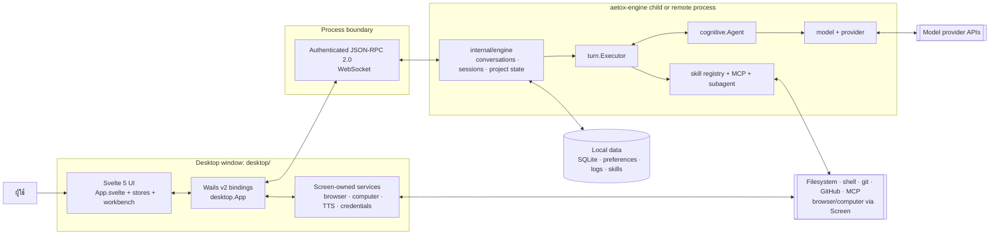
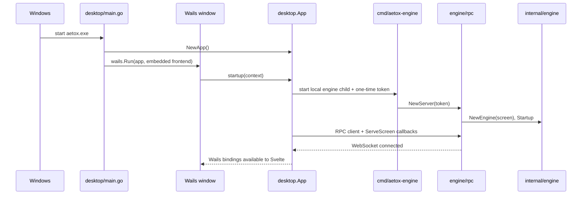

# แผนที่สถาปัตยกรรมปัจจุบัน — 2026-09-16

> **ระดับการตรวจ:** Full Mode — ผู้ใช้ขอแมพระดับทั้งระบบ และระบบมี Desktop, engine process, RPC, model providers, local persistence และ integrations หลายชุด
>
> **ขอบเขต:** โครงสร้างที่กำลังทำงานของ repository นี้ ณ วันที่ตรวจ ไม่ใช่แผนอนาคตหรือประวัติการย้ายโค้ด
>
> **หลักฐานที่อ่าน:** `go.mod`, `desktop/wails.json`, `desktop/frontend/package.json`, `desktop/main.go`, `desktop/app.go`, `desktop/frontend/src/{main.ts,App.svelte}`, `cmd/aetox-engine/main.go`, `internal/engine/app.go`, `internal/{config,engine,turn,cognitive}/`, `.github/workflows/{ci,release}.yml`, ผล `go list` ของแพ็กเกจภายใน และ `ARCHITECTURE.md`
>
> **คำกำกับ:** **ยืนยันแล้ว** = อ่านจากโค้ดหรือคอนฟิกโดยตรง · **ยังไม่ได้ตรวจเชิงลึก** = มีอยู่ใน dependency graph แต่ไม่ได้อ่าน implementation ทุกไฟล์

## สรุป

Aetox เป็น desktop application แบบ local-first: Svelte 5 แสดงผลใน Wails v2, ส่วนหน้าต่าง (`desktop/`) เป็น **screen** ที่เริ่ม `aetox-engine` เป็น child process แล้วคุยกับ `internal/engine` ผ่าน JSON-RPC 2.0 บน WebSocket. Engine รวม state ของ conversation, session persistence, agent loop, tool registry และ integration ต่าง ๆ ไว้; provider key ไม่อยู่ใน engine แต่ screen เป็นผู้ sign request ผ่าน `internal/signer` และ RPC proxy.

ไม่มี backend server หรือ cloud database ของ Aetox ที่ยืนยันได้จากขอบเขตนี้. ข้อมูลถาวรอยู่ในเครื่อง โดย `config.DataRoot()` เป็นจุดกำหนด data root และ engine import SQLite driver โดยตรง.

## 1. ขอบเขตระบบ



### เส้นแบ่งความรับผิดชอบที่สำคัญ

| ขอบเขต | หน้าที่ที่ยืนยันแล้ว | หลักฐาน |
|---|---|---|
| `desktop/frontend/` | Svelte 5/Vite UI; mount `App.svelte`; state หลักอยู่ใน `cockpit.svelte.ts` และ `workbench.svelte.ts` | `desktop/frontend/package.json`, `src/main.ts:12-46`, `src/App.svelte:1-50` |
| `desktop/` | Wails window, RPC client, screen callbacks, native browser/computer, provider signing, TTS, update | `desktop/main.go:18-68`, `desktop/app.go:111-171`; import graph |
| `cmd/aetox-engine/` | process entry; สร้าง authenticated RPC server, `engine.Engine`, lifecycle และรับ `--root` | `cmd/aetox-engine/main.go:1-181` |
| `internal/engine/` | application core: conversation/session/project/workspace state และเชื่อม packages ภายใน | `internal/engine/app.go:26-47,50-219`; import graph |
| `internal/turn/` + `internal/cognitive/` | execute turn และ model-driven tool loop/streaming response | `internal/turn/executor.go:1084-1116`; `internal/cognitive/agent.go:534-539,1540-1545,1894-1899` |
| `internal/skill/`, `mcp/`, `subagent/` | tools, external MCP servers และ delegated work | import graph ของ `internal/engine`/`internal/skill`/`internal/subagent` |
| `internal/model/`, `provider/`, `signer/` | provider protocol/catalog และ screen-owned model-request signing | `internal/engine/app.go:36,39`; import graph; `ARCHITECTURE.md:235-236` |
| `internal/config/` + local storage | data root, persisted config; engine import SQLite driver | `internal/config/config.go:718-723`; `internal/engine` import graph |

## 2. การเริ่มโปรแกรมและการเชื่อมต่อ



*ยืนยันแล้ว:* `desktop/main.go` embed `frontend/dist` และ bind เพียง `desktop.App`; `desktop.App.NewApp()` สร้าง RPC client และ local-engine supervisor; `startup()` เริ่ม child asynchronously. `cmd/aetox-engine serve` รับ token ผ่าน stdin หรือ file, ไม่ใช่ argv, แล้วเริ่ม RPC listener (`desktop/main.go:15-67`, `desktop/app.go:111-171`, `cmd/aetox-engine/main.go:81-181`).

## 3. การไหลของหนึ่งแชตเทิร์น

```mermaid
sequenceDiagram
    participant U as User
    participant FE as Svelte UI
    participant D as desktop.App
    participant R as RPC
    participant E as engine.Engine
    participant T as turn.Executor
    participant A as cognitive.Agent
    participant M as Model provider
    participant K as Skill/MCP/subagent

    U->>FE: ส่งข้อความหรือไฟล์แนบ
    FE->>D: generated Wails binding
    D->>R: engine API call
    R->>E: SendMessage
    E->>T: execute turn
    alt คำสั่ง/skill ที่รู้จัก
        T->>K: dispatch พร้อม safety gate
        K-->>T: tool output
    else model-driven tool loop
        T->>A: respond with tool definitions
        A->>M: signed request ผ่าน screen proxy
        M-->>A: text หรือ tool call
        A->>T: requested tool call
        T->>K: safety gate + execute
        K-->>T: receipt
        T->>A: append tool result; loop ต่อ
    end
    T-->>E: reply/events
    E-->>R: chunks, state, completion
    R-->>D: screen event
    D-->>FE: Wails runtime event
```

จุดที่สำคัญคือ model request ออกจาก engine แบบ **ยังไม่ลงนาม** แล้ว screen เป็นผู้ส่งผ่าน credential/signing boundary; tool ที่ต้องใช้หน้าต่างหรือเครื่องของผู้ใช้ย้อนกลับผ่าน `engine.Screen`/RPC screen peer. ข้อสรุปนี้ยืนยันจาก `desktop/app.go:128-139`, `cmd/aetox-engine/main.go:116-123` และ `ARCHITECTURE.md:64,235-236`.

## 4. แผนที่โมดูลแบบจัดกลุ่ม

| กลุ่ม | แพ็กเกจ/โฟลเดอร์ | บทบาท |
|---|---|---|
| Entrypoints | `desktop/`, `cmd/aetox-engine/`, `cmd/aetox/` | Desktop ที่ปล่อยจริง, engine process, และ CLI screen ที่ยัง build/test ใน CI |
| UI | `desktop/frontend/src/` | app shell, chat, sidebar, workbench, settings, guide, localization, Svelte stores |
| Engine orchestration | `internal/engine/`, `bootstrap/`, `app/`, `turn/`, `cognitive/`, `prompt/`, `memory/`, `mode/` | build conversation/runtime, execute turns, prompt/context และ desk/mode policy |
| Tooling and safety | `skill/`, `safety/`, `mcp/`, `subagent/`, `snapshot/`, `repomap/`, `lsp/`, `designlint/`, `skilllint/` | model-facing tools, approval, external MCP, delegation, coding aids |
| Model and identity | `model/`, `provider/`, `signer/`, `credentials/`, `oauth/`, `account/`, `think/` | provider protocols/catalog, signing, stored credentials, OAuth/account และ reasoning settings |
| Local platform/media | `proc/`, `machine/`, `capability/`, `connect/`, `update/`, `deck/`, `ooxml/`, `imagegen/`, `stt/`, `tts/`, `assetlib/` | processes, OS reach, capabilities, connected services, update และ media/document paths |
| Shared foundation | `config/`, `atrest/`, `audit/`, `debuglog/`, `version/`, `apierr/`, `callfault/`, `statereport/` | filesystem/data-root, encryption at rest, audit/logging, version and typed errors |
| Delivery and checks | `.github/workflows/`, `build.ps1`, `verify.sh` | build/release automation and CI quality gates |

## 5. การเก็บข้อมูลและทางออกนอกระบบ

- **Local persistence — ยืนยันแล้ว:** `config.DataRoot()` ใช้ `AETOX_DATA_ROOT` เมื่อถูกตั้งค่า มิฉะนั้นใช้ user config directory; `internal/engine` import `modernc.org/sqlite` (`internal/config/config.go:718-723`, `go.mod:29`, import graph).
- **Model network — ยืนยันแล้ว:** model clients อยู่ใน `internal/model`; provider catalog อยู่ใน `internal/provider`; request signing เป็นหน้าที่ screen (`internal/engine/app.go:36,39`; `ARCHITECTURE.md:235-236`).
- **User-machine effects — ยืนยันแล้ว:** shell/filesystem/git และ integrations บางชุดเป็น tools; browser/computer/TTS เป็น screen-owned เพราะต้องทำงานบนเครื่องของหน้าต่าง (`desktop/app.go:75-107`; import graph).
- **Remote engine — ยืนยันแล้ว:** `internal/engine/remote` อยู่ใน build graph; เอกสาร/implementation ที่อ่านระบุ SSH tunnel เป็นทางเลือกของ engine process. การทดสอบ transport และ lifecycle โดยละเอียดอยู่นอกขอบเขตแมพนี้.

## 6. Quality gates และการปล่อย

CI install/build frontend ก่อน Go เพราะ `desktop/main.go` embed `frontend/dist`, จากนั้นรัน `go vet ./...`, golangci-lint, frontend tests และ Go tests; Linux job ใช้ race detector. Release build engine เป็น binary แยก แล้ว build Wails/NSIS desktop และตรวจว่า executable ทั้งสองอยู่ครบ (`.github/workflows/ci.yml:69-121,188-202`, `.github/workflows/release.yml:114-172`).

## การประเมินจากขอบเขตนี้

- **Critical/High:** ไม่พบข้อค้นพบใหม่ที่เข้าเกณฑ์จากหลักฐานที่ตรวจ
- **Medium/Low:** ไม่สรุปเพิ่ม — แมพนี้ไม่ประเมินไฟล์ implementation ทุกตัว และไม่ควรยก import count มาเป็น debt โดยไม่มีผลกระทบที่พิสูจน์ได้
- **ข้อสังเกต:** `ARCHITECTURE.md` เป็น hub ที่มีทั้งสถานะปัจจุบันและบันทึกประวัติการย้ายโครงสร้าง; จึงใช้เอกสารนี้เป็น “ภาพ ณ ปัจจุบัน” และอ้าง source file ที่อ่านควบคู่กัน

## สิ่งที่ยังไม่ได้ตรวจเชิงลึก

1. implementation ราย tool/provider และ contract ของทุก RPC method
2. schema SQLite, migration และ retention policy
3. security posture ของแต่ละ integration และ browser/computer surface
4. DOM/component detail ของ Svelte ทุกหน้า

## Validation

1. **Traceability:** ทุกข้อสรุปสำคัญอ้าง path/line หรือผล dependency graph ข้างต้น
2. **Scope alignment:** ครอบคลุม whole-system map ตามคำขอ โดยไม่เปลี่ยน source code
3. **Handoff readiness:** แมพแยก process boundary, ownership, turn flow และสิ่งที่ยังไม่ตรวจ; ไม่มี proposed change
