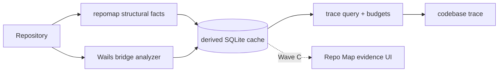

# Evidence-backed Semantic Code Map — Wave A

**Date:** 2026-09-15  
**Status:** Approved for Wave A  
**Scope:** derived fact cache, structural line provenance, Wails bridge, one `codebase trace` action  
**Structure:** [semantic-code-map.md](semantic-code-map.md) — the living architecture of what was built (layers, truth contract, flows, invariants, findings). This document holds the reasoning and the measurements; that one answers what breaks when somebody changes it.

## 1. Problem

`repo_map` can show which files depend on which files, and `codebase symbol`
can resolve one identifier and list references. Neither can cross the generated
Wails boundary from a frontend call to the Go method that receives it, and the
current graph cannot say which source line proves an edge.

The feature must answer a narrower question before it grows:

> From this source symbol, what verified path can Aetox show, where is every
> edge written, and which parts remain unknown?

Adding another LLM does not answer that question. The answer must be derived
from source and carry evidence independently of whichever model explains it.

## 2. Existing constraints

- `repomap.Graph` and `repomap.Build` share one analysis. The UI and model must
  not acquire separate readings of repository structure.
- Opening Repo Map currently performs a fresh structural walk and deliberately
  holds no semantic cache. It must still paint without waiting for an LSP.
- `codebase symbol` already returns references. A separate `callers` action
  would duplicate its surface before call hierarchy has proved useful.
- Language servers differ in call-hierarchy support. Wave A must not change the
  existing `Symbol` contract or report an unsupported method as an empty graph.
- Tool descriptions are paid on every model request. One action is the budget.
- The engine owns project files in local and remote deployments. The index lives
  beside the engine's Aetox data, while RPC carries facts only.

## 3. Decision: three measured waves

### Wave A — build and measure

- Derived SQLite cache under `DataRoot/code-index/<ProjectKey>.db`
- Structural import facts with source-line provenance
- Wails frontend-call → generated binding → Go method facts
- One `codebase trace` action
- Typed outcome and whole-query budgets
- No Repo Map cache merge and no UI changes

Wave A is measured after 2026-09-21 with the existing token audit window and a
fixed five-question reach set. This keeps the earlier `repo_map`/`codebase
design` trial readable instead of changing its tool surface mid-window.

### Wave B — only if Wave A is reached and useful

- LSP call hierarchy
- Recursive callers/callees
- `test_reference`
- Impact is expressed through `trace` with direction and depth, not a new action

### Wave C — only if the graph earns a human surface

- Merge fresh semantic facts into Repo Map
- Edge evidence drawer and status
- Locale and README changes

## 4. Architecture



`internal/codeindex` owns the fact vocabulary, cache, invalidation, Wails
adapter and trace query. `internal/repomap` remains the fast structural reader
and exports evidence-bearing facts. `internal/skill` is only the sandboxed tool
wrapper.

## 5. Fact contract

Every fact contains:

- from path, line and optional symbol
- to path, line and optional symbol
- relation kind
- evidence strength
- producer
- content identity for both endpoint files

Strength vocabulary:

| strength | meaning |
|---|---|
| `syntactic` | written directly in source syntax |
| `resolved` | both endpoints were deterministically linked |
| `possible` | static dispatch admits the edge but cannot prove it occurs |
| `observed` | runtime evidence; not produced in Wave A |
| `heuristic` | repository convention or suffix/package resolution was needed |

Wave A relations are `import`, `reference`, and `wails_rpc`. A test importing or
calling production code is not coverage; Wave B may emit `test_reference`,
never `covered_by_test`, until runtime coverage exists.

## 5a. When the index is built

The index and the question have separate budgets, and this was learned by
running it: with one budget, `codebase trace` on this repository itself spent
its whole eight seconds rebuilding and then answered from an expired clock.

- `refreshTimeout` (60s) covers building the index. The query budget covers the
  walk.
- `Trace` builds only when a producer has never run for this project, and
  rebuilds only when a cached row's file no longer matches what was stored.
- A question about an unchanged project does no index work at all.
- The pass is recorded (`producers`) even when it stored nothing, because a
  project with no imports stores no rows and "no rows" must not read as "never
  indexed".
- Every file the walk mapped is recorded (`sources`), so a file created after
  the index is not mistaken for a file with no relationships. A file this index
  does not read at all answers `unsupported` and names itself.

## 6. Cache and staleness

The cache is disposable and never enters the repository. It stores no source
snippet. Each endpoint records size, modification time and SHA-256 when the
fact is written.

On read:

1. compare size and modification time;
2. if either changed, compute SHA-256;
3. reject the fact when the hash differs;
4. report the number rejected as stale.

A fact is valid only when BOTH endpoints still match, because a rename at the
far end moves the line the fact points at even though the source file never
changed. A file that cannot be read at all is an error, not staleness: "this
file changed" and "this file cannot be examined" are different statements.

A producer replaces its WHOLE reading in one transaction, so the rows it owns
are exactly the facts it just produced and a file that stopped producing facts
stops having rows. This is also what keeps one analyzer from deleting another's
reading: the delete is scoped to the producer, never to the file. A schema
mismatch rebuilds the cache rather than migrating durable data.

`ProjectKey` is the existing normalized absolute-root identity. In remote mode
the engine computes it against the engine-side path because that is where the
source and cache exist. No database path crosses RPC.

## 7. Wails bridge

The adapter accepts only the generated Wails v2 pattern it can prove:

1. frontend source imports a named function from `wailsjs/go/<package>/<type>`;
2. that source calls the imported name;
3. the generated JS exports the same name and dispatches to
   `window.go[package][type][method]`;
4. Go AST contains a method of that name on the matching receiver type.

It emits two facts so the generated boundary remains visible:

- frontend call → generated binding (`reference`, `resolved`)
- generated binding → Go method (`wails_rpc`, `resolved`)

A missing or unfamiliar stage returns an unknown outcome. It never joins by
name alone after a generated binding fails validation.

## 8. One model action

```text
codebase trace
  path: source file
  name: seed symbol
  direction: callees | callers | between
  targetPath/targetName: required only for between
  depth: bounded, default 1 for callers/callees and the budget maximum for
         between, where the answer is one path to a named place
```

Wave A traverses structural and Wails facts. Wave B may add call hierarchy
behind the same action and schema.

A start or target path that is not a file in the project is `unavailable`,
never an empty answer. Every lookup below it is a string key into an index, so
a typo, a directory, or a file somebody moved returns the same silence as a
file nobody references; the path is checked and brought to the project's own
spelling before anything is read. This is the same rule `search` already
carries (`searchBaseExists`).

Outcome vocabulary is explicit:

- `complete` — requested bounded traversal completed
- `partial` — a cap was reached; returned facts remain valid
- `unsupported` — the analyzer does not implement this source kind
- `unavailable` — the analyzer is known but cannot run
- `failed` — it ran and failed; reason included

Whole-query limits apply across the traversal, not once per edge:

- maximum 40 analyzer requests
- maximum 120 returned facts
- maximum 8 seconds wall time
- maximum depth 3

Every clipped result says which budget truncated it, the depth clamp included,
and the result carries the depth actually walked so no caller can print the
number it asked for over a shorter walk.

`unknown` is counted, never smoothed away, and it counts only relationships that
could be seen and not established. A module under the generated tree that names
no binding at all — Aetox's own frontend imports `wailsjs/go/models` in
thirty-odd files to name the Go types — is passed over in silence, because
counting it would print a permanent, growing number on a healthy project.

## 9. Measurement gate

After 2026-09-21:

1. run `tokenaudit -days 7` without combining pre-Wave-A and post-Wave-A rows;
2. ask five fixed questions that `symbol` cannot answer because they cross
   Wails — fixed, each with the depth it needs, in §12.1;
3. record whether the model chose `trace`, whether the path was correct, tool
   rounds, prompt cost and unknown edges;
4. proceed to Wave B only if trace is reached and improves those answers.

No UI work is justified by a tool the model does not reach.

## 10. Open questions deferred to the gate

- Does svelteserver on the supported machine answer call hierarchy usefully?
- What request/fact budget keeps depth two responsive on a large repository?
- Is a selected-edge UI better than opening an evidence list beside the map?
- Which Wails generator variants beyond the current v2 output deserve support?

## 11. What the 146 tokens buy, measured rather than argued (15 ก.ย.)

`trace` grew the `codebase` block from 320 to 477 tokens — 157 of them, in every
request of every session that may use the tool. It is **146 of 463** since 16 ก.ย.,
and those are the figures below. Three things moved it that day and none is this
table's own subject: the entry measured 474 that morning, three tokens *under* the
pin, because `fdec8404` shortened the depth line and did not move it; the act's own
line was then rewritten for 11 more (§11a, §11b); and both ends are now measured on
one day with one instrument (`Packed.Narrow`) — the four-act entry is **317**,
against the 320 recorded here for 14 ก.ย., and the two reconcile: +12 for the words
`path` and `name` grew to mention `trace` when it joined, −15 for the `errors`
sentence that left the block on the 16th. That number was quoted before it
was measured. Measured on the 15th, by marshalling every registered tool
definition through the same `len(payload)/4` rate `block_standard_test.go` uses:

| what | tokens | against what |
|---|---|---|
| the whole tool block | 6,665 | 25 tools, sent on every request |
| `codebase` | 463 | 6.95% of the block — 232 description, 211 parameters, 20 envelope |
| the part `trace` added | 146 | 2.19% of the block |
| 146 × 5,591 calls in 7 days | 816,286 | 0.14% of the 602.6M prompt tokens in that window — an upper bound, since only sessions granted `codebase` carry it |
| the same, fresh-equivalent | ~50K | the window's real fresh share is 6.1%; caching carries the rest |
| one average `read` | 4,292 | 17,166 bytes — **29× the whole act** |

So the act costs about one twenty-ninth of a single average file read, for as long
as the session lives.

**Re-measured on 16 ก.ย. with the same instrument:** the whole block is **6,665**
over the same 25 tools, against the 6,670 recorded here for the 15th. This act fell
by 14 between the two readings, so the block should have read 6,656 — it reads nine
tokens more than that, and those nine belong to an entry this table does not track.
Named rather than explained: nothing in this work touched another tool.

**What it buys, and it is exactly two things.** Existence: a model calls only
what is in the block, and this repository already carries the evidence
(`block_standard_test.go:112` — the map was reached for once in two weeks while
its one-line entry said nothing about what it finds). And the *shape* of a call
that passes the gate: with `additionalProperties:false` an undeclared argument is
a refused call, so the `direction` enum and the three optional arguments are
signature, not prose.

**What it does not buy: judgment.** When to reach for it, that depth is a fan-out,
that `partial` is a budget and not a silence — all of that is in `Guidance()`,
delivered once after the first call, and costs nothing in the block.

### 11a. What could be trimmed, and why it should not be

The only real fat is that four `trace`-only parameters each open with
`action=trace: ` (~14 tokens) and `path`/`name` carry words that also serve
`errors` and `symbol` (~10). Total 15–25 of 470 — 0.3% of the block. It is not
worth taking: the prefix is the only thing that says which action a name belongs
to, and spending 20 tokens to make a tool slightly harder to call correctly is
the wrong direction.

**Taken anyway on 16 ก.ย., and what is above is not what was wrong with it.**
Trimming the prefix is still not worth doing for its own sake — that part stands.
What changed is that there was something to buy with it. The sentence naming what
this act crosses was written in `traceSkill.ToolDefinition()`, an inner definition
no registry returns and therefore no model has ever read (§11b), and four runs had
shown the act reached once in three (§298.3). The pack is the only place the
currency exists, because the ratchet lets `codebase` shrink and not grow.

**What paid for it.** The four `action=trace:` prefixes, on properties that exist
only when `trace` is granted and where no other act can be the referent (−54); the
article in "the generated Wails binding" (−2); and the last sentence of the `errors`
line, "and it says so when no server is installed for that language" (−62), which is
judgment by guidance.go's own standard and is delivered once now, from
`diagnostics.go`, with the result most likely to be "(no problems)". Against the +74
bytes of new sentence that is **474 → 463 tokens**.

**And the first draft paid with the wrong thing, which review caught.** It cut the
`path` clause "which default to the whole project" (−36), and that was a loss
wearing a saving's clothes: `(path?)` says an argument is optional and never says
what happens without it, and the inner definitions that do say it
(`repomap.go:43`, `design_check.go:47`) are — again — the ones no model reads. After
the change nothing a model is sent said what `map` and `design` do without a `path`.
The clause is back (+36, unchanged from the original wording) and the `errors`
sentence pays for both. Pinned by `TestTheErrorsActStillSaysWhatAnUncheckedFileIsNot`.

### 11b. The finding that came out of measuring, and it is the other way

`traceSkill.ToolDefinition()` (`trace.go:44-89`) never reaches the model. The
registry returns 25 tools and `trace` is not among them; that definition is built
only at `codebase_pack.go:96`, as an *inner*. What the model actually reads is
the pack's own line for the act (`codebase_pack.go:111` for the line itself, and
`:138` for `direction`, which read "action=trace: walk direction, default callees"
until 16 ก.ย.) — and it
must infer from the enum alone what `callers` and `between` mean, while
`trace.go:56-60` holds the sentence that says it.

This is true of every packed tool's inner definition, not just this one. It does
not make `trace` wrong, and `direction` still reaches the model as an enum, so a
call is possible. But direction is a three-way choice made *before* the first
call, and `Guidance()` — which does carry the real explanation — arrives *after*
it. That is the same rule `change_pack.go` records for `write`'s two caps.

Not changed here, deliberately: the fix adds roughly 25–30 tokens to a block whose
477 is already the number this feature is being measured on, so it belongs with
the gate's decision rather than in front of it. Wave B should carry it.

**Changed on 16 ก.ย., after the owner was asked and answered.** The sentence that
was in the wrong place is in the block line for `trace` now — "what a name connects
to: file:line, relation and strength on every hop, across a generated Wails binding
from a frontend call to the Go method" — and the four runs of §298.3 are the
evidence that its absence is why the act looked unreachable. It says "a generated
Wails binding" rather than "the" on purpose: the crossing exists only where a
project generates that layer. `internal/codeindex/wails.go` reads the `wailsjs/go`
tree, reports `found=false` where there is none, and on such a project the walk
follows imports and calls as before — while this line rides in the block of every
project a session opens. The inner definition in `trace.go` still exists and still
says the same thing; nothing calls it, and the same is true of every packed act's
inner definition, so it is named as debt rather than deleted for this one act alone.

### 11c. Where the same window's tokens actually go

The window measured above, for scale. Neither of these is `trace`'s doing and
neither is fixed by trimming it:

- **Cache breaks, prefix changed:** 146 on `deepseek-flash` alone, **9,143,936
  tokens dropped** in one week — 10.4× everything `trace` costs in the same
  window, re-sent fresh at full price on the following call.
- **Repeat waste:** `skills_list` 42 calls / 3,467,628 bytes with 11.5% repeated,
  and `skill_view` 92 calls / 9.9% — **561KB** of output sent into a session that
  already held it.

A change that took 20 tokens off `trace` while those two stand would be
housekeeping in the wrong room.

## 12. The gate, fixed before it is run (15 ก.ย.)

§9 asked for five fixed questions and a date. This is the five, what a cold index
answers for each of them on this repository today, and the rule that decides what
happens to this branch afterwards.

### The frozen point

- `feat/semantic-code-map`, in the isolated worktree
  `D:/Aetox/.worktrees/semantic-code-map`, three commits of its own and none of them
  in `main`. `main` was at `ac4c78cc` when this was measured and the owner's own
  checkout has moved on since — nothing here writes to it — which is the same reason
  §12.5's preconditions exist: a gate reads a build, and this branch has to be one.
- Every number below came from a **cold** cache: `AETOX_DATA_ROOT` pointed at an
  empty directory, so the first call built the index and the rest answered from
  what it built. The build cost 32–35s on this repository; the same question
  afterwards cost 18–20ms.
- The rival tools were asked on the same checkout in the same run, so the
  comparison is one run and not two memories.

### 12.1 The five questions

| # | the call | what the answer has to contain | cold answer, 15 ก.ย. |
|---|---|---|---|
| 1 | `callees depth 3`, `RepoMapPane.svelte` / `GetRepoMapGraph` | `App.js:581` → `engine_forwarders_gen.go:366` → `internal/engine/repomap_view.go` | `complete`, **3 hops**, 18.9s cold then 13ms warm — the three hops below, in order |
| 2 | `callees depth 2`, `MediaPane.svelte` / `OpenFileExternally` | `App.js:993` → `desktop/screen_doors.go:345` | `complete`, 2 hops, 11ms — both exact |
| 3 | `callees depth 2`, `Chat.svelte` / `SavePicture` | `App.js:1453` → `desktop/screen_doors.go:96` | `complete`, 2 hops, 10ms — both exact |
| 4 | `callers depth 1`, `internal/engine/repomap_view.go` / `GetRepoMapGraph` | the two files that import it: `engine_forwarders_gen.go:366`, `engine/rpc/client_gen.go:585` | `complete`, 2 hops, 5ms — both exact |
| 5 | `callees depth 1`, `Capability.svelte` / `ProgramIcon` | the honest refusal: the binding cannot be paired, so no line may be chosen | `complete`, 20 hops, every one of them labelled file-level, plus `1 relationship(s) ... could not be established`. The refusal is the answer |

Asked at those depths, four of the five come back with the path they must, and the
fifth refuses exactly where refusing is right.

And asked with **no depth at all** — which is what a model that has read nothing
about depth will send — questions 2, 3 and 4 answer two hops and cross the boundary
on their own, where before §12.2 they answered one hop and stopped inside a file
nobody wrote. Question 1 at the default reaches the generated forwarder and stops
one hop short of the engine file, which is why the gate asks it at depth 3.

### 12.2 What the measurement changed, and the three fixes (15 ก.ย., the same day)

The cold index above was first taken at `b328fa55`, and what it found was three
things wrong with the TOOL rather than with the questions. All three are fixed on
this branch, each with the test that would have caught it, and every number in §12.1
is the answer **after** the fix.

**A node with no name expanded to every edge of its file.** `preferNamedFacts`
(indexer.go) returned a file's facts unchanged when the node carried no name, and
the repomap producer writes one fact per written reference
(`internal/repomap/graph.go:146`, and the assertion at `repomap_test.go:352` says
why: "two lines in app.ts are two pieces of evidence"). `desktop/engine_forwarders_gen.go`
therefore contributed 101 file-level hops, and the walk followed each of them as a
hop. Two symptoms, one cause:

- question 1 at depth 3: 103 hops, 2 of them about `GetRepoMapGraph`. The hop that
  matters — `engine_forwarders_gen.go:366 → internal/engine/repomap_view.go` — is
  present at position 63, indistinguishable from the hundred around it.
- question 4 at depth 2: the second hop lands on the generated file with no name,
  so the walk lists every binding in the generated dispatch and stops on the fact
  budget — `partial`, 120 hops, `TRUNCATED: fact budget reached`. At depth 1 the
  same question is exact.

Every fixture in `codeindex`'s tests has one or two imports per file, which is why
none of them can see this. It is the same shape as the eight-second failure §298
recorded, and the same lesson: it exists only at the size of a real project.

**The first diagnosis of this was wrong, and the fix is not the one it named.** The
draft before this one said the answer should collapse the facts that share a hop,
reasoning that a hop is one `(from, to, relation)` and facts sharing it are evidence
for it. Those 101 facts are not duplicates of one hop: they are 101 distinct edges
out of one file, one per forwarder, and collapsing by `(from, to, relation)` leaves
every one of them standing. What the walk needed was a way to tell which edge
belongs to the name in hand, and that answer was already in the facts: the line each
one is written at.

**The fix is in the walk** (`preferNamedFacts`, indexer.go), and it is two rules:

- a node carries the line the fact that brought the walk there landed on, and a
  named node narrows to the edges written at that line. `desktop/engine_forwarders_gen.go`
  has 101 edges; exactly one of them is written at line 366, which is the line the
  walk arrived on, and that is the hop the question is about;
- a file-level hop no longer drops the name the walk is following, which is what the
  reverse walk needed: at the generated file, "what reaches this method" had become
  "what reaches this file", and that is every binding in the dispatch.

Measured before and after on a cold index of this repository:

| the call | before the fix | after |
|---|---|---|
| question 1 at depth 3 | `complete`, 103 hops, the engine hop at position 63 | `complete`, 3 hops, the answer in §12.1 in order |
| question 4 at depth 2 | `partial`, 120 hops, `TRUNCATED: fact budget reached` | `complete`, 3 hops |

Pinned by `TestWalkFollowsTheEdgesWrittenAtTheLineItArrivedOn` and
`TestWalkKeepsTheNameItIsFollowingAcrossAFileLevelHop`, both of which use a fixture
with two forwarders in one file — the shape every fixture in that package was
missing, and the reason none of them could see this.

**The default depth stopped one hop short of the boundary.** `callees` defaulted to
depth 1 (`DefaultDepth`, types.go). At depth 1 a frontend call answered
`MediaPane.svelte:33 → wailsjs/go/main/App.js:993` and nothing else: it ended inside
the generated binding, which is where `symbol` already ends. Depth 2 reaches
`desktop/screen_doors.go:345`. The question this feature exists for is two hops long,
and the guidance — "depth is a fan-out: keep it at 1 unless the answer is a path" —
priced the fan-out without saying that the crossing IS the fan-out. §9's five
questions, asked at the default, would have answered inside a generated file four
times out of five. `DefaultDepth` is 2 for `callers` and `callees` now, `Guidance()`
says what one hop and two hops each are, and the fan-out half of
`TestBetweenDefaultsToEnoughHopsWithoutTheCallerAsking` pins it.

**16 ก.ย.: two hops is not the crossing either, and this time it is measured hop by
hop.** Run against this repository, the default answers two hops ending at
`desktop/engine_forwarders_gen.go:366` — a generated forwarder, which is where `symbol`
already ends — and `internal/engine/repomap_view.go` is the third. `DefaultDepth()` is
the budget's own ceiling for every direction now and takes no argument. §298.3 in
DECISIONS.md carries the run, the two other things the answer was getting wrong (the
depth it reported, the direction it never named), and the first three turns with a model
in the loop.

**And the gap §12.3 opened is closed by the same change that made it visible.** A
cache now records the version of the analyzer that wrote its rows
(`producers.version`, store.go), the version is written with every replace, and
`Indexed(producer, version)` answers false for a row from another build — so a
question asked of a cache written before an analyzer changed rebuilds instead of
being answered from it. There is one version per producer and each belongs to the
package that decides the reading: `repomap.FactVersion` and `codeindex`'s
`wailsFactsVersion`, both documented with the rule for bumping them. Pinned by
`TestStoreDistinguishesTheVersionThatWroteItsRows` and
`TestTraceRebuildsWhenTheAnalyzerVersionChanged`, the second carrying the control
that an unchanged project still answers from the cache.

**Still open, and measured rather than guessed.** Question 5 is the shape with no
name to narrow by: the boundary adapter could not pair `ProgramIcon`, so the answer
is the file's own edges — 20 hops at depth 1, 64 at the default depth of 2. Every one
of them is labelled file-level and the `1 relationship(s) ... could not be
established` line is the real answer, but 64 hops of neighbourhood is not. Narrowing
it is a producer change — a structural fact would have to record the name written at
its line, which `repomap.Facts` does not do — so it is named here rather than
patched with a rule the walk has no evidence for.

**16 ก.ย.: the shape is unchanged, and it is budget-sized now.** Asked of
`desktop/engine_forwarders_gen.go` with a name nothing in that file carries — question
5's shape, on a path whose figure can be reproduced — `callees` returns 120 hops,
`partial`, `TRUNCATED: fact budget reached`, every one of them an import edge of that
single generated file. The 20-and-64 figures above are left standing and are not
claimed to be this one: they were taken at a path this round did not reproduce, and a
number that moves is recorded rather than overwritten.

### 12.3 A figure in this record that does not reproduce

§298's fenced answer and the trace rows of §298.1 record question 1 as `facts=3`
with the engine hop third. On a cold index the same call at the same depth answers
`facts=103`, and no run today produced 3. The cache cannot say which is which: it
is keyed on `cacheSchemaVersion` (store.go:19) and on each endpoint's size,
modification time and SHA-256, while a producer's row carries its name, the time
it ran and how many relationships it could not establish — **no row records the
version of the analyzer that wrote the facts**, so facts written by an older build
stay valid and are served as fresh. Which build produced the 3 was not
established. Both numbers are left standing here rather than one being dropped
quietly; §298.2 in DECISIONS.md carries the withdrawal.

**Closed the same day.** That gap is why the second row above exists: a cache now
carries the version of the analyzer that wrote its rows, and a row from another
build is not this build's answer (§12.2). The 3 is still unexplained and is not
explained by this — closing the hole stops it happening again, it does not say what
wrote the number that is already in this file.

### 12.4 What the rivals answer, measured in the same run

| tool | time | what came back |
|---|---|---|
| `codebase symbol` | 22.7s | `declared at desktop/frontend/wailsjs/go/main/App.d.ts:309`, referenced from 2 places — both inside the generated tree |
| `codebase map` on `desktop/frontend` | 856ms | 433 files, and `wailsjs/go/main/App.js (referenced by 60)` — a hub, with no relationship to Go |

Both stop at the generated boundary. That is the gap this feature exists to cross,
and on the five questions above it crosses.

### 12.5 The rule

What the owner asked for, before any UI: **better than it was, keep it; not
better, do not.** Read against a seven-day window beginning 22 กันยายน, and only
over a window in which this branch is the build actually in use:

1. **Reached.** `codebase.trace` appears in `tool_runs`, in sessions that own the
   pack. A tool nothing reaches is not a tool, and no UI is built for one.
2. **Right.** At least four of the five questions in §12.1 come back with the path
   recorded there, read from the answer rather than from the call.
3. **Affordable.** No new prefix-break mass in `tokenaudit -days 7` attributable to
   the block this change grew (317 → 463 tokens, both ends measured 16 ก.ย.).

Points 1 and 2 passing keeps the tool: the branch merges and Wave B starts — LSP
call hierarchy, recursive traversal, test references, and the §12.2 fix. Failing
either, the branch is dropped with `main` untouched and the pack returns to 320
tokens. Point 3 decides nothing alone; it is the ruler the next change to the block
is held to.

**Two preconditions, both the owner's, neither the feature's:**

- this branch has to be the build somebody uses for the window. It is in a
  worktree, so today nothing runs it and `tool_runs` would report zero for a reason
  that has nothing to do with whether the tool is worth keeping;
- the branch is one commit behind `main`. It should move onto `main` before the
  window opens, so that the only difference between pass and fail is this change.

### 12.6 The record

| date | reached | questions right | tokenaudit | verdict |
|---|---|---|---|---|
| 15 ก.ย. | not run — the branch is not the build in use | 4 of 5, by hand (§12.1) | not run — window not closed | pending, 22 ก.ย. |
| 16 ก.ย. | 1 of 3 turns, through the console screen (§298.3) | the five questions re-measured as tool calls, not re-answered | not run — window not closed | pending, 22 ก.ย. |
