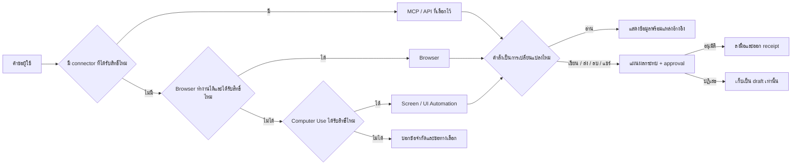
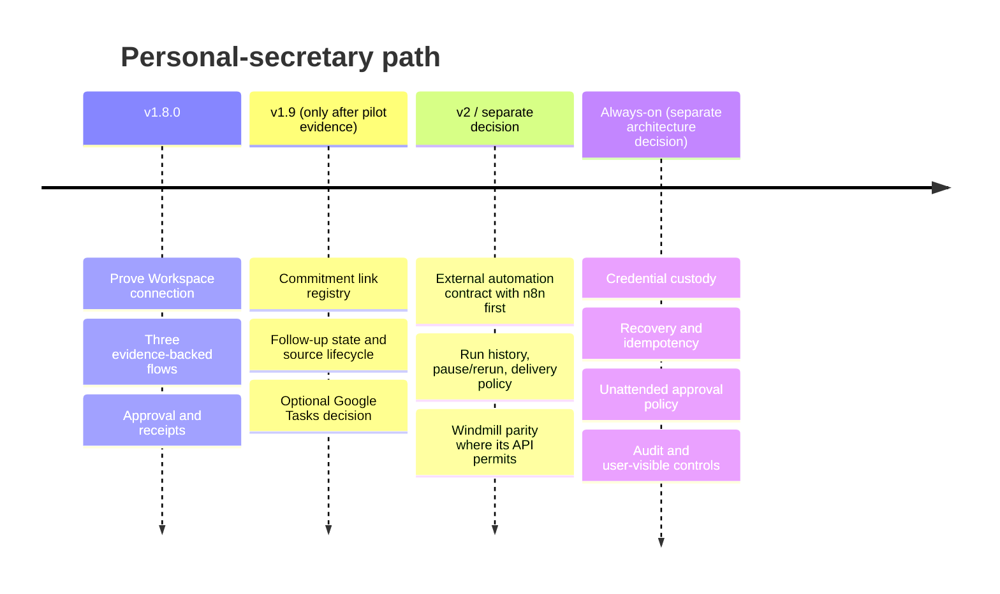

# Aetox v1.8.0 — เลขาส่วนตัวที่ไว้ใจได้ก่อนความอัตโนมัติ

> **สถานะ:** Proposed design — ยังไม่ใช่สิ่งที่ส่งมอบแล้ว  
> **วันที่:** 17 กันยายน 2026  
> **เป้าหมายรุ่น:** `v1.8.0`  
> **ตัดสินใจอ้างอิง:** [§299](../DECISIONS.md#299-decision--v180-earns-personal-secretary-through-three-verified-flows-not-a-scheduler-or-a-new-personality-2026-09-17)  
> **หลักฐานของระบบปัจจุบัน:** [current-system-map-2026-09-16.md](current-system-map-2026-09-16.md), [COMPANY.md](../../COMPANY.md), [§92](../DECISIONS.md#92-decision--the-code-door-is-a-focus-not-a-fence-and-the-automation-room-borrows-somebody-elses-clock-2026-08-09), [§262](../DECISIONS.md#262-decision--the-current-tool-surface-is-the-product-not-the-package-list-2026-09-13)

## 1. การตัดสินใจในประโยคเดียว

`v1.8.0` จะทำให้ **ผู้ช่วยหลักคนเดิม** ทำงานเลขาส่วนตัวได้จริงผ่าน Google Workspace ในสามงานที่พิสูจน์ได้—สรุปวันนี้, เตรียมประชุม, และร่างการตามเรื่อง—โดยทุกข้อเท็จจริงย้อนกลับไปยังแหล่งข้อมูลได้ และทุกการเขียนออกไปยังโลกภายนอกต้องเห็นผลก่อนและได้รับการอนุมัติจากผู้ใช้

มันไม่ใช่การประกาศว่า Aetox เป็นผู้ช่วยที่ทำงานเองตลอด 24 ชั่วโมงแล้ว และไม่ใช่การเพิ่ม “เอเจนเลขา” อีกคนหนึ่ง. รุ่นนี้ต้องทำให้คำว่าเลขา *น่าเชื่อ* ก่อนทำให้มัน *ทำเองไกลขึ้น*.

## 2. ปัญหาที่กำลังแก้ และนิยามความสำเร็จ

คนใช้ไม่ได้ต้องการ inbox ใหม่, task app ใหม่, หรือคนคุยที่ตอบเก่งขึ้นอีกคน. งานของเลขาคือเปลี่ยนสิ่งที่กระจายอยู่ในปฏิทิน อีเมล และไฟล์ให้เป็นคำตอบต่อไปที่ทำได้ทันที โดยไม่เดา ไม่ส่งผิดคน และไม่ทำสิ่งสำคัญเงียบ ๆ.

นิยามงานใน `v1.8.0` จึงเป็นดังนี้:

| เมื่อผู้ใช้พูดว่า | Aetox ต้องช่วยให้ถึงไหน | Aetox ต้องไม่ทำอะไรเอง |
|---|---|---|
| “วันนี้มีอะไรบ้าง” | สรุป timeline, สิ่งเร่งด่วน และสิ่งที่ต้องตาม พร้อมลิงก์กลับไปที่ event / email | สร้างนัด, ส่งเมล, หรือย้ายไฟล์ |
| “ช่วยเตรียมประชุมนี้” | รวบรวม attendees, เมลและเอกสารที่เกี่ยวข้อง, ร่าง agenda / talking points พร้อมหลักฐาน | แก้ไข invitation หรือส่งสรุปให้ผู้เข้าร่วม |
| “ตามเรื่องนี้ให้ที” | ระบุเจ้าของงาน, สิ่งที่ค้าง, วันนัดหมาย และร่างข้อความหรือ action ที่เสนอ | ส่งข้อความ, สร้าง calendar event, แชร์หรือลบไฟล์ |

ความสำเร็จไม่วัดจากจำนวนเครื่องมือที่ต่อได้ แต่จากสามคุณสมบัตินี้:

1. **จริง:** บรรทัดที่อ้างอิงเหตุการณ์ คน หรือเอกสาร ต้องมีต้นทางที่ผู้ใช้เปิดตรวจได้
2. **ปลอดภัย:** การอ่านอยู่ในสิทธิ์ที่ต่อไว้; การเปลี่ยนโลกภายนอกต้องมี approval ที่บอกผลลัพธ์เป็นภาษาคน
3. **จบงานได้:** ผู้ใช้เริ่มจากประโยคธรรมดาและจบที่ brief, meeting pack หรือ draft ที่ใช้ต่อได้ โดยไม่ต้องคัดลอกข้อมูลจากห้าหน้าจอ

## 3. ฐานที่มีอยู่แล้ว และช่องว่างที่ต้องไม่ปิดบัง

| ความสามารถ | สถานะปัจจุบัน | ความหมายต่อ `v1.8.0` |
|---|---|---|
| ผู้ช่วยหลัก, ความจำผู้ใช้ และการสังเกต habit | **Direct** — อยู่ใน assistant desk และระบบ memory | ใช้เป็นบริบทประกอบได้ แต่ความจำไม่ใช่หลักฐานแทนอีเมลหรือปฏิทิน |
| MCP ของ Google Workspace | **Direct แต่ยังไม่ proven กับบัญชีจริง** — preset `google-workspace` เรียก `workspace-mcp` สำหรับ Drive, Gmail, Calendar, Docs, Sheets ใน [`mcpShelf.ts`](../../desktop/frontend/src/lib/mcpShelf.ts) | เป็นทางหลักของ v1.8; ต้องพิสูจน์ OAuth, tool inventory และ scope ก่อนกล่าวว่าใช้ได้ |
| จำกัดเครื่องมือ MCP เป็นราย server | **Direct** — adapter รับ allowlist ของ tool ที่เลือก | ใช้เปิดเฉพาะ service/tool ที่ golden flows ต้องใช้ แทนการยกเครื่องมือทั้งชุดเข้า prompt |
| permission / approval สำหรับ MCP | **Direct** — policy ตั้ง rule ราย MCP server ได้ | เป็นฐานของ read/draft/write policy แต่ข้อความอนุมัติต้องอ่านเป็น “ผลที่จะเกิด” ให้ดีขึ้น |
| Browser และ Computer Use | **Direct** — มีอยู่เป็นทางไปถึงบริการที่ไม่มี connector | เป็น fallback สุดท้าย ไม่ใช่ทางลัดข้ามสิทธิ์ที่ connector ปฏิเสธ |
| n8n / Windmill integration | **Direct** — Aetox อ่าน/สร้าง/แก้ automation ภายนอกได้ตามข้อจำกัดที่บันทึกไว้ | เป็นทางต่อในรุ่นถัดไป; ไม่ใช่ scheduler ใหม่ของ v1.8 |
| งานย่อยระยะยาว | **Direct แต่ผูกกับอายุ process** — runner ระบุชัดว่า task ไม่อยู่ต่อเมื่อ process จบ | ห้ามสัญญา “ปิดโน้ตบุ๊กแล้วยังตามงานให้” ใน v1.8 |

### 3.1 ขอบเขตปัจจุบันที่ต้องพูดตรง ๆ

- preset Google Workspace ไม่เท่ากับ “เชื่อมสำเร็จ”: ต้องให้เจ้าของสร้าง OAuth client และลงชื่อเข้าใช้จริงก่อน จึงถือว่า proven ได้
- Google Workspace MCP เป็น third-party process และ upstream เปลี่ยน tool / scope ได้. รุ่นนี้ต้อง pin เวอร์ชันที่ทดสอบ, บันทึก inventory และ fail closed เมื่อชื่อ tool ที่ allowlist หายหรือเปลี่ยน
- Aetox ใช้ external automation engine ตามคำตัดสินเดิม: **n8n/Windmill คือนาฬิกา, Aetox คือมือ**. การเติม cron ใน Aetox เพราะอยากให้เหมือนคู่แข่งจะขัดคำตัดสินนั้นและเพิ่มระบบที่ต้องดูแลอีกหนึ่งชุด
- remote engine ไม่ได้แปลว่า headless personal cloud. provider credential ยังอยู่ฝั่ง screen ตาม §248 และงานเลขาที่ปิดเครื่องแล้วยังวิ่งมีข้อกำหนดด้าน credential, recovery, audit และ approval ที่ยังไม่ได้ตัดสินใจ

## 4. สิ่งที่ศึกษา และสิ่งที่เอามาใช้จริง

การศึกษานี้ไม่ได้คัดลอกคู่แข่งเป็น feature checklist แต่แยก “กลไกที่ทำให้เชื่อใจได้” ออกจาก “ต้นทุนของรูปแบบธุรกิจเขา”. แหล่งข้อมูลอยู่ท้ายเอกสารและตรวจเมื่อ 17 กันยายน 2026.

| แหล่ง | สิ่งที่น่าเรียน | สิ่งที่ไม่ควร copy เข้า `v1.8.0` |
|---|---|---|
| Claude Cowork | ลำดับการเข้าถึง **connector → browser → screen**, แผนและ progress ที่ผู้ใช้เห็น, approval ก่อนผลกระทบ, และงาน cloud ที่ตั้งเวลาได้ | cloud runtime ที่วิ่งต่อเมื่อปิดคอมพิวเตอร์—เป็นการตัดสินใจเรื่องข้อมูล, credential และต้นทุน ไม่ใช่แค่ปุ่ม scheduler |
| OpenClaw | gateway เป็นจุดเดียวของ session, routing, channel และ durable job lifecycle | ไล่จำนวน channel หรือสร้าง daemon ก่อนพิสูจน์ golden flow ของผู้ใช้คนเดียว |
| Hermes Agent | persistent jobs, cron / messaging และวงจรเรียนรู้ช่วยลดงานซ้ำ | ให้ระบบสร้าง skill หรือเปลี่ยนนิสัยตัวเองโดยอัตโนมัติ; ก่อนมี audit ที่อ่านง่าย นี่เป็นความเสี่ยงมากกว่าความฉลาด |
| Google Workspace MCP | ขอบเขต service ที่กว้างและแนวคิด progressive tool tiers / read-only mode | เปิด tool จำนวนมากทุกครั้ง; prompt จะรก, scope จะกว้าง, และ approval จะตรวจยาก |

**ข้อสรุปสำหรับ Aetox:** เรานำลำดับการเข้าถึง, หลักฐาน, ความชัดของสถานะงาน และ lifecycle ที่ตรวจสอบได้มาใช้ก่อน. เราเลื่อน cloud persistence, cron, channel expansion และ self-learning ออกไปจนกว่าจะมีเหตุผลจากการใช้งานจริง.

## 5. หลักออกแบบที่ v1.8 ห้ามละเมิด

### 5.1 คนเดียว, แหล่งจริงหลายแห่ง

ไม่มี persona, sidebar, memory folder หรือ agent ใหม่ชื่อ “เลขา”. ผู้ใช้คุยกับผู้ช่วยหลักคนเดิม; สิ่งที่เพิ่มคือ starter / preset และ workflow contract ที่ทำให้ผู้ช่วยรู้วิธีทำงานเลขาอย่างสม่ำเสมอ.

Google Calendar, Gmail, Drive และ Docs คือ **system of record** ของข้อมูลนั้น. `v1.8` จะไม่สร้าง inbox, task list หรือ CRM ซ้ำใน SQLite. ถ้าต้องเก็บอะไรในภายหลัง ให้เก็บได้เพียง link/index ของ commitment ที่ชี้กลับไปยังต้นทาง จนกว่าจะมี decision แยกเรื่องข้อมูลอ้างอิงกลาง.

### 5.2 Connector ก่อน, screen เป็นทางสุดท้าย

ลำดับนี้เป็น policy ไม่ใช่เพียงคำแนะนำใน prompt:



ถ้า connector ปฏิเสธเพราะไม่มีสิทธิ์หรือ policy ห้ามอยู่แล้ว ระบบ **ห้าม** แอบเปลี่ยนไปใช้ browser หรือ computer use เพื่อทำผลลัพธ์เดียวกันใน turn เดียวกัน. นั่นจะทำให้ permission model ไม่มีความหมาย. การ fallback ทำได้เฉพาะเมื่อผู้ใช้เห็นข้อจำกัดและเลือกให้ใช้ทางนั้น หรือ policy ระบุไว้อย่างชัดเจน.

### 5.3 อ่านได้ ≠ ร่างได้ ≠ กระทำได้

| ระดับ | ตัวอย่าง | ค่าเริ่มต้น v1.8 |
|---|---|---|
| Read | ค้นหาเมล, อ่าน event, เปิดเอกสาร | ทำได้ภายใน scope ที่ผู้ใช้ต่อและอนุญาต |
| Draft | ร่างเมล, ร่าง agenda, เสนอ event หรือข้อความตามงาน | ทำได้ แต่ต้องแสดงตัวอย่างและยังไม่เกิดผลภายนอก |
| Mutate | ส่งเมล, สร้าง/แก้ event, ย้าย/แชร์/ลบไฟล์ | ต้องขอ approval ราย action ในภาษาคน |

ไม่มี pre-authorized autonomous write ใน `v1.8.0`. แม้ผู้ใช้เคยอนุมัติการส่งเมลหนึ่งครั้ง ก็ไม่ใช่สิทธิ์ส่งเมลครั้งต่อไปโดยอัตโนมัติ.

### 5.4 หลักฐานข้างคำตอบ ไม่ใช่หลังผู้ใช้ถาม

ทุก item ของ brief หรือ meeting pack ที่อ้าง fact ภายนอกต้องแสดงอย่างน้อย:

- แหล่ง: calendar event / Gmail thread / Drive file / Docs document
- identity ที่เปิดได้: URL หรือ provider identifier ที่ UI แปลงเป็นลิงก์ได้
- เวลาที่อ่าน / เวลา event เมื่อเกี่ยวข้อง
- ถ้าเป็นข้อสรุปของ model: ระบุว่า “สรุปจาก …” ไม่เขียนให้ดูเป็นข้อเท็จจริงต้นฉบับ

ข้อกำหนดนี้เป็นตัวกัน hallucination ที่ใช้ได้กับงานเลขามากกว่า prompt เตือนลอย ๆ: ถ้าหาหลักฐานไม่เจอ ให้พูดว่าไม่พบ ไม่สร้าง item ให้ครบลิสต์ด้วยการเดา.

## 6. ขอบเขตส่งมอบของ `v1.8.0`

### 6.1 Workstream A — พิสูจน์ Google Workspace ให้จบก่อนขยาย

**ผลลัพธ์:** การเชื่อมต่อหนึ่งแถวที่ผู้ใช้เข้าใจว่าเชื่อมอะไร, มีสิทธิ์อะไร, พร้อมหรือไม่ และทดสอบผ่านบัญชีจริงแล้ว.

1. ทำ connection guide สำหรับ OAuth client โดยอธิบายว่าค่าใดมาจาก Google Cloud, ค่าใดเป็นความลับ และ Aetox ไม่เห็น password Google
2. เริ่ม service ที่จำเป็นต่อ golden flows เท่านั้น: Gmail, Calendar, Drive. Docs เพิ่มเมื่อ meeting-prep ต้องเปิดเนื้อหาเอกสาร; Sheets ไม่เปิดเพียงเพราะ preset รองรับ
3. ระบุ exact tool allowlist หลังอ่าน tool inventory ของเวอร์ชันที่ pin แล้ว. ชื่อ tool เป็น contract ที่ต้องทดสอบ ไม่ใช่ string ที่ model เดา
4. เก็บ status แยกชัดเจน: `not configured` / `OAuth required` / `connecting` / `connected` / `failed`, และบอก next action ที่ทำได้
5. มี sandbox/test account สำหรับ smoke test แยกจากกล่องจดหมายทำงานหลักในช่วงพัฒนา

**ไม่สำเร็จถ้า:** UI แค่มีปุ่ม “Google Workspace” แต่ไม่มีผู้ใช้จริงหนึ่งคนเข้าได้, ไม่มีรายการ scope/tool ที่ตรวจสอบได้, หรือสามารถได้ผลต่างจาก policy ด้วย browser fallback เงียบ ๆ.

### 6.2 Workstream B — สาม Golden Flows

#### Flow 1: “วันนี้ของฉัน”

**Input:** “วันนี้มีอะไรบ้าง”, “สรุปงานวันนี้”, หรือ starter card ที่มีคำอธิบายเดียวกัน  
**Read:** calendar window ของวัน, Gmail ที่คัดตามเกณฑ์ที่อธิบายได้, และข้อมูลที่ผู้ใช้ระบุเพิ่ม  
**Output:**

- timeline ที่มีเวลา, ชื่อ event และลิงก์ต้นทาง
- อีเมล/เรื่องเร่งด่วนที่ model จัดลำดับพร้อมเหตุผลสั้น ๆ
- “ต้องตอบ/ต้องตัดสินใจ” ที่มีแหล่งอ้างอิง ไม่ใช่ task ที่ model แต่งเอง
- ส่วน `ไม่แน่ใจ` เมื่อ deadline หรือ ownership อนุมานไม่ได้

**ข้อห้าม:** ไม่สร้าง task ใหม่, ไม่ mark mail, ไม่ตอบกลับ และไม่จัดตารางใหม่.

#### Flow 2: “เตรียมประชุมนี้”

**Input:** เลือก event หรือระบุชื่อ/เวลา meeting  
**Read:** event, attendees, เอกสาร/เมลที่ค้นได้ตามหัวข้อและคนที่เกี่ยวข้อง  
**Output:** meeting pack หนึ่งชิ้นประกอบด้วย:

- context: วันเวลา, คน, วัตถุประสงค์ที่มีใน event
- relevant threads/documents พร้อม links
- draft agenda และ open questions ที่แยก “มีหลักฐาน” ออกจาก “ข้อเสนอของ Aetox”
- ที่สำหรับผู้ใช้กด copy / แก้ต่อได้

**ข้อห้าม:** ไม่แก้ invitation, ไม่ส่ง pre-read, ไม่เพิ่ม attendee.

#### Flow 3: “ตามเรื่องนี้ให้ที”

**Input:** thread, event, document หรือข้อความที่ผู้ใช้ชี้  
**Read:** ต้นทางและบริบทที่จำเป็น  
**Output:** commitment proposal ที่มี `ใคร`, `จะทำอะไร`, `เมื่อไร`, `หลักฐานจากไหน`, และ draft follow-up ที่แก้ได้  
**Action path:** ถ้าผู้ใช้เลือก “ส่ง” หรือ “สร้างนัดติดตาม” ให้แสดง preview ของ recipient, subject/body หรือวันเวลา ก่อน approval; จากนั้นจึงเรียก tool write ที่ตรงกับผลนั้นและออก receipt.

**ข้อห้าม:** ห้ามส่งเองเพราะ model มั่นใจว่าเป็นเรื่องด่วน; ห้าม invent owner/deadline เมื่อข้อมูลไม่พอ.

### 6.3 Workstream C — ภาษาของ approval และ receipt

ข้อความอนุมัติจะต้องเป็น structured intent ที่หน้าจอ render เป็นประโยคคนอ่าน ไม่ใช่ raw MCP arguments.

| Intent | Preview ที่ต้องเห็นก่อนอนุมัติ | Receipt หลังสำเร็จ |
|---|---|---|
| Send email | ผู้รับ, subject, เนื้อหา, attachments, account | message/thread link หรือ identifier, เวลา, account |
| Create/update event | ปฏิทิน, เวลา/timezone, title, attendees, agenda/meet link ที่เปลี่ยน | event link/identifier และ field ที่เปลี่ยน |
| Move/share/delete file | file name/link, ที่อยู่เดิม/ใหม่, คนที่จะเข้าถึง หรือผลลบ | file link/identifier, ผลที่เกิด และเวลา |

ข้อผิดพลาดต้องบอกว่า “ยังไม่ได้ทำอะไร” หรือ “ทำสำเร็จบางส่วน” อย่างชัดเจน. ห้ามตอบว่า “เรียบร้อย” หาก connector คืนผลไม่สมบูรณ์ หรือหากเป็นเพียง draft.

### 6.4 Workstream D — Starter UX โดยไม่สร้างบ้านหลังที่สอง

จุดเข้าถึงที่เสนอคือ prompt presets / starter cards ของ assistant desk เดิม:

- `สรุปวันนี้`
- `เตรียมประชุม`
- `ตามเรื่อง / ร่างข้อความ`

แต่ละ card บอกก่อนกดว่า “จะอ่านอะไร”, “จะไม่ทำอะไรเอง”, และ “จะถามอนุมัติเมื่อใด”. Card ไม่ใช่ automation และไม่ตั้งเวลาซ่อนอยู่ข้างหลัง. ผู้ใช้ยังพิมพ์ประโยคธรรมดาได้เหมือนเดิม; card เป็นทางให้คนเห็นขอบเขตงานก่อนครั้งแรก.

## 7. โครงสร้างที่ต้องเพิ่มหรือเปลี่ยน

ส่วนนี้เป็นแผนการแก้ ไม่ใช่คำกล่าวว่าไฟล์ดังกล่าวมี implementation แล้ว.

| Seam | สิ่งที่มี | งานที่ v1.8 ต้องทำ | หลักทดสอบ |
|---|---|---|---|
| `desktop/frontend/src/lib/mcpShelf.ts` | preset Google Workspace หนึ่ง process | pin dependency, ระบุ service/tool profile, สถานะและคู่มือ OAuth | config ที่ชื่อ tool ไม่ตรงต้อง fail closed |
| `internal/mcp/adapter.go` | namespace และ selected-tool filtering | expose/record tool inventory ที่รุ่น UI และ test ใช้ตรวจได้; อย่าปล่อย fallback กลายเป็น allow-all | selected tool ทุกตัว resolve ได้ และ unselected tool เรียกไม่ได้ |
| `internal/safety/safety.go` | rule และ approval ต้นทาง | policy กลางสำหรับ connector-first และ action intent; ป้องกัน browser/computer bypass | deny connector แล้วไม่มี path อื่น mutate ได้โดยเงียบ ๆ |
| assistant prompt / preset seam | prompt presets มีอยู่แล้ว | ให้ starter ใส่ contract ของ flow และ evidence requirement ไม่ฝัง logic วิกฤตไว้ใน prose อย่างเดียว | test ว่า card ไม่ประกาศ feature ที่ไม่มี |
| approval UI | มี dialogue ตาม safety flow | render preview/receipt แบบที่มนุษย์ตรวจได้จาก `ActionIntent` | golden UI test ตรวจ recipient/timezone/file target |
| store / audit | tool runs และ session persistence มีอยู่ | ใช้ log ที่มี ไม่สร้าง inbox ซ้ำ; เพิ่ม correlation/receipt metadata เฉพาะเมื่อ log ปัจจุบันตอบไม่ได้ | query ย้อนจาก action ไปยัง session, source และ result ได้ |

### 7.1 `ActionIntent` เป็น boundary ที่ควรมี แต่ต้องออกแบบจาก tool จริง

MCP เป็น interface ระดับ tool, แต่ผู้ใช้อนุมัติผลลัพธ์ระดับเจตนา. ความต่างนี้ทำให้ `ActionIntent` เป็น seam ที่เหมาะสม:

```text
provider/MCP tool call
        ↓ normalize before mutation
ActionIntent{kind, account, targets, preview, sourceRefs, requestedEffect}
        ↓ policy + user approval
execution receipt{status, providerRefs, completedAt, partialFailure}
```

อย่าออกแบบ enum ใหญ่จากจินตนาการก่อนเปิด tool inventory. Phase A ต้องยืนยันชื่อและ payload ของ tool ที่ใช้จริงก่อน แล้วสร้าง intent แค่สามประเภทแรก (`send_email`, `calendar_change`, `file_change`). Tool ที่อ่านอย่างเดียวไม่ต้องเดินผ่าน mutation intent.

### 7.2 ข้อมูล commitment ยังไม่ต้องมีฐานข้อมูลกลางในรุ่นนี้

`v1.8` อาจแสดง proposal ตามเรื่องและ draft follow-up ได้ แต่ไม่สร้างตาราง `commitments` ที่ดูเหมือนเป็นแหล่งจริงอีกแห่ง. เหตุผล:

- task ที่มาจาก email กับ task ที่มาจาก calendar อาจ conflict กันทันทีเมื่อมี source of truth สองที่
- Google Tasks ไม่ใช่ส่วนที่จำเป็นต่อสาม flows แรก; การเพิ่มมันเพื่อเก็บ state จะขยาย OAuth/tool surface โดยไม่ได้พิสูจน์คุณค่า
- ก่อนมีผู้ใช้จริง เราไม่รู้ว่าคนต้องการ commitment register แบบใด: per-person, per-project, per-thread หรือข้ามบริการ

หลัง pilot ถ้าพบว่าจำเป็น ให้ `v1.9` เสนอ **link registry** ที่เก็บ source references, owner/status ที่ผู้ใช้ยืนยัน, และประวัติการติดตาม—not a duplicate email/calendar/task database.

## 8. แผนส่งมอบ 8 สัปดาห์และ gate ที่ต้องผ่าน

เวลาเป็น work-week และเริ่มนับเมื่อมี owner/test account พร้อม. ถ้า OAuth หรือ tool contract ติดขัด ให้หยุดหลัง gate นั้นและลด scope แทนการทำ UI มารอสิ่งที่ยังเชื่อมไม่ได้.

| ช่วง | งาน | หลักฐาน/Exit gate |
|---|---|---|
| Week 1 | อ่าน Google Workspace MCP version ที่จะ pin, สร้าง OAuth guide, เลือก Gmail/Calendar/Drive, ทำ sandbox account | login จริงผ่าน; บันทึก scope และ inventory; security review ของ dependency/command |
| Week 2 | ทำ connection status, allowlist, error/actionable recovery และ live smoke | `proven` เปลี่ยนได้เมื่อผ่าน real sign-in ไม่ใช่จาก UI render; missing/renamed tool fail closed |
| Week 3–4 | สร้าง Flow 1 และ evidence presentation | ชุด 10 วันทดสอบ: ไม่มี item ที่อ้างสิ่งไม่มีต้นทาง, เวลาและ link ถูกต้อง, ไม่มี mutation |
| Week 5–6 | สร้าง Flow 2–3 และ draft/preview | ชุด 10 meeting + 10 follow-up: ผู้รับ/deadline/source ถูกต้องหรือถูกระบุว่าไม่แน่ใจ; action ยังไม่ออกนอกระบบก่อน approval |
| Week 7 | ทำ ActionIntent, approval/receipt, negative-path และ fallback policy | denial/bypass tests; UI tests สำหรับ send/event/file preview; partial failure มีข้อความจริง |
| Week 8 | hardening, accessibility/localization, pilot และ release review | live smoke record, regression suite ผ่าน, pilot feedback ไม่มี P0 trust defect, release notes ระบุข้อจำกัดตรงไปตรงมา |

### 8.1 Definition of Done ของ `v1.8.0`

ต้องครบทุกข้อด้านล่างก่อนติด tag:

- [ ] Google Workspace connection ทำงานกับบัญชีทดสอบจริงอย่างน้อยหนึ่งบัญชี และข้อมูล connection ไม่ระบุว่า proven ก่อนผ่านการทดสอบนั้น
- [ ] profile เปิดเฉพาะ service/tool ที่ golden flows ใช้, dependency ถูก pin และมีวิธีอัปเดต/ตรวจ compatibility ที่เขียนไว้
- [ ] ทั้งสาม golden flows ทำงานจาก assistant desk เดิม, มี source links และไม่มีการสร้างข้อมูลภายนอกโดยไม่ขออนุมัติ
- [ ] ทุก mutation แสดง human-readable preview และมี receipt ที่แยก success, failure, partial failure ได้
- [ ] test policy ยืนยันว่า connector denial ไม่ลัดผ่าน Browser/Computer Use ไป mutate ผลเดียวกัน
- [ ] regression tests ของ MCP adapter, safety, engine และ UI ผ่าน; มี manual live smoke record แยกจาก mock tests
- [ ] release notes บอกชัดว่าไม่มี always-on scheduling และสิ่งใดต้องทำในขณะ Aetox เปิดอยู่

## 9. สิ่งที่ไม่อยู่ใน `v1.8.0`

สิ่งเหล่านี้มีคุณค่าได้ภายหลัง แต่ inclusion ตอนนี้จะทำให้ทีมส่งของที่พูดว่า “เลขา” ก่อนพิสูจน์เรื่อง trust:

- scheduler / cron ของ Aetox เอง
- งานที่ทำต่อเมื่อปิด Aetox หรือปิดเครื่อง, cloud agent, mobile backend
- automatic send, calendar change, sharing, moving หรือ deleting โดยไม่มี approval ต่อ action
- Telegram/Discord/channel ใหม่เพื่อวัตถุประสงค์เลขา (ช่องทางที่มีอยู่ไม่ใช่ contract ของ background delivery)
- การเปิด Google Workspace MCP ทั้งหมดโดย default หรือ support service ทั้งหมดของ upstream
- inbox, task manager, CRM หรือ commitment database ใหม่ที่แย่งความจริงจาก Google
- auto-created skills, autonomous learning loop หรือ model ที่เปลี่ยน policy ด้วยตัวเอง
- การอ้างว่า sync/automation run สำเร็จจากการ “กดปุ่มใน browser” โดยไม่มี receipt ที่ provider ยืนยัน

## 10. เส้นทางหลัง v1.8 โดยไม่สับสนกับ v1.8



### 10.1 `v1.9`: commitment thread ถ้า pilot พิสูจน์ว่าต้องมี

คำถามที่ pilot ต้องตอบก่อนคือ: คนใช้ต้องการติดตามอะไรที่ Gmail/Calendar ไม่สามารถแสดงร่วมกันได้? ถ้าคำตอบชัด จึงออกแบบ link registry ที่:

- ชี้กลับไปยัง source event/thread/file เสมอ
- มี owner, due date, state ที่ผู้ใช้ยืนยัน
- แสดงเหตุผลที่ state เปลี่ยนและใคร/อะไรเปลี่ยน
- ไม่ส่ง/สร้าง/ปิดอะไรเองโดยไม่ผ่าน policy

### 10.2 Automation: ต่อกับนาฬิกาภายนอกก่อน

เมื่อสาม flows มีผู้ใช้และต้องการ repeat จริง ให้ n8n เป็น implementation แรกของ external automation contract เพราะ Aetox มี integration อยู่แล้ว. Contract ที่ขาดก่อนเปิด unattended work คือ:

- webhook/run receipt และ run identifier ที่อ่านย้อนหลังได้
- สถานะ queued/running/succeeded/failed/paused ที่ไม่ต้องเดาจากข้อความ model
- delivery policy: `[SILENT]` เมื่อไม่มีสิ่งเปลี่ยน, แจ้งเมื่อสำเร็จ/ล้มเหลว/ต้องการคนตัดสินใจ
- pause, retry, rerun และ idempotency ของ side effect
- rule ว่า job ที่ต้อง approval เมื่อไม่มีคนอยู่หน้าจอทำอะไร: skip-and-report, รอ, หรือสิทธิ์ที่ผู้ใช้กำหนดล่วงหน้า

Windmill ต้องเข้า contract เดียวกันตามข้อจำกัด API ที่มี; ไม่สร้าง scheduler ใหม่เพื่อกลบรอยต่อของ engine ใด engine หนึ่ง.

### 10.3 Always-on เป็น architecture decision แยกต่างหาก

การทำงานต่อเมื่อปิด laptop คล้าย cloud task ไม่ใช่ “เปิด goroutine ทิ้งไว้”. ต้องตัดสินใจก่อนอย่างน้อยเรื่อง model credential, encrypted secret custody, restart recovery, deduplication, external write policy, audit retention, cost ceiling และปุ่มหยุดฉุกเฉิน. จนกว่าจะมี decision นี้ Aetox ต้องพูดว่า personal-secretary flows ทำงานเมื่อ app/engine พร้อมใช้งานเท่านั้น.

## 11. ความเสี่ยงและวิธีลดความเสี่ยง

| ความเสี่ยง | ผลเสีย | การป้องกันใน v1.8 |
|---|---|---|
| OAuth / upstream tool drift | UX ดูเชื่อมได้แต่ใช้ไม่ได้ หรือเปิด tool ผิด | pin version, tool inventory test, selected allowlist, status ที่พูดความจริง |
| Email/calendar hallucination | ผู้ใช้ตัดสินใจจากข้อมูลผิด | source link ต่อ item, “ไม่พบ/ไม่แน่ใจ” เป็นผลที่ยอมรับได้, fixture + live smoke |
| Approval ที่เข้าใจยาก | ผู้ใช้อนุมัติผลกระทบที่ไม่รู้ตัว | ActionIntent preview ที่มี recipient, time, target, effect; raw args ไม่ใช่ UI หลัก |
| Browser bypass | policy มีไว้แต่ถูกข้าม | central deny propagation และ negative tests ข้าม mechanism |
| Tool budget/prompt บวม | model สับสนและต้นทุนเพิ่ม | เปิดตาม service/tool profile, progressive disclosure, ไม่ install all tools |
| Scope creep เป็น assistant 24/7 | release เลื่อนและมีความเสี่ยง credential | non-goals ที่ชัด, gates ตาม evidence, always-on เป็น decision แยก |
| ข้อมูลซ้ำ | calendar/email/task conflict | system of record อยู่ provider; ไม่มี local task/inbox ใน v1.8 |

## 12. คำถามที่ต้องตัดสินระหว่าง discovery แต่ไม่ควรหยุดการเริ่มงาน

1. บัญชี sandbox จะเป็น Google Workspace test tenant หรือ Gmail test account ที่แยกจากอีเมลงานอย่างไร—ต้องไม่ใช้กล่องจริงเป็น fixture destructive
2. Flow 1 จะใช้เกณฑ์ “urgent email” แบบใดในรุ่นแรก: label/flag ที่ผู้ใช้มี, due date ที่ชัดในข้อความ, หรือ summary ที่ต้องติดป้ายว่าเป็น model judgment? คำตอบแรกควรอนุรักษนิยม
3. starter cards จะเป็น preset แบบส่ง prompt ทันทีหรือเปิด composer ที่แก้ scope/วันได้ก่อนส่ง? ทางหลังเหมาะเมื่อ query มีผลต่อข้อมูลที่อ่าน
4. pin third-party MCP ด้วยรูปแบบใดใน distribution ของ Aetox (exact PyPI version / bundled lock / verified hash) และเจ้าของรับรอบอัปเดต security ได้อย่างไร
5. หลัง pilot จึงถามว่าควรเชื่อม Google Tasks หรือไม่; อย่าเพิ่มก่อนเห็นว่า follow-up draft ไม่พอ

## 13. แหล่งศึกษา

ข้อมูลภายนอกเปลี่ยนได้ จึงเป็นหลักฐานการออกแบบ ณ วันที่ระบุ ไม่ใช่คำรับรองความสามารถปัจจุบันของผลิตภัณฑ์อื่น.

1. Anthropic, [Claude Cowork product page](https://claude.com/product/cowork) — connector, browser/computer fallback และ cloud work concepts.
2. Anthropic Support, [Get started with Claude Cowork](https://support.claude.com/en/articles/13345190-get-started-with-claude-cowork) — permission modes, cloud และ scheduling.
3. OpenClaw, [project documentation](https://github.com/openclaw/openclaw/blob/main/docs/index.md) — gateway/session/channel architecture.
4. Nous Research, [Hermes Agent repository](https://github.com/nousresearch/hermes-agent) — persistent jobs, cron/messaging และ learning loop positioning.
5. Taylor Wilsdon, [Google Workspace MCP repository](https://github.com/taylorwilsdon/google_workspace_mcp) — service coverage, tool selection/tiering และ read-only mode.

## 14. Handoff สำหรับทีมทำ `v1.8.0`

เริ่มที่ Workstream A และอย่าเริ่มจากหน้า UI. สิ่งที่ต้องเปิดอ่านก่อนแก้คือ:

- [`desktop/frontend/src/lib/mcpShelf.ts`](../../desktop/frontend/src/lib/mcpShelf.ts) สำหรับ preset และ requirement ของ Google Workspace
- [`internal/mcp/adapter.go`](../../internal/mcp/adapter.go) สำหรับ namespace/allowlist ของ tool
- [`internal/safety/safety.go`](../../internal/safety/safety.go) สำหรับ permission rule
- [§92](../DECISIONS.md#92-decision--the-code-door-is-a-focus-not-a-fence-and-the-automation-room-borrows-somebody-elses-clock-2026-08-09) และ [§262](../DECISIONS.md#262-decision--the-current-tool-surface-is-the-product-not-the-package-list-2026-09-13) เพื่อไม่ทำ scheduler หรือ tool surface ซ้ำกับคำตัดสินเดิม

ลำดับที่ปลอดภัยคือ **พิสูจน์การเชื่อมต่อ → freeze tool contract → ทำหนึ่ง read-only flow พร้อมหลักฐาน → ทำ draft → ทำ mutation approval → ค่อยเพิ่ม flow อื่น**. หากขั้นใดพิสูจน์ไม่ได้ ให้ลด scope ของ release และบันทึกสาเหตุ; อย่าชดเชยด้วยการไปทำ browser automation เงียบ ๆ.
