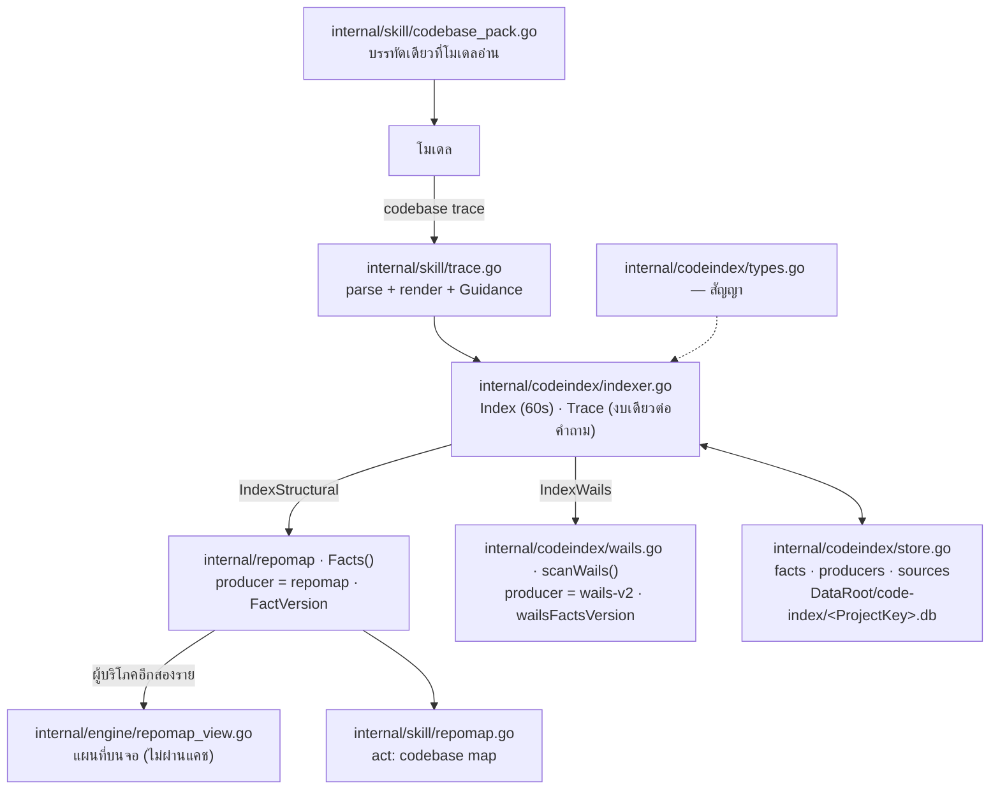
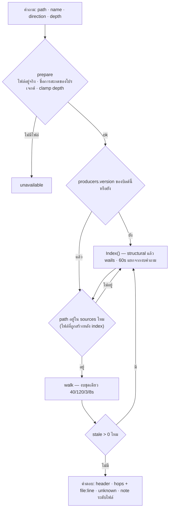

# สถาปัตยกรรมของแผนที่ความหมาย — สิ่งที่ต้องรอดเมื่อมี act ที่หก

> เอกสารยืน (living) · เขียน 16 ก.ย. 2026 · ตัดสินใจอยู่ที่ [DECISIONS §298](../DECISIONS.md) · การวัดอยู่ที่ [evidence-semantic-code-map-2026-09-15.md](evidence-semantic-code-map-2026-09-15.md)
>
> **ทำไมมีเอกสารนี้:** ระบบนี้ตัดสินความถูกต้องด้วยกฎที่มองไม่เห็นจากเส้นทางโค้ด — แคชที่ทิ้งได้แต่ต้องรู้ว่าทิ้งอะไรไป,
> fact ที่ต้องพกหลักฐานสองปลาย, และงบที่กัดได้สี่ด้านพร้อมกัน เอกสารนี้ไม่ได้บอกว่ามีไฟล์อะไร (โค้ดบอกเองได้)
> แต่บอกว่า **อะไรจะพังเมื่อมี act ที่หก มีผู้ผลิตตัวที่สอง หรือมีผู้บริโภคอีกราย และอะไรจับได้ อะไรจับไม่ได้**

---

## 0. ขอบเขตของรอบนี้

| | |
|---|---|
| ระดับ pass | **Focus Mode** — ระบบเดียว: `internal/codeindex` + ผู้บริโภคหนึ่งราย + บรรทัดในแพ็ก |
| ทำไมไม่ใช่ Scan | ระบบมีสี่ชั้น (สัญญา · แคช · การเดิน · อะแดปเตอร์), มี persistence และมีกฎความถูกต้องที่ข้ามชั้น — และต้องส่งต่อให้ Wave B |
| ทำไมไม่ใช่ Full | ระบบมีผู้บริโภคหนึ่งราย (`internal/skill/trace.go`) และไม่มี UI ของตัวเอง จึงไม่ใช่การ map ทั้งระบบ |
| สำรวจแล้ว | `internal/codeindex/{types,store,indexer,wails}.go` · `internal/repomap/graph.go` (ผู้ผลิตโครงสร้าง) · `internal/skill/{trace,codebase_pack,dispatcher}.go` · `internal/skill/packed.go` (narrow) · เทสต์ 28 ตัวใน `internal/codeindex` + `block_standard_test.go` · รันจริงบนรีโปนี้ (แคชเย็นและอุ่น) |
| ข้ามไป และไม่ถูกประเมิน | Wave B/C ที่ยังไม่มีโค้ด: LSP call hierarchy, การเดินแบบเรียกซ้ำ, `test_reference`, UI evidence drawer, locale · ส่วนของ `repomap` ที่ป้อน UI (`internal/engine/repomap_view.go`) ถูกอ่านเท่าที่จำเป็นต่อขอบเขตนี้ |
| บริบทเดิมที่ใช้ซ้ำ | เอกสารดีไซน์ + §298.1–.4 (การวัด) · ไม่ได้ re-map ส่วนที่เอกสารเดิมครอบแล้ว |

---

## 1. หลักการเดียวที่ทุกอย่างตามมา

> **ต้นไม้ซอร์สคือความจริง ฐานข้อมูลคือแคชที่ทิ้งได้ และทุกความสัมพันธ์ต้องพก "รู้ได้ยังไง" มาด้วย**

สามผลที่ตามมา และทุกหัวข้อในเอกสารนี้คือหนึ่งในสาม:

1. **แคชทิ้งได้** — schema ไม่ตรง (`cacheSchemaVersion`, `store.go:19`) แล้วลบไฟล์ทิ้งทั้งไฟล์ (`store.go:126-135`) ไม่มี migration ไม่มีการเก็บกวาดข้อมูล
   ดังนั้นการสร้างใหม่ต้องถูกเสมอ (cold 19.2s บนรีโปนี้) และทุกอย่างที่ทำให้ "ไม่ต้องสร้างใหม่" คือการจ่ายล่วงหน้าเพื่อความเร็ว
2. **ต้นไม้คือความจริง** — fact ที่ปลายทางใดปลายทางหนึ่งถูกแก้ จะถูกตัดออกและนับเป็น `stale` แล้ว index ถูกสร้างใหม่หนึ่งครั้งก่อนตอบ (`indexer.go:274-284`)
   แคชไม่มีสิทธิ์เถียงกับไฟล์ และคำตอบที่มาจากแคชที่เขย่าแล้วคือคำตอบที่ผิด ไม่ใช่คำตอบที่เร็วกว่า
3. **หลักฐานคือส่วนหนึ่งของคำตอบ** — ไม่มี fact ที่ไม่มี `From`/`To`/`Relation`/`Strength`/`Producer` (`types.go:46-52`) และคำตอบที่งบกัดต้องบอกว่างบกัด (`outcome=partial` + reason) ไม่ใช่ตัดเงียบ

---

## 2. ชั้นของระบบ — อะไรนิ่ง อะไรขยับ

| ชั้น | ไฟล์ | เปลี่ยนเมื่อ | ใครเปลี่ยน |
|---|---|---|---|
| **สัญญา** | `codeindex/types.go` | มีคำศัพท์ใหม่ (strength/relation/outcome) หรือฟิลด์ของ `Result` — **การเปลี่ยนที่นี่คือการเปลี่ยนสิ่งที่ทุกชั้นสัญญาไว้** | คนที่เพิ่มความสามารถ |
| **แคช** | `codeindex/store.go` | กฎการเก็บ/ตัดสิน fact เปลี่ยน → ต้องขยับ `cacheSchemaVersion` | คนที่แก้สคีมา |
| **การเดิน** | `codeindex/indexer.go` | งบ, ลำดับการสร้าง index, กฎการแคบ node ตามบรรทัด | คนที่แก้การเดิน |
| **ผู้ผลิตตัวแรก (semantic)** | `codeindex/wails.go` | รูปร่าง binding ที่รับ, กฎการจับคู่, **บรรทัดที่บันทึก hop** → ต้องขยับ `wailsFactsVersion` | คนที่แก้ adapter |
| **ผู้ผลิตโครงสร้าง** | `repomap/graph.go` (`Facts`, `FactVersion`) | การอ่าน import/symbol เปลี่ยน → ต้องขยับ `FactVersion` | คนที่แก้ repomap |
| **ปากทาง (act)** | `skill/trace.go` | การแสดงผล, คำอธิบาย, `Guidance()` | คนที่แก้คำหรือรูปแบบคำตอบ |
| **บรรทัดที่โมเดลเห็น** | `skill/codebase_pack.go` | มี act ใหม่ หรือบรรทัดของ act ต้องสื่ออะไรเพิ่ม — **ถูกจำกัดด้วย ratchet** | คนที่แก้คำในบล็อก |

**กฎการแยก:** ผู้ผลิตไม่รู้จักแคชและไม่รู้จักเครื่องมือ · แคชไม่รู้จักภาษาและไม่ตัดสินความหมาย · การเดินไม่รู้จักการแสดงผล (มันคืน `Result`) · act ไม่รู้จักสคีมา (มันเรียก `Indexer`)
`codeindex` ไม่ถูกนำเข้าโดย `engine` หรือ `desktop` เลยในวันนี้ — ผู้นำเข้ามีไฟล์เดียว: `internal/skill/trace.go:3`

---

## 3. แผนผังโมดูล



สองข้อเท็จจริงที่แผนผังนี้บอก และทั้งคู่เป็นเจตนา ไม่ใช่อุบัติเหตุ:

- **`repomap` ถูกใช้สามที่ และเป็นแหล่งความจริงเดียวของความสัมพันธ์เชิงโครงสร้าง** — แผนที่บนจอ, act `map` และผู้ผลิตของแคชอ่านการเดินเดียวกัน ถ้ามันเปลี่ยน ทั้งสามเปลี่ยนพร้อมกัน (และ `FactVersion` คือสิ่งที่บอกแคชว่าเปลี่ยนแล้ว)
- **จอยังไม่พึ่งหลักฐาน** — `engine/repomap_view.go` เดิน `repomap` ตรง ๆ ไม่ผ่านแคช ไม่มี `file:line` ต่อ hop และไม่มีการรายงาน `unknown` (ดู F6)

---

## 4. สัญญาความจริง — ห้าอย่างที่ต้องเป็นจริงพร้อมกัน

**4.1 ตัวตนของเนื้อหาสองปลาย** — ทุกแถวใน `facts` พก `size`, `mtime`, `sha256` ของทั้งสองปลาย (`store.go:35-40`)
`size`+`mtime` เป็นด่านแรกที่ถูก และ SHA-256 ตัดสินว่าเปลี่ยนจริง (`store.go:518` `stampMatches`) แถวที่ปลายใดปลายหนึ่งไม่ตรงถูกตัด, นับเป็น `stale` และรายงาน

**4.2 ตัวตนของโค้ดที่ตัดสิน** — `producers.version` (`store.go:58`) เทียบกับเวอร์ชันของบิลด์ที่ถาม (`store.go:314` `Indexed`)
`repomap.FactVersion = "1"` (`repomap/graph.go:137`) และ `wailsFactsVersion = "1"` (`wails.go:23`) พร้อมกฎการขยับเขียนไว้ข้างค่าคงที่
**นี่คือส่วนที่เปราะที่สุดของทั้งระบบ: กฎมี แต่ไม่มีกลไกบังคับ** (ดู F3)

**4.3 คำศัพท์ของผลลัพธ์** (`types.go:63-78`) — `complete` · `partial` · `unsupported` · `unavailable` · `failed`
และกฎที่ห้ามละเมิด: **คำตอบว่างกับคำตอบที่ยังไม่ได้ตรวจคือคนละประโยค** — เส้นทางที่พิมพ์ผิดคืน `unavailable` (`indexer.go:328` prepare) ไฟล์ที่ index ไม่อ่านคืน `unsupported` (`indexer.go:263-268`) และไฟล์ที่ถูกสร้างหลัง index ถูก index ซ้ำก่อนตอบ (`indexer.go:249-262`)

**4.4 คำศัพท์ของความแข็งแรงและชนิด** (`types.go:9-28`) — `syntactic`/`resolved`/`possible`/`observed`/`heuristic` และ `import`/`call`/`reference`/`wails_rpc`/`test_reference`
`test_reference` มีไว้เพราะ static analysis บอกได้แค่ว่า "เทสต์อ้างถึงชื่อนี้" ไม่ใช่ "โค้ดนี้ถูกเรียกจริง" — คำว่า `covered_by_test` ต้องรอ runtime

**4.5 งบ** (`types.go:90-105`) — 40 requests · 120 facts · depth 3 · 8 วินาที **ต่อคำถามทั้งคำถาม ไม่ใช่ต่อขอบ** และแยกจาก 60 วินาทีของการสร้าง index (`indexer.go:36`)
`DefaultDepth()` คืนเพดานของงบเอง เพราะการเดินหยุดเองเมื่อระดับหนึ่งไม่มีขอบเหลือ — ความลึกที่ไม่ต้องใช้จึงไม่คิดราคา (เหตุผลเต็มอยู่ที่ `types.go:107-140`)

---

## 5. การไหลของคำถาม



| เส้นทาง | บนรีโปนี้ | ทำไม |
|---|---|---|
| เย็น (คำถามแรกในโปรเจกต์) | 19.2–26.0s | สร้าง index ทั้งโปรเจกต์: repomap ทั้งต้นไม้ + สแกน Wails สองชั้น |
| อุ่น (คำถามเดิมหรือโปรเจกต์ไม่เปลี่ยน) | **11ms** | `Indexed()` ผ่านทั้งสองผู้ผลิต → ไม่แตะ index เลย · `rebuilt=false` |
| ปลายทางเปลี่ยน | 19s + คำตอบใหม่ | `stale>0` → สร้างใหม่หนึ่งครั้งแล้วเดินซ้ำ |

ขนาดจริงของแคช: **8.2 MiB** (`semantic-code-map-<ProjectKey>.db`, 8,556,544 bytes) สำหรับรีโปนี้ — วัด 16 ก.ย. จากแคชเย็น ทิ้งได้ทั้งไฟล์โดยไม่เสียอะไรนอกจากเวลา

---

## 6. ค่าคงที่ที่ห้ามพัง และเทสต์ที่ปักไว้

| # | ค่าคงที่ | เทสต์ที่ปัก |
|---|---|---|
| 1 | fact ที่ปลายทางใดปลายทางหนึ่งเปลี่ยนแล้วถูกใช้ไม่ได้ | `TestStoreKeepsOnlyFactsBothEndpointsStillMatch` |
| 2 | ผู้ผลิตเขียนทับของตัวเองทั้งชุด — ไฟล์ที่หยุดผลิตต้องไม่มีแถวค้าง | `TestReplaceProducerDropsRowsForSourcesThatStoppedProducing` |
| 3 | ผู้ผลิตหนึ่งลบ fact ของอีกผู้ผลิตไม่ได้ | `TestReplaceProducerLeavesOtherAnalyzersAlone` |
| 4 | แคชไม่เก็บเส้นทางนอกรีโป | `TestStoreRefusesPathsOutsideTheProject` |
| 5 | แคชที่เขียนด้วยบิลด์อื่นต้องไม่ถูกอ่านเป็นของสด | `TestStoreDistinguishesTheVersionThatWroteItsRows`, `TestTraceRebuildsWhenTheAnalyzerVersionChanged` |
| 6 | คำถามบนโปรเจกต์ที่ไม่เปลี่ยนไม่ทำงาน index เลย | `TestSecondTraceOnAnUnchangedProjectDoesNoIndexWork` |
| 7 | ไฟล์ที่ถูกแก้ภายใต้แคชต้องทำให้สร้างใหม่ | `TestTraceRebuildsWhenAFileChangedUnderIt` |
| 8 | ไฟล์ที่ถูกสร้างหลัง index ต้องไม่ถูกตอบว่า "ไม่มีอะไรต่อกับมัน" | `TestTraceIndexesAFileCreatedAfterTheIndex` |
| 9 | ไฟล์ที่ index ไม่อ่าน (เช่น `.txt`) ต้องบอกว่าตัวเองคืออะไร | `TestTraceSaysWhenAFileIsNotOneTheIndexReads` |
| 10 | เส้นทางที่พิมพ์ผิดต้องเป็น `unavailable` ไม่ใช่คำตอบว่าง | `TestTraceRefusesAStartPathThatIsNotThere` |
| 11 | depth ที่ถูก clamp ต้องรายงาน และต้องรายงานระดับที่เข้าไปจริง | `TestTraceSaysWhenTheDepthWasClamped`, `TestTraceReportsTheLevelsItActuallyEntered` |
| 12 | hop ระดับไฟล์ต้องถูกนับ แม้การเดินจะถูตรงบ | `TestAClippedWalkStillCountsItsFileLevelHops` |
| 13 | การเดินตามชื่อต้องแคบลงตามบรรทัดที่มาถึง และไม่ทิ้งชื่อเมื่อข้าม hop ระดับไฟล์ | `TestWalkFollowsTheEdgesWrittenAtTheLineItArrivedOn`, `TestWalkKeepsTheNameItIsFollowingAcrossAFileLevelHop` |
| 14 | binding ที่จับคู่ไม่ได้ต้องเป็น unknown ไม่ใช่การเดา | `TestIndexWailsReportsUnpairedBindingsAsUnknown` |
| 15 | `wailsjs/go/models` (โมดูลที่ไม่มีจริง) ต้องไม่ถูกนับเป็น unknown | `TestIndexWailsIgnoresModulesThatNameNoBinding` |
| 16 | คอมเมนต์ไม่ใช่ความสัมพันธ์ | `TestCallSitesSkipCommentLines`, `TestCommentedOutImportsAndCallsAreNotRelationships` |
| 17 | บรรทัดที่โมเดลอ่าน (`codebase`) หดได้ โตไม่ได้ | `TestToolBlockEntriesCarryOnlyExistenceAndSignature` |

---

## 7. สิ่งที่พบ

> ทุกข้อมีหลักฐาน · ทุกระดับความรุนแรงเป็นข้อสังเกต ไม่ใช่ใบอนุญาตให้รื้อ · ทิศทางที่เสนอทุกข้อ **ต้องได้รับการอนุมัติก่อนลงมือ**

**F1 — ชื่อที่ adapter จับคู่ไม่ได้ ทำให้คำตอบท่วมด้วยขอบของไฟล์** · ระดับ: Medium · ความเชื่อมั่น: Direct
หลักฐาน: `repomap.Facts` เขียนหนึ่ง fact ต่อหนึ่งบรรทัดที่เขียนจริงโดยไม่บันทึกชื่อที่เขียนบนบรรทัดนั้น · `preferNamedFacts` (`indexer.go:553`) จึงแคบไม่ได้เมื่อ node ไม่มีชื่อ — วัดได้ 120 hop `partial` (§298.2, §298.3)
ผลกระทบ: คำถามประเภทหนึ่ง (ชื่อที่ประกาศซ้ำแบบ build tag, dispatch ที่ adapter อ่านไม่ออก) ได้คำตอบที่ถูกแต่ใช้ไม่ได้ และ hop ที่ต้องการจมอยู่กลางรายการ
ทิศทางที่เสนอ: ให้ผู้ผลิตบันทึกชื่อบนบรรทัดของ fact (`repomap.Facts`) แล้วตัวเดินแคบตามชื่อได้ — งานฝั่งผู้ผลิต ไม่ใช่ฝั่งตัวเดิน และต้องขยับ `FactVersion` · Wave B

**F2 — คำอธิบายของ act เดียวกันมีสองที่ และมีที่เดียวที่ถูกอ่าน** · ระดับ: Medium · ความเชื่อมั่น: Direct
หลักฐาน: `traceSkill.ToolDefinition()` (`trace.go:44-89`) ไม่มีผู้เรียกในรีโป — ตัวเรียก `.ToolDefinition()` ที่ไม่ใช่เทสต์มีที่เดียวคือ `dispatcher.go:223` ซึ่งวนจาก registry และ act นี้ไม่เคยถูกขึ้นทะเบียน (ถูกสร้างเป็น inner ที่ `codebase_pack.go:96`) · บรรทัดจริงที่โมเดลเห็นคือ `codebase_pack.go:111`
ผลกระทบ: ประโยคที่อธิบายการข้ามกำแพง Wails อยู่สองที่ และการแก้ที่ผิดที่จะไม่ปรากฏในคำตอบของโมเดลเลย (นี่คือเหตุที่ act ถูกเรียก 1 ใน 3 เทิร์น)
ทิศทางที่เสนอ: ให้แพ็กสร้างบรรทัดของตัวเองจาก inner definition (หรือยกเลิก `ToolDefinition()` ของ act ที่อยู่ในแพ็กทั้งหมด) — กระทบทุกแพ็ก ต้องอนุมัติ · **ไม่ควรทำเฉพาะ `trace`** เพราะจะเหลือ act เดียวที่ทำต่างจากพี่น้อง

**F3 — เวอร์ชันผู้ผลิตเป็นค่าคงที่ที่คนต้องขยับเอง ไม่มีกลไกบังคับ** · ระดับ: Medium · ความเชื่อมั่น: Direct
หลักฐาน: `wailsFactsVersion` (`wails.go:23`) และ `FactVersion` (`repomap/graph.go:137`) มีกฎการขยับเขียนข้างค่า และไม่มีอะไรตรวจว่ากฎนั้นถูกทำตาม
ผลกระทบ: ลืมขยับหนึ่งครั้ง = fact ของบิลด์เก่าถูกอ่านเป็นของสด — ความพ่ายแพ้ชนิดเดียวกับที่ทำให้ตัวเลข `3 กับ 103` แยกกันไม่ได้ใน §298.2
ทิศทางที่เสนอ: เทสต์ที่ปักค่าเวอร์ชันปัจจุบันของแต่ละผู้ผลิตพร้อมตารางและวันที่ที่ขยับล่าสุด ทำให้การเปลี่ยนเป็นเจตนาที่ต้องแก้เทสต์ · (ทางเลือกที่หนักกว่า: ผูกเวอร์ชันกับ hash ของไฟล์ผู้ผลิต — ยังไม่แนะนำ)

**F4 — เครื่องมือวัดเองก็เป็นกับดัก** · ระดับ: Medium · ความเชื่อมั่น: Direct
หลักฐาน: `Packed.Narrow` รับ**ชื่อสิทธิ์** ไม่ใช่ชื่อ action (`packed.go:453-467`) และ silence rule คืนทั้งแพ็กเมื่อไม่ตรงเลย — คอมเมนต์ใน `block_standard_test.go` จึงอ้าง "179 (สี่ act) / 324 (ห้า act)" มาตั้งแต่ 15 ก.ย. ทั้งที่เป็นแพ็ก "symbol เท่านั้น" กับ "symbol+trace" (ค่าจริง: 317 และ 463)
ผลกระทบ: การวัดที่ผิดมาถึงในรูปตัวเลขที่เล็กลง ไม่เคยมาในรูป error — และตัวเลขที่ผิดนั้นถูกเขียนลงเอกสาร
ทิศทางที่เสนอ: `narrow` ควรปฏิเสธชื่อที่เป็น action ของแพ็กแต่ไม่ใช่ชื่อสิทธิ์ (กระทบทุกแพ็ก ต้องอนุมัติ)

**F5 — ratchet ของบล็อกเป็นด้านเดียว** · ระดับ: Low · ความเชื่อมั่น: Direct
หลักฐาน: เทสต์ล้มเมื่อ `tokens > was` เท่านั้น pin ที่สูงกว่าของจริงผ่านเงียบ ๆ — 477 อยู่เหนือ 474 หนึ่งวัน (`fdec8404` ย่อบรรทัดแต่ไม่ย้าย pin)
ผลกระทบ: ตัวเลขที่ pin ไว้ไม่ใช่ตัวเลขของจริง และการโต 3 token ไม่ต้องมีใครอธิบาย
ทิศทางที่เสนอ: ไม่แก้โค้ด — คอมเมนต์ข้าง pin มีคำสั่งวัดกำกับแล้ว และค่าปัจจุบันตั้งไว้ที่ค่าที่วัดได้ (463)

**F6 — ผู้บริโภคมีรายเดียว และจอยังไม่พึ่งหลักฐาน** · ระดับ: Low · ความเชื่อมั่น: Direct
หลักฐาน: `codeindex` ถูกนำเข้าโดย `internal/skill/trace.go:3` เท่านั้น · `engine/repomap_view.go` ยังเดิน `repomap` ตรง ๆ
ผลกระทบ: ไม่มี — เป็นเจตนา (Wave C: evidence drawer) แต่ถ้าไม่จดไว้ มันจะกลายเป็นความบังเอิญที่ไม่มีใครรู้ว่าตัดสินไว้แล้ว
ทิศทางที่เสนอ: คงไว้ และรักษาสถานะ "ตัดสินแล้ว" ด้วยบรรทัดนี้

**F7 — เส้นทางตายค้างในคอมเมนต์ 8 ไฟล์** · ระดับ: Low · ความเชื่อมั่น: Direct
หลักฐาน: `131a0c6d` ย้าย engine ออกจาก `desktop/` แต่ `desktop/tool_budget_test.go` ยังถูกอ้างใน 6 ไฟล์ Go — `internal/connect/connect.go:164`, `internal/mode/stance.go:53`, `internal/prompt/budget_test.go:10`, `internal/skill/n8n_tools.go:38`, `internal/skill/bundled_skills.go:24`, `internal/engine/delegate_switch.go:297` — และ `COMPANY.md:101` กับอีก 8 ที่ในเอกสาร (นับจาก `grep -rn` วันนี้) · สองที่ที่อยู่ใน `block_standard_test.go` แก้แล้วในรอบนี้
ผลกระทบ: คนอ่านตามไปหาที่ไม่มีอยู่
ทิศทางที่เสนอ: กวาดหนึ่งรอบในคอมมิตแยก ไม่ใช่ของ change นี้

---

## 8. คำถามเปิด และความเสี่ยง

**คำถามเปิด**
- **ไม่มีอะไรลบแคชของโปรเจกต์ที่ไม่มีแล้ว** — ยังไม่พบกลไกใดนอกจากลบเมื่อ schema ไม่ตรง (`store.go:128`) · แคชหนึ่งโปรเจกต์บนรีโปนี้ 8.2 MiB · ยังไม่ได้ตรวจว่ามีกี่โปรเจกต์บนเครื่องจริง (Unverified)
- **การเดินที่หยุดเพราะงบ fact (120) จะพบบ่อยแค่ไหนในโปรเจกต์ที่ไม่ใช่รีโปนี้** — ยังไม่วัด (Unverified)
- **โมเดลหยิบ act นี้ไปใช้จริงหรือไม่** — ไม่มีตัวเลขก่อน 22 ก.ย.

**ความเสี่ยง**
- **R1 · ด่านจะอ่านศูนย์ด้วยเหตุที่ไม่เกี่ยวกับฟีเจอร์** ถ้าบิลด์ที่ใช้จริงในหน้าต่างวัดไม่ใช่สาขานี้ · ตอนนี้สาขาอยู่บน `main` แล้ว (rebase เสร็จ, นำ 8 คอมมิต นำ 0 ตาม) และ fast-forward ได้ · **การย้ายขึ้น `main` เป็นการตัดสินใจของคุณ** และขัดกับกติกาเดิมข้อ "ไม่ผ่านก็ไม่ merge" — ทางออกที่ตรงคือ merge ชั่วคราวเพื่อวัดแล้วย้อนได้ ถ้าไม่ผ่าน
- **R2 · ผู้ผลิตที่รันแล้วได้ศูนย์ fact แยกไม่ออกจากโปรเจกต์ที่ไม่มีความสัมพันธ์นั้น** — `producers` มีแถว, `sources` มีไฟล์, แต่จำนวน fact เท่ากับศูนย์คือคำตอบที่ถูกต้องของทั้งสองกรณี · ระดับ Low (ยังไม่พบเส้นทางที่ทำให้เกิด) แต่ควรรู้ก่อนมีผู้ผลิตตัวที่สอง
- **R3 · อะแดปเตอร์ Wails เป็นผู้ผลิตตัวเดียว และมันรับรู้รูปแบบเดียว** — โปรเจกต์ที่ generate ต่างออกไปจะไม่มี fact ข้ามกำแพงเลย และ `unknown` จะเป็นตัวบอก (ไม่ใช่ `failed`) ซึ่งถูกต้อง แต่ผู้ใช้ต้องอ่านให้ออก

---

## 9. งานถัดไป และวิธีวัดซ้ำ

**วัดซ้ำ (สองคำสั่งที่ต้องใช้บ่อยที่สุด)**
```
go test ./internal/skill -run TestToolBlockEntriesCarryOnlyExistenceAndSignature -v   # ขนาดบล็อก + ratchet
go test ./internal/codeindex -run 'TestWalk|TestTrace' -v                            # กฎการเดิน
```
การวัดขนาดของ act เทียบกับแพ็กสี่ act ต้องใช้ `Packed.Narrow` กับ **ชื่อสิทธิ์** (`diagnostics`, `symbol`, `repo_map`, `design_check`) — ส่งชื่อ action แล้วจะได้ตัวเลขของแพ็กอื่น (F4)
การเทียบคำตอบเก่ากับใหม่ใช้ฮาร์เนสชั่วคราวที่เรียก `skill.NewDispatcher` แล้ว `ExecuteTool` ตรง ๆ บนสอง worktree (ของบิลด์เก่าและใหม่) — รัน 16 ก.ย. ด้วยวิธีนี้ (`scratch/compare/main.go` เป็นของใช้แล้วทิ้ง ไม่ได้อยู่ใน git)

**งานถัดไปที่ปลอดภัย (เรียงตามความคุ้ม)**
1. **การตัดสินใจของคุณ:** ย้ายสาขาขึ้น `main` เพื่อให้ด่านวันที่ 22 วัดได้จริง (R1)
2. Wave B เรียงตามที่ตกลง: LSP call hierarchy → การเดินแบบเรียกซ้ำ → `test_reference` — และ F1 ต้องแก้ที่ผู้ผลิต `repomap.Facts` ก่อนการเดินจะแคบลงได้จริง
3. F3 (เทสต์ปักเวอร์ชันผู้ผลิต) — เล็ก ทำได้ทันที และปิดความเสี่ยงที่แพงที่สุดของแคช
4. F7 (กวาดเส้นทางตาย) — คอมมิตแยก ไม่ผูกกับฟีเจอร์

---

## 10. Validation gate

1. **Claim traceability** — ทุกข้อเท็จจริงในเอกสารนี้ชี้ไฟล์:บรรทัดหรือการวัดที่รันเองในวันนี้ · ข้อที่ยังไม่ได้ตรวจถูกทำเครื่องหมาย `Unverified` (คำถามเปิดสองข้อแรก)
2. **Scope alignment** — ตรงกับขอบเขตตอนรับงาน (Focus Mode, ระบบเดียว) ไม่มีการขยาย
3. **Handoff readiness** — คำถามเปิด ความเสี่ยง และงานถัดไปอยู่ใน §8–9 พร้อมคำสั่งวัดซ้ำ
4. **Pass level** — ระบุใน §0 พร้อมเหตุผลว่าทำไมไม่ใช่ Scan และไม่ใช่ Full
5. **Inspection scope** — ระบุใน §0 รวมสิ่งที่ข้าม
6. **Skipped areas** — ระบุใน §0 (Wave B/C ที่ยังไม่มีโค้ด)

**สิ่งที่เอกสารนี้ไม่ใช่:** ไม่ใช่ที่เก็บเหตุผลการตัดสินใจ (อยู่ที่ §298) ไม่ใช่ที่เก็บตัวเลขการวัด (อยู่ที่เอกสารดีไซน์) และไม่ใช่แผนงาน — มันคือคำตอบของคำถามเดียว: *เมื่อมีคนแก้ระบบนี้ครั้งหน้า อะไรจะพัง และอะไรจะจับได้*
